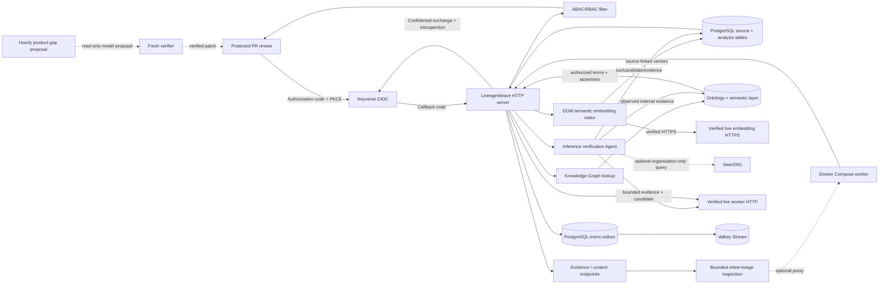

# LineageWeave architecture

LineageWeave is a separate product. PostgreSQL is the source and persistence
boundary; the browser receives only server-filtered data. TEPP and any LLM
orchestrator are HTTP concerns, not imports or database shortcuts.

The product has two intentionally different authenticated surfaces. General
users enter 업무 홈, then use 업무공간 for evidence-backed posts/events and
reports or 고객 화면 for the evidence-bound customer master. Administrator
controls are a separate role-gated mode; technical counts, queue health,
access policy, Lineage overrides, enrichment, TEPP requests, and Keyverse
account administration do not appear in the reader navigation.

## Runtime flow

1. `LineageApplication` validates the source table identifier and reads a
   bounded direct-PostgreSQL projection. It records content byte length, a
   short prefix, and a database-computed inline-image/markup marker; it does
   not select large content into the graph snapshot.
2. `build_payload()` creates document and row lineage. Only observed
   `row_successor` edges are chronological transitions. A shared thread
   identifier, `topic_affinity`, and affiliate relations are inferred
   relatedness. The detail projection puts
   observed events in `event_lineage.beads` and non-transition relations in
   `event_lineage.relatedness`; the latter never shares the chronological
   chain layout.
3. `build_knowledge_graph()` creates opaque document, event, person,
   organization, and PU nodes. Source actors are keyed by legal company and
   identity, then attached to every observed PU. It emits explicit
   cross-PU/cross-company relations with evidence IDs. Customer-master nodes
   and affiliate edges enter only with explicit source-document references.
   R&R keeps either a person or organization as the agent. A document points
   to a PROV qualified attribution, which points directionally to that agent
   and a PROV role; a person's supported organization/title is separately
   represented by ORG Membership. Organization, rank, and title qualify person
   identifiers so same-name people are not merged by label alone.
4. The snapshot and KG are persisted in `analysis_*` tables. A normalized
   semantic layer stores RDF type assignments, standards-backed terms,
   domain/range rules, and evidence-preserving predicate assertions. Overrides
   and tickets are PostgreSQL records, not browser-local state.
   Full replacements use a transaction-scoped advisory lock and MVCC-friendly
   `DELETE` ordering so a long rebuild does not block ordinary document reads;
   both replacement entry points merge verified organization aliases from the
   normalized review ledger before deleting old KG rows. Versioned staging is
   the next scale upgrade if delete/vacuum cost warrants it.
5. An author, editor, or admin with `manage_lineage` may request verification
   of up to sixteen inferred/predicted relationships in an authorized document.
   The Agent gathers observed internal KG evidence and, only when two nearby
   organization labels exist, optional SearXNG evidence. The live product LLM
   returns only `verified`, `rejected`, or `insufficient` with supplied evidence
   IDs. Its verdict is persisted separately and cannot promote the source edge
   or turn it into a temporal transition.
   Organization-alias resolution uses the same boundary with an
   organization-only SearXNG query. A verified alias is persisted as one
   directional inferred `skos:exactMatch` assertion through a bounded KG
   upsert only when the cited search text contains the proposed canonical
   organization; an LLM-only or conflicting candidate stays unresolved.
   The request never loads or rewrites the complete graph.
6. `GET /api/login` starts Keyverse authorization code with S256 PKCE.
   `actor_for_request()` accepts an opaque, token-bounded OIDC session, a
   Keyverse-introspected bearer token, or an explicitly enabled local
   development actor. It maps verified `sub`/`org`/`workspace`/`role` claims
   to the product actor. `filter_payload_for_actor()` removes
   unauthorized document and row nodes, then `_filter_knowledge_graph_for_documents()`
   removes KG nodes scoped only to hidden documents, redacts hidden document
   references from retained shared nodes, and suppresses relations whose
   evidence is outside the actor-visible document/row/thread scope.
   `GET /api/customers` applies the same document-evidence filter to the
   normalized customer master before the dedicated customer screen receives
   account names, affiliate edges, or source-document links. The administrator
   screen is a separate authenticated view: its account routes require the
   verified `admin` role, scope exposure to the actor's corp or unassigned
   provisioning queue, and write only `org`, `workspace`, and direct roles on
   the reviewed `lineageweave-web` client through Keyverse Admin REST.
   The default authenticated route is the reader-friendly `업무 홈`: it
   summarizes recent work, evidence-backed customer accounts, reports, and the
   actor's effective scope. Technical counts and event-queue diagnostics are
   administrator-only workspace context; they are not the general-user home.
7. Administrator Lineage review is a separate server-authorized operation.
   `GET /api/admin/lineage/edges` lists only same-corp inferred/predicted
   candidates. `POST /api/admin/lineage/edges/override` persists a normalized
   decision in `analysis_lineage_edge_overrides`, applies it to both the
   document Lineage and document KG projection, and rejects observed
   transitions. The correction is durable and auditable; it is never a
   browser-only sort or filter.
8. Mutations are committed with an `analysis_event_outbox` record, then flushed
   to the `lineageweave_events` Valkey Stream. Delivery is at-least-once; an
   unavailable Valkey leaves the durable outbox pending for retry.
9. An author, editor, or admin can inspect a document-local raster asset. The
   server validates MIME, strict base64, magic bytes, and a 50 MiB decoded-size
   ceiling before the model call. It persists OCR and labels in normalized
   tables, matches results to the current SHA-256 digest, and emits a
   metadata-only outbox event.
10. React loads analytics and a paged document index. Its search query is
   evaluated by PostgreSQL inside the already-authorized corp/PU scope, so it
   searches the full visible corpus rather than only the current browser page.
   Selecting a document
   opens the popup and loads its detail, content manifest, evidence drawer,
   chat citations, and KG neighborhoods through document-scoped API routes.
11. Before event chat calls the live model, the server queries PostgreSQL for
   terms and relation assertions whose KG node IDs survived actor filtering.
   It fails closed when that semantic context is absent; the model never
   receives a wider graph or raw source bytes.
12. The direct model boundary is task-aware: only two-sided Keyman extraction
   uses the Keyman adapter. Evidence-bounded subject-role classification,
   organization-aware R&R, appointment extraction, customer-master updates,
   issue work-item copy, and report judging use the general OpenAI-compatible
   chat contract with an allowlisted task schema. Subject classification can
   only select a `common_enum_values.entity_role` value and falls back to the
   observed-title classifier when the model abstains; it never creates a
   chronology edge.
13. Research provenance is separate from the product graph. Method-paper
    metadata is written to the operator's Local Zotero Connector; when
    `LINEAGEWEAVE_ZOTERO_ATTACHMENTS=1`, the bounded OA original is uploaded
    through the Connector's `sessionID`/`X-Metadata` attachment contract and its
    SHA-256 plus outcome are persisted in PostgreSQL. Failed attachment writes
    remain visibly failed and never become a stored claim. Repeated runs first
    reuse an exact title/source parent and accept its child attachment only when
    the source URL and downloaded digest match.
14. A manager may index one authorized document's persisted DOM semantic text
    through the verified embedding gateway. The model catalog and vector links
    are normalized in PostgreSQL and retain their content-block evidence
    linkage. Reader retrieval compares only already-authorized documents under
    a bounded neighbor cap and provisional 0.50 relevance floor, then labels
    every result as inferred semantic relatedness, never as an observed
    document transition.

15. Weekly/monthly PU, team, and project reports send `report_id` as the
    psychometric observation group. This keeps repeated organizational labels
    from mixing time windows before the separate fast-mlsirm FIPC/CAT boundary
    returns package-produced linked scores. The local connector exercises its
    Rust-backed EAP path; no upstream numerical implementation is copied here.
    LineageWeave contains no in-process EAP, CAT, FIPC, or recorded-response
    substitute: an absent, malformed, diagnostic-only, or disconnected
    connector produces an explicit `unavailable` linking state and no score
    rows. This prevents a Python convenience estimate from being presented as
    the required Rust/GPU/CPU psychometric result.
    Each live Judge slice has an independent three-attempt budget, so a
    transient failure does not disable subsequent slices.

    When the configured fast-mlsirm connector exports its longitudinal state
    boundary, each report retains exact period ordering and the product stores
    the returned state specification, run diagnostics, and occasion estimates
    in `analysis_longitudinal_state_specs`,
    `analysis_longitudinal_state_runs`, and
    `analysis_longitudinal_state_observations`. The report JSON is a display
    envelope, not the only source of psychometric parameters. A one-period
    group is stored as an identified level with no claimed trend; LineageWeave
    does not reimplement Rust arithmetic or fabricate a state when the
    connector lacks this export.

16. Report persistence reconciles each active period window and then removes
    any linked score whose report row no longer exists. This keeps FIPC/CAT
    artifacts referentially scoped to the normalized report table after a
    changed slice set or reanalysis.

17. The browser acceptance contract exercises the default home with a verified
    reader actor as well as an administrator actor. A reader receives the
    business home, document workspace, and evidence-backed customer screen;
    the administrator navigation, operational KPI strip, queue counters, and
    lineage-review controls are absent from that session and remain denied by
    the server. Detail assertions wait for the selected document response so
    a slow PostgreSQL read cannot be mistaken for an empty Lineage.
17a. General-user report cards and customer-tree labels are a presentation
    boundary, not a data rewrite. The reader maps `weekly`/`monthly`,
    `pu`/`team`/`project`, Judge verdicts, score-linking/source codes, and
    customer hierarchy tiers to Korean business vocabulary and hides generated
    slice identifiers. The raw values remain in the actor-filtered API
    contract and administrator audit path for traceability; they are not
    rendered as reader-facing implementation labels. For project reports,
    `slice_label` is computed at response time from the first title or Korean
    summary in the report's actor-authorized evidence documents. PU and team
    labels use their business attribute codes. Missing evidence produces no
    project label rather than exposing the opaque project key. This is a
    presentation projection only: it is not a new Ontology class, semantic
    predicate, lineage transition, or persisted project fact.
17b. Administrator 게시글 권한 통제 uses the existing actor-authorized
    `/api/documents` index as its source, with a bounded 20-document page,
    server-side document/title/PU search, and an explicit total. The React
    administrator list can load more pages without exposing a full graph or
    bypassing the corp/PU ABAC predicate. Visibility mutations update both the
    reader index and the administrator list only after the authorized
    PostgreSQL mutation succeeds; this is a control-surface pagination rule,
    not a second permission model.
17c. A Keyman-centered KG neighborhood is an actionable reader surface. A
    related person or organization reopens its authorized neighborhood, an
    event/content node opens its authorized source evidence, and a related
    document opens the same actor-filtered document detail. The browser never
    invents a relationship or bypasses the server's persisted semantic
    subgraph; each action remains bounded by the selected node's evidence.
18. An administrator may start a bounded LLM enrichment batch through
    `POST /api/admin/enrichment/run` for `keyman`, `product`, `appointments`,
    or `all`, with a hard maximum of 64 documents. Candidate selection uses
    the same corp/PU ABAC predicate as the browser; the request is committed
    to `analysis_event_outbox` before a daemon worker loads one authorized
    document at a time. `GET /api/admin/enrichment/status` reports only
    aggregate pending counts, active run metadata, and the latest outbox
    result. Existing `user_override` Keyman data is never replaced. An empty
    live response is recorded as an explicit LLM abstention, not an invented
    person or organization, and successfully completed product fields are
    written to the normalized issue/calendar/appointment/document tables.
19. Keyman extraction first uses the configured direct live HTTP gateway. If
    that route is absent, the resolver starts or reuses the Docker Compose
    worker and sends the same Keyman request to its live-gateway proxy. The
    proxy has no issuer or recorded response path: an absent model gateway
    remains an explicit unavailable/abstention result.
20. Report judging uses one evidence-scoped live LLM call per weekly/monthly
    slice. The response contains dichotomous factor items plus four RAGAS-aligned
    evaluation metrics: faithfulness, answer relevancy, context precision, and
    context recall. Metric definitions live in `analysis_evaluation_metrics`;
    report observations live in `analysis_report_metric_scores` with the score,
    verdict, model source, and rationale; `analysis_report_metric_evidence`
    stores each evidence reference as a separate row. An unsupported metric is
    stored as `abstain` with a null score rather than being converted to a false
    zero. This is a RAGAS-aligned evidence contract, not a claim that a reference
    answer exists where the source corpus does not provide one.

## Data boundaries

| Data | Stored in KG | Returned by default | Dedicated route |
| --- | --- | --- | --- |
| Document/title/role/visibility | Yes, bounded | Authorized document detail | `/api/documents/{document}` |
| Row/event identifiers and timestamps | Yes | Authorized document detail | evidence drawer for source fields |
| People/orgs/PUs | Yes, opaque qualified IDs, labels, supported rank/title, and directed PROV/ORG assertions | Authorized KG neighborhood | `/api/documents/{document}/knowledge` |
| Ontology terms/rules/assertions | Yes, normalized semantic tables | No | actor-filtered event-chat context |
| Customer-master affiliations | Yes, only with explicit document evidence | Authorized analytics/KG scope | `/api/analytics`, `/api/documents/{document}/knowledge` |
| Customer account/affiliate screen | PostgreSQL normalized customer master | Actor-visible accounts and evidence document numbers | `/api/customers` |
| General-user business home | No separate data store; composes authorized documents, customer master, reports, and actor scope | Recent work and actionable summaries only | React `#userHome` |
| Keyverse account claims and same-client roles | Keyverse issuer, not LineageWeave | Sanitized account projection only | `/api/admin/keyverse/accounts` (admin only) |
| Document access-policy decision | `analysis_document_overrides` plus source visibility | Current actor-visible policy rows | React `#accessPolicyScreen`, `/api/documents/{document}/visibility` (admin/editor boundary) |
| Lineage override decision | `analysis_lineage_edge_overrides` | Applied to authorized document Lineage and KG only | `GET/POST /api/admin/lineage/edges*` (admin only) |
| Inline image or binary bytes | No | No | `/api/documents/{document}/assets/{index}` |
| OCR and object labels | No | Matched, authorized metadata | `/api/documents/{document}/assets/{index}/inspect`, `/api/images/search` |
| Semantic embedding vector | Source-linked PostgreSQL relation | No | `/api/documents/{document}/semantic-related` returns inferred metadata only |
| Longitudinal state specification/run/occasion estimate | Three normalized PostgreSQL tables linked to report scope | State diagnostics only | `/api/reports` and authorized report detail |
| Evaluation metric definitions | `analysis_evaluation_metrics` | No | `/api/reports` factor/metric catalog |
| RAGAS-aligned report metric score | `analysis_report_metric_scores` plus `analysis_report_metric_evidence`, keyed by report and metric | Authorized report detail only | `/api/reports` |
| Source text preview | No | No | `/api/documents/{document}/evidence/{guid}` |
| LLM event answer | No | Per request | `/api/documents/{document}/chat` |
| Inference-verification run, verdict, and evidence reference | Yes, normalized and bounded | Authorized verifier result | `/api/documents/{document}/lineage/verify` |
| Method-paper metadata and OA attachment provenance | Yes, normalized status and digest | No | Local Zotero Connector, `analysis_method_paper_records` |
| Bounded LLM enrichment run state | PostgreSQL outbox plus normalized document/work rows; no browser queue copy | Aggregate pending counts and run status for administrators only | `/api/admin/enrichment/status`, `/api/admin/enrichment/run` |
| Mutation event | No | No | `/api/queue/health` |

## Authorization

The browser cannot choose a corp, PU, or role. It starts Keyverse SSO rather
than posting a product password. The callback exchanges an authorization code
with PKCE and validates active, issuer, audience, client, expiry, subject,
organization, workspace, and mapped role claims through Keyverse
introspection. The reviewed Keyverse `lineageweave-web` profile derives
organization/workspace from the actual account and roles from its same-client
role assignment; the product accepts a verified single role or role list. The
server checks that verified actor against every document
before returning a document index or detail. The same filtered KG is used for
document and Keyman neighborhood routes, so a shared company node can appear
only when it has a visible document scope.
The index may expose the selected document's authorized corp/PU metadata for
workspace context and deterministic browser acceptance; it never grants a
mutation, and every mutation reauthorizes the full document.

Customer-master entities follow the same rule: their account-to-document link
is stored separately, and an account or affiliate relation without an explicit
source document is omitted from browser and KG responses. Event chat queries
the semantic layer only after this document scope has been established, so
ontology terms do not become a side channel around ABAC/RBAC.

Keyman actors are typed before they enter the KG. `person` is reserved for a
natural person; an institution or company is stored as `organization`; and a
meso unit such as a team or part is stored as an Organization Ontology
`OrganizationalUnit` (`team`). The normalized PostgreSQL payload preserves
`actor_name`, organization and parent-affiliation qualifiers, rank/title, and
the model's `node`, `entity`, `relationship`, and `direction` fields. The KG
uses PROV/Schema.org person or organization classes and ORG unit-of relations,
so selecting an institution cannot silently create a person node. The
administrator editor accepts the existing four-column person syntax and an
explicit typed syntax for organization/team actors.

The customer screen is available to every authenticated actor but is filtered
by document visibility and explicit customer-document evidence. The
administrator screen is hidden from non-admin React sessions and remains 403
server-side when called directly. Its server-only Admin REST adapter is
restricted to one configured realm and the exact relying-party client; it does
not expose credentials, required actions, realm roles, or arbitrary user
attributes.

Mutations require the relevant role: authors/editors/admins can change
visibility and Keyman data, create tickets, request content inspection, or
verify candidate lineage relationships; readers can inspect only what ABAC
allows. Verification also requires the `manage_lineage` decision before any
candidate, evidence, search, model, or persistence step. Event chat and source
evidence are read operations over the already authorized document.

## Operations and failure modes

- A missing source table or database connection fails the service startup or
  health check; no fallback file database is used.
- Pytest creates an exact process-owned PostgreSQL database before importing
  product tests unless `LINEAGEWEAVE_TEST_DSN` is explicitly supplied. It
  force-drops only that validated database at teardown, isolating PostgreSQL
  advisory locks and destructive snapshot fixtures from the runtime database.
- The optional `product` Compose profile builds the React bundle and product
  server. It connects directly to the configured PostgreSQL source and reaches
  Valkey and the live-worker proxy over the Compose network; it has no local
  identity authority or sample account. A local database uses the Docker host
  bridge hostname rather than container-local `localhost`; no database proxy is
  inserted. Both product and worker services optionally read the operator
  environment file `${LINEAGEWEAVE_ENV_FILE:-$HOME/.env}` so live gateway
  credentials are available without entering them in Compose YAML; the file is
  never copied into the image.
- Compose names the project `lineageweavem2` and removes only same-project
  orphan containers. SearXNG uses a pinned custom image whose entrypoint seeds
  its declared configuration volume, so Docker Desktop cannot reinterpret the
  settings file as a directory. The product, stand-in, SearXNG, and Valkey
  health checks are all required before the stack is reported ready.
- Production Keyverse endpoints and cookies require HTTPS. Local HTTP is
  accepted only when both `LINEAGEWEAVE_DEV_MODE=1` and
  `LINEAGEWEAVE_COOKIE_SECURE=0`, and only for allowlisted loopback or Docker
  host-bridge origins of an operator-provisioned Keyverse instance. The model
  worker is never in that allowlist.
- Keyman and structured product enrichment require `LLM_GATEWAY_URL` and use
  separate adapters: the two-sided Keyman contract is never used for
  appointment, customer-master, issue-work, or report-judge requests. A
  missing live gateway fails the direct enrichment path rather than routing a
  product task through the Keyman endpoint. The Compose proxy remains limited
  to supported event-chat and image-inspection paths and never returns a
  recorded or fabricated identity or model answer.
- The administrator enrichment controls are bounded to 64 documents per
  request and are server-side role/corp scoped. The durable request event is
  written before the background worker starts. Status exposes counts and
  event metadata only; it does not expose document content, graph bytes, model
  prompts, or credentials. A failed document increments the batch failure
  count, and an empty model result is retained as an abstention for audit and
  retry decisions.
- Valkey is the event queue, not an MQ replacement. A PostgreSQL outbox keeps
  mutation events durable when Valkey is temporarily unavailable; the Compose
  service mounts an append-only named volume so ordinary service recreation
  does not erase the Stream.
- Missing OIDC configuration returns an unavailable login start; a bad callback,
  expired token, or missing Keyverse session returns `401`. None falls back to
  a browser account form or synthesized tenant actor.
- Inline-image inspection is on demand. SVG, EMF, opaque binary data, malformed
  base64, signature-mismatched data, and images over 50 MiB are not sent to the
  model. Their authorized byte route remains separate.
- Direct worker calls use platform trust or `LLM_GATEWAY_CA_BUNDLE`; a failed
  certificate check fails the call instead of weakening TLS. Model-forward
  paths on the Compose worker likewise return unavailable without a live
  gateway.
- The relation-verification Agent can use a separately configured SearXNG
  endpoint. It queries only bounded organization labels, requires HTTPS outside
  explicit local development, discards unsafe result URLs, and returns
  `insufficient` rather than broadening a query when evidence is unavailable.

See [`docs/planning/adrs/0001-lineageweave-runtime-and-governance.md`](docs/planning/adrs/0001-lineageweave-runtime-and-governance.md)
and [`docs/planning/adrs/0002-verified-inline-image-inspection.md`](docs/planning/adrs/0002-verified-inline-image-inspection.md)
and [`docs/planning/adrs/0003-keyverse-authorization-code-pkce.md`](docs/planning/adrs/0003-keyverse-authorization-code-pkce.md)
and [`docs/planning/adrs/0004-evidence-verified-ontology-inference.md`](docs/planning/adrs/0004-evidence-verified-ontology-inference.md)
and [`docs/planning/adrs/0005-live-provenance-and-method-paper-attachments.md`](docs/planning/adrs/0005-live-provenance-and-method-paper-attachments.md)
for accepted decisions, risks, and rollback paths.

## Model availability and abstention

The model boundary is fail-closed but batch-safe. A gateway `429` is not
converted into a fabricated answer and does not abort a PostgreSQL snapshot:
Keyman records an empty live result, product tasks retain deterministic or
pending states, and report judging persists the non-null `abstain` ENUM value
with its transport reason. Non-rate-limit HTTP failures remain errors at the
transport boundary unless the owning task has an explicit bounded recovery
path. This keeps actual data analysis auditable while distinguishing a
dichotomous pass/fail judgment from an unavailable model decision.

## TEPP service boundary

LineageWeave remains a direct-PostgreSQL product and does not import TEPP's Rust
internals or read TEPP tables. Its administrator-only TEPP port implements the
versioned target shape documented by TEPP: `POST /v1/analysis-runs` and
`GET /v1/analysis-runs/{run_id}`. Requests carry an idempotency key, immutable
snapshot identity, knowledge cutoff, model contract, configuration, and output
profile. The server validates these fields and the verified administrator's
corp/PU attributes before any external call; the browser never receives a
TEPP token.

The normalized `analysis_tepp_run_records` table stores only lifecycle and
reproducibility metadata, while the PostgreSQL outbox records the submission
event for Valkey delivery. A missing or non-HTTPS production TEPP endpoint is
an explicit unavailable/deferred state. The product never substitutes a
recorded response, direct TEPP database access, or a fabricated analysis.

## Business-facing React surfaces

The default authenticated route is the general-user `업무 홈`, not the
operator diagnostic dashboard. It presents recent authorized work,
evidence-backed customer relationships, period reports, and the verified
actor's corp/PU/role context. `업무공간` is the investigation surface for
document search, Event Lineage, evidence drawers, and the document popup;
technical rows/documents/threads/KG/queue KPI are rendered there only for an
administrator. `고객 화면` is a separate customer-master surface available to
authenticated actors, but its accounts, affiliate tree, and evidence links
are filtered by the same document ABAC/RBAC decision.

Customer-master data is not a UI-only label. PostgreSQL stores account,
affiliate, and account-to-document relations separately; the semantic layer
binds visible customer nodes to `schema:Organization`, affiliate edges to
`schema:subOrganization`, and evidence assertions to `schema:about`. Missing
evidence removes the customer projection and its semantic assertion. The
administrator mode is a separate role-gated surface for policy, Lineage
override, enrichment, and TEPP lifecycle controls; hiding those controls in
React is supplementary to server authorization, not the authorization itself.
While the authenticated data surfaces are loading, home metrics use an
explicit pending marker and home cards retain their loading copy; zero is
shown only after the corresponding actor-scoped query has settled. The
retained browser-OIDC conformance artifacts are audit material only and are not
part of the current product run path. The product Compose profile starts no
identity authority, and no local issuer or development actor can stand in for
production Keyverse browser acceptance.
The same settled-state rule applies to the dedicated customer screen: its
count, account list, selected-account detail, and affiliate tree use loading or
error copy until `/api/customers` settles, then distinguish an authorized empty
master from an in-flight request.
The tree is derived only from the returned normalized account and affiliate
edges, guards cycles and orphan branches, exposes depth through accessible
tree-item levels, and selects the same evidence-scoped account detail; it does
not infer a new customer relation in the browser.

## Task-aware orchestration boundary

LLM work is assigned by task contract rather than by browser surface. Simple
classification and extraction use one model route. Customer-master updates,
appointment and issue generation, report judging, ontology verification, and
multimodal inspection use a bounded deep workflow with thinker, worker,
verifier, and synthesizer stages, one recursive pass, a fixed access list, and
role-specific reasoning effort. The product sends this policy as portable
prompt metadata to a direct gateway. Only when the configured endpoint is
explicitly contextual-orchestrator does it add that service's `route` or
`conduct` controls and orchestration trace flag. This preserves the HTTP-only
integration and prevents non-standard routing fields from leaking into a
provider-compatible direct gateway. Upstream multimodal message support is
tracked as an independent review/merge gate; a local product test cannot claim
that unmerged upstream behavior is integrated.

The same product-task transport is available when the direct gateway is not
configured: the product starts or reuses the issuer-free Compose worker and
sends the task to `/api/v1/product_task`. The worker forwards it to the live
model gateway with a task-specific structured-output contract. It does not
create identity, synthesize a response, or replay a recorded response; a
missing gateway is returned as an explicit unavailable/503 result. The worker
route is an operational fallback, not a second authorization boundary, so
LineageWeave still authenticates the actor and constructs the evidence scope
before sending any task body.

The HTTP adapter treats `BrokenPipeError` and `ConnectionResetError` while
writing a response as a disconnected client. It does not attempt a second
error response after the browser has navigated away, so cancellation of a
large authorized payload cannot create misleading operator failures.

## Evidence-backed customer relationship display

The general-user customer screen renders each returned affiliate edge with a
business relation label, derivation label, evidence count, and
actor-authorized source-document links. Storage relation codes remain in the
authorized API/admin audit boundary. The source links reuse the workspace
document route; the browser does not reconstruct a relationship from names,
add a customer node, or turn the affiliate edge into chronological Lineage.
The PostgreSQL Ontology/Semantic Layer and account-to-document evidence
boundary therefore remain authoritative while the UI makes customer-master
reasoning auditable to a business user.

## Hourly product-gap loop

The repository-owned hourly loop is intentionally outside the product request
path. A scheduled OpenCode proposal receives only the NVIDIA NIM model secret;
it cannot read the runtime database or source configuration and cannot use
GitHub write, review, merge, or task-delegation authority. An immutable patch
passes through a fresh verifier that runs the Python and React gates before a
separate publisher rechecks the default-branch SHA and open-PR queue and opens
one pull request. The proposal boundary rejects scheduler self-modification and
the exact model secret if it appears in patch bytes. Protected-branch review,
terminal Checks, approval, merge, release, and deployment remain separate
governance steps. This preserves the
HTTP-only TEPP/contextual-orchestrator boundary and prevents development
automation from becoming a production identity or data path.

## Container and workflow supply-chain boundary

All shipped product, Compose worker, SearXNG, and isolated OIDC-conformance
base images are referenced by immutable registry digest. The React build stage
uses the non-root `node` account, and runtime stages retain their explicit
non-root users. GitHub workflow bootstrap installation uses `pip` hash
verification for the pinned Linux `uv` wheel in both the scheduled verifier
and the normal test workflow. These controls make image and CI dependency
replacement detectable without changing the PostgreSQL, Keyverse, Valkey, or
HTTP-only integration boundaries.

## Reader and administrator product surfaces

The browser has two deliberate experiences. A verified reader starts at a
business home with work, customer-master, and report entry points; a verified
administrator enters a separate server-authorized console for policy, Lineage
review, enrichment, and account-directory operations. Reader navigation does
not merely hide a debug panel: the API payloads and route handlers enforce the
same actor scope before React renders a surface. The shell also derives one
normalized `visibleActiveView` from verified roles, so a stale `admin` view
or case-variant role claim cannot mount the administrator console for a
general user. The session badge names this as `일반 사용자 모드` or `운영 모드`.

The customer master is a semantic projection. `schema:Organization` identifies
customer entities, `schema:subOrganization` identifies hierarchy relations, and
`schema:about` links those entities to source-document evidence. The UI
translates storage predicates into business vocabulary and provides only
authorized evidence links. Ontology classes, semantic predicates, and
evidence assertions remain normalized PostgreSQL facts; clicks cannot create
or reorder them. The workspace `고객 관계 요약` list reuses those same
actor-scoped customer edges as `.affiliate-edge` buttons: a click selects the
matching account on the customer screen instead of inventing a Lineage
transition.

The reader-only implementation baseline is captured in the supplied Figma
file at [node 304:2](https://www.figma.com/design/SBpgot7uTvMxEaxUwvoc0S?node-id=304%3A2).
It was generated from the running direct-PostgreSQL product with an actor
whose permission is `열람`; the captured navigation has no administrator mode.
This capture is traceability evidence, not a replacement for independent
Figma parity review or production Keyverse acceptance.

Counterpart Keyman lists authorized customer-appointment excerpts in
`#vocExcerpts` when the document already has appointment text. Name matches
are preferred; otherwise the authorized excerpts stay under the relative-side
card. Excerpts that name a counterpart also render under that actor via
`vocExcerptsForCounterpart`. This is a presentation of existing appointment
evidence, not a new VOC edge or Lineage transition.

Event-lineage chat is a live-model question over the authorized document
neighborhood. If the transport returns `live_model_unavailable`, React sets
`chatUnavailable` and replaces the ask control with an honest empty state
instead of fabricating an answer. A later document selection clears that
flag so a recovered model can be asked again.

When a selected document has no persisted observed event transition, the
reader detail uses an explicit independent-observation state and renders no
chronological connector. Inferred or predicted relatedness remains a separate
panel. This keeps the visual DAG faithful to evidence instead of using the
selected document itself as implicit proof of a transition.

Reader-facing visibility is likewise a vocabulary projection: storage values
are rendered as `공개`, `내부`, or an explicit unknown-state label. API and
administrator boundaries retain the original value for authorization and
audit; the reader does not need to understand persistence codes.

The unauthenticated gate explains the same identity rule: the authenticated
Keyverse account supplies corporation and PU attributes, while the browser
does not accept either value as a permission input.

Reader document popups are inspection-only. Keyman editing and other content
mutations are rendered only for verified `author`, `editor`, or `admin`
actors, and the server checks the same capability at the mutation boundary.
The reader E2E explicitly fails if `.modal-keyman-editor` or its save button
appears for a reader session.

## Current data-bearing evidence boundary

The product's direct PostgreSQL recheck on 2026-08-15 recorded 43,814 source
rows, 43,707 document nodes, 6,318 persisted Lineage edges, 264,989 Knowledge
Graph nodes, and 838,891 Knowledge Graph edges. Only 107 Lineage edges are
observed same-document temporal transitions; all remaining relations are
returned as non-temporal relatedness or reviewable hypotheses. Offset-aware
bounded live HTTPS Keyman batches produced 128 LLM-derived document payloads
while 43,577 documents remain `not_run`; the post-fix one-document batch
preserved existing operational projections. This distinction is intentional:
the UI and ADR
must show the live path and its remaining coverage rather than imply a complete
corpus enrichment.

The current normalized customer projection contains 23 accounts, 15 affiliate
relations, and 27 evidence links. Its reader surface is derived from the
Ontology/Semantic Layer (`schema:Organization`, `schema:subOrganization`, and
`schema:about`) after document ABAC; it is not a client-side customer tree.
Reports currently contain 80 LLM-judged reports, 320 metric observations, 400
linked psychometric scores, and 105 finite calibration rows. Pending issue-work
and calendar rows remain visible to authorized operators as pending work, never
as completed LLM output: the current projection has 18 LLM rows and 28,193
pending rows in each relation. Appointment projection evidence currently has
6,984 rows, of which 2 are LLM-derived; the post-fix Keyman batch preserved
those operational rows.
