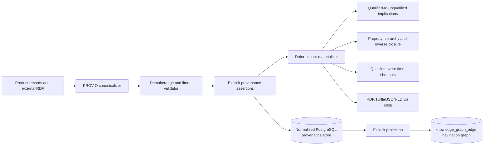

# W3C PROV-O implementation

## Requirement

LineageWeave must accept, validate, persist, infer, and serialize every normative relation in *PROV-O: The PROV Ontology* without flattening qualified influences or literal-valued properties into the existing navigation graph.

## Runtime architecture



## Supported standard surface

The machine-verifiable inventory is in [`PROV_O_IMPLEMENTATION_MATRIX.md`](PROV_O_IMPLEMENTATION_MATRIX.md):

- all 30 PROV-O classes;
- all 50 normative properties;
- exact object/datatype distinction;
- direct domains, resource ranges, and `xsd:dateTime` ranges;
- class and property hierarchies;
- both normative qualification tables;
- every Appendix B recommended inverse name.

## Canonicalization contract

Inputs may use a local name, `prov:` compact name, full W3C IRI, or a reserved Appendix B inverse name. A canonical property name always retains its standard direction. A reserved inverse name that is not itself one of the 50 normative properties reverses subject and object into the preferred relation.

```text
source prov:hadDerivation derived
        ↓ canonicalize and reverse
derived prov:wasDerivedFrom source
```

No inverse alias is accepted for datatype properties because reversing a literal cannot produce a valid RDF subject.

## Qualification contract

For each normative mapping:

```text
influenced --qualifiedRelation--> influence
influence  --influencerProperty--> influencer
```

LineageWeave materializes:

```text
influenced --unqualifiedRelation--> influencer
```

This applies to Generation, Derivation, Attribution, Usage, Communication, Association, Delegation, generic Influence, PrimarySource, Quotation, Revision, Invalidation, Start, and End.

## Persistence contract

`migrations/0017_prov_o_standard_relations.sql` creates a third-normal-form catalog and assertion store. A PostgreSQL trigger recursively checks subject domains and resource ranges through the class hierarchy and checks datatype-property literals before insertion. One assertion has exactly one resource or literal object. Inference provenance is represented by the many-to-many `provenance_assertion_derivation` table.

## Security and tenancy boundary

- External IRIs and lexical values are data, never executable instructions.
- RDF serialization performs no external fetch.
- The support profile uses `owl:imports` as metadata; runtime code does not dereference it.
- Assertions are rejected if resources are undeclared or incorrectly typed.
- The migration does not weaken existing row-level access decisions. API exposure must apply the same authenticated product boundary before binding product nodes to provenance resources.

## Operability

- Definitions are idempotently seeded.
- Exact W3C IRIs are stable; relational codes are multiword snake case.
- Standard definitions and runtime data are separate, so ontology upgrades can be reviewed without rewriting assertions.
- `provenance_resource_binding` is the only bridge to LineageWeave node identifiers; projections remain reproducible and removable.

## Acceptance evidence

```bash
pytest -q tests/test_prov_o.py
coverage run --branch -m pytest -q tests/test_prov_o.py
coverage report -m lineageweave/prov_o.py
python -m compileall -q lineageweave tests
```

Expected focused result: all tests pass and `lineageweave/prov_o.py` reports 100% statements and branches.

## OWL 2 RL compatibility domains are not universal permissions

Appendix A also publishes broad `prov:Influence` domains for
`prov:hadActivity` and `prov:hadRole` as OWL 2 RL compatibility aids.
The Recommendation explicitly warns that these broad domains must not be
read as permission to use either property on every Influence. Runtime and
database validation therefore enforce the normative union members rather
than weakening the contract.
