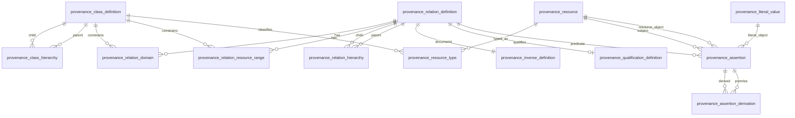

# ADR 0011: Preserve W3C PROV-O as a standards-complete provenance layer

- **Status:** Accepted
- **Date:** 2026-08-14
- **Decision owners:** ContextualWisdomLab / LineageWeave
- **Standard:** W3C PROV-O Recommendation, 30 April 2013

## Context

PR #74 introduced PROV-O-grounded actor categories, but LineageWeave's existing `knowledge_graph_edge` table only represents a compact binary navigation graph. It cannot faithfully represent PROV-O datatype properties such as `prov:startedAtTime` and `prov:value`, nor the intermediate `prov:Influence` resources required by qualified relations. Adding every standard property as another product edge code would therefore flatten the standard and lose the very provenance details it is intended to preserve.

The Recommendation defines 30 classes and 50 normative properties grouped into Starting Point, Expanded, and Qualified terms. Tables 2 and 3 define 14 qualification patterns, and consuming applications should treat each qualified form as implying the corresponding unqualified form. Appendix B reserves interoperable inverse names while intentionally preferring the standard property direction.

## Decision

1. Add a separate `lineageweave.prov_o` runtime containing the complete normative class/property registry.
2. Validate object-versus-datatype shape, domain, range, subclass membership, timezone-aware `xsd:dateTime`, and Appendix B inverse aliases before accepting an assertion.
3. Deterministically materialize:
   - transitive property hierarchy;
   - defined inverse properties;
   - `prov:alternateOf` symmetry;
   - all 14 qualified-to-unqualified implications;
   - qualified Generation/Invalidation/Start/End `prov:atTime` shortcuts.
4. Serialize with the exact `http://www.w3.org/ns/prov#` namespace through rdflib.
5. Store standards-complete provenance in normalized `provenance_*` tables. Keep `knowledge_graph_edge` as a buyer-facing navigation projection and bridge existing nodes through `provenance_resource_binding` rather than conflating the two models.
6. Catalog every Appendix B inverse name. Names that are not normative properties are accepted only as import aliases and rewritten by reversing endpoints into the preferred PROV-O relation.
7. Map LineageWeave `Post`, `Person`, `CorporateEntity`, and `Team` classes to PROV-O in a separate support profile that imports rather than redefines the W3C ontology.

## Relational model

## Consequences

### Positive

- Complete PROV-O interchange without lossy custom edge codes.
- Qualified provenance retains role, plan, activity, usage, generation, time, and location detail.
- Existing LineageWeave navigation and RWR behavior remains stable.
- Database and runtime share stable multiword snake-case codes while preserving exact W3C IRIs.
- Assertions fail closed in both Python and PostgreSQL.

### Costs

- The product now has a standards graph and a navigation projection; projection logic must remain explicit.
- Full OWL reasoning is not embedded. The runtime intentionally materializes only the Recommendation rules needed for deterministic product behavior.
- Bundle serialization remains RDF-technology-specific; the relational layer stores the bundle resource without prescribing TriG.

## Rejected alternatives

- **Add 50 `edge_type` lookup rows:** rejected because literal and qualified relations cannot be represented.
- **Store arbitrary RDF triples only:** rejected because domain/range and relational integrity would be deferred to callers.
- **Define every inverse as another preferred property:** rejected because Appendix B explicitly warns that unconstrained inverse proliferation reduces interoperability.

## Verification

- Exact registry tests for 30 classes, 50 properties, 6 datatype properties, 14 qualification mappings, and all 44 object-property inverse names.
- Behavior-sensitive tests for validation, subclass domains, every qualification implication, superproperty closure, inverse/symmetry, direct time inference, RDF serialization, SQL seed completeness, support-profile mapping, and public docstrings.
- Owned production module statement and branch coverage: 100%.
