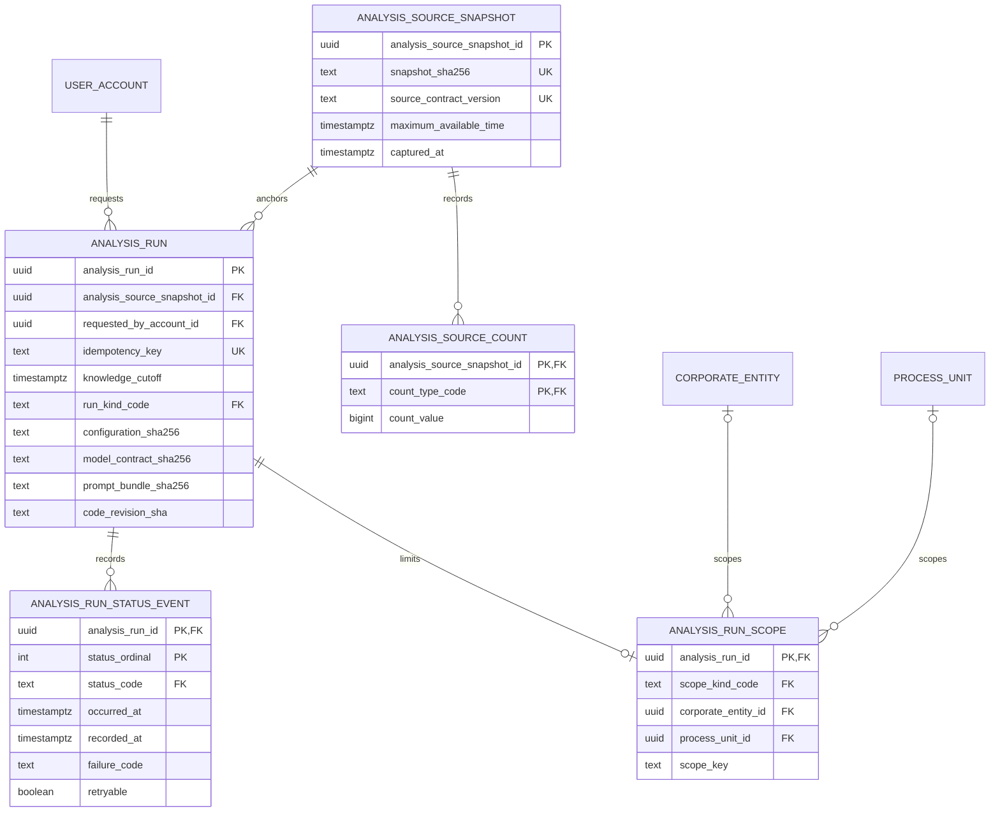

# ADR 0013 — Milestone 2 analysis runs use a normalized additive registry

**Decision status:** Accepted on this active PR; not protected-main truth until merge  
**Date:** 2026-08-15

## Context

The retained Milestone 2 experiment demonstrated useful direct-PostgreSQL
analysis, but its run shape repeated aggregate counts beside a free-form
metadata object and belonged to a parallel replacement application. Merging
that branch would delete or duplicate the reviewed LineageWeave package,
migration lineage, PROV-O layer, identity boundary, and React product.

Issue #79 therefore requires an additive bridge on the post-ADR-0012 product
line. The first bridge must preserve reproducibility, temporal eligibility,
authorization scope, and operational evidence without copying source records,
organization-specific identifiers, source-table names, provider credentials,
raw exceptions, or cross-service application tables.

The existing product owns authenticated accounts, corporate entities, process
units, source posts, compact lineage edges, report scores, and PROV-O
persistence. TEPP owns temporal and psychometric estimation.
`contextual-orchestrator` owns model routing and provider execution. The
registry records that a product analysis was requested and which immutable
evidence, scope, and configuration it used; it does not become either service's
internal database.

## Alternatives considered

### Copy the experiment tables unchanged

Rejected. Repeated counts and unstructured metadata create competing sources of
truth, weaken relational constraints, and reopen a parallel product.

### Store one JSON document per run

Rejected. Signed external manifests may use JSON, but identity, scope,
idempotency, aggregate counts, clocks, and lifecycle rules must remain
independently queryable and enforceable in PostgreSQL.

### Put durable state only in Valkey

Rejected. Valkey remains the event queue. Durable audit identity,
idempotency, scope, and reproducibility evidence require PostgreSQL; queue state
must be reconstructable from durable product state.

### Use a normalized additive registry

Accepted. It preserves useful experimental evidence while maintaining the
existing bounded contexts and migration lineage.

## Decision

Migration `0018_analysis_run_registry.sql` introduces five third-normalized
relations and one read projection. Migration
`0019_analysis_run_scope_immutability.sql` hardens the authorization boundary
without redefining the schema:



### Source capture and run-owned temporal cutoff

`analysis_source_snapshot` identifies one immutable capture by exact digest and
source-contract revision. It stores:

- `maximum_available_time`: the latest evidence-availability time represented
  by the capture;
- `captured_at`: when that immutable capture was created.

`knowledge_cutoff` belongs to `analysis_run`, not the snapshot. One immutable
capture may therefore support several analyses with different later cutoffs.
The run-creation trigger locks the snapshot and enforces:

```text
maximum_available_time <= knowledge_cutoff
```

This is an aggregate product guard against future-information leakage. It does
not replace TEPP's document-, event-, assertion-, system-, availability-, and
analysis-cutoff clocks.

### Immutable evidence and concurrency

`analysis_source_count` stores one non-negative aggregate per snapshot and count
vocabulary. Snapshot rows and existing counts reject updates. Count insert or
delete and run creation lock the same snapshot row. This makes the boundary
race-safe:

- a count-set change that wins the lock completes before the first run starts;
- a run that wins the lock freezes the count set, and later count insert/delete
  fails closed.

`analysis_run` is an immutable request. The account is required, and the
idempotency key is unique within that requesting account rather than globally.
Independent authenticated users may therefore choose the same opaque key
without colliding, while one user cannot reuse a key for a second request.
Request updates and deletes fail closed after registration.

### Immutable authorization scope

`analysis_run_scope` stores at most one authorization-relevant product scope.
Corporate-entity, process-unit, thread-group, and all-visible scopes use
mutually exclusive columns. Process-unit ownership remains derivable from
`process_unit` rather than being duplicated. The later creation repository must
insert the required scope in the same transaction as the run.

Migration 0018 originally rejected scope updates but still allowed a direct
scope deletion. That would leave a durable run and lifecycle history after its
recorded authorization boundary had disappeared. Migration 0019 therefore
replaces the update-only guard with an update-or-delete guard. Its replay-safe
rollback restores the migration-0018 update-only policy without deleting run or
scope data.

### Ordered lifecycle

`analysis_run_status_event` is an append-only state machine rather than an
unordered event bag. PostgreSQL serializes status appends per run and enforces:

```text
pending -> running -> succeeded
        \-> failed
        \-> cancelled

pending -> failed | cancelled
```

The first event is ordinal 1 and `pending`; ordinals are contiguous; occurrence
time is nondecreasing; terminal states cannot transition; failed events require
a bounded machine failure code; non-failed events cannot carry failure or retry
metadata. `recorded_at` separately preserves the database system clock.

`analysis_run_current_status` derives the highest ordinal event. It is a view,
not a second mutable state authority.

### Lookup, migration, rollback, and ownership

All enum-like values remain in `common_lookup_value`. Column checks additionally
restrict each field to its own allowed code family because the repository's
shared lookup foreign key targets globally unique codes.

Migration 0018 is replay-safe. Its rollback refuses to drop non-empty registry
relations, so downgrade cannot silently destroy audit evidence. Migration 0019
is also replay-safe; its rollback changes only the scope mutation policy. Any
approved retention/export process that empties append-only evidence must be
explicit and audited before the registry rollback.

The PostgreSQL image applies migrations 0018 and 0019 after the reviewed PROV-O
migration. This PR adds no second web application, Keyverse imitation, TEPP
arithmetic, contextual-orchestrator database dependency, API, or UI.

## Consequences

- The product gains a durable base for analysis APIs, actual-data aggregate
  reconciliation, TEPP adapters, Valkey outbox delivery, and administrator run
  visibility.
- Source rows, document nodes, lineage edges, report payloads, and scientific
  artifacts remain in their existing owners; this registry never duplicates
  them.
- Application/API writers and row-level authorization are deliberately deferred
  to the next vertical slice. A schema existing is not a claim that users can
  submit or inspect runs yet.
- RLS is not enabled here because the current FastAPI application authorizes
  through a pooled service identity and application-level RBAC/ABAC. A future
  RLS design requires a separate ADR and transaction-scoped actor context.
- Append-only evidence, immutable requests, and immutable scopes increase
  operational safety but require explicit retention/export tooling before
  destructive cleanup.

## Verification

- Static contracts reject the legacy denormalized table, JSON metadata,
  temporary repair artifacts, ambiguous clock ownership, optional requester,
  globally scoped idempotency, and missing 0019 fresh-install wiring.
- Real PostgreSQL tests apply migrations 0018 and 0019 and exercise valid
  snapshot/run/scope/status writes.
- Database regressions reject evidence later than the run cutoff, snapshot and
  count mutation, post-run count-set changes, missing actors, same-account
  idempotency reuse, malformed digests, negative counts, incoherent scopes,
  scope update/delete, incomplete failure events, noncontiguous or
  time-reversing histories, illegal transitions, terminal-state reuse, and
  status mutation.
- The 0019 downgrade is replay-safe and restores exactly one update-only scope
  trigger.
- The 0018 rollback refuses non-empty evidence and removes an explicitly emptied
  registry.
- Generated database identifiers use `psycopg2.sql.Identifier`, DSN query
  parameters survive throwaway-database creation, and every disposable database
  connection closes in a fixture `finally` block.

## Follow-up sequence

1. Add a transactionally atomic repository/API for snapshot registration, run
   creation, required scope, idempotent retry, and status append.
2. Add a normalized transactional Valkey outbox instead of introducing an MQ.
3. Bind TEPP through its reviewed versioned import/REST contract without
   cross-service SQL.
4. Bind contextual-orchestrator through a fail-closed versioned adapter after
   the canonical API and multimodal message contracts merge.
5. Add administrator and user run surfaces inside the existing React
   application, following the DB-grounded Figma information architecture,
   Storybook inventory, and design-token contract.
6. Execute private actual-data acceptance and retain only signed,
   aggregate-only manifests outside public source control.

## References — APA 7th

International Organization for Standardization. (2019). *ISO 8601-1:2019: Date
and time—Representations for information interchange—Part 1: Basic rules*
(confirmed 2024; Amendment 1:2022).
https://www.iso.org/standard/70907.html

PostgreSQL Global Development Group. (2026). *PostgreSQL 18 documentation: 5.5.
Constraints*. https://www.postgresql.org/docs/current/ddl-constraints.html

PostgreSQL Global Development Group. (2026). *PostgreSQL 18 documentation: 37.
Triggers*. https://www.postgresql.org/docs/current/triggers.html

World Wide Web Consortium. (2013). *PROV-O: The PROV ontology* (W3C
Recommendation). https://www.w3.org/TR/prov-o/
