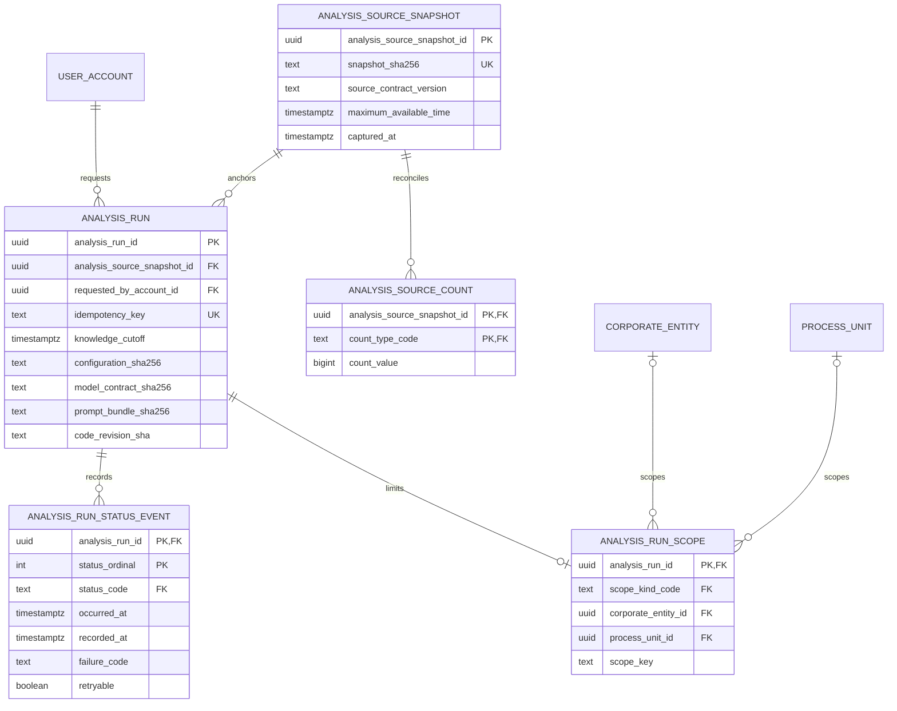

# ADR 0013 — Milestone 2 uses a normalized, additive analysis-run registry

**Decision status:** Accepted on this active PR; not protected-main truth until merge  
**Date:** 2026-08-15  
**Depends on:** ADR 0011 standards-complete provenance separation and ADR 0012 corporate-entity creation locking

## Context

LineageWeave has a reviewed React/FastAPI/PostgreSQL product, compact lineage
navigation, normalized actor identity, report persistence, and a separate
standards-complete PROV-O layer. Milestone 2 must analyze operator-authorized
PostgreSQL evidence without replacing that product, duplicating cross-service
databases, or committing private source identity and content to a public
repository.

A retained experiment proved that direct PostgreSQL analysis is feasible, but
its parallel application and denormalized run record cannot become product
truth. The product needs a small durable root that answers:

- which immutable capture was used;
- which evidence was available by the run's knowledge cutoff;
- which authenticated account requested the work;
- which product scope and reproducibility digests governed the run;
- which aggregate counts reconcile the capture;
- which legal lifecycle transitions occurred.

The registry does not store source SQL, DSNs, raw posts, inline images, provider
payloads, credentials, raw exceptions, or another service's application rows.

## Decision

Migration `0018_analysis_run_registry.sql` introduces five normalized relations
and one read projection.



### Temporal ownership

`analysis_source_snapshot.maximum_available_time` is an evidence fact: the
latest time at which any admitted fact became available. `analysis_run.knowledge_cutoff`
is an analysis fact: the latest information that this particular run may use.
A reusable capture therefore does **not** own one knowledge cutoff.

Run creation locks the snapshot and requires:

```text
maximum_available_time <= knowledge_cutoff <= requested_at
captured_at <= requested_at
```

This aggregate guard complements TEPP's finer event, assertion, document,
system, availability, and cutoff clocks. It does not replace TEPP temporal or
psychometric computation.

### Identity and idempotency

Every run references a real `user_account`. `requested_by_account_id` is not
nullable. Idempotency keys are trimmed, control-free canonical values and are
unique per authenticated account rather than
globally, because independent callers may legitimately choose the same opaque
client key. A later repository must compare request digests on retry and return
a conflict when the same account/key names different evidence or configuration.

### Immutability and concurrency

Snapshot identity and availability reject updates. Aggregate count values reject
updates. Count insert/delete and first run creation acquire the same snapshot-row
lock before checking whether a run exists. This shared lock order closes the
race in which a count set and first derivation could otherwise both commit.
After the first run, the complete count set is frozen.

The analysis request and its authorization scope reject updates and deletes.
Lifecycle changes are represented only by append-only status events, so a cascade
cannot erase the derivation root or its access boundary.

### Lifecycle state machine

The parent run row serializes status appends. Events require contiguous
ordinals, monotonic occurrence time, and these transitions:

```text
pending -> running | cancelled
running -> succeeded | failed | cancelled
succeeded | failed | cancelled -> terminal
```

The first event must be `pending`, requires an immutable scope, and cannot predate
the run request. Failed events require a lowercase machine-code identifier; raw
exception text is prohibited. `recorded_at` is overwritten on every insert with
the later of one captured database clock reading and `occurred_at` so database
write time never precedes occurrence. Client-supplied `recorded_at` is
discarded. A client occurrence may be at most one minute ahead of the database
clock; larger values are rejected as
`analysis_run_status_time_too_far_in_future` rather than manufacturing future
audit history. Do not clamp `occurred_at` down: a Python-ahead occurrence
within that bounded skew must stay monotonic against previously stored status
events (v2.12.6).
`analysis_run_current_status` is a view, not a second mutable state authority.

### Authorization scope

`analysis_run_scope` stores one immutable all-visible, corporate-entity,
process-unit, or thread-group scope. Its shape is database constrained and the
first lifecycle event is rejected until it exists. The next repository/API slice
must insert run, scope, and first status in one
transaction and apply the existing RBAC/ABAC contract when listing or reading
runs. This migration does not claim that an API or UI exists.

### Service boundaries

- **LineageWeave** owns product run identity, authorized scope, lifecycle,
  aggregate reconciliation, and product-visible derivation references.
- **TEPP** owns exact evidence spans, temporal/event measurement,
  multilevel/multiple-membership psychometrics, calibration, and semantic-span
  budgeting through a versioned import or REST contract.
- **contextual-orchestrator** owns provider-neutral model routing and bounded
  single-model versus multi-agent test-time compute allocation through its
  reviewed API.
- **fast-mlsirm** owns Rust psychometric arithmetic and calibration interfaces.
- **Valkey** remains the event queue. Durable registry truth remains in
  PostgreSQL; the start outbox (ADR 0023) bridges the two.

No component reads another service's private application tables.

## Alternatives considered

### Merge the parallel experiment unchanged

Rejected. It replaces reviewed product history, duplicates web and identity
surfaces, and creates a second database authority.

### Store one JSON document per run

Rejected. Signed external manifests may be JSON artifacts, but relational
identity, scope, counts, clocks, and lifecycle need independent constraints,
authorization, and query plans.

### Put the registry only in Valkey

Rejected. Queue state is transient and replayable. Audit identity,
idempotency, temporal eligibility, and retention evidence require PostgreSQL.

### Store knowledge cutoff on the snapshot

Rejected. One immutable capture can support multiple analysis requests with
different historical cutoffs. Putting the cutoff on the snapshot violates the
functional dependency and forces duplicate snapshots.

## Security, privacy, and compliance consequences

- Necessary PII remains in its authorized source/product tables rather than
  being blanket-masked into operational uselessness.
- This registry stores opaque UUIDs, digests, bounded machine codes, aggregate
  counts, and clocks only.
- Logs and public acceptance evidence must not include SQL, DSNs, raw source
  text, images, secrets, provider payloads, or private source identifiers.
- Artifact bodies remain in access-controlled deployment storage and are linked
  later by content digest and policy-bound reference.
- The design supports SOC 2 and CSAP evidence collection through explicit actor,
  configuration, status, retention, and rollback contracts; it does not claim
  certification.
- Database RLS is deferred because the current API uses one pooled service
  identity and application-level RBAC/ABAC. Adopting actor-bound RLS requires a
  separate ADR and transaction-scoped identity propagation.

## Failure and rollback

Migration replay is idempotent and rejects lookup-category collisions. The
rollback refuses to remove non-empty registry relations. Evidence must first be
exported, then emptied with `purge_analysis_run_registry` after an unrevoked
`analysis_run_retention_grant` and `analysis_run_retention_admin` membership
(ADR 0020). An empty rollback removes the view, tables, functions, and lookup
rows and is itself replayable.

## Verification

Acceptance requires:

- real-PostgreSQL migration and replay;
- valid snapshot, aggregate, scope, and lifecycle persistence;
- distinct cutoffs over one snapshot;
- rejection of future-information leakage;
- account-scoped idempotency;
- snapshot, count, run, and authorization-scope immutability;
- deletion resistance for request and scope audit evidence;
- scope-required lifecycle, request-time ordering, and recorded time at least
  as late as occurrence;
- canonical idempotency and bounded machine-code failure identifiers;
- count/run concurrency serialization;
- pending-first, contiguous, monotonic, legal status transitions;
- append-only status evidence;
- fail-closed rollback;
- two-or-more-word `snake_case` database-object names;
- complete repository, security, SAST, documentation, and public-content gates
  on the exact merge head.

## Follow-up sequence

1. Add a transaction repository that creates snapshot, counts, run, scope, and
   first status atomically and compares request digests on idempotent retries.
   `POST /api/analysis-runs` now records that Pending write (ADR 0017).
   `POST /api/analysis-runs/{id}/start` now reconstructs a Pending
   lineage cutoff bag in-process from frozen snapshot membership
   (ADR 0021). Start now commits a durable outbox row and wakes Valkey
   before reconstruct / TEPP (ADR 0023). Live TEPP start submits
   through `tepp_client` (ADR 0022).
2. Add RBAC/ABAC-protected run list/detail endpoints and the DB-grounded
   read-only administrator surface.
3. Add a normalized PostgreSQL outbox and Valkey delivery worker
   (ADR 0023).
4. Add TEPP and contextual-orchestrator adapters only after their versioned
   contracts are present on reviewed main branches. Seed and
   `POST /api/analysis-runs/{id}/start` now record Failed TEPP through
   `tepp_client` on the frozen snapshot when the transport is missing
   or the envelope is unpublished. A published accepted acknowledgement
   is stored as aggregate transport evidence and stays Failed /
   `tepp_completed_result_unsupported` (ADR 0035). A missing or
   unpublished TEPP envelope must stay Failed (`tepp_not_available` /
   `tepp_result_not_persisted`) and must not write a local psychometric
   substitute or stamp Succeeded. Seed also records a
   Succeeded `analysis_run_report` on that snapshot after the
   period-report tables are written (ADR 0024); the registry row does
   not copy a theta.
5. Execute private actual-data analysis and store only signed aggregate and
   reproducibility manifests outside public source control.
6. Run browser E2E through real OIDC, product navigation, and evidence drill-down.
7. v2.12.6: stamp status `recorded_at` as the later of one captured database
   clock reading and `occurred_at` so a bounded Python-ahead occurrence does
   not fail `occurred_at <= recorded_at`; reject occurrences more than one
   minute ahead as `analysis_run_status_time_too_far_in_future`. Do not clamp
   `occurred_at` down. Additive migration 0030 updates existing volumes; 0018
   carries the same assignment for fresh installs. This is not a new ADR
   number -- ADR 0036 is reserved on the #258 stack.

## References — APA 7th

International Organization for Standardization. (2019). *ISO 8601-1:2019: Date
and time—Representations for information interchange—Part 1: Basic rules*
(confirmed 2024; Amendment 1:2022).

Moreau, L., & Missier, P. (Eds.). (2013). *PROV-DM: The PROV data model*.
World Wide Web Consortium. https://www.w3.org/TR/prov-dm/

PostgreSQL Global Development Group. (2026). *PostgreSQL 18 documentation:
5.5. Constraints*. https://www.postgresql.org/docs/current/ddl-constraints.html

World Wide Web Consortium. (2013). *PROV-O: The PROV ontology* (W3C
Recommendation). https://www.w3.org/TR/prov-o/

World Wide Web Consortium. (2022). *Time ontology in OWL* (W3C Recommendation).
https://www.w3.org/TR/owl-time/
