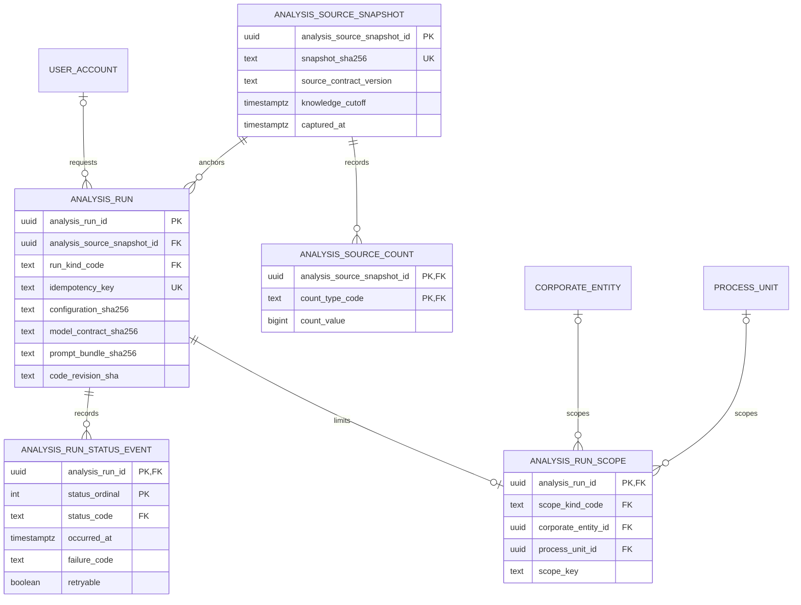

# ADR 0013 — Milestone 2 analysis runs use a normalized additive registry

**Decision status:** Accepted on this active PR; not protected-main truth until merge  
**Date:** 2026-08-15

## Context

The retained Milestone 2 source branch demonstrated useful direct-PostgreSQL analysis, but its `analysis_run_records` shape repeats aggregate counts beside a free-form `metadata_payload` and belongs to a parallel repository replacement. Merging that branch would delete or duplicate the reviewed LineageWeave package, migrations, PROV-O layer, identity boundary, and React product.

Issue #79 therefore requires an additive bridge on the post-ADR-0012 product line. The first bridge must preserve reproducibility and operational evidence without copying source records, organization-specific identifiers, source-table names, provider credentials, raw exceptions, or cross-service application tables.

The existing product already owns authenticated accounts, corporate entities, process units, source posts, compact lineage edges, report scores, and PROV-O persistence. TEPP owns calibrated temporal/psychometric computation; contextual-orchestrator owns model routing. The registry records that an analysis was requested and what immutable evidence/configuration it used, but it does not become either service's internal database.

## Alternatives considered

### Copy the prototype tables unchanged

Rejected. The repeated counts and JSON metadata create two authorities for the same facts, weaken database constraints, and reopen the parallel product implementation.

### Store one JSON document per run

Rejected. JSON is appropriate for signed external artifacts, not for relational identity, scope, status, and aggregate-count constraints that the product must query and authorize independently.

### Put run state only in Valkey

Rejected. Valkey remains the event queue. Durable audit identity, idempotency, and reproducibility evidence require PostgreSQL; queue state may be rebuilt from durable product state.

### Use a normalized additive registry

Accepted. It preserves the useful evidence while maintaining the existing bounded contexts and migration lineage.

## Decision

Migration `0018_analysis_run_registry.sql` introduces five third-normalized relations and one read projection:

1. `analysis_source_snapshot` identifies one immutable source snapshot by SHA-256 and separates `knowledge_cutoff` from later capture time. The constraint `knowledge_cutoff <= captured_at` prevents a snapshot from claiming evidence was captured before the analysis was allowed to know it.
2. `analysis_source_count` stores one non-negative aggregate per count vocabulary. Counts are not repeated in a run row or metadata JSON.
3. `analysis_run` binds one idempotency key to the snapshot, run kind, optional requesting account, configuration schema/digest, optional model/prompt digests, and exact code revision.
4. `analysis_run_scope` stores at most one product authorization scope. Corporate, process-unit, thread-group, and all-visible scopes use mutually exclusive columns. Process-unit ownership remains derivable from `process_unit` and is not duplicated. The later run-creation repository must insert the required scope in the same transaction.
5. `analysis_run_status_event` is append-only. Bounded machine failure codes may be stored; raw exceptions and provider/source payloads may not.
6. `analysis_run_current_status` derives the latest event. It is a view, not a second mutable state authority.
7. All enum-like values remain in `common_lookup_value`; table constraints additionally restrict each column to its own allowed category because the repository's shared lookup FK references a globally unique code.
8. The migration is idempotent. Its rollback refuses to drop non-empty registry tables, so downgrade cannot silently destroy audit evidence.
9. The PostgreSQL image runs migration 0018 after the reviewed PROV-O migration. This PR does not add a second web app, a Keyverse imitation, TEPP arithmetic, or a contextual-orchestrator database dependency.

## Consequences

- The product gains a durable base for analysis job APIs, actual-data aggregate reconciliation, TEPP run adapters, Valkey outbox delivery, and administrator run visibility.
- Source rows, document nodes, lineage edges, report payloads, and evidence remain in their existing owners; this registry never duplicates them.
- Application/API writers and row-level authorization are deliberately deferred to the next vertical slice. A schema existing is not a claim that users can submit or inspect runs yet.
- RLS is not enabled in this migration because the current FastAPI application authorizes through its pooled service identity and application-level RBAC/ABAC. A later API slice must either preserve that contract or adopt connection-bound RLS through a separate ADR and transaction-scoped actor context.
- Retention/export tooling must explicitly handle append-only status evidence before rollback. The provided downgrade is destructive only after the relations are empty.

## Verification

- Static contracts reject the legacy denormalized table and unstructured JSON metadata.
- Real PostgreSQL tests apply the current product schema plus migration 0018, replay the migration, exercise valid snapshot/run/scope/status writes, and reject malformed digests, negative counts, duplicate idempotency, incoherent scopes, incomplete failure events, and status mutation.
- Rollback is proven to refuse non-empty evidence and to remove an explicitly emptied registry.
- Generated database identifiers use `psycopg2.sql.Identifier`, and DSN query parameters survive throwaway-database creation.

## Follow-up sequence

1. Add a transactionally atomic repository/API for snapshot registration, run creation, scope authorization, and status append.
2. Add a transactional Valkey outbox using a normalized event relation rather than introducing an MQ.
3. Bind the reviewed TEPP versioned import/REST contract without cross-service SQL.
4. Add administrator and user run surfaces inside the existing React application, following the DB-grounded Figma information architecture and Storybook/design-token contracts.
5. Add signed aggregate-only actual-data acceptance manifests outside public source control.

## References — APA 7th

International Organization for Standardization. (2019). *ISO 8601-1:2019: Date and time—Representations for information interchange—Part 1: Basic rules* (confirmed 2024; Amendment 1:2022). https://www.iso.org/standard/70907.html

PostgreSQL Global Development Group. (2026). *PostgreSQL 18 documentation: 5.5. Constraints*. https://www.postgresql.org/docs/current/ddl-constraints.html

World Wide Web Consortium. (2013). *PROV-O: The PROV ontology* (W3C Recommendation). https://www.w3.org/TR/prov-o/
