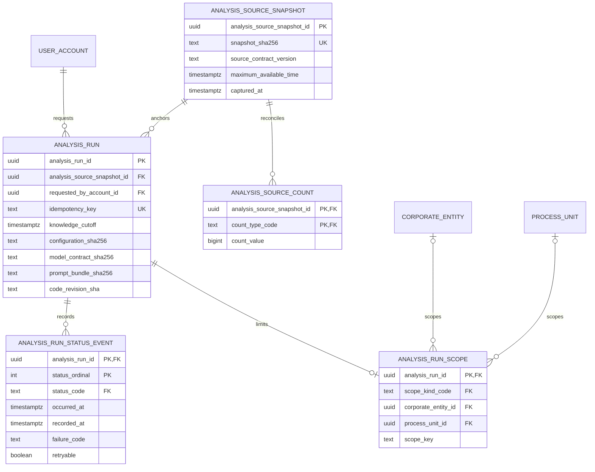

# ADR 0014 — Milestone 2.1 uses a normalized, additive analysis-run registry

**Decision status:** Accepted on this active PR; not protected-main truth until merge
**Date:** 2026-08-16
**Depends on:** ADR 0001 demo identity/data boundary and ADR 0013 adaptive orchestrator default

## Context

Protected `main` has migrations `0001`–`0011` and package version `0.71.0`.
ADR 0013 is already taken by the merged adaptive-orchestrator default. Milestone 2
must persist real analysis-run identity without merging the retained parallel
application, without a second React app, and without a production Keyverse bind.

The product needs a small durable root that answers:

- which immutable capture was used;
- which evidence was available by the run's knowledge cutoff;
- which authenticated account requested the work;
- which product scope and reproducibility digests governed the run;
- which aggregate counts reconcile the capture;
- which legal lifecycle transitions occurred.

The registry does not store source SQL, DSNs, raw posts, inline images, provider
payloads, credentials, raw exceptions, or another service's application rows.

## Decision

Migration `0012_analysis_run_registry.sql` introduces five normalized relations
and one read projection.



`analysis_run_current_status` is a `VIEW` over the latest status event. It is
not a second mutable table.

### Temporal ownership

`analysis_source_snapshot.maximum_available_time` is an evidence fact: the
latest time at which any admitted fact became available. `analysis_run.knowledge_cutoff`
is an analysis fact: the latest information that this particular run may use.
A reusable capture therefore does **not** own one knowledge cutoff.

Run creation locks the snapshot and requires:

```text
maximum_available_time <= knowledge_cutoff <= requested_at
captured_at <= requested_at
```

This aggregate guard complements TEPP's finer event, assertion, document,
system, availability, and cutoff clocks. It does not replace TEPP temporal or
psychometric computation.

### Identity and idempotency

Every run references a real `user_account`. `requested_by_account_id` is not
nullable. Idempotency keys are trimmed, control-free canonical values and are
unique per authenticated account rather than globally.

### Immutability and concurrency

Snapshot identity and availability reject updates. Aggregate count values reject
updates. Count insert/delete and first run creation acquire the same snapshot-row
lock before checking whether a run exists. After the first run, the complete
count set is frozen. The analysis request and its authorization scope reject
updates and deletes.

### Lifecycle state machine

The parent run row serializes status appends. Events require contiguous
ordinals, monotonic occurrence time, and these transitions:

```text
pending -> running | cancelled
running -> succeeded | failed | cancelled
succeeded | failed | cancelled -> no successor
```

The first event must be `pending`, requires an immutable scope, and cannot predate
the run request. Failed events require a lowercase machine-code identifier.

### Authorization scope

`analysis_run_scope` stores one immutable all-visible, corporate-entity,
process-unit, or thread-group scope. This slice adds no public CRUD API.

### Service boundaries

- **LineageWeave** owns product run identity, authorized scope, lifecycle,
  aggregate reconciliation, and product-visible derivation references.
- **TEPP** owns exact evidence spans and psychometric measurement through a
  versioned import or REST contract. `AnalysisRunRequest` is wired to
  `snapshot_id` and `knowledge_cutoff`. Transport stays fail-closed unless a
  real HTTPS `POST /v1/analysis-runs` or in-process `tepp_api` is injected.
- **contextual-orchestrator** owns provider-neutral model routing. New helpers
  in this slice use `mode="auto"` only and fail closed on a missing base URL,
  `invalid_mode`, or non-2xx response. This repo does not invent a portable
  task envelope.
- **Keyverse** owns identity. This slice adds no local IdP and no production
  Keyverse bind.

No component reads another service's private application tables.

## Alternatives considered

### Merge the parallel experiment unchanged

Rejected. It replaces reviewed product history and creates a second database
authority.

### Reuse stacked migration 0018 or ADR 0013

Rejected. Protected main ends at migration 0011. ADR 0013 is already the
adaptive-orchestrator default. This slice is `0012` and ADR 0014.

### Store one JSON document per run

Rejected. Relational identity, scope, counts, clocks, and lifecycle need
independent constraints.

### Store knowledge cutoff on the snapshot

Rejected. One immutable capture can support multiple analysis requests with
different historical cutoffs.

## Security, privacy, and compliance consequences

- Necessary PII remains in its authorized source/product tables.
- This registry stores opaque UUIDs, digests, bounded machine codes, aggregate
  counts, and clocks only.
- Public Git content may mention synthetic Demo Corp and aggregate ranges only.
- The design supports SOC 2 and CSAP evidence collection; it does not claim
  certification.

## Failure and rollback

Migration replay is idempotent and rejects lookup-category collisions. The
rollback refuses to remove non-empty registry relations. An empty rollback
removes the view, tables, functions, and lookup rows and is itself replayable.

## Follow-up sequence

1. Add a transaction repository that creates snapshot, counts, run, scope, and
   first status atomically.
2. Add RBAC/ABAC-protected read projections after hidden-evidence tests pass.
3. Add a normalized PostgreSQL outbox and Valkey delivery worker.
4. Consume TEPP measurement and deeper orchestrator workflows only through
   reviewed versioned boundaries.
5. Execute private actual-data analysis outside public source control.

## References — APA 7th

International Organization for Standardization. (2019). *ISO 8601-1:2019: Date
and time—Representations for information interchange—Part 1: Basic rules*
(confirmed 2024; Amendment 1:2022).

Moreau, L., & Missier, P. (Eds.). (2013). *PROV-DM: The PROV data model*.
World Wide Web Consortium. https://www.w3.org/TR/prov-dm/

PostgreSQL Global Development Group. (2026). *PostgreSQL 18 documentation:
5.5. Constraints*. https://www.postgresql.org/docs/current/ddl-constraints.html

World Wide Web Consortium. (2013). *PROV-O: The PROV ontology* (W3C
Recommendation). https://www.w3.org/TR/prov-o/

World Wide Web Consortium. (2022). *Time ontology in OWL* (W3C Recommendation).
https://www.w3.org/TR/owl-time/
