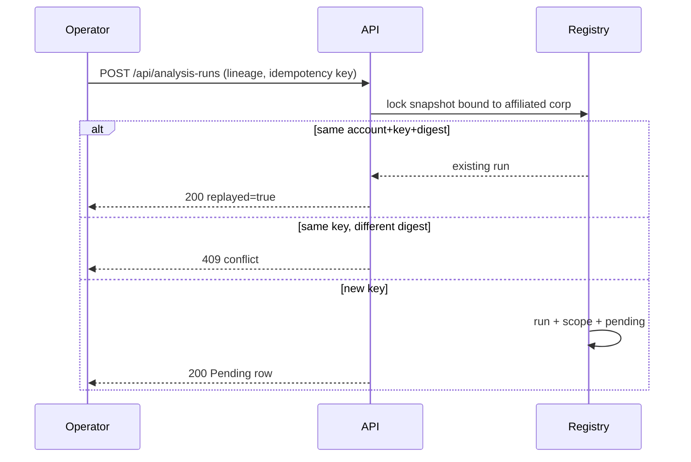

# ADR 0017 — Operators request a pending lineage run on a captured snapshot

**Decision status:** Accepted on this active PR; not protected-main truth until merge
**Date:** 2026-08-16
**Depends on:** ADR 0013 registry, ADR 0014 authorized read, ADR 0016 cutoff posts
**Refs:** Issue #79 (Milestone 2 parent); ADR 0013 follow-up 1

## Context

ADR 0014 gave buyers a source-redacting list and detail of analysis runs.
After `make seed` they can see a succeeded Demo Corp lineage run and a
Failed TEPP run. They still could not *request* the reconstruction that a
failed lineage row now names. Seed SQL remained the only writer.

ADR 0013 follow-up 1 asked for a transaction that creates snapshot, counts,
run, scope, and first status atomically and compares request digests on
idempotent retries. Creating a *new* capture from live posts is a later
increment: a snapshot is an immutable evidence bag, not "whatever is in
`source_post` today." This slice reuses a snapshot already bound to the
caller's corporate entity.

## Decision

`POST /api/analysis-runs` requires `post_read` and, in one transaction:

1. locks the latest snapshot already used for a corporate-entity scope the
   caller may walk;
2. inserts `analysis_run` + `analysis_run_scope` + the first
   `analysis_status_pending` event;
3. returns the same authorized projection as `GET /api/analysis-runs/{id}`,
   plus `replayed`.

Rules:

- Only `analysis_run_lineage` is accepted. TEPP stays a `tepp_client`
  wire path (`tepp_not_available` / `tepp_result_not_persisted`). Period
  reports stay on the Reports panel rebuild.
- Hidden corporate entities 404. `all_visible` is not a write scope here.
- An omitted `knowledge_cutoff` uses the snapshot
  `maximum_available_time` so a double-submit does not drift the digest.
- Idempotency is account-scoped. Same key + same digest replays. Same key
  + different snapshot, cutoff, or kind is 409.
- The payload is labels, clocks, and aggregates. No DSN, SQL, raw post,
  image bytes, or provider body.
- Reconstruction execution (outbox / Valkey worker) remains follow-up 3.
  This slice records the request as Pending.

The home page adds **Request lineage reconstruction**. The next action
after a Failed lineage row is that button, not a TEPP connect instruction.

## Consequences

- Demo Analyst can request a new Pending Demo Corp lineage run after
  `make seed` without inventing a measurement.
- A first-time tenant without a bound snapshot gets 422 and is told to
  ask an administrator to capture one.
- Snapshot+count creation from live evidence, TEPP live transport, and
  the outbox worker remain later slices.
- Storybook / design-token inventory for repeating list rows waits on
  `frontend/mise.toml` Node 24 as the runner (do not add a second Node
  toolchain).

## References

International Organization for Standardization. (2019). *ISO 8601-1:2019:
Date and time—Representations for information interchange—Part 1: Basic
rules* (confirmed 2024; Amendment 1:2022).

Kent, K., & Souppaya, M. (2006). *Guide to computer security log
management* (NIST Special Publication 800-92). National Institute of
Standards and Technology. https://doi.org/10.6028/NIST.SP.800-92

Moreau, L., & Missier, P. (Eds.). (2013). *PROV-DM: The PROV data model*.
World Wide Web Consortium. https://www.w3.org/TR/prov-dm/

OpenAPI Initiative. (2025). *OpenAPI specification, version 3.2.0*.
https://spec.openapis.org/oas/v3.2.0.html

World Wide Web Consortium. (2022). *Time ontology in OWL* (W3C
Recommendation). https://www.w3.org/TR/owl-time/
