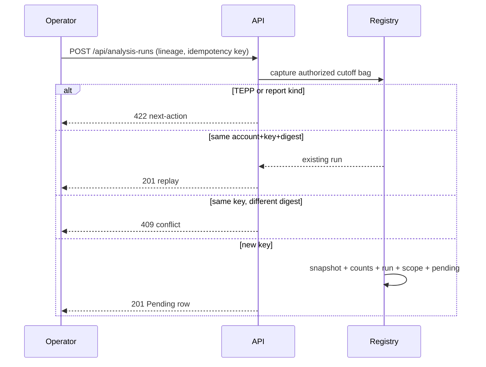

# ADR 0017 — Operators request a pending lineage run on an authorized capture

**Decision status:** Accepted on this active PR; not protected-main truth until merge
**Date:** 2026-08-16
**Depends on:** ADR 0013 normalized analysis-run registry; ADR 0014 authorized
analysis-run read; ADR 0016 knowledge-cutoff posts
**Refs:** Issue #79 (Milestone 2 parent); ADR 0013 follow-up 1

## Context

Home Analysis runs could list seeded lineage and TEPP rows, but a buyer
could not request a new run. Seed-only evidence is a demo, not a product.
ADR 0013 already required a transaction that creates snapshot, counts,
run, scope, and the first status atomically. Follow-up 3 (outbox / worker)
still owns reconstruction and live TEPP execution.

`#125` landed that write and also accepted a TEPP kind. A Pending TEPP
row that never called `tepp_client` is a fabricated measurement request.
This decision keeps the live cutoff capture and closes that hole.

## Decision

`POST /api/analysis-runs` is the authorized write:

- `post_read` is enough. The caller may only cover a corporate entity
  they already walk. An unaffiliated corp is 404, not 403.
- Only `analysis_run_lineage` is accepted. TEPP stays a `tepp_client`
  wire path (`tepp_not_available` / `tepp_result_not_persisted`). Period
  reports stay on the Reports panel rebuild.
- The capture digest hashes scope, entity, cutoff, and authorized post
  ids — never a post body, DSN, source SQL, or a theta.
- The write inserts snapshot, aggregate counts, `analysis_run`,
  `analysis_run_scope`, and `analysis_status_pending` in one transaction.
- The first status is Pending. This slice does not reconstruct lineage
  and does not call TEPP.
- Account-scoped idempotency compares `configuration_sha256`. An omitted
  cutoff is hashed as `unspecified` so a retry of the same client key
  does not conflict because the clock moved.
- `GET /api/me` returns the affiliated `corporate_entities` so a
  multi-affiliation operator can choose which entity to reconstruct.
- The response is the same authorized detail as `GET /api/analysis-runs/{id}`.

The home panel's **Request a lineage reconstruction** button records that
Pending row. A failed lineage row names that button. Only a failed TEPP
row mentions the measurement service.

## Consequences

- Demo Analyst can request a new Pending Demo Corp lineage run after
  `make seed` without inventing a measurement.
- A multi-affiliation account chooses the corp before clicking.
- Reconstruction, live TEPP transport, and the outbox worker remain
  later slices. Do not stamp Succeeded or invent a theta from this write.

## References — APA 7th

International Organization for Standardization. (2019). *ISO 8601-1:2019:
Date and time—Representations for information interchange—Part 1: Basic
rules* (confirmed 2024; Amendment 1:2022).

Jensen, C. S., & Snodgrass, R. T. (1999). Temporal data management.
*IEEE Transactions on Knowledge and Data Engineering, 11*(1), 36–44.
https://doi.org/10.1109/69.755613

Kent, K., & Souppaya, M. (2006). *Guide to computer security log
management* (NIST Special Publication 800-92). National Institute of
Standards and Technology. https://doi.org/10.6028/NIST.SP.800-92

Moreau, L., & Missier, P. (Eds.). (2013). *PROV-DM: The PROV data model*.
World Wide Web Consortium. https://www.w3.org/TR/prov-dm/

OpenAPI Initiative. (2025). *OpenAPI specification, version 3.2.0*.
https://spec.openapis.org/oas/v3.2.0.html

World Wide Web Consortium. (2022). *Time ontology in OWL* (W3C
Recommendation). https://www.w3.org/TR/owl-time/
