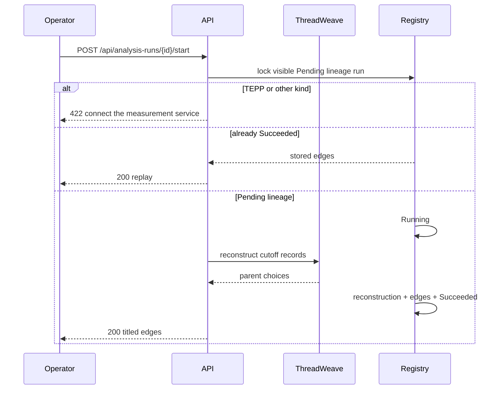

# ADR 0021 — Operators start a pending lineage reconstruction

**Decision status:** Accepted on this active PR; not protected-main truth until merge
**Date:** 2026-08-16
**Depends on:** ADR 0013 registry; ADR 0014 authorized read; ADR 0016 cutoff
posts; ADR 0017 authorized create; ADR 0020 granted retention purge
**Refs:** Issue #79 (Milestone 2 parent); ADR 0013 follow-up 3 (in-process
start; durable outbox remains later)

## Context

ADR 0017 let an operator record a Pending analysis run. The home button
said “Request a lineage reconstruction,” then the row stayed Pending.
Seed still owned the only Succeeded Demo Corp tree. A buyer cannot
treat a request they cannot start as a product.

ADR 0019 binds `cataloged_team_id` / `cataloged_corporate_entity_id`.
ADR 0020 is the granted retention purge. Those numbers must not be
reused. Open #142 / #152 used 0019 / 0020 / v0.87.0 on a pre-#141
base and are not the landing vehicle.

ADR 0013 follow-up 3 asked for a PostgreSQL outbox and Valkey worker.
That durable delivery path is still later. This slice starts
reconstruction in the authorized request so the operator can see the
cutoff tree immediately. A crash after Running and before Succeeded
rolls the transaction back to Pending.

A granted purge (ADR 0020) must still empty a run that already stored
edges. Migration `0021` therefore replaces
`purge_analysis_run_registry` so it deletes reconstruction rows and
snapshot members before the 0018 registry tables.

## Decision

`POST /api/analysis-runs/{id}/start` requires `post_read` and, in one
transaction:

1. loads the authorized run (hidden scopes 404);
2. rejects non-lineage kinds so TEPP cannot invent a theta;
3. replays a Succeeded run;
4. accepts only Pending lineage;
5. locks the run row, re-reads status, appends Running, runs
   `lineage_edge_specs` / ThreadWeave on the frozen
   `analysis_source_snapshot_member` bag (or the live cutoff query when
   membership was never persisted), persists
   `analysis_run_reconstruction` plus `analysis_run_lineage_edge`, then
   appends Succeeded. A concurrent start is 409 with a refresh next
   action, not a 500.

Rules:

- Edges are run-scoped. This write does not replace live
  `post_lineage_edge` (the Event Lineage panel stays a later rebuild).
- The digest hashes parent id, child id, and rounded fused score — never
  a post body, DSN, or image.
- Empty cutoff bags Succeed with zero edges.
- Failed TEPP remains a `tepp_client` transport problem.
- A granted purge deletes reconstruction and snapshot-member rows
  before `analysis_run` / `analysis_source_snapshot`.

The home detail adds **Start reconstruction** on a Pending lineage row
and lists titled parent→child edges after Succeeded. The Result digest
prefix is audible next to Code and Config; hover it to verify the
parent-choice hash. Edge titles stay public-or-affiliated.

## Consequences

Demo Analyst can request a run, start it, and confirm the designed A-100
fork (revised quote and delivery question under the pricing follow-up)
without a seed-only Succeeded row. The durable outbox / Valkey worker
and live TEPP transport remain later slices. Do not stamp Succeeded
from a missing reconstruct library, and do not invent a theta.

## References — APA 7th

International Organization for Standardization. (2019). *ISO 8601-1:2019:
Date and time—Representations for information interchange—Part 1: Basic
rules* (confirmed 2024; Amendment 1:2022).

Jensen, C. S., & Snodgrass, R. T. (1999). Temporal data management.
*IEEE Transactions on Knowledge and Data Engineering, 11*(1), 36–44.
https://doi.org/10.1109/69.755613

Moreau, L., & Missier, P. (Eds.). (2013). *PROV-DM: The PROV data model*.
World Wide Web Consortium. https://www.w3.org/TR/prov-dm/

World Wide Web Consortium. (2013). *PROV-O: The PROV ontology* (W3C
Recommendation). https://www.w3.org/TR/prov-o/

World Wide Web Consortium. (2022). *Time ontology in OWL* (W3C
Recommendation). https://www.w3.org/TR/owl-time/
