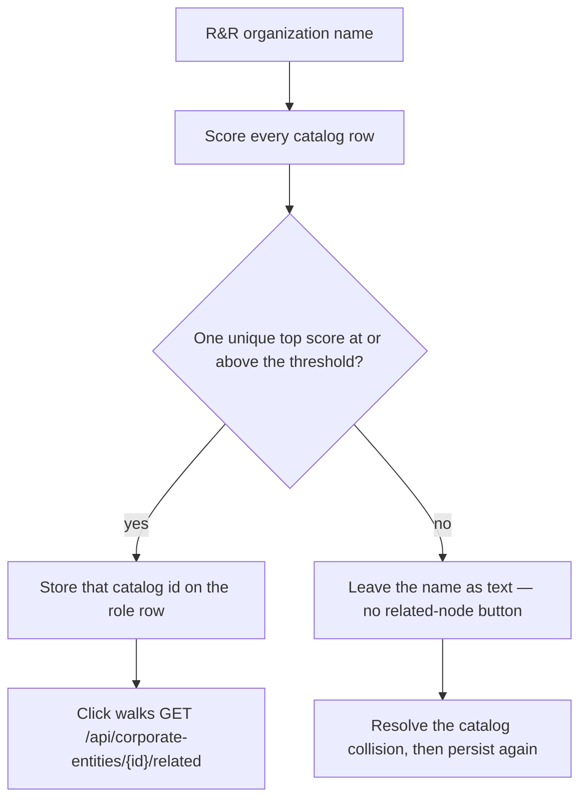

# ADR 0021 — Tied organization similarity stays unbound

**Decision status:** Accepted
**Date:** 2026-08-16

## Context

ADR 0019 stores the catalog id on `post_summary_role` so fetch no
longer rejoins `corporate_entity.entity_name`. Persist still calls
`resolve_corporate_entity` before that write. That function kept the
first candidate whose similarity score was strictly greater than the
running best. Two catalog rows can share a display name (different
`corporate_entity_code`, different parents). Both score 1.0. The
winner was then whichever row an unordered `select` happened to
return.

The buyer path is: open the post, click the R&R organization name,
walk related nodes. A first-wins bind walks the homonym. ADR 0019's
backfill already refuses to guess when two same-named mentions exist
on one post (`HAVING count(*) = 1`). Write-time resolution did not.

String similarity is only the candidate-generation stage of
collective entity resolution (Bhattacharya & Getoor, 2007). Fellegi
and Sunter (1969) leave an uncertain pair for clerical review rather
than forcing a link. Christen (2012) treats that hold-out as part of
the matching decision, not a defect to paper over.

## Decision

`resolve_corporate_entity` returns a catalog id only when exactly one
candidate holds the top score and that score clears `min_similarity`.
A tied top score returns `None`. `persist_post_summary` then stores
no `cataloged_corporate_entity_id` and writes no
`post_organization_mention`. The popup shows the name as text, not a
button.

The same function is shared with Keyman affiliation matching and
entity-relationship counterparty resolution. Those paths already
treat `None` as "do not invent a link."

This does not create a `corporate_entity` row. Null inference /
verification clients stay unavailable. Do not invent a TEPP theta.

## Consequences

- Open a post whose R&R names `Tied Energy` when two catalog rows
  share that display name. The name is not a button. Resolve the
  catalog collision (distinct codes, parents, or a verified unique
  match), persist the summary again, then click.
- A unique exact match among other homonym neighbors still binds.
- The same catalog id listed twice in the candidate snapshot is one
  winner, not a tie.

## References

Bhattacharya, I., & Getoor, L. (2007). Collective entity resolution
in relational data. *ACM Transactions on Knowledge Discovery from
Data, 1*(1), Article 5. https://doi.org/10.1145/1217299.1217304

Christen, P. (2012). *Data matching: Concepts and techniques for
record linkage, entity resolution, and duplicate detection*.
Springer. https://doi.org/10.1007/978-3-642-31164-2

Fellegi, I. P., & Sunter, A. B. (1969). A theory for record linkage.
*Journal of the American Statistical Association, 64*(328),
1183–1210. https://doi.org/10.2307/2286061

International Organization for Standardization. (2023). *ISO/IEC
11179-1:2023: Information technology—Metadata registries (MDR)—Part 1:
Framework*.
