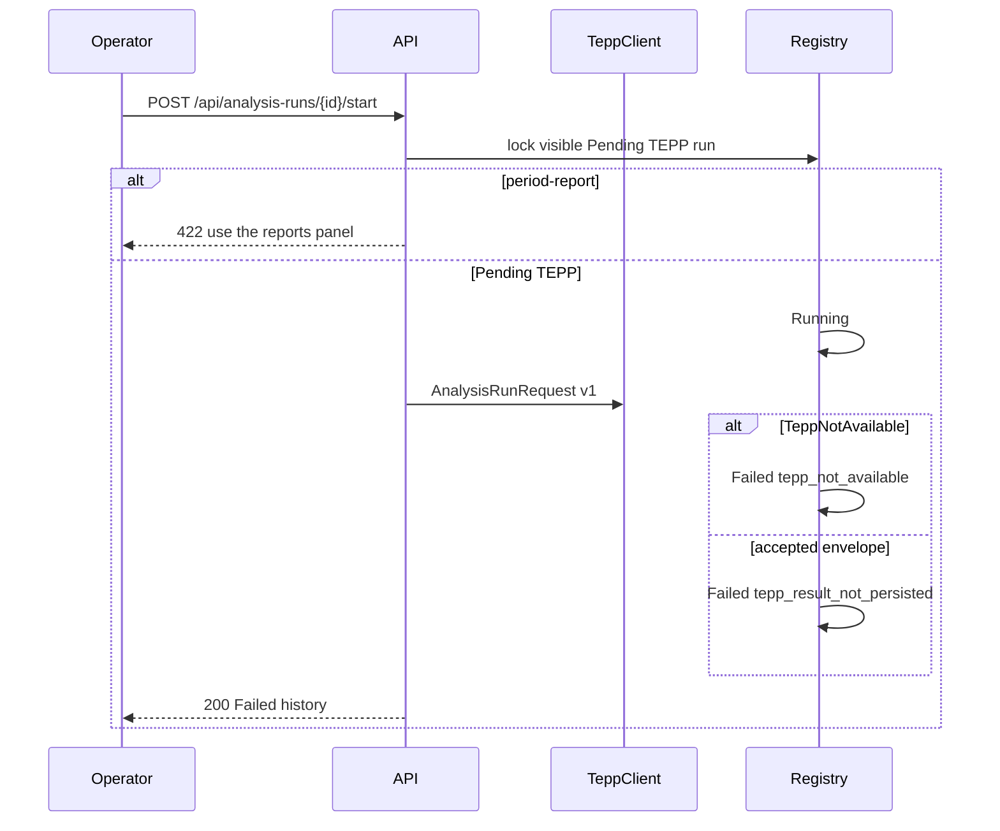

# ADR 0022 — Operators start a pending TEPP measurement through tepp_client

**Decision status:** Accepted on this active PR; not protected-main truth until merge
**Date:** 2026-08-17
**Depends on:** ADR 0013 registry; ADR 0017 authorized create; ADR 0021
authorized lineage start
**Refs:** Issue #79 (Milestone 2 parent); ADR 0013 follow-up 4 (live TEPP
through the published client; persistable result remains later)

## Context

ADR 0021 starts a Pending lineage reconstruction in-process. The same
`POST /api/analysis-runs/{id}/start` path returned 422 for TEPP so it
could not invent a theta. Create already records a Pending TEPP run.
Seed already records a Failed TEPP run through `tepp_client`. The Failed
row tells the operator to connect the measurement service and re-run,
but Failed is terminal and there was no start path that called
`tepp_client`.

A buyer who connects a live TEPP transport still could not submit the
frozen snapshot. A 422 that says "do not invent a measurement" is
honest, but it is not a product. The missing work is to submit TEPP's
published `AnalysisRunRequest` and fail closed when the transport is
missing or the envelope is not a persistable measurement.

## Decision

`POST /api/analysis-runs/{id}/start` accepts Pending TEPP as well as
Pending lineage. Period-report stays 422. TEPP start, in the same
authorized transaction:

1. locks the visible Pending TEPP row;
2. appends Running;
3. builds `AnalysisRunRequest` from the run's idempotency key, snapshot
   digest, knowledge cutoff, and corporate-entity workspace id — never a
   post body or a theta;
4. submits through `TeppClient`. An empty `TEPP_TRANSPORT_URL` keeps the
   default unavailable transport. A set URL POSTs the published wire
   payload through the http(s)-only helper. File URLs stay unavailable;
5. appends Failed / `tepp_not_available` when the transport is missing
   or refused, or Failed / `tepp_result_not_persisted` when TEPP accepts
   an envelope this product cannot store yet.

Succeeded TEPP stays later. This slice does not persist a local
psychometric substitute, does not call contextual-orchestrator as TEPP,
and does not stamp Succeeded from an `accepted` envelope. Failed remains
terminal: the detail offers **Request a new TEPP measurement**, which
creates a new Pending run (ADR 0017). The operator then starts that
row.

A durable outbox / Valkey worker is ADR 0023. Start commits Running
plus the outbox row before `tepp_client` so a crash leaves the work
item instead of rolling back to Pending.

## Consequences

Demo Analyst can request a TEPP run, start it, and see Failed /
`tepp_not_available` until a live transport is configured. Connecting
`TEPP_TRANSPORT_URL` submits the same published payload. An accepted
envelope still does not become a calibrated result. Do not invent a
theta.

## References — APA 7th

International Organization for Standardization. (2019). *ISO 8601-1:2019:
Date and time—Representations for information interchange—Part 1: Basic
rules* (confirmed 2024; Amendment 1:2022).

Moreau, L., & Missier, P. (Eds.). (2013). *PROV-DM: The PROV data model*.
World Wide Web Consortium. https://www.w3.org/TR/prov-dm/

World Wide Web Consortium. (2013). *PROV-O: The PROV ontology* (W3C
Recommendation). https://www.w3.org/TR/prov-o/
