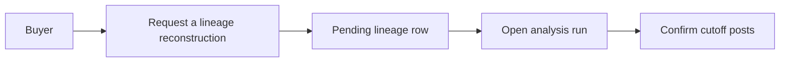

# ADR 0023 — Analysis-run home objects use shared tokens and Storybook

**Decision status:** Accepted on this active PR; not protected-main truth until merge
**Date:** 2026-08-16
**Depends on:** ADR 0014 authorized analysis-run read; `#145` token catalog

## Context

`#145` named tokens for citation chips and popup close buttons and added
Storybook. The home Analysis runs list still inlined the request control
and each `kind · status · entity` row inside `App.tsx`. A designer could
not preview the next click — Request a lineage reconstruction, or open a
Pending / Failed row — without reading the product page.

ADR 0021 is reserved for the person-catalog bind (`#153`). ADR 0022 is
reserved for the seeded period-report registry row (`#161`). This
decision is the next free slot. It does not change create-kind policy
(ADR 0017 / `#157`) and does not start reconstruction (`#142`).

## Decision

- `AnalysisRunRequestButton` and `AnalysisRunListButton` live under
  `frontend/src/components/` and read `--space-home-header-gap` and
  `--space-list-item-*` from `frontend/src/styles/tokens.css`.
- Caption and next-action copy stay in `analysisRunCopy.ts` so a pending
  TEPP row cannot claim a calibrated measurement and a failed lineage
  row cannot mention the measurement service.
- Storybook catalogs `AnalysisRuns/RequestButton` and
  `AnalysisRuns/ListButton`. Open the catalog, then click the control
  that matches the next buyer action.

## Consequences

- Changing list spacing or the request label is a token / module edit,
  not an `App.tsx` restyle.
- `#157` can rebase onto this tip and keep the corp picker without a
  second request-button implementation.
- Start reconstruction remains `#142`. Do not invent a theta here.

## References — APA 7th

Design Tokens Community Group. (2025). *Design Tokens Format Module 1.0*
(W3C Community Group Draft Report). https://tr.designtokens.org/format/

Storybook. (2026). *Storybook for React & Vite*.
https://storybook.js.org/docs/get-started/frameworks/react-vite

World Wide Web Consortium. (2018). *Web Content Accessibility Guidelines
(WCAG) 2.1* (W3C Recommendation). https://www.w3.org/TR/WCAG21/
