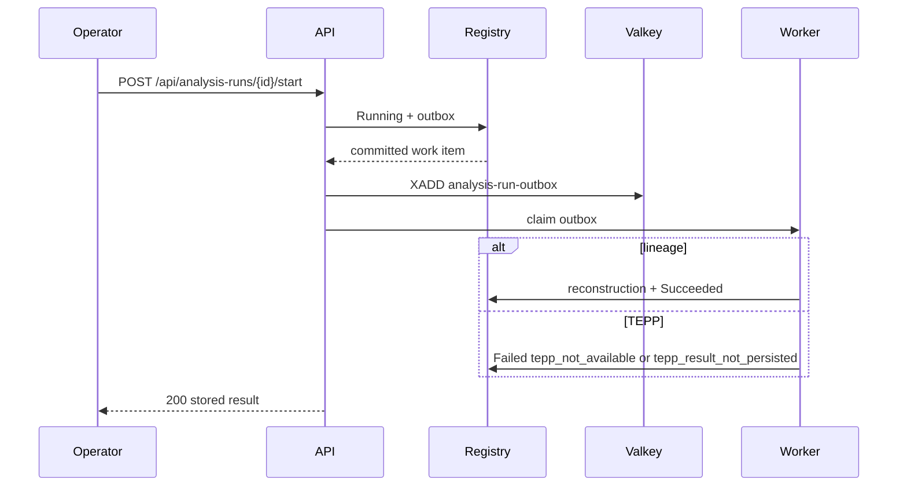

# ADR 0023 — Durable start outbox and Valkey wake-up

**Decision status:** Accepted on this active PR; not protected-main truth until merge
**Date:** 2026-08-17
**Depends on:** ADR 0013 registry; ADR 0017 authorized create; ADR 0021
authorized lineage start; ADR 0022 authorized TEPP start
**Refs:** Issue #79 (Milestone 2 parent); ADR 0013 follow-up 3

## Context

ADR 0021 and ADR 0022 start a Pending lineage or TEPP run in the same
request transaction as reconstruct / `tepp_client`. That is honest: a
crash rolls back to Pending. It is not durable. A buyer who clicked
Start and then lost the process cannot tell whether work began. TEPP's
HTTP call also sits inside the registry write.

ADR 0013 follow-up 3 asked for a normalized PostgreSQL outbox and a
Valkey delivery worker. The activity stream already uses Valkey as an
event queue, not a second database. The missing slice is one immutable
start-work row committed with Running, then a worker that claims that
row and finishes ThreadWeave or `tepp_client`.

## Decision

`POST /api/analysis-runs/{id}/start` splits into two authorized
transactions:

1. lock the visible Pending run, append Running, insert one
   `analysis_run_outbox` row whose digest hashes run id, kind, snapshot
   digest, and cutoff — never a post body or a theta — then commit;
2. `XADD` the wake-up onto the Valkey stream `analysis-run-outbox`
   (a missing Valkey does not roll back the outbox);
3. lock that outbox row, append `analysis_outbox_claimed`, run the same
   reconstruct or `tepp_client` path as ADR 0021 / ADR 0022, append the
   terminal status, then append `analysis_outbox_delivered`.

A Succeeded retry still replays the stored digest. A Running restart
with an undelivered outbox is delivery, not a second start. A Running
row without pending work stays 409. Period-report stays 422. Failed
TEPP remains `tepp_not_available` / `tepp_result_not_persisted`. The
HTTP response still waits for delivery so the operator sees the A-100
fork or the Failed TEPP row without polling.

`make seed` writes a delivered outbox row on the Demo Corp lineage and
TEPP runs so open-after-seed matches the start path. Retention purge
deletes delivery, outbox, reconstruction, and snapshot membership
before the registry rows.

## Consequences

Start survives a crash after Running. Refreshing a queued run finishes
the same work item. Valkey is a wake-up, not a source of truth. Do not
invent a theta, and do not stamp Succeeded from a missing reconstruct
library.

## References — APA 7th

Hohpe, G., & Woolf, B. (2003). *Enterprise integration patterns:
Designing, building, and deploying messaging solutions*.
Addison-Wesley.

International Organization for Standardization. (2019). *ISO 8601-1:2019:
Date and time—Representations for information interchange—Part 1: Basic
rules* (confirmed 2024; Amendment 1:2022).

Moreau, L., & Missier, P. (Eds.). (2013). *PROV-DM: The PROV data model*.
World Wide Web Consortium. https://www.w3.org/TR/prov-dm/

World Wide Web Consortium. (2013). *PROV-O: The PROV ontology* (W3C
Recommendation). https://www.w3.org/TR/prov-o/
