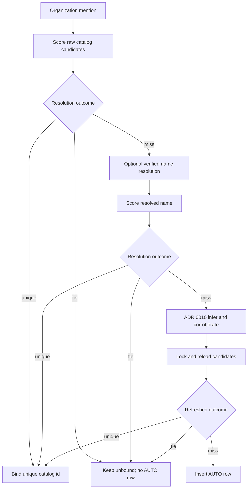

# ADR 0026 — Tied organization similarity stays unbound

**Decision status:** Accepted  
**Date:** 2026-08-17

## Context

Role-and-responsibility and Keyman ingestion resolve free-text organization
names against `corporate_entity`. The former resolver returned either one
catalog id or `None`. That collapsed two materially different outcomes:

1. no candidate met the minimum similarity threshold; and
2. two or more distinct catalog ids shared the best score.

A genuine miss may enter ADR 0010's inference-and-corroboration path. A tie
must not. Treating a tie as a miss can create a third, deterministic
`AUTO-...` row for a name that is already represented by multiple catalog
records. It can also bind whichever homonym happened to appear first in an
unordered candidate result.

Keyman adds another boundary: it may run a verified abbreviation rewrite
before hierarchy resolution. If a raw tied name is rewritten first, the new
string can appear to be a miss and incorrectly enter the creation path.

Fellegi and Sunter's record-linkage decision framework retains an uncertain
region rather than forcing a match. In this product, an equal top score is
that review state. String similarity remains candidate generation, not proof
of identity.

## Decision

`score_corporate_entity` classifies each organization mention as:

- `unique`: exactly one distinct catalog id has the top score at or above
  the threshold;
- `miss`: no candidate reaches the threshold; or
- `tie`: multiple distinct catalog ids share the top qualifying score.

Only `unique` returns a catalog id. Only `miss` may continue into ADR 0010
inference and corroborated creation. `tie` returns unbound immediately.

The same classification is repeated after the advisory creation lock and
catalog reload. If concurrent writes make the refreshed result a tie, no
insert occurs.

Keyman evaluates the raw organization name before abbreviation rewriting.
A raw tie bypasses name resolution and hierarchy inference, remains text,
and stores no new catalog id. This prevents a resolver rewrite from turning
known ambiguity into an apparent miss.

Duplicate candidate rows carrying the same `corporate_entity_id` are one
candidate, not a tie.

## Consequences

- Equal top scores are deterministic and fail closed rather than depending
  on row order.
- A tied organization name never creates an `AUTO-` catalog row, including
  with live resolver, inference, and verification clients.
- Genuine misses retain the existing, corroborated hierarchy creation path.
- Buyers see ambiguous organization names as text until the catalog has a
  unique identity decision.
- Future collective entity resolution may use relational context to resolve
  ties, but must publish a reviewed unique result before binding.

## References — APA 7th

Bhattacharya, I., & Getoor, L. (2007). Collective entity resolution in
relational data. *ACM Transactions on Knowledge Discovery from Data, 1*(1),
Article 5. https://doi.org/10.1145/1217299.1217304

Christen, P. (2012). *Data matching: Concepts and techniques for record
linkage, entity resolution, and duplicate detection*. Springer.
https://doi.org/10.1007/978-3-642-31164-2

Fellegi, I. P., & Sunter, A. B. (1969). A theory for record linkage.
*Journal of the American Statistical Association, 64*(328), 1183–1210.
https://doi.org/10.2307/2286061
