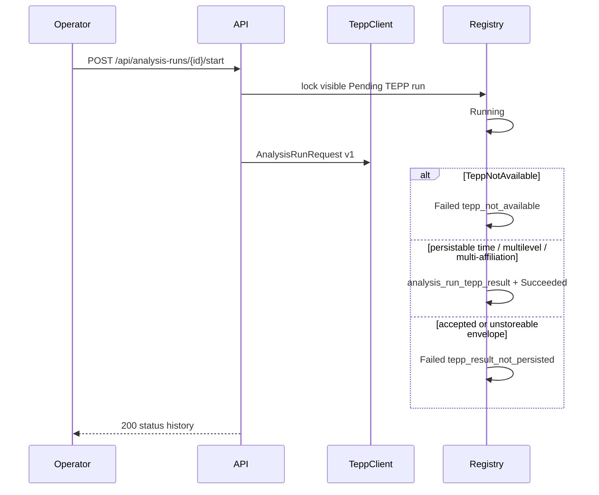

# ADR 0034 — Persistable TEPP time / multilevel / multi-affiliation results become Succeeded

**Decision status:** Accepted on this active PR; not protected-main truth until merge
**Date:** 2026-08-17
**Depends on:** ADR 0013 registry; ADR 0014 authorized read; ADR 0022
authorized TEPP start; ADR 0023 durable outbox
**Refs:** Issue #79 (Milestone 2 parent); ADR 0022 left Succeeded TEPP
as a later slice

## Context

ADR 0022 submits TEPP's published `AnalysisRunRequest` on
`POST /api/analysis-runs/{id}/start`. A missing or refused transport
is Failed / `tepp_not_available`. An `accepted` ack is Failed /
`tepp_result_not_persisted`. That fail-closed path is honest, but a
buyer who connects a live TEPP transport still cannot see that a
**time / multilevel / multi-affiliation** measurement landed.

This product must not invent a theta, IRT item parameter, topic, or
ALR score. Those stay in TEPP and fast-mlsirm. The missing work is to
store the persistable aggregates TEPP already returned and mark that
run Succeeded.

## Decision

1. **Persistable envelope.** `lineageweave.tepp_result` accepts only
   contract version 1 with `result_kind`
   `time_multilevel_multi_affiliation`, a measured clock, and
   non-negative `interval_count`, `level_count`, and
   `affiliation_count`. An `accepted` ack, a theta, IRT item
   parameters, or a topic/ALR payload is not persistable.
2. **Start.** `_deliver_tepp_measurement` still submits through
   `tepp_client`. A persistable envelope is written to
   `analysis_run_tepp_result` and the run appends Succeeded. Missing
   transport stays Failed / `tepp_not_available`. An envelope this
   product cannot store, including a missing result table, stays
   Failed / `tepp_result_not_persisted`. Succeeded is never stamped
   from a mere `accepted` ack.
3. **Authorized read.** List and detail project clocks, affiliation
   counts, interval counts, level counts, and the result digest.
   No theta and no provider body.
4. **Home copy.** A Succeeded TEPP row tells the operator to open the
   run and read the measured clocks and affiliation counts. The list
   button accessible name includes that sentence (WCAG 2.2 SC 4.1.2).
5. **Seed.** Demo Corp keeps the Failed / `tepp_not_available` row
   for a missing transport. Seed also records
   **TEPP measurement · Succeeded · Demo Corp** from an in-process
   persistable envelope on the same snapshot. Public git stays
   synthetic Demo Corp only.

Period-report start stays 422. Create stays lineage-only. IRT leftover
pairs and RankWeave fusion are unchanged.

## Consequences

After `make seed`, Demo Analyst sees both the Failed TEPP row and
**TEPP measurement · Succeeded · Demo Corp**. Opening the Succeeded
row shows measured clocks and affiliation counts. A screen reader on
that list button hears the next action, not only the title. Connecting
`TEPP_TRANSPORT_URL` can now finish a Pending TEPP run as Succeeded
when the transport returns a persistable envelope. Do not invent a
theta.

Existing volumes apply `0028_analysis_run_tepp_result.sql`. Granted
retention purge empties `analysis_run_tepp_result` when that table
exists.

## References — APA 7th

American Educational Research Association, American Psychological
Association, & National Council on Measurement in Education. (2014).
*Standards for educational and psychological testing*. American
Educational Research Association.

International Organization for Standardization. (2019). *ISO 8601-1:2019:
Date and time—Representations for information interchange—Part 1: Basic
rules* (confirmed 2024; Amendment 1:2022).

Moreau, L., & Missier, P. (Eds.). (2013). *PROV-DM: The PROV data model*.
World Wide Web Consortium. https://www.w3.org/TR/prov-dm/

World Wide Web Consortium. (2022). *Time ontology in OWL* (W3C
Recommendation). https://www.w3.org/TR/owl-time/

World Wide Web Consortium. (2023). *Web content accessibility
guidelines (WCAG) 2.2* (W3C Recommendation).
https://www.w3.org/TR/WCAG22/
