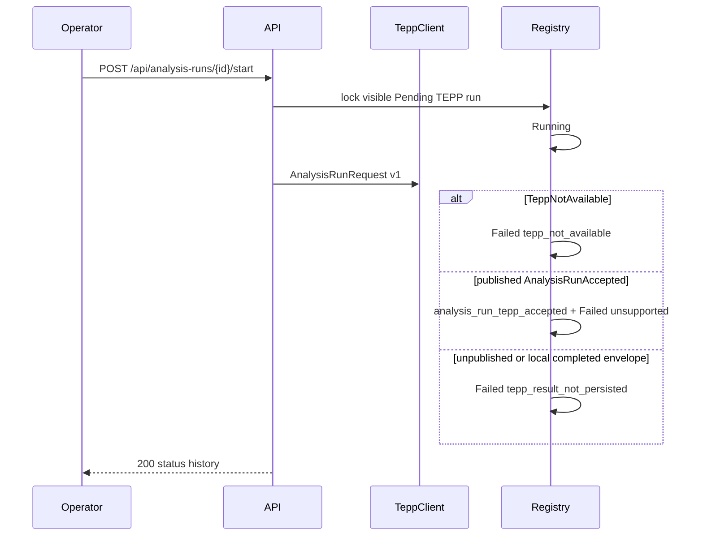

# ADR 0035 — TEPP accepted acknowledgements are aggregate transport evidence, not Succeeded measurement

**Decision status:** Accepted on this active PR; not protected-main truth until merge
**Date:** 2026-08-17
**Depends on:** ADR 0013 registry; ADR 0014 authorized read; ADR 0022
authorized TEPP start; ADR 0023 durable outbox; ADR 0034 v2.12.0
local result table (kept, not rewritten)
**Refs:** LineageWeave #74; TEPP main `AnalysisRunRequest` /
`AnalysisRunAccepted` v1

## Context

TEPP main currently publishes a versioned analysis-run request and an
accepted acknowledgement (`contract_version`, opaque `run_id`,
`run_state=accepted`, `idempotency_key`). Protected TEPP main has no
production HTTP service and no implemented completed-result DTO
(ContextualWisdomLab, 2026a, 2026b). Scientific completion, six-clock
temporal semantics, membership weights, uncertainty, and estimator
validation remain TEPP-owned and unavailable to consumers except
through a later versioned artifact contract (American Educational
Research Association et al., 2014; National Institute of Standards and
Technology, 2015).

LineageWeave v2.12.0 (ADR 0034) introduced a local
`time_multilevel_multi_affiliation` envelope and stamped Succeeded
when a transport returned that shape. That envelope is not emitted or
owned by TEPP upstream. Representing it as a scientifically completed
TEPP measurement is a product-contract honesty defect.

Migration `0028_analysis_run_tepp_result.sql` may already exist on
buyer volumes. This correction must stay additive.

## Decision

1. **Published boundary only.** Start still submits TEPP's
   `AnalysisRunRequest` v1 through `tepp_client`. A missing transport
   stays Failed / `tepp_not_available`.
2. **Accepted is not completed.** A published `AnalysisRunAccepted`
   envelope is stored on `analysis_run_tepp_accepted` as **aggregate
   transport evidence** and the run appends Failed /
   `tepp_completed_result_unsupported`. Succeeded is never stamped
   from an accepted acknowledgement or from any LineageWeave-local
   completed envelope, including `time_multilevel_multi_affiliation`.
   An unpublished shape stays Failed / `tepp_result_not_persisted`.
3. **Authorized evidence.** List and detail project contract version,
   opaque accepted run id, `run_state`, recorded/received clocks, and
   a full SHA-256 that recomputes from those fields. Counts appear
   only when a published completed-result contract names them. This
   slice therefore shows no interval, level, or affiliation counts.
   The section label is `aggregate transport evidence`, never
   `validated multilevel estimate`.
4. **Unavailable scientific fields.** Completed-artifact identity,
   membership weights, uncertainty, validation, and scientific
   estimands are explicitly unavailable until TEPP publishes a
   versioned completed-result contract. Missing fields fail closed.
   Do not infer theta, topics, item parameters, affiliation
   identities, confidence, or completion.
5. **Hidden runs.** Broader run access must not reveal hidden
   evidence. Hidden runs stay 404 with a generic next action
   (ADR 0014).
6. **Additive upgrade.** Keep `analysis_run_tepp_result` and do not
   rewrite 0028. Fresh seed writes Failed accepted evidence on the
   existing Demo Corp idempotency key
   `demo-tepp-seed-2026-w02-succeeded`. Legacy Succeeded TEPP rows
   remain legally terminal; buyer copy must still refuse a validated
   multilevel estimate.

## Consequences

After `make seed`, Demo Analyst still sees **TEPP measurement · Failed
· Demo Corp** for a missing transport, plus a second Failed TEPP row
that stores accepted transport evidence. Opening that row shows
**Measurement evidence**. Connecting `TEPP_TRANSPORT_URL` can persist
the same published acknowledgement and must not finish the run as
Succeeded. Do not invent a theta.

Existing volumes apply `0029_analysis_run_tepp_accepted.sql` after
0028. Granted retention purge empties the accepted table when it
exists.

## Follow-up — v2.12.2 distinct receipt and row-write clocks

Decision 3 already named `received_at` (transport-response receipt)
and `recorded_at` (row persistence). v2.12.1 bound one application
instant into both columns, so Measurement evidence copy always showed
two clocks. v2.12.2 passes the post-transport instant as
`received_at` and the row-write instant as `recorded_at`, clamped so
start ≤ receipt ≤ row-write (National Institute of Standards and
Technology, 2015). Authorized copy shows the second clock only when
the displayed instants differ. Digest recomputation is unchanged and
still excludes clocks. Hidden runs stay 404 (ADR 0014). Migration
0029 is not rewritten; the two columns already exist.

## References — APA 7th

American Educational Research Association, American Psychological
Association, & National Council on Measurement in Education. (2014).
*Standards for educational and psychological testing*. American
Educational Research Association.

ContextualWisdomLab. (2026a). *TEPP API and modular integration
contract*.
https://github.com/ContextualWisdomLab/TEPP/blob/main/docs/API_CONTRACT.md

ContextualWisdomLab. (2026b). *Temporal Event Psychometrics Platform —
approved PRD v0.4*.
https://github.com/ContextualWisdomLab/TEPP/blob/main/docs/product/prd-v0.4-approved.md

National Institute of Standards and Technology. (2015). *Secure Hash
Standard (SHS)* (FIPS PUB 180-4).
https://doi.org/10.6028/NIST.FIPS.180-4

World Wide Web Consortium. (2023). *Web content accessibility
guidelines (WCAG) 2.2* (W3C Recommendation).
https://www.w3.org/TR/WCAG22/
