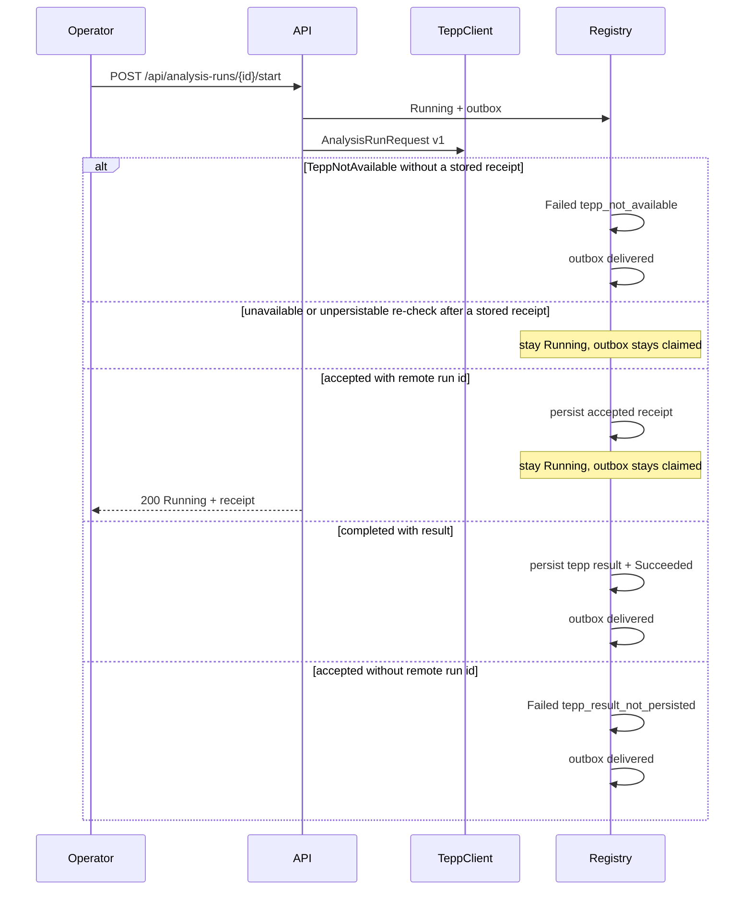

# ADR 0162 — Persist TEPP AnalysisRunAccepted as transport evidence

**Decision status:** Accepted on this active PR; not protected-main truth until merge
**Date:** 2026-08-23
**Depends on:** ADR 0022 authorized TEPP start; ADR 0023 analysis-run outbox
**Amends:** ADR 0022 (accepted envelopes are no longer Failed /
`tepp_result_not_persisted` when they carry a remote run id)
**Refs:** Issue #277; terminal-result consumption continues in ADR 0178 after
[TEPP#156](https://github.com/ContextualWisdomLab/TEPP/issues/156) closed

## Context

TEPP's published start response is `AnalysisRunAccepted`: a durable
submission receipt with a remote `run_id`. It is not a temporal
measurement. ADR 0022 treated any non-completed envelope as Failed /
`tepp_result_not_persisted` so LineageWeave would not stamp Succeeded
from transport evidence. That is honest about measurement authority
and dishonest about operator progress: a normal live TEPP accept
looks like a product failure.

Issue #277 requires a split lifecycle. This slice covers the
unblocked half: persist the accepted receipt, keep the local run
`Running`, and never invent a theta. Polling TEPP's versioned
completed-result contract stays blocked on TEPP#156.

## Decision

Classify a `TeppClient.submit_analysis_run` envelope as follows. On a re-check
with a stored receipt, an outcome carrying neither another persistable receipt
nor a completed result leaves the run Running; only durable evidence may
advance or revoke durable acceptance. A new receipt still must pass the
immutable remote-run and request-digest checks below.

1. `TeppNotAvailable` with no stored receipt → Failed /
   `tepp_not_available`. Seed keeps this default. Do not change seed to
   Running.
2. `status` or `run_state` in `{completed, succeeded}` plus a result
   object plus a remote run id → Succeeded, persist
   `analysis_run_tepp_result` (migration 0027).
3. `status` or `run_state` in `{accepted, queued, running}` plus a
   remote run id (`analysis_run_id`, `run_id`, or `remote_run_id`) →
   persist `analysis_run_tepp_accepted_receipt`, leave the local run
   Running, do not append a terminal status, and do not mark the
   outbox delivered.
4. `accepted` / `queued` / `running` without a remote run id → Failed /
   `tepp_result_not_persisted` when no receipt was previously stored. Empty
   re-check envelopes cannot revoke an existing receipt.
5. Anything else → Failed / `tepp_result_not_persisted` when no receipt was
   previously stored.

The receipt table stores transport evidence only: remote run id,
request digest, receipt digest, accepted status code, model contract
version, snapshot id, knowledge cutoff, and received time. It does
not store a result JSON, a theta, or a calibrated score. A changed
remote run id or request digest for the same local run fails closed.
Accepted, queued, and running transport-state progression for the
same remote run and request remains idempotent; the first receipt stays
the durable acceptance evidence.

`GET /api/analysis-runs` and `GET /api/analysis-runs/{id}` may attach
`tepp_accepted_receipt`
`{remote_run_id, accepted_status_code, received_at}` so the operator
can see that TEPP accepted the work. Missing migration 0171 is an
empty attachment, not a 500; list rows load receipts in one bounded
query rather than one query per run. Global Ask must not promote this
receipt into an answer claim.

Completed-result request-binding revalidation is ADR 0178. Automatic polling
and backoff remain unavailable until TEPP publishes a provider-owned HTTP
status service and evidence-based retry policy. This ADR does not invent a
local psychometric substitute while waiting.

## Consequences

A connected TEPP transport that returns `accepted` plus a remote run
id no longer looks like a product failure. The operator refreshes a
Running run. Refresh may replay the same idempotent submit; an unavailable or
unpersistable response after that durable receipt keeps the run Running and its
outbox claimed, and it still must not stamp Succeeded from the receipt. Seed
and an initial empty `accepted` envelope stay Failed.
Do not invent a theta.

## References — APA 7th

Hohpe, G., & Woolf, B. (2003). *Enterprise integration patterns:
Designing, building, and deploying messaging solutions*. Addison-Wesley.

International Organization for Standardization. (2019). *ISO 8601-1:2019:
Date and time—Representations for information interchange—Part 1: Basic
rules* (confirmed 2024; Amendment 1:2022).

Moreau, L., & Missier, P. (Eds.). (2013). *PROV-DM: The PROV data model*.
World Wide Web Consortium. https://www.w3.org/TR/prov-dm/
