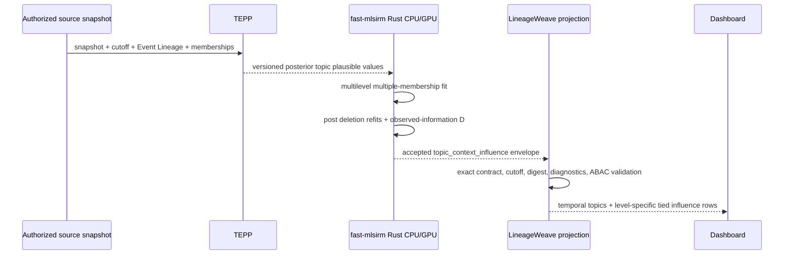

# ADR 0210: TEPP temporal topics and fast-mlsirm context influence

- Status: Accepted
- Implementation maturity: producer-contract required; consumer projection not yet shipped
- Date: 2026-08-25
- Depends on: ADR 0132 (TEPP topic-lineage boundary), ADR 0206 (operations Dashboard)
- Upstream authorities: TEPP ADR 0012; fast-mlsirm ADR 0002 and ADR 0007

## Context

The operations Dashboard must show how topics evolve through Event Lineage and
which posts materially influence a topic's fitted state at business-unit,
process-unit (PU), team, and person levels. A lexical cluster, one topic model
per time bin, raw topic proportion, engagement count, or hand-authored weighted
sum cannot answer that question. Those approaches lose stable topic identity,
ignore multiple membership, understate dependence, or silently redefine
"important".

TEPP's approved PRD and ADR 0012 already own Temporal Relational Shared-Latent
Topic Measurement (TRSL-TM): global topic identities, event time, explicit
document relations, weighted cross-classified memberships, posterior
uncertainty, and topic activity over time. LineageWeave therefore consumes a
TEPP artifact; it does not fit or label topics locally.

For this surface, **important post** has one exact statistical meaning:
case-deletion influence on a fitted topic-by-context parameter. For topic
`k`, context dimension `l`, and post `d`, fast-mlsirm reports

\[
D_{dkl}=(\hat\psi_{kl,-d}-\hat\psi_{kl})^\top
I_{kl}(\hat\psi)(\hat\psi_{kl,-d}-\hat\psi_{kl}),
\]

where `I` is the same fitted model's observed-information block and
`psi[-d]` is the estimate after removing that post's complete observation.
This is a multilevel case-deletion diagnostic, not business value, causal
impact, author performance, or an outlier-removal instruction (Shi & Chen,
2008). It is selected because it is defined by the fitted likelihood and
observed information, so no arbitrary cross-level weights or score constants
are introduced.

## Product requirements (PRD)

1. The Dashboard presents TEPP topics on one event-time axis with stable topic
   identity and explicit active, dormant, and reactivated states. Topic
   birth/split/merge/retirement appears only when the TEPP artifact explicitly
   supplies that lineage event.
2. Selecting a topic shows separate business-unit, PU, team, and person views.
   A post may belong to more than one context in the same dimension and to
   contexts in several dimensions. The UI never flattens those assignments
   into a single owner.
3. Each level lists posts by fast-mlsirm case-deletion influence `D[d,k,l]`,
   with exact value, uncertainty/diagnostic status, source event time, topic
   state, membership provenance, and a link to the authorized source post.
   No score threshold is applied. Equal values remain ties; deterministic
   source time and post identity order only stabilize rendering and do not
   break the statistical tie.
4. Copy names the estimand as **model influence**. It must not say business
   importance, performance, causality, risk, or priority unless a separately
   validated outcome model establishes that construct.
5. Pending, failed, non-converged, unidentified, incomplete-membership,
   CPU/GPU-parity-failed, or contract-mismatched runs render an actionable
   unavailable state. LineageWeave never fills them with keyword search,
   engagement counts, RankWeave output, default weights, or a local estimate.
6. All rows are authorization-filtered before topic/context aggregation. A
   hidden source post contributes neither a displayed rank nor an exact value
   that could disclose its influence.
7. The topic view is a Dashboard section, not a new external-information
   board. It reuses the existing GNB destination and post-detail navigation.

## Technical requirements (TRD)

### TEPP producer contract

The accepted TEPP result schema must include:

- immutable model-run, source-snapshot SHA-256, knowledge cutoff, model/schema
  version, event clock, and posterior-draw identity;
- global topic identity and activity interval, plus explicit lineage event and
  provenance when present;
- per-post posterior logistic-normal topic coordinates or plausible values,
  not a hard topic label derived from a threshold;
- Event Lineage/document-relation edges admitted by the TEPP run;
- versioned, time-valid business-unit, PU, team, and person membership edges
  with source-derived weights and evidence. A missing weight is unavailable;
  equal membership is never invented.

LineageWeave verifies the exact snapshot and cutoff before persisting a 3NF
projection. It does not inspect TEPP's private tables or reinterpret posterior
coordinates.

TEPP protected main currently exposes `tepp.trsl_topic_lineage.v1`, a
digest-bound CPU-`f64` artifact containing fitted forward sequence edges and
aggregate counts. That is real producer progress, but it does not contain the
per-post posterior coordinates/plausible values or dimension-qualified
membership evidence required by this decision. LineageWeave must reject that
schema for the context-influence surface rather than reconstruct the omitted
inputs from its association-strength field.

### fast-mlsirm producer contract

fast-mlsirm owns a versioned `topic_context_influence` estimand over TEPP
posterior plausible values. It jointly retains topic, event time, and the four
dimension-qualified multiple-membership designs. Rust owns likelihood,
gradients, observed information, deletion refits, posterior-draw combination,
and influence arithmetic. The CPU `f64` path is the numerical reference;
GPU execution is a Rust device path and must pass identification-aware parity.
Python may validate and marshal only.

The result envelope contains the exact TEPP run/snapshot/cutoff, fast-mlsirm
version and code revision, estimand/schema version, backend/precision,
convergence and identification diagnostics, posterior-draw coverage, context
membership fingerprint, post/topic/context identities, `D[d,k,l]`, and its
uncertainty evidence. A result for one context dimension cannot be copied to
another dimension.

### LineageWeave consumer and persistence

Use normalized objects such as `topic_model_run`, `topic_definition`,
`topic_activity_interval`, `topic_lineage_relation`, `topic_post_coordinate`,
`topic_context_membership`, `topic_influence_run`, and
`topic_post_context_influence`. Large result tables are partitioned by tenant
and modeled-period identity rather than one global time partition. Foreign
keys bind every influence row to the exact TEPP and fast-mlsirm artifacts.

The API returns only persisted accepted rows after ABAC. It returns exact
ties, producer diagnostics, and provenance rather than computing or
renormalizing scores. The frontend renders an exact-value table alongside the
temporal topic view, uses text/pattern as well as color for topic state, and
supports keyboard, touch, reduced motion, narrow viewports, and screen readers.

## Verification and acceptance

The feature is not release-ready until all of the following are protected-main
evidence rather than a local or contract-only claim:

1. TEPP simulation recovers known global topic identity, temporal prevalence,
   relation effects, dormancy/reactivation, and cross-classified membership
   effects with reported bias, RMSE, interval coverage, and posterior-draw
   diagnostics; relation-aware splits prove no future leakage.
2. fast-mlsirm simulation recovers known context effects and ranks known
   injected influential posts by the declared deletion estimand. Tests include
   nested, crossed, weighted multiple-membership, time-varying membership,
   sparse/unbalanced levels, missing observations, exact ties, and masked or
   jointly influential cases. Correlation alone is not acceptance evidence.
3. Rust CPU worker-count determinism and CPU/GPU parity pass on the same
   estimand. A GPU test proves actual device execution; fallback is explicit.
4. Contract tests reject wrong snapshot/cutoff/model/schema, missing posterior
   draws, invented membership weights, non-convergence, unidentified
   information blocks, non-finite influence, mixed producer runs, and partial
   result sets.
5. Integration tests prove 3NF foreign-key integrity, idempotent replay, hot-
   partition distribution, pre-aggregation ABAC, and no hidden-post leakage.
6. Storybook and browser screenshots cover populated, ties, dormant/reactivated,
   multiple-membership, unavailable, narrow, dark, reduced-motion, keyboard,
   and touch scenes. The exact-value table remains usable without the chart.
7. Public docstring, production line/branch, interaction, design-token, i18n,
   and edge-case coverage remain 100% under repository gates.

## Alternatives considered

1. **LineageWeave fits a local dynamic topic model.** Rejected because TEPP
   owns the temporal/relational posterior and measurement contract.
2. **Rank by posterior topic share, recency, engagement, or a weighted sum.**
   Rejected because it ignores contextual influence or invents a construct and
   weights. RankWeave may present an independently authorized retrieval rank,
   but it is not this measurement.
3. **Use fast-mlsirm's current crossed binary kernel unchanged.** Rejected
   because thresholding TEPP posterior coordinates into binary responses
   discards uncertainty and changes the estimand. The producer must expose the
   versioned topic-context influence contract above.
4. **Call the diagnostic business impact.** Rejected. Statistical influence
   measures sensitivity of fitted topic/context parameters, not causal or
   economic value.

## Consequences

The user receives a precise, reproducible answer to “which posts shape this
topic at this organizational level?” without arbitrary weights. Activation
depends on two upstream protected contracts and full recovery evidence; until
then the Dashboard truthfully shows why the result is unavailable rather than
inventing a ranking.

## References (APA 7th)

American Educational Research Association, American Psychological
Association, & National Council on Measurement in Education. (2014).
*Standards for educational and psychological testing*. American Educational
Research Association.

Blei, D. M., & Lafferty, J. D. (2006). Dynamic topic models. In *Proceedings
of the 23rd International Conference on Machine Learning* (pp. 113–120).
Association for Computing Machinery. https://doi.org/10.1145/1143844.1143859

Browne, W. J., Goldstein, H., & Rasbash, J. (2001). Multiple membership
multiple classification (MMMC) models. *Statistical Modelling, 1*(2),
103–124. https://doi.org/10.1177/1471082X0100100202

Fox, J.-P., & Glas, C. A. W. (2001). Bayesian estimation of a multilevel IRT
model using Gibbs sampling. *Psychometrika, 66*(2), 271–288.
https://doi.org/10.1007/BF02294839

Jin, I. H., Jeon, M., Schweinberger, M., Yun, J., & Lin, L. (2022).
Multilevel network item response modelling for discovering differences
between innovation and regular school systems in Korea. *Journal of the Royal
Statistical Society: Series C (Applied Statistics), 71*(5), 1225–1244.
https://doi.org/10.1111/rssc.12569

Molenaar, D., & Jeon, M. (2026). Regularized joint maximum likelihood
estimation of latent space item response models. *Psychometrika, 91*(1),
335–359. https://doi.org/10.1017/psy.2025.10068

Shi, L., & Chen, G. (2008). Case deletion diagnostics in multilevel models.
*Journal of Multivariate Analysis, 99*(9), 1860–1877.
https://doi.org/10.1016/j.jmva.2008.01.023

Zhang, D. C., & Lauw, H. (2022). Dynamic topic models for temporal document
networks. In *Proceedings of the 39th International Conference on Machine
Learning* (pp. 26281–26292). PMLR.
https://proceedings.mlr.press/v162/zhang22n.html
