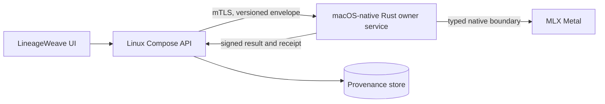

# ADR 0226: macOS-native MLX boundary for Rust-owned computation

- Status: Accepted
- Date: 2026-08-26
- Amends: ADR 0208 and ADR 0210
- Clarifies: ADR 0076

## Context

LineageWeave runs its product services in Linux containers through Docker or
Colima on Apple Silicon. The MLX Metal backend is not a Linux-container
capability. MLX enables Metal on Darwin and requires Apple Silicon, macOS 14,
Xcode 15, and the macOS 14 SDK; its Linux distributions provide CPU or NVIDIA
CUDA backends instead. A Colima Linux VM therefore cannot truthfully issue an
MLX Metal execution receipt merely because its macOS host has an Apple GPU.

ADR 0208 assigns psychometric and scientific numerical kernels to the Rust
cores of TEPP and fast-mlsirm. RankWeave instead owns its current
dependency-free Python retrieval-fusion, evaluation, and audit contract; that
contract is neither a Rust kernel nor evidence for a future Rust vector-scoring
owner. Moving an accepted TEPP or fast-mlsirm formula into Python to gain access
to MLX would violate its ownership boundary. ADR 0076's prohibition on
LineageWeave-specific MLX model-provider routes remains unchanged: this ADR is
about an already accepted owner-repository Rust kernel, not LLM, VISION,
retrieval fusion, or an as-yet-unaccepted vector-scoring service.

## Decision

1. On Apple Silicon, an owner repository may execute an accepted numerical
   kernel through MLX Metal only in a **macOS-native process**. The owner Rust
   core remains the algorithm and contract authority and links the MLX C/C++
   surface or an equally typed native FFI boundary. Python may launch or marshal
   a generated binding, but it may not implement, transform, normalize, score,
   or repair the mathematics.
2. Linux Compose containers never claim MLX Metal execution. They call the
   macOS-native owner service through an explicitly configured authenticated
   HTTPS boundary reachable from the container host gateway. No endpoint,
   credential, or certificate is baked into an image or committed. Mutual TLS
   is required; the native service binds only to the local host interface and
   authorizes the exact owner contract and tenant scope.
3. The transport uses a versioned request/result envelope with input and output
   SHA-256 digests, owner code revision, estimand and schema versions, device
   identity, backend (`mlx_metal`, `mlx_cpu`, `mlx_cuda`, or `rust_cpu`),
   precision, worker configuration, start/end instants, convergence and
   identification diagnostics, and a signed execution receipt. A requested
   Metal run without an `mlx_metal` receipt fails closed.
4. Linux CI and non-Apple deployments may execute an owner-approved MLX CPU,
   MLX CUDA, deterministic multithreaded Rust CPU, or owner-native Rust OpenCL
   path. MLX does not publish an OpenCL backend, so an OpenCL receipt MUST be
   `rust_opencl`, never `mlx_opencl`. The caller requests one exact capability;
   runtime discovery cannot silently choose another backend. CPU portability
   is not evidence that Metal, CUDA, or OpenCL was exercised.
5. Every newly accelerated estimand requires deterministic synthetic recovery,
   Rust-reference versus MLX numerical parity with the estimand's
   identification constraints, non-finite and shape rejection, device-receipt
   verification, disconnect/timeout/idempotency tests, and an actual
   Apple-Silicon Metal integration run. A tolerance must come from the owner's
   numerical error analysis and precision contract; no local constant is
   invented by LineageWeave.
6. LineageWeave remains a consumer. It may persist and authorize an accepted
   receipt but never selects an MLX device, retries on a different mathematical
   backend, or recomputes a rejected result. Customer UI presents the measured
   result, uncertainty, evidence, and next action; it does not expose MLX,
   Colima, FFI, transport, schema, or package details.
7. Deployment is fail-closed and reversible. If the native service is absent,
   untrusted, incompatible, or produces a parity-invalid result, the affected
   channel is unavailable and dropped under the existing renormalization
   contract. Rollback disables the native endpoint and returns to an already
   accepted owner CPU contract; it never substitutes Python arithmetic.

## Docker Compose backend contract

Owner repositories publish four additive, versioned Compose overlays. The
base product Compose file contains no accelerator device and remains the CPU-
portable control plane. A deployment selects exactly one overlay and records
its rendered Compose digest in the execution receipt.

| Requested backend | Where computation runs | Compose/device contract | Required proof before accepting work |
|---|---|---|---|
| `rust_cpu` or `mlx_cpu` | Linux owner-service container | `compose.compute-cpu.yml`; no host device mapping | container CPU architecture, owner self-test, worker-count determinism, memory limit and actual backend receipt |
| `mlx_cuda` | Linux owner-service container on an NVIDIA host | `compose.compute-cuda.yml`; Docker device reservation with `driver: nvidia`, either an explicit `device_ids` list or measured `count` (never both), and mandatory `capabilities: [gpu]` | NVIDIA driver/toolkit and MLX CUDA compatibility, selected device identity, a real CUDA kernel self-test, CPU/CUDA parity |
| `rust_opencl` | Linux owner-service container | `compose.compute-opencl.yml`; a vendor CDI device is preferred. If CDI is unavailable, map only preflight-discovered render/compute nodes and mount the matching vendor ICD read-only; never map all of `/dev` or grant privileged mode | OpenCL platform/device identity, ICD and kernel availability, a real OpenCL kernel self-test, CPU/OpenCL parity |
| `mlx_metal` | macOS-native Rust owner service outside Colima | no GPU device in Compose. `compose.compute-metal-host.yml` supplies only the opaque mTLS endpoint and certificate-file mounts from runtime secrets | native arm64/macOS/SDK compatibility, Metal device identity, signed native-service health, a real MLX Metal kernel self-test, CPU/Metal parity |

The deployment procedure is normative:

1. Run the owner-supplied preflight in **plan mode**. It reads the container
   CPU/memory limits and enumerates only APIs available on that platform
   (MLX device query, NVIDIA management API, OpenCL ICD, or macOS Metal). It
   emits a machine-readable plan containing the requested backend, exact
   device identity, driver/runtime versions, resource limits, overlay digest,
   and failed prerequisites. It does not mutate Docker or select a fallback.
2. Reject the plan unless the requested backend and every prerequisite are
   satisfied. Device selection comes from an explicit administrator choice or
   the only compatible discovered device; multiple compatible devices require
   an explicit choice rather than catalog-order selection.
3. Validate the rendered configuration with
   `docker compose -f docker-compose.yml -f compose.compute-<backend>.yml config
   --quiet`. The macOS native service must already be healthy before the Metal
   host overlay is admitted.
4. Start with the same files and canonical project name:
   `docker compose -f docker-compose.yml -f
   compose.compute-<backend>.yml -p lineageweave up -d`. Secrets and mTLS
   material enter through runtime-only files or the platform secret store,
   never an image, Compose literal, log, or receipt.
5. Run the owner's device self-test and numerical parity acceptance. Only then
   mark the backend ready. Health means that the selected device executed the
   kernel; a process-level HTTP 200 is insufficient.
6. On a device, driver, receipt, parity, or connectivity failure, stop
   accepting new mathematical jobs and surface the channel as unavailable.
   Do not restart under CPU automatically. An authorized operator may render
   and admit the CPU overlay as a separate deployment decision.
7. Teardown uses the exact file set and project name with `down` and never
   removes volumes unless separately authorized. Test-only projects use an
   isolated project name and are removed after their evidence is retained.

Raw device mappings are a portability exception, not the default. The
generated OpenCL overlay must contain the exact preflight-discovered device
paths; a static wildcard, privileged container, host PID namespace, or broad
device cgroup permission is prohibited. CUDA follows Docker's device
reservation contract. CDI is used when the Docker daemon and vendor expose a
compatible device specification because it carries device nodes, libraries,
environment, and hooks as one auditable declaration.

## Runtime topology

## Consequences

- Apple GPU acceleration remains available without falsely treating a Linux
  VM as a Metal host.
- The native service becomes a separately supervised local component with
  certificate rotation, health, timeout, admission, audit, and resource-limit
  responsibilities.
- Compose stays portable. A machine without the native capability still runs
  the product and honestly reports the affected measurement as unavailable or
  uses a separately accepted owner CPU/CUDA result.
- TEPP and fast-mlsirm must each adopt this boundary in their own normative ADR
  before publishing an `mlx_metal` receipt for an accepted Rust kernel.
- RankWeave's current Python retrieval contract is unchanged by this ADR. Any
  future Rust vector-scoring owner requires its own accepted ownership and wire
  contract before this accelerator boundary can apply; this ADR does not assign
  that responsibility or require RankWeave to adopt MLX.

## Alternatives considered

1. **Run MLX Metal inside Colima.** Rejected because the guest is Linux and MLX
   disables its Metal backend there.
2. **Move the kernel into host Python.** Rejected because it transfers
   mathematical ownership out of Rust and duplicates formulas.
3. **Mount an unauthenticated local socket.** Rejected because VM socket
   forwarding is runtime-specific and an unauthenticated compute boundary can
   cross tenant and provenance scopes.
4. **Label any Apple-hosted run as Metal.** Rejected because host hardware does
   not prove which backend executed the operation.
5. **Call a Rust OpenCL kernel MLX.** Rejected because MLX has no OpenCL
   backend; backend identity is measurement provenance, not branding.

## References (APA 7th)

Hannun, A., Digani, J., Katharopoulos, A., & Collobert, R. (2023). *MLX: An
array framework for Apple silicon* [Computer software]. Apple Machine Learning
Research. https://github.com/ml-explore/mlx

MLX Contributors. (2026). *Build and install: MLX 0.32.1 documentation*.
https://ml-explore.github.io/mlx/build/html/install.html

MLX Contributors. (2026). *Unified memory: MLX 0.32.1 documentation*.
https://ml-explore.github.io/mlx/build/html/usage/unified_memory.html

Docker, Inc. (2026). *Run Docker Compose services with GPU access*.
https://docs.docker.com/compose/how-tos/gpu-support/

Docker, Inc. (2026). *Container Device Interface (CDI)*.
https://docs.docker.com/build/building/cdi/
