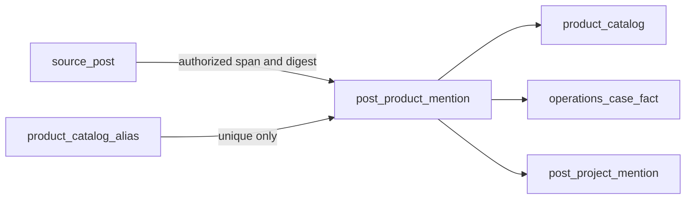

# ADR 0228: Evidence-bound product semantic catalog

- Status: Accepted
- Date: 2026-08-26
- Governs: product extraction, identity resolution, typed product relations, and historical backfill

## Context

Product references currently remain inside source text or unrelated operational
facts. Treating a word or tag as a product would conflate a text match with an
identified business entity, while forcing a best match would hide homonyms.
Imported weak or blank category/customer values remain raw source provenance,
not final semantic categories or resolved identities.
ADR 0184 also requires typed ontology navigation to remain distinct from Event
Lineage. ADRs 0036, 0052, and 0206 require authorized source evidence and exact
input provenance for semantic and operational assertions.

## Decision

`product_catalog` is the shared product identity across `product_group`,
`product_model`, `variant`, and `trade_item` levels. A parent foreign key
retains that hierarchy. Scoped GTIN and MPN identifiers live in
`product_catalog_identifier`; an identifier without issuer scope is not an
identity. `product_catalog_alias` is its normalized lookup vocabulary. Multiple catalog
identities may intentionally share an alias. A contextual-orchestrator
structured extraction supplies only product mentions and verbatim source
spans. LineageWeave validates the span against the authorized source, records
its post and SHA-256 digest, and resolves the normalized alias with four
outcomes:

- exactly one catalog identity: `unique`, with its foreign key;
- no catalog identity: `missing`, without a foreign key;
- more than one identity: `tie`, without a foreign key.
- unavailable catalog lookup: `unavailable`, without a foreign key.

Neither `missing` nor `tie` creates a catalog row. Keywords, tags, fuzzy
thresholds, provider calls, and locally guessed identities are prohibited.
Relations to operational facts and project mentions use foreign keys to the
existing normalized stores. These typed relations are an ontology navigation
projection, not Event Lineage.

The extraction request enumerates the request-scoped normalized target IDs
that the authorized focal post may relate to. contextual-orchestrator returns
one structured object containing mentions and relations; each relation names
one supplied target ID, one target-kind-specific closed relation code, and a
verbatim evidence span with its source post. LineageWeave rejects the entire
object when a target is absent from that request, a relation code is open or
wrong for the target kind, an ordinal is invalid, or evidence/provenance does
not match the authorized source. Mentions and accepted relations replace the
prior projection in one transaction. No lexical overlap between mention and
fact/project evidence creates a relation.

Post and Dashboard reads re-apply source eligibility and ABAC to every
relation evidence post. RDF projection uses the same normalized target and
closed predicate and must conform to the published ProductRelationAssertion
SHACL shape. Until the contextual-orchestrator revision providing the owned
structured-output transport is merged to its protected main and pinned by
exact merge SHA, provider-backed relation production remains unavailable;
local code and a branch head are not release authority.

Each RDF assertion IRI includes the focal post, mention ordinal, target,
relation code, and product identity. Those fields form the assertion identity:
two supported predicates between the same normalized target and product remain
two auditable assertions instead of collapsing into one invalid reification.

Historical processing reuses the durable post-content queue boundary, with a
bounded operator request and digest idempotency. HTTP requests never perform
the extraction inline. Each post's product projection extracts only from that
focal post's normalized source body; linked evidence remains available to
operations inference but cannot make a sibling's product appear on the focal
post. Publication applies the existing authorization filter
and source eligibility predicate to both the requested post and every evidence
post before returning the mention, relation, or evidence link. A visible post
cannot reveal a product span cited only by evidence the reader cannot access.

## Consequences

- A product connection is auditable back to an exact authorized source span.
- Catalog ambiguity remains visible and cannot silently become identity.
- Operational and project relations reuse their existing evidence-bearing
  normalized objects instead of duplicating unstructured values.
- A malformed or unauthorized relation invalidates the whole extraction
  response, so one acceptable mention cannot conceal an unsafe edge.
- Catalog stewardship is required before missing or tied mentions can become
  linked products.
- High-volume deployments can partition mention and relation tables by a
  future tenant/time key without changing their logical contract; indexes put
  lookup keys before post identifiers to avoid one hot post partition.

## Alternatives rejected

- Keyword or tag classification: lexical occurrence does not establish product
  identity or a typed business relation.
- Model-generated catalog creation: generated identities cannot satisfy the
  unique/miss/tie evidence boundary.
- One polymorphic relation target column: it weakens referential integrity and
  violates the normalized ownership of projects and operational facts.

## References

Bhattacharya, I., & Getoor, L. (2007). Collective entity resolution in
relational data. *ACM Transactions on Knowledge Discovery from Data, 1*(1),
Article 5. https://doi.org/10.1145/1217299.1217304

Moreau, L., & Missier, P. (Eds.). (2013). *PROV-DM: The PROV data model*.
World Wide Web Consortium. https://www.w3.org/TR/prov-dm/
