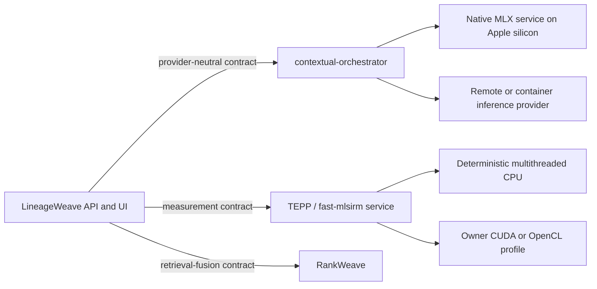

# ADR 0237 — Accelerator runtimes stay behind owning service contracts

**Decision status:** Accepted
**Date:** 2026-08-26
**Related:** ADR 0076, ADR 0083, ADR 0208

## Context

LineageWeave runs with Docker Compose on Linux, macOS, and Windows hosts, but
does not own model inference or scientific computation. Adding MLX, CUDA, or
OpenCL devices to its backend would duplicate upstream capability selection,
couple the evidence API to host drivers, and make CPU-only installations less
portable.

The accelerator mechanisms are platform-specific. MLX targets Apple silicon's
unified CPU/GPU memory. Docker Compose can reserve an NVIDIA GPU only when the
host and daemon expose it, while the NVIDIA Container Toolkit injects host
devices and driver mounts into a Linux container. OpenCL discovers vendor
implementations through an installable-client-driver loader, so an image alone
cannot prove that a compatible device and vendor driver are present.

## Decision

1. LineageWeave owns no MLX, CUDA, OpenCL, GPU, or scientific CPU runtime.
   Its backend and frontend remain portable consumers of authenticated,
   versioned service contracts.
2. LLM, VISION, and embedding acceleration belongs to
   contextual-orchestrator or a provider-neutral inference service registered
   behind it. On Apple silicon, an MLX process runs natively as such a service;
   LineageWeave does not pass Metal devices into its Linux VM or encode an MLX
   URL, model, port, or chat template.
3. TEPP and fast-mlsirm own their construct-specific scientific and
   psychometric Rust cores. Their compute services may publish separate CPU and
   accelerator deployment profiles: deterministic multithreaded CPU is the
   portable required path; CUDA uses an explicit Compose GPU reservation plus
   a compatible host driver/toolkit; OpenCL uses an explicitly mounted device
   and matching vendor ICD. RankWeave remains the dependency-free Python owner
   of retrieval fusion and evaluation behind its published contract; this ADR
   neither changes its implementation language nor transfers psychometric
   ownership to it. None of these profiles are added to LineageWeave Compose.
4. LineageWeave connectors accept only the owner's provider-neutral envelope.
   Persisted evidence records the owner, contract/model version, input/output
   digest, execution-device class reported by the owner, convergence or
   completion state, and uncertainty where the construct requires it. A device
   label is provenance, not a quality score.
5. Missing devices, drivers, ICDs, or owner services fail at the owning service
   boundary. LineageWeave shows unavailable/failed status and the next valid
   action; it never retries on a guessed backend, computes a Python substitute,
   or claims GPU execution from configuration alone.

## Considered alternatives

- **Add accelerator profiles to LineageWeave Compose.** Rejected because this
  repository does not own the computation and cannot validate host drivers for
  another service's algorithm.
- **Run every accelerator natively.** Rejected because CUDA containers are a
  supported owner deployment when their host prerequisites are explicit.
- **Use CPU fallback inside LineageWeave.** Rejected because it would reproduce
  the formula on the wrong side of the contract.

## Consequences and acceptance

- LineageWeave Compose remains CPU-portable and contains no device reservation.
- TEPP and fast-mlsirm bear deployment and recovery-test work for every
  advertised scientific-compute profile. RankWeave retains its own retrieval
  fusion/evaluation conformance contract.
- A scientific-compute integration is accepted only when its owning repository
  proves the same versioned synthetic input on deterministic CPU and each
  advertised accelerator, reports bounded numerical tolerance and device
  provenance, and LineageWeave proves malformed, mismatched, and unavailable
  envelopes fail closed without exposing implementation details in customer
  copy.
- Native MLX availability is verified at contextual-orchestrator's provider
  boundary; CUDA/OpenCL availability is verified in the compute owner's health
  and conformance evidence. A Compose declaration by itself is insufficient.

## References (APA 7th)

Docker, Inc. (2026). *Run Docker Compose services with GPU access*.
https://docs.docker.com/compose/how-tos/gpu-support/

Khronos Group. (2026). *OpenCL registry*.
https://registry.khronos.org/OpenCL/

MLX Contributors. (2026). *Unified memory*. MLX documentation.
https://ml-explore.github.io/mlx/build/html/usage/unified_memory.html

NVIDIA Corporation. (2026). *NVIDIA Container Toolkit architecture overview*.
https://docs.nvidia.com/datacenter/cloud-native/container-toolkit/latest/arch-overview.html
