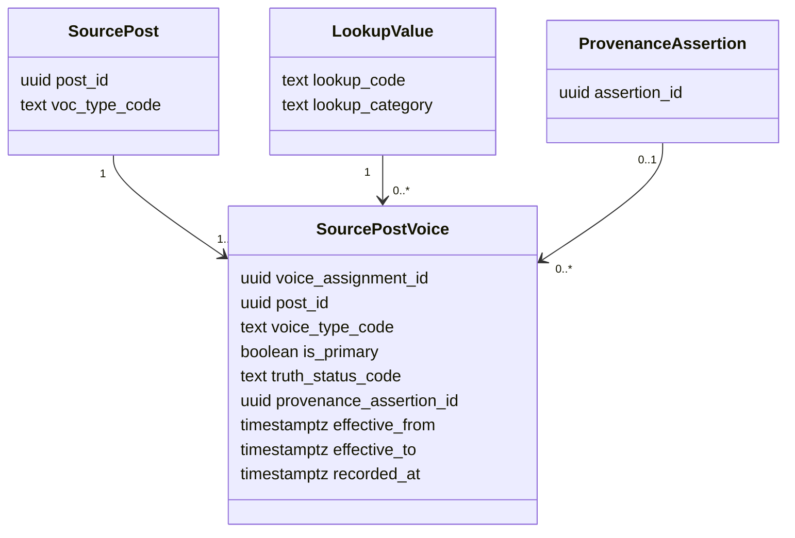
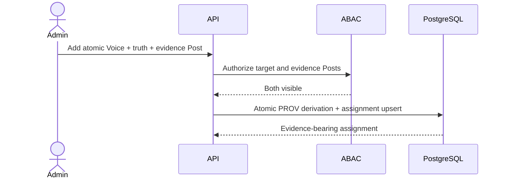

# ADR 0251: Evidence-bearing Voice-of-X combinations

## Status

Accepted (2026-08-27). Extends ADR 0246 without replacing the imported
`source_post.voc_type_code` contract.

## Context

A record can carry more than one stakeholder perspective: for example, a
customer-authored record can preserve a downstream user's statement, or an
employee can report a process-generated signal. Encoding every pair or larger
combination as a new lookup code creates an unbounded Cartesian vocabulary and
loses the evidence for each component.

No cited standard defines a finite, universal list of stakeholder
combinations. ISO stakeholder guidance explicitly allows the relevant
categories to vary by subject. ISO 26000 and AA1000SES instead require ongoing,
context-sensitive stakeholder identification and engagement. Mitchell, Agle,
and Wood (1997) likewise derive stakeholder salience from combinations of
attributes rather than from one exhaustive industry-role list.

## Decision

Represent composition as rows in normalized `source_post_voice`, not as
compound lookup codes.

- The existing `source_post.voc_type_code` remains the authoritative imported
  primary voice. A trigger mirrors it into exactly one primary association so
  existing import, filtering, and lineage behavior remains stable.
- An additional voice uses another existing `voc_type` code and must reference
  a normalized `provenance_assertion`. Missing evidence therefore cannot be
  persisted as a positive association.
- Each association interval has an immutable assignment identifier. Partial
  unique indexes permit only one current row for `(post_id, voice_type_code)`
  and one current primary while allowing closed historical intervals.
- `effective_from` records when an assignment became applicable. The initial
  imported primary starts at the source post's `created_at`; a later imported
  primary change and every added evidence-bearing voice start when recorded.
  `effective_to` closes a replaced primary as a half-open interval. Knowledge-
  cutoff reads select the interval containing the cutoff, so A → B → A changes
  retain all three states without presenting two primaries at one instant.
- A database trigger verifies that every association code belongs to the
  `voc_type` lookup category and every truth code belongs to
  `ontology_truth_status`;
  the global lookup-code foreign key alone does not establish either category
  boundary. Promoting an existing additional voice to the imported primary
  resets it to observed source evidence and removes the now-unneeded derived
  assertion reference.
- Voice remains distinct from counterparty relationship, actor role, topic,
  channel, lifecycle, and stakeholder-salience attributes. No inference,
  keyword rule, confidence threshold, or weight converts those dimensions into
  a voice.
- The public ontology represents each row as a qualified `VoiceAssignment`
  linked from its post. Each assignment names one atomic SKOS voice concept;
  additional assignments retain evidence through `prov:wasDerivedFrom`.
- Authorized post list/detail responses expose ordered voice assignments with
  labels, truth state, and evidence availability but never internal assertion
  identifiers. Filters match any associated voice, and repeated post cards show
  the combined labels. A knowledge-cutoff detail read includes only assignments
  effective by that cutoff; the popup lists the imported and evidence-connected
  perspectives separately instead of flattening them into a compound label.
- A `post_admin` may add an additional assignment by naming an ABAC-visible
  evidence Post, an atomic Voice code, and a governed truth state. The API does
  not accept a caller-supplied assertion identifier: one transaction binds the
  evidence Post as a PROV Entity, records `prov:wasDerivedFrom`, and upserts the
  assignment. It cannot replace or demote the imported primary Voice.
- In the live Post popup, a `post_admin` may choose one unassigned atomic Voice
  and one explicit truth state. The open Post is submitted as its own evidence,
  which covers a single record that contains several perspectives without
  asking the user for an internal identifier. Historical-cutoff views and
  accounts without `post_admin` do not expose this write control.
- The authorized ontology neighborhood projects each association as a
  qualified assignment in JSON-LD and the exact-value CSV. SHACL requires its
  atomic voice concept, primary flag, and source-post evidence. The exact-value
  table opens the carrying Post and, separately, the already-authorized
  derivation-evidence Post. It does not invent a graph edge or expose an
  internal assertion identifier. A single bounded query loads
  assignments for every authorized Post in the neighborhood, regardless of
  whether the focus is a Post, Person, Organization, Team, or Project. An
  additional assignment whose evidence Post is outside that authorized node
  set is omitted as a whole, keeping the JSON-LD conformant with the SHACL
  evidence minimum without disclosing or substituting hidden evidence. When
  bounded pages are accumulated, properties for the same JSON-LD subject are
  merged and multi-value Voice relations are unioned instead of one page
  replacing another.

## Data model

## Consequences

Migration 0237 is replay-safe, backfills one primary association per existing
post, closes rather than deletes a replaced primary, synchronizes later
inserts and primary-voice changes, and adds a voice-first index for bounded
filtering. It introduces no new Voice-of-X category and stores no source
content or identifying evidence in repository artifacts.

The repository candidate projects authorized combinations through JSON-LD,
SHACL, CSV, and separate carrying-Post/evidence navigation and includes the governed admin API and
Post-popup authoring path above. Synthetic Storybook desktop/mobile scenes
verify the focused evidence action, contained horizontally scrollable
exact-value table, explicit unassigned-Voice/truth selections, success state,
and 44-pixel touch controls. A synthetic real-OIDC integration on 2026-08-27
proved the permission denial, authorized write, normalized PROV-O derivation,
additional-Voice row, and unchanged imported primary against PostgreSQL. A
release claim still requires protected-main delivery evidence.

## References

AccountAbility. (2015). *AA1000 stakeholder engagement standard*.
https://www.accountability.org/standards/aa1000-stakeholder-engagement

International Organization for Standardization. (2010). *Guidance on social
responsibility* (ISO Standard No. 26000:2010).
https://www.iso.org/standard/42546.html

International Organization for Standardization. (2023, December 19).
*Global Directory stakeholder categories*.
https://helpdesk-docs.iso.org/article/331-gd-stakeholders-categories

Mitchell, R. K., Agle, B. R., & Wood, D. J. (1997). Toward a theory of
stakeholder identification and salience: Defining the principle of who and
what really counts. *Academy of Management Review, 22*(4), 853–886.
https://doi.org/10.5465/amr.1997.9711022105
