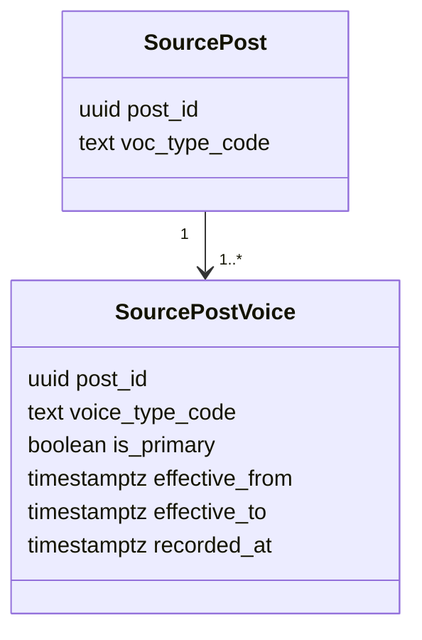
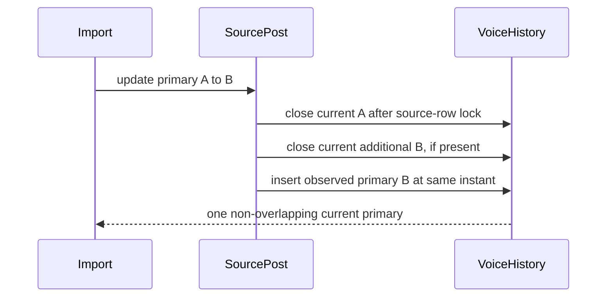

# ADR 0252: Temporal history for imported primary Voice

## Status

Accepted (2026-08-27). Extends ADR 0251 and closes issue #748.

## Context

ADR 0251 records when a Voice assignment starts, but migration 0237 deletes
the former imported primary when `source_post.voc_type_code` changes. The live
value is honest, yet an authorized knowledge-cutoff read after that update can
no longer recover the primary that was effective at the cutoff. The existing
`(post_id, voice_type_code)` key also cannot represent A → B → A.

OWL-Time distinguishes instants from intervals and gives an interval explicit
beginning and end bounds. PostgreSQL range types and exclusion constraints are
the native database mechanism for rejecting overlapping periods. Neither
source supplies a missing business-effective instant, so LineageWeave must not
invent one: an imported change becomes effective at the database transaction
instant when no source change instant exists.

## Decision

- Keep `source_post_voice` as the normalized assignment relation. Add nullable
  `effective_to`; each row is a half-open interval
  `[effective_from, effective_to)`. Null means current.
- Change the key to `(post_id, voice_type_code, effective_from)`, allowing the
  same atomic Voice to recur in non-overlapping periods.
- Use PostgreSQL GiST exclusion constraints to reject overlapping primary
  intervals for one Post. A partial unique index also permits at most one
  current row for a `(post_id, voice_type_code)` pair.
- When the imported primary changes, one trigger transaction closes both the
  current primary and any current additional assignment for the incoming
  Voice, then inserts the new observed primary at one trigger-execution
  timestamp. PostgreSQL `clock_timestamp()` is read after the source-row lock
  is acquired, so a waiting concurrent update cannot backdate its interval to
  the earlier statement start. It never overwrites or fabricates the former
  interval.
- Live reads select `effective_to is null`. Cutoff reads select the row whose
  interval contains the cutoff. Ontology continuation reads use their frozen
  `snapshot_at` when no knowledge cutoff was requested, so a page minted
  before a change cannot silently switch to the new primary.
- Existing rows migrate as open intervals. Migration replay changes neither
  their starts nor their history. History before ADR 0252 remains unavailable
  because the deleted facts cannot be reconstructed honestly.
- This is valid-time history for a source assignment, not psychometric or
  mathematical modeling. No weight, confidence, inference, or new Voice code
  is introduced.

## Data model

## Consequences

- A → B → A is auditable without copying source content or exposing real
  identifiers.
- Half-open bounds assign the exact change instant to the new primary and avoid
  double matches.
- The exclusion constraint adds a GiST index and write-time check. This table
  is bounded by Voice assignments per Post; partitioning is not warranted
  until observed volume or lock evidence shows otherwise.

## References

Cox, S. J. D., & Little, C. (2022). *Time ontology in OWL*. World Wide
Web Consortium. https://www.w3.org/TR/owl-time/

PostgreSQL Global Development Group. (2025). *PostgreSQL 18 documentation:
Range types*. https://www.postgresql.org/docs/18/rangetypes.html
