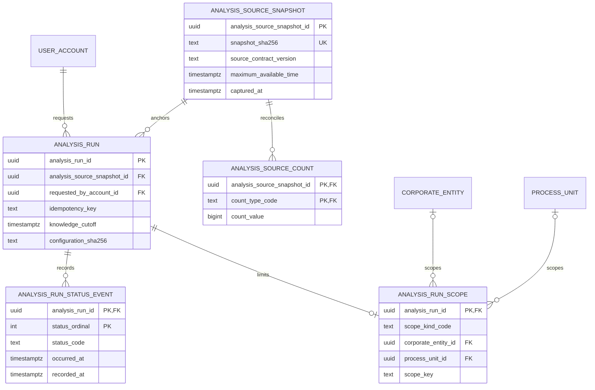

# Analysis-run registry (beginner guide)

This page explains the Milestone 2.1 registry in plain language. The durable
objects live in `migrations/0013_analysis_run_registry.sql`. See
[ADR 0014](adr/0014-normalized-analysis-run-registry.md) for the decision
record and [the APA 7th traceability note](doctoring/ANALYSIS_RUN_REGISTRY_REFERENCES.md)
for the standards mapping.

There is no public create/read/update/delete API in this slice. The registry
is a database contract only. A raw insert can store a run with no scope, no
counts, and no pending event. Treat a run as recorded only after a later
write API stores snapshot, counts, run, scope, and pending in one
transaction (ADR 0014 follow-up 1). Examples use synthetic **Demo Corp**
and aggregate ranges, never private source names or exact private counts.

## What the schema can hold

The tables can remember these facts once a later write API fills them
together. This slice does not invite hand-entered registry rows.

1. **What was captured** — a digest and the latest time any admitted fact
   could be known (`maximum_available_time`).
2. **How large the capture was** — non-negative aggregate counts (for
   example, documents in a low tens range after `make seed`), not raw rows.
3. **Who asked, and with which cutoff** — a real `user_account`, an
   account-scoped idempotency key, and a run-owned `knowledge_cutoff`.
4. **How wide the request was** — all visible records, one Demo Corp
   corporate entity, one process unit, or one thread group.
5. **What happened next** — append-only status events. Current status is a
   view, not a second editable table. Status insert requires a scope; run
   insert does not.

## Entity-relationship diagram



`analysis_run_current_status` is a SQL view: the latest event per run.

## Leakage guard

The registry enforces one aggregate clock rule:

```text
maximum_available_time <= knowledge_cutoff <= requested_at
captured_at <= requested_at
```

This complements TEPP's six finer clocks. It does not replace them and does
not copy TEPP arithmetic.

## Legal status path

```text
pending -> running | cancelled
running -> succeeded | failed | cancelled
terminal -> no successor
```

## What stays out of public Git

- source-export table names
- industrial-group or source-organization names
- raw row identifiers
- image or base64 bytes
- credentials
- exact private counts

Synthetic Demo Corp and aggregate ranges are the public vocabulary.
