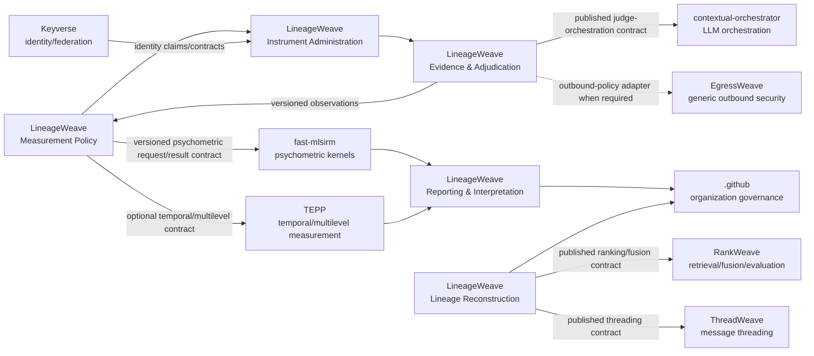

# LineageWeave Context Map

Status: current architectural contract for the LineageWeave repository. Accepted ADRs remain authoritative when a specific decision is more detailed.

## LineageWeave bounded contexts

### Measurement Policy

Owns the product decision about what is being evaluated and under which versioned measurement contract. It defines intended constructs, instrument lifecycle rules, model-family eligibility, activation criteria, evidence requirements, and the rule that unavailable or invalid observations do not become scores.

It does **not** implement reusable psychometric estimators or select LLM providers.

### Instrument Administration

Owns versioned instruments, items, instructions, rubrics, evidence rules, factor declarations, anchors, judge-policy references, pilot sampling plans, scoring-model references, release state, and immutable published instrument versions.

It may refer to a psychometric model family such as `rasch`, `irt_2plm`, `irt_3plm`, or `irt_4plm`; the reusable numerical implementation belongs to fast-mlsirm.

### Evidence & Adjudication

Owns source-evidence binding, admissibility and provenance of evidence presented for an item or lineage decision, and the product contract for observations returned by an adjudicator.

LLM-backed adjudication is an Anti-Corruption Layer over contextual-orchestrator. A judge observation is evidence from a fallible rater/method facet, not truth. LineageWeave preserves enough provenance to distinguish judge model, provider observation identity when supplied by the orchestrator, orchestration/prompt policy revision, language, occasion, and agent role when those conditions are scientifically material.

### Reporting & Interpretation

Owns buyer-facing projections, explanation of accepted measurement evidence, audit views, lineage/product interpretation, and the distinction between pilot evidence and operationally activated scoring. It consumes versioned scientific results; it does not recompute an upstream owner's model privately.

### Lineage Reconstruction

Owns LineageWeave-specific candidate/evidence assembly and the product lineage graph semantics that are not generic retrieval or message threading. Generic ranking/fusion is delegated to RankWeave and generic message threading to ThreadWeave through their published contracts.

## External owner contexts

The dependency direction is contract-first. A LineageWeave module may depend on its local port/Anti-Corruption Layer for an owner service; it must not import or copy that owner's provider, estimator, persistence, or control-plane internals.

## Required orchestration and measurement flow

For any model-backed measurement or evaluation capability, the normative flow is:

`LineageWeave Measurement Policy / Evidence -> contextual-orchestrator Judge Orchestration -> versioned judge observations/provenance -> fast-mlsirm psychometric computation -> optional TEPP temporal/multilevel analysis -> LineageWeave Reporting & Interpretation`.

Skipping contextual-orchestrator for a production LLM call, copying a fast-mlsirm numerical kernel, or performing TEPP-owned temporal/multilevel estimation locally is an ownership defect, not an optimization.

## Anti-Corruption Layers

- `lineageweave/adjudication_client.py`, embedding/vision/extraction/chat clients, and equivalent model-backed adapters translate LineageWeave evidence/policy into contextual-orchestrator's published contract. Provider credentials and provider SDKs are forbidden here.
- `lineageweave/tepp_client.py` translates to TEPP's published analysis contract. LineageWeave does not read TEPP tables.
- fast-mlsirm is consumed through its published package/API contracts for reusable psychometric numerics. LineageWeave may assemble product inputs and persist owner results, but must not fork an estimator.
- RankWeave and ThreadWeave are consumed through their public contracts; their generic algorithms are not copied into LineageWeave.
- Identity-provider internals stay behind the Keyverse/OIDC boundary. LineageWeave owns only its application authorization and product account linkage.

## Transitional debt

Historical modules and documentation may still use technical-layer or pre-boundary names. An accepted historical ADR remains useful evidence but does not override a later superseding ADR. Each migration must preserve unique LineageWeave behavior as explicit owner-contract requirements, add contract/parity evidence, migrate consumers, then remove the duplicate implementation and stale path rather than keeping two live sources of truth.
