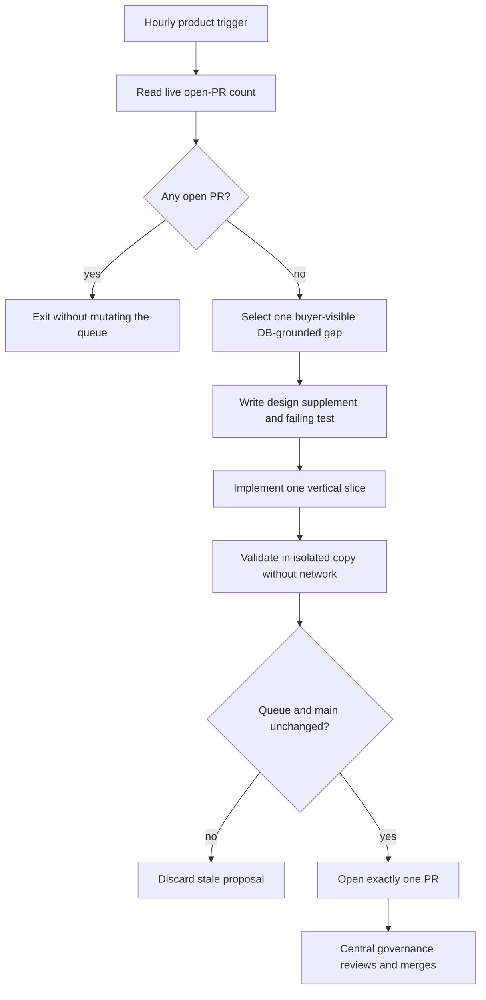

# Hourly LineageWeave commercialization loop

## Purpose

The hourly repository workflow turns the approved DB-grounded Figma design into
one protected product increment only when the live LineageWeave pull-request
queue is empty. It never reviews, repairs, updates, approves, or merges an
existing pull request.

The workflow file is
`.github/workflows/hourly-commercialization-loop.yml`. It runs at minute 23 of
every hour and can also be invoked manually.

## Central governance and queue policy

The central `.github` scheduler is the only PR review, repair, branch-update, and merge writer.
It runs the organization-wide sweep every 15 minutes and reacts to PR, review,
and required-workflow events. LineageWeave does not install a second merger or
call the central reusable writer from its own schedule.



The repository workflow receives only read access to pull-request inventory.
After validation and repeated queue/base checks, it may exchange the existing
OIDC credential for a short-lived app token that pushes one generated branch
and opens one PR. It cannot approve, update, or merge that PR.

## Accuracy-first cadence

The schedule is hourly, but `cancel-in-progress` is false. A long OpenCode run
queues later invocations rather than being killed at the next heartbeat. This
is intentional: current-head correctness and reproducible evidence take
precedence over wall-clock throughput.

The product job has a 180-minute budget. It starts only when read-only live
inspection finds no open pull request; central governance continues independently.

## Product selection

The canonical source is
`docs/superpowers/specs/2026-08-14-db-grounded-product-ux-design.md`.

The agent selects one coherent buyer-visible vertical slice in this order:

1. Records and direct Lineage;
2. Record Detail and cited evidence;
3. analytical Entity Catalog;
4. Calendar and calibrated Reports;
5. Accounts and Access;
6. Roles and read-only System Policy.

A later item may be selected first only when earlier items are already
implemented or when the same bounded change is a prerequisite that makes an
earlier screen truthful.

## Test-first authoring

The red phase can edit only:

- `tests/`;
- `backend/tests/`;
- frontend test files;
- `docs/superpowers/specs/`.

It must produce both a design supplement and a genuine failing assertion.
Python and frontend runners are executed independently; infrastructure exits
are rejected rather than misclassified as a red test.

The implementation phase reads the red evidence and may edit the bounded
product surface, tests, migrations, architecture and operations documentation,
version metadata when required, and a `CHANGELOG.d` fragment.

## Product invariants

Every generated increment must preserve:

- source records as evidence;
- direct reconstruction separately from indirect Knowledge Graph navigation;
- account affiliations independently from account-global roles;
- effective permissions as role-derived values;
- RBAC before row-level affiliation filtering;
- synthetic identities and content in public fixtures;
- analytical `AUTO-*` organizations outside the access-assignment set;
- standards-complete PROV-O outside the compact navigation projection;
- third-normal-form persistence and two-or-more-word snake-case database
  objects;
- contextual-orchestrator's explicit available/unavailable client contract;
- standalone deployment and modular ecosystem integration;
- public docstrings and complete owned-surface regression coverage.

The agent must not invent account lifecycle state, invitations, access-audit
history, affiliation-scoped roles, causal lineage labels, lineage-change
history, or an editable ABAC language without first adding the normalized
storage and API contract.

## Model and credential boundary

Only OpenCode is used for autonomous authoring. The provider list is restricted
to NVIDIA and uses `NVIDIA_NIM_API_KEY`.

The workflow does not reference `COPILOT_GITHUB_TOKEN`.

OpenCode is installed from a versioned archive whose SHA-256 digest is
verified. Both model phases explicitly remove GitHub token and Actions OIDC
environment variables before execution.

The agent receives no shell, web search, web fetch, external-directory, task,
skill, question, or LSP permission. It cannot execute tests itself; the
workflow performs deterministic validation after each phase.

## Protected paths

Autonomous code cannot modify:

- `.github/`;
- `.git/`;
- `AGENTS.md`;
- `CLAUDE.md`;
- `CODEOWNERS`;
- `SECURITY.md`;
- Keycloak seed material;
- environment or credential files.

Renames, copies, deletions, non-UTF-8 files, symbolic links, oversized files,
and changes outside the allowlist fail closed.

Each increment must contain production code or schema, regression tests, a
design supplement, a changelog fragment, and a bounded PR message.

## Validation boundary

The trusted main branch is validated before the agent runs.

The generated proposal is copied to a disposable directory with `.git`
removed. Validation runs:

```text
uv run --frozen python -m pytest -q
uv run --frozen python -m compileall -q lineageweave backend tests
pnpm --dir frontend run lint
pnpm --dir frontend run test
pnpm --dir frontend run build
```

The copy is owned by the unprivileged `nobody` account and executed in a new
network and process namespace with:

- an empty inherited environment;
- no new privileges;
- all capability sets removed;
- no Git metadata;
- no network.

PostgreSQL, Keycloak, and Valkey integration modules in this repository use
module-level availability probes and `pytest.mark.skipif`; inside the empty,
networkless environment they skip rather than error. Their authoritative real-
service execution remains the ordinary exact-head pull-request checks after
the protected PR is opened. The isolated run is an additional pre-publication
boundary, not a replacement for required CI.

## Single-writer and stale-work protection

The workflow checks the open-PR count:

1. before authoring;
2. before acquiring an app token; and
3. immediately before pushing.

It also binds work to the exact starting `main` SHA and rechecks that SHA before
token exchange and push. A concurrent PR or moved base discards the proposal.

Write authority is acquired only after validation through the existing
OpenCode OIDC exchange. The generated short-lived token is masked. The workflow
pushes one run-specific branch and opens exactly one PR.

## Review and merge

Generated PRs enter the same central loop as human-authored PRs:

1. required checks execute on the exact head;
2. OpenCode and other configured independent review planes inspect the current
   head;
3. actionable comments are repaired;
4. checks re-run;
5. an independent approval is required;
6. auto-merge or direct merge occurs without bypass.

Review wait time is not a blocker. The central scheduler continues reviewing,
repairing, and revalidating the queue; the repository heartbeat exits without
creating another product PR while any pull request remains open.

## Failure behavior

The workflow fails closed when:

- `NVIDIA_NIM_API_KEY` is absent;
- all NVIDIA model candidates fail;
- the red phase changes production files or produces no failing assertion;
- the implementation crosses its path or byte budget;
- validation fails;
- the PR queue becomes occupied;
- `main` moves;
- OIDC or app-token exchange fails.

A failure leaves no pushed autonomous branch unless the final, rechecked
mutation step was reached.

## Operating evidence

The permanent contract tests in
`tests/test_hourly_commercialization_workflow.py` verify the schedule, central
single-writer boundary, read-only live queue gate, NVIDIA-only model path,
credential removal, red/green discipline, protected paths, isolated
validation, stale-work checks, and one-PR/no-self-merge boundary.

The central scheduler remains independently active every 15 minutes. This
repository workflow contributes only the LineageWeave product-gap heartbeat.
