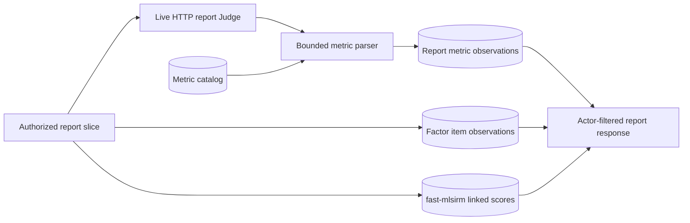

# ADR-0006: Persist evidence-scoped RAGAS-aligned report evaluation

## Context

The product creates weekly and monthly views for project, PU, and team slices.
The dichotomous factor items and the separate fast-mlsirm FIPC/CAT linked scores
are useful, but a report-quality judgment also needs explicit evaluation metrics.
RAGAS describes reference-free evaluation dimensions for retrieval-augmented
generation. The product's source corpus does not always provide a human-written
reference answer, so the implementation must retain the distinction between a
numeric metric grounded in supplied writings and an unsupported metric.

> Citation: Es, S., James, J., Espinosa-Anke, L., & Schockaert, S. (2024).
> RAGAS: Automated evaluation of retrieval augmented generation.
> https://doi.org/10.18653/v1/2024.eacl-demo.16

> Citation: ContextualWisdomLab. (2026). *TEPP evidence, provenance, and
> adaptive orchestration contracts*. https://github.com/ContextualWisdomLab/TEPP

> Citation: World Wide Web Consortium. (2013). *PROV-O: The PROV ontology*.
> https://www.w3.org/TR/prov-o/

The report JSON is a display envelope and is not a sufficient normalized audit
model. A metric embedded only in that JSON cannot be cataloged, queried by
metric, or independently checked for evidence and model provenance. Conversely,
putting RAGAS fields into the fast-mlsirm score table would conflate an LLM
evaluation observation with a psychometric ability estimate and would make a
missing connector look like a missing report-quality judgment.

## Decision drivers

- Keep metric definitions, report observations, and psychometric linked scores
  in separate third-normal-form relations.
- Use the live HTTP model boundary and never substitute a recorded response or
  local numeric estimate.
- Preserve normalized evidence references, model source, rationale, and uncertainty for review.
- Keep report and evidence authorization server-side for general users and
  administrators.
- Make the four requested evaluation dimensions queryable while allowing an
  explicit abstention when a reference or source context is insufficient.

## Considered options

| Option | Evidence integrity | Operational separation | Decision |
| --- | --- | --- | --- |
| Store a single aggregate quality number in report JSON | Loses metric identity, source, and evidence granularity | Cannot distinguish evaluator output from psychometric scores | Rejected |
| Compute local heuristic scores from titles or counts | Not a live LLM evaluation and can invent support | Cheap but not auditable | Rejected |
| Add RAGAS fields to `analysis_linked_scores` | Mixes two different measurement contracts | Makes fast-mlsirm availability semantics ambiguous | Rejected |
| Persist a normalized metric catalog and report/metric observations from the live Judge | Keeps provenance, evidence, abstention, and psychometric boundaries separate | Supports catalog evolution and actor-filtered reads | Accepted |

## Decision outcome

Persist these four catalog definitions in `analysis_evaluation_metrics`:

- `ragas_faithfulness`
- `ragas_answer_relevancy`
- `ragas_context_precision`
- `ragas_context_recall`

Persist one observation per `(report_id, metric_id)` in
`analysis_report_metric_scores`. The row stores a nullable score constrained to
`0..1`, a shared `common_enum_values` verdict (`pass`, `fail`, `abstain`, or
`unavailable`), the evaluator source, and bounded rationale. Persist each
evidence reference as one row in `analysis_report_metric_evidence`, whose
composite foreign key points to the metric observation. This keeps the
many-valued evidence relation in third normal form while making report and
metric ownership explicit. The LLM system prompt
requests only the four allowlisted IDs and only the supplied report/writings.
`parse_ragas_metric_scores` discards unknown or invalid rows, derives a binary
verdict from a valid score, and retains an explicit abstention without assigning
zero.

The report route continues to use the existing actor-filtered report list. The
metric rows are loaded as part of the report's judge detail; they do not add
document IDs, KG nodes, or evidence outside the already-authorized report
scope. Existing fast-mlsirm linked scores remain untouched by a Judge-only
reanalysis.

## Consequences

Positive:

- Report quality dimensions are queryable and comparable without parsing a
  display JSON blob.
- Every current observation carries live evaluator provenance and normalized
  source evidence references; the current milestone has 320 metric rows for 80
  reports.
- A missing reference answer remains visible as abstention instead of being
  mistaken for a failing score.
- Fast-mlsirm linked scores retain their Rust-backed connector contract and
  remain independently testable.

Trade-offs:

- The current corpus does not guarantee human reference answers, so context
  recall may abstain in future runs even though the metric is cataloged.
- Four additional rows per report increase PostgreSQL storage and require
  report-window reconciliation.
- LLM judgments remain model-dependent and require calibration, human review,
  and future labeled validation before they are used as a business KPI.
- This is RAGAS-aligned evidence evaluation, not an assertion that the product
  has implemented every optional RAGAS execution backend or a human gold set.

## Affected Components

- `lineageweave.py` owns metric normalization, schema initialization, report
  persistence, and report loading.
- `lineageweave_server.py` exposes the existing actor-filtered report route; no
  new unscoped metric route is introduced.
- `web/src/App.jsx` renders the actor-filtered metric observations and routes
  evidence-document buttons through the existing authorized document detail
  selection path.
- `tests/test_lineage_runtime_contract.py` covers the metric parser and
  persistence/read compatibility contracts.
- `analysis_evaluation_metrics`, `analysis_report_metric_scores`, and
  `analysis_report_metric_evidence` are PostgreSQL-owned normalized relations.

The current data-bearing browser contract rendered four metric cards and 32
authorized evidence links from one report detail without exposing a direct
metric-table endpoint.

## Risks and Mitigations

| Risk | Mitigation | Evidence |
| --- | --- | --- |
| A model emits an unknown or out-of-range metric | Allowlist IDs, enforce numeric range, and discard invalid rows | `parse_ragas_metric_scores` tests |
| A missing reference answer is misread as a failing score | Persist `abstain` with a NULL score | schema check and abstention contract |
| Metric evidence crosses a tenant boundary | Load metrics through the existing report and document authorization scope | actor-filtered report tests |
| Metric rows become orphaned after a report-window change | Foreign-key cascade plus explicit orphan reconciliation | `persist_period_reports` persistence contract |
| A quality score is mistaken for psychometric ability | Keep RAGAS rows separate from fast-mlsirm linked scores and label the evaluator source | ADR and live aggregate verification |

## Rollback / Exit Strategy

The metric tables are additive. To disable report-metric presentation, stop
requesting `ragas_metrics` and leave existing report and fast-mlsirm rows
available; the report loader tolerates an empty metric table. If the catalog or
observation schema must be retired, take a PostgreSQL backup, remove the metric
foreign-key rows first, then drop only the two `analysis_*` metric relations.
The report and psychometric tables are not dropped or rewritten by this exit
path. Re-enable by running `_ensure_operational_tables` and a bounded live
reanalysis.

## Verification

- `tests/test_lineage_runtime_contract.py` covers numeric, token, malformed,
  unknown, duplicate, structured-envelope, and abstention metric responses.
- PostgreSQL schema initialization creates the catalog and observation tables;
  report persistence deletes/reinserts only the affected report observations
  and cleans orphan rows.
- The current live reanalysis processed 80/80 reports with 320 observations,
  80 per metric, all `llm_judge` sourced, evidence-linked, and in range; the
  adaptive item-bank run separately produced 290 fast-mlsirm linked scores
  across 58 slices and 15 finite calibration rows.
- The current product-runtime gate passes 349 tests with 100% line-and-branch
  coverage across the shipped Python runtime modules.

## References

Es, S., James, J., Espinosa-Anke, L., & Schockaert, S. (2024). RAGAS:
Automated evaluation of retrieval augmented generation. In *Proceedings of the
6th Annual Meeting of the European Association for Computational Linguistics:
System Demonstrations* (pp. 150–158). Association for Computational Linguistics.
https://doi.org/10.18653/v1/2024.eacl-demo.16

ContextualWisdomLab. (2026). *TEPP evidence, provenance, and adaptive
orchestration contracts*. https://github.com/ContextualWisdomLab/TEPP

World Wide Web Consortium. (2013). *PROV-O: The PROV ontology*.
https://www.w3.org/TR/prov-o/

American Institute of Certified Public Accountants. (2023). *2017 Trust
services criteria for security, availability, processing integrity,
confidentiality, and privacy (with revised points of focus—2022).* AICPA & CIMA.

## Amendment: evidence-bound factor-item catalog and current reanalysis (2026-08-15)

The report Judge now has a separate `factor_item_catalog` task. It receives a
bounded set of report slices and source writings, and the parser accepts only
allowlisted factor IDs and document IDs supplied in that request. A candidate
item without source-document evidence is discarded. Candidate item text,
supporting report/document links, and calibration output are separate
PostgreSQL relations; the report display JSON is not the calibration store.

The current direct-PostgreSQL reanalysis derived five LLM candidates from
multiple writings, added them to ten fixed anchor items, and sent the resulting
15-item bank to the separate Rust-backed fast-mlsirm connector. PostgreSQL now
contains 10 candidate evidence links and 15 finite calibration rows, with every
item marked `calibrated`. Fifty-eight of 80 report slices received five linked
scores each (290 total); the remaining 22 slices remain explicitly unlinked
because the item response set was insufficient. No missing response was filled
by a local heuristic or a copied psychometrics implementation.

This amendment does not promote LLM-derived items or linked scores to a human
gold standard. A future promotion requires labeled response data, independent
review, and RMSE/recovery evidence across the relevant multi-level,
multi-membership, and longitudinal populations. The general-user report
surface may read the resulting verdicts and linked/unlinked state, while item
catalog and calibration mutation remains outside reader permissions.

Current evidence: the live gateway catalog call succeeded; the direct
PostgreSQL write completed for 80 reports, 320 RAGAS metric observations, 290
linked scores, 15 calibration rows, and zero orphan candidate-evidence rows;
the current product source gate remains 349 tests with 100% line-and-branch
coverage for the shipped runtime modules.
