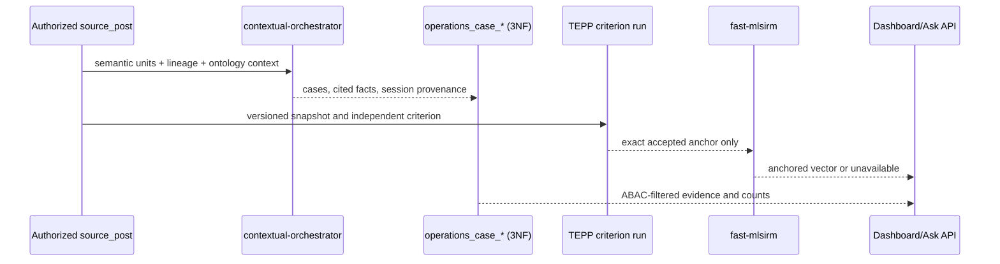

# Product & Technical Gap Baseline

> Dashboard delivery snapshot: 2026-08-26 KST. Protected `main` was
> `04e6b610655d0db91d5f7ba9486bdda1440e0b19`. This local branch is not
> protected-main release evidence.

## Operations Dashboard PRD/TRD traceability

| Requirement | Evidence contract | Delivery state |
|---|---|---|
| Claim cause delay: order, specification change, originating order, sales pool, Event/post counts | ADR 0206; contextual-orchestrator case classification with cited spans; Event Lineage context | Candidate implementation; authenticated runtime acceptance pending |
| Rebid/handover: discussion, counterparties, our owner, decisions, Event/post counts | ADR 0206; normalized case facts plus persisted summary actions/roles | Candidate implementation; corpus backfill pending |
| External information count/rate and sales/project relation | ADR 0206; semantic `external_information` classification inside Dashboard GNB | Candidate implementation; no separate Board by product decision |
| Project-specific journey | Explicit source/semantic project membership plus event-time ordering | Candidate API and ordered journey UI implemented; authenticated runtime acceptance pending |
| Repeat issue to design improvement | `repeat_issue`, `issue_pattern`, and `improvement_action` cited facts | Candidate semantic contract; design-system connector acceptance pending |
| Natural-language Ask with evidence, report, alert, MCP | Persisted semantic-unit embeddings plus versioned delivery/resource contract | Candidate implementation uses whole-question embedding retrieval with no lexical fallback; authenticated runtime acceptance pending |
| Similar VOC, customer cohort, prior action | Persisted repeat-issue candidate semantics plus orchestrator pair adjudication and extractive evidence | Candidate live post endpoint and post-detail UI implemented; authenticated runtime acceptance pending |
| TEPP independent Event Lineage anchor | Accepted, persisted TEPP criterion bound to exact snapshot/cutoff before fast-mlsirm activation | Consumer PR #606 is on protected main; TEPP producer PR #237 remains open, so no end-to-end accepted artifact is release evidence yet |
| Temporal Lineage topics and multilevel important posts | ADR 0210; TEPP posterior topic/plausible-value contract followed by fast-mlsirm observed-information case-deletion influence | Product/technical contract is protected on `main`; neither required Rust CPU/GPU producer envelope is shipped, so the Dashboard surface remains unavailable (ADR 0208: no local Python substitute) |

### Technical contract and flow

Security/operability: every aggregation applies `post_read` plus row-level
corporate-entity visibility before counting; source-body digests invalidate
stale inference; provider errors persist no positive/negative result; PII
remains authorized at the UI boundary and is excluded from telemetry. The
tables use composite keys and bounded kind-first indexes; production hot-path
acceptance still requires `EXPLAIN (ANALYZE, BUFFERS)` on an anonymized runtime
snapshot.

### Historical UI audit evidence

The `f0b96029` Storybook build was rendered at 1440×1100 and 402×1200 with
synthetic evidence; `416fd19d` changes only post-navigation request isolation.
Desktop inspection showed all four case kinds, five non-conflated metrics,
project-journey ordering, cited facts, and evidence actions without horizontal
card overflow. Narrow inspection showed two-column metrics, readable cards and
44px-class actions; the project journey remains intentionally horizontally
scrollable. No identifying runtime record or screenshot is committed. The
`EvidenceReady`, `NarrowViewport`, `AnalysisPendingAndMissingEvidence`,
`AnalysisFailed`, and `LoadError` scenes cover the ADR 0206 state inventory.
Authenticated authorized-corpus acceptance remains separate and may return
only aggregate, non-identifying evidence to this repository.

### Exact open-PR boundary

At this snapshot there were 15 open PRs and 10 open issues. Exact observed heads
were `#662 7388e183`, `#661 11206c58`, `#660 7d0d3ef7`, `#659 e948bd27`, `#658 c1fe1d04`, `#657 64f48679`, `#644 d9ff9980`, `#643 0a1f8ec1`, `#640 2d50fa01`,
`#639 aee02dca`, `#636 f7b9a65f`, `#632 9332b921`, `#631 c0022c97`,
`#629 4b4d6707`, and `#579 689a21b6`. PR #654 merged its ontology-label
readability slice into #632's provenance branch as `6c0c4370`; that stack
merge is not protected-main delivery. The open heads remain
blocked on hosted gates and/or independent review. These
observations are not merge readiness. Re-fetch exact heads,
unresolved threads, checks, approvals, rulesets, and merge SHA before any
lifecycle claim.

> Audit snapshot: 2026-08-26 KST (refreshed by the autonomous merge
> loop). This repository records synthetic fixtures and aggregate,
> non-identifying runtime evidence only. Open PRs and local checks are not
> protected-default-branch release evidence. Identifying post identifiers,
> organization names, and production record keys must never appear in this
> file.

## 1. Exact-head and governance evidence

The protected default branch was `04e6b610655d0db91d5f7ba9486bdda1440e0b19`
when this baseline was refreshed. The live queue contained 15 open PRs and 10
open issues. The exact-head inventory below supersedes older per-PR snapshots
elsewhere in this document; those older rows remain useful historical delivery
context only.

| PR | Exact observed head | Merge/check state at this snapshot |
| ---: | --- | --- |
| #660 | `7d0d3ef7` | backend runtime/integration contract restoration with FastAPI status API and existing httpx2 test extra preserved; architecture documentation now matches the dev-only Starlette transport; config tests passed 10; hosted checks and independent review remain required |
| #661 | `11206c58` | reconstruction, persistence, seed, graph-separation, and HTTP acceptance tests now use one session-scoped Rust-backed fast-mlsirm fixture estimate instead of hand-authored fusion dictionaries; unavailable Rust dependency now skips honestly; focused regression suite passed 14 tests; hosted checks and independent review remain required |
| #662 | `7388e183` | TEPP terminal status/read transport boundary with opaque run-id encoding, fail-closed provider errors, ADR 0217, and 9 client tests; it does not poll, persist, or interpret measurement results; hosted checks and independent review remain required |
| #659 | `e948bd27` | ontology node-type readability, tokenized surfaces, contrast measurement, and resolved cross-PR allocation documentation; focused UI/token tests and lint passed; hosted checks and independent review remain required |
| #658 | `c1fe1d04` | optional Global Ask knowledge cutoff; empty-cutoff answers no longer overclaim grounding, live answers expose `live_only`, local cutoff input is converted to UTC, content-change evidence now comes from revision intervals rather than unrelated live-row touches, current-only lineage/images are gated off, and ADR rollback instructions name the actual migration; cutoff/source-revision suites passed 20 tests; hosted checks and independent review remain required |
| #657 | `64f48679` | TEPP asynchronous lifecycle evidence; terminal-status persistence, receipt-conflict isolation, migration reservation, and fail-closed schema handling repaired, with 57 focused tests passed; hosted checks and independent review remain required |
| #644 | `d9ff9980` | frontend conditional workspace splitting with reserved surface-splitting ADR identity; checks and independent review remain required |
| #643 | `0a1f8ec1` | shared token-backed status notice with reserved ADR identity; checks and independent review remain required |
| #640 | `2d50fa01` | dashboard case metrics, project journeys, restored TEPP API-key setting, semantic-label spacing, topic-dashboard argument-boundary repair, async Ask queue settlement isolation, consistent empty-projection fast-mlsirm contract state, and Starlette/httpx2 test transport alignment; focused operations suite passed 27 tests; hosted checks and independent review remain required |
| #639 | `aee02dca` | Running action and Compose contract repair; checks and independent review remain required |
| #636 | `f7b9a65f` | calibrated external lineage contract; checks and independent review remain required |
| #632 | `9332b921` | Global Ask provenance, public verification, knowledge cutoff, evidence-constrained query rewriting, shared ABAC/rewrite-failure review repair, #654 ontology-label readability, Semgrep static-SQL repair, and #655 authenticated durable MCP stack with live Streamable HTTP lifecycle and k6 evidence; checks and independent review remain required |
| #631 | `c0022c97` | current-main ADR stack decomposition; checks and independent review remain required |
| #629 | `4b4d6707` | provider pool release and bounded landing reads; checks and independent review remain required |
| #579 | `689a21b6` | leftover interaction-map persistence; checks and independent review remain required |

No row above is merge evidence. Immediately before any lifecycle action,
re-fetch the head, unresolved threads, formal reviews, rulesets, and same-head
check conclusions. In particular, queued checks are infrastructure state and
do not transfer evidence from an earlier SHA.

PR #607 first merged as `61fd631c7bb3c57113fd19763c2c43161eeb2824`
into #606's non-default branch. PR #606 subsequently passed the protected gate,
so the combined TEPP-consumer and operations-dashboard implementation is now
on `main`; the still-open TEPP producer PR #237 keeps end-to-end anchor
acceptance unavailable.

PR #604 was closed unmerged after its exact OIDC repair was composed into #605;
its green or pending checks are not delivery evidence. PR #482 merged as
protected-main commit `464ff25002044b9d933c8eefd36c8def7ca0ffd8`
with package conflict markers, identifying baseline records, and an OIDC
return-context regression. PR #603 repaired the package/privacy and
analysis-run transaction defects through protected main at `4f53190b`; the
OIDC defect remains delivered until #604 or the composed #605 passes the
protected gate. Protected main is therefore not yet a release candidate.

PR #592 first merged as `3b3af3b4fe9c439354433a43444e05f37ab24ea3`
into #590's non-default stack base at `2f033ba3`. The complete stack then
passed the protected gate and #590 merged to `main` as
`1d1379fc59d9dac6e9c8bfa4812313e3b9e8f3c8`.

PR #521 merged through protected `main` as
`3797f063b1a7396972a749aa81f23745acccbee1`; it is release evidence and no
longer part of the open queue. That merge also left a standalone conflict
marker and duplicated stale tail in `CLAUDE.md`; #594 repaired it through
protected `main` as `241be2dddf657f854cb8be54fe11d4ef48d37976`.

Protected main now contains the ADR 0109 OIDC return restoration from #605,
including fragment preservation and storage fallback. The #606 dashboard
landing must additionally route `?post=` deep links to the Board; that focused
regression is part of the current candidate and is not delivery evidence yet.

Three systemic gates currently dominate the queue:

1. **Strix visibility lookup failure (org control plane).** PR #600 exact head
   `7580bdc9` failed before scanning because the required-workflow token could
   not resolve this public repository after six API retries. The root repair is
   ContextualWisdomLab/.github#1320 at `3b9b2380`: ordinary PR, push, and
   schedule runs use trusted event visibility; cross-repository dispatch keeps
   authoritative public/private/internal visibility; private and internal
   repositories remain on private-capable providers. The exact head also
   composes the executable fallback contract and classifies bounded NVIDIA
   `ServiceUnavailableError` overload evidence as retryable across configured
   distinct models without weakening exhaustion or vulnerability fail-close.
   A hosted fallback then completed with zero vulnerabilities but was rejected
   because the generic warning gate treated Strix's fallback-model banner and
   a Hugging Face unauthenticated-download notice as provider failures. The
   current head removes only those two exact scanner notices before the
   existing general warning and explicit 429/provider failure checks. The
   current head also clears a foreign NVIDIA/OpenRouter endpoint before a
   direct-OpenAI fallback while retaining an explicitly configured
   direct-OpenAI primary endpoint. The prior full quick-gate harness, overload
   path, 12 visibility-contract tests, and the focused cross-provider endpoint
   contract passed; exact-head hosted revalidation remains pending. It is blocked on
   hosted exact-head gates and independent review, so no repaired
   protected-main Strix runtime evidence exists yet.
2. **Strix provider unavailability (org control plane).** The central required
   Strix scan on .github#1320 failed when NVIDIA returned `Service temporarily
   overloaded`; the gate correctly failed closed but did not try its configured
   distinct fallbacks because the service-unavailable classifier excluded the
   NVIDIA provider. Exact head `3b9b2380` composes that execution repair and the
   two exact non-fatal scanner-notice exclusions while keeping
   incomplete exhaustion non-passing. This is still an unmerged control-plane
   proposal, not protected-main or downstream runtime evidence.
3. **Current-head independent approval.** The org merge scheduler requires
   `reviewDecision == APPROVED` plus complete Strix evidence on the exact
   head. Bot review evidence regenerates per push, so any repair push resets
   the review clock by design; this is expected and not a bypass target.

Recent protected-default-branch delivery evidence (squash merges onto
`main`, newest first):

| PR | Merged (UTC) | Delivered |
| ---: | --- | --- |
| #628 | 2026-08-25 12:39 | one authorized post-filter option query per request (ADR 0212) |
| #627 | 2026-08-25 12:35 | valid k6 lifecycle evidence across VUs |
| #626 | 2026-08-25 12:25 | authenticated HTTP concurrency harness |
| #625 | 2026-08-25 12:25 | pnpm 11 esbuild build approval and repair-workflow removal |
| #624 | 2026-08-25 12:25 | asynchronous-capacity product requirement |
| #387 | 2026-08-25 12:19 | persisted and reader-explained Event Lineage channel evidence |
| #620 | 2026-08-25 12:16 | temporal-topic, Rust-boundary, and capacity gap refresh |
| #623 | 2026-08-25 11:57 | Node 24-compatible pnpm runtime path |
| #621 | 2026-08-25 11:54 | current PRD and ecosystem authority register |
| #468 | 2026-08-25 08:44 | fast-mlsirm, Keyverse, contextual-orchestrator, and TEPP integration boundaries |
| #493 | 2026-08-25 08:44 | evidence-grounded Event Lineage isolation reasons |
| #600 | 2026-08-25 08:44 | then-current exact-head product/technical baseline |
| #605 | 2026-08-25 08:44 | dialog focus order, evidence readability, and OIDC return-context restoration |
| #608 | 2026-08-25 08:43 | Naruon projection consumed by Workspace Calendar |
| #603 | 2026-08-25 07:24 | short analysis-run transactions, session advisory locking, package-marker/privacy repair, and provider-work lease release |
| #602 | 2026-08-25 07:24 | post-detail modal semantics, Escape close, initial focus, and opener restoration; navigation-refocus edge case continues on #605 |
| #582 | 2026-08-25 07:24 | bounded batched cited-lineage graph fetch |
| #588 | 2026-08-25 07:23 | named two-axis leftover-map reconstruction and raw-residual identity |
| #482 | 2026-08-25 07:03 | corroborated SKOS companion organization chips; regressions subsequently tracked above |
| #601 | 2026-08-25 06:38 | APA 7th PROV-O and PROV-DM references for ADRs 0011 and 0065 |
| #595 | 2026-08-25 04:39 | audited no-draft import door, nullable updated-at fallback, and event-time import |
| #484 | 2026-08-25 04:39 | Allen interval relations with deferred FK validation |
| #383 | 2026-08-25 04:39 | reader-safe OTel diagnostics and service-peer-bounded session metadata |
| #599 | 2026-08-25 04:28 | raw-residual leftover-map cross-share identity aligned without arbitrary weighting |
| #598 | 2026-08-25 03:32 | 5W1H roles/events remain readable across a stale summary contract version |
| #597 | 2026-08-25 03:32 | related posts open Customer Master detail in place without stale graph state |
| #591 | 2026-08-25 03:32 | prior exact-head product-gap baseline snapshot |
| #584 | 2026-08-25 03:32 | TEPP topic-lineage consumption boundary grounded in cited temporal models |
| #581 | 2026-08-25 03:32 | relative-time Ask filtering bound to event time |
| #596 | 2026-08-25 03:27 | hierarchy/name-resolution deep-work timeouts aligned at 600 seconds |
| #585 | 2026-08-25 03:27 | raw Global Ask transport exceptions replaced by bounded client-safe detail |
| #355 | 2026-08-25 02:38 | Naruon calendar projection contract and conformance fixture |
| #562 | 2026-08-24 02:05 | parameter-free classic RRF; deleted the last hand-picked fused score |
| #561 | 2026-08-24 01:47 | knowledge-graph precedence/hierarchy relation classification and layout order |
| #555 | 2026-08-24 01:29 | per-channel score breakdown persisted on `post_lineage_edge.channel_scores` (ADR 0195) |
| #559 | 2026-08-24 01:26 | deleted `DEFAULT_CHANNEL_WEIGHTS` hand-picked fallback |
| #549 | 2026-08-24 00:43 | clamped embedding cosine into `[0, 1]` instead of remapping from `[-1, 1]` (ADR 0190) |
| #548 | 2026-08-24 00:37 | mid-reconstruction provider failure maps to an explicit unavailable state |
| #544 | 2026-08-24 00:27 | fusion weights accepted only via fast-mlsirm estimation |
| #538 | 2026-08-23 23:39 | real embeddings wired into the Event Lineage text channel |

This documentation is owned by protected `main` again: the #426 stack landed,
so hidden-stack merges (#494, #497, #499, #505, #509 into unprotected parent
branches) are historical context only and no longer gate anything.

The current protected-`main` and exact #507 trees are clean of the private
runtime source-table identifier present in the closed #506 head and older
public history. Do not reproduce or hint at its value. Historical remediation
requires the ADR 0001 incident process and security/privacy-owner coordination;
never force-push or delete evidence ad hoc.

The Grok durable hourly loop targets this repository. The central thin GitHub
Actions caller is not yet on `.github` protected `main`: replacement PR
ContextualWisdomLab/.github#1288 at exact observed head `8f63a826` reserves
minute 4 and calls `pr-review-fix-scheduler.yml`; failed Checks are exhausted,
while a current-head OpenCode decision remains pending and an older requested-
changes decision is not approval. Do not add a LineageWeave-local duplicate workflow and do not
describe the hourly caller as deployed until #1288 has an independently
approved, terminal-green protected-main merge SHA. The shared repair worker's
direct provider/model selection also remains a separate central orchestration
gap. ContextualWisdomLab/.github#1170 at exact head `ba6fdec4` now pins the
merged contextual-orchestrator review gateway, isolates its import path, and
retains provider fallbacks, but it is not deployed evidence until protected
central `main` contains its merge SHA. The caller alone does not prove the
contextual-orchestrator boundary.

Figma design-system boundary (ADR 0002): File ID `1Su3lDRmiZdcUs47t1QwIX`.
The sanitized file now contains synthetic Event Lineage desktop (`5:14`) and
mobile (`5:15`) frames with graph direction, event dates, an inference
boundary, and exact fused-score evidence. Do not copy source-organization
content into this repository. Storybook remains the executable scene and
edge-case inventory for repeated web objects; rendered code-to-Figma parity
still requires same-viewport browser comparison on an exact candidate head.

## 2. User-visible capability baseline

Substantially present on protected `main`:

- PostgreSQL-backed import, normalized provenance, cutoff-aware analysis runs,
  source revisions, lineage reconstruction, and explicit unavailable states.
- Authenticated workspace navigation, post detail, localized summaries, 5W1H,
  R&R/Keyman, evidence citations, chat, organization hierarchy, and lineage DAG
  (`frontend/src/LineageDag.tsx` is on `main`; the old “DAG view missing”
  baseline entry is stale).
- Semantic paragraph/list/table/image-region units that preserve the source
  representation and provenance instead of flattening it into one body string.
- Contextual-orchestrator boundaries for adjudication, extraction, summaries,
  chat, embeddings, and VISION; null channels remain unavailable and are
  dropped from score fusion.
- W3C PROV-O projection through normalized provenance tables, with the
  knowledge graph retained as an explicit navigation projection.
- Keyverse/Keycloak OIDC, RankWeave fusion port, TEPP measurement client,
  ThreadWeave tree assembly.

These statements describe source capability, not authenticated production
corpus acceptance or protected release.

## 3. Historical open-PR inventory (superseded by §1)

Heads below are queue evidence captured at snapshot time; recheck SHA,
checks, unresolved threads, and independent approval immediately before any
merge claim. Do not self-approve, force-push, or transfer stale review
evidence across heads. The org merge scheduler merges only when
`reviewDecision == APPROVED` on the exact head and Strix evidence is complete.

### 3.0 Shared systemic gate

| Gate | Evidence | Durable repair |
| --- | --- | --- |
| Strix provider unavailability | `nvidia_nim/nvidia/nemotron-3-super-120b-a12b` and `openai-direct/gpt-5.6-luna` failed authoritatively across unrelated heads | ContextualWisdomLab/.github#1263 at `ab3d7645` proposes executable Azure/cross-provider fallbacks but remains open/conflicting; repair that branch without weakening the required gate |
| ADR 0109 login repair debt | Eight branches cut from the pre-repair base carried the unauthenticated `AdminPanel` + unused-OIDC-helper `tsc -b` failure | Same verified two-line repair applied to #521, #522, #552, #553, #554, #556, #558, #560 during this loop; frontend lint/test/build verified locally |

### 3.1 Workspace root and product surfaces

| PR | Head | Intent | Notes |
| ---: | --- | --- | --- |
| #258 | `f0b5234d` | Workspace evidence board and source-grounded ontology surface (root stack) | Largest surface; historical CHANGES_REQUESTED is stale relative to current head |
| #349 | `bef4a858` | Bounded ontology and provenance explorer (v2.13.0) | Issue #341 |
| #355 | `2f3f308c` | Naruon calendar event projection contract | Issue #336 |
| #387 | `5ef0f2e6` | Persist and explain Event Lineage channel evidence | Issue #274 |
| #405 | `ec62d9f0` | Persisted image-region locations (v2.12.8) | VISION region provenance |
| #484 | `878c4a87` | Allen interval relations on Event Lineage edges (v2.15.0) | Temporal modeling; Allen (1983) |
| #490 | `d0cad030` | Wire remaining ADR 0133–0137 surfaces | Consolidated product stack incl. Knowledge Graph token repair |
| #493 | `499c8b1b` | Name Event Lineage isolation reasons (v2.16.0) | Honest unavailable/failed states |

### 3.2 SKOS organization aliases and leftover-map family (stacked)

| PR | Head | Intent |
| ---: | --- | --- |
| #480 | `f18b421d` | Bind corroborated SKOS org aliases to one catalog row |
| #482 | `c38c08d6` | Corroborated SKOS companion caption on organization chips (v2.14.0) |
| #481 | `32944979` | Persist leftover interaction-map coordinates (v2.12.7) |
| #485 | `dcaa6320` | Leftover pair clicks land on the named Post quality criterion (v2.12.8) |
| #518 | `3117823f` | Name leftover complete-case coverage (v2.12.17) |
| #519 | `31c150c8` | Persist leftover-map axis share on period reports (v2.12.16) |
| #521 | `40677c75` | Leftover pairs on the grouping comparison strip (v2.12.17) |
| #522 | `9be3712e` | Leftover-map distances on two Gabriel axes (v2.12.18) |
| #535 | `1fb5d69a` | Name leftover-map unexplained leftover (v2.12.26) |
| #537 | `9a639554` | Name leftover-map unexplained share (v2.12.27) |
| #539 | `740629d0` | Name leftover-map explained share (v2.12.28) |
| #563 | `740d50f3` | Name leftover-map cross share (v2.12.29) |
| #564 | `ac5de72a` | Name leftover-map reconstruction share (v2.12.30) |

The leftover-map naming series (#518–#564) is a stacked ladder of honest
leftover-pair labeling increments; merge in ascending order once each exact
head clears gates.

### 3.3 Repairs and operability

| PR | Head | Intent |
| ---: | --- | --- |
| #393 | `4ddd3a83` | Detach provider parse error context (honest orchestrator failure) |
| #394 | `cf9505b7` | Preserve source indentation evidence for adjudication |
| #434 | `01d6cca5` | Wire adjudication client into corpus-wide rebuild (issue #289) |
| #541 | `3d93ea9b` | Bootstrap repo-root sys.path in operator scripts |
| #546 | `d210c20c` | Strip Keycloak OIDC callback params from post share links |
| #547 | `fb7fe2db` | Shorten orchestrator healthcheck retry budget |
| #552 | `89000280` | Footer text contrast passes WCAG 1.4.3 AA |
| #553 | `e5152f5c` | `.post-meta` contrast in both themes |
| #554 | `689e42e4` | Event Lineage DAG node marks get a 24×24 px hit target |
| #556 | `21cf9991` | Citation chip grows to a 24px touch target |
| #558 | `91dd1bfc` | Bare loading text exposed as live regions |
| #560 | `59b769e3` | Secondary details/summary toggles sized to `--size-control-min` |

### 3.4 Integration and measurement boundary

| PR | Head | Intent |
| ---: | --- | --- |
| #417 | `cb08377c` | TEPP topic-lineage consumption boundary (TRSL-TM + CHRONOS/TDT) ADR |
| #468 | `228f13dd` | Bind fast-mlsirm, Keyverse, orchestrator, and TEPP integration tests |
| #258-family measurement note | — | GRM/GPCM/CAT/FIPC parameter recovery (#451–#454) landed earlier; true-parameter RMSE remains the acceptance bar |

### 3.5 Documentation

| PR | Intent |
| ---: | --- |
| #565 | Sync AGENTS.md / CLAUDE.md with accepted ADR boundaries |
| this file | Non-identifying gap baseline refresh (ADR 0001) |

Closed as superseded during this loop: #368 (baseline rewrite superseded by
this file per §3.5 of the prior snapshot).

## 4. Open issues (complete live queue; product acceptance remaining on `main`)

| Issue | User-visible gap | Active PR |
| ---: | --- | --- |
| #79 | Milestone 2: port verified direct-PostgreSQL analysis into the protected architecture | analysis-run registry on `main`; remaining runtime bridge |
| #87 | Milestone 2.1 normalized runtime-analysis schema bridge | related analysis-run work |
| #269 | Authenticated Global Ask MCP browser-safe and admission-bounded | #632; protected-main delivery pending |
| #271 | Evidence-honest knowledge-cutoff scope on Global Ask | #658; protected-main delivery pending |
| #272 | Verify Global Ask KG/ontology/semantic claims with public SearXNG evidence | #632; protected-main delivery pending |
| #274 | Persist and explain Event Lineage channel evidence | #387 |
| #277 | TEPP: persist accepted receipts, poll completed results, keep measurement authority distinct | #657; provider HTTP status route remains external |
| #280 | Full project-lifecycle history and handover intervals | Tracked with issue #284; no active delivery PR confirmed |
| #284 | Authoritative lifecycle ingestion and idempotent reconciliation | No active delivery PR confirmed |
| #289 | Activate the optional lineage LLM channel through a bounded asynchronous rebuild | #434 |
| #336 | Replace pseudo-CalDAV feed with a Naruon-owned calendar projection | Contract on `main` (#355); operator consume wiring in historical branch `feat/naruon-calendar-buyer-wiring-v2170` |
| #338 | Evidence-bounded email/project lineage contract for Naruon consumption | #636; protected-main delivery and immutable artifact pending |
| #341 | Heterogeneous ontology and provenance explorer separate from Event Lineage | Protected `main` via #349; issue closed |
| #358 | Batch reauthorize persisted post-Ask evidence without N+1 queries | Ask stack |
| #359 | Centralize Global Ask session storage access | Ask stack |
| #363 | Continue ontology neighborhoods beyond the bounded source window | Protected `main` via #349; issue closed |
| #372 | Reconcile lowercase and repository-case public namespace IRIs | Protected `main` via #616; issue closed, with term-kind hardening on #618 |

## 5. Open product and technical gaps

| Gap | Current evidence | Acceptance requirement |
| --- | --- | --- |
| Protected release | 15 open PRs at snapshot: #579, #629, #631, #632, #636, #639, #640, #643, #644, #657, #658, #659, #660, #661, and #662. All retain hosted and/or independent-review gates; no stack merge is protected-main evidence | Terminal exact-head checks, no unresolved threads, independent exact-head approvals, protected squash-merge SHA |
| Evidence-grounded operations workspace | Protected-main #614 delivers governed semantic Ask, live Similar VOC, disjoint pending/failed analysis metrics, full Storybook state inventory, and current desktop/mobile screenshot evidence. Authorized-corpus backfill acceptance remains unavailable | Perform authenticated authorized-corpus acceptance with aggregate evidence and retain fail-closed no-match behavior |
| Shared frontend gate | The ADR 0109 login repair is on protected `main`; eight older branches carried the defect and received the same verified repair this loop (#521–#560) | Keep every future branch cut from post-repair bases; re-verify with frontend lint/test/build before push |
| Identifying baseline regression | `main` gap file listed real post identifiers; separately, closed #506 and pre-existing public history contain a private runtime source-table identifier, while current `main` and #507 trees are clean | Land this non-identifying rewrite, then coordinate ADR 0001 history remediation with security/privacy owners; do not reproduce the value, force-push, or delete evidence ad hoc |
| Authorized-corpus runtime | Repository tests use synthetic fixtures; private records remain outside git | Authenticated runtime validation returning only aggregate, non-identifying evidence |
| Concurrent web responsiveness | ADR 0204 releases analysis-run transactions. ADR 0212 combines the authorized filter-option query, and ADR 0213 releases the pool before external embedding. Migration 0165 now follows ADR 0166 replay safety after it stopped replay before the 0174 edge-signal table. After repaired replay, a four-VU 30-second exact-branch observation completed all 39 endpoint checks; combined reads averaged 5.75 seconds with p95 11.88 seconds. Concurrent database samples repeatedly observed filter-option, post-list, and lineage-page work active, but do not establish causality or an SLO | Capture exact plans and resource telemetry for the three observed query families, remove measured database bottlenecks without narrowing ABAC, then repeat the declared k6 workload on representative capacity; set no SLO until that evidence is approved |
| Image understanding | Region, OCR, and description work exists across active heads (#405, #419), but current runtime acceptance has not yet proved table-image structure, complete region coverage, or summary/image readiness together | Orchestrator-backed rendered workflow, original/derived asset provenance, region-before-OCR processing, and honest unsupported states; reconcile ADR 0052's image-bearing summary readiness with ADR 0098 before changing sequencing |
| Semantic source rendering | Paragraph, table, list, formula, and indentation work exists across stacks (#394, #427, #448–#450); #515 adds synthetic backend/frontend parity for deterministic rows/cells, footnote boundaries, and encoded scripts | Land the #427 → #515 stack, then gather authenticated browser evidence that list nesting, continuation alignment, and formula units render without authoring-layout artifacts |
| Event and project semantics | Multi-project mentions, project-bound actions, 5W1H, requester/processor, and semantic relations exist in ADR 0036/0052/0100/0111/0129 and active stacks | Aggregate authenticated evidence must show distinct projects and events, explicit requester/processor and real R&R, normalized relative time, and product/entity relations without promoting attendance or co-occurrence |
| External email/project lineage | PR #636 recreates the historical non-main provider work as a bounded, store-agnostic contract for issue #338. It keeps observed RFC/provider parent relations distinct from inferred continuation and proposed project projections, requires a calibrated exact active-channel weight vector, and grants neither database nor provider-action authority | Land #636 through protected gates, publish an immutable LineageWeave artifact with digest/SBOM/provenance, then run Naruon #1437 consumer conformance and failure-path fixtures before enabling the connector |
| Knowledge Graph prompt provenance | PR #632 maps every ontology-annotated graph fact to the visible post recorded in `knowledge_graph_edge_evidence` and drops post endpoints outside the same authorized source window before label hydration; the current public-verification candidate is stacked on that provenance boundary | Exact-head tests must prove post chat and Global Ask attach each fact only to its evidencing source, never hydrate a hidden/out-of-window post endpoint, retain ABAC and prompt bounds, and merge through protected `main` |
| Semantic/KG candidate nomination | PR #637 is merged into exact-head #632 (`6b99489e`): normalized project, R&R, Keyman, Knowledge Graph endpoint/edge, and canonical ontology-IRI evidence now nominate candidates through replay-safe indexes, with parameter-free RankWeave RRF and evidence-only operation when embeddings are unavailable. Live PostgreSQL tests cover project-only, endpoint-only, and ontology-IRI-only retrieval; issue #272 remains open for its separate external-verification slice | Exact-head checks must prove ABAC/eligibility/event-time filters run before each channel limit and again at hydration, duplicate hits deduplicate, hidden endpoint labels do not leak, missing RankWeave drops only the added channel, and protected `main` contains #632's merge SHA before the candidate-nomination gap is marked delivered |
| Public semantic/KG claim verification | This candidate persists an explicit opt-in, restricts external nomination to cited public semantic/KG facts, uses bounded SearXNG retrieval plus contextual-orchestrator `verify` adjudication, and renders FEVER-style supported/refuted/not-enough-information states separately from internal citations. Synthetic Storybook desktop/mobile inspection and backend/API tests cover private, uncited, unavailable, and three-way states | Land the candidate and its #632 provenance base through protected `main`; then perform aggregate authenticated acceptance showing that opt-out/private/uncited inputs emit zero external queries and that external URLs never replace internal evidence |
| Global Ask knowledge cutoff | The current stacked candidate persists one optional cutoff on the async job, resolves retained `source_post_revision` intervals, excludes later/current-only semantic channels, and renders revision identity, later-live-change status, and full/partial grounding. Focused backend tests and synthetic desktop/mobile Storybook scenes cover retained and missing history; browser/API live behavior remains unchanged when omitted | Land the candidate and #632 provenance base through protected `main`; add the same shared contract to authenticated MCP delivery (#269), then perform aggregate authorized-runtime acceptance proving that later rewrites and after-cutoff facts never enter answers |
| Authenticated MCP Global Ask | PR #655 merged into #632's non-default branch as `1a9f968b`: ADR 0218 reuses the durable REST service, exact-audience OAuth, pre-auth Host/Origin/body admission, fail-closed Valkey quota, opt-in Compose service, and `submit_global_ask`/`read_global_ask_job`. The full 1,435-test suite passed before the testability-only dependency injection; the post-hardening 47-test trust-boundary suite covers all 314 statements in the five new MCP/application-service modules at 100%. Live synthetic Streamable HTTP initialization found and repaired an admitted-body lifecycle disconnect. The subsequent five-VU, five-second k6 observation completed 628 tool-read iterations and 642 HTTP requests with zero failures; read latency averaged 38.96 ms with p95 79.96 ms. This local diagnostic is not an SLO, approved quota, protected-main delivery, or representative-capacity proof | Land #632 through exact-head review and protected `main`; then derive deployment quota/SLO inputs from representative infrastructure telemetry and prove preflight/rejected admission consumes no quota, both tools consume exactly one unit, owner/ABAC/revocation/cutoff parity holds, and persisted citations/public verification match REST |
| Natural-language semantic nomination | ADR 0217 and the current candidate add a contextual-orchestrator structured rewrite before database acquisition. Only exact question substrings are accepted; each becomes an independent parameterized PostgreSQL text query, while authorization, eligibility, event-time, cutoff, channel bounds, and parameter-free RankWeave fusion remain unchanged. Invalid or unavailable output retains the full question without invented terms or weights | Land through the #632 stack and protected `main`; then record aggregate authenticated multilingual recall evidence showing a conversational question retrieves a synthetic persisted fact while hidden evidence remains absent |
| Knowledge Graph readability | PR #654 merged into #632 as `6c0c4370`: the ontology explorer uses defined light/dark tokens, keyboard-selectable nodes/edges, an exact-value table, native browser label wrapping, a token-backed edge halo, and a synthetic long-label Storybook scene. Focused tests, lint, production/Storybook builds, and light/dark rendered inspection passed; protected-main delivery remains open | Land #632 through protected `main`, then perform authenticated desktop/mobile keyboard and evidence-table acceptance on the protected merge head |
| Source-code lookup UX | Source state/detail codes remain evidence-bearing machine values and current detail presentation is dense | Catalog-backed display labels with raw-code provenance, compact 5W1H/source-detail hierarchy, keyboard access, and no unsupported customer/project binding |
| Calendar / Naruon | #355 delivered the projection contract; v2.17.0 wires operator consumption without forwarding the end-user token. Naruon producer, provider/consumer fixtures, and protected merge remain open (#336) | Verify observed events against the published schema without invented events; keep commitments available when the channel is unwired |
| SKOS organization aliases | Catalog binding and chip caption live on #480 / #482 | One catalog row per corroborated org; companion caption is hint-only until bound |
| Event Lineage evidence | Channel evidence and Allen relations live on #387 / #484 | Persist channel scores, explain them in the popup, never invent a fused score |
| Scientific measurement | Durable accepted TEPP receipts and LineageWeave #614's exact accepted snapshot/cutoff/run/pair-count consumer are protected; TEPP #237 remains open, so no registered producer artifact exists yet. #387 removes inferred/default persistence weights, but several older reconstruction tests still pass hand-authored numeric dictionaries that are not estimator evidence | Land TEPP #237 through its protected gate, then replace remaining reconstruction-test constants with provenance-bearing fast-mlsirm estimates over synthetic fixtures. Retain true-parameter RMSE recovery as the acceptance bar |
| Asynchronous authorization | Protected `main` rebuilds Global Ask worker scope after the bearer token leaves the request; #468 now persists exact Keyverse organization/process-unit scope in 3NF child tables and intersects it with current affiliations | Land #468 through the protected gate; prove a second affiliation and a revoked process unit cannot widen delayed-job evidence |
| Planned-facility intent | Planned-facility relationship intent remains only on closed, unmerged #490; earlier stack-only merges were not protected delivery | Recreate the evidence-backed slice on a current base and land through protected `main` before a release claim |
| Accessibility and responsive UX | #602 delivered base post-detail modal semantics; #605 adds selected-post refocus, collapsed/hidden/inert/CSS-invisible focus exclusion across both modal types, readable evidence separators, focused tests, and desktop/mobile Storybook screenshots | Land #605 through the protected gate, then complete screen-reader and authenticated Playwright acceptance on the exact release head |
| Design tokens and repeated objects | Token extraction started; sanitized Figma Event Lineage desktop/mobile frames exist, while other repeated product surfaces remain incomplete | Tokens in CSS + Storybook stories for board, popup, DAG, Ask, calendar, forms, charts; same-viewport Figma/runtime visual comparison before release |
| Frontend delivery performance | A current production build succeeds but emits Vite's >500 kB chunk warning (`539.27 kB` minified); raising the warning limit would conceal rather than reduce delivery cost | Measure module contribution on an exact head, split one real route/surface boundary with native dynamic import, then prove the warning is absent and loading/error states remain accessible |
| External integrations | Search, Zotero, calendar, Keyverse, orchestrator, RankWeave, ThreadWeave, TEPP, DiskSage, wardnet | Provider conformance, failure/reconciliation behavior, and provenance-bearing integration evidence |
| MSA / modular reuse | LineageWeave must run standalone and as a consumer of org packages | Do not reimplement RankWeave/TEPP/orchestrator/ThreadWeave/Keyverse; fix upstream and PR there |
| Product contract authority | This branch recreates the first LineageWeave PRD after superseded #613 closed without merge and records an exact-case ecosystem authority register; TEPP, fast-mlsirm, keyverse, and ThreadWeave have standalone PRDs, while contextual-orchestrator, RankWeave, DiskSage, and wardnet currently rely on product-planning/architecture documents and naruon has only a scoped Topic Intelligence PRD | Land the LineageWeave PRD, keep ADRs normative, and add standalone PRDs in each owning repository before making cross-product release claims beyond its documented boundary |
| Release quality | Local focused/full suites have passed on individual PR heads | Repository-wide coverage, docstrings, Storybook, security, browser, and release evidence on one exact head |
| PII | Masking would paralyze the product; ADR 0001 forbids identifying artifacts in git | ABAC + authorized runtime; synthetic fixtures in git; no mask-in-place that drops names the operator must read |
| Database | PostgreSQL, 3NF, snake_case ≥ two words, hot-partition and lock policy | No file DBs; read/write split if lock management fails; whitelist every migration |

## 6. UI-UX acceptance inventory (must be defined, reviewed, applied, audited)

Each item needs a Storybook scene, an edge-case story, and an automated check
before a commercial release claim. Figma File ID `1Su3lDRmiZdcUs47t1QwIX`.

| Dimension | Current | Gap |
| --- | --- | --- |
| Accessibility | Partial labels/roles on board, popup, login | WCAG 2.2 AA on login, board, popup, Ask, calendar, admin; focus order; live regions |
| Touch & Interaction | Click-first popup and lists | 44px targets, swipe/escape to dismiss popup, no hover-only actions |
| Performance | Board caps and hint render limits exist | Interaction-to-next-paint on board search, DAG, Ask; no N+1 (#358) |
| Style Selection | Korean UI standards merged (#347) | Tokenized light/dark; Anti-Slop-UI density; no decorative noise |
| Layout & Responsive | Desktop popup shell | 402px-class phone layout; stacked GNB; readable DAG |
| Typography & Color | Badge tokens extracted | Contrast on badges, links, error/status; no raw hex in components |
| Animation | Minimal | Reduced-motion; no blocking animation on evidence open |
| Forms & Feedback | Login, Ask, tickets, admin brand | Inline validation, next-action copy, unavailable vs failed distinction |
| Navigation Patterns | Board / customers / calendar / Ask / admin | Deep-link post + OIDC return URL (#426); bookmarkable Ask |
| Charts & Data | Period reports, leftover pairs, Rankings, DAG | Honest empty/unavailable; no invented theta; Storybook chart states |

## 7. Ecosystem leverage order

Reuse before rebuild. Consume these ContextualWisdomLab packages in this order
of leverage; open connector PRs there when the defect is upstream:

1. **contextual-orchestrator** — every LLM/VISION/embedding call (Fugu / Conductor / TRINITY routing). Never a raw provider SDK.
2. **Keyverse** — OIDC issuer, JWKS, tenant principals.
3. **RankWeave** — fused scores and rankings; never invent a fused score or theta.
4. **TEPP** — calibrated measurement; persist receipts; no local reimplementation.
5. **fast-mlsirm** — GRM/GPCM/CAT/FIPC recovery tests (#451–#454) must stay true-parameter RMSE.
6. **ThreadWeave** — tree assembly.
7. **Naruon** — calendar projection (#336/#355) and the separately governed email/project lineage provider contract (#338/#636).
8. **DiskSage / wardnet** — storage and network policy as needed.
9. **ContextualWisdomLab/.github** — required review workflows (OpenCode, Strix, Noema) and the atomic LineageWeave hourly caller (#1288, still awaiting a current-head OpenCode decision). If stacked PRs miss central review or coverage-evidence fails on pnpm 9 (`--trust-lockfile` is pnpm 11.3) or a missing Vitest coverage provider, fix the org workflow (#1258), not a local bypass.

## 8. Public ontology publication boundary

- The protected Pages deployment is live at
  `https://contextualwisdomlab.github.io/LineageWeave/ontology/`. A 2026-08-26
  external fetch returned HTTP 200 with the expected media types for
  `ontology.ttl`, `ontology.jsonld`, `ontology.nt`, the PROV-O support profile,
  namespace compatibility vocabulary, SHACL shapes, and `manifest.json`.
- The published manifest reports 243 ontology triples and source SHA-256
  `c5a8c147e4df6e2da31bd88d8f7441bece1f40b17e3a4a3b12baf91e9175d245`.
  Downloaded Turtle, PROV-O profile, compatibility vocabulary, and SHACL bytes
  match the corresponding repository sources exactly at this snapshot.
- Pull requests validate only. Only protected `main` may publish, and the
  generated-directory marker, linked-IRI, duplicate-fragment, symlink, and
  source-overlap checks fail closed.
- ADR 0205 and protected-main #616 make the repository-case namespace
  canonical; the lowercase namespace remains only the published compatibility
  vocabulary with validated term-kind mappings. New runtime values mint only
  repository-case IRIs.

## 9. Evidence boundaries

- Never add a real record, title, name, identifier, screenshot, log, benchmark
  artifact, or documentation example to this repository.
- Attendance or co-occurrence is not responsibility, project, customer, or
  affiliation evidence. Preserve uncertainty and provenance.
- Missing transport, model capability, accepted envelope, or persistence is
  unavailable or failed evidence, never a placeholder result.
- Local green tests, bot statuses, auto-merge, and warning-only checks do not
  prove a protected merge.
- Re-fetch base/head SHAs, checks, review threads, approvals, rulesets, and the
  merge SHA immediately before any lifecycle claim.
- Do not self-approve. Independent OpenCode / Strix / Noema review is required.
- Do not force-push. Do not treat GitHub Checks duration as a blocker; repair
  the failing check instead.
- `COPILOT_GITHUB_TOKEN` is not used.

## 10. Next acceptance loop (autonomous merge order)

Process every open PR in ascending number order, considering leverage; for
each: check reviews → repair → re-verify Checks → merge → continue. Checks and
review latency are never blockers — keep working while they settle.

1. Land the atomic hourly LineageWeave caller in ContextualWisdomLab/.github#1288
   only after its current exact head has terminal green required Checks and
   independent approval; then verify the workflow exists on central protected
   `main` rather than inferring deployment from the PR branch.
2. Process the current LineageWeave queue #579, #629, #631, #632, #636, #639,
   #640, #643, #644, and #657 against each newly fetched exact head. #632 composes
   ontology graph-fact provenance and #654 readability; none is merge-authorized
   by a stack merge, auto-merge, or local tests alone.
3. After the queue drains, resume user-visible gaps from §5 in leverage order:
   issue #272 external semantic verification, Naruon calendar (#355/#336), and
   authenticated operations/ontology publication acceptance.
4. Rename remaining `[Buyer Gap]` issue titles to neutral product-object
   naming per repository convention (no "Buyer" for internal objects).
5. Keep psychometric tests as true-parameter recovery (RMSE); never fixture
   tautologies, invented theta, or hand-authored numeric weights. Remove
   weights from tests that do not exercise fusion; fusion tests must consume
   provenance-bearing fast-mlsirm estimates over synthetic fixtures.
6. Run frontend lint/test/build/Storybook, backend tests, and authenticated
   browser/accessibility checks on the exact candidate release head.
7. Fix only evidence-backed failures and repeat the protected merge gate.
8. Refresh this file each loop with the exact queue state.

## 11. Spec pointers (derive, do not fork)

- Product/architecture: `ARCHITECTURE.md`, `AGENTS.md`, `CLAUDE.md`
- Research grounding: ADR 0084, `docs/lineage-bi-research-notes.md`
- Demo identity: ADR 0001
- Figma boundary: ADR 0002 (File ID `1Su3lDRmiZdcUs47t1QwIX`)
- Orchestrator / paper-grounded models: ADR 0015, ADR 0076 (Fugu, TRINITY, Conductor)
- Ontology / PROV-O / SKOS: ADR 0004, ADR 0011, issue #372
- Analysis runs / TEPP: ADR 0013–0023, issue #79 / #277
- Calendar / Naruon: issue #336 and PR #355; email/project lineage: issue #338 and PR #636
- Ask Agent: issues #269–#272, #358–#363

Citations in doctoring and ADRs use APA 7th. Do not invent a heuristic where
the papers leave the decision undecided.
