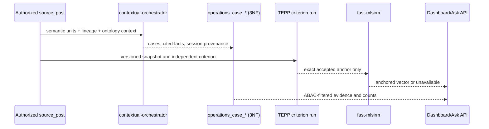

# Product & Technical Gap Baseline

> Dashboard delivery snapshot: 2026-08-26 18:51 KST. Protected `main` is
> `ff7431bd1851c03e737808d22c6a2d43968582f9`. This local branch is not
> protected-main release evidence.

## Operations Dashboard PRD/TRD traceability

| Requirement | Evidence contract | Delivery state |
|---|---|---|
| Claim cause delay: order, specification change, originating order, sales pool, Event/post counts | ADR 0206; contextual-orchestrator case classification with cited spans; Event Lineage context | Candidate implementation; authenticated runtime acceptance pending |
| Rebid/handover: discussion, counterparties, our owner, decisions, Event/post counts | ADR 0206; normalized case facts plus persisted summary actions/roles | Candidate implementation; corpus backfill pending |
| External information count/rate and sales/project relation | ADR 0206; semantic `external_information` classification inside Dashboard GNB | Candidate implementation; no separate Board by product decision |
| Project-specific journey | Explicit source/semantic project membership plus event-time ordering | Candidate API and ordered journey UI implemented; authenticated runtime acceptance pending |
| Repeat issue to design improvement | `repeat_issue`, `issue_pattern`, and `improvement_action` cited facts | Candidate semantic contract; design-system connector acceptance pending |
| Natural-language Ask with evidence, report, alert, MCP | Persisted semantic-unit embeddings plus versioned delivery/resource contract | Candidate implementation uses whole-question embedding retrieval with no lexical fallback; authenticated runtime acceptance pending |
| Per-post Ask continuity | ADR 0235; account/post-scoped normalized sessions and current-authorization citation projection | PR #677 merged into the non-default baseline branch as `80c59672`; retarget to `main` and revalidate after protected parent delivery |
| Similar VOC, customer cohort, prior action | Persisted repeat-issue candidate semantics plus orchestrator pair adjudication and extractive evidence | Candidate live post endpoint and post-detail UI implemented; authenticated runtime acceptance pending |
| TEPP independent Event Lineage anchor | Accepted, persisted TEPP criterion bound to exact snapshot/cutoff before fast-mlsirm activation | Consumer PR #606 and TEPP contract PR #237 are on their protected main branches; #237 intentionally publishes the fail-closed wire contract without an estimator, so no emitted, digest-bound terminal artifact is release evidence yet |
| Temporal Lineage topics and multilevel important posts | ADR 0210; TEPP posterior topic/plausible-value contract followed by fast-mlsirm observed-information case-deletion influence | Product/technical contract is protected on `main`; neither required Rust CPU/GPU producer envelope is shipped, so the Dashboard surface remains unavailable (ADR 0208: no local Python substitute) |

### Technical contract and flow

Security/operability: every aggregation applies `post_read` plus row-level
corporate-entity visibility before counting; source-body digests invalidate
stale inference; provider errors persist no positive/negative result; PII
remains authorized at the UI boundary and is excluded from telemetry. The
tables use composite keys and bounded kind-first indexes; production hot-path
acceptance still requires `EXPLAIN (ANALYZE, BUFFERS)` on an anonymized runtime
snapshot.

### Historical UI audit evidence

The `f0b96029` Storybook build was rendered at 1440×1100 and 402×1200 with
synthetic evidence; `416fd19d` changes only post-navigation request isolation.
Desktop inspection showed all four case kinds, five non-conflated metrics,
project-journey ordering, cited facts, and evidence actions without horizontal
card overflow. Narrow inspection showed two-column metrics, readable cards and
44px-class actions; the project journey remains intentionally horizontally
scrollable. No identifying runtime record or screenshot is committed. The
`EvidenceReady`, `NarrowViewport`, `AnalysisPendingAndMissingEvidence`,
`AnalysisFailed`, and `LoadError` scenes cover the ADR 0206 state inventory.
Authenticated authorized-corpus acceptance remains separate and may return
only aggregate, non-identifying evidence to this repository.

### Exact open-PR boundary

At this snapshot there were 42 open PRs and 11 open issues. The exact-head
inventory in section 1 is authoritative for this snapshot. Every open head
remained blocked on hosted gates and/or independent review. These observations
are not merge readiness. Re-fetch exact heads,
unresolved threads, checks, approvals, rulesets, and merge SHA before any
lifecycle claim.

> Audit snapshot: 2026-08-27 06:51 KST (refreshed by the autonomous merge
> loop). This repository records synthetic fixtures and aggregate,
> non-identifying runtime evidence only. Open PRs and local checks are not
> protected-default-branch release evidence. Identifying post identifiers,
> organization names, and production record keys must never appear in this
> file.

## 1. Exact-head and governance evidence

The protected default branch is `ff7431bd1851c03e737808d22c6a2d43968582f9`
at this refresh. The live queue contains 42 open PRs (21 targeting `main`,
21 stacked on non-default parents) and 11
open issues. The exact-head inventory below supersedes older per-PR snapshots
elsewhere in this document; those older rows remain useful historical delivery
context only.

| PR | Exact observed head | Merge/check state at this snapshot |
| ---: | --- | --- |
| #747 | `effbbc3f` | stacked on exact #716 and adds linked user, operations, and MCP manuals for the current product contract instead of duplicating behavior across README and ADRs. The manuals cover Dashboard/Voice/Ask evidence actions, owner-scoped asynchronous MCP reads, OAuth/session/quota recovery, canonical Compose and database observation while excluding provider models, secrets, runtime identifiers, and real records. Thirty-four exact-head manual/schema/docstring checks and diff hygiene pass; API/ADR truth, review threads, hosted checks, and independent review remain under current-head audit |
| #746 | `4983b291` | replaces closed-unmerged #744 and exposes authenticated occupations represented in one imported rating source. It preserves the complete persisted rating and source/scale provenance domain, uses the observed title/code catalog and native selection without ranking or typed fallback, fences authentication/source/occupation/late responses, distinguishes unavailable catalog from an imported empty result, and aligns empty-evidence guidance with the selector's next action. Hosted checks and independent review remain required |
| #745 | `8aa97347` | stacked on exact #746 and adds only case-insensitive published-title or retained-code substring filtering over the native catalog, without ranking or typed SOC fallback. The current normal-merge ancestry preserves #746's request, authentication, source, occupation, loading, unavailable-catalog, and empty-guidance fences; invalid selection clears and requires a visible catalog choice. Review threads are resolved, while hosted checks and independent review remain required |
| #743 | `d23e1deb` | stacked on exact #740 and catalogs only imported occupation-rating artifacts that contain observations, preserving release, publisher, license, URL, digest, and declared row-count provenance while excluding the scale support artifact. The latest head normally reconciles the advanced evidence-view parent while retaining authentication and late-response fencing; hosted checks and independent review remain required |
| #742 | `72782870` | stacked on the latest operations candidate and persists request-scoped normalized product mentions and closed-code relations atomically, re-applies eligibility and ABAC on reads, projects OWL/SHACL assertions, and keeps provider-backed production fail-closed. The latest repair authorizes product-relation target evidence while retaining predicate/product assertion identity; hosted checks and independent review remain required |
| #740 | `e6efa6fe` | stacked on the current occupation-rating read branch and adds an authenticated Dashboard evidence view without changing the governed GNB. It preserves exact values, bounds, sample/error/interval evidence, dates, suppression/not-relevant warnings, and provenance while distinguishing unavailable source from an imported empty profile. The latest repair hides stale occupation pagination as soon as a new request supersedes it, keeps artifact links HTTP(S)-only, and retains the actionable fallback; focused checks pass, while hosted checks and independent review remain required |
| #735 | `e2042093` | stacked on exact #734 and imports caller-pinned O*NET rating and Scales Reference artifacts under the ADR 0257 schema boundary. It preserves exact decimals, uncertainty, optional category/relevance, release/source partitions, both artifact digests, and the exact `MM/YYYY` source month without local weighting, aggregation, normalization, or psychometric arithmetic. The latest importer rejects short and extra-field CSV rows with exact line evidence; normally merged #738 adds an authenticated bounded read projection whose merge tree exactly matched its audited head. Parent hosted checks restarted after that merge, and independent review plus parent delivery remain required |
| #734 | `4c3677af` | stacked on exact #732 under union-free ADR 0257 and proposes a partitioned 3NF O*NET occupation-rating evidence store without importing production data or computing local weights. PostgreSQL rejects future or malformed source months, out-of-scale observations, divergent duplicates, row mutation, and whole-store truncation while preserving the explicit partition detach/archive boundary. The latest head is an ancestry-only restack carrying #724's publication-label repair; review threads are empty and all observed exact-head hosted checks pass, while independent review and parent delivery remain required |
| #733 | `17c554a9` | stacked on exact #726 under union-free ADR 0258 and projects authorized occupational assertions into the bounded ontology neighborhood with source eligibility, cutoff, and persisted-truth boundaries. Work evidence uses a double-outline rounded rectangle and a visible localized type label while Team remains single-outline; DB and ontology labels agree, construct focus fails closed instead of exposing a raw UUID, and disabled construct analysis no longer misreports another channel's durable job as construct processing. The latest repair replaces an unrelated global vocabulary-count assertion with a direct proof that every worker-function IRI lacks `lookupCode`; forty-five focused ontology checks pass, review threads are empty, and hosted checks restarted |
| #732 | `7f60aa8e` | stacked on exact #731 under union-free ADR 0256 and publishes 1,417 directed O*NET linkage assertions from eight pinned source tables with reified subject, predicate, object, and provenance and without weights or causal claims. The latest head is an ancestry-only restack carrying #724's publication-label repair; focused publication evidence, review threads, and all observed exact-head hosted checks pass, while independent review and parent delivery remain required |
| #731 | `b3b9b360` | stacked on exact #724 and publishes all 3,006 O*NET 31.0 Content Model reference elements as deterministic SKOS with exact source identifiers, hierarchy, provenance, license, and artifact digest; ADR 0255 explicitly supersedes only ADR 0248's prohibition on complete pinned O*NET vocabulary publication and preserves the evidence/no-equivalence boundaries. The latest head is an ancestry-only restack carrying #724's publication-label repair; canonical graph publication, review threads, and all observed exact-head hosted checks pass, while independent review and parent delivery remain required |
| #728 | `e52a8272` | now stacks on exact #640 instead of extending protected-main NumPy arithmetic. It pins fast-mlsirm PR #1457 exact `5c7dc9ea` and consumes the owner-produced Rust/PyO3 explained-share field while retaining LineageWeave validation, persistence projection, API, and presentation only. The audit also moved the schema change to union-free migration 0236 and made the production-equivalent bootstrap execute it. Upstream Rust tests pass; LineageWeave backend/schema/frontend focused checks pass; both review queues have zero unresolved threads. The upstream PR remains draft with hosted gates in progress and the LineageWeave parent remains non-default, so neither is protected delivery |
| #726 | `d6a12fbb` | stacked on exact #723 and admits occupational constructs only through contextual-orchestrator conduct, offered permanent IRIs, and verbatim semantic-unit evidence. Attempt-fenced lease refresh prevents concurrent long extraction, a later-enabled analysis service wakes succeeded current-digest rows that lack construct evidence, and disabled construct analysis no longer exposes another channel's queued/running job as construct processing. Twenty-three focused checks pass with one live integration skip, review threads are empty, and all observed exact-head hosted checks pass; independent review and parent delivery remain required |
| #724 | `1d2f8052` | targets the occupational-taxonomy stack and publishes the complete official 2018 SOC hierarchy from pinned, digest-verified source artifacts. Source-column hierarchy becomes `skos:broader` without title/code inference, and no occupation-to-person trait, employer job-family mapping, crosswalk, score, or weight is invented. The served Turtle is a deterministic generated equivalent of the governed source graph, not mislabeled as the authoritative source, and RDF isomorphism plus the source manifest prove that boundary. The focused publication regression, review threads, and all observed exact-head hosted checks pass; independent review and parent delivery remain required |
| #723 | `316fc190` | stacked on exact #721 and synchronizes the official O*NET 31.0 construct catalog under ADR 0250 without importing ratings, scores, crosswalks, affect labels, or person traits. The official 485,151-byte, 3,006-row source artifact is pinned by canonical SHA-256 before a database transaction; the governed scope admits 2,529 constructs, rejects changed or whitespace-mutated labels, and keeps absent descriptions as `NULL`. Synthetic fixtures inject their own declared digest rather than weakening the production pin. Focused checks and the official digest/count replay pass; all threads are resolved and hosted checks remain in progress pending parent delivery |
| #721 | `9214c50f` | stacked occupational-construct persistence candidate. The current head synchronizes its parent and removes the duplicate construct-detail field; lint and production build pass, all threads are resolved, and auto-merge remains disabled pending parent delivery |
| #720 | `dda0531d` | cancels stale test runs after PR closure. A normal failed-job rerun reached terminal attempt 2 and again failed closed only after NVIDIA primary `429`, retired NVIDIA fallback `410`, and direct OpenAI `insufficient_quota`; this is current provider-infrastructure evidence, not a code finding or a passing scan. Normal auto-merge is enabled, but authoritative Strix evidence and independent review remain required before protected delivery |
| #719 | `6ee2278a` | stacked on current #718, exposes the governed `dcterms:rights` read model, and preserves parent ancestry through a normal merge. Fifty-four focused checks pass, all threads are resolved, and auto-merge remains disabled pending parent delivery |
| #718 | `2723fea3` | stacked on #709 and adds evidence-bound occupational constructs with governed provenance wording. Eighteen focused checks pass, all threads are resolved, and auto-merge remains disabled pending parent delivery |
| #717 | `b2e0c963` | stacked on #713 and persists governed evidence-bearing Voice-of-X combinations. Customer-visible assignment events are localized, unchanged Voice codes retain their original effective time, and rejected/superseded assignments render their persisted truth state rather than appearing accepted. The latest head refreshes exact gate evidence for paged Voice JSON-LD; hosted checks and independent review remain required |
| #716 | `65e1dcdc` | stacked on exact #711 and prioritizes the evidence-bound operations backfill with isolated responsive dashboard acceptance. PRs #739 and #714 merged normally into this parent, carrying READ COMMITTED two-tier de-duplication plus bounded public-source research with fail-closed visibility and provenance. The representative anonymized-runtime `EXPLAIN (ANALYZE, BUFFERS)` evidence required by ADR 0206 remains absent, so production performance acceptance and protected parent delivery remain incomplete |
| #713 | `850494c3` | proposes the ADR 0246 twelve-code atomic stakeholder Voice-of-X post taxonomy while preserving ADR 0251's separate extensible combination model and the independently governed organization-relationship vocabulary. The audit moved all twelve labels into the parent so Korean, Chinese, Japanese, and Vietnamese filters do not fall back to English immediately after this PR lands. Sixty-eight i18n and 24 ontology checks plus production build pass; a 1280x720 Korean filter render was inspected, all threads are resolved, auto-merge is enabled, and fresh hosted checks plus independent review remain required |
| #711 | `05e5f520` | stacked on the current #640 head rather than `main`. A proposed pin advance was reverted after exact ancestry showed contextual-orchestrator #882 merged only into a non-default upstream stack and is not protected-main delivery; the immutable runtime pin therefore remains unchanged. It now includes the normally merged worker-memory evidence stack. Its canonical upstream runtime-evidence thread stays unresolved and auto-merge remains disabled pending protected upstream delivery and exact-image proof |
| #710 | `020ff089` | records the worker-function delivery gap against #709 without duplicating #702's corpus audit; the latest documentation refresh records the exact protected queue evidence and keeps all referenced heads snapshot-relative. Hosted checks and independent review remain required |
| #709 | `8ef4090c` | publishes the DOT/FJA worker-function taxonomy and fail-closed read model without converting definitional ranks into weights or asserting an unsupported term-level crosswalk. Exact-head hosted checks and independent review remain required |
| #704 | `7b9a70ee` | publishes the bounded external-lineage contract with fail-closed structured adjudication and exact same-group inference eligibility. The hosted full-suite repair removes fabricated random LLM-channel measurement from tests, keeps LLM fusion unavailable without an estimated LLM-inclusive weight, tests the provider boundary directly, and restores public-docstring coverage. Thirty focused checks and Ruff pass locally; fresh hosted checks and independent review remain required |
| #702 | `8b51c738` | makes missing source-body evidence explicit, carries governed source classifications through semantic hints and RDF/SHACL, and requires probability-sample manifest v3 plus an exact replayed fast-mlsirm Rust design artifact. For the 43,814-record eligible frame, the predeclared SRSWOR design yields `n=381` at 95% confidence, error bound 0.05, and `p=0.5`; the earlier 500-record diagnostic remains explicitly non-probability-selected and cannot support corpus prevalence or confidence intervals. The current head drains spawned-process results before join, correlates provider trace with attempt provenance, and refreshes stacked estimator delivery evidence; upstream Rust delivery, hosted checks, and independent review remain required |
| #701 | `cc3351a9` | repairs both integration fixtures by invoking `psql -X -v ON_ERROR_STOP=1 -f` exactly like the ADR 0166 production runner, so concurrent indexes remain outside a transaction without a fixture-owned SQL parser; no migration is skipped or suppressed. Forty schema/replay/backend checks pass; protected hosted checks and independent review remain required |
| #700 | `1bc99eca` | adds ADR 0238's bounded versioned caller-parsed conversation-turn envelope, fail-closed whole-result preflight, ordered semantic-unit persistence, and opaque caller evidence references without body-pattern speaker inference. Caller units cannot inherit opaque-body metadata, trigger unused vision work, or admit text the database cannot persist. The current head moves its schema change and paired rollback to union-free migration 0233, applies that migration in the real-PostgreSQL fixture, and binds each evidence action to the inclusion channel that admitted it; protected hosted checks and independent review remain required |
| #680 | `b05e3100` | replaces rendered implementation-boundary language with customer actions, including topic-specific measurement access and exact empty-state actions. The latest repair replaces search-configuration text with saved-evidence/retry guidance in five locales, suppresses raw failure codes, and removes the persistence-delivery outbox from the customer screen while retaining the API record. All 166 App/i18n checks and lint pass; fixed-project Compose renders at 1440x1100 and 390x844 show the status history and next actions without raw failure/outbox terms or horizontal overflow. Fresh hosted checks and independent review remain required |
| #679 | `135dfe7c` | ADR 0229 public-claim envelope, async verification, locale-aware next actions, opt-in search setup, and rollback protection for truth-owned fields. The current head always renders the aggregate verification action alongside per-claim actions, removes internal graph-review copy, and maps unknown future claim/status codes to localized `Recorded claim` / `Status unavailable` instead of exposing wire values. Sixty-nine focused UI/i18n checks pass, all threads are resolved and normal auto-merge is enabled, while exact-head hosted checks and independent review remain required |
| #672 | `a3e87a89` | persisted semantic-evidence nomination for Global Ask uses unique ADR 0233/0234 and migration 0225/0226 identities; production nominee wiring includes organization/team evidence and typed public claims, removes duplicate embedding and token-overlap inference, and separates visible from all KG evidence so hidden identifiers cannot render. The current head repairs the server-diagnostics fixture to follow the configured Global Ask embedding contract after the prior exact head failed; fresh hosted checks and independent review remain required |
| #668 | `234f975b` | evidence-bound project history orders by recorded event time, retains explicit source identity alongside NFKC-deduplicated semantic keys, suppresses false direct handovers, and carries one non-conflicting evidence snapshot. Project-match provenance and unknown future event codes now map to localized Source record / Supporting record / Recorded evidence labels instead of exposing relational field names. Seventy-four focused project-history/UI/i18n checks pass; hosted checks and independent review remain required |
| #667 | `e3f8a895` | this refresh branch prevents stale conversation pagination, recovery, delayed answers, and typed drafts from contaminating a replacement post or conversation; keeps saved turns out of the demo-seed presentation; applies the shared source-eligibility boundary; and replaces provider, transport, environment-variable, timeout, calibration-script, and search-configuration copy with task-specific next actions. Saved conversations page on immutable creation time plus conversation id so a concurrent new turn cannot move a row above the reader's cursor; the observed head also tracks the current semantic-evidence queue. Focused checks pass, all review threads are resolved, normal auto-merge is enabled, and hosted checks plus independent review remain required |
| #658 | `5f3bc384` | sends the validated UTC cutoff directly, removes duplicate/unreachable cutoff state and SQL parameter conflicts, and keeps database-clock cutoff validation and evidence authorization intact. The latest repair replaces transport-oriented cutoff wording and raw RFC3339 output with a five-locale, device-time action and local display formatting; the Storybook interaction follows the same contract. Sixty-seven focused frontend/i18n checks and lint pass, review threads are empty, normal auto-merge is enabled, and exact-head hosted checks plus independent review remain required |
| #657 | `355a5796` | persists strict TEPP accepted receipts without treating acceptance as measurement, resumes a stored remote run through the pluggable status port, validates and persists the terminal DTO before Succeeded, and keeps all arithmetic in TEPP. The latest UI repair removes TEPP, provider, remote-run identifier, and reconciliation internals from the customer surface; the accepted state now asks the user to refresh for result readiness. Sixty-nine backend/schema checks, five focused frontend checks, lint, and Storybook build pass; the 1440×720 accepted-state render was inspected, all review threads are resolved, auto-merge is enabled, and hosted checks plus independent review remain required |
| #644 | `f53dd28e` | current-main reconciliation preserves all existing workspace surfaces and adds Public Claim Verification as the ninth lazy boundary; a subsequent normal merge reconciles concurrent ADR/baseline evidence without deleting either implementation path. Frontend 42 files/391 tests, lint, production build, and Storybook build pass; refreshed desktop loading and mobile error screenshots confirm the actionable alert/Refresh states. The observed 509.58 kB app chunk still triggers Vite's warning and remains measured performance debt; hosted checks and independent review remain required |
| #643 | `8767de1b` | accessible status notices; hosted checks and independent review remain required |
| #640 | `ebfe60af` | dashboard ranking and topic-influence stack preserves Ask service imports, authorization, ontology parity, transactional schema fixtures, the durable worker, bounded structured validation, and atomic voice-backfill completion. PRs #727, #730, and #725 merged normally into this non-default parent: public failures no longer expose provider, environment-variable, timeout, or evidence-assembly boundaries and instead give a retry/administrator action; empty verification gives a specific-claim/time-range retry; worker memory evidence remains aggregate and non-identifying. Focused backend/i18n/rendered tests, lint/build/Storybook, and desktop/mobile inspection pass. Exact-head hosted checks and independent review remain required before protected delivery |
| #639 | `2f4b1bff` | running-action/config repair now also makes the documented `make seed` contract install its declared script/runtime extras and documents the canonical Keyverse frontend variables with a container-contract regression. The exact-head repair updates the Makefile contract test to require those owned extras; 13 focused Makefile/config tests pass locally. Fresh hosted checks are running, auto-merge remains enabled, and independent review is required |
| #632 | `24262a99` | graph-fact provenance repair also carries the current bounded MCP request contract, token-backed Ask layout, ontology-label wrapping, and normalized-table evidence-search index repair. Both live migration fixtures execute the production-equivalent `psql -X -v ON_ERROR_STOP=1 -f` path; 38 schema/replay/contract checks pass locally. A normal Strix rerun request was accepted with HTTP 201 and the replacement exact-head job is queued; acceptance is not a passing scan. Full tests remain in progress and coverage-source-tree is queued, so exact-head terminal revalidation and independent approval remain required |
| #629 | `b721b0f2` | provider-work release and bounded reads now preserve relationship type, capture update status, remove a shadowed legacy verifier, persist each completed result before a later provider failure, fence deleted evidence, and execute both Global Ask migrations twice in the real PostgreSQL fixture. Focused migration/schema tests pass; hosted checks and independent review remain required |

PRs #687, #688, and #689 merged into the non-default #640 stack as merge
commits `9d4210c04fb0aeec17e885bed097f400c7018269`,
`b597b0182084a89222d1a04d05878adebfa9ec2b`, and
`fbf7afb5a3037254266e5cf1bb024e435b126bb1`. PRs #690 and #691 merged into the
non-default #667 stack as `55b5a48ff997fddbe8fcc47a268d0b02aa835c6a`
and `60b4c6004739a05e63edae8ff160758f8e665919`.
These are stack-integration evidence only; they are not protected-`main`
delivery. Their acceptance now travels with the two parent heads above.

PR #712 merged into the non-default #702 stack as `78a144107`; it freezes
LineageWeave-local scoring and entity-resolution arithmetic behind ADR 0245
without inventing a replacement. The whitespace repair for that carried ADR
is present on the current #702 head. This is stack-integration evidence only,
not protected-`main` delivery.

PR #722 merged normally into non-default parent #640 as `c142c4ea`; it restores
the dedicated Ask worker's semantic-query and opt-in public-verification
factories and the production-equivalent concurrent-migration fixture path.
This is stack-integration evidence only and cannot substitute for #640's
protected-`main` delivery.

PRs #692, #697, and #694 merged into the non-default #693 composition as
`cdd499b161053a9c5439181e8f39e1baa80e68c0` and
`dc3ebb6911187637cf85fcbcc036cf39e571aaec`. PR #699 merged into the
non-default #694 composition as `d47aae9f77a3f71c7f91929cb258f6e73d1f6d40`;
#694 then merged into the non-default #693 composition as
`0feb7f72cc34fbd23e8f1bd6355c9a5ee49ded89`. Their product-catalog,
voice taxonomy, Python-arithmetic deletion, and Rust-ownership audit evidence
traveled with #693 and now travels with open parent #640 after #693 merged
there as `7adb7a4a9712f2f56a7291d437225a1227debbf8`; none is protected-main delivery.

PR #663 merged to protected `main` as merge commit
`faff7a32cf9b3c81fefa2814b6f30a0a3ba4e58f`; its project-ontology traversal,
cutoff-snapshot authorization, bounded MCP admission, and caller-parsed
semantic-unit seam are therefore protected delivery. This does not by itself
ship a Naruon conversation-turn producer contract.

PR #686 was closed without merge at `fbca05d9`; its customer-copy work is not
protected-main delivery and any still-required behavior must travel through an
open current-main candidate rather than relying on that closed head.

The exact-head scan at 01:40 KST found 12 of 28 heads with a terminal failure,
nine with a queued or in-progress context, and nine with unresolved review
threads. The 01:56 follow-up contained 29 open heads after #723 opened; 22
targeted `main` with normal auto-merge and seven stacked children correctly
remained off. No current head had a qualifying independent exact-head approval,
so no candidate is protected delivery.
Queued checks, `MERGEABLE`, auto-merge, and bot success statuses are not merge
evidence.

### Ecosystem owner-boundary evidence

- `ContextualWisdomLab/contextual-orchestrator` PR #857 exact head
  `dc5ed7a1` owns provider-backed embedding discovery, selection, execution,
  durable batching, session propagation, and Rust token/vector arithmetic.
  Its required hosted checks were queued at this snapshot. LineageWeave may
  request embeddings and preserve an orchestrator-returned session model pin;
  it must not configure `LLM_GATEWAY_EMBEDDING_MODEL`, infer a provider from a
  model name, or present #857 as delivered before its protected merge.
- `ContextualWisdomLab/RankWeave` PR #41 exact head `e95ed46f` contains the
  proposed Rust calculation core and the semantic-unit ranking feature merged
  from stacked PR #48 (`f3cd7ed7`). PR #48 is therefore stack-integration
  evidence only; #41's new exact head has queued hosted checks and no
  protected-main merge evidence. LineageWeave may consume the owner contract
  only after that composed head passes its protected gate; it may not retain
  Python vector arithmetic.
- `ContextualWisdomLab/fast-mlsirm` PR #1445 exact head `e2e86a7d`
  supplies the Rust-owned finite-population proportion design artifact consumed
  by #702: source and algorithm identities, population, confidence, margin,
  expected proportion, uncorrected and corrected sample sizes, allocation,
  ordered strata, exact `(n_h, N_h)` inclusion ratios, and
  input/output/artifact hashes. The ratios are bound through Rust, PyO3,
  Python, output hashing, and artifact hashing. Five Rust and eleven PyO3
  checks pass with `cargo check`, Ruff, and lock verification. The PR is ready
  and auto-merge is enabled, but hosted checks and independent approval remain
  pending; it is owner-candidate evidence, not protected release evidence.
- `ContextualWisdomLab/TEPP` PR #237 merged to protected `main` as
  `eec86be724e9131ecfe8f152db0f7728af68017f`. It publishes the fail-closed
  lineage-criterion anchor wire contract but explicitly does not implement the
  estimator; LineageWeave must keep weights unavailable until TEPP emits the
  digest-bound terminal artifact.

No row above is merge evidence. Immediately before any lifecycle action,
re-fetch the head, unresolved threads, formal reviews, rulesets, and same-head
check conclusions. In particular, queued checks are infrastructure state and
do not transfer evidence from an earlier SHA.

### Cross-PR contract collision audit

The current heads cannot be merged in arbitrary order. PR #672 and stacked
PR #677 formerly assigned ADR 0228 to per-post conversation history while #672
used it for public-claim verification. The baseline branch now assigns the
conversation contract unique ADR 0235, while #672 uses ADR 0234; the legacy
ontology publication decision now uses ADR 0236, leaving #679's public-claim
ADR 0229 unambiguous. #672's Semantic Ask migrations now use 0225/0226,
separate from #640's 0211/0222 and #679's 0224. The former #640/#663 ADR
0224 and 0225 collisions are resolved on #663 by unique ADR 0230/0231
identities. A current-head inventory confirms that #702's semantic-coverage
decisions moved to ADR 0240/0241/0242 and #704's external-lineage decision
moved to ADR 0239. #668's evidence-bound project-history projection moved from
the remaining shared 0232 identifier to ADR 0243, and #640's
source-preserving voice semantic taxonomy now owns ADR 0244. That leaves
#709's worker-function taxonomy as the sole ADR 0232 decision. #713's expanded
post-voice taxonomy now owns union-free ADR 0246 and migration 0235; #640
composes the same post vocabulary without fabricating organization
relationships. The
open-head migration union found one distinct-name collision at 0230: #640's
voice semantic taxonomy and #700's conversation-turn evidence. #700 now owns
union-free migration 0233, preserving #640's accepted 0230 identity; focused
replay against real PostgreSQL confirms the renamed migration is applied.
Merged child #706 originally reused 0233 for post-content validation; it moved
that distinct schema contract to union-free migration 0234 before normal merge
into #640. PR #705 first merged its replay guard into the non-default historical
`fix/ask-auto-source-composer` branch as `db181493`; that merge alone was only
stack-integration evidence. Merged child #707 then forwarded the same guarded
contract into live parent #640 as `cb086313`, so #640 now carries it while main
still does not.
The
`0212_global_ask_knowledge_cutoff.sql` blobs in
PR #658 and #663 are byte-identical, so that overlap is duplicated delivery rather
than a semantic divergence. Release metadata also diverges: the observed
`pyproject.toml` versions are 2.18.0 on #632/#640/#663, 2.19.0 on #643,
and 2.22.0 on #679. Release-version and duplicated-delivery overlaps still
require ordered parent landing, child retargeting, and exact-head
revalidation; ADR identifier collision is no longer the blocker at this
snapshot.

PR #680 and closed-unmerged #686 independently edited the same ranking,
ontology, and locale surfaces. Before #680 can land, compare it with #686 and
port only still-required customer actions and rendered evidence into the open
current-main candidate; the closed head is not delivery evidence and must not
be used to restore implementation-facing copy.

The hosted Full test for PR #632 at superseded head `cad4debf` failed only in
the real-PostgreSQL semantic-nomination test with `InvalidPasswordError`; the
other 1,333 tests passed. The run was cancelled after the branch advanced to
`811026cc`, and a fresh exact-head run is queued. This is retained as runner
evidence, not treated as a source regression or a passing gate.

PR #664 first merged into #660's non-default stack as
`b2e48d5b0db59f5aa434e2a293cd182ee810c019`; PR #660 then passed the protected
gate, followed by PR #659, with current protected merge commit
`494b54e2245040bcf02b45376f221c37cd437e76`. The combined semantic-unit,
backend-contract, and ontology-token implementation is now protected-main
delivery evidence, while downstream authorized-runtime acceptance remains
open.

PR #607 first merged as `61fd631c7bb3c57113fd19763c2c43161eeb2824`
into #606's non-default branch. PR #606 subsequently passed the protected gate,
so the combined TEPP-consumer and operations-dashboard implementation is now
on `main`; the still-open TEPP producer PR #237 keeps end-to-end anchor
acceptance unavailable.

PR #604 was closed unmerged after its exact OIDC repair was composed into #605;
its green or pending checks are not delivery evidence. PR #482 merged as
protected-main commit `464ff25002044b9d933c8eefd36c8def7ca0ffd8`
with package conflict markers, identifying baseline records, and an OIDC
return-context regression. PR #603 repaired the package/privacy and
analysis-run transaction defects through protected main at `4f53190b`; the
OIDC defect remains delivered until #604 or the composed #605 passes the
protected gate. Protected main is therefore not yet a release candidate.

PR #592 first merged as `3b3af3b4fe9c439354433a43444e05f37ab24ea3`
into #590's non-default stack base at `2f033ba3`. The complete stack then
passed the protected gate and #590 merged to `main` as
`1d1379fc59d9dac6e9c8bfa4812313e3b9e8f3c8`.

PR #521 merged through protected `main` as
`3797f063b1a7396972a749aa81f23745acccbee1`; it is release evidence and no
longer part of the open queue. That merge also left a standalone conflict
marker and duplicated stale tail in `CLAUDE.md`; #594 repaired it through
protected `main` as `241be2dddf657f854cb8be54fe11d4ef48d37976`.

Protected main now contains the ADR 0109 OIDC return restoration from #605,
including fragment preservation and storage fallback. The #606 dashboard
landing must additionally route `?post=` deep links to the Board; that focused
regression is part of the current candidate and is not delivery evidence yet.

Three systemic gates currently dominate the queue:

1. **Strix visibility and fallback repair (org control plane).**
   ContextualWisdomLab/.github#1320 merged to protected `main` as
   `d2c554dbbc04854db6215970fabb70cef1ceb690`; its former candidate head is no
   longer open-PR evidence. Current follow-up #1350 is open at exact head
   `045f1789`, with zero unresolved threads and no terminal failed checks, but
   its required hosted checks are queued and it has no formal independent
   approval. It changes the owned Strix fallback contract and focused
   regression only. Until #1350 passes its protected gate and downstream scans
   succeed, the seven current LineageWeave Strix failures remain unresolved
   control-plane evidence rather than seven proven source defects.
2. **Exact-head hosted evidence.** #1350's local verification and mergeable
   state do not prove the central workflow repair. A terminal successful
   protected merge and subsequent successful LineageWeave scans are still
   required; incomplete provider exhaustion and vulnerability findings remain
   non-passing.
3. **Current-head independent approval.** The org merge scheduler requires
   `reviewDecision == APPROVED` plus complete Strix evidence on the exact
   head. Bot review evidence regenerates per push, so any repair push resets
   the review clock by design; this is expected and not a bypass target.

Recent protected-default-branch delivery evidence (squash merges onto
`main`, newest first):

| PR | Merged (UTC) | Delivered |
| ---: | --- | --- |
| #659 | 2026-08-25 22:04 | ontology node readability, semantic-family design tokens, and exact-value evidence tables |
| #660 | 2026-08-25 21:54 | backend runtime contracts and the #664 semantic-unit stack |
| #468 | 2026-08-25 08:44 | fast-mlsirm, Keyverse, contextual-orchestrator, and TEPP integration boundaries |
| #493 | 2026-08-25 08:44 | evidence-grounded Event Lineage isolation reasons |
| #600 | 2026-08-25 08:44 | then-current exact-head product/technical baseline |
| #605 | 2026-08-25 08:44 | dialog focus order, evidence readability, and OIDC return-context restoration |
| #608 | 2026-08-25 08:43 | Naruon projection consumed by Workspace Calendar |
| #603 | 2026-08-25 07:24 | short analysis-run transactions, session advisory locking, package-marker/privacy repair, and provider-work lease release |
| #602 | 2026-08-25 07:24 | post-detail modal semantics, Escape close, initial focus, and opener restoration; navigation-refocus edge case continues on #605 |
| #582 | 2026-08-25 07:24 | bounded batched cited-lineage graph fetch |
| #588 | 2026-08-25 07:23 | named two-axis leftover-map reconstruction and raw-residual identity |
| #482 | 2026-08-25 07:03 | corroborated SKOS companion organization chips; regressions subsequently tracked above |
| #601 | 2026-08-25 06:38 | APA 7th PROV-O and PROV-DM references for ADRs 0011 and 0065 |
| #595 | 2026-08-25 04:39 | audited no-draft import door, nullable updated-at fallback, and event-time import |
| #484 | 2026-08-25 04:39 | Allen interval relations with deferred FK validation |
| #383 | 2026-08-25 04:39 | reader-safe OTel diagnostics and service-peer-bounded session metadata |
| #599 | 2026-08-25 04:28 | raw-residual leftover-map cross-share identity aligned without arbitrary weighting |
| #598 | 2026-08-25 03:32 | 5W1H roles/events remain readable across a stale summary contract version |
| #597 | 2026-08-25 03:32 | related posts open Customer Master detail in place without stale graph state |
| #591 | 2026-08-25 03:32 | prior exact-head product-gap baseline snapshot |
| #584 | 2026-08-25 03:32 | TEPP topic-lineage consumption boundary grounded in cited temporal models |
| #581 | 2026-08-25 03:32 | relative-time Ask filtering bound to event time |
| #596 | 2026-08-25 03:27 | hierarchy/name-resolution deep-work timeouts aligned at 600 seconds |
| #585 | 2026-08-25 03:27 | raw Global Ask transport exceptions replaced by bounded client-safe detail |
| #355 | 2026-08-25 02:38 | Naruon calendar projection contract and conformance fixture |
| #562 | 2026-08-24 02:05 | parameter-free classic RRF; deleted the last hand-picked fused score |
| #561 | 2026-08-24 01:47 | knowledge-graph precedence/hierarchy relation classification and layout order |
| #555 | 2026-08-24 01:29 | per-channel score breakdown persisted on `post_lineage_edge.channel_scores` (ADR 0195) |
| #559 | 2026-08-24 01:26 | deleted `DEFAULT_CHANNEL_WEIGHTS` hand-picked fallback |
| #549 | 2026-08-24 00:43 | clamped embedding cosine into `[0, 1]` instead of remapping from `[-1, 1]` (ADR 0190) |
| #548 | 2026-08-24 00:37 | mid-reconstruction provider failure maps to an explicit unavailable state |
| #544 | 2026-08-24 00:27 | fusion weights accepted only via fast-mlsirm estimation |
| #538 | 2026-08-23 23:39 | real embeddings wired into the Event Lineage text channel |

This documentation is owned by protected `main` again: the #426 stack landed,
so hidden-stack merges (#494, #497, #499, #505, #509 into unprotected parent
branches) are historical context only and no longer gate anything.

The current protected-`main` and exact #507 trees are clean of the private
runtime source-table identifier present in the closed #506 head and older
public history. Do not reproduce or hint at its value. Historical remediation
requires the ADR 0001 incident process and security/privacy-owner coordination;
never force-push or delete evidence ad hoc.

The repository-owned hourly commercialization loop and the central thin GitHub
Actions caller ContextualWisdomLab/.github#1288 (current head `c78ae017`, minute
4, `pr-review-fix-scheduler.yml`) both target this repository. The central
candidate now reaches model execution through a pinned contextual-orchestrator
sidecar, exposes only its loopback gateway contract to OpenCode, and requires
customer next-action copy without rendered implementation boundaries. PR #1259 is the
closed predecessor and must not be treated as current scheduler evidence. Do
not add a LineageWeave-local duplicate workflow. ContextualWisdomLab/.github#1258
merged at exact head `897819c4` to repair the pnpm/coverage-evidence workflow;
newly created exact PR heads must still prove the runtime behavior because
merged workflow source alone is not check evidence.
The local `com.contextualwisdomlab.lineageweave-hourly` launchd registration
was live-audited at this snapshot with a 3,600-second interval, 18 recorded
launches, and process exit code 0. Its output log contains earlier completed
queue/repair iterations, but the two latest invocations reported tool-host
negotiation timeouts; a zero Codex process exit therefore does not prove a
successful maintenance iteration. Registration and prior successful work do
not prove the next run or transfer protected-head evidence, so every invocation
still re-reads live PR state and the loop retains explicit fail-closed reporting.

Figma design-system boundary (ADR 0002): File ID `1Su3lDRmiZdcUs47t1QwIX`.
The sanitized file now contains synthetic Event Lineage desktop (`5:14`) and
mobile (`5:15`) frames with graph direction, event dates, an inference
boundary, and exact fused-score evidence. Do not copy source-organization
content into this repository. Storybook remains the executable scene and
edge-case inventory for repeated web objects; rendered code-to-Figma parity
still requires same-viewport browser comparison on an exact candidate head.

## 2. User-visible capability baseline

Substantially present on protected `main`:

- PostgreSQL-backed import, normalized provenance, cutoff-aware analysis runs,
  source revisions, lineage reconstruction, and explicit unavailable states.
- Authenticated workspace navigation, post detail, localized summaries, 5W1H,
  R&R/Keyman, evidence citations, chat, organization hierarchy, and lineage DAG
  (`frontend/src/LineageDag.tsx` is on `main`; the old “DAG view missing”
  baseline entry is stale).
- Semantic paragraph/list/table/image-region units that preserve the source
  representation and provenance instead of flattening it into one body string.
- Contextual-orchestrator boundaries for adjudication, extraction, summaries,
  chat, embeddings, and VISION; null channels remain unavailable and are
  dropped from score fusion.
- W3C PROV-O projection through normalized provenance tables, with the
  knowledge graph retained as an explicit navigation projection.
- Keyverse/Keycloak OIDC, RankWeave fusion port, TEPP measurement client,
  ThreadWeave tree assembly.

These statements describe source capability, not authenticated production
corpus acceptance or protected release.

## 3. Historical open-PR inventory (superseded by §1)

Heads below are queue evidence captured at snapshot time; recheck SHA,
checks, unresolved threads, and independent approval immediately before any
merge claim. Do not self-approve, force-push, or transfer stale review
evidence across heads. The org merge scheduler merges only when
`reviewDecision == APPROVED` on the exact head and Strix evidence is complete.

### 3.0 Shared systemic gate

| Gate | Evidence | Durable repair |
| --- | --- | --- |
| Strix provider unavailability | `nvidia_nim/nvidia/nemotron-3-super-120b-a12b` and `openai-direct/gpt-5.6-luna` failed authoritatively across unrelated heads | ContextualWisdomLab/.github#1263 at `ab3d7645` proposes executable Azure/cross-provider fallbacks but remains open/conflicting; repair that branch without weakening the required gate |
| ADR 0109 login repair debt | Eight branches cut from the pre-repair base carried the unauthenticated `AdminPanel` + unused-OIDC-helper `tsc -b` failure | Same verified two-line repair applied to #521, #522, #552, #553, #554, #556, #558, #560 during this loop; frontend lint/test/build verified locally |

### 3.1 Workspace root and product surfaces

| PR | Head | Intent | Notes |
| ---: | --- | --- | --- |
| #258 | `f0b5234d` | Workspace evidence board and source-grounded ontology surface (root stack) | Largest surface; historical CHANGES_REQUESTED is stale relative to current head |
| #349 | `bef4a858` | Bounded ontology and provenance explorer (v2.13.0) | Issue #341 |
| #355 | `2f3f308c` | Naruon event projection contract | Issues #336/#338 |
| #387 | `0bd93e94` | Persist and explain Event Lineage channel evidence | Protected `main`; historical issue #274 |
| #405 | `ec62d9f0` | Persisted image-region locations (v2.12.8) | VISION region provenance |
| #484 | `878c4a87` | Allen interval relations on Event Lineage edges (v2.15.0) | Temporal modeling; Allen (1983) |
| #490 | `d0cad030` | Wire remaining ADR 0133–0137 surfaces | Consolidated product stack incl. Knowledge Graph token repair |
| #493 | `499c8b1b` | Name Event Lineage isolation reasons (v2.16.0) | Honest unavailable/failed states |

### 3.2 SKOS organization aliases and leftover-map family (stacked)

| PR | Head | Intent |
| ---: | --- | --- |
| #480 | `f18b421d` | Bind corroborated SKOS org aliases to one catalog row |
| #482 | `c38c08d6` | Corroborated SKOS companion caption on organization chips (v2.14.0) |
| #481 | `32944979` | Persist leftover interaction-map coordinates (v2.12.7) |
| #485 | `dcaa6320` | Leftover pair clicks land on the named Post quality criterion (v2.12.8) |
| #518 | `3117823f` | Name leftover complete-case coverage (v2.12.17) |
| #519 | `31c150c8` | Persist leftover-map axis share on period reports (v2.12.16) |
| #521 | `40677c75` | Leftover pairs on the grouping comparison strip (v2.12.17) |
| #522 | `9be3712e` | Leftover-map distances on two Gabriel axes (v2.12.18) |
| #535 | `1fb5d69a` | Name leftover-map unexplained leftover (v2.12.26) |
| #537 | `9a639554` | Name leftover-map unexplained share (v2.12.27) |
| #539 | `740629d0` | Name leftover-map explained share (v2.12.28) |
| #563 | `740d50f3` | Name leftover-map cross share (v2.12.29) |
| #564 | `ac5de72a` | Name leftover-map reconstruction share (v2.12.30) |

The leftover-map naming series (#518–#564) is a stacked ladder of honest
leftover-pair labeling increments; merge in ascending order once each exact
head clears gates.

### 3.3 Repairs and operability

| PR | Head | Intent |
| ---: | --- | --- |
| #393 | `4ddd3a83` | Detach provider parse error context (honest orchestrator failure) |
| #394 | `cf9505b7` | Preserve source indentation evidence for adjudication |
| #434 | `01d6cca5` | Wire adjudication client into corpus-wide rebuild (issue #289) |
| #541 | `3d93ea9b` | Bootstrap repo-root sys.path in operator scripts |
| #546 | `d210c20c` | Strip Keycloak OIDC callback params from post share links |
| #547 | `fb7fe2db` | Shorten orchestrator healthcheck retry budget |
| #552 | `89000280` | Footer text contrast passes WCAG 1.4.3 AA |
| #553 | `e5152f5c` | `.post-meta` contrast in both themes |
| #554 | `689e42e4` | Event Lineage DAG node marks get a 24×24 px hit target |
| #556 | `21cf9991` | Citation chip grows to a 24px touch target |
| #558 | `91dd1bfc` | Bare loading text exposed as live regions |
| #560 | `59b769e3` | Secondary details/summary toggles sized to `--size-control-min` |

### 3.4 Integration and measurement boundary

| PR | Head | Intent |
| ---: | --- | --- |
| #417 | `cb08377c` | TEPP topic-lineage consumption boundary (TRSL-TM + CHRONOS/TDT) ADR |
| #468 | `228f13dd` | Bind fast-mlsirm, Keyverse, orchestrator, and TEPP integration tests |
| #258-family measurement note | — | GRM/GPCM/CAT/FIPC parameter recovery (#451–#454) landed earlier; true-parameter RMSE remains the acceptance bar |

### 3.5 Documentation

| PR | Intent |
| ---: | --- |
| #565 | Sync AGENTS.md / CLAUDE.md with accepted ADR boundaries |
| this file | Non-identifying gap baseline refresh (ADR 0001) |

Closed as superseded during this loop: #368 (baseline rewrite superseded by
this file per §3.5 of the prior snapshot).

## 4. Open issues (complete live queue; product acceptance remaining on `main`)

| Issue | User-visible gap | Active PR |
| ---: | --- | --- |
| #79 | Milestone 2: port verified direct-PostgreSQL analysis into the protected architecture | analysis-run registry on `main`; remaining runtime bridge |
| #87 | Milestone 2.1 normalized runtime-analysis schema bridge | related analysis-run work |
| #269 | Authenticated Global Ask MCP browser-safe and admission-bounded | Ask stack |
| #271 | Evidence-honest knowledge-cutoff scope on Global Ask | Ask stack |
| #272 | Verify Global Ask KG/ontology/semantic claims with public SearXNG evidence | Ask stack |
| #277 | TEPP: persist accepted receipts, poll completed results, keep measurement authority distinct | #468, #417 |
| #280 | Full project-lifecycle history and handover intervals | Tracked with issue #284; no active delivery PR confirmed |
| #284 | Authoritative lifecycle ingestion and idempotent reconciliation | No active delivery PR confirmed |
| #338 | Evidence-bounded email/project lineage contract for Naruon consumption | No active delivery PR; #355 is merged historical consumer work |
| #611 | Reconcile historical ADR 0133–0137 proposals from closed PR #490 with current product authority | #667 records the current-main evidence and removes ADR 0137's unauthorized duplicate identity scope |

### 4.1 ADR 0133–0137 current-main decomposition

Closed PR #490 is recoverable source evidence, not delivery evidence. The
matrix below compares its five decisions with protected
`main@ff7431bd1851c03e737808d22c6a2d43968582f9`; it does not transfer #490's
reviews, checks, or 321-file tree. Current accepted ADRs and the PRD determine
whether a historical proposal is delivered, still pending, superseded, or
outside LineageWeave's product authority.

| Decision | Protected-main evidence | Classification | Focused acceptance before delivery |
| --- | --- | --- | --- |
| ADR 0133 — source-reference research | Superseded by accepted ADR 0215 and PRD FR-5A; protected-main deliveries #641 and #682 provide the opt-in, bounded SearXNG and contextual-orchestrator verification boundary | Delivered under current authority | Keep internal evidence, public citations, unavailable states, and entity-binding authority separate; do not recreate the closed branch's parallel schema |
| ADR 0134 — token-backed exception messages | #643 is the active shared `StatusNotice` implementation candidate | In progress, not protected delivery | Land #643 only after exact-head checks and independent approval; then audit remaining raw/color-only exception surfaces with Storybook unavailable/retry scenes |
| ADR 0135 — analysis-kind exact next actions | #639 restores the current run-action contract and #667 carries cancelled-run guidance and responsive layout | In progress, not protected delivery | Land each exact-head candidate through protected gates, then test the remaining kind × status interaction matrix without inventing TEPP or report actions |
| ADR 0136 — per-post Ask history | #667 implements accepted ADR 0235's normalized account-and-post-scoped conversation history, authorization rechecks, pagination, and saved/new UI | In progress, not protected delivery | Land #667 with exact-head backend/frontend checks and independent approval; retain citation-revocation and cross-account/post denial evidence |
| ADR 0137 — cross-post customer identity | PRD FR-7 assigns identity to Keyverse; a LineageWeave-owned customer identity judgment/binding store would duplicate that authority | Not an authorized product gap | Keep identity at the Keyverse boundary and remove the closed branch proposal from the implementation queue |

The remaining delivery order is ADR 0134/#643, ADR 0135/#639 plus #667 guidance,
and ADR 0136/#667 because their focused current-base heads already exist. ADR
0133 is delivered under ADR 0215, while ADR 0137 is outside LineageWeave's
identity authority; neither starts a new implementation PR. None is protected
for wholesale replay from #490.

## 5. Open product and technical gaps

| Gap | Current evidence | Acceptance requirement |
| --- | --- | --- |
| Protected release | Protected `main@ff7431bd` includes #631's ADR-decomposition documentation and #663's project-ontology/caller-parsed semantic-unit seam in addition to the #660/#664 semantic-unit/backend stack and #659 ontology readability/token repair. Thirty-seven PRs remain open at the 04:13 KST snapshot: twenty-two target `main` and fifteen target non-default stack branches. Every candidate still requires exact-head checks and independent approval before protected delivery | Terminal exact-head checks, no unresolved threads, the current ruleset's independent approval, and a protected merge SHA; re-fetch the ruleset before every lifecycle claim |
| Evidence-grounded operations workspace | Protected-main #614 delivers governed semantic Ask, live Similar VOC, disjoint pending/failed analysis metrics, full Storybook state inventory, and current desktop/mobile screenshot evidence. Authorized-corpus backfill acceptance remains unavailable | Perform authenticated authorized-corpus acceptance with aggregate evidence and retain fail-closed no-match behavior |
| Cancelled analysis guidance | PRD-FR-5 requires every lifecycle state to identify a valid next action, while ADR 0013 makes Cancelled terminal. Protected `main@494b54e2` rendered Cancelled without a next action. This stacked candidate adds kind-specific guidance for lineage, TEPP, topic lineage, and period reports; 390×844 and 1440×1000 authenticated synthetic-runtime audits are retained in `docs/screenshots/cancelled-analysis-runs-{mobile,desktop}.png`. The audit also found and repaired attached count/action text and the three-column mobile squeeze | Land through the protected gate, then repeat authenticated keyboard and screen-reader acceptance on the exact release head; no cancelled run may imply that it can resume or that a measurement exists |
| Shared frontend gate | The ADR 0109 login repair is on protected `main`; eight older branches carried the defect and received the same verified repair this loop (#521–#560) | Keep every future branch cut from post-repair bases; re-verify with frontend lint/test/build before push |
| Identifying baseline regression | `main` gap file listed real post identifiers; separately, closed #506 and pre-existing public history contain a private runtime source-table identifier, while current `main` and #507 trees are clean | Land this non-identifying rewrite, then coordinate ADR 0001 history remediation with security/privacy owners; do not reproduce the value, force-push, or delete evidence ad hoc |
| Authorized-corpus runtime | Repository tests use synthetic fixtures; private records remain outside git | Authenticated runtime validation returning only aggregate, non-identifying evidence |
| Corpus semantic-coverage inference | #702 accepts a declared sample only when ordered opaque membership is bound to probability strata, frame hashes, a selection digest, and exact inclusion numerator/denominator pairs that equal fast-mlsirm's Rust-attested `(n_h, N_h)` ratios. Any provider, transport, trace, parse, or item failure stays in the denominator and invalidates the complete sample. The existing five-time-stratum × 100-record diagnostic was not probability-selected and therefore supports pipeline diagnosis only, not corpus prevalence. For `N = 43,814`, a valid simple random `n = 80` implies approximately `±10.95%`, while `n = 500` would imply approximately `±4.36%`, at 95% under `p = .5`; those intervals do not attach to the current diagnostic. The current Rust artifact proves design arithmetic and exact inclusion ratios, not the achieved estimator, variance, design effect, or interval. Corpus inference therefore remains unavailable | Land fast-mlsirm #1445 and #702 through their protected gates. Then execute the complete declared probability sample without replacement of failures and produce a separate terminal Rust artifact for the estimand, estimator, variance, design effect, and achieved interval. Commit only the non-identifying aggregate after every selected member succeeds |
| Concurrent web responsiveness | ADR 0204 releases pooled transactions during provider work, and the synthetic Compose boundary has an authenticated k6 E2E harness for Ask enqueue, concurrent reads, and job polling. On PR #639 exact head `f6c8c93f`, a local 4-VU/30-second synthetic authenticated run completed 4,650 iterations (152.21/s), 13,952 requests (456.71/s), and zero failed requests. Ask enqueue was 74.90 ms; Ask polling p95 was 29.94 ms; combined post/lineage reads were 23.22 ms average and 40.88 ms p95. The one Ask job settled `succeeded`. A mid-run sample observed backend CPU 98.03%, PostgreSQL CPU 107.59%, Valkey 1.90% with zero rejected connections/evictions, and orchestrator 0.47%; PostgreSQL showed no lock wait. This names CPU pressure at the application/database boundary but does not establish a latency bottleneck, capacity limit, or SLO. The first PR #629 image build also reproduced the pnpm 11 ignored-build failure; PR #639's workspace-policy copy fixes that owned Compose contract and now locks the seed extras in regression. PR #629 exact head `48496ff6` still moves Global Ask question embedding before `pool.acquire()` and remains blocked on independent review | Land #639 and #629 through their protected gates, repeat this declared workload on their merge heads with endpoint-separated trends and repeated resource samples, then increase concurrency only until an observed latency/error knee identifies a bottleneck. Retain raw distributions and resource configuration; set no SLO until representative capacity evidence is approved |
| Image understanding | Region, OCR, and description work exists across active heads (#405, #419), but current runtime acceptance has not yet proved table-image structure, complete region coverage, or summary/image readiness together | Orchestrator-backed rendered workflow, original/derived asset provenance, region-before-OCR processing, and honest unsupported states; reconcile ADR 0052's image-bearing summary readiness with ADR 0098 before changing sequencing |
| Semantic source rendering | ADR 0223 and migration 0221 were first delivered via #664/#660 and remain on protected `main@494b54e2`; persisted paragraph, list, table, MathML formula, and caller-parsed conversation-turn kinds remain explicit and image regions remain ordered normalized children | Prove an authorized semantic-only query retrieves each persisted unit kind and gather authenticated browser evidence that nesting, continuation alignment, formula units, and image regions retain source order |
| Source conversation-turn ingestion | PR #700 adds ADR 0238's bounded versioned PostgreSQL-import envelope, whole-result preflight, ordered turn persistence, and opaque caller evidence references without body-pattern speaker inference. The opaque adapter locator stays private, while an eligible live Global Ask citation can return the typed `open_cited_content_unit(post_id, unit_index)` action after source eligibility and caller authorization succeed. That action opens the already-authorized product unit without revealing or resolving the adapter locator. It is a current-main candidate, not protected delivery; Naruon producer consumption, direct source-system resolution, and released-head runtime ABAC evidence remain absent. Ask conversation history and ThreadWeave message threading remain separate graphs | Land #700 through the protected gate, publish the immutable producer fixture, add a Naruon RFC/JMAP-derived consumer, and prove ABAC non-disclosure, exact-unit citation and navigation, and absence of cross-graph inference on released heads. Add a direct source-system resolver only after a separate authorization and audit ADR defines it |
| Event and project semantics | Multi-project mentions, project-bound actions, 5W1H, requester/processor, and semantic relations exist in ADR 0036/0052/0100/0111/0129 and active stacks | Aggregate authenticated evidence must show distinct projects and events, explicit requester/processor and real R&R, normalized relative time, and product/entity relations without promoting attendance or co-occurrence |
| Product hierarchy and voice exploration | PRs #692 and #694 merged into #693, then #693 merged only into non-default parent #640. That stack carries the evidence-bound product hierarchy and overlapping voice classifications with source eligibility, ABAC, original evidence, and synthetic-row exclusion from real-source summaries. The open parent is not protected delivery | Land #640 through its protected gate, then prove through authenticated aggregate API and rendered acceptance that authorized users can navigate product hierarchy and overlapping voice classes without exposing hidden evidence or implementation ownership |
| Knowledge Graph readability | PR #659 is protected-main delivery in `main@494b54e2`: ontology node types use semantic-family light/dark tokens while shape and text remain non-color channels; exact-value tables retain full labels | Complete authenticated rendered acceptance for light/dark contrast, keyboard graph navigation, full labels, and evidence tables |
| Source-code lookup UX | Source state/detail codes remain evidence-bearing machine values and current detail presentation is dense | Catalog-backed display labels with raw-code provenance, compact 5W1H/source-detail hierarchy, keyboard access, and no unsupported customer/project binding |
| Calendar / Naruon | #355 and closed issue #336 delivered the consumer projection and v2.17.0 operator wiring without forwarding the end-user token. Cross-repository email/project lineage issue #338 remains open; producer/consumer runtime fixtures are not protected release evidence | Verify observed events against the published schema without invented events; keep commitments available when the channel is unwired |
| SKOS organization aliases | Catalog binding and chip caption live on #480 / #482 | One catalog row per corroborated org; companion caption is hint-only until bound |
| Event Lineage evidence | Channel evidence and Allen relations were delivered by merged #387 / #484 | Persist channel scores, explain them in the popup, never invent a fused score |
| Scientific measurement | Durable accepted TEPP receipts, LineageWeave #614's exact accepted snapshot/cutoff/run/pair-count consumer, and TEPP #237's criterion-anchor wire contract are protected. #237 intentionally does not implement the estimator, so no emitted digest-bound terminal artifact exists yet. Merged #387 removes inferred/default persistence weights, but several older reconstruction tests still pass hand-authored numeric dictionaries that are not estimator evidence | Implement and verify the TEPP estimator behind the protected #237 contract, then replace remaining reconstruction-test constants with provenance-bearing fast-mlsirm estimates over synthetic fixtures. Retain true-parameter RMSE recovery as the acceptance bar |
| Python mathematical-compute boundary | Protected `main` and #667 still execute residual construction, complete-case selection, NumPy SVD, Gabriel coordinates, distances, reconstruction, cross share, inertia, and coverage in `lineageweave/leftover_pairs.py`; therefore the candidate-stack deletion must not be described as shipped. Open parent #640 delegates the interaction map to fast-mlsirm but remains non-default delivery. fast-mlsirm draft #1417 exact head `e2d2ac27` defines the versioned Rust/PyO3 residual-interaction-map envelope; child draft #1457 exact `5c7dc9ea` adds owner-computed explained share with Rust/PyO3/Python parity, and LineageWeave #728 pins that exact candidate while performing projection only. Both drafts still require protected upstream acceptance and an immutable released pin before #640 reaches `main`. Active debt also remains in period-report GRM/GPCM matrix construction and theta summaries, Knowledge Graph random-walk vector iteration, channel-weight estimation, fusion normalization/contribution recomputation, and lexical overlap ranking. fast-mlsirm #1445 exact head `0b3a794e` supplies the separate Rust finite-population design artifact; #702 exact head `eda7083b` replays it but neither candidate is protected delivery. RankWeave #41 exact head `21fed0dc` proposes the shared Rust/PyO3 retrieval calculation boundary and likewise remains unshipped | Land fast-mlsirm #1417 then #1457 through protected gates and publish an immutable release before #640/#728 reaches `main`; LineageWeave must retain only validation, identifiers, persistence projection, API, and presentation. Land #1445/#702 before corpus inference and RankWeave #41 before vector ranking consumption. Add graph-ranking, fusion-contribution, and estimator/variance/interval Rust artifacts at their owning boundaries; require CPU/GPU parity and true-parameter recovery where applicable |
| Failed measurement recovery | A Failed measurement/topic-lineage run is immutable, but the prior UI delegated recovery and exposed no product retry action | Request a new authorized current-snapshot run, submit it through the existing outbox/TEPP boundary, retain the Failed history, and expose the action in all five locales |
| Asynchronous authorization | Protected `main` includes #468's 3NF Keyverse organization/process-unit scope and rebuilds Global Ask worker authorization after the bearer token leaves the request | Prove on the exact release head that a second affiliation and a revoked process unit cannot widen delayed-job evidence |
| Planned-facility intent | Planned-facility relationship intent remains only on closed, unmerged #490; earlier stack-only merges were not protected delivery | Recreate the evidence-backed slice on a current base and land through protected `main` before a release claim |
| Accessibility and responsive UX | Protected-main #602 and #605 deliver modal semantics, selected-post refocus, collapsed/hidden/inert/CSS-invisible focus exclusion, readable evidence separators, focused tests, and desktop/mobile Storybook screenshots | Complete screen-reader and authenticated Playwright acceptance on the exact release head |
| Design tokens and repeated objects | Token extraction started; sanitized Figma Event Lineage desktop/mobile frames exist, while other repeated product surfaces remain incomplete | Tokens in CSS + Storybook stories for board, popup, DAG, Ask, calendar, forms, charts; same-viewport Figma/runtime visual comparison before release |
| Frontend delivery performance | PR #644 exact head `f11e77d1` splits the real conditional workspace surfaces with native dynamic imports; 105 focused tests and the production build pass without the former large-chunk warning | Land #644 through protected gates, then repeat loading/error accessibility and bundle evidence on the exact release head |
| External integrations | Search, Zotero, calendar, Keyverse, orchestrator, RankWeave, ThreadWeave, TEPP, disksage, wardnet | Provider conformance, failure/reconciliation behavior, and provenance-bearing integration evidence |
| MSA / modular reuse | LineageWeave must run standalone and as a consumer of org packages | Do not reimplement RankWeave/TEPP/orchestrator/ThreadWeave/Keyverse; fix upstream and PR there |
| Accelerator runtime ownership | ADR 0076/0208 already prohibit local model and mathematical ownership; ADR 0237 defines MLX as a native orchestrator-side service and TEPP/fast-mlsirm CUDA/OpenCL/CPU profiles as scientific-compute-owner deployments, so LineageWeave Compose remains device-neutral. contextual-orchestrator #857 proposes its Rust token/vector boundary, while RankWeave #41/#48 propose the Rust retrieval calculation boundary; all remain candidates until protected delivery | TEPP and fast-mlsirm must publish deterministic CPU recovery plus conformance evidence for every advertised CUDA/OpenCL profile; contextual-orchestrator must prove native MLX and embedding capability through its provider-neutral health/contract boundary; RankWeave must publish its reviewed Rust artifact. LineageWeave accepts only versioned, provenance-bearing envelopes and fails closed when an owner is unavailable |
| Product contract authority | This branch recreates the first LineageWeave PRD after superseded #613 closed without merge and records an exact-case ecosystem authority register; TEPP, fast-mlsirm, keyverse, and ThreadWeave have standalone PRDs, while contextual-orchestrator, RankWeave, disksage, and wardnet currently rely on product-planning/architecture documents and naruon has only a scoped Topic Intelligence PRD | Land the LineageWeave PRD, keep ADRs normative, and add standalone PRDs in each owning repository before making cross-product release claims beyond its documented boundary |
| Release quality | Protected merges #660 and #659 are represented by `main@494b54e2`; the #660 stacked tree passed the complete Python suite (1,352 passed, 17 skipped) before protected delivery. Frontend/Storybook, security, browser, and authorized-runtime evidence remain separate gaps | Repository-wide coverage, frontend/Storybook, security, browser, and authorized-runtime evidence on one exact head |
| PII | Masking would paralyze the product; ADR 0001 forbids identifying artifacts in git | ABAC + authorized runtime; synthetic fixtures in git; no mask-in-place that drops names the operator must read |
| Database | PostgreSQL, 3NF, snake_case ≥ two words, hot-partition and lock policy | No file DBs; read/write split if lock management fails; whitelist every migration |

## 6. UI-UX acceptance inventory (must be defined, reviewed, applied, audited)

Each item needs a Storybook scene, an edge-case story, and an automated check
before a commercial release claim. Figma File ID `1Su3lDRmiZdcUs47t1QwIX`.

| Dimension | Current | Gap |
| --- | --- | --- |
| Accessibility | Partial labels/roles on board, popup, login | WCAG 2.2 AA on login, board, popup, Ask, calendar, admin; focus order; live regions |
| Touch & Interaction | Click-first popup and lists | 44px targets, swipe/escape to dismiss popup, no hover-only actions |
| Performance | Board caps exist, and closed issue #358 delivered batched persisted-Ask reauthorization | Measure interaction-to-next-paint on board search, DAG, and Ask against an exact-head authenticated workload |
| Style Selection | Korean UI standards merged (#347) | Tokenized light/dark; Anti-Slop-UI density; no decorative noise |
| Layout & Responsive | Desktop popup shell; this candidate stacks analysis-run caption, document count, and next action at 390px and retains explicit grid columns at 1440px | Complete 402px-class phone acceptance for remaining panels; stacked GNB; readable DAG |
| Typography & Color | Badge tokens extracted | Contrast on badges, links, error/status; no raw hex in components |
| Localization | Closed-unmerged #686 contains a five-locale customer-copy audit but is not delivery evidence. The open #667 candidate includes five-locale analysis-run guidance, completeness tests, and desktop/mobile Storybook evidence without exposing implementation ownership | Port any still-required #686 behavior into an open current-main candidate, land it and #667 through exact-head protected gates, then repeat authenticated locale switching and assistive-technology acceptance on the release head |
| Animation | Minimal | Reduced-motion; no blocking animation on evidence open |
| Forms & Feedback | Login, Ask, tickets, admin brand; this candidate gives all four Cancelled analysis kinds an evidence-safe next action | Inline validation and unavailable-vs-failed acceptance across remaining workflows |
| Navigation Patterns | Board / customers / calendar / Ask / admin | Deep-link post + OIDC return URL (#426); bookmarkable Ask |
| Charts & Data | Period reports, leftover pairs, Rankings, DAG | Honest empty/unavailable; no invented theta; Storybook chart states |

## 7. Ecosystem leverage order

Reuse before rebuild. Consume these ContextualWisdomLab packages in this order
of leverage; open connector PRs there when the defect is upstream:

1. **contextual-orchestrator** — every LLM/VISION/embedding call (Fugu / Conductor / TRINITY routing). Never a raw provider SDK.
2. **Keyverse** — OIDC issuer, JWKS, tenant principals.
3. **RankWeave** — fused scores and rankings; never invent a fused score or theta.
4. **TEPP** — calibrated measurement; persist receipts; no local reimplementation.
5. **fast-mlsirm** — GRM/GPCM/CAT/FIPC recovery tests (#451–#454) must stay true-parameter RMSE.
6. **ThreadWeave** — tree assembly.
7. **Naruon** — calendar projection delivered through merged #355/closed #336; email/project lineage projection remains open as #338.
8. **disksage / wardnet** — storage and network policy as needed.
9. **ContextualWisdomLab/.github** — required review workflows (OpenCode, Strix, Noema) and the LineageWeave hourly caller (#1288, current head `c78ae017`). Its current-main reconciliation preserves the pinned contextual-orchestrator sidecar, loopback gateway contract, provider-key isolation, existing review/OIDC mutation credentials, and the action-oriented customer-copy rule; 67 focused central tests pass, while exact-head hosted checks and independent re-review remain pending. If stacked PRs miss central review or coverage-evidence fails on pnpm 9 (`--trust-lockfile` is pnpm 11.3) or a missing Vitest coverage provider, fix the org workflow (#1258), not a local bypass.

## 8. Public ontology publication boundary

- PR #426 publishes fragment-addressable HTML, byte-identical Turtle,
  isomorphic JSON-LD and N-Triples, the PROV-O support profile, and a
  source-digest manifest from the authoritative ontology.
- Pull requests validate only. Only protected `main` may publish, and the
  generated-directory marker, linked-IRI, duplicate-fragment, symlink, and
  source-overlap checks fail closed.
- ADR 0207 and closed issue #372 make the repository-case namespace canonical;
  ADR 0236 records that the lowercase namespace paths return HTTP 404. They are
  deprecated compatibility identifiers mapped by the term-kind-safe public
  `namespace-compatibility.ttl` artifact, not a second served namespace.
- The public index, `ontology.ttl`, SHACL graph, and manifest return HTTP 200.
  Their Turtle SHA-256 values match protected `main@494b54e2` exactly
  (`c5a8c147…` ontology; `a57f274e…` shapes). Ontology Pages workflow run
  `32925410179` completed successfully on exact protected head
  `494b54e2245040bcf02b45376f221c37cd437e76`; a fresh live fetch reproduced
  both hashes. The canonical directory redirects to its published index, while
  the deprecated lowercase namespace path remains an intentional HTTP 404 per
  ADR 0236.

## 9. Evidence boundaries

- Never add a real record, title, name, identifier, screenshot, log, benchmark
  artifact, or documentation example to this repository.
- Attendance or co-occurrence is not responsibility, project, customer, or
  affiliation evidence. Preserve uncertainty and provenance.
- Missing transport, model capability, accepted envelope, or persistence is
  unavailable or failed evidence, never a placeholder result.
- Local green tests, bot statuses, auto-merge, and warning-only checks do not
  prove a protected merge.
- Re-fetch base/head SHAs, checks, review threads, approvals, rulesets, and the
  merge SHA immediately before any lifecycle claim.
- Do not self-approve. Independent OpenCode / Strix / Noema review is required.
- Do not force-push. Do not treat GitHub Checks duration as a blocker; repair
  the failing check instead.
- `COPILOT_GITHUB_TOKEN` is not used.

## 10. Next acceptance loop (autonomous merge order)

Process every open PR in ascending number order, considering leverage; for
each: check reviews → repair → re-verify Checks → merge → continue. Checks and
review latency are never blockers — keep working while they settle.

1. Revalidate Strix after protected ContextualWisdomLab/.github#1320, reconcile
   .github#1263, and land the atomic hourly LineageWeave caller in .github#1288 after its current-head independent approval and checks complete.
2. Process the current section 1 inventory in ascending PR order after
   dependency review. #677, #688, #689, #690, #692, #694, #697, and #699 are already
   merged only into non-default parent branches; their acceptance travels
   through #667, #640, or #693 as recorded in section 1. No child head or non-default merge may substitute for protected
   delivery of its base.
   Merge only after each exact head shows terminal green required checks plus
   current-head independent approval.
3. After the queue drains, resume user-visible gaps from §5 in leverage order:
   Event Lineage evidence (merged #387; historical issue #274), Naruon calendar (#355), and
   authenticated operations/ontology publication acceptance.
4. Rename remaining `[Buyer Gap]` issue titles to neutral product-object
   naming per repository convention (no "Buyer" for internal objects).
5. Keep psychometric tests as true-parameter recovery (RMSE); never fixture
   tautologies, invented theta, or hand-authored numeric weights. Remove
   weights from tests that do not exercise fusion; fusion tests must consume
   provenance-bearing fast-mlsirm estimates over synthetic fixtures.
6. Run frontend lint/test/build/Storybook, backend tests, and authenticated
   browser/accessibility checks on the exact candidate release head.
7. Fix only evidence-backed failures and repeat the protected merge gate.
8. Refresh this file each loop with the exact queue state.

## 11. Spec pointers (derive, do not fork)

- Product/architecture: `ARCHITECTURE.md`, `AGENTS.md`, `CLAUDE.md`
- Research grounding: ADR 0084, `docs/lineage-bi-research-notes.md`
- Demo identity: ADR 0001
- Figma boundary: ADR 0002 (File ID `1Su3lDRmiZdcUs47t1QwIX`)
- Orchestrator / paper-grounded models: ADR 0015, ADR 0076 (Fugu, TRINITY, Conductor)
- Ontology / PROV-O / SKOS: ADR 0004, ADR 0011, issue #372
- Analysis runs / TEPP: ADR 0013–0023, issue #79 / #277
- Calendar / Naruon: closed issue #336, open issue #338, merged PR #355, operator consumption v2.17.0
- Ask Agent: open issues #269–#272; closed performance/ontology issues #358 and #363 are delivery history, not active work

Citations in doctoring and ADRs use APA 7th. Do not invent a heuristic where
the papers leave the decision undecided.
