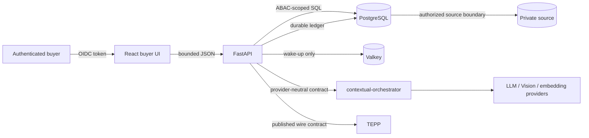
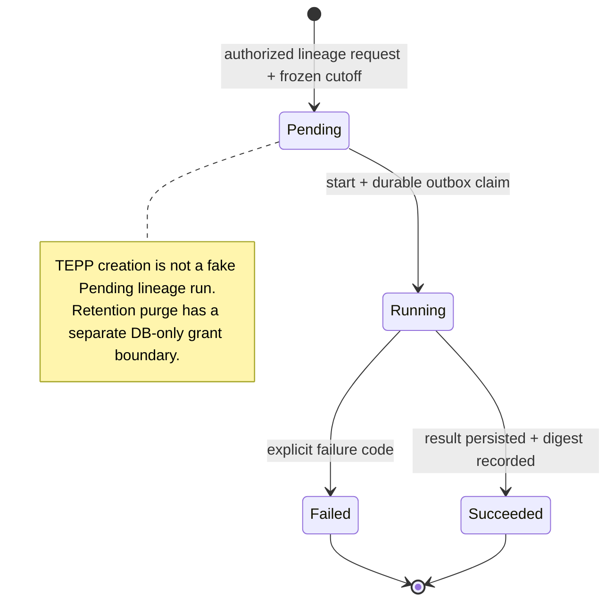
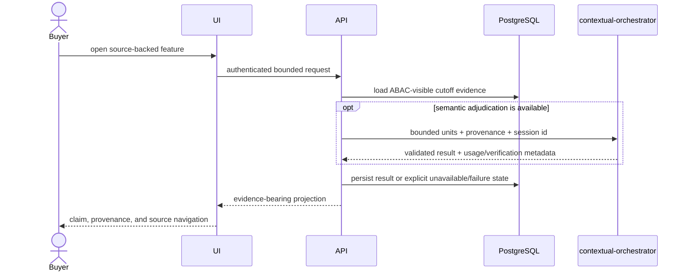

# Product, technical, and gap baseline

**Snapshot:** 2026-08-20 17:08 (Asia/Seoul)
**Protected-main baseline:** `origin/main`, product version `2.12.5`
**Audited PR head:** #258 at `bf599aca` (integrated timeout boundary, fixture fix, worker repair, and SQL review evidence)
**Active PR update:** ADR 0101 and the enrichment-timeout changes are pushed to
PR #258; protected-main runtime evidence remains pending.
**Purpose:** connect the normative ADRs and research evidence to product
requirements, technical contracts, implementation evidence, and active PRs.
An active PR is proposed work, not shipped behavior.

## Exact-head checkpoint (2026-08-20 19:14 Asia/Seoul)

The following is the current GitHub observation used for this branch. It
supersedes the historical 17:08 snapshot and does not claim protected-main
behavior. GitHub reports 24 open PRs from #190 through #309; none of the
#258-and-later stack has an independent `APPROVED` review at this checkpoint.

| PR group | Exact observed heads | Merge observation |
|---|---|---|
| #258-#266 | `#258 f8d2fa98`, `#260 dfd95d9c`, `#261 bd1b4d2f`, `#262 80445b8a`, `#263 d670acd5`, `#264 d5dbdf71`, `#266 26a6d9c6` | `BLOCKED`, review required |
| #270-#276 | `#270 c58aef89`, `#275 35035783`, `#276 55679fa2` | `BLOCKED`, review required or draft |
| #282-#287 | `#282 6eeaf89d`, `#285 cbb959ce`, `#286 65a461de`, `#287 554efb9b` | `UNSTABLE`/`UNKNOWN`/`BLOCKED`; not merge-ready |
| #298-#303 | `#298 49c9976f`, `#301 59ccdf91`, `#302 40b0a8ea`, `#303 fe0a4f26` | `UNKNOWN`/`CLEAN`/`UNSTABLE`; independent review pending |
| #306-#309 | `#306 e0dbc386`, `#307 313d38a4`, `#308 42e6230c`, `#309 e6fd907e` | `UNSTABLE`; independent review pending |

PR #285 received concurrent remote commits through `cbb959ce` while its local
Buyer wiring was under review. Those commits were incorporated with a normal
merge; no force push is permitted. The current change adds the missing API/GNB
connection, exact-input validation, source-name whitespace fallback, a shared
timeline entry point, Storybook-compatible truth rendering, and live
PostgreSQL/API regressions. The final exact head and Checks must be recorded
after the ordinary push.

## Exact-head refresh (2026-08-20 19:50 Asia/Seoul)

This refresh supersedes the 19:14 checkpoint for the PRs it names. It records
GitHub observations, not protected-main behavior. The repository has 25 open
PRs; no approval or queued Check is treated as merge evidence.

| PR | Exact observed head | Current observation |
|---|---|---|
| #258 | `f8d2fa98` | `BLOCKED`, review required |
| #260-#266 | `dfd95d9c`, `bd1b4d2f`, `80445b8a`, `d670acd5`, `d5dbdf71`, `26a6d9c6` | stacked, review required; #264 is `DIRTY` |
| #282 | `6eeaf89d` | `CLEAN`, no formal approval |
| #285 | `30dae74a` | `UNSTABLE`, exact-head Checks queued, no formal approval |
| #287 | `26fa7346` | `UNKNOWN`, review required, exact-head Checks queued |
| #298-#303 | `49c9976f`, `59ccdf91`, `40b0a8ea`, `b7e6e82d` | mixed `DIRTY`/`CLEAN`/`UNSTABLE`, review pending |
| #306-#311 | `e0dbc386`, `a4d1de59`, `42e6230c`, `e6fd907e`, `d8b7f561` | `CLEAN`/`UNSTABLE`, review pending |

The #285 exact head includes the independent review repairs for case-preserving
project identity, route-specific bounds, and sibling-project match isolation;
the local tree recorded `741 passed, 16 skipped`. The #287 exact head removes
the Semgrep dynamic-SQL findings and aligns public claim adjudication with the
contextual-orchestrator `mode=auto` strict structured contract; its local tree
recorded `791 passed, 16 skipped`. Both remain open until current-head Checks
and protected approval are observed.

The organization-owned `.github` repository already provides the hourly
commercial-readiness coordinator at cron `7 * * * *` and the review/merge
scheduler's hourly fallback. This repository does not add a competing local
timer; the central OpenCode/scheduler credential boundary remains authoritative
and `COPILOT_GITHUB_TOKEN` is not used.

## PRD

### Problem and outcome

Buyers need to turn scattered, timestamped records into reviewable branching
histories without confusing a plausible relation with a proven fact. The
product succeeds when an authorized buyer can move from an aggregate signal or
answer to its source post, lineage neighborhood, channel evidence, actor and
project context, while every derived claim retains provenance and an explicit
availability boundary.

### Users and jobs

| User | Job | Success evidence |
|---|---|---|
| Buyer | Find a relevant customer, project, event, commitment, or Keyman and inspect its history | Browser navigation reaches an authorized source-backed post and focused lineage |
| Analyst | Reconstruct a cutoff-bounded lineage and inspect why edges were selected | Persisted run, digest, edge scores, channel breakdown, and status history |
| Operator | Import, rebuild, retry, and diagnose without inventing unavailable results | Durable ledger/outbox state and explicit failed/unavailable status |
| Retention admin | Purge run-bearing evidence only under a deliberate grant | Database role plus unrevoked retention grant; no public purge route |

### Scope

In scope: authorized source import, semantic units and visual regions,
multi-channel lineage reconstruction, source-grounded ontology/provenance,
period reports, Board/Global Ask/Calendar/Customer/Keyman navigation, TEPP and
contextual-orchestrator integration, and buyer-visible evidence.

Out of scope: TEPP model reimplementation, raw provider calls, locally chosen
models, forced links for missing channels, public real-data fixtures, and
claims that an unmerged PR or historical runtime observation is live behavior.

### Product measures

- Every displayed derived claim can navigate to authorized evidence or is
  labeled unavailable.
- No relation crosses the analysis cutoff or caller ABAC boundary.
- Missing model, embedding, TEPP, Vision, or verification channels are dropped
  and weights renormalized; no placeholder score or actor is invented.
- A real-stack acceptance run covers login, PostgreSQL-backed API behavior,
  buyer navigation, and aggregate non-identifying evidence.

## Functional specification

| ID | Requirement and acceptance criterion | Normative source | Current evidence |
|---|---|---|---|
| FR-01 | Import authorized records while preserving immutable source identity, raw state, publication state, and revisions. No real record enters git. | ADR 0001, 0040, 0046, 0056-0059, 0068, 0089 | Import/reconciliation modules and migrations; private runtime evidence only |
| FR-02 | Derive paragraph/list/table/image-region semantic units without replacing the source representation. | ADR 0061, 0062, 0066, 0067, 0077, 0087, 0091 | Chunking, image-content, visual-region and embedding paths |
| FR-03 | Reconstruct backward-only candidate edges from available channels, fuse through RankWeave, apply a minimum floor, persist scores, and assemble trees through ThreadWeave. | ADR 0024, 0064, 0084 | `lineageweave/reconstruct.py`, channel clients, reconstruction tables/tests |
| FR-04 | Create, start, observe, and retain analysis runs with cutoff snapshots, append-only status, outbox delivery, authorization, and explicit failure. | ADR 0013-0023, 0025 | Backend analysis-run modules, migrations, API tests |
| FR-05 | Keep TEPP as a versioned external measurement boundary; failed or unused responses never become invented theta. | ADR 0003, 0022 | `tepp_client.py`, report and start contracts |
| FR-06 | Resolve actors, organizations, projects, roles, and relationships without collapsing ties or same-name mentions; preserve catalog identifiers on role rows. | ADR 0004-0012, 0018-0019, 0026-0027, 0036 | Summary, entity-resolution, KG and report paths/tests |
| FR-07 | Global Ask and buyer surfaces retrieve only authorized evidence and let cited results open the relevant post/lineage context. | ADR 0032, 0037, 0039, 0041-0044, 0047, 0053-0055, 0075, 0078, 0090 | Main has the earlier surfaces; PR stack #258-#301 proposes the integrated navigation/evidence flow |
| FR-08 | LLM, structured output, embedding, and Vision work crosses contextual-orchestrator with one post session and bounded provenance; provider/model/protocol selection stays upstream. | ADR 0030, 0045, 0052, 0070-0077, 0079, 0081-0088 | Orchestrator clients, Compose boundary, historical gateway observations |
| FR-09 | Period reports use real fast-mlsirm results; missing cells remain missing and leftover pairs are residual-derived and navigable. | ADR 0003, 0034-0035, 0048-0050 | Historical authenticated report rebuilds; report tests and schema |
| FR-10 | Standard provenance uses normalized PROV-O relations; qualified influence implies its unqualified relation and KG edges remain a navigation projection. | ADR 0011, 0065 | PROV-O implementation matrices, ontology, CI contract |
| FR-11 | Post summaries expose evidence-bearing events and R&R. Requester/processor actions are nullable and may only name actors already bound to the same post summary. | ADR 0052, ADR 0102 | Commit `15e1a378` is on PR #258 and the schema exists locally; the current database has zero populated action rows, so buyer-data acceptance remains unproven |
| FR-12 | A hierarchy-enrichment timeout leaves the source-grounded summary readable and the actor unbound; it never creates a guessed catalog identity. | ADR 0101, ADR 0010, ADR 0026 | Commit `1c260f20` contains the boundary, ADR, and focused test; independent review, protected-main merge, and fresh runtime evidence remain pending |

## TRD

### Runtime components and trust boundaries

- PostgreSQL is authoritative for normalized product state, run snapshots,
  provenance, status, and durable work ledgers. Valkey is not the source of
  truth.
- FastAPI applies authentication and ABAC before projecting records or edge
  endpoints. The browser receives bounded projections, not raw source bags.
- contextual-orchestrator owns provider capability discovery, reasoning
  effort, structured synthesis/repair, sessions, and cost lineage.
- ThreadWeave, RankWeave, TEPP, and fast-mlsirm are reused at their published
  boundaries; LineageWeave does not clone their algorithms.

### Analysis-run lifecycle UML

### Evidence sequence UML

### Non-functional requirements

| ID | Contract | Verification |
|---|---|---|
| NFR-01 | OIDC authentication, endpoint ABAC, no public retention purge, no repository secrets | authorization-specific API tests and Compose identity-boundary check |
| NFR-02 | Bounded row, batch, browser, image, and MCP payloads | boundary unit tests plus real-stack response-size observation |
| NFR-03 | Third-normal-form identities and provenance; database constraints enforce integrity | migration/schema tests against PostgreSQL |
| NFR-04 | Python 3.12+ project-local environment; pinned Node/pnpm and Rust toolchain; checked lockfiles | clean-environment backend/frontend builds |
| NFR-05 | Synthetic fixtures only; runtime validation returns aggregate, non-identifying evidence | repository scan and evidence-document review |
| NFR-06 | ADR-first architectural change and paper-grounded model policy | ADR link check and review; unsupported policies remain unavailable |

## Current aggregate data and runtime evidence

Observed from the running local Compose stack without selecting a post title,
body, source code, person, organization, or identifier:

| Evidence | Observed result |
|---|---|
| Stack availability | PostgreSQL, Valkey, and contextual-orchestrator healthy; backend and frontend running; backend `/healthz` and frontend `/` returned HTTP 200 |
| Source boundary | 43,839 source posts: 43,814 have both source-system and source-record identity; 25 lack that import identity |
| Source state/body | 43,814 rows carry source-state evidence; 43,438 rows have a non-empty body; 87,297 source revisions persist |
| Derived content | 562,394 semantic units, 1,308 live lineage edges, 48 KG navigation edges, and 95 persisted summaries |
| Run registry | Three runs: one lineage, one report, one TEPP; latest states are two Succeeded and one Failed |
| Run evidence | One snapshot with 42,577 members; one persisted reconstruction with 1,281 edges; zero persisted TEPP results |
| Requester/processor | `post_summary_action` exists with composite actor foreign keys; one authorized target refresh stored three action rows |
| Summary refresh | One authorized target request returned HTTP 200 with contract v5, four key events, one role, three actions, and one project |
| Authentication | Real synthetic-user OIDC login, live JWKS fetch, and RS256 verification passed |
| Authorization | Unauthenticated `/api/analysis-runs` and `/api/posts` returned 401; four focused live-Keycloak/PostgreSQL API tests covering authenticated account, list ABAC, direct deny, and missing token passed |
| Focused contracts | Post-summary and transaction-contract tests: 31 passed, 1 skipped; the skip is not runtime proof for the skipped capability |

These observations prove data presence and the listed boundaries only. They do
not prove a browser-clicked buyer journey, current TEPP transport success,
post-summary-action population across the corpus, or equivalence between every
running container image and the PR head. The target refresh is bounded runtime
evidence for one authorized post, not a corpus-wide acceptance claim.

## Active PR audit

GitHub reported 18 open PRs at the snapshot: all were marked Ready and 8
required review; merge state was 8 `BLOCKED`, 8 `UNSTABLE`, and 2 `DIRTY`.
Queued checks and review gates mean none of these rows is protected-main truth.

| PR | Proposed increment | Base → head | Snapshot state |
|---|---|---|---|
| #301 | Global Ask knowledge cutoff | `#264 stack` → `v2.23.0` | Ready / UNSTABLE |
| #298 | bounded async lineage LLM rebuild | `#276` → `v2.22.0` | Ready / UNSTABLE |
| #287 | exact Event Lineage channel evidence | `#276` → feature | Ready / UNSTABLE |
| #286 | exact byte-bounded MCP browser admission | `#270` → fix | Ready / UNSTABLE |
| #285 | project lifecycle timeline | `#264 stack` → `v2.18.4` | Ready / UNSTABLE |
| #284 | authoritative project lifecycle ingestion | `#285 stack` → proposed 0054 writer boundary | Implementation on stacked PR; not protected-main |
| #282 | TEPP project history in read/Ask | `#264 stack` → `v2.18.0` | Ready / UNSTABLE |
| #276 | public verification of Global Ask claims | `#266` → `v2.20.0` | Ready / UNSTABLE |
| #275 | evidence-bound Event Intelligence | `#270` → `v2.18.3` | Ready / UNSTABLE |
| #270 | authenticated MCP Global Ask | `main` → feature | Ready / BLOCKED / review required |
| #266 | Event Lineage to Keyman focus | `#264` → `v2.19.0` | Ready / BLOCKED / review required |
| #264 | keep Event Lineage DAG focus | `#263` → `v2.17.0` | Ready / BLOCKED / review required |
| #263 | Ask citation to Event Lineage | `#262` → `v2.16.0` | Ready / BLOCKED / review required |
| #262 | Customer post to Event Lineage | `#261` → `v2.15.0` | Ready / BLOCKED / review required |
| #261 | Calendar commitment to Event Lineage | `#260` → `v2.14.0` | Ready / BLOCKED / review required |
| #260 | Weekly VOC to Event Lineage | `#258` → `v2.13.0` | Ready / DIRTY / review required |
| #258 | buyer evidence board and ontology surface | `main` → feature | Ready / BLOCKED |
| #192 | plural affiliation next action | `main` → `v0.77.0` | Ready / DIRTY / review required |
| #190 | duplicate-numbered entity-resolution ADR | `main` → docs | Ready / BLOCKED |

The dominant delivery topology is a long dependent stack rooted at #258 and
then #260-#266. Parallel descendants (#275, #282, #285, #276-#301) are based
on intermediate heads rather than one integration head. Green checks on a
child do not prove that the stack is mergeable or that the behavior exists on
main.

Manual triage of #258's four unresolved scanner threads found literal SQL in
`entity_relationship_ingestion.py` and `demo_scope.py`; request-derived entity
ids are passed as `$1` arguments rather than interpolated. This is evidence for
a likely narrow false-positive suppression, not authority to dismiss the
findings: the required security workflow and independent reviewer must accept
the exact-head disposition.

## Gap register

| Priority | Gap | Evidence | Closure criterion |
|---|---|---|---|
| P0 | No protected-main integrated buyer journey for the active feature stack | Main is 2.12.5; 18 open PRs span dependent and parallel bases | Establish one reviewed integration order, update each exact head, pass required checks, merge without bypass, then run login-to-source browser acceptance on main |
| P0 | Current runtime proof is incomplete | The current aggregate/OIDC/ABAC checks cover data presence and selected boundaries; 2026-08-18/19 notes cover other slices, but no evidence set proves the entire PR head or main journey | Complete the real-stack matrix on an exact revision: browser login/navigation, Ask, reports, Vision, TEPP availability, action population, and cleanup |
| P0 | PR #190's duplicate ADR identity was corrected but is not protected-main truth | Active PR head `ac1b4e17` now uses ADR 0038 and aligns the entity-resolution claims with implementation; independent review and Checks remain pending | Re-audit exact head, obtain independent approval, pass required Checks, and merge normally; never merge a duplicate ADR identity |
| P0 | PR #258 is not review/CI complete at its exact current head | #258 is mergeable but BLOCKED: 14 of 22 checks queued, no approval, and four unresolved scanner threads on two SQL modules | Classify each finding against the literal SQL and bound arguments; fix a real flow or add a narrow documented suppression for a false positive, resolve threads, obtain independent approval, and re-check the exact head |
| P1 | Requirements were implicit across ADRs and architecture phases | No prior PRD/TRD/requirement traceability baseline existed | Keep FR/NFR IDs in this document linked from ADR index; require new product PRs to name affected IDs and runtime evidence |
| P1 | Active PR topology obscures release truth | 8 blocked, 8 unstable, and 2 dirty; many bases are other open branches | Publish a dependency order, retire obsolete/duplicate branches, and avoid version claims until their base chain reaches main |
| P1 | ADR 0102 schema exists but current data does not exercise it | Commit `15e1a378` is on PR #258 and the table exists, but 95 summaries yield zero requester/processor action rows | Regenerate an authorized bounded sample, report aggregate accepted/dropped/absent counts, verify source evidence and actor FKs, then exercise the buyer popup without exposing record content |
| P1 | ADR 0101 is active-PR behavior but not protected-main behavior | Commit `1c260f20` contains the corrected ADR link, boundary, and focused tests; independent review and protected-main merge remain pending | Re-audit the exact head, obtain independent approval, pass required checks, merge normally, and collect fresh runtime evidence |
| P1 | ADR status vocabulary is inconsistent and sometimes stale | Several ADRs say “Accepted on this active PR; not protected-main truth” even after branch evolution | Add a mechanical ADR status/link audit that distinguishes Proposed, Accepted-on-PR, Accepted-on-main, and Superseded |
| P2 | ADR numbering skips 0031 and 0093-0097 while file 0092 titles itself ADR 0031 | File identity and displayed identity differ | Correct the 0092 title or document an intentional alias; reserve or explain skipped numbers in the index |
| P2 | Product measures lack explicit targets | Research supports evidence boundaries but not universal model-quality thresholds | Define targets only from an approved evaluation protocol and authorized labeled aggregate dataset; do not invent accuracy goals |
| P2 | UML covers core trust/lifecycle flow but not every buyer navigation branch | Architecture and PR stack evolve faster than diagrams | Add diagrams only when a stable main integration makes a flow materially distinct; keep this baseline small |

## Verification matrix

| Scope | Evidence available now | Claim allowed now | Missing proof |
|---|---|---|---|
| Protected main | `origin/main` manifests show 2.12.5 | Existing main contracts only | Fresh main runtime matrix |
| Historical local runtime | Authenticated PostgreSQL report rebuilds and orchestrator/Vision observations dated 2026-08-18/19 | Those exact bounded observations | Current head/main equivalence and full browser journey |
| Active PRs | GitHub head/base, review, merge, check, and review-thread states at snapshot | Proposed increments and gate state | Normal merge and post-merge runtime behavior |
| Local PR checkout | PR #258 was observed at `bf599aca`; full suite passed and one authorized target summary refresh returned v5/HTTP 200 with persisted actions | Only the exact observations in the current-data table; no claim for protected-main behavior | Full suite/CI, browser journey, external channel results, review, merge, and corpus-level action evidence |

## Maintenance rule

ADRs remain normative. This document is the product/technical traceability
projection: update the affected FR/NFR row and Gap closure evidence when an ADR
or PR changes product behavior. Never turn a PR title, green unit test, or old
runtime note into a shipped/live claim.
