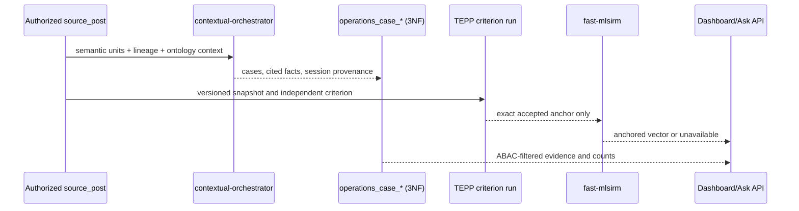

# Product & Technical Gap Baseline

## Current development audit — 2026-09-08

This snapshot supersedes earlier queue and completion claims below. ADRs are
normative; PRDs describe product acceptance; research references support only
their stated decisions. Candidate code, local tests, authenticated runtime,
and protected-main delivery are separate evidence classes. No new research,
weight, estimator, failure-detector ratio, or population inference is claimed.

Protected `main`: `83eba56149eb802cd63642c507c324c9976ec78e`.
The paginated live inventory contains **139 open PRs: 17 Ready and 122 Draft**,
plus **22 open issues**. No inspected Ready head has a qualifying current-head
APPROVE. Required organization rules demand one independent approval, stale
review dismissal, resolved review threads, and seven central review/security
workflows. Existing auto-merge is not a merge SHA or release result.

### Selected buyer gap and ownership

Ask can keep its controls disabled forever when a status response says
`succeeded` but omits the answer, or returns an unknown/missing state. This
cycle prioritizes restoring an actionable screen over a new feature: the
broken path prevents the requester from completing the current question.
This is a delivery judgment, not a measured ranking of all product gaps.

The correction extends the existing #972 owner branch from
`40742bcf48858c22ee9726693669391836b9a5ad`, under the Proposed client-observation
amendment to ADR 0039. Only `queued` and `running` continue observation.
Missing completion evidence stops client polling and shows existing localized
recovery copy; it does not mark the server job failed or submit another job.
A failed response no longer propagates its diagnostic detail as a client error.
Cancellation, authorization generations, cutoff, and valid late answers stay
under the same existing contracts. There is no new API, migration, dependency,
release number, model selection, or arithmetic implementation.

Six synthetic RED cases reproduced four non-settling observations, leaked
failure detail, and a null-response TypeError. The API suite then passed 19
tests. The integrated API/panel run still failed because the panel fork did not
start; a separate unchanged panel run also timed out before collecting tests.
Neither failure is erased by the API pass. A threads-pool diagnostic then
collected all nine panel cases: seven passed and two exceeded the unchanged
five-second test deadline (the new missing-answer case and the existing cutoff
case). This is a local failure, not an established environmental root cause.
Build and rendered evidence remain pending at this documentation preparation point.

### Authority and canonical identity

Read before implementation: LineageWeave `docs/product-requirements.md`, ADR
0039 and ADRs 0204/0213/0246/0251, plus the linked owner
`contextual-orchestrator/docs/product_planning.md` and `docs/architecture.md`.
Remote repository metadata confirms `ContextualWisdomLab/LineageWeave`,
`RankWeave`, `ThreadWeave`, `TEPP`, and `contextual-orchestrator`. The actual
storage repository is **`ContextualWisdomLab/disksage`**, not `DiskSage`; the
PRD register has a case mismatch. Preserve the #847 PRD-authority owner while
converging that register. No DiskSage runtime integration is inferred.

The twelve atomic Voice concepts remain ADR 0246 vocabulary. In the inspected
tree, ADR 0251 names the FJA I/O psychology layer; the explicit Voice combination
and temporal history contracts are ADR 0256 and ADR 0252 on #780. Preserve the
user-required extensible atomic composition, evidence-bearing PROV derivation,
truth state, cutoff, distinct carrying/evidence actions, and paged JSON-LD
subject-property union. Do not infer equivalence between these differently
named ADRs. This Ask correction does not establish Voice API/UI acceptance.

### Exact Ready-head inventory

Check summaries below were read for the listed heads. Failed and queued jobs
remain distinct; no older run or review is accepted as current success.

| PR | Exact head | Base | Check observations |
| --- | --- | --- | --- |
| #984 | `e52a63adcc46985a36d23f2ab85757f8e956f895` | `main` | in_progress: 1, queued: 10, skipped: 2, success: 4 |
| #983 | `3b0b5d76d9e0a90c255df740437fee991d0de7cd` | `main` | failure: 1, in_progress: 1, queued: 10, skipped: 2, success: 3 |
| #979 | `6662ea5df6f8f026b54a083677d3e0ee98d2d6d2` | `codex/ask-timeout-attribution-20260907` | success: 2 |
| #974 | `def15fc691d4442c0d82103c1642147b1528d7be` | `main` | cancelled: 1, failure: 5, skipped: 5, success: 24 |
| #973 | `182d3c9d4c5f2a8ab2d63e77b8a9ced663a183f6` | `main` | failure: 7, skipped: 9, success: 28 |
| #972 | `40742bcf48858c22ee9726693669391836b9a5ad` | `main` | failure: 5, skipped: 7, success: 25 |
| #970 | `50807d1e7484fd0aa65bdbf6af015bbe8d739d80` | `main` | failure: 6, skipped: 9, success: 29 |
| #969 | `583157c5d007d4903a78b2e30c0caac224f6460e` | `main` | failure: 6, skipped: 7, success: 24 |
| #966 | `f749fb2714fef5975ba042f9356c10a120f671ac` | `main` | queued: 9, skipped: 5, success: 16 |
| #964 | `1cced397600b15258b36e221a33beb62c4cca4cd` | `main` | failure: 6, skipped: 5, success: 24 |
| #961 | `3bdec0504a65e63f44bd49ba15de37182a1672cc` | `main` | failure: 5, skipped: 9, success: 23 |
| #959 | `96ce3de6190f1f66f140663f034427fd4d78d3a4` | `main` | failure: 6, skipped: 7, success: 24 |
| #929 | `0f4fd26a5f0fcf26932d0945188aefb2143d6605` | `main` | failure: 7, skipped: 4, success: 29 |
| #914 | `61ed3a3712d252e3c179a71d297c52f05e1bac20` | `main` | failure: 5, skipped: 7, success: 25 |
| #911 | `5d40eed35a0b6e0d182397f8d02b29c38e9bdd17` | `main` | failure: 7, skipped: 5, success: 28 |
| #802 | `32f1cda10a2a1a6cabd64a3ae6f59bd6f0b20fd6` | `main` | failure: 7, skipped: 4, success: 28 |
| #780 | `1d8fa267b059289e77301a09985dfac70a439814` | `main` | cancelled: 5, failure: 4, skipped: 11, success: 17 |

### Collision and stack audit

Changed-file inventories were collected for all 139 PRs. Seventeen ADR
numbers map to different filenames across those diffs; these are collision
candidates, not seventeen adjudicated semantic conflicts. No different-name
migration-number collision appeared in these diffs; this does not certify
full historical schema compatibility. Competing ADR decisions need normative
comparison and owner-order convergence before merge.

| ADR number | Owning PR candidates |
| --- | --- |
| 0233 | #672, #811 |
| 0245 | #702, #847 |
| 0272 | #802, #850, #888 |
| 0279 | #811, #857, #888 |
| 0290 | #821, #846 |
| 0291 | #822, #848 |
| 0292 | #823, #849 |
| 0293 | #824, #850 |
| 0294 | #825, #851 |
| 0295 | #826, #852 |
| 0296 | #827, #831, #853 |
| 0297 | #832, #833, #854 |
| 0300 | #837, #857, #899 |
| 0301 | #838, #902 |
| 0305 | #843, #844, #845 |
| 0335 | #876, #877, #878, #891 |
| 0355 | #915, #920 |

Ready overlaps include `backend/app/main.py` (#979/#974/#929/#914/#911/#780),
`frontend/src/App.tsx` (#972/#969), `.github/workflows/tests.yml` (#983/#911),
and dependency manifests (#973/#970/#929/#911/#802). #961 repairs the existing
2.28 runtime identity while #802 advances the report release; inherited
manifest values cannot decide release order. Full API/schema/release merge
compatibility remains unverified until exact bases and heads converge.

#979 stays based on #974; #932 stays on #929. Merge parents through protected
main first, then retarget children and recollect evidence. #983 already contains
its reviewed authorization-URL recheck; #911 already contains commit/rollback
SQLSTATE translation. Do not duplicate those corrections. The two observed
in-progress runs belonged to #984 and #983 at their current heads; neither
was stale, and neither was cancelled. No CI stall was manually cleared.

### Current runtime boundary

The formal Compose project label is `lineageweave`. The live backend image
declares revision `c47cabed2c2a85d5a3dae2d7d5fb512a04720f18`, which is not the
candidate or current protected main. A real synthetic-account token admitted
`GET /api/me`; this proves authentication for that existing runtime only.
A direct current SQL count observed 43,189 Posts without retrieving identities
or source content. It is a database count, not a probability sample or a
population inference. The authorized workload has not been proved to contain
only synthetic Posts, so the general k6 Ask/read harness was not run against
this mixed-data runtime. Concurrency, latency, error rate, throughput, and
PostgreSQL/worker/Valkey/gateway saturation are **unverified in this cycle**.
Do not change capacity or timeout settings without that evidence.

Fresh authenticated PostgreSQL Ask and Voice acceptance, candidate deployment,
full-suite success, independent approval, protected merge, and release remain
unavailable. #922 eight-locale publication and Customer Master cutover remain
with #929/#932; #983 retains its observed 100% coverage failure (lines 82.48%,
branches 78.63%) without weakened thresholds. UI recovery screenshots alone
will not complete any authenticated runtime acceptance.

---

## Earlier snapshots (historical only)

> Exact-head loop overlay: 2026-08-29 13:20 KST. Protected `main` is
> `fc13acaa20adca11968238e398d4aafcf62b6cee` (v2.23.0 leftover-map
> explained leftover share, #775). Open ready PRs still lack independent
> APPROVE. #782 leftover-map coordinates + graphic + axis share + ticks
> (v2.24.0–v2.27.0 / ADR 0267–0270) is on
> `2a203bf8b75b987ba899a0006a312d81259b9124` after #799 squash-merged
> into the unprotected leftover branch. Auto-merge squash remains armed
> on #782/#780/#774/#772/#771/#770. Independent APPROVE is still
> required for protected main. Drafts remain dirty against `main`. #96
> stays closed as a weaker duplicate of #91. GitHub writes through
> `gh`/MCP succeed. Copilot review is not independent APPROVE. Do not
> self-approve. Do not `gh pr merge` stacked leftover PRs onto an
> unprotected leftover base.
>
> Next buyer increment on this cycle: leftover-map distance on
> graphic-display pair segments (ADR 0271 / v2.28.0). Caption each
> closest/farthest segment with persisted leftover-map distance `d` so
> the pair-row badge matches the graphic line. UI-only; no new columns.
> Missing/non-finite `d` omits that segment caption. Do not invent `d`
> from plotted coordinates. Do not invent leftover scores. Stack onto
> leftover branch `feat/leftover-map-coordinates-v2240`; leave the PR
> open for independent review.

> Exact-head loop overlay: 2026-08-29 13:15 KST. Protected `main` is
> `fc13acaa20adca11968238e398d4aafcf62b6cee` (v2.23.0 leftover-map
> explained leftover share, #775). Open ready PRs still lack independent
> APPROVE. #782 leftover-map coordinates + graphic display + axis share
> (v2.24.0 / v2.25.0 / v2.26.0 / ADR 0267 / ADR 0268 / ADR 0269) is on
> `4a0afbf4804d9862bba58869db20ccdfb0a0b37e`; Strix fail-closed and no
> independent APPROVE. Auto-merge squash remains armed on
> #782/#780/#774/#772/#771/#770. Drafts remain dirty against `main`.
> #96 stays closed as a weaker duplicate of #91. GitHub writes through
> `gh`/MCP succeed (comment/create-branch/auto-merge). `git push` HTTPS
> still fails (empty `X-OAuth-Scopes`). Copilot review is not
> independent APPROVE. Do not self-approve.
>
> Next buyer increment on this cycle: leftover-map coordinate ticks
> (ADR 0270 / v2.27.0). Tick leftover-map axes at the origin and at each
> unique finite persisted `ξ` / `ζ` so pair-row `ξ (x, y) ζ (x, y)`
> matches the graphic. UI-only; no new columns. Rank-0 unused axes name
> only `0` and do not invent drawing-scale `−1` / `+1` ticks. Do not
> invent leftover scores. Do not mix into #782; stack onto leftover
> branch `feat/leftover-map-coordinates-v2240`.

> Exact-head loop overlay: 2026-08-28 19:15 KST. Protected `main` is
> `fc13acaa20adca11968238e398d4aafcf62b6cee` (v2.23.0 leftover-map
> explained leftover share, #775). Open ready PRs still lack independent
> APPROVE. #782 leftover-map coordinates + graphic display (v2.24.0 /
> v2.25.0 / ADR 0267 / ADR 0268) is on
> `2f7e9c8df695f12d03964d5caa68fa3355bdd923`; Strix fail-closed and no
> independent APPROVE. Drafts remain dirty against `main`. #96 stays
> closed as a weaker duplicate of #91. GitHub writes through MCP succeed
> (comment/create-branch/git push/auto-merge). Copilot review is not
> independent APPROVE. Do not self-approve.
>
> Next buyer increment on this cycle: leftover-map axis share on the
> graphic display (ADR 0269 / v2.26.0). Caption plot axes with persisted
> ADR 0148 `leftover_map_axes` inertia `σ_k² / Σ_j σ_j²`. UI-only; no
> new columns. Rank-0 zero-share axes still named. Missing/non-finite
> share omits that axis badge and keeps existing leftover-map axis
> text. Do not invent leftover scores. Do not mix into dashboard stacks
> #640/#778/#781.

> Exact-head loop overlay: 2026-08-28 16:05 KST. Protected `main` is
> `fc13acaa20adca11968238e398d4aafcf62b6cee` (v2.23.0 leftover-map
> explained leftover share, #775). Open ready PRs still lack independent
> APPROVE. #782 leftover-map coordinates (v2.24.0 / ADR 0267) is on
> `e2d13019004a5d8c019fecf7a39ceeef4093b8dd`; Strix fail-closed and no
> independent APPROVE. Drafts remain dirty against `main`. #96 stays
> closed as a weaker duplicate of #91. GitHub writes through MCP succeed.
>
> Next buyer increment on this cycle: leftover-map graphic display
> of already-persisted `ξ_{1:2}` / `ζ_{1:2}` (ADR 0268 / v2.25.0).
> UI-only; no new columns. `R̂` and `d` already are inner product and
> length. Do not invent leftover scores. Do not mix into dashboard
> stacks #640/#778/#781.

> Exact-head loop overlay: 2026-08-28 13:00 KST. Protected `main` is
> `fc13acaa20adca11968238e398d4aafcf62b6cee` (v2.23.0 leftover-map
> explained leftover share, #775). Open ready PRs still lack independent
> APPROVE. Drafts remain dirty against `main`. #96 stays closed as a
> weaker duplicate of #91. GitHub writes through `gh` succeed.
>
> Next buyer increment on this cycle: leftover-map coordinates
> `ξ_{1:2}` / `ζ_{1:2}` (ADR 0267 / migration 0245 / v2.24.0) so
> `R̂ = ξ · ζ` and `d = ‖ξ − ζ‖` are buyer-auditable. Do not name
> leftover-map inner product, cosine, or length as separate columns.

> Exact-head loop overlay: 2026-08-28 10:00 KST. Protected `main` was
> `edf22ee39aee2a8481f9bda8fff59801821e79c2` (#773 similar-VOC coverage).
> Open ready PRs: #772 (ask_time_axis coverage), #771 (fixtures/vision
> coverage), #770 (project-history empty-state). Auto-merge squash is
> enabled on all three; none has an independent APPROVE (only bot
> COMMENT). Drafts #702, #679, #672, #667, #640 remain dirty against
> `main`. #96 stays closed as a weaker duplicate of #91. Writes through
> the Grok GitHub App now succeed (comment/close/auto-merge/update-branch)
> despite empty `X-OAuth-Scopes`; git push is the remaining probe this
> cycle. This overlay supersedes every older queue count below.
>
> Next buyer increment on this cycle: leftover-map explained leftover
> share `e = R̂² / R²` (ADR 0266 / migration 0244 / v2.23.0) so
> `e + s + x = 1` is buyer-auditable. Do not persist leftover-map
> coordinates in this slice.

> Exact-head loop overlay: 2026-08-28 KST. Protected `main` was
> `bbb191924e9881a5201f1ecf63c854d92992cc1c`; seven PRs and nine issues were
> open. PR #763 was `b51d3bd8872b` and PR #762 was `e6ca33dba1b5`; both were
> mergeable, normal squash auto-merge was enabled, exact-head Checks were still
> running, and no qualifying independent approval existed. PRs #702
> (`93e7b81d096d`), #679 (`135dfe7c4266`), #672 (`a3e87a89185f`), #667
> (`0c0f4af572a9`), and #640 (`bd73e0a43ae1`) remained draft and dirty against
> `main`. Central ruleset 18156473 and repository no-force-push ruleset
> 21065108 remain active. This overlay supersedes every older queue count below.
> Checks from older heads, stacked bases, or merged PRs are not transferred.
>
> Current-runtime boundary: the official Compose project was healthy at the
> HTTP health route, but its PostgreSQL schema did not yet contain
> `source_post_voice`; therefore no current Voice-history aggregate,
> authenticated project-history API result, or rendered authenticated UI result
> is claimed. Older aggregate observations below remain dated supporting
> evidence, not confirmation of this exact head. The checked repository names
> are `ContextualWisdomLab/LineageWeave`, `RankWeave`, `ThreadWeave`, `TEPP`,
> and lowercase canonical `ContextualWisdomLab/disksage`.

> Voice-of-X delivery snapshot: 2026-08-27 KST. Protected `main` was
> `ff7431bd1851c03e737808d22c6a2d43968582f9`; PR #713 was
> `850494c3861703862a76cfe564381a41243c6c2d`; stacked PR #717 was
> audited at implementation head
> `d5fe4828e9005f0157c308e8ea3c3a590cdf465b`. This candidate and the
> historical evidence below are not protected-main release evidence.
> Loop snapshot: 2026-08-27. Protected `main` advanced through the
> I/O-Psychology job-family and occupational-classification delivery: PRs
> #709 (DOT/FJA worker functions, ADR 0232), #718 (evidence-bound construct
> classes, ADR 0248), +#726 (catalog-bound construct extraction, ADR 0253),
> #733 (construct evidence navigation, ADR 0255), #713 (Voice-of-X ADR 0246),
> #753 (FJA I/O-Psychology semantic layer, ADR 0251), #751 (SOC/O*NET/RIASEC
> taxonomy, ADR 0245), #749 (authorized job-family and job-series snapshot
> import, ADR 0263), #657 (TEPP lifecycle evidence), #704, #720, and #754 are
> now merged. The still-open queue is carried in section 1. No row below is
> release evidence until re-verified on a specific head.

## Voice-of-X product and technical gap

ADR 0246 and PR #713 add Supplier, Employee, Business, Regulator, Investor,
Society, and Process to the original Customer, Customer's Customer,
Competitor, Market, and Partner source-post vocabulary. The migration,
published SKOS concepts, product requirements, changelog, and ontology
round-trip tests agree on the twelve codes. The design is organization-type
neutral: public bodies, nonprofits, communities, and automated processes do
not need to be forced into a B2B2C customer chain.

The phrase "all Voice-of-X combinations" does not have a standards-backed
finite enumeration. ISO's own stakeholder-category guidance says that the
relevant category set varies by committee and subject; ISO 26000 requires
stakeholder identification and engagement across organizational contexts;
AA1000SES requires an inclusive, continuing identification process; and
Mitchell, Agle, and Wood (1997) model stakeholder salience from combinations
of power, legitimacy, and urgency rather than a fixed industry-role list.
Accordingly, ADR 0246 keeps the controlled vocabulary extensible and refuses
keyword inference, defaults, invented weights, or an asserted exhaustive
cross-product.

ADR 0256 and migration 0237 now define the persistence contract for
evidence-bearing composition. A post keeps one source-provided
`voc_type_code`, mirrored as its sole primary association, while every
additional voice requires a normalized PROV-O assertion and explicit truth
status. Half-open assignment intervals preserve a backfilled primary at
historical cutoffs, close a replaced primary without deleting it, and permit a
later return to the same Voice. The #717 candidate therefore addresses #748's
A → B → A storage root cause without adding Cartesian-product codes. Protected
delivery and synthetic PostgreSQL concurrency/cutoff evidence remain required.
The remaining acceptance boundary is:

1. preserve the imported primary voice without reclassification (implemented
   in the candidate migration; migration 0237 replayed twice successfully on
   an isolated PostgreSQL stack on 2026-08-27, including both primary-sync
   triggers; a synthetic real-OIDC PostgreSQL API write also proved that the
   imported primary remains unchanged);
2. record each additional voice with its own source/evidence and truth state
   (schema-enforced and candidate `post_admin` API plus live Post-popup
   authoring implemented; synthetic authenticated PostgreSQL integration
   proved denial before permission, the authorized write, and its normalized
   PROV-O derivation on 2026-08-27);
3. keeps post voice distinct from named-counterparty relationship, actor role,
   topic, channel, lifecycle, and stakeholder-salience attributes;
4. return only authorized associations through API, JSON-LD, CSV, filters,
   and UI (candidate API list/detail, filters, combined post-card labels,
   qualified JSON-LD, exact-value CSV, SHACL, and source-post evidence
   navigation implemented; the board re-filter matches every associated voice
   and all twelve governed atomic labels are localized across English, Korean,
   Chinese, Japanese, and Vietnamese; one bounded query projects assignments
   for every authorized Post even when another node type is the focus; post
   detail lists primary and evidence-connected perspectives separately and
   honors its knowledge cutoff; client-side JSON-LD filtering retains only
   exact canonical repository-case node and Voice-assignment IRIs rather than
   accepting cross-origin suffix matches; the exact-value row exposes distinct
   carrying-Post and authorized derivation-evidence actions, while hidden
   evidence emits neither an identifier nor a fabricated evidence count;
   paged JSON-LD merges properties for one subject and unions its multi-Voice
   relation rather than overwriting an earlier page); and
5. proves zero-, one-, and multi-voice states with synthetic fixtures,
   migration replay, ontology/SHACL, API, accessibility, and Storybook edge
   tests before any release claim. The candidate `CombinedVoiceEvidence` scene
   covers primary-plus-additional assignments; desktop and mobile screenshots
   were inspected on 2026-08-27. At 390 CSS pixels the document did not
   overflow, the named exact-value region remained horizontally scrollable,
   and the source-post evidence action remained visible and labeled. The
   `Post/Recorded perspectives` desktop and 390-pixel scenes were also inspected
   on 2026-08-27; both kept each complete Voice label paired with its imported
   or evidence-connected state without clipping or horizontal overflow. The
   `Post/Connect perspective` ready/success scenes were inspected at 1440 and
   390 CSS pixels on 2026-08-27: labels stay above controls, the mobile form is
   a single column, controls meet the 44-pixel touch target, and no horizontal
   overflow was visible.

At this snapshot the repository had 42 open PRs and 11 open issues. PR #713
head `850494c3` includes the review-driven localization of all twelve governed
Voice labels. Its frontend, ontology publication, static-analysis, dependency,
coverage, full-suite, CodeRabbit, Devin, and OpenCode checks passed. Strix
failed closed before producing a vulnerability report:
the primary NVIDIA NIM model returned HTTP 429, one configured fallback had
reached end of life, and the OpenAI fallback reported exhausted credits. A
same-head retry completed on 2026-08-27 with the explicit
`STRIX_PROVIDER_UNAVAILABLE` annotation and again produced no vulnerability
report. This
is provider/control-plane unavailability, not a vulnerability result or
permission to transfer an older success. Auto-merge remains enabled, while an
independent approval is still required. PR #717 implementation head
`d5fe4828` merges that
parent change without force-pushing and separates the complete governed Voice
catalog used for authoring from usage-derived Board filters, so an authorized
administrator can attach a Voice that no visible Post carries yet. It also
labels Voice exact-value navigation as opening the carrying Post rather than
misrepresenting that Post as the separately recorded derivation evidence. Its
CodeRabbit and hosted Frontend/Storybook checks passed at predecessor head
`ebb4ef1d`; refreshed checks for exact head `d5fe4828` were queued. Focused local
backend tests, frontend type checking/lint, and the new unused-Voice authoring
regression passed, and the exact-value navigation tests, lint, and type check
passed after the label repair. The paged JSON-LD union regression and Voice
evidence navigation suite passed 23 focused frontend tests; 48 focused backend
ontology/docstring tests also passed. The full backend suite at predecessor
head `ebb4ef1d` passed 1,366 tests with 148 environment-dependent skips. The
real-integration fixture now applies
the existing migration 0042 before the expanded taxonomy migrations instead
of seeding an incomplete or duplicate legacy catalog; the exact
`d5fe4828` authenticated post-list integration passed in 91.54 seconds. The
wider local frontend run had 400 passes and eight five-second timeouts under
concurrent backend-suite load; a later App-only run had 94 passes and five
five-second timeouts, while the hosted Frontend/Storybook job passed on
`ebb4ef1d`. Neither local timeout run is promoted to full-suite success. An initial
authenticated integration attempt was unavailable while Keycloak initialized;
a later retry against the shared synthetic stack succeeded in 56.18 seconds
and proved the permission, API, PostgreSQL,
PROV-O, and primary-preservation assertions; no identifying source data was
used or retained. No self-approval, admin bypass, or stale-head check transfer
is permitted.

Stacked PR #717 carries ADR 0256, migration 0237, qualified
ontology terms, persistence/API/UI tests, and the category-validation review
repairs plus a local candidate admin write path that creates its PROV-O
derivation from an authorized evidence Post. Its JSON-LD projection names that
evidence Post only when it is in the authorized visible set and omits the whole
additional assignment otherwise, preserving the SHACL evidence minimum without
substituting the assigned Post. It targets
#713's branch, not protected `main`;
its checks and review are candidate evidence only. After
#713 reaches protected main, #717 must be synchronized, retargeted to `main`,
and revalidated on its then-current head.

Downstream Dashboard repair PR #737 exact head `a837ee5d` is stacked on base
`7c7bb2cf`, which contains migration 0235 through a non-#713 composition but
does not contain #713's twelve-label locale update. Its added Voice labels are
therefore necessary on that exact base, yet overlap #713 and must be reconciled
when the stack is eventually rebuilt on protected `main`; neither branch is a
second taxonomy authority, and pre-parent Checks cannot transfer across that
restack.
The remaining user-visible gap is evidence-bearing composition. A post still
has one source-provided `voc_type_code`; the product cannot yet represent a
single record that intentionally carries multiple independently evidenced
voices, nor expose the combination in filters, exports, or the ontology
neighborhood. Do not solve this by adding every Cartesian-product code. The
acceptance boundary for a later ADR is a normalized, provenance-bearing
multi-voice association that:

1. preserves the imported primary voice without reclassification;
2. records each additional voice with its own source/evidence and truth state;
3. keeps post voice distinct from named-counterparty relationship, actor role,
   topic, channel, lifecycle, and stakeholder-salience attributes;
4. returns only authorized associations through API, JSON-LD, CSV, filters,
   and UI; and
5. proves zero-, one-, and multi-voice states with synthetic fixtures,
   migration replay, ontology/SHACL, API, accessibility, and Storybook edge
   tests before any release claim.

At this snapshot the repository had 23 open PRs and 10 open issues. PR #713
was `MERGEABLE` but policy-blocked: exact-head backend, frontend, CodeQL,
ontology-publication, Semgrep, OSV, Trivy, Scorecard, Noema, Devin, and
CodeRabbit checks were successful; `coverage-source-tree` was queued; Strix
failed closed with `STRIX_PROVIDER_UNAVAILABLE`; and an independent approval
was still required. Auto-merge remains enabled. No self-approval, admin bypass,
or stale-head check transfer is permitted.

References for this gap use the APA 7 entries in ADR 0246. Current supporting
standards pages were rechecked on 2026-08-27: ISO 26000:2010 remains applicable
to all organization types and AA1000SES v3 is under development for a planned
2027 release, so the repository continues to cite the published AA1000SES
(2015) contract rather than treating the draft as adopted policy.

> Current queue overlay: 2026-08-27 KST. Protected `main` was
> `ff7431bd1851c03e737808d22c6a2d43968582f9`; 26 PRs and 10 issues were
> open. This overlay supersedes the older queue count and exact-head table
> below, which remain historical evidence. Re-fetch the head, checks, reviews,
> threads, applicable rulesets, and merge SHA immediately before any lifecycle
> claim. No local branch or stacked-branch result is protected-main evidence.

## Current occupational semantic-layer gap

ADR 0245's candidate branch publishes only a provenance-safe classification
foundation: 23 2018 SOC major groups, four O*NET 31.0 Job Zone categories, six RIASEC interest
types and their published adjacency, six explicitly legacy work-value clusters, seven
revised work-style dimensions, and four ability domains. It asserts no
occupation-to-characteristic instance profile and therefore does **not** yet
satisfy the requested job-family, job-series, and occupation-level coverage of
work cognition, affect, behavior, or their empirical relations. This is an
explicit unavailable state, not a reason to infer mappings from labels.

| Gap | Current evidence | Acceptance requirement |
|---|---|---|
| Classification depth | ADR 0245 and `lineageweave/io_taxonomy.py` expose SOC major groups only; schemes now name versioned PROV source entities and the stable O*NET 31.0 Job Zone JSON digest | Import a versioned authoritative classification release with provenance-preserving major, minor, broad, and detailed occupation identifiers; add ISCO/ESCO crosswalks only where the publishing authority supplies them |
| Construct granularity | The candidate ontology exposes 23 high-level characteristic concepts | Publish source-versioned O*NET abilities, skills, knowledge, work activities, work context, interests, and work styles without collapsing cognition, affect, and behavior into one dimension; preserve removed Work Values only as versioned legacy content |
| Occupation-to-construct relations | ADR 0245 deliberately declares relation properties without instance assertions | Persist released source observations with source version, occupation code, element identifier, scale identifier, value, sample/error metadata when supplied, and provenance; never invent or locally normalize a weight |
| Job-family and job-series semantics | No authoritative employer-specific job architecture is present | Define an organization-neutral import contract that preserves the authorized source hierarchy and distinguishes standard occupation codes from employer job families/series; no label-based binding |
| Temporal and multilevel interpretation | Static vocabulary only; no person-level inference is asserted | Version valid and transaction time, preserve occupation/organization/unit nesting and multiple membership, and require TEPP or the owning Rust psychometric service before any calibrated temporal or multilevel result |
| Product consumption | The read model has no persisted semantic-layer consumer or authenticated UI evidence | Add a provenance-bearing API and accessible ontology exploration flow, then verify synthetic Storybook edge states plus authenticated aggregate runtime evidence without exposing identifying records |

### Current exact-head PR queue

| PR | Exact observed head | Base | Observed gate state |
|---:|---|---|---|
| #719 | `0cea830a` | `feat/fja-worker-function-ontology` | unstable; 1 pending check(s) |
| #718 | `a3fb32bb` | `feat/fja-worker-function-ontology` | clean; no non-passing check observed |
| #717 | `771a8edf` | `feat/voice-of-x-complete-taxonomy` | unstable; 1 pending check(s) |
| #716 | `8b54b2f7` | `fix/structured-workflow-exact-pin` | clean; no non-passing check observed |
| #714 | `aa93318f` | `main` | blocked; no non-passing check observed |
| #713 | `cc3dfc14` | `main` | blocked; review required; 13 pending check(s) |
| #711 | `8902e37f` | `feat/dashboard-case-metrics` | clean; no non-passing check observed |
| #710 | `8df04b68` | `main` | blocked; review required; no non-passing check observed |
| #709 | `8ef4090c` | `main` | blocked; review required; 11 pending check(s) |
| #704 | `027323cf` | `main` | blocked; review required; 2 failed check(s) |
| #702 | `5de66ab9` | `main` | blocked; review required; 2 pending check(s) |
| #701 | `cc3351a9` | `main` | blocked; review required; 1 failed check(s) |
| #700 | `1bc99eca` | `main` | blocked; review required; 1 failed check(s) |
| #680 | `efe864e5` | `main` | blocked; 1 failed check(s) |
| #679 | `13ecf41d` | `main` | blocked; no non-passing check observed |
| #672 | `a3e87a89` | `main` | blocked; review required; 1 failed check(s) |
| #668 | `1194f44d` | `main` | blocked; review required; 1 failed check(s) |
| #667 | `c2d11a8a` | `main` | blocked; review required; 2 pending check(s) |
| #658 | `15d670f0` | `main` | blocked; review required; 1 failed check(s) |
| #657 | `9f71681c` | `main` | blocked; review required; 1 failed check(s) |
| #644 | `f53dd28e` | `main` | blocked; review required; 1 failed check(s) |
| #643 | `8767de1b` | `main` | blocked; review required; 1 failed check(s); 1 pending check(s) |
| #640 | `5594029c` | `main` | blocked; no non-passing check observed |
| #639 | `2f4b1bff` | `main` | blocked; review required; 1 failed check(s) |
| #632 | `24262a99` | `main` | blocked; review required; 1 failed check(s) |
| #629 | `b721b0f2` | `main` | blocked; review required; 1 failed check(s) |

> Dashboard delivery snapshot: 2026-08-26 07:15 KST. Protected `main` was
> `494b54e2245040bcf02b45376f221c37cd437e76`. This local branch is not
> protected-main release evidence.

## Operations Dashboard PRD/TRD traceability

| Requirement | Evidence contract | Delivery state |
|---|---|---|
| Claim cause delay: order, specification change, originating order, sales pool, Event/post counts | ADR 0206; contextual-orchestrator case classification with cited spans; Event Lineage context | Candidate implementation; authenticated runtime acceptance pending |
| Rebid/handover: discussion, counterparties, our owner, decisions, Event/post counts | ADR 0206; normalized case facts plus persisted summary actions/roles | Candidate implementation; corpus backfill pending |
| External information count/rate and sales/project relation | ADR 0206; semantic `external_information` classification inside Dashboard GNB | Candidate implementation; no separate Board by product decision |
| Project-specific journey | Explicit source/semantic project membership plus event-time ordering | Candidate API and ordered journey UI implemented; authenticated runtime acceptance pending |
| Repeat issue to design improvement | `repeat_issue`, `issue_pattern`, and `improvement_action` cited facts | Candidate semantic contract; design-system connector acceptance pending |
| Natural-language Ask with evidence, report, alert, MCP | Persisted semantic-unit embeddings plus versioned delivery/resource contract | Candidate implementation uses whole-question embedding retrieval with no lexical fallback; authenticated runtime acceptance pending |
| Similar VOC, customer cohort, prior action | Persisted repeat-issue candidate semantics plus orchestrator pair adjudication and extractive evidence | Candidate live post endpoint and post-detail UI implemented; authenticated runtime acceptance pending |
| TEPP independent Event Lineage anchor | Accepted, persisted TEPP criterion bound to exact snapshot/cutoff before fast-mlsirm activation | Consumer PR #606 is on protected main; TEPP producer PR #237 remains open, so no end-to-end accepted artifact is release evidence yet |
| Temporal Lineage topics and multilevel important posts | ADR 0210; TEPP posterior topic/plausible-value contract followed by fast-mlsirm observed-information case-deletion influence | Product/technical contract is protected on `main`; neither required Rust CPU/GPU producer envelope is shipped, so the Dashboard surface remains unavailable (ADR 0208: no local Python substitute) |

### Technical contract and flow

Security/operability: every aggregation applies `post_read` plus row-level
corporate-entity visibility before counting; source-body digests invalidate
stale inference; provider errors persist no positive/negative result; PII
remains authorized at the UI boundary and is excluded from telemetry. The
tables use composite keys and bounded kind-first indexes; production hot-path
acceptance still requires `EXPLAIN (ANALYZE, BUFFERS)` on an anonymized runtime
snapshot.

### Historical UI audit evidence

The `f0b96029` Storybook build was rendered at 1440×1100 and 402×1200 with
synthetic evidence; `416fd19d` changes only post-navigation request isolation.
Desktop inspection showed all four case kinds, five non-conflated metrics,
project-journey ordering, cited facts, and evidence actions without horizontal
card overflow. Narrow inspection showed two-column metrics, readable cards and
44px-class actions; the project journey remains intentionally horizontally
scrollable. No identifying runtime record or screenshot is committed. The
`EvidenceReady`, `NarrowViewport`, `AnalysisPendingAndMissingEvidence`,
`AnalysisFailed`, and `LoadError` scenes cover the ADR 0206 state inventory.
Authenticated authorized-corpus acceptance remains separate and may return
only aggregate, non-identifying evidence to this repository.

### Exact open-PR boundary

At this snapshot there were 11 open PRs and 10 open issues. PRs #660 and #659
merged to protected `main`; PR #666 remains only non-default-branch stack
composition inside #663. Every remaining open head required refreshed hosted
gates and/or independent review after the base changed. These observations are
not merge readiness. Re-fetch exact heads, unresolved threads, checks,
approvals, rulesets, and merge SHA before any lifecycle claim.

> Audit snapshot: 2026-08-26 07:15 KST (refreshed by the autonomous merge
> loop). This repository records synthetic fixtures and aggregate,
> non-identifying runtime evidence only. Open PRs and local checks are not
> protected-default-branch release evidence. Identifying post identifiers,
> organization names, and production record keys must never appear in this
> file.

## 1. Exact-head and governance evidence

The protected default branch was `494b54e2245040bcf02b45376f221c37cd437e76`
when this baseline was refreshed. The live queue contained 11 open PRs and 10
open issues. The exact-head inventory below supersedes older per-PR snapshots
elsewhere in this document; those older rows remain useful historical delivery
context only.

| PR | Exact observed head | Merge/check state at this snapshot |
| ---: | --- | --- |
| #667 | `3bc662d7` | refreshes protected-main and open-queue documentation evidence; base conflict remains to be repaired |
| #663 | `6fd2f701` | combined Project ontology candidate plus #666's non-default-branch removal of sampled region-coverage arithmetic; base conflict remains to be repaired |
| #658 | `f007a5ed` | evidence-honest Global Ask cutoff; hosted checks and independent review required |
| #657 | `2d9b43b7` | TEPP asynchronous lifecycle persistence while unpublished producer work stays unavailable; hosted checks and independent review required |
| #644 | `ed8d97f3` | native frontend surface code splitting; hosted checks and independent review required |
| #643 | `7fb4d18c` | shared token-backed status notice; hosted checks and independent review required |
| #640 | `2d50fa01` | dashboard case metrics and project journeys; base conflict remains to be repaired |
| #639 | `48065ad1` | restores Running action and Compose contracts; hosted checks and independent review required |
| #632 | `29aee18d` | graph-fact provenance, public verification, MCP admission, and k6 evidence; hosted checks and independent review required |
| #631 | `665046dc` (observed parent) | decomposes closed PR #490; this merge refresh advances its head and restarts hosted review evidence |
| #629 | `0138db5f` | provider-work release and bounded landing reads refreshed onto protected `main`; hosted checks and independent review restarted |

No row above is merge evidence. Immediately before any lifecycle action,
re-fetch the head, unresolved threads, formal reviews, rulesets, and same-head
check conclusions. In particular, queued checks are infrastructure state and
do not transfer evidence from an earlier SHA.

PR #607 first merged as `61fd631c7bb3c57113fd19763c2c43161eeb2824`
into #606's non-default branch. PR #606 subsequently passed the protected gate,
so the combined TEPP-consumer and operations-dashboard implementation is now
on `main`; the still-open TEPP producer PR #237 keeps end-to-end anchor
acceptance unavailable.

PR #604 was closed unmerged after its exact OIDC repair was composed into #605;
its green or pending checks are not delivery evidence. PR #482 merged as
protected-main commit `464ff25002044b9d933c8eefd36c8def7ca0ffd8`
with package conflict markers, identifying baseline records, and an OIDC
return-context regression. PR #603 repaired the package/privacy and
analysis-run transaction defects through protected main at `4f53190b`; the
OIDC defect remains delivered until #604 or the composed #605 passes the
protected gate. Protected main is therefore not yet a release candidate.

PR #592 first merged as `3b3af3b4fe9c439354433a43444e05f37ab24ea3`
into #590's non-default stack base at `2f033ba3`. The complete stack then
passed the protected gate and #590 merged to `main` as
`1d1379fc59d9dac6e9c8bfa4812313e3b9e8f3c8`.

PR #521 merged through protected `main` as
`3797f063b1a7396972a749aa81f23745acccbee1`; it is release evidence and no
longer part of the open queue. That merge also left a standalone conflict
marker and duplicated stale tail in `CLAUDE.md`; #594 repaired it through
protected `main` as `241be2dddf657f854cb8be54fe11d4ef48d37976`.

Protected main now contains the ADR 0109 OIDC return restoration from #605,
including fragment preservation and storage fallback. The #606 dashboard
landing must additionally route `?post=` deep links to the Board; that focused
regression is part of the current candidate and is not delivery evidence yet.

Three systemic gates currently dominate the queue:

1. **Strix visibility lookup failure (org control plane).** PR #600 exact head
   `7580bdc9` failed before scanning because the required-workflow token could
   not resolve this public repository after six API retries. The root repair is
   ContextualWisdomLab/.github#1320 at `3b9b2380`: ordinary PR, push, and
   schedule runs use trusted event visibility; cross-repository dispatch keeps
   authoritative public/private/internal visibility; private and internal
   repositories remain on private-capable providers. The exact head also
   composes the executable fallback contract and classifies bounded NVIDIA
   `ServiceUnavailableError` overload evidence as retryable across configured
   distinct models without weakening exhaustion or vulnerability fail-close.
   A hosted fallback then completed with zero vulnerabilities but was rejected
   because the generic warning gate treated Strix's fallback-model banner and
   a Hugging Face unauthenticated-download notice as provider failures. The
   current head removes only those two exact scanner notices before the
   existing general warning and explicit 429/provider failure checks. The
   current head also clears a foreign NVIDIA/OpenRouter endpoint before a
   direct-OpenAI fallback while retaining an explicitly configured
   direct-OpenAI primary endpoint. The prior full quick-gate harness, overload
   path, 12 visibility-contract tests, and the focused cross-provider endpoint
   contract passed; exact-head hosted revalidation remains pending. It is blocked on
   hosted exact-head gates and independent review, so no repaired
   protected-main Strix runtime evidence exists yet.
2. **Strix provider unavailability (org control plane).** The central required
   Strix scan on .github#1320 failed when NVIDIA returned `Service temporarily
   overloaded`; the gate correctly failed closed but did not try its configured
   distinct fallbacks because the service-unavailable classifier excluded the
   NVIDIA provider. Exact head `3b9b2380` composes that execution repair and the
   two exact non-fatal scanner-notice exclusions while keeping
   incomplete exhaustion non-passing. This is still an unmerged control-plane
   proposal, not protected-main or downstream runtime evidence.
3. **Current-head independent approval.** The org merge scheduler requires
   `reviewDecision == APPROVED` plus complete Strix evidence on the exact
   head. Bot review evidence regenerates per push, so any repair push resets
   the review clock by design; this is expected and not a bypass target.

Recent protected-default-branch delivery evidence (squash merges onto
`main`, newest first):

| PR | Merged (UTC) | Delivered |
| ---: | --- | --- |
| #628 | 2026-08-25 12:39 | one-round-trip authorized post filter options without narrowing the complete ABAC-visible set |
| #627 | 2026-08-25 12:35 | preserved valid k6 lifecycle evidence across setup, scenario execution, and teardown |
| #468 | 2026-08-25 08:44 | fast-mlsirm, Keyverse, contextual-orchestrator, and TEPP integration boundaries |
| #493 | 2026-08-25 08:44 | evidence-grounded Event Lineage isolation reasons |
| #600 | 2026-08-25 08:44 | then-current exact-head product/technical baseline |
| #605 | 2026-08-25 08:44 | dialog focus order, evidence readability, and OIDC return-context restoration |
| #608 | 2026-08-25 08:43 | Naruon projection consumed by Workspace Calendar |
| #603 | 2026-08-25 07:24 | short analysis-run transactions, session advisory locking, package-marker/privacy repair, and provider-work lease release |
| #602 | 2026-08-25 07:24 | post-detail modal semantics, Escape close, initial focus, and opener restoration; navigation-refocus edge case continues on #605 |
| #582 | 2026-08-25 07:24 | bounded batched cited-lineage graph fetch |
| #588 | 2026-08-25 07:23 | named two-axis leftover-map reconstruction and raw-residual identity |
| #482 | 2026-08-25 07:03 | corroborated SKOS companion organization chips; regressions subsequently tracked above |
| #601 | 2026-08-25 06:38 | APA 7th PROV-O and PROV-DM references for ADRs 0011 and 0065 |
| #595 | 2026-08-25 04:39 | audited no-draft import door, nullable updated-at fallback, and event-time import |
| #484 | 2026-08-25 04:39 | Allen interval relations with deferred FK validation |
| #383 | 2026-08-25 04:39 | reader-safe OTel diagnostics and service-peer-bounded session metadata |
| #599 | 2026-08-25 04:28 | raw-residual leftover-map cross-share identity aligned without arbitrary weighting |
| #598 | 2026-08-25 03:32 | 5W1H roles/events remain readable across a stale summary contract version |
| #597 | 2026-08-25 03:32 | related posts open Customer Master detail in place without stale graph state |
| #591 | 2026-08-25 03:32 | prior exact-head product-gap baseline snapshot |
| #584 | 2026-08-25 03:32 | TEPP topic-lineage consumption boundary grounded in cited temporal models |
| #581 | 2026-08-25 03:32 | relative-time Ask filtering bound to event time |
| #596 | 2026-08-25 03:27 | hierarchy/name-resolution deep-work timeouts aligned at 600 seconds |
| #585 | 2026-08-25 03:27 | raw Global Ask transport exceptions replaced by bounded client-safe detail |
| #355 | 2026-08-25 02:38 | Naruon calendar projection contract and conformance fixture |
| #562 | 2026-08-24 02:05 | parameter-free classic RRF; deleted the last hand-picked fused score |
| #561 | 2026-08-24 01:47 | knowledge-graph precedence/hierarchy relation classification and layout order |
| #555 | 2026-08-24 01:29 | per-channel score breakdown persisted on `post_lineage_edge.channel_scores` (ADR 0195) |
| #559 | 2026-08-24 01:26 | deleted `DEFAULT_CHANNEL_WEIGHTS` hand-picked fallback |
| #549 | 2026-08-24 00:43 | clamped embedding cosine into `[0, 1]` instead of remapping from `[-1, 1]` (ADR 0190) |
| #548 | 2026-08-24 00:37 | mid-reconstruction provider failure maps to an explicit unavailable state |
| #544 | 2026-08-24 00:27 | fusion weights accepted only via fast-mlsirm estimation |
| #538 | 2026-08-23 23:39 | real embeddings wired into the Event Lineage text channel |

This documentation is owned by protected `main` again: the #426 stack landed,
so hidden-stack merges (#494, #497, #499, #505, #509 into unprotected parent
branches) are historical context only and no longer gate anything.

The current protected-`main` and exact #507 trees are clean of the private
runtime source-table identifier present in the closed #506 head and older
public history. Do not reproduce or hint at its value. Historical remediation
requires the ADR 0001 incident process and security/privacy-owner coordination;
never force-push or delete evidence ad hoc.

The Grok durable hourly loop and the central thin GitHub Actions caller
ContextualWisdomLab/.github#1259 (minute 4, `pr-review-fix-scheduler.yml`)
both target this repository. Do not add a LineageWeave-local duplicate
workflow. ContextualWisdomLab/.github#1258 merged at exact head `897819c4` to
repair the pnpm/coverage-evidence workflow; newly created exact PR heads must
still prove the runtime behavior because merged workflow source alone is not
check evidence.

Figma design-system boundary (ADR 0002): File ID `1Su3lDRmiZdcUs47t1QwIX`.
The sanitized file now contains synthetic Event Lineage desktop (`5:14`) and
mobile (`5:15`) frames with graph direction, event dates, an inference
boundary, and exact fused-score evidence. Do not copy source-organization
content into this repository. Storybook remains the executable scene and
edge-case inventory for repeated web objects; rendered code-to-Figma parity
still requires same-viewport browser comparison on an exact candidate head.

## 2. User-visible capability baseline

Substantially present on protected `main`:

- PostgreSQL-backed import, normalized provenance, cutoff-aware analysis runs,
  source revisions, lineage reconstruction, and explicit unavailable states.
- Authenticated workspace navigation, post detail, localized summaries, 5W1H,
  R&R/Keyman, evidence citations, chat, organization hierarchy, and lineage DAG
  (`frontend/src/LineageDag.tsx` is on `main`; the old “DAG view missing”
  baseline entry is stale).
- Semantic paragraph/list/table/image-region units that preserve the source
  representation and provenance instead of flattening it into one body string.
- FJA→I/O-Psychology semantic layer (ADR 0251): the published DOT/FJA
  Data/People/Things worker functions (ADR 0232) project into disjoint
  cognitive, affective, and behavioral constructs with APA 7th anchors,
  SHACL validation, and a deterministic typed read model
  (`lineageweave/iopsy_taxonomy.py`); no fitted weight or O*NET/ADR 0248
  crosswalk is asserted (ADR 0145).
- Contextual-orchestrator boundaries for adjudication, extraction, summaries,
  chat, embeddings, and VISION; null channels remain unavailable and are
  dropped from score fusion.
- W3C PROV-O projection through normalized provenance tables, with the
  knowledge graph retained as an explicit navigation projection.
- Keyverse/Keycloak OIDC, RankWeave fusion port, TEPP measurement client,
  ThreadWeave tree assembly.

These statements describe source capability, not authenticated production
corpus acceptance or protected release.

## 3. Historical open-PR inventory (superseded by §1)

Heads below are queue evidence captured at snapshot time; recheck SHA,
checks, unresolved threads, and independent approval immediately before any
merge claim. Do not self-approve, force-push, or transfer stale review
evidence across heads. The org merge scheduler merges only when
`reviewDecision == APPROVED` on the exact head and Strix evidence is complete.

### 3.0 Shared systemic gate

| Gate | Evidence | Durable repair |
| --- | --- | --- |
| Strix provider unavailability | `nvidia_nim/nvidia/nemotron-3-super-120b-a12b` and `openai-direct/gpt-5.6-luna` failed authoritatively across unrelated heads | ContextualWisdomLab/.github#1263 at `ab3d7645` proposes executable Azure/cross-provider fallbacks but remains open/conflicting; repair that branch without weakening the required gate |
| ADR 0109 login repair debt | Eight branches cut from the pre-repair base carried the unauthenticated `AdminPanel` + unused-OIDC-helper `tsc -b` failure | Same verified two-line repair applied to #521, #522, #552, #553, #554, #556, #558, #560 during this loop; frontend lint/test/build verified locally |

### 3.1 Workspace root and product surfaces

| PR | Head | Intent | Notes |
| ---: | --- | --- | --- |
| #258 | `f0b5234d` | Workspace evidence board and source-grounded ontology surface (root stack) | Largest surface; historical CHANGES_REQUESTED is stale relative to current head |
| #349 | `bef4a858` | Bounded ontology and provenance explorer (v2.13.0) | Issue #341 |
| #355 | `2f3f308c` | Naruon event projection contract | Issues #336/#338 |
| #387 | `5ef0f2e6` | Persist and explain Event Lineage channel evidence | Issue #274 |
| #405 | `ec62d9f0` | Persisted image-region locations (v2.12.8) | VISION region provenance |
| #484 | `878c4a87` | Allen interval relations on Event Lineage edges (v2.15.0) | Temporal modeling; Allen (1983) |
| #490 | `d0cad030` | Wire remaining ADR 0133–0137 surfaces | Consolidated product stack incl. Knowledge Graph token repair |
| #493 | `499c8b1b` | Name Event Lineage isolation reasons (v2.16.0) | Honest unavailable/failed states |

### 3.2 SKOS organization aliases and leftover-map family (stacked)

| PR | Head | Intent |
| ---: | --- | --- |
| #480 | `f18b421d` | Bind corroborated SKOS org aliases to one catalog row |
| #482 | `c38c08d6` | Corroborated SKOS companion caption on organization chips (v2.14.0) |
| #481 | `32944979` | Persist leftover interaction-map coordinates (v2.12.7) |
| #485 | `dcaa6320` | Leftover pair clicks land on the named Post quality criterion (v2.12.8) |
| #518 | `3117823f` | Name leftover complete-case coverage (v2.12.17) |
| #519 | `31c150c8` | Persist leftover-map axis share on period reports (v2.12.16) |
| #521 | `40677c75` | Leftover pairs on the grouping comparison strip (v2.12.17) |
| #522 | `9be3712e` | Leftover-map distances on two Gabriel axes (v2.12.18) |
| #535 | `1fb5d69a` | Name leftover-map unexplained leftover (v2.12.26) |
| #537 | `9a639554` | Name leftover-map unexplained share (v2.12.27) |
| #539 | `740629d0` | Name leftover-map explained share (v2.12.28) |
| #563 | `740d50f3` | Name leftover-map cross share (v2.12.29) |
| #564 | `ac5de72a` | Name leftover-map reconstruction share (v2.12.30) |

The leftover-map naming series (#518–#564) is a stacked ladder of honest
leftover-pair labeling increments; merge in ascending order once each exact
head clears gates.

### 3.3 Repairs and operability

| PR | Head | Intent |
| ---: | --- | --- |
| #393 | `4ddd3a83` | Detach provider parse error context (honest orchestrator failure) |
| #394 | `cf9505b7` | Preserve source indentation evidence for adjudication |
| #434 | `01d6cca5` | Wire adjudication client into corpus-wide rebuild (issue #289) |
| #541 | `3d93ea9b` | Bootstrap repo-root sys.path in operator scripts |
| #546 | `d210c20c` | Strip Keycloak OIDC callback params from post share links |
| #547 | `fb7fe2db` | Shorten orchestrator healthcheck retry budget |
| #552 | `89000280` | Footer text contrast passes WCAG 1.4.3 AA |
| #553 | `e5152f5c` | `.post-meta` contrast in both themes |
| #554 | `689e42e4` | Event Lineage DAG node marks get a 24×24 px hit target |
| #556 | `21cf9991` | Citation chip grows to a 24px touch target |
| #558 | `91dd1bfc` | Bare loading text exposed as live regions |
| #560 | `59b769e3` | Secondary details/summary toggles sized to `--size-control-min` |

### 3.4 Integration and measurement boundary

| PR | Head | Intent |
| ---: | --- | --- |
| #417 | `cb08377c` | TEPP topic-lineage consumption boundary (TRSL-TM + CHRONOS/TDT) ADR |
| #468 | `228f13dd` | Bind fast-mlsirm, Keyverse, orchestrator, and TEPP integration tests |
| #258-family measurement note | — | GRM/GPCM/CAT/FIPC parameter recovery (#451–#454) landed earlier; true-parameter RMSE remains the acceptance bar |

### 3.5 Documentation

| PR | Intent |
| ---: | --- |
| #565 | Sync AGENTS.md / CLAUDE.md with accepted ADR boundaries |
| this file | Non-identifying gap baseline refresh (ADR 0001) |

Closed as superseded during this loop: #368 (baseline rewrite superseded by
this file per §3.5 of the prior snapshot).

## 4. Open issues (complete live queue; product acceptance remaining on `main`)

| Issue | User-visible gap | Active PR |
| ---: | --- | --- |
| #79 | Milestone 2: port verified direct-PostgreSQL analysis into the protected architecture | analysis-run registry on `main`; remaining runtime bridge |
| #87 | Milestone 2.1 normalized runtime-analysis schema bridge | related analysis-run work |
| #269 | Authenticated Global Ask MCP browser-safe and admission-bounded | Ask stack |
| #271 | Evidence-honest knowledge-cutoff scope on Global Ask | #658; still open and not protected-main evidence |
| #272 | Verify Global Ask KG/ontology/semantic claims with public SearXNG evidence | #632 preserves internal provenance; public verification acceptance remains open |
| #277 | TEPP: persist accepted receipts, poll completed results, keep measurement authority distinct | #657 consumer lifecycle; executable producer route remains unavailable |
| #280 | Full project-lifecycle history and handover intervals | #640 adds case/project journeys and #663 adds evidence-backed Project exploration; authoritative lifecycle reconciliation remains #284 |
| #284 | Authoritative lifecycle ingestion and idempotent reconciliation | No active delivery PR confirmed |
| #338 | Evidence-bounded email/project lineage contract for Naruon consumption | #704 recreates the provider-side contract on current `main` without arbitrary fusion weights; #343 remains only a non-default-stack merge and #355 is a distinct calendar contract |
| #611 | Decompose closed PR #490 ADR 0133–0137 evidence without transferring stale branch state | #631 supplies the current-main inventory only; focused implementation PRs and tests for every unmet criterion are still required |

## 5. Open product and technical gaps

| Gap | Current evidence | Acceptance requirement |
| --- | --- | --- |
| Protected release | 12 open PRs at snapshot, all targeting `main` with normal auto-merge enabled. None has the required independent approval, and running checks on #631/#632/#663 are not treated as blockers for safe work on other PRs. #666's merge into the non-default #663 branch is not protected-main delivery | Terminal exact-head checks, no unresolved threads, two independent approvals including last-push approval, protected squash-merge SHA |
| CI queue release latency | Two Tests runs for already merged PRs occupied the available runner slots while 54 newer runs remained queued. Manual cancellation released the stale work, but the central close workflow was itself queued behind those runs. #634 merged into #631's non-default branch and reuses the repository's existing per-PR concurrency group so a jobless close event can cancel obsolete Tests work before runner allocation; this is not protected-main delivery | Merge #631 through its refreshed protected gate; close a synthetic PR while its Tests run is active and verify the old run becomes cancelled, the close-event jobs remain skipped, and a newer exact-head run starts without manual intervention |
| Evidence-grounded operations workspace | Protected-main #614 delivers governed semantic Ask, live Similar VOC, disjoint pending/failed analysis metrics, full Storybook state inventory, and current desktop/mobile screenshot evidence. Authorized-corpus backfill acceptance remains unavailable | Perform authenticated authorized-corpus acceptance with aggregate evidence and retain fail-closed no-match behavior |
| Shared frontend gate | The ADR 0109 login repair is on protected `main`; eight older branches carried the defect and received the same verified repair this loop (#521–#560) | Keep every future branch cut from post-repair bases; re-verify with frontend lint/test/build before push |
| Identifying baseline regression | `main` gap file listed real post identifiers; separately, closed #506 and pre-existing public history contain a private runtime source-table identifier, while current `main` and #507 trees are clean | Land this non-identifying rewrite, then coordinate ADR 0001 history remediation with security/privacy owners; do not reproduce the value, force-push, or delete evidence ad hoc |
| Authorized-corpus runtime | Repository tests use synthetic fixtures; private records remain outside git | Authenticated runtime validation returning only aggregate, non-identifying evidence |
| Concurrent web responsiveness | ADR 0204 releases pooled transactions during provider work, and the synthetic Compose boundary has an authenticated k6 E2E harness for Ask enqueue, concurrent reads, and job polling. PR #633's measured landing-query and event-loop work merged into open parent #629 rather than protected `main`; its aggregate observation improved 25-VU throughput but did not establish a latency SLO. The current exact #629 also persists each completed relation verification before propagating a later provider failure | Land #629 through its refreshed protected gate, rebuild that exact-head application image, and repeat `make load-http` with declared environment concurrency/window and retained raw distributions/resource configuration; set no SLO until representative capacity evidence is approved |
| Image understanding | Region, OCR, and description work exists across active heads (#405, #419), but current runtime acceptance has not yet proved table-image structure, complete region coverage, or summary/image readiness together | Orchestrator-backed rendered workflow, original/derived asset provenance, region-before-OCR processing, and honest unsupported states; reconcile ADR 0052's image-bearing summary readiness with ADR 0098 before changing sequencing |
| Semantic source rendering | Paragraph, table, list, formula, and indentation work exists across stacks (#394, #427, #448–#450); #515 adds synthetic backend/frontend parity for deterministic rows/cells, footnote boundaries, and encoded scripts | Land the #427 → #515 stack, then gather authenticated browser evidence that list nesting, continuation alignment, and formula units render without authoring-layout artifacts |
| Event and project semantics | #663 is the largest current user-visible gap slice: evidence-backed Project nodes, bounded traversal, cutoff/snapshot fencing, exact-value table parity, and localized graph labels. Focus visibility, label-bound, and temporal test-double regressions are repaired. #666's heuristic removal is composed into this parent but is not separately protected-main evidence. #640 separately adds project journeys without claiming authoritative lifecycle status | Combined #663 must pass exact-head checks and independent approval before protected merge. Aggregate authenticated evidence must still prove distinct projects/events and handover intervals without promoting co-occurrence |
| Voice primary history | Protected `main` `bbb19192` includes ADR 0252 / #761 (migration 0243, GiST primary-period exclusion, `clock_timestamp()` after the source-row lock, API/ontology half-open cutoff SQL). v2.22.1 adds synthetic PostgreSQL integration tests for A → B → A at before/between/after cutoffs, concurrent primary updates, additional-assignment close, and 0237→0243 trigger replay. This is not yet protected-main evidence | Land the live-test slice through the protected gate with independent exact-head APPROVE; close #748 only after that protected delivery |
| Knowledge Graph readability | #659 recreates the token-backed node-type repair on current `main`, including regression coverage; it is open and therefore not protected-main evidence | Merge #659 normally, then verify light/dark contrast, keyboard graph navigation, full labels, and evidence tables in the authenticated rendered surface |
| Source-code lookup UX | Source state/detail codes remain evidence-bearing machine values and current detail presentation is dense | Catalog-backed display labels with raw-code provenance, compact 5W1H/source-detail hierarchy, keyboard access, and no unsupported customer/project binding |
| Calendar / Naruon | #355 delivered the projection contract; v2.17.0 wires operator consumption without forwarding the end-user token. Naruon producer, provider/consumer fixtures, and protected merge remain open (#336) | Verify observed events against the published schema without invented events; keep commitments available when the channel is unwired |
| SKOS organization aliases | Catalog binding and chip caption live on #480 / #482 | One catalog row per corroborated org; companion caption is hint-only until bound |
| Event Lineage evidence | Channel evidence and Allen relations live on #387 / #484 | Persist channel scores, explain them in the popup, never invent a fused score |
| Scientific measurement | Durable accepted TEPP receipts and LineageWeave #614's exact accepted snapshot/cutoff/run/pair-count consumer are protected; TEPP #237 remains open, so no registered producer artifact exists yet. #387 removes inferred/default persistence weights, but several older reconstruction tests still pass hand-authored numeric dictionaries that are not estimator evidence | Land TEPP #237 through its protected gate, then replace remaining reconstruction-test constants with provenance-bearing fast-mlsirm estimates over synthetic fixtures. Retain true-parameter RMSE recovery as the acceptance bar |
| Asynchronous authorization | Protected `main` rebuilds Global Ask worker scope after the bearer token leaves the request; #468 now persists exact Keyverse organization/process-unit scope in 3NF child tables and intersects it with current affiliations | Land #468 through the protected gate; prove a second affiliation and a revoked process unit cannot widen delayed-job evidence |
| Planned-facility intent | Planned-facility relationship intent remains only on closed, unmerged #490; earlier stack-only merges were not protected delivery | Recreate the evidence-backed slice on a current base and land through protected `main` before a release claim |
| Accessibility and responsive UX | #602 delivered base post-detail modal semantics; #605 adds selected-post refocus, collapsed/hidden/inert/CSS-invisible focus exclusion across both modal types, readable evidence separators, focused tests, and desktop/mobile Storybook screenshots | Land #605 through the protected gate, then complete screen-reader and authenticated Playwright acceptance on the exact release head |
| Design tokens and repeated objects | Token extraction started; sanitized Figma Event Lineage desktop/mobile frames exist, while other repeated product surfaces remain incomplete | Tokens in CSS + Storybook stories for board, popup, DAG, Ask, calendar, forms, charts; same-viewport Figma/runtime visual comparison before release |
| Frontend delivery performance | #644 implements a native dynamic-import boundary for conditional workspace surfaces and retains accessible loading/error states; exact-head checks passed but the PR is not protected-main evidence | Merge #644 normally, rebuild the protected-main production bundle, and retain the measured chunk inventory rather than raising the warning limit |
| External integrations | Search, Zotero, calendar, Keyverse, orchestrator, RankWeave, ThreadWeave, TEPP, DiskSage, wardnet | Provider conformance, failure/reconciliation behavior, and provenance-bearing integration evidence |
| Naruon email/project lineage | #704 provides a strict store-agnostic v1 contract, opaque evidence references, observed/inferred truth separation, knowledge-cutoff admission, and explicit unavailable states. Inferred edges require an injected provenance-bearing fast-mlsirm estimate; no local default weight exists | Merge #704 through protected `main`, publish an immutable attested artifact, then enable the Naruon consumer only against that released version and its contract fixtures |
| MSA / modular reuse | LineageWeave must run standalone and as a consumer of org packages | Do not reimplement RankWeave/TEPP/orchestrator/ThreadWeave/Keyverse; fix upstream and PR there |
| Accelerator runtime ownership | ADR 0076/0208 already prohibit local model and mathematical ownership; ADR 0237 now defines MLX as a native orchestrator-side service and TEPP/fast-mlsirm CUDA/OpenCL/CPU profiles as scientific-compute-owner deployments, so LineageWeave Compose remains device-neutral. RankWeave remains the dependency-free Python retrieval-fusion/evaluation owner behind its published contract | TEPP and fast-mlsirm must publish deterministic CPU recovery plus conformance evidence for every advertised CUDA/OpenCL profile; contextual-orchestrator must prove native MLX availability through its provider-neutral health/contract boundary. LineageWeave accepts only versioned, provenance-bearing envelopes and fails closed when the owner is unavailable |
| Product contract authority | The current LineageWeave PRD records exact-case ecosystem authorities. TEPP, fast-mlsirm, keyverse, ThreadWeave, and RankWeave PR #41 have standalone PRDs; RankWeave's remains unmerged. contextual-orchestrator, disksage, and wardnet still rely on product/architecture documents, and naruon has only a scoped Topic Intelligence PRD | Keep ADRs normative, preserve canonical repository case in machine references, land the pending PRDs, and add standalone PRDs in each remaining owning repository before cross-product release claims exceed its documented boundary |
| Release quality | PR #660 is now on protected `main`; its pre-merge full Python suite passed 1,352 tests with 17 skips, but release-wide frontend, Storybook, security, browser, and runtime acceptance remain unproven on one exact protected head | Repository-wide coverage, docstrings, Storybook, security, browser, and release evidence on one exact head |
| PII | Masking would paralyze the product; ADR 0001 forbids identifying artifacts in git | ABAC + authorized runtime; synthetic fixtures in git; no mask-in-place that drops names the operator must read |
| Database | PostgreSQL, 3NF, snake_case ≥ two words, hot-partition and lock policy | No file DBs; read/write split if lock management fails; whitelist every migration |

### 5.1 Closed PR #490 decomposition (issue #611)

Protected `main` at `04e6b610` and the three open PRs present during the initial
decomposition were rechecked; the later audit snapshot above includes #631
itself as the fourth open PR. Protected `main` contains none of PR #490. That PR remains
closed, unmerged branch evidence; its ADR 0133–0137 files are not normative and
its 321-file tree must not be replayed. Current-main code and schema searches
give this delivery matrix:

| Closed-branch decision | Current-main classification | Smallest remaining delivery |
| --- | --- | --- |
| ADR 0133 source-reference research | Partial foundation: protected `main` has the self-hosted SearXNG relation-verification client and fail-closed configuration, but it verifies an already extracted relation. It has no source-unit/image-region lead, cited-resource retrieval, claim judgment, or normalized research citation workflow | One post-scoped lead-to-citation slice that reuses the self-hosted SearXNG search boundary, adds public-target SSRF/redirect rejection for result retrieval, and judges through contextual-orchestrator with explicit unavailable outcomes |
| ADR 0134 token-backed exception messages | Partial: sanitized next-action failures exist, but no shared token-backed exception component or complete Storybook error inventory exists | Migrate one existing unavailable flow to one shared accessible alert and verify its success, unavailable, and retry states |
| ADR 0135 kind/status-exact analysis actions | Partial: protected `main` has kind-aware start/retry controls plus normative analysis-run, TEPP, cutoff-body, and channel-evidence contracts; it does not contain the closed branch's unified guidance component or its full kind × status interaction inventory | Test the current run-kind/status matrix first, then add only a proven missing state/control pair rather than copying the closed-branch function |
| ADR 0136 per-post Ask history | Partial: `post_chat_result` / `post_chat_citation`, the authorized post Chat API, and its linear exchange history are on protected `main`. Account-and-post-scoped sessions, ordered turns, list/select/new controls, and batched citation reauthorization are not | Define the 3NF account/post session boundary, bounded batch reauthorization, and one authorized list/load/write path before adding the conversation picker |
| ADR 0137 cross-post customer identity | Partial foundation: protected `main` preserves source customer hints and has corporate-catalog unique/miss/tie safeguards, but it has no normalized cross-post customer-identity judgment, supporting-post binding, or corporate-name-history workflow | Add only after external corroboration, orchestrator judgment, TEPP ordering, and unique-catalog fail-close can be verified together; never promote a one-post hint |

This matrix satisfies only #611's current-main inventory step. Issue #611
remains open: every unmet criterion above still needs a focused regression test
and exact-head current-main implementation PR before its acceptance criteria
are satisfied. No stale check, review, or implementation is transferred from
#490.

## 6. UI-UX acceptance inventory (must be defined, reviewed, applied, audited)

Each item needs a Storybook scene, an edge-case story, and an automated check
before a commercial release claim. Figma File ID `1Su3lDRmiZdcUs47t1QwIX`.

| Dimension | Current | Gap |
| --- | --- | --- |
| Accessibility | Partial labels/roles on board, popup, login | WCAG 2.2 AA on login, board, popup, Ask, calendar, admin; focus order; live regions |
| Touch & Interaction | Click-first popup and lists | 44px targets, swipe/escape to dismiss popup, no hover-only actions |
| Performance | Board caps and hint render limits exist | Interaction-to-next-paint on board search, DAG, Ask; no N+1 (#358) |
| Style Selection | Korean UI standards merged (#347) | Tokenized light/dark; Anti-Slop-UI density; no decorative noise |
| Layout & Responsive | Desktop popup shell | 402px-class phone layout; stacked GNB; readable DAG |
| Typography & Color | Badge tokens extracted | Contrast on badges, links, error/status; no raw hex in components |
| Animation | Minimal | Reduced-motion; no blocking animation on evidence open |
| Forms & Feedback | Login, Ask, tickets, admin brand | Inline validation, next-action copy, unavailable vs failed distinction |
| Navigation Patterns | Board / customers / calendar / Ask / admin | Deep-link post + OIDC return URL (#426); bookmarkable Ask |
| Charts & Data | Period reports, leftover pairs, Rankings, DAG | Honest empty/unavailable; no invented theta; Storybook chart states |

## 7. Ecosystem leverage order

Reuse before rebuild. Consume these ContextualWisdomLab packages in this order
of leverage; open connector PRs there when the defect is upstream:

1. **contextual-orchestrator** — every LLM/VISION/embedding call (Fugu / Conductor / TRINITY routing). Never a raw provider SDK.
2. **Keyverse** — OIDC issuer, JWKS, tenant principals.
3. **RankWeave** — fused scores and rankings; never invent a fused score or theta.
4. **TEPP** — calibrated measurement; persist receipts; no local reimplementation.
5. **fast-mlsirm** — GRM/GPCM/CAT/FIPC recovery tests (#451–#454) must stay true-parameter RMSE.
6. **ThreadWeave** — tree assembly.
7. **Naruon** — calendar and email/project lineage projection (#336, #338, #355).
8. **DiskSage / wardnet** — storage and network policy as needed.
9. **ContextualWisdomLab/.github** — required review workflows (OpenCode, Strix, Noema) and the LineageWeave hourly caller (#1259). If stacked PRs miss central review or coverage-evidence fails on pnpm 9 (`--trust-lockfile` is pnpm 11.3) or a missing Vitest coverage provider, fix the org workflow (#1258), not a local bypass.

## 8. Public ontology publication boundary

- PR #426 publishes fragment-addressable HTML, byte-identical Turtle,
  isomorphic JSON-LD and N-Triples, the PROV-O support profile, and a
  source-digest manifest from the authoritative ontology.
- Pull requests validate only. Only protected `main` may publish, and the
  generated-directory marker, linked-IRI, duplicate-fragment, symlink, and
  source-overlap checks fail closed.
- The lowercase knowledge-graph namespace and repository-case support-profile
  namespace remain distinct until issue #372 delivers a versioned migration
  and compatibility decision; this publication PR rewrites neither identity.
- Until the protected deployment and exact URL checks succeed, the public
  ontology endpoint remains unavailable and must not be represented as live.

## 9. Evidence boundaries

- Never add a real record, title, name, identifier, screenshot, log, benchmark
  artifact, or documentation example to this repository.
- Attendance or co-occurrence is not responsibility, project, customer, or
  affiliation evidence. Preserve uncertainty and provenance.
- Missing transport, model capability, accepted envelope, or persistence is
  unavailable or failed evidence, never a placeholder result.
- Local green tests, bot statuses, auto-merge, and warning-only checks do not
  prove a protected merge.
- Re-fetch base/head SHAs, checks, review threads, approvals, rulesets, and the
  merge SHA immediately before any lifecycle claim.
- Do not self-approve. Independent OpenCode / Strix / Noema review is required.
- Do not force-push. Do not treat GitHub Checks duration as a blocker; repair
  the failing check instead.
- `COPILOT_GITHUB_TOKEN` is not used.

## 10. Next acceptance loop (autonomous merge order)

Process every open PR in ascending number order, considering leverage; for
each: check reviews → repair → re-verify Checks → merge → continue. Checks and
review latency are never blockers — keep working while they settle.

1. Revalidate Strix after merged ContextualWisdomLab/.github#1320, reconcile
   open .github#1263, and land the atomic hourly LineageWeave caller in open
   .github#1288 only through their protected gates.
2. Process main-targeted PRs #629, #631, #632, #639, #640, #643, #644, #657,
   #658, #659, #660, and #663 only after each exact head shows terminal green
   required checks plus current-head independent approval. Treat #666's
   non-default-branch merge only as part of #663's combined candidate and
   collect all protected evidence on #663's exact head.
3. While hosted checks or independent reviews wait, resume user-visible gaps
   from §5 in leverage order:
   external semantic verification (#272), Naruon calendar (#355/#336), and
   authenticated operations/ontology publication acceptance. Event Lineage
   evidence shipped in merged PR #387 and closed issue #274 is not an open gap.
4. Rename remaining `[Buyer Gap]` issue titles to neutral product-object
   naming per repository convention (no "Buyer" for internal objects).
5. Keep psychometric tests as true-parameter recovery (RMSE); never fixture
   tautologies, invented theta, or hand-authored numeric weights. Remove
   weights from tests that do not exercise fusion; fusion tests must consume
   provenance-bearing fast-mlsirm estimates over synthetic fixtures.
6. Run frontend lint/test/build/Storybook, backend tests, and authenticated
   browser/accessibility checks on the exact candidate release head.
7. Fix only evidence-backed failures and repeat the protected merge gate.
8. Refresh this file each loop with the exact queue state.

## 11. Spec pointers (derive, do not fork)

- Product/architecture: `ARCHITECTURE.md`, `AGENTS.md`, `CLAUDE.md`
- Research grounding: ADR 0084, `docs/lineage-bi-research-notes.md`
- Demo identity: ADR 0001
- Figma boundary: ADR 0002 (File ID `1Su3lDRmiZdcUs47t1QwIX`)
- Orchestrator / paper-grounded models: ADR 0015, ADR 0076 (Fugu, TRINITY, Conductor)
- Ontology / PROV-O / SKOS: ADR 0004, ADR 0011, issue #372
- Analysis runs / TEPP: ADR 0013–0023, issue #79 / #277
- Calendar / Naruon: issues #336 / #338, PR #355, operator consumption v2.17.0
- Ask Agent: issues #269–#272, #358–#363

Citations in doctoring and ADRs use APA 7th. Do not invent a heuristic where
the papers leave the decision undecided.

## 12. Delivery snapshot (2026-08-27)

Fresh merges on protected `main`, verified from PR lifecycle state and
post-merge reruns (not transferable evidence for later heads):

| PR | Delivery | Governing ADR / reference |
| ---: | --- | --- |
| #643 | Shared StatusNotice (ADR 0220): success/unavailable/retry states, WorkspaceCalendar auth-unavailable copy, 5-locale i18n; CI Full suite 22m54s green | ADR 0220 |
| #644 | Native workspace surface split: 9 conditionally rendered components as lazy() dynamic imports behind a SurfaceBoundary error boundary; build emits 9 chunks (1.5-37 kB), main bundle 543 kB; 470 frontend tests, tsc, Storybook green | — |
| #762 | Evidence-bound project history (ADR 0243): /api/projects/{key}/history endpoint, project_history.py projection, fetchProjectHistory client, standalone ProjectHistoryTimeline component; supersedes #668 (3-way merge kept only the additive +2279/-0, dropping the branch's 8k shared-file reverts; popup UI hookup deferred as a scoped follow-up) | ADR 0243 |
| #763 | Live-PostgreSQL A→B→A Voice history validation (ADR 0252) proving effective_from/effective_to interval replacement across repeated primary-Voice imports | ADR 0252 |
| #764 | Test-only coverage lift: observability 78%→96%, post_summary 77%→89%, claim_verification 86%→99%; package line coverage 93.5%→95% (484→371 missing); 1651 Python tests green | — |
| #761 | Temporal imported-primary Voice history (ADR 0252): migration 0243 (`effective_to` + GiST primary-period exclusion + synchronize trigger), refined 0237 `least()` effective_from backfill, `effective_from/effective_to` dataclass/export + `coalesce($2,$3)` cutoff predicate. Completes the half-shipped main layer that queried `voice.effective_to` against a missing column. CI Full suite 19m13s green | ADR 0252 |
| #629 | Provider work released before embedding pool bound; landing reads bounded (k6-verified concurrency); merged with strix-only infra timeout (Full suite + all other gates green) | — |
| #750 | Leftover-map unexplained leftover share persisted (`report_leftover_map_unexplained_share`, share `s = U² / R²`) | ADR 0233 |
| #749 | Authorized job-family/job-series import snapshots (`0223_authorized_job_architecture`) | ADR 0263 |
| #759 | ***Promoted** the ONET rating-store stack to `main`: migrations 0222/0223, authenticated rating/rating-sources/rating-occupations endpoints, `OccupationRatingProfile` UI + stories, rating client functions, import scripts, ADR 0252–0263 references. Semgrep SQLi nullified by PL/pgSQL `format(%I/%L)` DDL + documented `nosemgrep`; 1583 Python + 447 frontend tests green | ADR 0257–0263 |
| #747 | Current product and MCP manuals (`docs/manuals/*`, contract tests) | ADR 0118-family |
| #754 | Customer-actionable copy and ADR 0237 accelerator runtime boundary; share/bookmark/verification call sites reworded and ko/zh/ja/vi translations completed after review | ADR 0237 |
| #700 | Source conversation-turn evidence ingestion (`0233_source_conversation_turn_evidence`, choke/adjacency resilience) | ADR 0238 |
| #658 | Optional Global Ask knowledge cutoff honoring `source_post_revision` cover | ADR 0216 |
| #632 | Graph-fact source provenance preserved through MCP streaming + verified psql-parity migration fixture | ADR 0166 |
| #742 | Evidence-bound product-operations relations (stack base) | ADR 0235 |
| #743 | Imported occupation-rating source catalog (stack base) | ADR 0260 |
| #745 | Occupation catalog title filter (stack base) | ADR 0262 |
| #746 | Rating-source occupation selector (stack base) | ADR 0261 |
| #740 | Occupation rating evidence view (stack base) | ADR 0259 |
| #720 | Cancel stale test runs on PR close | — |
| #716 | Prioritized evidence-bound operations backfill | — |
| #711 | Pinned validated structured-workflow runtime | — |
| #704 | Current-main external lineage contract publication | — |

The ONET rows stacked into base branches (#743/#745/#746/#740/#732) reached
`main` together through the #759 promotion; their per-base merge records are
historical evidence only. The job-architecture artifact ship originally via
#749 is now re-verified on `main` from the promotion.

## Ask authorization lifecycle repair (2026-09-07)

A pending Ask response could enter a later authorization lifecycle after
A → B → A. Deferred success displayed the retired answer; deferred HTTP 403
displayed the retired transport error. Both were assertion failures, not test
deadlines, in the initial two-case reproduction.

The component now clears question, cutoff, answer, error, external-verification
selection, loading, and evidence selection when its credential changes. It reuses
the existing component-generation pattern from Customer Master: request success,
failure, and loading completion require both the current credential and the
originating authorization generation. Cleanup retires the generation on token
change or unmount. No global session service, token persistence, API, or schema
is introduced. Server ABAC and ADR 0216's cutoff evidence remain authoritative.

The regression cases also start a new request after re-entry and require the
retired success/failure to leave that request loading until its own answer arrives.
This is UI admission evidence; it does not establish cancellation of a running
server job or the existing client poll loop. Those transport lifetimes remain a
separate gap, as does current-error copy that can expose transport details.

The repair is based on protected main `83eba56149eb802cd63642c507c324c9976ec78e`
and is independent of the unmerged translation-ledger foundation in PR #929/#932.
The initial experiment used the PR #932 worktree, then moved only the Ask diff to
an isolated main-based branch; the translation worktree was restored clean.
No real source records, new containers, or deployment were used.

Validation on the main-based candidate: 2/3 Ask tests passed; the deferred-success
case exceeded its unchanged five-second deadline. The expanded deferred-denial
case and existing cutoff/public-evidence case passed. The earlier narrower
two-case repair run passed 3/3 before adding the current-request loading check;
it is not substituted for the final run. Lint and TypeScript/production build
passed; the existing large-chunk warning remains. The change stays Draft pending
complete verification, independent review, and real-account acceptance.

### Ask client transport retirement follow-up (2026-09-07)

The UI guard alone did not retire transport: cancellation during a running-job
poll delay still caused a third HTTP request, and credential/unmount cleanup
supplied no AbortSignal. Three behavioral assertions reproduced those gaps.

The existing backendFetch RequestInit now carries a native AbortSignal from
AskAgentPanel through job submission and status reads. Component cleanup aborts
its request controller. The shared polling loop checks cancellation before
submission, before each status request, and after a returned status; delay abort
clears its timer, while normal delay completion removes the listener. The fetch
error boundary preserves the native cancellation reason. Existing generation
checks still reject retired results, errors, and loading completions.

This closes the client-poll-loop gap recorded above. It does not add a server
job cancellation endpoint or change the existing execution/deadline policy.
Current-error copy can still expose transport details and remains a separate
verified gap. No provider SDK, session store, or dependency was introduced.

Reference: MDN contributors. (2026, August 27). *AbortSignal: throwIfAborted()
method*. MDN Web Docs.
https://developer.mozilla.org/en-US/docs/Web/API/AbortSignal/throwIfAborted

Final focused validation passed 15/15 tests across the Ask and API files in
3.04 s, including the previously timed-out expanded re-entry success case,
pre-submission abort, in-flight fetch abort, and delay cancellation without another
request. Lint and TypeScript/production build passed with the existing chunk
warning. This supersedes the earlier focused timeout result, not the outstanding
full-suite, hosted, real-account, or page-latency acceptance requirements.

### Shared operation-error copy (2026-09-07)

Ask's current-error leak came from the shared orchestratorUnavailableMessage
fallback used by Chat, Keymen extraction, Evaluation, Commitment derivation,
and Ask. Non-503 errors were stringified into buyer copy. Three negative cases
(network failure, HTTP 403, HTTP 500) reproduced missing recovery guidance and
visible transport details. The fallback now reuses the existing translated
view-recovery sentence; the existing 503 saved-evidence guidance is unchanged.
No second catalog or dependency was introduced. This covers this formatter's
five callers, not every error path in the application.

The Ask/API run passed 17/18 cases, including all three new error-copy checks;
the existing cutoff/public-verification test exceeded its unchanged deadline.
A subsequent sibling-test invocation failed before test execution because the
Vitest forks worker did not respond. Neither is labeled a green suite.

Separately, hosted Tests run 34082387676 on ontology PR #959 commit
`96ce3de6190f1f66f140663f034427fd4d78d3a4` passed the frontend's 544 tests across
58 files and its lint/build, plus 1768 backend tests (147 skipped, one warning).
Skipped tests and repository-job success do not prove independent review,
all required central checks, private runtime acceptance, or deployment.

The correctly selected four existing 503 sibling tests passed in 6.86 s:
Chat, Evaluation, Keymen extraction, and Commitment derivation retained their
saved-evidence guidance. Lint and production build passed; the existing chunk
warning remains. The earlier worker-start failure ran no tests and is not
counted as a sibling assertion failure or success.

### Ask hosted integration evidence (2026-09-07)

[Tests run 34084171460](https://github.com/ContextualWisdomLab/LineageWeave/actions/runs/34084171460)
completed successfully on PR #972 code revision
`2242ef05cbd9cc61e836d87e1a838e7a8edd2589`. The frontend job passed 540 tests
across 58 files, lint, and production build. The backend job passed 1768 tests
with 147 skipped and one warning in 1251.00 s. This is the first full hosted
success recorded here for the combined Ask authorization, transport retirement,
and shared error-copy changes; the earlier local timeout evidence remains above.

The 540-test result belongs to this Ask revision; the 544-test result above
belongs to the independent ontology revision. Neither test count proves that
the other PR's changes were integrated. Skipped integration cases, independent
review, central required checks, product-owned authentication, eight-language
database resources, deployment, and authenticated all-page p95 remain separate
acceptance obligations. Subsequent documentation commits require their own
current-head checks; this run remains evidence for the cited code revision.

### Ask observation lifetime (2026-09-07; proposed ADR 0039 amendment)

A synthetic API regression moved the browser clock sixteen minutes forward
after a queued response. The next status was running, with a succeeded answer
available afterward. The client threw its fixed fifteen-minute timeout instead
of fetching that answer: 1 failed, 10 passed before repair. Removing the elapsed
observation ceiling from the shared askAgent poller preserved terminal responses
and native cancellation. The correctly selected API and Ask panel suites passed
19/19 in 11.65 s. An initial selection named a nonexistent panel file and ran
only the API suite (11/11); it is not counted as panel coverage.

The backend still enforces a 600-second execution deadline and a shorter answer
socket timeout. Recovery requeues running rows after 660 seconds because it
assumes the deadline ended any live computation. Removing that deadline alone
would invalidate the recovery assumption and could duplicate work. Worker
liveness, claim fencing, crash recovery, and the contextual-orchestrator model
administrator contract remain required before claiming the requested default-null
end-to-end model lifetime. No provider or private-runtime call was made here.
