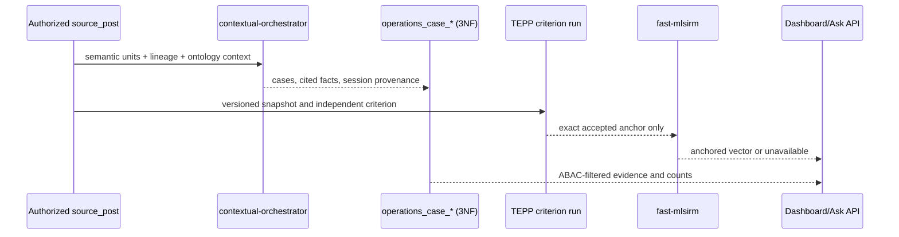

# Product & Technical Gap Baseline

## Authorized source semantic-coverage audit

An aggregate-only inspection on 2026-08-26 found 43,814 source rows with
43,814 non-empty titles and zero non-empty bodies. Structured coverage was
40,001 customer-code rows (91.3%), 4,490 project-code rows (10.2%), 43,812
VOC process-unit rows, and complete process-unit, sales-pool, actor, lineage,
and source-artifact provenance fields. No source value, identifier,
organization, table name, or artifact path is retained here.
The aggregate is reproducible with
`scripts/audit_source_semantic_coverage.py`; table and column mappings remain
runtime inputs rather than committed source identifiers.

The current semantic layer is therefore **not sufficient for the source
content as a whole**. It covers typed Post, Person, CorporateEntity, Team,
Project candidates, raw source context hints, lineage keys, and temporal
provenance, but it cannot derive body semantic units, embeddings, summaries,
VISION evidence, or body-grounded ontology assertions from this export.
ADR 0224 and the PostgreSQL importer now accept an explicitly evidenced
missing-body dimension without copying titles into bodies. This makes the
structured records importable while keeping body-derived capabilities
unavailable instead of fabricated.
ADR 0225 additionally carries the governed VOC type and raw source stage/detail
state into contextual-orchestrator hints with exact column provenance. The
available reference catalog contains examples rather than complete code-system
definitions, so raw stage/detail values are retained only as source-code RDF
literals and hints; they are not minted as classified ontology concepts.

An ADR 0226 private-content audit then validated eight disjoint deterministic
windows of ten titles (80/80 ordered outputs, four orchestration trace steps
per window). This is pipeline acceptance evidence only: the windows were not a
probability sample, had no known inclusion probabilities, and had no declared
confidence or margin-of-error target. Its observed counts found zero sampled
titles whose material meaning was completely expressible by the published
ontology. Missing dimensions in those 80 pipeline items were observed for
event/activity (55), product/service (37), communication/document type (33),
organization role (26), topic/domain (26), location/geography (24), commercial
transaction (18), facility/asset/equipment (17), status/stage (16),
requirement/issue/risk (15), time interval/deadline (13), and
quantity/measurement (6); a title may contribute to several dimensions. Two
remaining ten-title windows were not accepted after provider failures, so this
is explicitly an 80-record pipeline result, not a probability-sample, 100-record,
or corpus claim.
The reusable audit now rejects the previously observed 100-input/60-output
response, requires every ordered item plus a multi-agent trace, and prints only
complete non-identifying aggregates. It additionally fails closed unless the
caller supplies a probability-sample manifest with known per-stratum inclusion
probabilities, explicit confidence/margin targets, prior evidence for the
expected proportion, ordered owner-token membership digests, retained provider
failures, and the SHA-256-bound output
of the NIST proportion/FPC calculation owned by a versioned fast-mlsirm Rust
artifact. LineageWeave validates that contract but performs no sample-size,
finite-population, allocation, or weight arithmetic in Python.
The advertised deployment alias needed by this multi-agent path is repaired in
the canonical contextual-orchestrator PR #868. PR #870 was closed unmerged
after its explicit-conduct regression was composed into #868; until #868's
exact head passes its protected checks and independent review, the runtime path
remains candidate evidence.

Remaining acceptance gaps:

- ship the versioned fast-mlsirm Rust probability-sample artifact, select the
  fixed sample from a complete authorized frame, and complete every selected
  item without dropping or replacing provider failures before making any
  corpus coverage estimate;
- connect an authoritative body/file source and prove non-zero, ordered
  semantic-unit persistence before claiming PRD-FR-4 corpus coverage;
- obtain governed source definitions before mapping grade, inspection,
  lifecycle-detail, country, due-date, or artifact fields to ontology terms;
- publish only terms with domain/range, provenance, SHACL, API, and rendered
  acceptance evidence; opaque source codes remain raw hints until then;
- run an authenticated import/backfill and report only non-identifying
  aggregate counts for content units, embeddings, proposed/verified facts,
  and unavailable channels.

> Dashboard delivery snapshot: 2026-08-26 18:53 KST. Protected `main` was
> `ff7431bd1851c03e737808d22c6a2d43968582f9`. This local branch is not
> protected-main release evidence.

## Operations Dashboard PRD/TRD traceability

| Requirement | Evidence contract | Delivery state |
|---|---|---|
| Claim cause delay: order, specification change, originating order, sales pool, Event/post counts | ADR 0206; contextual-orchestrator case classification with cited spans; Event Lineage context | Candidate implementation; authenticated runtime acceptance pending |
| Rebid/handover: discussion, counterparties, our owner, decisions, Event/post counts | ADR 0206; normalized case facts plus persisted summary actions/roles | Candidate implementation; corpus backfill pending |
| External information count/rate and sales/project relation | ADR 0206; semantic `external_information` classification inside Dashboard GNB | Candidate implementation; no separate Board by product decision |
| Project-specific journey | Explicit source/semantic project membership plus event-time ordering | Candidate API and ordered journey UI implemented; authenticated runtime acceptance pending |
| Repeat issue to design improvement | `repeat_issue`, `issue_pattern`, and `improvement_action` cited facts | Candidate semantic contract; design-system connector acceptance pending |
| Natural-language Ask with evidence, report, alert, MCP | Persisted semantic-unit embeddings plus versioned delivery/resource contract | Candidate implementation uses whole-question embedding retrieval with no lexical fallback; authenticated runtime acceptance pending |
| Similar VOC, customer cohort, prior action | Persisted repeat-issue candidate semantics plus orchestrator pair adjudication and extractive evidence | Candidate live post endpoint and post-detail UI implemented; authenticated runtime acceptance pending |
| TEPP independent Event Lineage anchor | Accepted, persisted TEPP criterion bound to exact snapshot/cutoff before fast-mlsirm activation | Consumer PR #606 is on protected main; TEPP producer PR #237 remains open, so no end-to-end accepted artifact is release evidence yet |
| Temporal Lineage topics and multilevel important posts | ADR 0210; TEPP posterior topic/plausible-value contract followed by fast-mlsirm observed-information case-deletion influence | Product/technical contract is protected on `main`; neither required Rust CPU/GPU producer envelope is shipped, so the Dashboard surface remains unavailable (ADR 0208: no local Python substitute) |

### Technical contract and flow

Security/operability: every aggregation applies `post_read` plus row-level
corporate-entity visibility before counting; source-body digests invalidate
stale inference; provider errors persist no positive/negative result; PII
remains authorized at the UI boundary and is excluded from telemetry. The
tables use composite keys and bounded kind-first indexes; production hot-path
acceptance still requires `EXPLAIN (ANALYZE, BUFFERS)` on an anonymized runtime
snapshot.

### Historical UI audit evidence

The `f0b96029` Storybook build was rendered at 1440×1100 and 402×1200 with
synthetic evidence; `416fd19d` changes only post-navigation request isolation.
Desktop inspection showed all four case kinds, five non-conflated metrics,
project-journey ordering, cited facts, and evidence actions without horizontal
card overflow. Narrow inspection showed two-column metrics, readable cards and
44px-class actions; the project journey remains intentionally horizontally
scrollable. No identifying runtime record or screenshot is committed. The
`EvidenceReady`, `NarrowViewport`, `AnalysisPendingAndMissingEvidence`,
`AnalysisFailed`, and `LoadError` scenes cover the ADR 0206 state inventory.
Authenticated authorized-corpus acceptance remains separate and may return
only aggregate, non-identifying evidence to this repository.

### Exact open-PR boundary

At this snapshot there were 16 open PRs and 10 open issues. The exact-head
inventory in section 1 is authoritative for this snapshot. Every open head
remained blocked on hosted gates and/or independent review. These observations
are not merge readiness. Re-fetch exact heads,
unresolved threads, checks, approvals, rulesets, and merge SHA before any
lifecycle claim.

> Audit snapshot: 2026-08-26 18:53 KST (refreshed by the autonomous merge
> loop). This repository records synthetic fixtures and aggregate,
> non-identifying runtime evidence only. Open PRs and local checks are not
> protected-default-branch release evidence. Identifying post identifiers,
> organization names, and production record keys must never appear in this
> file.

## 1. Exact-head and governance evidence

The protected default branch was `ff7431bd1851c03e737808d22c6a2d43968582f9`
when this baseline was refreshed. The live queue contained 16 open PRs and 10
open issues. The exact-head inventory below supersedes older per-PR snapshots
elsewhere in this document; those older rows remain useful historical delivery
context only.

| PR | Exact observed head | Merge/check state at this snapshot |
| ---: | --- | --- |
| #702 | `c57d4cdf` | mergeable but blocked; exact-head checks and independent review required |
| #701 | `cc3351a9` | mergeable but blocked; exact-head checks and independent review required |
| #700 | `28f7ec9d` | mergeable but blocked; exact-head checks and independent review required |
| #680 | `ff4d9eaf` | mergeable but blocked; exact-head checks and independent review required |
| #679 | `866c46d0` | mergeable but blocked; exact-head checks and independent review required |
| #672 | `f78f036c` | mergeable but blocked; exact-head checks and independent review required |
| #668 | `f9c4bd65` | mergeable but blocked; exact-head checks and independent review required |
| #667 | `3e432b41` | mergeable but blocked; exact-head checks and independent review required |
| #658 | `6813894e` | mergeable but blocked; exact-head checks and independent review required |
| #657 | `9f71681c` | mergeable but blocked; exact-head checks and independent review required |
| #644 | `f53dd28e` | mergeable but blocked; exact-head checks and independent review required |
| #643 | `42ba340e` | mergeable but blocked; exact-head checks and independent review required |
| #640 | `c15b2ec4` | mergeable but blocked; exact-head checks and independent review required |
| #639 | `f1d7aaaa` | mergeable but blocked; exact-head checks and independent review required |
| #632 | `24262a99` | mergeable but blocked; exact-head checks and independent review required |
| #629 | `b721b0f2` | mergeable but blocked; exact-head checks and independent review required |

No row above is merge evidence. Immediately before any lifecycle action,
re-fetch the head, unresolved threads, formal reviews, rulesets, and same-head
check conclusions. In particular, queued checks are infrastructure state and
do not transfer evidence from an earlier SHA.

PR #607 first merged as `61fd631c7bb3c57113fd19763c2c43161eeb2824`
into #606's non-default branch. PR #606 subsequently passed the protected gate,
so the combined TEPP-consumer and operations-dashboard implementation is now
on `main`; the still-open TEPP producer PR #237 keeps end-to-end anchor
acceptance unavailable.

PR #604 was closed unmerged after its exact OIDC repair was composed into #605;
its green or pending checks are not delivery evidence. PR #482 merged as
protected-main commit `464ff25002044b9d933c8eefd36c8def7ca0ffd8`
with package conflict markers, identifying baseline records, and an OIDC
return-context regression. PR #603 repaired the package/privacy and
analysis-run transaction defects through protected main at `4f53190b`; the
OIDC defect remains delivered until #604 or the composed #605 passes the
protected gate. Protected main is therefore not yet a release candidate.

PR #592 first merged as `3b3af3b4fe9c439354433a43444e05f37ab24ea3`
into #590's non-default stack base at `2f033ba3`. The complete stack then
passed the protected gate and #590 merged to `main` as
`1d1379fc59d9dac6e9c8bfa4812313e3b9e8f3c8`.

PR #521 merged through protected `main` as
`3797f063b1a7396972a749aa81f23745acccbee1`; it is release evidence and no
longer part of the open queue. That merge also left a standalone conflict
marker and duplicated stale tail in `CLAUDE.md`; #594 repaired it through
protected `main` as `241be2dddf657f854cb8be54fe11d4ef48d37976`.

Protected main now contains the ADR 0109 OIDC return restoration from #605,
including fragment preservation and storage fallback. The #606 dashboard
landing must additionally route `?post=` deep links to the Board; that focused
regression is part of the current candidate and is not delivery evidence yet.

Three systemic gates currently dominate the queue:

1. **Strix visibility lookup failure (org control plane).** PR #600 exact head
   `7580bdc9` failed before scanning because the required-workflow token could
   not resolve this public repository after six API retries. The root repair is
   ContextualWisdomLab/.github#1320 at `3b9b2380`: ordinary PR, push, and
   schedule runs use trusted event visibility; cross-repository dispatch keeps
   authoritative public/private/internal visibility; private and internal
   repositories remain on private-capable providers. The exact head also
   composes the executable fallback contract and classifies bounded NVIDIA
   `ServiceUnavailableError` overload evidence as retryable across configured
   distinct models without weakening exhaustion or vulnerability fail-close.
   A hosted fallback then completed with zero vulnerabilities but was rejected
   because the generic warning gate treated Strix's fallback-model banner and
   a Hugging Face unauthenticated-download notice as provider failures. The
   current head removes only those two exact scanner notices before the
   existing general warning and explicit 429/provider failure checks. The
   current head also clears a foreign NVIDIA/OpenRouter endpoint before a
   direct-OpenAI fallback while retaining an explicitly configured
   direct-OpenAI primary endpoint. The prior full quick-gate harness, overload
   path, 12 visibility-contract tests, and the focused cross-provider endpoint
   contract passed; exact-head hosted revalidation remains pending. It is blocked on
   hosted exact-head gates and independent review, so no repaired
   protected-main Strix runtime evidence exists yet.
2. **Strix provider unavailability (org control plane).** The central required
   Strix scan on .github#1320 failed when NVIDIA returned `Service temporarily
   overloaded`; the gate correctly failed closed but did not try its configured
   distinct fallbacks because the service-unavailable classifier excluded the
   NVIDIA provider. Exact head `3b9b2380` composes that execution repair and the
   two exact non-fatal scanner-notice exclusions while keeping
   incomplete exhaustion non-passing. This is still an unmerged control-plane
   proposal, not protected-main or downstream runtime evidence.
3. **Current-head independent approval.** The org merge scheduler requires
   `reviewDecision == APPROVED` plus complete Strix evidence on the exact
   head. Bot review evidence regenerates per push, so any repair push resets
   the review clock by design; this is expected and not a bypass target.

Recent protected-default-branch delivery evidence (squash merges onto
`main`, newest first):

| PR | Merged (UTC) | Delivered |
| ---: | --- | --- |
| #628 | 2026-08-25 12:39 | one-round-trip authorized post filter options without narrowing the complete ABAC-visible set |
| #627 | 2026-08-25 12:35 | preserved valid k6 lifecycle evidence across setup, scenario execution, and teardown |
| #468 | 2026-08-25 08:44 | fast-mlsirm, Keyverse, contextual-orchestrator, and TEPP integration boundaries |
| #493 | 2026-08-25 08:44 | evidence-grounded Event Lineage isolation reasons |
| #600 | 2026-08-25 08:44 | then-current exact-head product/technical baseline |
| #605 | 2026-08-25 08:44 | dialog focus order, evidence readability, and OIDC return-context restoration |
| #608 | 2026-08-25 08:43 | Naruon projection consumed by Workspace Calendar |
| #603 | 2026-08-25 07:24 | short analysis-run transactions, session advisory locking, package-marker/privacy repair, and provider-work lease release |
| #602 | 2026-08-25 07:24 | post-detail modal semantics, Escape close, initial focus, and opener restoration; navigation-refocus edge case continues on #605 |
| #582 | 2026-08-25 07:24 | bounded batched cited-lineage graph fetch |
| #588 | 2026-08-25 07:23 | named two-axis leftover-map reconstruction and raw-residual identity |
| #482 | 2026-08-25 07:03 | corroborated SKOS companion organization chips; regressions subsequently tracked above |
| #601 | 2026-08-25 06:38 | APA 7th PROV-O and PROV-DM references for ADRs 0011 and 0065 |
| #595 | 2026-08-25 04:39 | audited no-draft import door, nullable updated-at fallback, and event-time import |
| #484 | 2026-08-25 04:39 | Allen interval relations with deferred FK validation |
| #383 | 2026-08-25 04:39 | reader-safe OTel diagnostics and service-peer-bounded session metadata |
| #599 | 2026-08-25 04:28 | raw-residual leftover-map cross-share identity aligned without arbitrary weighting |
| #598 | 2026-08-25 03:32 | 5W1H roles/events remain readable across a stale summary contract version |
| #597 | 2026-08-25 03:32 | related posts open Customer Master detail in place without stale graph state |
| #591 | 2026-08-25 03:32 | prior exact-head product-gap baseline snapshot |
| #584 | 2026-08-25 03:32 | TEPP topic-lineage consumption boundary grounded in cited temporal models |
| #581 | 2026-08-25 03:32 | relative-time Ask filtering bound to event time |
| #596 | 2026-08-25 03:27 | hierarchy/name-resolution deep-work timeouts aligned at 600 seconds |
| #585 | 2026-08-25 03:27 | raw Global Ask transport exceptions replaced by bounded client-safe detail |
| #355 | 2026-08-25 02:38 | Naruon calendar projection contract and conformance fixture |
| #562 | 2026-08-24 02:05 | parameter-free classic RRF; deleted the last hand-picked fused score |
| #561 | 2026-08-24 01:47 | knowledge-graph precedence/hierarchy relation classification and layout order |
| #555 | 2026-08-24 01:29 | per-channel score breakdown persisted on `post_lineage_edge.channel_scores` (ADR 0195) |
| #559 | 2026-08-24 01:26 | deleted `DEFAULT_CHANNEL_WEIGHTS` hand-picked fallback |
| #549 | 2026-08-24 00:43 | clamped embedding cosine into `[0, 1]` instead of remapping from `[-1, 1]` (ADR 0190) |
| #548 | 2026-08-24 00:37 | mid-reconstruction provider failure maps to an explicit unavailable state |
| #544 | 2026-08-24 00:27 | fusion weights accepted only via fast-mlsirm estimation |
| #538 | 2026-08-23 23:39 | real embeddings wired into the Event Lineage text channel |

This documentation is owned by protected `main` again: the #426 stack landed,
so hidden-stack merges (#494, #497, #499, #505, #509 into unprotected parent
branches) are historical context only and no longer gate anything.

The current protected-`main` and exact #507 trees are clean of the private
runtime source-table identifier present in the closed #506 head and older
public history. Do not reproduce or hint at its value. Historical remediation
requires the ADR 0001 incident process and security/privacy-owner coordination;
never force-push or delete evidence ad hoc.

The Grok durable hourly loop and the central thin GitHub Actions caller
ContextualWisdomLab/.github#1259 (minute 4, `pr-review-fix-scheduler.yml`)
both target this repository. Do not add a LineageWeave-local duplicate
workflow. ContextualWisdomLab/.github#1258 merged at exact head `897819c4` to
repair the pnpm/coverage-evidence workflow; newly created exact PR heads must
still prove the runtime behavior because merged workflow source alone is not
check evidence.

Figma design-system boundary (ADR 0002): File ID `1Su3lDRmiZdcUs47t1QwIX`.
The sanitized file now contains synthetic Event Lineage desktop (`5:14`) and
mobile (`5:15`) frames with graph direction, event dates, an inference
boundary, and exact fused-score evidence. Do not copy source-organization
content into this repository. Storybook remains the executable scene and
edge-case inventory for repeated web objects; rendered code-to-Figma parity
still requires same-viewport browser comparison on an exact candidate head.

## 2. User-visible capability baseline

Substantially present on protected `main`:

- PostgreSQL-backed import, normalized provenance, cutoff-aware analysis runs,
  source revisions, lineage reconstruction, and explicit unavailable states.
- Authenticated workspace navigation, post detail, localized summaries, 5W1H,
  R&R/Keyman, evidence citations, chat, organization hierarchy, and lineage DAG
  (`frontend/src/LineageDag.tsx` is on `main`; the old “DAG view missing”
  baseline entry is stale).
- Semantic paragraph/list/table/image-region units that preserve the source
  representation and provenance instead of flattening it into one body string.
- Contextual-orchestrator boundaries for adjudication, extraction, summaries,
  chat, embeddings, and VISION; null channels remain unavailable and are
  dropped from score fusion.
- W3C PROV-O projection through normalized provenance tables, with the
  knowledge graph retained as an explicit navigation projection.
- Keyverse/Keycloak OIDC, RankWeave fusion port, TEPP measurement client,
  ThreadWeave tree assembly.

These statements describe source capability, not authenticated production
corpus acceptance or protected release.

## 3. Historical open-PR inventory (superseded by §1)

Heads below are queue evidence captured at snapshot time; recheck SHA,
checks, unresolved threads, and independent approval immediately before any
merge claim. Do not self-approve, force-push, or transfer stale review
evidence across heads. The org merge scheduler merges only when
`reviewDecision == APPROVED` on the exact head and Strix evidence is complete.

### 3.0 Shared systemic gate

| Gate | Evidence | Durable repair |
| --- | --- | --- |
| Strix provider unavailability | `nvidia_nim/nvidia/nemotron-3-super-120b-a12b` and `openai-direct/gpt-5.6-luna` failed authoritatively across unrelated heads | ContextualWisdomLab/.github#1263 at `ab3d7645` proposes executable Azure/cross-provider fallbacks but remains open/conflicting; repair that branch without weakening the required gate |
| ADR 0109 login repair debt | Eight branches cut from the pre-repair base carried the unauthenticated `AdminPanel` + unused-OIDC-helper `tsc -b` failure | Same verified two-line repair applied to #521, #522, #552, #553, #554, #556, #558, #560 during this loop; frontend lint/test/build verified locally |

### 3.1 Workspace root and product surfaces

| PR | Head | Intent | Notes |
| ---: | --- | --- | --- |
| #258 | `f0b5234d` | Workspace evidence board and source-grounded ontology surface (root stack) | Largest surface; historical CHANGES_REQUESTED is stale relative to current head |
| #349 | `bef4a858` | Bounded ontology and provenance explorer (v2.13.0) | Issue #341 |
| #355 | `2f3f308c` | Naruon event projection contract | Issues #336/#338 |
| #387 | `5ef0f2e6` | Persist and explain Event Lineage channel evidence | Issue #274 |
| #405 | `ec62d9f0` | Persisted image-region locations (v2.12.8) | VISION region provenance |
| #484 | `878c4a87` | Allen interval relations on Event Lineage edges (v2.15.0) | Temporal modeling; Allen (1983) |
| #490 | `d0cad030` | Wire remaining ADR 0133–0137 surfaces | Consolidated product stack incl. Knowledge Graph token repair |
| #493 | `499c8b1b` | Name Event Lineage isolation reasons (v2.16.0) | Honest unavailable/failed states |

### 3.2 SKOS organization aliases and leftover-map family (stacked)

| PR | Head | Intent |
| ---: | --- | --- |
| #480 | `f18b421d` | Bind corroborated SKOS org aliases to one catalog row |
| #482 | `c38c08d6` | Corroborated SKOS companion caption on organization chips (v2.14.0) |
| #481 | `32944979` | Persist leftover interaction-map coordinates (v2.12.7) |
| #485 | `dcaa6320` | Leftover pair clicks land on the named Post quality criterion (v2.12.8) |
| #518 | `3117823f` | Name leftover complete-case coverage (v2.12.17) |
| #519 | `31c150c8` | Persist leftover-map axis share on period reports (v2.12.16) |
| #521 | `40677c75` | Leftover pairs on the grouping comparison strip (v2.12.17) |
| #522 | `9be3712e` | Leftover-map distances on two Gabriel axes (v2.12.18) |
| #535 | `1fb5d69a` | Name leftover-map unexplained leftover (v2.12.26) |
| #537 | `9a639554` | Name leftover-map unexplained share (v2.12.27) |
| #539 | `740629d0` | Name leftover-map explained share (v2.12.28) |
| #563 | `740d50f3` | Name leftover-map cross share (v2.12.29) |
| #564 | `ac5de72a` | Name leftover-map reconstruction share (v2.12.30) |

The leftover-map naming series (#518–#564) is a stacked ladder of honest
leftover-pair labeling increments; merge in ascending order once each exact
head clears gates.

### 3.3 Repairs and operability

| PR | Head | Intent |
| ---: | --- | --- |
| #393 | `4ddd3a83` | Detach provider parse error context (honest orchestrator failure) |
| #394 | `cf9505b7` | Preserve source indentation evidence for adjudication |
| #434 | `01d6cca5` | Wire adjudication client into corpus-wide rebuild (issue #289) |
| #541 | `3d93ea9b` | Bootstrap repo-root sys.path in operator scripts |
| #546 | `d210c20c` | Strip Keycloak OIDC callback params from post share links |
| #547 | `fb7fe2db` | Shorten orchestrator healthcheck retry budget |
| #552 | `89000280` | Footer text contrast passes WCAG 1.4.3 AA |
| #553 | `e5152f5c` | `.post-meta` contrast in both themes |
| #554 | `689e42e4` | Event Lineage DAG node marks get a 24×24 px hit target |
| #556 | `21cf9991` | Citation chip grows to a 24px touch target |
| #558 | `91dd1bfc` | Bare loading text exposed as live regions |
| #560 | `59b769e3` | Secondary details/summary toggles sized to `--size-control-min` |

### 3.4 Integration and measurement boundary

| PR | Head | Intent |
| ---: | --- | --- |
| #417 | `cb08377c` | TEPP topic-lineage consumption boundary (TRSL-TM + CHRONOS/TDT) ADR |
| #468 | `228f13dd` | Bind fast-mlsirm, Keyverse, orchestrator, and TEPP integration tests |
| #258-family measurement note | — | GRM/GPCM/CAT/FIPC parameter recovery (#451–#454) landed earlier; true-parameter RMSE remains the acceptance bar |

### 3.5 Documentation

| PR | Intent |
| ---: | --- |
| #565 | Sync AGENTS.md / CLAUDE.md with accepted ADR boundaries |
| this file | Non-identifying gap baseline refresh (ADR 0001) |

Closed as superseded during this loop: #368 (baseline rewrite superseded by
this file per §3.5 of the prior snapshot).

## 4. Open issues (complete live queue; product acceptance remaining on `main`)

| Issue | User-visible gap | Active PR |
| ---: | --- | --- |
| #79 | Milestone 2: port verified direct-PostgreSQL analysis into the protected architecture | analysis-run registry on `main`; remaining runtime bridge |
| #87 | Milestone 2.1 normalized runtime-analysis schema bridge | related analysis-run work |
| #269 | Authenticated Global Ask MCP browser-safe and admission-bounded | Ask stack |
| #271 | Evidence-honest knowledge-cutoff scope on Global Ask | #658; still open and not protected-main evidence |
| #272 | Verify Global Ask KG/ontology/semantic claims with public SearXNG evidence | #632 preserves internal provenance; public verification acceptance remains open |
| #277 | TEPP: persist accepted receipts, poll completed results, keep measurement authority distinct | #657 consumer lifecycle; executable producer route remains unavailable |
| #280 | Full project-lifecycle history and handover intervals | #640 adds case/project journeys and #663 adds evidence-backed Project exploration; authoritative lifecycle reconciliation remains #284 |
| #284 | Authoritative lifecycle ingestion and idempotent reconciliation | No active delivery PR confirmed |
| #338 | Evidence-bounded email/project lineage contract for Naruon consumption | Missing on protected `main`; #343 merged only into a non-default stack, while #355 is a distinct calendar-consumer contract and is not delivery evidence for email/project lineage |
| #611 | Decompose closed PR #490 ADR 0133–0137 evidence without transferring stale branch state | #631 supplies the current-main inventory only; focused implementation PRs and tests for every unmet criterion are still required |

## 5. Open product and technical gaps

| Gap | Current evidence | Acceptance requirement |
| --- | --- | --- |
| Protected release | 12 open PRs at snapshot, all targeting `main` with normal auto-merge enabled. None has the required independent approval, and running checks on #631/#632/#663 are not treated as blockers for safe work on other PRs. #666's merge into the non-default #663 branch is not protected-main delivery | Terminal exact-head checks, no unresolved threads, two independent approvals including last-push approval, protected squash-merge SHA |
| CI queue release latency | Two Tests runs for already merged PRs occupied the available runner slots while 54 newer runs remained queued. Manual cancellation released the stale work, but the central close workflow was itself queued behind those runs. #634 merged into #631's non-default branch and reuses the repository's existing per-PR concurrency group so a jobless close event can cancel obsolete Tests work before runner allocation; this is not protected-main delivery | Merge #631 through its refreshed protected gate; close a synthetic PR while its Tests run is active and verify the old run becomes cancelled, the close-event jobs remain skipped, and a newer exact-head run starts without manual intervention |
| Evidence-grounded operations workspace | Protected-main #614 delivers governed semantic Ask, live Similar VOC, disjoint pending/failed analysis metrics, full Storybook state inventory, and current desktop/mobile screenshot evidence. Authorized-corpus backfill acceptance remains unavailable | Perform authenticated authorized-corpus acceptance with aggregate evidence and retain fail-closed no-match behavior |
| Shared frontend gate | The ADR 0109 login repair is on protected `main`; eight older branches carried the defect and received the same verified repair this loop (#521–#560) | Keep every future branch cut from post-repair bases; re-verify with frontend lint/test/build before push |
| Identifying baseline regression | `main` gap file listed real post identifiers; separately, closed #506 and pre-existing public history contain a private runtime source-table identifier, while current `main` and #507 trees are clean | Land this non-identifying rewrite, then coordinate ADR 0001 history remediation with security/privacy owners; do not reproduce the value, force-push, or delete evidence ad hoc |
| Authorized-corpus runtime | Repository tests use synthetic fixtures; private records remain outside git | Authenticated runtime validation returning only aggregate, non-identifying evidence |
| Concurrent web responsiveness | ADR 0204 releases pooled transactions during provider work, and the synthetic Compose boundary has an authenticated k6 E2E harness for Ask enqueue, concurrent reads, and job polling. PR #633's measured landing-query and event-loop work merged into open parent #629 rather than protected `main`; its aggregate observation improved 25-VU throughput but did not establish a latency SLO. The current exact #629 also persists each completed relation verification before propagating a later provider failure | Land #629 through its refreshed protected gate, rebuild that exact-head application image, and repeat `make load-http` with declared environment concurrency/window and retained raw distributions/resource configuration; set no SLO until representative capacity evidence is approved |
| Image understanding | Region, OCR, and description work exists across active heads (#405, #419), but current runtime acceptance has not yet proved table-image structure, complete region coverage, or summary/image readiness together | Orchestrator-backed rendered workflow, original/derived asset provenance, region-before-OCR processing, and honest unsupported states; reconcile ADR 0052's image-bearing summary readiness with ADR 0098 before changing sequencing |
| Semantic source rendering | Paragraph, table, list, formula, and indentation work exists across stacks (#394, #427, #448–#450); #515 adds synthetic backend/frontend parity for deterministic rows/cells, footnote boundaries, and encoded scripts | Land the #427 → #515 stack, then gather authenticated browser evidence that list nesting, continuation alignment, and formula units render without authoring-layout artifacts |
| Event and project semantics | #663 is the largest current user-visible gap slice: evidence-backed Project nodes, bounded traversal, cutoff/snapshot fencing, exact-value table parity, and localized graph labels. Focus visibility, label-bound, and temporal test-double regressions are repaired. #666's heuristic removal is composed into this parent but is not separately protected-main evidence. #640 separately adds project journeys without claiming authoritative lifecycle status | Combined #663 must pass exact-head checks and independent approval before protected merge. Aggregate authenticated evidence must still prove distinct projects/events and handover intervals without promoting co-occurrence |
| Knowledge Graph readability | #659 recreates the token-backed node-type repair on current `main`, including regression coverage; it is open and therefore not protected-main evidence | Merge #659 normally, then verify light/dark contrast, keyboard graph navigation, full labels, and evidence tables in the authenticated rendered surface |
| Source-code lookup UX | Source state/detail codes remain evidence-bearing machine values and current detail presentation is dense | Catalog-backed display labels with raw-code provenance, compact 5W1H/source-detail hierarchy, keyboard access, and no unsupported customer/project binding |
| Calendar / Naruon | #355 delivered the projection contract; v2.17.0 wires operator consumption without forwarding the end-user token. Naruon producer, provider/consumer fixtures, and protected merge remain open (#336) | Verify observed events against the published schema without invented events; keep commitments available when the channel is unwired |
| SKOS organization aliases | Catalog binding and chip caption live on #480 / #482 | One catalog row per corroborated org; companion caption is hint-only until bound |
| Event Lineage evidence | Channel evidence and Allen relations live on #387 / #484 | Persist channel scores, explain them in the popup, never invent a fused score |
| Scientific measurement | Durable accepted TEPP receipts and LineageWeave #614's exact accepted snapshot/cutoff/run/pair-count consumer are protected; TEPP #237 remains open, so no registered producer artifact exists yet. #387 removes inferred/default persistence weights, but several older reconstruction tests still pass hand-authored numeric dictionaries that are not estimator evidence | Land TEPP #237 through its protected gate, then replace remaining reconstruction-test constants with provenance-bearing fast-mlsirm estimates over synthetic fixtures. Retain true-parameter RMSE recovery as the acceptance bar |
| Asynchronous authorization | Protected `main` rebuilds Global Ask worker scope after the bearer token leaves the request; #468 now persists exact Keyverse organization/process-unit scope in 3NF child tables and intersects it with current affiliations | Land #468 through the protected gate; prove a second affiliation and a revoked process unit cannot widen delayed-job evidence |
| Planned-facility intent | Planned-facility relationship intent remains only on closed, unmerged #490; earlier stack-only merges were not protected delivery | Recreate the evidence-backed slice on a current base and land through protected `main` before a release claim |
| Accessibility and responsive UX | #602 delivered base post-detail modal semantics; #605 adds selected-post refocus, collapsed/hidden/inert/CSS-invisible focus exclusion across both modal types, readable evidence separators, focused tests, and desktop/mobile Storybook screenshots | Land #605 through the protected gate, then complete screen-reader and authenticated Playwright acceptance on the exact release head |
| Design tokens and repeated objects | Token extraction started; sanitized Figma Event Lineage desktop/mobile frames exist, while other repeated product surfaces remain incomplete | Tokens in CSS + Storybook stories for board, popup, DAG, Ask, calendar, forms, charts; same-viewport Figma/runtime visual comparison before release |
| Frontend delivery performance | #644 implements a native dynamic-import boundary for conditional workspace surfaces and retains accessible loading/error states; exact-head checks passed but the PR is not protected-main evidence | Merge #644 normally, rebuild the protected-main production bundle, and retain the measured chunk inventory rather than raising the warning limit |
| External integrations | Search, Zotero, calendar, Keyverse, orchestrator, RankWeave, ThreadWeave, TEPP, DiskSage, wardnet | Provider conformance, failure/reconciliation behavior, and provenance-bearing integration evidence |
| MSA / modular reuse | LineageWeave must run standalone and as a consumer of org packages | Do not reimplement RankWeave/TEPP/orchestrator/ThreadWeave/Keyverse; fix upstream and PR there |
| Product contract authority | The current LineageWeave PRD records exact-case ecosystem authorities. TEPP, fast-mlsirm, keyverse, ThreadWeave, and RankWeave PR #41 have standalone PRDs; RankWeave's remains unmerged. contextual-orchestrator, disksage, and wardnet still rely on product/architecture documents, and naruon has only a scoped Topic Intelligence PRD | Keep ADRs normative, preserve canonical repository case in machine references, land the pending PRDs, and add standalone PRDs in each remaining owning repository before cross-product release claims exceed its documented boundary |
| Release quality | PR #660 is now on protected `main`; its pre-merge full Python suite passed 1,352 tests with 17 skips, but release-wide frontend, Storybook, security, browser, and runtime acceptance remain unproven on one exact protected head | Repository-wide coverage, docstrings, Storybook, security, browser, and release evidence on one exact head |
| PII | Masking would paralyze the product; ADR 0001 forbids identifying artifacts in git | ABAC + authorized runtime; synthetic fixtures in git; no mask-in-place that drops names the operator must read |
| Database | PostgreSQL, 3NF, snake_case ≥ two words, hot-partition and lock policy | No file DBs; read/write split if lock management fails; whitelist every migration |

### 5.1 Closed PR #490 decomposition (issue #611)

Protected `main` at `04e6b610` and the three open PRs present during the initial
decomposition were rechecked; the later audit snapshot above includes #631
itself as the fourth open PR. Protected `main` contains none of PR #490. That PR remains
closed, unmerged branch evidence; its ADR 0133–0137 files are not normative and
its 321-file tree must not be replayed. Current-main code and schema searches
give this delivery matrix:

| Closed-branch decision | Current-main classification | Smallest remaining delivery |
| --- | --- | --- |
| ADR 0133 source-reference research | Partial foundation: protected `main` has the self-hosted SearXNG relation-verification client and fail-closed configuration, but it verifies an already extracted relation. It has no source-unit/image-region lead, cited-resource retrieval, claim judgment, or normalized research citation workflow | One post-scoped lead-to-citation slice that reuses the self-hosted SearXNG search boundary, adds public-target SSRF/redirect rejection for result retrieval, and judges through contextual-orchestrator with explicit unavailable outcomes |
| ADR 0134 token-backed exception messages | Partial: sanitized next-action failures exist, but no shared token-backed exception component or complete Storybook error inventory exists | Migrate one existing unavailable flow to one shared accessible alert and verify its success, unavailable, and retry states |
| ADR 0135 kind/status-exact analysis actions | Partial: protected `main` has kind-aware start/retry controls plus normative analysis-run, TEPP, cutoff-body, and channel-evidence contracts; it does not contain the closed branch's unified guidance component or its full kind × status interaction inventory | Test the current run-kind/status matrix first, then add only a proven missing state/control pair rather than copying the closed-branch function |
| ADR 0136 per-post Ask history | Partial: `post_chat_result` / `post_chat_citation`, the authorized post Chat API, and its linear exchange history are on protected `main`. Account-and-post-scoped sessions, ordered turns, list/select/new controls, and batched citation reauthorization are not | Define the 3NF account/post session boundary, bounded batch reauthorization, and one authorized list/load/write path before adding the conversation picker |
| ADR 0137 cross-post customer identity | Partial foundation: protected `main` preserves source customer hints and has corporate-catalog unique/miss/tie safeguards, but it has no normalized cross-post customer-identity judgment, supporting-post binding, or corporate-name-history workflow | Add only after external corroboration, orchestrator judgment, TEPP ordering, and unique-catalog fail-close can be verified together; never promote a one-post hint |

This matrix satisfies only #611's current-main inventory step. Issue #611
remains open: every unmet criterion above still needs a focused regression test
and exact-head current-main implementation PR before its acceptance criteria
are satisfied. No stale check, review, or implementation is transferred from
#490.

## 6. UI-UX acceptance inventory (must be defined, reviewed, applied, audited)

Each item needs a Storybook scene, an edge-case story, and an automated check
before a commercial release claim. Figma File ID `1Su3lDRmiZdcUs47t1QwIX`.

| Dimension | Current | Gap |
| --- | --- | --- |
| Accessibility | Partial labels/roles on board, popup, login | WCAG 2.2 AA on login, board, popup, Ask, calendar, admin; focus order; live regions |
| Touch & Interaction | Click-first popup and lists | 44px targets, swipe/escape to dismiss popup, no hover-only actions |
| Performance | Board caps and hint render limits exist | Interaction-to-next-paint on board search, DAG, Ask; no N+1 (#358) |
| Style Selection | Korean UI standards merged (#347) | Tokenized light/dark; Anti-Slop-UI density; no decorative noise |
| Layout & Responsive | Desktop popup shell | 402px-class phone layout; stacked GNB; readable DAG |
| Typography & Color | Badge tokens extracted | Contrast on badges, links, error/status; no raw hex in components |
| Animation | Minimal | Reduced-motion; no blocking animation on evidence open |
| Forms & Feedback | Login, Ask, tickets, admin brand | Inline validation, next-action copy, unavailable vs failed distinction |
| Navigation Patterns | Board / customers / calendar / Ask / admin | Deep-link post + OIDC return URL (#426); bookmarkable Ask |
| Charts & Data | Period reports, leftover pairs, Rankings, DAG | Honest empty/unavailable; no invented theta; Storybook chart states |

## 7. Ecosystem leverage order

Reuse before rebuild. Consume these ContextualWisdomLab packages in this order
of leverage; open connector PRs there when the defect is upstream:

1. **contextual-orchestrator** — every LLM/VISION/embedding call (Fugu / Conductor / TRINITY routing). Never a raw provider SDK.
2. **Keyverse** — OIDC issuer, JWKS, tenant principals.
3. **RankWeave** — fused scores and rankings; never invent a fused score or theta.
4. **TEPP** — calibrated measurement; persist receipts; no local reimplementation.
5. **fast-mlsirm** — GRM/GPCM/CAT/FIPC recovery tests (#451–#454) must stay true-parameter RMSE.
6. **ThreadWeave** — tree assembly.
7. **Naruon** — calendar and email/project lineage projection (#336, #338, #355).
8. **DiskSage / wardnet** — storage and network policy as needed.
9. **ContextualWisdomLab/.github** — required review workflows (OpenCode, Strix, Noema) and the LineageWeave hourly caller (#1259). If stacked PRs miss central review or coverage-evidence fails on pnpm 9 (`--trust-lockfile` is pnpm 11.3) or a missing Vitest coverage provider, fix the org workflow (#1258), not a local bypass.

## 8. Public ontology publication boundary

- PR #426 publishes fragment-addressable HTML, byte-identical Turtle,
  isomorphic JSON-LD and N-Triples, the PROV-O support profile, and a
  source-digest manifest from the authoritative ontology.
- Pull requests validate only. Only protected `main` may publish, and the
  generated-directory marker, linked-IRI, duplicate-fragment, symlink, and
  source-overlap checks fail closed.
- The lowercase knowledge-graph namespace and repository-case support-profile
  namespace remain distinct until issue #372 delivers a versioned migration
  and compatibility decision; this publication PR rewrites neither identity.
- Until the protected deployment and exact URL checks succeed, the public
  ontology endpoint remains unavailable and must not be represented as live.

## 9. Evidence boundaries

- Never add a real record, title, name, identifier, screenshot, log, benchmark
  artifact, or documentation example to this repository.
- Attendance or co-occurrence is not responsibility, project, customer, or
  affiliation evidence. Preserve uncertainty and provenance.
- Missing transport, model capability, accepted envelope, or persistence is
  unavailable or failed evidence, never a placeholder result.
- Local green tests, bot statuses, auto-merge, and warning-only checks do not
  prove a protected merge.
- Re-fetch base/head SHAs, checks, review threads, approvals, rulesets, and the
  merge SHA immediately before any lifecycle claim.
- Do not self-approve. Independent OpenCode / Strix / Noema review is required.
- Do not force-push. Do not treat GitHub Checks duration as a blocker; repair
  the failing check instead.
- `COPILOT_GITHUB_TOKEN` is not used.

## 10. Next acceptance loop (autonomous merge order)

Process every open PR in ascending number order, considering leverage; for
each: check reviews → repair → re-verify Checks → merge → continue. Checks and
review latency are never blockers — keep working while they settle.

1. Revalidate Strix after merged ContextualWisdomLab/.github#1320, reconcile
   open .github#1263, and land the atomic hourly LineageWeave caller in open
   .github#1288 only through their protected gates.
2. Process main-targeted PRs #629, #631, #632, #639, #640, #643, #644, #657,
   #658, #659, #660, and #663 only after each exact head shows terminal green
   required checks plus current-head independent approval. Treat #666's
   non-default-branch merge only as part of #663's combined candidate and
   collect all protected evidence on #663's exact head.
3. While hosted checks or independent reviews wait, resume user-visible gaps
   from §5 in leverage order:
   external semantic verification (#272), Naruon calendar (#355/#336), and
   authenticated operations/ontology publication acceptance. Event Lineage
   evidence shipped in merged PR #387 and closed issue #274 is not an open gap.
4. Rename remaining `[Buyer Gap]` issue titles to neutral product-object
   naming per repository convention (no "Buyer" for internal objects).
5. Keep psychometric tests as true-parameter recovery (RMSE); never fixture
   tautologies, invented theta, or hand-authored numeric weights. Remove
   weights from tests that do not exercise fusion; fusion tests must consume
   provenance-bearing fast-mlsirm estimates over synthetic fixtures.
6. Run frontend lint/test/build/Storybook, backend tests, and authenticated
   browser/accessibility checks on the exact candidate release head.
7. Fix only evidence-backed failures and repeat the protected merge gate.
8. Refresh this file each loop with the exact queue state.

## 11. Spec pointers (derive, do not fork)

- Product/architecture: `ARCHITECTURE.md`, `AGENTS.md`, `CLAUDE.md`
- Research grounding: ADR 0084, `docs/lineage-bi-research-notes.md`
- Demo identity: ADR 0001
- Figma boundary: ADR 0002 (File ID `1Su3lDRmiZdcUs47t1QwIX`)
- Orchestrator / paper-grounded models: ADR 0015, ADR 0076 (Fugu, TRINITY, Conductor)
- Ontology / PROV-O / SKOS: ADR 0004, ADR 0011, issue #372
- Analysis runs / TEPP: ADR 0013–0023, issue #79 / #277
- Calendar / Naruon: issues #336 / #338, PR #355, operator consumption v2.17.0
- Ask Agent: issues #269–#272, #358–#363

Citations in doctoring and ADRs use APA 7th. Do not invent a heuristic where
the papers leave the decision undecided.
