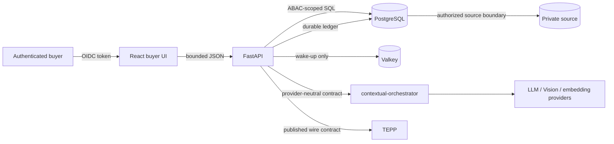
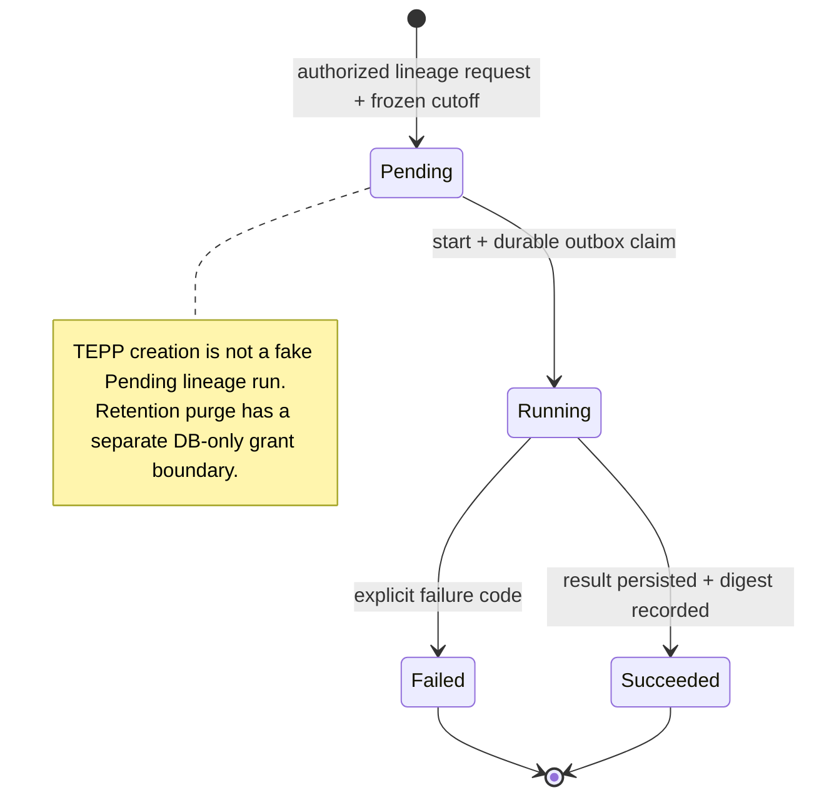
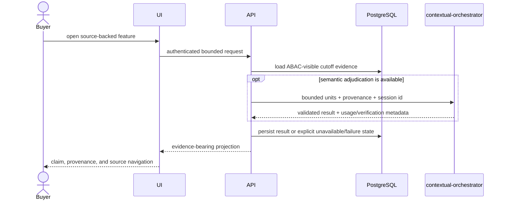

# Product, technical, and gap baseline

**Snapshot:** 2026-08-20 18:33 (Asia/Seoul)
**Protected-main baseline:** `origin/main`, product version `2.12.5`  
**Audited PR head:** #258 at `f8d2fa98d622e4294cf08f24a87a7db697479f4f` (semantic source-unit boundaries and the preceding queue, ontology, and review fixes)
**Active PR update:** The current #258 head has local backend `716 passed, 16 skipped`
and frontend lint, 129 tests, build, and Storybook build passing; protected-main
runtime evidence, formal approval, and required GitHub Checks remain pending.
**Purpose:** connect the normative ADRs and research evidence to product
requirements, technical contracts, implementation evidence, and active PRs.
An active PR is proposed work, not shipped behavior.

## PRD

### Problem and outcome

Buyers need to turn scattered, timestamped records into reviewable branching
histories without confusing a plausible relation with a proven fact. The
product succeeds when an authorized buyer can move from an aggregate signal or
answer to its source post, lineage neighborhood, channel evidence, actor and
project context, while every derived claim retains provenance and an explicit
availability boundary.

### Users and jobs

| User | Job | Success evidence |
|---|---|---|
| Buyer | Find a relevant customer, project, event, commitment, or Keyman and inspect its history | Browser navigation reaches an authorized source-backed post and focused lineage |
| Analyst | Reconstruct a cutoff-bounded lineage and inspect why edges were selected | Persisted run, digest, edge scores, channel breakdown, and status history |
| Operator | Import, rebuild, retry, and diagnose without inventing unavailable results | Durable ledger/outbox state and explicit failed/unavailable status |
| Retention admin | Purge run-bearing evidence only under a deliberate grant | Database role plus unrevoked retention grant; no public purge route |

### Scope

In scope: authorized source import, semantic units and visual regions,
multi-channel lineage reconstruction, source-grounded ontology/provenance,
period reports, Board/Global Ask/Calendar/Customer/Keyman navigation, TEPP and
contextual-orchestrator integration, and buyer-visible evidence.

Out of scope: TEPP model reimplementation, raw provider calls, locally chosen
models, forced links for missing channels, public real-data fixtures, and
claims that an unmerged PR or historical runtime observation is live behavior.

### Product measures

- Every displayed derived claim can navigate to authorized evidence or is
  labeled unavailable.
- No relation crosses the analysis cutoff or caller ABAC boundary.
- Missing model, embedding, TEPP, Vision, or verification channels are dropped
  and weights renormalized; no placeholder score or actor is invented.
- A real-stack acceptance run covers login, PostgreSQL-backed API behavior,
  buyer navigation, and aggregate non-identifying evidence.

## Functional specification

| ID | Requirement and acceptance criterion | Normative source | Current evidence |
|---|---|---|---|
| FR-01 | Import authorized records while preserving immutable source identity, raw state, publication state, and revisions. No real record enters git. | ADR 0001, 0040, 0046, 0056-0059, 0068, 0089 | Import/reconciliation modules and migrations; private runtime evidence only |
| FR-02 | Derive paragraph/list/table/image-region semantic units without replacing the source representation. | ADR 0061, 0062, 0066, 0067, 0077, 0087, 0091 | Chunking, image-content, visual-region and embedding paths |
| FR-03 | Reconstruct backward-only candidate edges from available channels, fuse through RankWeave, apply a minimum floor, persist scores, and assemble trees through ThreadWeave. | ADR 0024, 0064, 0084 | `lineageweave/reconstruct.py`, channel clients, reconstruction tables/tests |
| FR-04 | Create, start, observe, and retain analysis runs with cutoff snapshots, append-only status, outbox delivery, authorization, and explicit failure. | ADR 0013-0023, 0025 | Backend analysis-run modules, migrations, API tests |
| FR-05 | Keep TEPP as a versioned external measurement boundary; failed or unused responses never become invented theta. | ADR 0003, 0022 | `tepp_client.py`, report and start contracts |
| FR-06 | Resolve actors, organizations, projects, roles, and relationships without collapsing ties or same-name mentions; preserve catalog identifiers on role rows. | ADR 0004-0012, 0018-0019, 0026-0027, 0036 | Summary, entity-resolution, KG and report paths/tests |
| FR-07 | Global Ask and buyer surfaces retrieve only authorized evidence and let cited results open the relevant post/lineage context. | ADR 0032, 0037, 0039, 0041-0044, 0047, 0053-0055, 0075, 0078, 0090 | Main has the earlier surfaces; PR stack #258-#301 proposes the integrated navigation/evidence flow |
| FR-08 | LLM, structured output, embedding, and Vision work crosses contextual-orchestrator with one post session and bounded provenance; provider/model/protocol selection stays upstream. | ADR 0030, 0045, 0052, 0070-0077, 0079, 0081-0088 | Orchestrator clients, Compose boundary, historical gateway observations |
| FR-09 | Period reports use real fast-mlsirm results; missing cells remain missing and leftover pairs are residual-derived and navigable. | ADR 0003, 0034-0035, 0048-0050 | Historical authenticated report rebuilds; report tests and schema |
| FR-10 | Standard provenance uses normalized PROV-O relations; qualified influence implies its unqualified relation and KG edges remain a navigation projection. | ADR 0011, 0065 | PROV-O implementation matrices, ontology, CI contract |
| FR-11 | Post summaries expose evidence-bearing events and R&R. Requester/processor actions are nullable and may only name actors already bound to the same post summary. | ADR 0052, ADR 0100 | Commit `15e1a378` is on PR #258; one authorized target refresh stored three action rows, while corpus-wide buyer-data acceptance remains unproven |
| FR-12 | A hierarchy-enrichment timeout leaves the source-grounded summary readable and the actor unbound; it never creates a guessed catalog identity. | ADR 0101, ADR 0010, ADR 0026 | Commit `1c260f20` contains the boundary, ADR, and focused test; independent review, protected-main merge, and fresh runtime evidence remain pending |

## TRD

### Runtime components and trust boundaries

- PostgreSQL is authoritative for normalized product state, run snapshots,
  provenance, status, and durable work ledgers. Valkey is not the source of
  truth.
- FastAPI applies authentication and ABAC before projecting records or edge
  endpoints. The browser receives bounded projections, not raw source bags.
- contextual-orchestrator owns provider capability discovery, reasoning
  effort, structured synthesis/repair, sessions, and cost lineage.
- ThreadWeave, RankWeave, TEPP, and fast-mlsirm are reused at their published
  boundaries; LineageWeave does not clone their algorithms.

### Analysis-run lifecycle UML

### Evidence sequence UML

### Non-functional requirements

| ID | Contract | Verification |
|---|---|---|
| NFR-01 | OIDC authentication, endpoint ABAC, no public retention purge, no repository secrets | authorization-specific API tests and Compose identity-boundary check |
| NFR-02 | Bounded row, batch, browser, image, and MCP payloads | boundary unit tests plus real-stack response-size observation |
| NFR-03 | Third-normal-form identities and provenance; database constraints enforce integrity | migration/schema tests against PostgreSQL |
| NFR-04 | Python 3.12+ project-local environment; pinned Node/pnpm and Rust toolchain; checked lockfiles | clean-environment backend/frontend builds |
| NFR-05 | Synthetic fixtures only; runtime validation returns aggregate, non-identifying evidence | repository scan and evidence-document review |
| NFR-06 | ADR-first architectural change and paper-grounded model policy | ADR link check and review; unsupported policies remain unavailable |

## Current aggregate data and runtime evidence

Observed from the running local Compose stack without selecting a post title,
body, source code, person, organization, or identifier:

| Evidence | Observed result |
|---|---|
| Stack availability | PostgreSQL, Valkey, and contextual-orchestrator healthy; backend and frontend running; backend `/healthz` and frontend `/` returned HTTP 200 |
| Source boundary | 43,839 source posts: 43,814 have both source-system and source-record identity; 25 lack that import identity |
| Source state/body | 43,814 rows carry source-state evidence; 43,438 rows have a non-empty body; 87,297 source revisions persist |
| Derived content | 562,394 semantic units, 1,308 live lineage edges, 48 KG navigation edges, and 95 persisted summaries |
| Run registry | Three runs: one lineage, one report, one TEPP; latest states are two Succeeded and one Failed |
| Run evidence | One snapshot with 42,577 members; one persisted reconstruction with 1,281 edges; zero persisted TEPP results |
| Requester/processor | `post_summary_action` exists with composite actor foreign keys; one authorized target refresh stored three action rows |
| Summary refresh | One authorized target request returned HTTP 200 with contract v5, four key events, one role, three actions, and one project |
| Authentication | Real synthetic-user OIDC login, live JWKS fetch, and RS256 verification passed |
| Authorization | Unauthenticated `/api/analysis-runs` and `/api/posts` returned 401; four focused live-Keycloak/PostgreSQL API tests covering authenticated account, list ABAC, direct deny, and missing token passed |
| Focused contracts | Post-summary and transaction-contract tests: 31 passed, 1 skipped; the skip is not runtime proof for the skipped capability |

These observations prove data presence and the listed boundaries only. They do
not prove a browser-clicked buyer journey, current TEPP transport success,
post-summary-action population across the corpus, or equivalence between every
running container image and the PR head. The target refresh is bounded runtime
evidence for one authorized post, not a corpus-wide acceptance claim.

## Active PR audit

The following table is the historical 17:08 snapshot; it is retained to show
why the dependency graph was recorded, not as current merge evidence. Queued
checks and review gates mean none of those rows was protected-main truth.

| PR | Proposed increment | Base → head | Snapshot state |
|---|---|---|---|
| #301 | Global Ask knowledge cutoff | `#264 stack` → `v2.23.0` | Ready / UNSTABLE |
| #298 | bounded async lineage LLM rebuild | `#276` → `v2.22.0` | Ready / UNSTABLE |
| #287 | exact Event Lineage channel evidence | `#276` → feature | Ready / UNSTABLE |
| #286 | exact byte-bounded MCP browser admission | `#270` → fix | Ready / UNSTABLE |
| #285 | project lifecycle timeline | `#264 stack` → `v2.18.4` | Ready / UNSTABLE |
| #282 | TEPP project history in read/Ask | `#264 stack` → `v2.18.0` | Ready / UNSTABLE |
| #276 | public verification of Global Ask claims | `#266` → `v2.20.0` | Ready / UNSTABLE |
| #275 | evidence-bound Event Intelligence | `#270` → `v2.18.3` | Ready / UNSTABLE |
| #270 | authenticated MCP Global Ask | `main` → feature | Ready / BLOCKED / review required |
| #266 | Event Lineage to Keyman focus | `#264` → `v2.19.0` | Ready / BLOCKED / review required |
| #264 | keep Event Lineage DAG focus | `#263` → `v2.17.0` | Ready / BLOCKED / review required |
| #263 | Ask citation to Event Lineage | `#262` → `v2.16.0` | Ready / BLOCKED / review required |
| #262 | Customer post to Event Lineage | `#261` → `v2.15.0` | Ready / BLOCKED / review required |
| #261 | Calendar commitment to Event Lineage | `#260` → `v2.14.0` | Ready / BLOCKED / review required |
| #260 | Weekly VOC to Event Lineage | `#258` → `v2.13.0` | Ready / DIRTY / review required |
| #258 | buyer evidence board and ontology surface | `main` → feature | Ready / BLOCKED |
| #192 | plural affiliation next action | `main` → `v0.77.0` | Ready / DIRTY / review required |
| #190 | duplicate-numbered entity-resolution ADR | `main` → docs | Ready / BLOCKED |

The dominant delivery topology is a long dependent stack rooted at #258 and
then #260-#266. Parallel descendants (#275, #282, #285, #276-#301) are based
on intermediate heads rather than one integration head. Green checks on a
child do not prove that the stack is mergeable or that the behavior exists on
main.

Manual triage of #258's four unresolved scanner threads found literal SQL in
`entity_relationship_ingestion.py` and `demo_scope.py`; request-derived entity
ids are passed as `$1` arguments rather than interpolated. This is evidence for
a likely narrow false-positive suppression, not authority to dismiss the
findings: the required security workflow and independent reviewer must accept
the exact-head disposition.

## Current exact-head audit: 2026-08-20 18:47

The active stack was re-fetched after each normal branch update. The current
heads are: #258 `f8d2fa98d622e4294cf08f24a87a7db697479f4f`, #260
`dfd95d9cd98b0ea8a51136b5f6615077b837ff1d`, #261
`bd1b4d2fbb53978b5c231b4aa00531632604f6ec`, #262
`80445b8acffb356f42a4e8ae4a7b3a1d24b07cb2`, #263
`d670acd51eb24c6fcf235f9681018d8ce45b19b4`, #264
`d5dbdf711121384199d5f586a06f5fd04dd32251`, #266
`26a6d9c61c7a7c8b52c924858a362c728f67a320`, #270
`3a24c6b774bcfdd539e7e01d11195ce1887e6f12`, #275
`35035783fae5f1e6763b38dbb6daf3d86934fdf5`, #276
`635420d29c1637718d7f9ea985b7940ef74a4cac`, #282
`6eeaf89de45f8f236858164bd211b21f5fddb7c4`, #285
`4eaeb2305f91fd0d339845bda4b6b23a93cadc11`, #286
`1175cd9db3fdabb6b31179808092bf058e8cd536`, #287
`554efb9b047b37c9027296116aa393d94fce6b4b`, #298
`49c9976fa6ee3792b9adae5b8132365a67c9bb15`, #301
`59ccdf91bfddfe885be775b5c466819f5350baf5`, #302
`40b0a8ea22ff7fb6de5419feefaa244cca3070f5`, #303
`2702fd69ab6000fc6c7bc6cf9ed5d3dfdb362970`, #306
`e0dbc3860278e13d74b6dadd5be4fd75e9c107b1`, #307
`313d38a4b58b99aaca279607486684ac04582de5`, #308
`3c74f1fa536cff3987f38139303f06cd48a8d9c7`, and #309
`e6fd907ed36d1228729c0df8d6cd22f603051891`.

Twenty-four PRs are open in the repository, including the 22 PRs listed above
from #258 onward. At this audit no PR had a formal `APPROVED` review. Required
checks for the updated heads were still queued or otherwise non-terminal, with
no completed failure used as merge evidence. This is a gate state, not a merge
claim. The parallel buyer-surface branches were also checked for ADR identity
collisions: #308 owns ADR 0112 and #309 owns ADR 0113.

Local regression evidence for the newly audited branches includes #303 backend
focused image/persistence/static-SQL tests `49 passed`, #303 frontend `135
passed`, #306 frontend `130 passed`, #307 frontend `131 passed`, #308 full
backend `723 passed, 16 skipped` plus a focused normalization regression `5
passed`, and #309 frontend `133 passed`. These are branch-local observations
and do not replace protected Checks or independent review.

## Gap register

| Priority | Gap | Evidence | Closure criterion |
|---|---|---|---|
| P0 | No protected-main integrated buyer journey for the active feature stack | Main is 2.12.5; 24 open PRs span dependent and parallel bases | Establish one reviewed integration order, update each exact head, pass required checks, merge without bypass, then run login-to-source browser acceptance on main |
| P0 | Current runtime proof is incomplete | The current aggregate/OIDC/ABAC checks cover data presence and selected boundaries; 2026-08-18/19 notes cover other slices, but no evidence set proves the entire PR head or main journey | Complete the real-stack matrix on an exact revision: browser login/navigation, Ask, reports, Vision, TEPP availability, action population, and cleanup |
| P0 | PR #190's duplicate ADR identity was corrected but is not protected-main truth | Active PR head `ac1b4e17` now uses ADR 0038 and aligns the entity-resolution claims with implementation; independent review and Checks remain pending | Re-audit exact head, obtain independent approval, pass required Checks, and merge normally; never merge a duplicate ADR identity |
| P0 | PR #258 is not review/CI complete at its exact current head | #258 is mergeable but BLOCKED: 14 of 22 checks queued, no approval, and four unresolved scanner threads on two SQL modules | Classify each finding against the literal SQL and bound arguments; fix a real flow or add a narrow documented suppression for a false positive, resolve threads, obtain independent approval, and re-check the exact head |
| P1 | Requirements were implicit across ADRs and architecture phases | No prior PRD/TRD/requirement traceability baseline existed | Keep FR/NFR IDs in this document linked from ADR index; require new product PRs to name affected IDs and runtime evidence |
| P1 | Active PR topology obscures release truth | The current 24-PR snapshot contains blocked, unstable, and unknown merge states; many bases are other open branches | Publish a dependency order, retire obsolete/duplicate branches, and avoid version claims until their base chain reaches main |
| P1 | ADR 0100 is exercised only by a bounded target, not accepted across the corpus | Commit `15e1a378` and the v5 contract are on PR #258; one authorized target refresh stored three action rows, while corpus-wide accepted/dropped/absent counts remain unknown | Regenerate an authorized bounded sample, report aggregate accepted/dropped/absent counts, verify source evidence and actor FKs, then exercise the buyer popup without exposing record content |
| P1 | ADR 0101 is active-PR behavior but not protected-main behavior | Commit `1c260f20` contains the corrected ADR link, boundary, and focused tests; independent review and protected-main merge remain pending | Re-audit the exact head, obtain independent approval, pass required checks, merge normally, and collect fresh runtime evidence |
| P1 | ADR status vocabulary is inconsistent and sometimes stale | Several ADRs say “Accepted on this active PR; not protected-main truth” even after branch evolution | Add a mechanical ADR status/link audit that distinguishes Proposed, Accepted-on-PR, Accepted-on-main, and Superseded |
| P2 | ADR numbering skips 0031 and 0093-0097 while file 0092 titles itself ADR 0031 | File identity and displayed identity differ | Correct the 0092 title or document an intentional alias; reserve or explain skipped numbers in the index |
| P2 | Product measures lack explicit targets | Research supports evidence boundaries but not universal model-quality thresholds | Define targets only from an approved evaluation protocol and authorized labeled aggregate dataset; do not invent accuracy goals |
| P2 | UML covers core trust/lifecycle flow but not every buyer navigation branch | Architecture and PR stack evolve faster than diagrams | Add diagrams only when a stable main integration makes a flow materially distinct; keep this baseline small |

## Verification matrix

| Scope | Evidence available now | Claim allowed now | Missing proof |
|---|---|---|---|
| Protected main | `origin/main` manifests show 2.12.5 | Existing main contracts only | Fresh main runtime matrix |
| Historical local runtime | Authenticated PostgreSQL report rebuilds and orchestrator/Vision observations dated 2026-08-18/19 | Those exact bounded observations | Current head/main equivalence and full browser journey |
| Active PRs | GitHub head/base, review, merge, check, and review-thread states at snapshot | Proposed increments and gate state | Normal merge and post-merge runtime behavior |
| Local PR checkout | PR #258 was re-fetched at `f8d2fa98d622e4294cf08f24a87a7db697479f4f`; its backend suite passed `716`, with `16` integration skips | Only the exact observations in the current-data table; no claim for protected-main behavior | Full suite/CI, browser journey, external channel results, review, merge, and corpus-level action evidence |

## Maintenance rule

ADRs remain normative. This document is the product/technical traceability
projection: update the affected FR/NFR row and Gap closure evidence when an ADR
or PR changes product behavior. Never turn a PR title, green unit test, or old
runtime note into a shipped/live claim.
## Checkpoint update: 2026-08-20

### Project-bound major-event actions

The buyer-facing action projection now carries an optional normalized project
key and persists it only when the same post has a matching
`post_project_mention`. An action that cannot be grounded to a project remains
unbound rather than being guessed from its title, customer, PU, sales pool, or
author hints. This closes the mixed-project event ambiguity at the persistence
boundary while preserving legacy unbound actions.

- Implementation: PR #308, `fix/project-bound-summary-actions`
- Decision record: ADR 0111
- Local evidence: backend `719 passed, 16 skipped`; focused migration regression
  `7 passed`; frontend lint, tests, and build passed before publication.
- Integration status: PR #308 is stacked on the buyer-surface branch and is not
  a protected-main merge claim.

### Provider sampling capability gap

The observed gateway failure for an Azure GPT-5-family deployment was a
provider capability rejection of non-default `temperature`, followed by an
unrelated fallback-group failure. The product contract must not select a model
from a local name or fallback table. `contextual-orchestrator` PR #774 adds a
single retry without the rejected optional field for HTTP 400/422 across Chat
Completions, Responses, and raw/proxy transport, while retaining the same
provider and orchestration session.

- Upstream decision record: contextual-orchestrator ADR 0012
- Upstream local evidence: provider protocol and integration tests `16 passed`;
  `git diff --check` passed.
- Integration status: PR #774 is stacked on the paper-grounded orchestrator
  branch; it is not yet evidence of protected-main integration.

LineageWeave must continue to send model, reasoning-effort, protocol, and
VISION selection through contextual-orchestrator. Until the upstream contract
is integrated into the runtime base used by LineageWeave, this gap remains
open for deployment acceptance.

### Project-bound summary-event checkpoint

The mixed-project summary gap is now addressed in the buyer contract. Summary
key events retain the legacy text list, while `key_event_details` carries the
resolved project display name. Persistence stores only a `project_key` that
passes the same-post `post_project_mention` foreign key; ambiguous or
unsupported proposals remain unbound.

- Decision record: ADR 0112
- Schema change: migration 0102
- Buyer surface: project labels are rendered without exposing internal keys
- Evidence: parser, transaction, real PostgreSQL projection, schema, frontend
  lint, and frontend test checks pass on the checkpoint branch

### Verification update

The integrated `60b52f26` checkpoint passes the full backend suite: `723 passed,
16 skipped`, with no test failures. Frontend lint, `131 passed`, and production
build also pass. Four existing dependency deprecation/security warnings remain
non-failing and are not reclassified as product evidence.

## Stale-summary continuity checkpoint: 2026-08-20

The private PostgreSQL runtime showed three inspected target rows with summary
contract versions `2`, `5`, and `5`, while the current contract is `6`. The
same aggregate inspection found persisted 5W1H rows for the two newer rows,
but a current-contract read rejected their older summary projections and
re-entered the live LLM path. This made a temporary gateway failure look like
missing product evidence even though the source body and prior projection
still existed.

ADR 0114 now keeps the default current-contract boundary, but permits the
summary endpoint to return an explicitly labelled stale projection when a
refresh is unavailable or incomplete. The buyer popup shows the saved-summary
state and exposes a retry action; a successful contextual-orchestrator refresh
still performs the only replacement. No private post identifiers or body text
are recorded here.

## Post-content recovery checkpoint: 2026-08-20

The operator backfill path now finalizes the post-content job ledger in the
same transaction as persisted semantic units. A successful synchronous
backfill therefore cannot leave a terminal failed job beside successful
buyer-visible content.

- A bounded private run processed four authorized posts, persisted 89
  embedding rows, and produced one image description with one region artifact.
- The same run persisted one footnote unit and resolved all inspected text
  structure decisions.
- A table-shaped post produced 45 semantic units, including 14 table-row
  units, and its ingestion ledger ended in `succeeded` with an operator audit
  event.
- These are bounded runtime observations only; they do not establish
  corpus-wide parser accuracy or protected-main behavior.

The explicit terminal retry and ledger-finalization contract is recorded in
ADR 0115. PR #311 remains an active stacked delivery candidate; its required
checks and formal approval must be rechecked at the exact current head before
any protected merge claim.

## Source-only indentation checkpoint: 2026-08-20

The semantic-unit parser now keeps source leading whitespace and declared
HTML/CSS/OOXML or list-container indentation as separate evidence. Visual
alignment alone cannot become an `explicit` hierarchy level; it is sent to
contextual-orchestrator when available and otherwise remains `unresolved` at
level zero. This prevents mixed editor exports from manufacturing deep list
nesting in the buyer view.

- Decision record: ADR 0103
- Implementation: PR #319, stacked on the adjacent-table correction in PR #317
- Local evidence: backend `731 passed, 16 skipped`; frontend `134 passed`, lint,
  build, and Storybook build passed.
- Integration status: PR #319 is not protected-main truth; exact parent head,
  formal review, terminal Checks, and post-merge browser evidence remain
  required.

## Partial visual-region checkpoint: 2026-08-20

The visual locator contract may return valid salient panels without complete
image coverage. The normalizer now keeps those panel coordinates for
region-level OCR and embeddings, then analyzes the original parent image once
so uncovered text is not silently lost. Empty or invalid locator output keeps
the existing whole-image fallback.

- Decision record: ADR 0104
- Implementation: PR #320, stacked on PR #319
- Local evidence: backend `731 passed, 16 skipped`; focused image/normalization
  tests `39 passed`; frontend lint, `134 passed`, build, and Storybook build
  passed.
- Integration status: PR #320 is not protected-main truth; exact stack heads,
  formal review, terminal Checks, and authorized post-merge image evidence
  remain required.

## Current exact-head audit: 2026-08-20 continuation

The protected GitHub state was re-read after the embedding and visual-region
checkpoints. These are gate observations, not merge claims. A blank review
decision means no independent approval was observed; `UNSTABLE` and `BLOCKED`
are not release evidence.

| PR | Base -> head | Exact head | Review/check state |
|---|---|---|---|
| #258 | `main` -> `feat/analysis-run-name-evidence-lineage` | `49804b0fef503be1697b8be61919b022b615ef2f` | `REVIEW_REQUIRED`, `BLOCKED`; no independent approval observed |
| #323 | `main` -> `fix/tepp-request-contract-validation` | `1a27efec6863cd3439a4c6023e1c625ce4d7abf2` | `REVIEW_REQUIRED`, `BLOCKED`; required Checks queued |
| #322 | `fix/stale-summary-buyer-continuity` -> `feat/orchestrator-owned-embedding-consumer` | `a6a1d8fe8b17ad095e507f5d16b93c984e6de5db` | `UNSTABLE`; Full test and frontend Checks queued |
| #320 | `codex/normalize-source-indent-semantics` -> `codex/preserve-partial-image-regions` | `41d164c570fe232cc1e38a766439e4093d80cb84` | `UNSTABLE`; stacked visual evidence change |
| #324 | `codex/preserve-partial-image-regions` -> `fix/validate-partial-image-regions` | `3a335ad493a260c5f623797288138472a15210cb` | `UNSTABLE`; Full test and frontend Checks queued |
| #325 | `fix/validate-partial-image-regions` -> `docs/current-gap-audit` | `ec47fbfac5a02ed58980dace6180da5af6e9f5a3` | `UNKNOWN`; Full test, frontend, and Devin Review pending |
| #789 | `main` -> contextual-orchestrator embedding capability branch | `3a80d91b8c879e57d30ab87af664546b8712fb15` | `REVIEW_REQUIRED`, `BLOCKED`; upstream Checks queued |

The current implementation checkpoints are local/branch evidence only:
The LineageWeave consumer-side embedding model discovery change is proposed in
PR #322; its ADR 0118 is intentionally not claimed as present on this stacked
branch. Visual locator validation is stacked in #324. Exact-head OpenCode review requests were
issued for #258, #322, #323, #324, and upstream #789. No protected branch was
approved, force-pushed, or merged from this audit.

This update supersedes neither the historical PR table nor the closure
criteria above; it supplies the current gate snapshot needed before the next
review -> fix -> Checks -> merge decision.

## Locator-bound validation checkpoint: 2026-08-20

The partial-region path now rejects non-finite, zero-sized, negative, and
out-of-bounds locator boxes before crop or persistence. Valid panels remain
independently searchable; if every returned box is invalid, the existing
parent-image fallback preserves an honest image-level outcome.

- Decision record: ADR 0104
- Implementation: PR #324, stacked on PR #320
- Local evidence: normalization module branch coverage `100%`; focused image,
  persistence-edge, and normalization tests `52 passed`.
- Integration status: PR #324 is not protected-main truth; its exact current
  head, formal review, terminal Checks, and browser evidence remain required.
