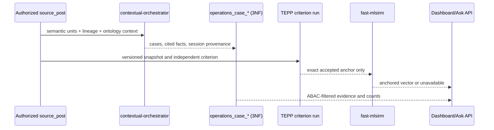

# Product & Technical Gap Baseline

## Exact-head development audit — 2026-10-02 18:55 KST

This dated snapshot supersedes earlier present-tense claims for the named
heads. GraphQL pagination covered all **181 open PRs** before this loop's
new candidate: **167 drafts**, **116 non-main bases**, and **46 PRs with at
least one unresolved review thread**. File lists were complete for all 181;
review lists were bounded metadata, not a full code review of every draft.
The open-issue inventory contained **43 issues**. Creating #1144 adds one
draft and one non-main base; a fresh inventory is required before using those
counts as current. Protected `main` was independently checked through Git
and GraphQL at `83eba56149eb802cd63642c507c324c9976ec78e`.

All 14 ready PRs remained BLOCKED with normal squash auto-merge armed. The
following rollups include check runs and legacy status contexts; every check
run's commit matched its PR head, and each context list was complete. No
pending context was visible in this read. Skips and cancellations are not
passes; dispatcher status contexts do not replace required review verdicts.

| PR | Audited exact head | Hosted contexts | Review / delivery |
| ---: | --- | --- | --- |
| #1143 | `ad7c7a154daad51d0125e81bfcdbd6b2f4498b67` | 28 success; 7 failure; 1 cancelled; 7 skipped | REVIEW_REQUIRED; BLOCKED; auto-merge armed |
| #1142 | `921f2df9629b8fbdef707b04469b45b2a1ed6299` | 26 success; 1 failure; 0 cancelled; 20 skipped | REVIEW_REQUIRED; BLOCKED; auto-merge armed |
| #1141 (pre-update) | `6fded5035e473121f63862507c0825fb89bdc88a` | 25 success; 0 failure; 0 cancelled; 11 skipped | unverified; BLOCKED; auto-merge armed |
| #1139 | `421324c1b29d315d1987f69c3c16ce18a4330924` | 33 success; 8 failure; 0 cancelled; 6 skipped | REVIEW_REQUIRED; BLOCKED; auto-merge armed |
| #1137 | `4344d4dcb80fa08971c33f2f7df912d389dc7c61` | 32 success; 7 failure; 0 cancelled; 5 skipped | REVIEW_REQUIRED; BLOCKED; auto-merge armed |
| #1136 | `55f6992637c53cfb51a74f55987a40b359152bd5` | 30 success; 7 failure; 1 cancelled; 9 skipped | REVIEW_REQUIRED; BLOCKED; auto-merge armed |
| #1135 | `73ba540789d2f2210a17e7eb5396270dafa66589` | 31 success; 7 failure; 0 cancelled; 6 skipped | REVIEW_REQUIRED; BLOCKED; auto-merge armed |
| #1133 | `1420a733eb30cea5198dffc2ae08734c9cfe521e` | 36 success; 6 failure; 1 cancelled; 14 skipped | REVIEW_REQUIRED; BLOCKED; auto-merge armed |
| #1131 | `ee3d8890ce3b7829f668e05732ef55d24e2e688e` | 26 success; 0 failure; 0 cancelled; 11 skipped | REVIEW_REQUIRED; BLOCKED; auto-merge armed |
| #1130 | `383c392bc6713e55bed31b4d4053d93cfd1885d0` | 33 success; 7 failure; 0 cancelled; 11 skipped | APPROVED; BLOCKED; auto-merge armed |
| #1129 | `24d3b9cb1bc31f951da3879774013c97b415ecdf` | 32 success; 7 failure; 0 cancelled; 5 skipped | REVIEW_REQUIRED; BLOCKED; auto-merge armed |
| #1128 | `91143146623948dbd26bbfc1c69de3cd77d2ae06` | 32 success; 3 failure; 0 cancelled; 9 skipped | REVIEW_REQUIRED; BLOCKED; auto-merge armed |
| #1126 | `c0c5204b702d2d4d24928389db7d04ebe5cb9739` | 28 success; 2 failure; 8 cancelled; 9 skipped | REVIEW_REQUIRED; BLOCKED; auto-merge armed |
| #1040 | `4d74c32a23cdc254cf5f4d4e72804fe54aa0f1af` | 31 success; 4 failure; 0 cancelled; 13 skipped | APPROVED; BLOCKED; auto-merge armed |

GitHub reports APPROVED on #1130 and #1040, whose exact-head approvals came
from the independent review bot; both remain blocked by other gates. #1131
has no failed context but still reports REVIEW_REQUIRED. No protected merge
SHA was observed. The live central ruleset read requires one approval,
resolved threads, and seven central workflows. The classic branch-protection
endpoint returned 404; that does not remove the active ruleset. Its final
re-read and the repository no-force ruleset detail became unavailable through
REST rate limiting, so no merge decision relies on an inferred policy change.

The #1141 row is explicitly the **pre-update** head. This documentation repair
changes its head; its old Checks and review evidence do not transfer. The
remaining valid review asks for ordinary text beginning `PR #1139`, rather
than a malformed heading beginning `#1139`; the current occurrences are fixed
in this update. The #1136 generation-fencing review and #1135 source/import
reviews were already addressed in their fetched code, so no duplicate repair
was applied. Draft changes-requested reviews were examined separately from
current-head verdicts; an administrative coverage verdict without a concrete
source finding was not treated as an application defect.

### Selected customer gap and candidate proof

PR #1144, exact implementation head
`18a8ee76d3edcbd79c92a5e845f51d1ce996f840`, verified against its remote
branch, repairs
work-evidence search results that could be replaced by an earlier success,
denial, or continuation. It also clears earlier evidence when the reader or
knowledge cutoff changes. This gap was selected because a result from the
wrong search or reader can mislead the evidence-review job in PRD-FR-2/5;
no numeric prioritization weight or population claim was constructed.

Eleven new behavioral regressions fail on the preceding implementation;
all **16 component tests** pass with the repair. The full frontend suite
passes **541 tests in 58 files**. Lint, production build, and Storybook build
pass; the existing >500 kB application chunk warning remains visible, with
issue #994 owning the broader bundle gap. Related search, ontology, SHACL,
and documentation checks pass **61 tests**. Six synthetic PostgreSQL tests
prove primary-Voice A → B → A cutoff and concurrent history behavior; they
are not authenticated additional-Voice API acceptance.

The existing Storybook and tokens were reused. The superseded-search story
completed the earlier search last at **1440×900** and **390×844**. Both rendered
only the later result, with no horizontal overflow or page error. Visual
inspection initially found compressed, colliding mobile evidence text; the
candidate now separates the label, family, next action, and verbatim evidence
into wrapping lines with existing spacing and touch-target tokens. The final
desktop and phone screenshots were visually inspected. These are synthetic
candidate renderings, not a deployed authenticated customer screen.

The child stays Draft on #1137's patched dependency-floor branch. Protect and
merge #1137 first, retarget #1144 to `main`, then collect fresh exact-head
checks and review. The new candidate changes no API payload, database schema,
migration ordinal, package version, mathematical kernel, or provider route.

### Authority and cross-PR reconciliation

The LineageWeave PRD was read before the loop. Current ecosystem authorities
were retrieved from the remote: RankWeave `ARCHITECTURE.md`, ThreadWeave
`docs/PRD.md`, TEPP's approved v0.4 PRD, fast-mlsirm `docs/PRD.md`,
contextual-orchestrator `docs/product_planning.md`, and DiskSage's approved
design specification. These documents describe owned product boundaries;
open PRs and local tests do not promote design or research into delivery.
GitHub confirmed canonical names `ContextualWisdomLab/LineageWeave`,
`RankWeave`, `ThreadWeave`, `TEPP`, `fast-mlsirm`, `contextual-orchestrator`, and
lowercase `disksage`. The candidate corrects the latter in the PRD register.

ADR 0246's twelve atomic Voices and extensible combinations remain separate
from ADR 0251's I/O-Psychology constructs. ADR 0256 governs additional-Voice
PROV-O derivation, truth, and evidence; ADR 0265 actually governs occupational
construct search. The PRD's older ADR-number references remain a known
reconciliation task (#807), not replacement authority. No fixed combination
code, B2B2C restriction, inferred weighting, local numerical model, or hidden
Post substitution was introduced. The AA1000/ISO/stakeholder and W3C sources
remain normative/supporting evidence only within their cited contracts.

Complete PR file inventories exposed **16 ADR ordinal/name reuse candidates**
and **three forward-migration ordinal/name reuse groups**, excluding rollback
files. Examples requiring substantive reconciliation before integration:

- ADR 0272 differs across #1009, #888, and #850/#802; ADR 0300 differs across
  #899 and #857/#837; ADR 0301 differs across #902 and #838.
- Migration 0248 differs between #1049 and #929. Migration 0249 differs
  between #1127 and #1047. #929 also proposes several 0247 files.
- Protected `main` already ships two forward 0233 files. Preserve shipped
  history and follow issue #1048's successor/ledger boundary; do not rename
  deployed files or discard either feature during a merge.
- Eight release-fragment version reuse groups include 2.28.1 (#1079/#1009)
  and 2.29.0 (#899/#897/#802). Shared fragment versions alone are not proof
  of incompatible release identity; inspect package/runtime versions and
  each release contract before deciding. No release number was allocated
  by this candidate.

The ready-head integration overlaps remain #1133/#1137 dependency files,
#1129/#1143 Voice export/ADR 0256, and multiple gap-baseline writers.
#1139 contains #1137 in its ancestry; #1138 remains its explicit child.
#1132 remains on #1131. Parents must land through protection before children
are retargeted; no predecessor approval or Check transfers. Other agents'
owned deltas and all existing features were preserved.

### Non-identifying runtime and load evidence

A read-only aggregate query of the official `lineageweave` PostgreSQL runtime
returned **43,189 source rows**, **43,189 Voice rows**, and **zero additional
Voice rows**. These are local diagnostic counts, not a probability sample,
customer-wide inference, or proof of multi-Voice delivery. No source title,
organization name, production key, or credential was returned or persisted.

The existing authenticated API fixture reaches PostgreSQL, Keycloak, and
Valkey but its password-grant token request fails with **HTTP 400** before
five selected API tests can run. The five-VU, 30-second k6 configuration fails
at the same authentication setup; it completes **zero workload iterations**
and enqueues no Ask job. Its single failed login duration is not application
latency, concurrency, error-rate, throughput, or capacity evidence. Issue
#1119 owns migration to the supported authorization-code flow; no local token,
identity-policy weakening, or model/provider fallback was introduced.

An idle resource snapshot saw no demonstrated bottleneck and provided no
worker saturation measurement; it is not an end-to-end load result. No
PostgreSQL, worker, Valkey, or gateway tuning was made without such a result.
Authenticated additional-Voice persistence/API, cutoff/truth authorization,
carrying-Post versus derivation-evidence UI/CSV, and paged JSON-LD multi-Voice
acceptance remain **unverified**. Earlier synthetic export tests do not satisfy
that runtime gate. No Voice acceptance criterion is marked complete.

REST rate limiting and a transient GraphQL 502 were handled with bounded
GraphQL reads and independent local work. No stale-run cancellation was made
without an exact PR/head/run comparison. No temporary container was created;
the exited database-migration container belongs to the official project and
was retained. No formal data volume was removed. Sequential Thinking and
Memory MCP tools were not exposed; Context7 transport and DeepWiki indexing
were unavailable, so they supplied no additional authority or validation.

## Exact-head continuation — 2026-10-02 16:58 KST (2026-10-02 07:58 UTC)

This snapshot supersedes earlier present-tense queue claims for the exact
heads in its table. A paginated read returned **181 open PRs**, **167 Drafts**,
**116 targeting a branch other than `main`**, and **43 open issues**. These
are GitHub workflow counts, not product-use or population evidence. `main` was
`83eba56149eb802cd63642c507c324c9976ec78e`. Each PR check summary below was
read from the check-runs for that exact head; skipped jobs are not successful
evidence. All 14 ready PRs targeting `main` had squash auto-merge armed after
the latest lifecycle read. Every one remained `BLOCKED`; no protected merge
SHA was observed.

| PR | Exact head on `main` | Exact-head checks | Review and merge state |
| ---: | --- | --- | --- |
| #1143 | `ad7c7a154daad51d0125e81bfcdbd6b2f4498b67` | 25 passed; 5 failed; 1 cancelled; 7 skipped | No head approval; blocked, auto-merge armed |
| #1142 | `921f2df9629b8fbdef707b04469b45b2a1ed6299` | 24 passed; Dependency Review failed; 20 skipped | No head approval; blocked, auto-merge armed |
| #1141 | `03bae18852a8426f5bab42a8af6d7cefae8b31bf` | 24 passed; 11 skipped; no pending or failed check | No independent approval; blocked, auto-merge armed |
| #1139 | `421324c1b29d315d1987f69c3c16ce18a4330924` | 30 passed; 6 failed; 6 skipped | No head approval; blocked, auto-merge armed |
| #1137 | `4344d4dcb80fa08971c33f2f7df912d389dc7c61` | 30 passed; 7 failed; 5 skipped | No head approval; blocked, auto-merge armed |
| #1136 | `55f6992637c53cfb51a74f55987a40b359152bd5` | 27 passed; 5 failed; 1 cancelled; 9 skipped | No head approval; blocked, auto-merge armed |
| #1135 | `73ba540789d2f2210a17e7eb5396270dafa66589` | 29 passed; 7 failed; 6 skipped | No head approval; blocked, auto-merge armed |
| #1133 | `1420a733eb30cea5198dffc2ae08734c9cfe521e` | 33 passed; 4 failed; 1 cancelled; 14 skipped | No head approval; blocked, auto-merge armed |
| #1131 | `ee3d8890ce3b7829f668e05732ef55d24e2e688e` | 24 passed; 11 skipped; no pending or failed check | No independent approval; blocked, auto-merge armed |
| #1130 | `383c392bc6713e55bed31b4d4053d93cfd1885d0` | 31 passed; 4 failed; 11 skipped | `cwl-noema-review[bot]` approved this head; independent human approval is unverified; blocked, auto-merge armed |
| #1129 | `24d3b9cb1bc31f951da3879774013c97b415ecdf` | 30 passed; 6 failed; Full test, Noema, and Strix were in progress; 6 skipped | No qualifying approval on the new head; `REVIEW_REQUIRED` / `BLOCKED`, auto-merge re-enabled |
| #1128 | `91143146623948dbd26bbfc1c69de3cd77d2ae06` | 30 passed; 3 CodeQL compatibility jobs failed; 5 skipped | No head approval; blocked, auto-merge armed |
| #1126 | `c0c5204b702d2d4d24928389db7d04ebe5cb9739` | 25 passed; 8 cancelled; 9 skipped | No head approval; blocked, auto-merge armed |
| #1040 | `4d74c32a23cdc254cf5f4d4e72804fe54aa0f1af` | 29 passed; 4 failed; 13 skipped | `cwl-noema-review[bot]` approved this head; independent human approval is unverified; blocked, auto-merge armed |

The queue's main shared failures remain the three CodeQL compatibility jobs,
OpenCode/Noema/Strix review workflows, and Dependency Review. These are not
application pass evidence. PR #1131 is the clearest green-check candidate, but
its independent approval remains unmet; its ordinary auto-merge stays armed.
The organization ruleset requires one approval, resolved review threads, and
seven central workflows. The separate repository ruleset prohibits
non-fast-forward updates. REST rate limiting began during the final refresh,
and the review-thread query did not cover these 14 PRs. Do not infer their
thread-resolution state or subsequent lifecycle changes from this snapshot.

### Voice export defect fixed on PR #1129

PR #1129's exact-value CSV already separated a Voice-carrying Post from its
derivation evidence. A focused regression test exposed that the two
Voice-specific columns were also populated for ordinary ontology relations,
where a Person or Organization endpoint could be mislabeled as the Post that
carries a Voice. Commit `24d3b9cb1bc31f951da3879774013c97b415ecdf` now fills
those fields only for a typed `hasVoiceAssignment` row; malformed typed rows
and all unrelated relations leave both fields blank. ADR 0256 records the
contract. The target worktree passed all 22 `ontologyLayout` tests, the full
frontend suite (543 tests across 58 files), frontend lint, production build,
and `git diff --check`. Existing bundle-size output still warns that one
production chunk exceeds 500 kB; issue #994 tracks that broader gap. These are
candidate-local checks, not protected-main evidence.

Hosted checks on the new #1129 head had six failures: the three CodeQL
compatibility jobs, OpenCode review, Noema review, and Dependency Review. Full
tests, Noema, and Strix were still running at the last exact-head read. Normal
squash auto-merge was explicitly re-enabled and re-read on this head. GitHub
then returned HTTP 403 rate limits, so later terminal check, review-thread,
independent-approval, and merge-state transitions remain unverified. The PR
remains blocked; its preceding head's evidence does not transfer.

### Authority, research, and cross-PR boundaries

The current LineageWeave PRD remains the supporting product contract and ADRs
remain normative. ADR 0246 preserves twelve atomic Voice classifications and
an open composition contract. ADR 0251's I/O-Psychology taxonomy remains a
separate domain; its references do not establish a finite Voice cross-product,
name classifier, person trait, or weight. ADR 0256's AA1000SES, ISO 26000,
ISO stakeholder guidance, and Mitchell, Agle, and Wood sources support
evidence-bearing, context-sensitive combinations, not a fixed exhaustive
enumeration. No such heuristic was added.

Canonical remote names were checked against GitHub: `ContextualWisdomLab/LineageWeave`,
`ContextualWisdomLab/RankWeave`, `ContextualWisdomLab/ThreadWeave`,
`ContextualWisdomLab/TEPP`, and lowercase `ContextualWisdomLab/disksage`;
the related owner repositories default to `main`. For #1133's RankWeave
release change, its current `ARCHITECTURE.md` and `README.md` were read because
RankWeave has no standalone PRD. The product-authority register also points
to ThreadWeave `docs/PRD.md`, TEPP's approved v0.4 PRD, and
contextual-orchestrator's product-planning and architecture documents.

The ready PRs are all based on `main`, but dependency ownership still matters
when their deltas combine. #1133 and #1137 overlap in `pyproject.toml` and
`uv.lock`; #1129 also changes those paths. Keep published dependency floors at
PR #1137, then restack consumers on protected owner delivery. PR #1139 contains
PR #1137's commit ancestry and must follow its parent. PR #1138 stays Draft on
PR #1137, and PR #1132 stays Draft on PR #1131. The #1129/#1143 Voice-code overlap in
ADR 0256 merges cleanly from the recorded `main` snapshot; the #1129 follow-up
adds no API payload, schema, migration ordinal, or package version. Merge-tree
comparisons report content conflicts in the shared gap baseline for #1129/#1141
and #1131/#1141. Reconcile both dated snapshots after either branch advances;
these are not parent relationships or merge authorization. No release-number
collision was found in the selected open heads. Recheck merge-tree results
after any parent lands or any head changes.

### Runtime and performance evidence

The official Compose project remains `lineageweave`. During this loop,
PostgreSQL first rejected connections while its container was `unhealthy`,
then `pg_isready` accepted connections and the container reported `healthy`
without a restart. We did not run manual database queries or remove any volume
or container. This does not establish Voice persistence, cutoff behavior, or
authenticated PostgreSQL/API acceptance.

The current HTTP k6 harness obtains credentials through the password-grant
flow, enqueues an Ask job, then reads Posts, Lineage, and job status. The
configured five-VU, 30-second attempt exited during setup without usable
latency, error, throughput, or service-saturation summaries. No load result
is claimed. Open issue #1119 tracks the move to the supported Authorization
Code path. This run used neither an admin bypass nor a locally minted token.
No bottleneck was measured, so PostgreSQL, the worker, Valkey, and the gateway
were not tuned. A signed-in UI and matching desktop/mobile
screenshots were not collected for this exact head. Voice acceptance remains
**incomplete**.

This baseline commit updates PR #1141 and consequently creates a new PR #1141
head. Its former exact-head Checks will not transfer; re-fetch the new head,
required checks, approval, review threads, and auto-merge state from GitHub.
This entry is evidence, not a protected-main delivery claim.

## Historical exact-head follow-up — 2026-10-02 08:55 KST

## Exact-head follow-up — 2026-10-02 08:55 KST

PR #1141's current exact head before this documentation fix is
`f03f45621050ebe9d6682aecb1753dedbc0359aa`, based on protected `main`
`83eba56149eb802cd63642c507c324c9976ec78e`. It has 24 successful checks, 11
skipped checks, and two successful status contexts (CodeRabbit and Devin); no
check failed or remained pending. GitHub reports `REVIEW_REQUIRED` and
`BLOCKED`, with auto-merge currently off and no qualifying independent
approval or merge SHA. The outdated 05f715 row below and the earlier 2cc369
pre-revert observation are now historical; this table names the current
pre-edit head. The heading-level comment was already fixed by commit
`05f715a23`. This update changes the PR head and invalidates f03's checks; read
the new exact-head status after pushing, and keep auto-merge enabled while
approval or checks remain outstanding.

## Exact-head loop refresh — 2026-10-02 06:25 KST (2026-10-01 21:25 UTC)

This is a dated snapshot. The paginated inventory and check evidence below were
read before the API rate limit began at 21:25:53 UTC. After a targeted retry,
PR #1141 auto-merge was re-enabled at 21:28:32 UTC; later lifecycle claims remain
unavailable until the API recovers. Protected `main` was
`83eba56149eb802cd63642c507c324c9976ec78e`. The product contract is
[`product-requirements.md`](product-requirements.md), with ADRs normative.

**Authority and research.** ADR 0246 retains twelve atomic Voice categories
and an extensible vocabulary; ADR 0256 governs evidence-bearing combinations,
truth state, validity, recorded time, cutoff, and PROV-O derivation. ADR 0251
is a separate occupational-psychology taxonomy. Its sources do not establish
fixed Voice combinations, labels inferred from names, weights, or person
traits. Current ecosystem authorities read for this work were ThreadWeave's
`docs/PRD.md`, TEPP's approved `docs/product/prd-v0.4-approved.md`, RankWeave's
`ARCHITECTURE.md` (no standalone PRD), and contextual-orchestrator's
`docs/product_planning.md` / `docs/architecture.md` (no standalone PRD). Remote
canonical names and default branches were confirmed as
`ContextualWisdomLab/LineageWeave`, `RankWeave`, `ThreadWeave`, `TEPP`,
`contextual-orchestrator`, and lowercase `disksage`; all use `main`.

**Current implementation and remaining user gap.** PR #1129 implements
visibility-bound Voice search and exports, separates carrying Post from
derivation evidence in exact-value/CSV output, and unions same-subject JSON-LD
properties and multi-Voice relations across pages. Its current Storybook scene
already contains explicit primary and derived Voice relations; the earlier
comment asking to populate that graph is stale relative to the current tree.
This loop added a route-boundary regression file with three synthetic cases:
authorized target plus evidence, hidden evidence rejection before persistence,
and denial without `post_admin`. Focused backend tests passed (**6 total**,
including the existing persistence tests); Ruff passed. These tests call the
route with synthetic dependencies. The repository PostgreSQL container is
currently `unhealthy`, so authenticated PostgreSQL/API behavior, JWT-to-Postgres
authorization, cutoff reads, and persisted PROV-O behavior remain
**unverified**. No authenticated runtime or desktop/mobile screenshot was
claimed. Voice acceptance remains incomplete.

The verified product gap addressed in this loop is the missing regression
coverage at the additional-Voice write route boundary. The route already checks
both target and evidence visibility before persistence; the new tests protect
that contract. The work does not change an API, schema, ADR, migration ordinal,
release number, or customer copy.

**Aggregate repository inventory.** A complete paginated read found **181
open PRs**, **169 Drafts**, **116 PRs not targeting `main`**, and **43 open
issues**. These workflow counts are not product-usage or population evidence.
The twelve open non-Draft PRs below all targeted `main`. All had a normal
squash auto-merge request at the time of the final targeted read, including
#1141 and #1129; auto-merge is waiting for required gates. No merge SHA was
observed. The organization ruleset `18156473` requires one approving review,
resolved review threads, and its seven central workflows; repository ruleset
`21065108` enforces non-fast-forward protection. No bypass, self-approval, or
force push was used.

| PR | Exact head | Exact-head checks at snapshot | Review and delivery state |
| --- | --- | --- | --- |
| #1143 | `ad7c7a154daad51d0125e81bfcdbd6b2f4498b67` | 25 success; 5 failed; 1 cancelled; 7 skipped | No exact-head approval; auto-merge waiting |
| #1142 | `921f2df9629b8fbdef707b04469b45b2a1ed6299` | 24 success; Dependency Review failed; 20 skipped | Only review was dismissed on older head `5c83031…`; auto-merge waiting |
| #1141 | `f03f45621050ebe9d6682aecb1753dedbc0359aa` | 24 success; 11 skipped; 2 successful status contexts; no failure or pending check | `REVIEW_REQUIRED` / `BLOCKED`; no independent approval or merge SHA; auto-merge must remain enabled |
| #1139 | `421324c1b29d315d1987f69c3c16ce18a4330924` | 30 success; 6 failed; 6 skipped | No exact-head approval; auto-merge waiting |
| #1137 | `db96ff11c977a92180b5480884bc361a4be5cf75` | 27 success; Dependency Review failed; Full test suite cancelled; 26 skipped | No exact-head approval; auto-merge waiting |
| #1136 | `55f6992637c53cfb51a74f55987a40b359152bd5` | 26 success; 6 failed; 1 cancelled; 9 skipped | No exact-head approval; auto-merge waiting |
| #1135 | `73ba540789d2f2210a17e7eb5396270dafa66589` | 29 success; 7 failed; 6 skipped | Prior actionable frontend comments are present in the current tree; no exact-head approval; auto-merge waiting |
| #1133 | `1420a733eb30cea5198dffc2ae08734c9cfe521e` | 33 success; 4 failed; 1 cancelled; 14 skipped | No exact-head approval; auto-merge waiting |
| #1131 | `ee3d8890ce3b7829f668e05732ef55d24e2e688e` | 24 success; 11 skipped; no failure | No exact-head approval; auto-merge waiting |
| #1130 | `383c392bc6713e55bed31b4d4053d93cfd1885d0` | 31 success; 4 failed; 11 skipped | Exact-head approval by `cwl-noema-review[bot]`; CodeQL compatibility and OpenCode failures keep auto-merge waiting |
| #1129 | `a8be137b427e872d5c2ab9ca272a6239e5477856` | Security/ontology/frontend checks passed; Dependency Review failed; Full test, Noema, and Strix remained active; workflow/review jobs queued | No exact-head approval; auto-merge waiting |
| #1040 | `4d74c32a23cdc254cf5f4d4e72804fe54aa0f1af` | 29 success; 4 failed; 13 skipped | Exact-head approval by `cwl-noema-review[bot]`; CodeQL compatibility and OpenCode failures keep auto-merge waiting |

The recurring CodeQL compatibility, OpenCode/Noema/Strix, and Dependency Review
failures are not application-green evidence; their owner-bound hosted results
remain gates. #1131 had terminal successful observed checks, but its independent
approval is still missing. The exact-head check for #1141 was collected before
this baseline edit; this edit necessarily creates a new PR head and requires
fresh hosted Checks. PR #1129's new backend test commit likewise created the
head recorded above, and its active hosted checks must finish on that exact SHA.

**Cross-PR integration.** Read-only `git merge-tree` comparisons of current
non-Draft heads covered the shared ADR 0256, product-gap baseline, Storybook
inventory, ontology UI, `pyproject.toml`, and `uv.lock` paths. Each compared
pair merged without a content conflict, including #1129/#1143's Voice contract
and #1133/#1137's dependency metadata. These overlaps still need rechecking
when either PR changes or one is protected; they are not merge authorization.
PR #1139 contains #1137 in its commit ancestry, so keep #1137 parent-first and
collect new exact-head evidence for #1139 after the protected parent lands.
PR #1138 remains Draft on #1137's branch. PR #1132 remains Draft on #1131.
No API payload, schema, migration ordinal, or release-number collision was
found in the inspected changes. Do not retarget stacked PRs or transfer
predecessor checks/reviews before parent merge.

GitHub REST subsequently returned HTTP 403 rate-limit responses. Until access
recovers, do not infer updated review-thread resolution, approvals, check
conclusions, ruleset state, mergeability, or merge SHAs from the snapshot above.

## Exact-head continuation — 2026-10-02 04:45 KST (2026-10-01 19:45 UTC)

This overlay supersedes earlier present-tense PR/queue statements only for the
exact heads below. GitHub reported 181 open PRs (169 drafts, 116 not targeting
`main`) and 43 open issues. These are repository workflow counts, not product
usage or population evidence. LineageWeave `main` remains
`83eba56149eb802cd63642c507c324c9976ec78e`. The current product authority is
[`docs/product-requirements.md`](product-requirements.md); ADRs remain
normative.

**Authority and research.** ADR 0246 keeps the twelve atomic Voice classes
extensible; ADR 0256 governs separately evidenced Voice composition and
cutoff; ADR 0251 is a distinct I/O-Psychology taxonomy. The cited stakeholder
literature does not ground a finite Voice-combination list, classifier, or
score. RankWeave has no `docs/PRD.md` at protected `main`; its current
`ARCHITECTURE.md` is the product authority. Remote tag `v0.18.0` resolves to
the previously locked RankWeave commit
`61c49c50d3b4a24fc9bd7c6d3a7f2f4ba19d7be6`. Contextual-orchestrator has no
published PRD at its current main; its README is the current owner authority.
The current owner has no Git tag in the remote tag listing, so LineageWeave
still lacks an immutable client/schema release. The exact owner-boundary
parent PR #899 remains Draft / `CHANGES_REQUESTED`; children #1118, #1120,
#1117, and #1124 must remain stacked behind it. The remote's canonical names
are `ContextualWisdomLab/LineageWeave`, `RankWeave`, `ThreadWeave`, `TEPP`,
`contextual-orchestrator`, and lowercase `disksage`.

| PR | Exact head / base observed | Current gate snapshot |
| ---: | --- | --- |
| #1143 | `ad7c7a154daad51d0125e81bfcdbd6b2f4498b67` / `main` | Auto-merge armed; review required. Full suite and frontend passed. CodeQL compatibility ×3, OpenCode, and Trivy failed; Noema was pending. Focused synthetic export tests passed 82. |
| #1142 | `921f2df9629b8fbdef707b04469b45b2a1ed6299` / `main` | Auto-merge is off; review required. Full suite, frontend, registry, and publication passed; Dependency Review failed. The earlier Noema approval was dismissed after the push. Its date-time story and no-wrap repair were rendered at 1440×900 and 390×844. |
| #1141 | `7295304a17b22bc1908a290d78356adb3a5985a1` / `main` | Squash auto-merge armed; independent approval is still required. Full suite, frontend, CodeQL compatibility, Noema, OpenCode, and Semgrep passed on this exact head. This documentation update creates a new head and invalidates those checks; re-fetch the new head before claiming delivery. |
| #1139 | `421324c1b29d315d1987f69c3c16ce18a4330924` / `main` | Review required; auto-merge off. Six checks failed (CodeQL compatibility ×3, Dependency Review, Noema, OpenCode). Its history contains #1137's dependency commit, so #1137 must reach protected `main` before #1139 is restacked or merged. |
| #1137 | `db96ff11c977a92180b5480884bc361a4be5cf75` / `main` | Review required; auto-merge armed. Dependency Review failed; full suite, frontend, Noema, and the observed security checks passed. Dependency floors belong here, not in consumer workarounds. |
| #1136 | `55f6992637c53cfb51a74f55987a40b359152bd5` / `main` | Review required; auto-merge armed. Full suite, frontend, and Semgrep passed; CodeQL compatibility ×3, Noema, OpenCode, and Strix failed. Preserve its owner-authored source absent a verified defect. |
| #1135 | `73ba540789d2f2210a17e7eb5396270dafa66589` / `main` | Review required; squash auto-merge armed. Full suite, frontend, registry/inference, and ontology publication passed. CodeQL compatibility ×3, Dependency Review, Noema, OpenCode, and Strix failed. Local focused tests passed 136, lint/build/Storybook passed, and the safe-URL regression rejects user-info. This remains candidate behavior, not protected delivery. |
| #1133 | `1420a733eb30cea5198dffc2ae08734c9cfe521e` / `main` | Review required; auto-merge armed. Local dependency-pin tests passed (2) and `uv lock --check` passed. CodeQL compatibility (JavaScript/TypeScript, Python), Dependency Review, OpenCode, and Noema failed. |
| #1131 | `ee3d8890ce3b7829f668e05732ef55d24e2e688e` / `main` | Review required; auto-merge armed. Its full-suite, frontend, CodeQL compatibility, Noema, OpenCode, and Semgrep checks passed. A separate exact-head worktree contains an uncommitted baseline edit; preserve it with PR #1131. |
| #1132 | `8bb057866abb7706a54f2801aafd6d6b56e8e243` / `codex/gap-authority-20260927` | Draft child of #1131. Recorded base `8c3063e9f1aa9d3321da8d8ab4cc0e48c9c101cd` is an ancestor of, but differs from, live parent head `ee3d8890ce3b7829f668e05732ef55d24e2e688e`; the child does not contain that current parent. Preserve its delta and wait for parent protection. |
| #1130 | `383c392bc6713e55bed31b4d4053d93cfd1885d0` / `main` | Auto-merge armed; CodeQL compatibility ×3 and OpenCode failed. No human independent approval is present; the recorded approval is from Noema. Full suite/frontend passed, and failed/pending-run Storybook states were visually checked at desktop and mobile. |
| #1129 | `afff1ef480a4d4eee5ae55c466ff6364df6e804e` / `main` | Auto-merge armed; review required. Full suite, frontend, registry/PostgreSQL suite, and ontology publication passed. CodeQL compatibility ×3, Dependency Review, OpenCode, and Strix failed; Noema was pending. Local focused tests passed 51 backend and 32 frontend. The mobile exact-value area scrolls horizontally without document overflow. Authenticated Voice API acceptance is unavailable. |
| #1126 | `c0c5204b702d2d4d24928389db7d04ebe5cb9739` / `main` | Draft; no auto-merge. CodeQL dispatch reports unsuppressed Medium+ findings in JavaScript/TypeScript and Python. The exact report could not be retrieved under GitHub API rate limiting and unavailable browser authentication; no guessed fix or suppression was added. Focused local tests passed 114 frontend tests and 2 authorization-scope contract tests. |
| #1125 | `f08c225a16915a3234914bda70ef0e4adb8e1f5f` / `main` | Draft; no auto-merge or independent approval. Six exact-head Code Quality threads were fixed with explicit pytest exceptions and resolved. Local queue/service tests passed 24; 20 PostgreSQL tests collected. The exact Trivy-fs check failed; new hosted tests were pending or skipped while Draft. |
| #1123 | `2394a148c92ace63c69de1cae5484324ede7e5fd` / `main` | Draft; review required; no auto-merge. CodeQL dispatch reports unsuppressed Medium+ findings; additional old jobs failed at their execution-time limit. |
| #899 | `c10b6545520afb342e68d01ea4bcfce75a6e5bab` / `main` | Draft; `CHANGES_REQUESTED`; no auto-merge. The parent removes the embedded orchestrator runtime and provider credentials but cannot finish the consumer boundary without an immutable upstream client/schema release. No local protocol clone or mutable-main dependency is acceptable. |

**Cross-PR integration and product acceptance.** Read-only merge-tree checks
show #1125 conflicts with #1131 in `docs/product-requirements.md`; #1142
conflicts with #1135 in the baseline, Storybook inventory, `pyproject.toml`,
and `uv.lock`; #1135 and #1137 also conflict in dependency floors and locks.
#1142/#1137 merge cleanly, but #1137 remains the canonical dependency owner.
PR #1139 contains #1137 in its history and stays parent-first. #1125's new
migration 0251 is unique in this selected set. No API-schema or release-number
collision was found beyond the listed dependency and PRD conflicts.

The largest remaining Voice acceptance gate is an authenticated PostgreSQL/API
run plus signed-in rendered evidence that preserves carrying Post, derivation
Post, truth, cutoff, and paged JSON-LD subject properties. No private or real
source data was queried. An isolated PostgreSQL test container for #1125 failed
at `initdb` with Docker-storage `No space left on device`; its exact test
container and volume were removed. Existing `lineageweave` containers use
multiple worktree Compose files, so none was restarted or queried. The current
k6 HTTP harness requests a password grant, and the authorization-code parent
stack #899→#1118→#1120 remains Draft; no authenticated k6 run or performance
claim is valid yet. No capacity threshold, throughput, latency, error-rate,
saturation, population estimate, or bottleneck repair is asserted. No real
credential or record was read, printed, or committed.

### Exact-head continuation — 2026-10-02 02:51 KST (2026-10-01 17:51 UTC)

This overlay supersedes earlier present-tense queue and PR statements only for
the exact heads named below. ADRs are normative; the current LineageWeave
product contract is [`docs/product-requirements.md`](product-requirements.md).
ADR 0246 keeps the twelve atomic Voice categories extensible, ADR 0256 governs
evidence-bearing combinations, and ADR 0251 remains a separate I/O-Psychology
taxonomy. The cited stakeholder sources do not establish a closed combination
list, classifier, or score. No heuristic, weight, or new inference was added.

**Non-identifying repository snapshot.** GitHub reported 181 open PRs (169
drafts, 116 not targeting `main`) and 43 open issues during this read. These
are repository workflow counts, not product usage or population evidence.
Protected `main` still resolves over Git transport to
`83eba56149eb802cd63642c507c324c9976ec78e`. The last successful exact ruleset
read in this loop found central ruleset `18156473` requiring one review and
resolved threads, and repository ruleset `21065108` prohibiting non-fast-
forward updates. A later REST re-read returned HTTP 403, so no policy change
or current approval is inferred from that failed request.

| PR | Exact head / base observed | Review, merge, and exact-head Checks |
| ---: | --- | --- |
| #1143 | `ad7c7a154daad51d0125e81bfcdbd6b2f4498b67` / `main` | Ready; blocked; squash auto-merge armed; review required. Five checks failed (three CodeQL compatibility shards, OpenCode, and Trivy) and Noema was in progress. CodeQL/OpenCode failures report that their exact-head verdict dispatch is pending; Trivy's terminal failure is not relabeled as a pass. Focused local ontology/export suite passed 82 tests. |
| #1142 | `5a64d093d02c1bbd478b02d1b6b52b5080374170` / `main` | Ready; blocked; squash auto-merge remains armed; exact-head review required. The previous `cwl-noema-review` approval was dismissed after the new push. New-hosted checks were still pending at the last read. Local `OntologyExplorer` tests passed (17), Storybook built, and synthetic desktop/mobile screenshots were inspected. |
| #1141 | `809bb6c86c8fdcf57578c3a4550c04086161bbe4` / `main` before this overlay commit | Full suite, frontend, CodeQL compatibility, Noema, OpenCode, and Semgrep passed on that head; scoped security jobs were skipped. No qualifying review or auto-merge was present. This documentation update creates a new head and invalidates those results; re-fetch its exact-head Checks before any merge claim. |
| #1139 | `421324c1b29d315d1987f69c3c16ce18a4330924` / `main` | Blocked; six failed checks (three CodeQL compatibility shards, Dependency Review, Noema, OpenCode); full suite and frontend passed; no qualifying approval or auto-merge. Though the PR base label is `main`, its history contains #1137's exact dependency commit `db96ff11c977a92180b5480884bc361a4be5cf75`. Keep the parent-first gate: #1137 must reach protected `main` before this delta is considered for merge/restack. |
| #1137 | `db96ff11c977a92180b5480884bc361a4be5cf75` / `main` | Blocked; Dependency Review failed; full suite, frontend, Noema, and remaining observed security checks passed. Review is required; squash auto-merge is armed. The dependency-graph support failure belongs to its workflow owner. |
| #1135 | `30392ee9ef7f5ff3a234e30711bef58ccb9e7b11` / `main` | Blocked; full suite, frontend, registry/inference, and ontology publication passed. Three CodeQL compatibility jobs, Dependency Review, Noema and its continuation, OpenCode, and Strix failed. Review is required; squash auto-merge is armed. Do not work around these shared workflow/provider boundaries in product code. |
| #1131 | `ee3d8890ce3b7829f668e05732ef55d24e2e688e` / `main` | Full suite, frontend, CodeQL compatibility, Noema, OpenCode, and Semgrep passed; no qualifying approval. Squash auto-merge is armed, and the parent remains blocked on review. |
| #1132 | `8bb057866abb7706a54f2801aafd6d6b56e8e243` / `codex/gap-authority-20260927` | Draft child for denied-user next-step guidance. GitHub reported base SHA `8c3063e9f1aa9d3321da8d8ab4cc0e48c9c101cd`, while that live base branch now resolves to #1131 head `ee3d8890ce3b7829f668e05732ef55d24e2e688e`; preserve the child delta and do not retarget before the parent is protected. |

**Candidate behavior and rendered review.** #1143 adds one shared export
qualification rule: an additional Voice without an admitted derivation Post
is omitted as a whole from CSV and JSON-LD, while an absent carrying Post
fails closed. It does not replace hidden evidence with the assigned Post.
The 82 focused local tests use synthetic records only. #1142 fixes date-only
Voice validity display. Its first screenshot exposed timestamps wrapping at
punctuation on desktop, so the review added `white-space: nowrap` to the three
temporal value columns. On the final 1440×900 render the full fractional-second
timestamps remain on one line. At 390×844 the exact-values region scrolls
horizontally (317-pixel viewport, 1,168-pixel table) while the document stays
390 pixels wide. These are Storybook fixtures, not authenticated product
evidence.

**Cross-PR integration.** Read-only merge-tree checks are clean for #1143 with
#1142, #1141, #1139, and #1135. `docs/product-technical-gap-baseline.md`
conflicts between #1142 and #1141, #1141 and #1139, #1141 and #1135, and
#1141 and #1131; preserve each audit delta when resolving. #1135 and #1137
conflict in `pyproject.toml`, `uv.lock`, and the PyJWT advisory-floor test.
PR #1139 descends from #1137 and merges cleanly with its parent. The selected
changes introduce no competing route, API schema, migration ordinal, or
release number. No stale run was cancelled, and no bypass or force push was
used.

**Remaining product acceptance.** The authorized evidence and cutoff contract
is implemented in candidate PRs, but there is no authenticated PostgreSQL/API
proof for these exact heads. Do not mark Voice acceptance complete without
that proof plus the existing truth/cutoff, hidden-evidence, CSV, paged
JSON-LD, and rendered-UI acceptance. The review screenshots use synthetic
fixtures only. No runtime source data or credential was read or committed.

### Exact-head protected-loop refresh — 2026-10-01 20:33 KST

This is a bounded refresh from live Git refs and individual GitHub PR/Checks
pages. The complete paged PR/Issue inventory and ruleset bodies remain
unavailable because GitHub REST requests return HTTP 403 rate limits. The last
complete aggregate remains a dated snapshot (178 open PRs, 32 open Issues); it
is not a current count. Protected `main` is still
`83eba56149eb802cd63642c507c324c9976ec78e`.

- Canonical remotes were rechecked over Git transport: `LineageWeave`
  `83eba56149eb802cd63642c507c324c9976ec78e`, `RankWeave`
  `92323cb8b55baf5d840cb97fa8534a0e75ef234c`, `ThreadWeave`
  `0fda6e60c2c80ec7b2aa2d58dac6b944dec6a6d0`, lowercase `disksage`
  `05899ffb01ce91a9ea3d782630b28a398de59ddc`, and `TEPP`
  `a243f18da4a4ca8a8d068c39922537f1f8ed6ad0`. Naruon's canonical repository
  uses default branch `develop` at `042b0c70531b229af3acbd0421a2f23098d848b3`;
  its current calendar product authority is
  [`docs/architecture/naruon-product-spec.md`](https://github.com/ContextualWisdomLab/Naruon/blob/develop/docs/architecture/naruon-product-spec.md),
  which keeps customer calendars source-owned.
- Selected PR heads and hosted Checks were re-read individually at this
  snapshot. The #1141 row below is a pre-revert observation; its post-revert
  head and Checks were not yet verified here:
  #1129 `afff1ef480a4d4eee5ae55c466ff6364df6e804e` (24 succeeded, 5 skipped,
  5 failed, 1 in progress, 1 cancelled, 5 passed); #1135
  `30392ee9ef7f5ff3a234e30711bef58ccb9e7b11` (24 succeeded, 8 failed,
  5 skipped, 5 passed); #1137
  `db96ff11c977a92180b5480884bc361a4be5cf75` (22 succeeded, 1 failed,
  26 skipped, 1 cancelled, 5 passed); #1139
  `421324c1b29d315d1987f69c3c16ce18a4330924` (25 succeeded, 6 failed,
  6 skipped, 5 passed); and #1141 pre-revert SHA
  `2cc36993a5de15085d5b91646aaf1bdc1c2f57d0` (20 succeeded, 7 failed,
  7 skipped, 4 passed). These are check-page observations for those exact
  SHAs, not protected delivery. No merge SHA was found. The failing names are
  owner-bound CodeQL compatibility shards and required review/security
  workflows; no consumer fallback or status substitution is justified.
- #1137 has the single failing `dependency-review` check. #1139 contains
  #1137's dependency change and merge-tree combines those two heads cleanly;
  however, #1137 has not reached protected `main`. Do not merge or retarget
  #1139 ahead of its parent. After the parent is protected, preserve the Voice
  delta on a non-force successor from live `main` and collect fresh checks and
  review evidence. #1139's exact current page has no formal reviewer approval.
- Cross-PR merge-tree checks found content conflicts in
  `docs/product-technical-gap-baseline.md` across #1129, #1135, #1139, and
  #1141. #1135/#1137 and #1129/#1137 also conflict in `pyproject.toml`,
  `uv.lock`, and the add/add `tests/test_pyjwt_advisory_floor.py`; #1139 has
  the same dependency-file collisions with #1135/#1129. Keep the owned deltas
  separate until #1137's protected merge, then construct verified successors.
  The Voice branches' ADR 0256 edits merge cleanly. No migration ordinal, API
  schema, or release-number collision was found in these selected changes.
- PR #1139's additional-Voice history candidate preserves immutable prior
  truth/evidence intervals, returns repeated identical assignments
  idempotently, and uses the database clock after the carrying-Post lock. Its
  focused exact-head backend run passed **78 tests**, including its
  synthetic PostgreSQL history tests against a disposable database. Its six
  current hosted failures are `noema-review`, `opencode-review`, the three
  CodeQL compatibility shards, and `dependency-review`; there is no
  independent approval or protected merge SHA. Authenticated HTTP/API
  behavior remains unproven.
- The Voice candidate #1129 covers hidden-evidence filtering, exact-value CSV
  identities, and singleton/array JSON-LD page unions. Its focused backend
  run passed **68 tests**, its frontend layout regression passed **16 tests**,
  and its Storybook built. Synthetic desktop 1440×900 and mobile 390×844
  renders showed carrying Posts separate from derivation evidence. This is
  rendered fixture evidence only. The canonical Compose project's PostgreSQL
  reported unhealthy and its containers point at multiple temporary worktree
  configurations; I left that shared stack untouched. Authenticated
  PostgreSQL/API, runtime truth/cutoff, exact CSV/JSON-LD download, and
  authenticated capacity acceptance remain **unverified**.
- PR #1140 (`d3672e508ffba053eb8c94a054e0de5a1db50b02`) is closed unmerged.
  Its extra Calendar action duplicated the authorized `naruon_next_action`.
  Although the baseline on #1141 said no code from #1140 remained, #1141's
  exact `2cc3699` tree still carried that commit. I verified the duplicate in
  the desktop/mobile render and added a normal revert (`4d6a39ab1`), removing
  the extra sentence and its fixture assertions/translations. On the reverted
  tree, focused Calendar/i18n tests passed (**102 tests**), lint, production
  build, and Storybook build passed; 1440×900 and 390×844 renders show one
  commitment action and the existing open-Post control. Those screenshots
  are local synthetic audits, not authenticated product evidence. The revert
  changes #1141's head and invalidates its prior hosted Checks; that new head
  must be re-fetched after the branch update before any PR status claim.

No PR was approved, merged, or given bypass. Do not mark Voice acceptance
complete without authenticated PostgreSQL/API evidence plus the existing
cutoff, provenance, exact-value, paged JSON-LD, and rendered acceptance gates.

### Exact-head loop refresh — 2026-10-01 18:31 KST

The product authority remains [`docs/product-requirements.md`](product-requirements.md);
ADRs remain normative. Voice acceptance is governed by ADRs 0246, 0251, 0252,
and 0256. The 12 atomic Voice codes and open, evidence-bearing composition
contract remain unchanged; no combination code, weight, heuristic, schema,
migration, or release was introduced by this loop.

- Canonical remote spelling was confirmed as `ContextualWisdomLab/LineageWeave`;
  `RankWeave` and `ThreadWeave` retain their canonical case, while DiskSage's
  repository is lowercase `ContextualWisdomLab/disksage`. Current `main` from
  Git transport is `83eba56149eb802cd63642c507c324c9976ec78e`.
- PR #1139 exact head `421324c1b29d315d1987f69c3c16ce18a4330924` remains open,
  based on `main`, review-required and blocked. No independent review is
  present; auto-merge is disabled until dependency owner #1137 reaches
  protected `main`, preserving parent-first sequencing. Full tests, frontend
  checks, PROV-O and ontology publication passed on this head; Dependency Review failed
  on an exact dependency-graph HTTP 403; CodeQL compatibility shards and
  OpenCode failed closed without current-head verdicts. Noema failed after the
  orchestrator gateway returned HTTP 400. These are hosted evidence and
  central/provider owner blockers, not evidence of a code defect or grounds
  for a consumer workaround. The PR diff had no review-thread findings.
- PR #1137 at `db96ff11c977a92180b5480884bc361a4be5cf75` and PR #1129 at
  `afff1ef480a4d4eee5ae55c466ff6364df6e804e` remain blocked with normal
  auto-merge armed; neither has independent approval. #1137 has the
  dependency-review support failure; #1129 has three CodeQL compatibility
  failures, dependency-review support failure, and OpenCode verdict failure.
  No PR was merged or check transferred.
- The last complete inventory recorded 178 open PRs and 32 open Issues. This
  loop confirmed at least nine non-draft PRs targeting `main`; a fresh paged
  inventory then hit GitHub API HTTP 403 rate limiting. These counts remain
  dated observations, not a claim of the complete live queue. Current ruleset
  bodies and complete paged inventory remain unavailable after API rate
  limiting; selected PR check states were re-read individually.
- A Calendar copy candidate (#1140, head
  `d3672e508ffba053eb8c94a054e0de5a1db50b02`) was closed after desktop
  Storybook inspection showed the authorized `naruon_next_action` already
  instructed the user to open a commitment below and review its source Post.
  The proposed extra sentence duplicated that live behavior, so it was not a
  valid product gap. Its focused frontend checks passed, but no code from the
  candidate is retained or treated as a shipped change. This audit prevented
  an unnecessary customer-facing copy change.
- The largest verified outstanding Voice gap remains authenticated runtime
  acceptance of ADR 0256 combinations at truth/evidence revisions and cutoff
  reads. PR #1139 implements interval-preserving replacement with synthetic
  PostgreSQL regressions; this loop reran its Voice ingestion/history tests
  (**13 passed**). The PR's exact hosted head still lacks an independent
  approval and is blocked by owner-bound workflow/provider failures.
  Authenticated customer PostgreSQL/API proof, authorized hidden-evidence
  exclusion, rendered exact-value/CSV behavior, paged JSON-LD union, and
  synthetic authenticated k6 capacity evidence remain unavailable. Do not
  mark the Voice acceptance complete until those proof points exist.
- Exact-head integration checks found #1139 includes dependency-owner #1137 as
  an ordinary parent; #1137 must reach protected `main` before #1139 can be
  restacked, rechecked, and considered for merge. #1133/#1137 merge cleanly.
  #1131/#1135 conflict in `docs/product-technical-gap-baseline.md`, as do
  #1131/#1141. #1129/#1139 conflict in the baseline, `pyproject.toml`,
  `tests/test_pyjwt_advisory_floor.py` (add/add), and `uv.lock`. Preserve both
  deltas; resolve only after their required parents are protected, then
  collect fresh exact-head checks and reviews. No API, schema, migration
  ordinal, or release-number collision was introduced by the temporary #1140
  candidate.
- PR #1141 exact head `9ca5cbf3a5d5ba1613cddb55f762637cba855ea4` is open against
  `main` `83eba56149eb802cd63642c507c324c9976ec78e`, review-required and
  blocked with normal squash auto-merge armed. On this exact head, CodeQL
  compatibility Python and Actions, OpenCode review, and Trivy remain queued
  or in progress; no independent approval or merge SHA exists. Its baseline
  edit conflicts with #1131 and must retain both evidence deltas.

No protected merge SHA is established in this refresh. The temporary #1140
candidate was closed as duplicate guidance. PR #1141 and the existing normal
auto-merge requests remain blocked until exact-head hosted gates, independent
approvals, thread resolution, and applicable rulesets are verifiable. Do not
mark Voice acceptance complete without authenticated PostgreSQL/API and
runtime truth/cutoff proof.

> Exact-head loop overlay: 2026-08-29 13:20 KST. Protected `main` is
> `fc13acaa20adca11968238e398d4aafcf62b6cee` (v2.23.0 leftover-map
> explained leftover share, #775). Open ready PRs still lack independent
> APPROVE. #782 leftover-map coordinates + graphic + axis share + ticks
> (v2.24.0–v2.27.0 / ADR 0267–0270) is on
> `2a203bf8b75b987ba899a0006a312d81259b9124` after #799 squash-merged
> into the unprotected leftover branch. Auto-merge squash remains armed
> on #782/#780/#774/#772/#771/#770. Independent APPROVE is still
> required for protected main. Drafts remain dirty against `main`. #96
> stays closed as a weaker duplicate of #91. GitHub writes through
> `gh`/MCP succeed. Copilot review is not independent APPROVE. Do not
> self-approve. Do not `gh pr merge` stacked leftover PRs onto an
> unprotected leftover base.
>
> Next buyer increment on this cycle: leftover-map distance on
> graphic-display pair segments (ADR 0271 / v2.28.0). Caption each
> closest/farthest segment with persisted leftover-map distance `d` so
> the pair-row badge matches the graphic line. UI-only; no new columns.
> Missing/non-finite `d` omits that segment caption. Do not invent `d`
> from plotted coordinates. Do not invent leftover scores. Stack onto
> leftover branch `feat/leftover-map-coordinates-v2240`; leave the PR
> open for independent review.

> Exact-head loop overlay: 2026-08-29 13:15 KST. Protected `main` is
> `fc13acaa20adca11968238e398d4aafcf62b6cee` (v2.23.0 leftover-map
> explained leftover share, #775). Open ready PRs still lack independent
> APPROVE. #782 leftover-map coordinates + graphic display + axis share
> (v2.24.0 / v2.25.0 / v2.26.0 / ADR 0267 / ADR 0268 / ADR 0269) is on
> `4a0afbf4804d9862bba58869db20ccdfb0a0b37e`; Strix fail-closed and no
> independent APPROVE. Auto-merge squash remains armed on
> #782/#780/#774/#772/#771/#770. Drafts remain dirty against `main`.
> #96 stays closed as a weaker duplicate of #91. GitHub writes through
> `gh`/MCP succeed (comment/create-branch/auto-merge). `git push` HTTPS
> still fails (empty `X-OAuth-Scopes`). Copilot review is not
> independent APPROVE. Do not self-approve.
>
> Next buyer increment on this cycle: leftover-map coordinate ticks
> (ADR 0270 / v2.27.0). Tick leftover-map axes at the origin and at each
> unique finite persisted `ξ` / `ζ` so pair-row `ξ (x, y) ζ (x, y)`
> matches the graphic. UI-only; no new columns. Rank-0 unused axes name
> only `0` and do not invent drawing-scale `−1` / `+1` ticks. Do not
> invent leftover scores. Do not mix into #782; stack onto leftover
> branch `feat/leftover-map-coordinates-v2240`.

> Exact-head loop overlay: 2026-08-28 19:15 KST. Protected `main` is
> `fc13acaa20adca11968238e398d4aafcf62b6cee` (v2.23.0 leftover-map
> explained leftover share, #775). Open ready PRs still lack independent
> APPROVE. #782 leftover-map coordinates + graphic display (v2.24.0 /
> v2.25.0 / ADR 0267 / ADR 0268) is on
> `2f7e9c8df695f12d03964d5caa68fa3355bdd923`; Strix fail-closed and no
> independent APPROVE. Drafts remain dirty against `main`. #96 stays
> closed as a weaker duplicate of #91. GitHub writes through MCP succeed
> (comment/create-branch/git push/auto-merge). Copilot review is not
> independent APPROVE. Do not self-approve.
>
> Next buyer increment on this cycle: leftover-map axis share on the
> graphic display (ADR 0269 / v2.26.0). Caption plot axes with persisted
> ADR 0148 `leftover_map_axes` inertia `σ_k² / Σ_j σ_j²`. UI-only; no
> new columns. Rank-0 zero-share axes still named. Missing/non-finite
> share omits that axis badge and keeps existing leftover-map axis
> text. Do not invent leftover scores. Do not mix into dashboard stacks
> #640/#778/#781.

> Exact-head loop overlay: 2026-08-28 16:05 KST. Protected `main` is
> `fc13acaa20adca11968238e398d4aafcf62b6cee` (v2.23.0 leftover-map
> explained leftover share, #775). Open ready PRs still lack independent
> APPROVE. #782 leftover-map coordinates (v2.24.0 / ADR 0267) is on
> `e2d13019004a5d8c019fecf7a39ceeef4093b8dd`; Strix fail-closed and no
> independent APPROVE. Drafts remain dirty against `main`. #96 stays
> closed as a weaker duplicate of #91. GitHub writes through MCP succeed.
>
> Next buyer increment on this cycle: leftover-map graphic display
> of already-persisted `ξ_{1:2}` / `ζ_{1:2}` (ADR 0268 / v2.25.0).
> UI-only; no new columns. `R̂` and `d` already are inner product and
> length. Do not invent leftover scores. Do not mix into dashboard
> stacks #640/#778/#781.

> Exact-head loop overlay: 2026-08-28 13:00 KST. Protected `main` is
> `fc13acaa20adca11968238e398d4aafcf62b6cee` (v2.23.0 leftover-map
> explained leftover share, #775). Open ready PRs still lack independent
> APPROVE. Drafts remain dirty against `main`. #96 stays closed as a
> weaker duplicate of #91. GitHub writes through `gh` succeed.
>
> Next buyer increment on this cycle: leftover-map coordinates
> `ξ_{1:2}` / `ζ_{1:2}` (ADR 0267 / migration 0245 / v2.24.0) so
> `R̂ = ξ · ζ` and `d = ‖ξ − ζ‖` are buyer-auditable. Do not name
> leftover-map inner product, cosine, or length as separate columns.

> Exact-head loop overlay: 2026-08-28 10:00 KST. Protected `main` was
> `edf22ee39aee2a8481f9bda8fff59801821e79c2` (#773 similar-VOC coverage).
> Open ready PRs: #772 (ask_time_axis coverage), #771 (fixtures/vision
> coverage), #770 (project-history empty-state). Auto-merge squash is
> enabled on all three; none has an independent APPROVE (only bot
> COMMENT). Drafts #702, #679, #672, #667, #640 remain dirty against
> `main`. #96 stays closed as a weaker duplicate of #91. Writes through
> the Grok GitHub App now succeed (comment/close/auto-merge/update-branch)
> despite empty `X-OAuth-Scopes`; git push is the remaining probe this
> cycle. This overlay supersedes every older queue count below.
>
> Next buyer increment on this cycle: leftover-map explained leftover
> share `e = R̂² / R²` (ADR 0266 / migration 0244 / v2.23.0) so
> `e + s + x = 1` is buyer-auditable. Do not persist leftover-map
> coordinates in this slice.

> Exact-head loop overlay: 2026-08-28 KST. Protected `main` was
> `bbb191924e9881a5201f1ecf63c854d92992cc1c`; seven PRs and nine issues were
> open. PR #763 was `b51d3bd8872b` and PR #762 was `e6ca33dba1b5`; both were
> mergeable, normal squash auto-merge was enabled, exact-head Checks were still
> running, and no qualifying independent approval existed. PRs #702
> (`93e7b81d096d`), #679 (`135dfe7c4266`), #672 (`a3e87a89185f`), #667
> (`0c0f4af572a9`), and #640 (`bd73e0a43ae1`) remained draft and dirty against
> `main`. Central ruleset 18156473 and repository no-force-push ruleset
> 21065108 remain active. This overlay supersedes every older queue count below.
> Checks from older heads, stacked bases, or merged PRs are not transferred.
>
> Current-runtime boundary: the official Compose project was healthy at the
> HTTP health route, but its PostgreSQL schema did not yet contain
> `source_post_voice`; therefore no current Voice-history aggregate,
> authenticated project-history API result, or rendered authenticated UI result
> is claimed. Older aggregate observations below remain dated supporting
> evidence, not confirmation of this exact head. The checked repository names
> are `ContextualWisdomLab/LineageWeave`, `RankWeave`, `ThreadWeave`, `TEPP`,
> and lowercase canonical `ContextualWisdomLab/disksage`.

> Voice-of-X delivery snapshot: 2026-08-27 KST. Protected `main` was
> `ff7431bd1851c03e737808d22c6a2d43968582f9`; PR #713 was
> `850494c3861703862a76cfe564381a41243c6c2d`; stacked PR #717 was
> audited at implementation head
> `d5fe4828e9005f0157c308e8ea3c3a590cdf465b`. This candidate and the
> historical evidence below are not protected-main release evidence.
> Loop snapshot: 2026-08-27. Protected `main` advanced through the
> I/O-Psychology job-family and occupational-classification delivery: PRs
> #709 (DOT/FJA worker functions, ADR 0232), #718 (evidence-bound construct
> classes, ADR 0248), +#726 (catalog-bound construct extraction, ADR 0253),
> #733 (construct evidence navigation, ADR 0255), #713 (Voice-of-X ADR 0246),
> #753 (FJA I/O-Psychology semantic layer, ADR 0251), #751 (SOC/O*NET/RIASEC
> taxonomy, ADR 0245), #749 (authorized job-family and job-series snapshot
> import, ADR 0263), #657 (TEPP lifecycle evidence), #704, #720, and #754 are
> now merged. The still-open queue is carried in section 1. No row below is
> release evidence until re-verified on a specific head.

## Voice-of-X product and technical gap

ADR 0246 and PR #713 add Supplier, Employee, Business, Regulator, Investor,
Society, and Process to the original Customer, Customer's Customer,
Competitor, Market, and Partner source-post vocabulary. The migration,
published SKOS concepts, product requirements, changelog, and ontology
round-trip tests agree on the twelve codes. The design is organization-type
neutral: public bodies, nonprofits, communities, and automated processes do
not need to be forced into a B2B2C customer chain.

The phrase "all Voice-of-X combinations" does not have a standards-backed
finite enumeration. ISO's own stakeholder-category guidance says that the
relevant category set varies by committee and subject; ISO 26000 requires
stakeholder identification and engagement across organizational contexts;
AA1000SES requires an inclusive, continuing identification process; and
Mitchell, Agle, and Wood (1997) model stakeholder salience from combinations
of power, legitimacy, and urgency rather than a fixed industry-role list.
Accordingly, ADR 0246 keeps the controlled vocabulary extensible and refuses
keyword inference, defaults, invented weights, or an asserted exhaustive
cross-product.

ADR 0256 and migration 0237 now define the persistence contract for
evidence-bearing composition. A post keeps one source-provided
`voc_type_code`, mirrored as its sole primary association, while every
additional voice requires a normalized PROV-O assertion and explicit truth
status. Half-open assignment intervals preserve a backfilled primary at
historical cutoffs, close a replaced primary without deleting it, and permit a
later return to the same Voice. The #717 candidate therefore addresses #748's
A → B → A storage root cause without adding Cartesian-product codes. Protected
delivery and synthetic PostgreSQL concurrency/cutoff evidence remain required.
The remaining acceptance boundary is:

1. preserve the imported primary voice without reclassification (implemented
   in the candidate migration; migration 0237 replayed twice successfully on
   an isolated PostgreSQL stack on 2026-08-27, including both primary-sync
   triggers; a synthetic real-OIDC PostgreSQL API write also proved that the
   imported primary remains unchanged);
2. record each additional voice with its own source/evidence and truth state
   (schema-enforced and candidate `post_admin` API plus live Post-popup
   authoring implemented; synthetic authenticated PostgreSQL integration
   proved denial before permission, the authorized write, and its normalized
   PROV-O derivation on 2026-08-27);
3. keeps post voice distinct from named-counterparty relationship, actor role,
   topic, channel, lifecycle, and stakeholder-salience attributes;
4. return only authorized associations through API, JSON-LD, CSV, filters,
   and UI (candidate API list/detail, filters, combined post-card labels,
   qualified JSON-LD, exact-value CSV, SHACL, and source-post evidence
   navigation implemented; the board re-filter matches every associated voice
   and all twelve governed atomic labels are localized across English, Korean,
   Chinese, Japanese, and Vietnamese; one bounded query projects assignments
   for every authorized Post even when another node type is the focus; post
   detail lists primary and evidence-connected perspectives separately and
   honors its knowledge cutoff; client-side JSON-LD filtering retains only
   exact canonical repository-case node and Voice-assignment IRIs rather than
   accepting cross-origin suffix matches; the exact-value row exposes distinct
   carrying-Post and authorized derivation-evidence actions, while hidden
   evidence emits neither an identifier nor a fabricated evidence count;
   paged JSON-LD merges properties for one subject and unions its multi-Voice
   relation rather than overwriting an earlier page); and
5. proves zero-, one-, and multi-voice states with synthetic fixtures,
   migration replay, ontology/SHACL, API, accessibility, and Storybook edge
   tests before any release claim. The candidate `CombinedVoiceEvidence` scene
   covers primary-plus-additional assignments; desktop and mobile screenshots
   were inspected on 2026-08-27. At 390 CSS pixels the document did not
   overflow, the named exact-value region remained horizontally scrollable,
   and the source-post evidence action remained visible and labeled. The
   `Post/Recorded perspectives` desktop and 390-pixel scenes were also inspected
   on 2026-08-27; both kept each complete Voice label paired with its imported
   or evidence-connected state without clipping or horizontal overflow. The
   `Post/Connect perspective` ready/success scenes were inspected at 1440 and
   390 CSS pixels on 2026-08-27: labels stay above controls, the mobile form is
   a single column, controls meet the 44-pixel touch target, and no horizontal
   overflow was visible.

At this snapshot the repository had 42 open PRs and 11 open issues. PR #713
head `850494c3` includes the review-driven localization of all twelve governed
Voice labels. Its frontend, ontology publication, static-analysis, dependency,
coverage, full-suite, CodeRabbit, Devin, and OpenCode checks passed. Strix
failed closed before producing a vulnerability report:
the primary NVIDIA NIM model returned HTTP 429, one configured fallback had
reached end of life, and the OpenAI fallback reported exhausted credits. A
same-head retry completed on 2026-08-27 with the explicit
`STRIX_PROVIDER_UNAVAILABLE` annotation and again produced no vulnerability
report. This
is provider/control-plane unavailability, not a vulnerability result or
permission to transfer an older success. Auto-merge remains enabled, while an
independent approval is still required. PR #717 implementation head
`d5fe4828` merges that
parent change without force-pushing and separates the complete governed Voice
catalog used for authoring from usage-derived Board filters, so an authorized
administrator can attach a Voice that no visible Post carries yet. It also
labels Voice exact-value navigation as opening the carrying Post rather than
misrepresenting that Post as the separately recorded derivation evidence. Its
CodeRabbit and hosted Frontend/Storybook checks passed at predecessor head
`ebb4ef1d`; refreshed checks for exact head `d5fe4828` were queued. Focused local
backend tests, frontend type checking/lint, and the new unused-Voice authoring
regression passed, and the exact-value navigation tests, lint, and type check
passed after the label repair. The paged JSON-LD union regression and Voice
evidence navigation suite passed 23 focused frontend tests; 48 focused backend
ontology/docstring tests also passed. The full backend suite at predecessor
head `ebb4ef1d` passed 1,366 tests with 148 environment-dependent skips. The
real-integration fixture now applies
the existing migration 0042 before the expanded taxonomy migrations instead
of seeding an incomplete or duplicate legacy catalog; the exact
`d5fe4828` authenticated post-list integration passed in 91.54 seconds. The
wider local frontend run had 400 passes and eight five-second timeouts under
concurrent backend-suite load; a later App-only run had 94 passes and five
five-second timeouts, while the hosted Frontend/Storybook job passed on
`ebb4ef1d`. Neither local timeout run is promoted to full-suite success. An initial
authenticated integration attempt was unavailable while Keycloak initialized;
a later retry against the shared synthetic stack succeeded in 56.18 seconds
and proved the permission, API, PostgreSQL,
PROV-O, and primary-preservation assertions; no identifying source data was
used or retained. No self-approval, admin bypass, or stale-head check transfer
is permitted.

Stacked PR #717 carries ADR 0256, migration 0237, qualified
ontology terms, persistence/API/UI tests, and the category-validation review
repairs plus a local candidate admin write path that creates its PROV-O
derivation from an authorized evidence Post. Its JSON-LD projection names that
evidence Post only when it is in the authorized visible set and omits the whole
additional assignment otherwise, preserving the SHACL evidence minimum without
substituting the assigned Post. It targets
#713's branch, not protected `main`;
its checks and review are candidate evidence only. After
#713 reaches protected main, #717 must be synchronized, retargeted to `main`,
and revalidated on its then-current head.

Downstream Dashboard repair PR #737 exact head `a837ee5d` is stacked on base
`7c7bb2cf`, which contains migration 0235 through a non-#713 composition but
does not contain #713's twelve-label locale update. Its added Voice labels are
therefore necessary on that exact base, yet overlap #713 and must be reconciled
when the stack is eventually rebuilt on protected `main`; neither branch is a
second taxonomy authority, and pre-parent Checks cannot transfer across that
restack.
The remaining user-visible gap is evidence-bearing composition. A post still
has one source-provided `voc_type_code`; the product cannot yet represent a
single record that intentionally carries multiple independently evidenced
voices, nor expose the combination in filters, exports, or the ontology
neighborhood. Do not solve this by adding every Cartesian-product code. The
acceptance boundary for a later ADR is a normalized, provenance-bearing
multi-voice association that:

1. preserves the imported primary voice without reclassification;
2. records each additional voice with its own source/evidence and truth state;
3. keeps post voice distinct from named-counterparty relationship, actor role,
   topic, channel, lifecycle, and stakeholder-salience attributes;
4. returns only authorized associations through API, JSON-LD, CSV, filters,
   and UI; and
5. proves zero-, one-, and multi-voice states with synthetic fixtures,
   migration replay, ontology/SHACL, API, accessibility, and Storybook edge
   tests before any release claim.

At this snapshot the repository had 23 open PRs and 10 open issues. PR #713
was `MERGEABLE` but policy-blocked: exact-head backend, frontend, CodeQL,
ontology-publication, Semgrep, OSV, Trivy, Scorecard, Noema, Devin, and
CodeRabbit checks were successful; `coverage-source-tree` was queued; Strix
failed closed with `STRIX_PROVIDER_UNAVAILABLE`; and an independent approval
was still required. Auto-merge remains enabled. No self-approval, admin bypass,
or stale-head check transfer is permitted.

References for this gap use the APA 7 entries in ADR 0246. Current supporting
standards pages were rechecked on 2026-08-27: ISO 26000:2010 remains applicable
to all organization types and AA1000SES v3 is under development for a planned
2027 release, so the repository continues to cite the published AA1000SES
(2015) contract rather than treating the draft as adopted policy.

> Current queue overlay: 2026-08-27 KST. Protected `main` was
> `ff7431bd1851c03e737808d22c6a2d43968582f9`; 26 PRs and 10 issues were
> open. This overlay supersedes the older queue count and exact-head table
> below, which remain historical evidence. Re-fetch the head, checks, reviews,
> threads, applicable rulesets, and merge SHA immediately before any lifecycle
> claim. No local branch or stacked-branch result is protected-main evidence.

## Current occupational semantic-layer gap

ADR 0245's candidate branch publishes only a provenance-safe classification
foundation: 23 2018 SOC major groups, four O*NET 31.0 Job Zone categories, six RIASEC interest
types and their published adjacency, six explicitly legacy work-value clusters, seven
revised work-style dimensions, and four ability domains. It asserts no
occupation-to-characteristic instance profile and therefore does **not** yet
satisfy the requested job-family, job-series, and occupation-level coverage of
work cognition, affect, behavior, or their empirical relations. This is an
explicit unavailable state, not a reason to infer mappings from labels.

| Gap | Current evidence | Acceptance requirement |
|---|---|---|
| Classification depth | ADR 0245 and `lineageweave/io_taxonomy.py` expose SOC major groups only; schemes now name versioned PROV source entities and the stable O*NET 31.0 Job Zone JSON digest | Import a versioned authoritative classification release with provenance-preserving major, minor, broad, and detailed occupation identifiers; add ISCO/ESCO crosswalks only where the publishing authority supplies them |
| Construct granularity | The candidate ontology exposes 23 high-level characteristic concepts | Publish source-versioned O*NET abilities, skills, knowledge, work activities, work context, interests, and work styles without collapsing cognition, affect, and behavior into one dimension; preserve removed Work Values only as versioned legacy content |
| Occupation-to-construct relations | ADR 0245 deliberately declares relation properties without instance assertions | Persist released source observations with source version, occupation code, element identifier, scale identifier, value, sample/error metadata when supplied, and provenance; never invent or locally normalize a weight |
| Job-family and job-series semantics | No authoritative employer-specific job architecture is present | Define an organization-neutral import contract that preserves the authorized source hierarchy and distinguishes standard occupation codes from employer job families/series; no label-based binding |
| Temporal and multilevel interpretation | Static vocabulary only; no person-level inference is asserted | Version valid and transaction time, preserve occupation/organization/unit nesting and multiple membership, and require TEPP or the owning Rust psychometric service before any calibrated temporal or multilevel result |
| Product consumption | The read model has no persisted semantic-layer consumer or authenticated UI evidence | Add a provenance-bearing API and accessible ontology exploration flow, then verify synthetic Storybook edge states plus authenticated aggregate runtime evidence without exposing identifying records |

### Current exact-head PR queue

| PR | Exact observed head | Base | Observed gate state |
|---:|---|---|---|
| #719 | `0cea830a` | `feat/fja-worker-function-ontology` | unstable; 1 pending check(s) |
| #718 | `a3fb32bb` | `feat/fja-worker-function-ontology` | clean; no non-passing check observed |
| #717 | `771a8edf` | `feat/voice-of-x-complete-taxonomy` | unstable; 1 pending check(s) |
| #716 | `8b54b2f7` | `fix/structured-workflow-exact-pin` | clean; no non-passing check observed |
| #714 | `aa93318f` | `main` | blocked; no non-passing check observed |
| #713 | `cc3dfc14` | `main` | blocked; review required; 13 pending check(s) |
| #711 | `8902e37f` | `feat/dashboard-case-metrics` | clean; no non-passing check observed |
| #710 | `8df04b68` | `main` | blocked; review required; no non-passing check observed |
| #709 | `8ef4090c` | `main` | blocked; review required; 11 pending check(s) |
| #704 | `027323cf` | `main` | blocked; review required; 2 failed check(s) |
| #702 | `5de66ab9` | `main` | blocked; review required; 2 pending check(s) |
| #701 | `cc3351a9` | `main` | blocked; review required; 1 failed check(s) |
| #700 | `1bc99eca` | `main` | blocked; review required; 1 failed check(s) |
| #680 | `efe864e5` | `main` | blocked; 1 failed check(s) |
| #679 | `13ecf41d` | `main` | blocked; no non-passing check observed |
| #672 | `a3e87a89` | `main` | blocked; review required; 1 failed check(s) |
| #668 | `1194f44d` | `main` | blocked; review required; 1 failed check(s) |
| #667 | `c2d11a8a` | `main` | blocked; review required; 2 pending check(s) |
| #658 | `15d670f0` | `main` | blocked; review required; 1 failed check(s) |
| #657 | `9f71681c` | `main` | blocked; review required; 1 failed check(s) |
| #644 | `f53dd28e` | `main` | blocked; review required; 1 failed check(s) |
| #643 | `8767de1b` | `main` | blocked; review required; 1 failed check(s); 1 pending check(s) |
| #640 | `5594029c` | `main` | blocked; no non-passing check observed |
| #639 | `2f4b1bff` | `main` | blocked; review required; 1 failed check(s) |
| #632 | `24262a99` | `main` | blocked; review required; 1 failed check(s) |
| #629 | `b721b0f2` | `main` | blocked; review required; 1 failed check(s) |

> Dashboard delivery snapshot: 2026-08-26 07:15 KST. Protected `main` was
> `494b54e2245040bcf02b45376f221c37cd437e76`. This local branch is not
> protected-main release evidence.

## Operations Dashboard PRD/TRD traceability

| Requirement | Evidence contract | Delivery state |
|---|---|---|
| Claim cause delay: order, specification change, originating order, sales pool, Event/post counts | ADR 0206; contextual-orchestrator case classification with cited spans; Event Lineage context | Candidate implementation; authenticated runtime acceptance pending |
| Rebid/handover: discussion, counterparties, our owner, decisions, Event/post counts | ADR 0206; normalized case facts plus persisted summary actions/roles | Candidate implementation; corpus backfill pending |
| External information count/rate and sales/project relation | ADR 0206; semantic `external_information` classification inside Dashboard GNB | Candidate implementation; no separate Board by product decision |
| Project-specific journey | Explicit source/semantic project membership plus event-time ordering | Candidate API and ordered journey UI implemented; authenticated runtime acceptance pending |
| Repeat issue to design improvement | `repeat_issue`, `issue_pattern`, and `improvement_action` cited facts | Candidate semantic contract; design-system connector acceptance pending |
| Natural-language Ask with evidence, report, alert, MCP | Persisted semantic-unit embeddings plus versioned delivery/resource contract | Candidate implementation uses whole-question embedding retrieval with no lexical fallback; authenticated runtime acceptance pending |
| Similar VOC, customer cohort, prior action | Persisted repeat-issue candidate semantics plus orchestrator pair adjudication and extractive evidence | Candidate live post endpoint and post-detail UI implemented; authenticated runtime acceptance pending |
| TEPP independent Event Lineage anchor | Accepted, persisted TEPP criterion bound to exact snapshot/cutoff before fast-mlsirm activation | Consumer PR #606 is on protected main; TEPP producer PR #237 remains open, so no end-to-end accepted artifact is release evidence yet |
| Temporal Lineage topics and multilevel important posts | ADR 0210; TEPP posterior topic/plausible-value contract followed by fast-mlsirm observed-information case-deletion influence | Product/technical contract is protected on `main`; neither required Rust CPU/GPU producer envelope is shipped, so the Dashboard surface remains unavailable (ADR 0208: no local Python substitute) |

### Technical contract and flow

```mermaid
sequenceDiagram
  participant Source as Authorized source_post
  participant CO as contextual-orchestrator
  participant Case as operations_case_* (3NF)
  participant TEPP as TEPP criterion run
  participant MLS as fast-mlsirm
  participant API as Dashboard/Ask API
  Source->>CO: semantic units + lineage + ontology context
  CO-->>Case: cases, cited facts, session provenance
  Source->>TEPP: versioned snapshot and independent criterion
  TEPP-->>MLS: exact accepted anchor only
  MLS-->>API: anchored vector or unavailable
  Case-->>API: ABAC-filtered evidence and counts
```

Security/operability: every aggregation applies `post_read` plus row-level
corporate-entity visibility before counting; source-body digests invalidate
stale inference; provider errors persist no positive/negative result; PII
remains authorized at the UI boundary and is excluded from telemetry. The
tables use composite keys and bounded kind-first indexes; production hot-path
acceptance still requires `EXPLAIN (ANALYZE, BUFFERS)` on an anonymized runtime
snapshot.

### Historical UI audit evidence

The `f0b96029` Storybook build was rendered at 1440×1100 and 402×1200 with
synthetic evidence; `416fd19d` changes only post-navigation request isolation.
Desktop inspection showed all four case kinds, five non-conflated metrics,
project-journey ordering, cited facts, and evidence actions without horizontal
card overflow. Narrow inspection showed two-column metrics, readable cards and
44px-class actions; the project journey remains intentionally horizontally
scrollable. No identifying runtime record or screenshot is committed. The
`EvidenceReady`, `NarrowViewport`, `AnalysisPendingAndMissingEvidence`,
`AnalysisFailed`, and `LoadError` scenes cover the ADR 0206 state inventory.
Authenticated authorized-corpus acceptance remains separate and may return
only aggregate, non-identifying evidence to this repository.

### Exact open-PR boundary

At this snapshot there were 11 open PRs and 10 open issues. PRs #660 and #659
merged to protected `main`; PR #666 remains only non-default-branch stack
composition inside #663. Every remaining open head required refreshed hosted
gates and/or independent review after the base changed. These observations are
not merge readiness. Re-fetch exact heads, unresolved threads, checks,
approvals, rulesets, and merge SHA before any lifecycle claim.

> Audit snapshot: 2026-08-26 07:15 KST (refreshed by the autonomous merge
> loop). This repository records synthetic fixtures and aggregate,
> non-identifying runtime evidence only. Open PRs and local checks are not
> protected-default-branch release evidence. Identifying post identifiers,
> organization names, and production record keys must never appear in this
> file.

## 1. Exact-head and governance evidence

The protected default branch was `494b54e2245040bcf02b45376f221c37cd437e76`
when this baseline was refreshed. The live queue contained 11 open PRs and 10
open issues. The exact-head inventory below supersedes older per-PR snapshots
elsewhere in this document; those older rows remain useful historical delivery
context only.

| PR | Exact observed head | Merge/check state at this snapshot |
| ---: | --- | --- |
| #667 | `3bc662d7` | refreshes protected-main and open-queue documentation evidence; base conflict remains to be repaired |
| #663 | `6fd2f701` | combined Project ontology candidate plus #666's non-default-branch removal of sampled region-coverage arithmetic; base conflict remains to be repaired |
| #658 | `f007a5ed` | evidence-honest Global Ask cutoff; hosted checks and independent review required |
| #657 | `2d9b43b7` | TEPP asynchronous lifecycle persistence while unpublished producer work stays unavailable; hosted checks and independent review required |
| #644 | `ed8d97f3` | native frontend surface code splitting; hosted checks and independent review required |
| #643 | `7fb4d18c` | shared token-backed status notice; hosted checks and independent review required |
| #640 | `2d50fa01` | dashboard case metrics and project journeys; base conflict remains to be repaired |
| #639 | `48065ad1` | restores Running action and Compose contracts; hosted checks and independent review required |
| #632 | `29aee18d` | graph-fact provenance, public verification, MCP admission, and k6 evidence; hosted checks and independent review required |
| #631 | `665046dc` (observed parent) | decomposes closed PR #490; this merge refresh advances its head and restarts hosted review evidence |
| #629 | `0138db5f` | provider-work release and bounded landing reads refreshed onto protected `main`; hosted checks and independent review restarted |

No row above is merge evidence. Immediately before any lifecycle action,
re-fetch the head, unresolved threads, formal reviews, rulesets, and same-head
check conclusions. In particular, queued checks are infrastructure state and
do not transfer evidence from an earlier SHA.

PR #607 first merged as `61fd631c7bb3c57113fd19763c2c43161eeb2824`
into #606's non-default branch. PR #606 subsequently passed the protected gate,
so the combined TEPP-consumer and operations-dashboard implementation is now
on `main`; the still-open TEPP producer PR #237 keeps end-to-end anchor
acceptance unavailable.

PR #604 was closed unmerged after its exact OIDC repair was composed into #605;
its green or pending checks are not delivery evidence. PR #482 merged as
protected-main commit `464ff25002044b9d933c8eefd36c8def7ca0ffd8`
with package conflict markers, identifying baseline records, and an OIDC
return-context regression. PR #603 repaired the package/privacy and
analysis-run transaction defects through protected main at `4f53190b`; the
OIDC defect remains delivered until #604 or the composed #605 passes the
protected gate. Protected main is therefore not yet a release candidate.

PR #592 first merged as `3b3af3b4fe9c439354433a43444e05f37ab24ea3`
into #590's non-default stack base at `2f033ba3`. The complete stack then
passed the protected gate and #590 merged to `main` as
`1d1379fc59d9dac6e9c8bfa4812313e3b9e8f3c8`.

PR #521 merged through protected `main` as
`3797f063b1a7396972a749aa81f23745acccbee1`; it is release evidence and no
longer part of the open queue. That merge also left a standalone conflict
marker and duplicated stale tail in `CLAUDE.md`; #594 repaired it through
protected `main` as `241be2dddf657f854cb8be54fe11d4ef48d37976`.

Protected main now contains the ADR 0109 OIDC return restoration from #605,
including fragment preservation and storage fallback. The #606 dashboard
landing must additionally route `?post=` deep links to the Board; that focused
regression is part of the current candidate and is not delivery evidence yet.

Three systemic gates currently dominate the queue:

1. **Strix visibility lookup failure (org control plane).** PR #600 exact head
   `7580bdc9` failed before scanning because the required-workflow token could
   not resolve this public repository after six API retries. The root repair is
   ContextualWisdomLab/.github#1320 at `3b9b2380`: ordinary PR, push, and
   schedule runs use trusted event visibility; cross-repository dispatch keeps
   authoritative public/private/internal visibility; private and internal
   repositories remain on private-capable providers. The exact head also
   composes the executable fallback contract and classifies bounded NVIDIA
   `ServiceUnavailableError` overload evidence as retryable across configured
   distinct models without weakening exhaustion or vulnerability fail-close.
   A hosted fallback then completed with zero vulnerabilities but was rejected
   because the generic warning gate treated Strix's fallback-model banner and
   a Hugging Face unauthenticated-download notice as provider failures. The
   current head removes only those two exact scanner notices before the
   existing general warning and explicit 429/provider failure checks. The
   current head also clears a foreign NVIDIA/OpenRouter endpoint before a
   direct-OpenAI fallback while retaining an explicitly configured
   direct-OpenAI primary endpoint. The prior full quick-gate harness, overload
   path, 12 visibility-contract tests, and the focused cross-provider endpoint
   contract passed; exact-head hosted revalidation remains pending. It is blocked on
   hosted exact-head gates and independent review, so no repaired
   protected-main Strix runtime evidence exists yet.
2. **Strix provider unavailability (org control plane).** The central required
   Strix scan on .github#1320 failed when NVIDIA returned `Service temporarily
   overloaded`; the gate correctly failed closed but did not try its configured
   distinct fallbacks because the service-unavailable classifier excluded the
   NVIDIA provider. Exact head `3b9b2380` composes that execution repair and the
   two exact non-fatal scanner-notice exclusions while keeping
   incomplete exhaustion non-passing. This is still an unmerged control-plane
   proposal, not protected-main or downstream runtime evidence.
3. **Current-head independent approval.** The org merge scheduler requires
   `reviewDecision == APPROVED` plus complete Strix evidence on the exact
   head. Bot review evidence regenerates per push, so any repair push resets
   the review clock by design; this is expected and not a bypass target.

Recent protected-default-branch delivery evidence (squash merges onto
`main`, newest first):

| PR | Merged (UTC) | Delivered |
| ---: | --- | --- |
| #628 | 2026-08-25 12:39 | one-round-trip authorized post filter options without narrowing the complete ABAC-visible set |
| #627 | 2026-08-25 12:35 | preserved valid k6 lifecycle evidence across setup, scenario execution, and teardown |
| #468 | 2026-08-25 08:44 | fast-mlsirm, Keyverse, contextual-orchestrator, and TEPP integration boundaries |
| #493 | 2026-08-25 08:44 | evidence-grounded Event Lineage isolation reasons |
| #600 | 2026-08-25 08:44 | then-current exact-head product/technical baseline |
| #605 | 2026-08-25 08:44 | dialog focus order, evidence readability, and OIDC return-context restoration |
| #608 | 2026-08-25 08:43 | Naruon projection consumed by Workspace Calendar |
| #603 | 2026-08-25 07:24 | short analysis-run transactions, session advisory locking, package-marker/privacy repair, and provider-work lease release |
| #602 | 2026-08-25 07:24 | post-detail modal semantics, Escape close, initial focus, and opener restoration; navigation-refocus edge case continues on #605 |
| #582 | 2026-08-25 07:24 | bounded batched cited-lineage graph fetch |
| #588 | 2026-08-25 07:23 | named two-axis leftover-map reconstruction and raw-residual identity |
| #482 | 2026-08-25 07:03 | corroborated SKOS companion organization chips; regressions subsequently tracked above |
| #601 | 2026-08-25 06:38 | APA 7th PROV-O and PROV-DM references for ADRs 0011 and 0065 |
| #595 | 2026-08-25 04:39 | audited no-draft import door, nullable updated-at fallback, and event-time import |
| #484 | 2026-08-25 04:39 | Allen interval relations with deferred FK validation |
| #383 | 2026-08-25 04:39 | reader-safe OTel diagnostics and service-peer-bounded session metadata |
| #599 | 2026-08-25 04:28 | raw-residual leftover-map cross-share identity aligned without arbitrary weighting |
| #598 | 2026-08-25 03:32 | 5W1H roles/events remain readable across a stale summary contract version |
| #597 | 2026-08-25 03:32 | related posts open Customer Master detail in place without stale graph state |
| #591 | 2026-08-25 03:32 | prior exact-head product-gap baseline snapshot |
| #584 | 2026-08-25 03:32 | TEPP topic-lineage consumption boundary grounded in cited temporal models |
| #581 | 2026-08-25 03:32 | relative-time Ask filtering bound to event time |
| #596 | 2026-08-25 03:27 | hierarchy/name-resolution deep-work timeouts aligned at 600 seconds |
| #585 | 2026-08-25 03:27 | raw Global Ask transport exceptions replaced by bounded client-safe detail |
| #355 | 2026-08-25 02:38 | Naruon calendar projection contract and conformance fixture |
| #562 | 2026-08-24 02:05 | parameter-free classic RRF; deleted the last hand-picked fused score |
| #561 | 2026-08-24 01:47 | knowledge-graph precedence/hierarchy relation classification and layout order |
| #555 | 2026-08-24 01:29 | per-channel score breakdown persisted on `post_lineage_edge.channel_scores` (ADR 0195) |
| #559 | 2026-08-24 01:26 | deleted `DEFAULT_CHANNEL_WEIGHTS` hand-picked fallback |
| #549 | 2026-08-24 00:43 | clamped embedding cosine into `[0, 1]` instead of remapping from `[-1, 1]` (ADR 0190) |
| #548 | 2026-08-24 00:37 | mid-reconstruction provider failure maps to an explicit unavailable state |
| #544 | 2026-08-24 00:27 | fusion weights accepted only via fast-mlsirm estimation |
| #538 | 2026-08-23 23:39 | real embeddings wired into the Event Lineage text channel |

This documentation is owned by protected `main` again: the #426 stack landed,
so hidden-stack merges (#494, #497, #499, #505, #509 into unprotected parent
branches) are historical context only and no longer gate anything.

The current protected-`main` and exact #507 trees are clean of the private
runtime source-table identifier present in the closed #506 head and older
public history. Do not reproduce or hint at its value. Historical remediation
requires the ADR 0001 incident process and security/privacy-owner coordination;
never force-push or delete evidence ad hoc.

The Grok durable hourly loop and the central thin GitHub Actions caller
ContextualWisdomLab/.github#1259 (minute 4, `pr-review-fix-scheduler.yml`)
both target this repository. Do not add a LineageWeave-local duplicate
workflow. ContextualWisdomLab/.github#1258 merged at exact head `897819c4` to
repair the pnpm/coverage-evidence workflow; newly created exact PR heads must
still prove the runtime behavior because merged workflow source alone is not
check evidence.

Figma design-system boundary (ADR 0002): File ID `1Su3lDRmiZdcUs47t1QwIX`.
The sanitized file now contains synthetic Event Lineage desktop (`5:14`) and
mobile (`5:15`) frames with graph direction, event dates, an inference
boundary, and exact fused-score evidence. Do not copy source-organization
content into this repository. Storybook remains the executable scene and
edge-case inventory for repeated web objects; rendered code-to-Figma parity
still requires same-viewport browser comparison on an exact candidate head.

## 2. User-visible capability baseline

Substantially present on protected `main`:

- PostgreSQL-backed import, normalized provenance, cutoff-aware analysis runs,
  source revisions, lineage reconstruction, and explicit unavailable states.
- Authenticated workspace navigation, post detail, localized summaries, 5W1H,
  R&R/Keyman, evidence citations, chat, organization hierarchy, and lineage DAG
  (`frontend/src/LineageDag.tsx` is on `main`; the old “DAG view missing”
  baseline entry is stale).
- Semantic paragraph/list/table/image-region units that preserve the source
  representation and provenance instead of flattening it into one body string.
- FJA→I/O-Psychology semantic layer (ADR 0251): the published DOT/FJA
  Data/People/Things worker functions (ADR 0232) project into disjoint
  cognitive, affective, and behavioral constructs with APA 7th anchors,
  SHACL validation, and a deterministic typed read model
  (`lineageweave/iopsy_taxonomy.py`); no fitted weight or O*NET/ADR 0248
  crosswalk is asserted (ADR 0145).
- Contextual-orchestrator boundaries for adjudication, extraction, summaries,
  chat, embeddings, and VISION; null channels remain unavailable and are
  dropped from score fusion.
- W3C PROV-O projection through normalized provenance tables, with the
  knowledge graph retained as an explicit navigation projection.
- Keyverse/Keycloak OIDC, RankWeave fusion port, TEPP measurement client,
  ThreadWeave tree assembly.

These statements describe source capability, not authenticated production
corpus acceptance or protected release.

## 3. Historical open-PR inventory (superseded by §1)

Heads below are queue evidence captured at snapshot time; recheck SHA,
checks, unresolved threads, and independent approval immediately before any
merge claim. Do not self-approve, force-push, or transfer stale review
evidence across heads. The org merge scheduler merges only when
`reviewDecision == APPROVED` on the exact head and Strix evidence is complete.

### 3.0 Shared systemic gate

| Gate | Evidence | Durable repair |
| --- | --- | --- |
| Strix provider unavailability | `nvidia_nim/nvidia/nemotron-3-super-120b-a12b` and `openai-direct/gpt-5.6-luna` failed authoritatively across unrelated heads | ContextualWisdomLab/.github#1263 at `ab3d7645` proposes executable Azure/cross-provider fallbacks but remains open/conflicting; repair that branch without weakening the required gate |
| ADR 0109 login repair debt | Eight branches cut from the pre-repair base carried the unauthenticated `AdminPanel` + unused-OIDC-helper `tsc -b` failure | Same verified two-line repair applied to #521, #522, #552, #553, #554, #556, #558, #560 during this loop; frontend lint/test/build verified locally |

### 3.1 Workspace root and product surfaces

| PR | Head | Intent | Notes |
| ---: | --- | --- | --- |
| #258 | `f0b5234d` | Workspace evidence board and source-grounded ontology surface (root stack) | Largest surface; historical CHANGES_REQUESTED is stale relative to current head |
| #349 | `bef4a858` | Bounded ontology and provenance explorer (v2.13.0) | Issue #341 |
| #355 | `2f3f308c` | Naruon event projection contract | Issues #336/#338 |
| #387 | `5ef0f2e6` | Persist and explain Event Lineage channel evidence | Issue #274 |
| #405 | `ec62d9f0` | Persisted image-region locations (v2.12.8) | VISION region provenance |
| #484 | `878c4a87` | Allen interval relations on Event Lineage edges (v2.15.0) | Temporal modeling; Allen (1983) |
| #490 | `d0cad030` | Wire remaining ADR 0133–0137 surfaces | Consolidated product stack incl. Knowledge Graph token repair |
| #493 | `499c8b1b` | Name Event Lineage isolation reasons (v2.16.0) | Honest unavailable/failed states |

### 3.2 SKOS organization aliases and leftover-map family (stacked)

| PR | Head | Intent |
| ---: | --- | --- |
| #480 | `f18b421d` | Bind corroborated SKOS org aliases to one catalog row |
| #482 | `c38c08d6` | Corroborated SKOS companion caption on organization chips (v2.14.0) |
| #481 | `32944979` | Persist leftover interaction-map coordinates (v2.12.7) |
| #485 | `dcaa6320` | Leftover pair clicks land on the named Post quality criterion (v2.12.8) |
| #518 | `3117823f` | Name leftover complete-case coverage (v2.12.17) |
| #519 | `31c150c8` | Persist leftover-map axis share on period reports (v2.12.16) |
| #521 | `40677c75` | Leftover pairs on the grouping comparison strip (v2.12.17) |
| #522 | `9be3712e` | Leftover-map distances on two Gabriel axes (v2.12.18) |
| #535 | `1fb5d69a` | Name leftover-map unexplained leftover (v2.12.26) |
| #537 | `9a639554` | Name leftover-map unexplained share (v2.12.27) |
| #539 | `740629d0` | Name leftover-map explained share (v2.12.28) |
| #563 | `740d50f3` | Name leftover-map cross share (v2.12.29) |
| #564 | `ac5de72a` | Name leftover-map reconstruction share (v2.12.30) |

The leftover-map naming series (#518–#564) is a stacked ladder of honest
leftover-pair labeling increments; merge in ascending order once each exact
head clears gates.

### 3.3 Repairs and operability

| PR | Head | Intent |
| ---: | --- | --- |
| #393 | `4ddd3a83` | Detach provider parse error context (honest orchestrator failure) |
| #394 | `cf9505b7` | Preserve source indentation evidence for adjudication |
| #434 | `01d6cca5` | Wire adjudication client into corpus-wide rebuild (issue #289) |
| #541 | `3d93ea9b` | Bootstrap repo-root sys.path in operator scripts |
| #546 | `d210c20c` | Strip Keycloak OIDC callback params from post share links |
| #547 | `fb7fe2db` | Shorten orchestrator healthcheck retry budget |
| #552 | `89000280` | Footer text contrast passes WCAG 1.4.3 AA |
| #553 | `e5152f5c` | `.post-meta` contrast in both themes |
| #554 | `689e42e4` | Event Lineage DAG node marks get a 24×24 px hit target |
| #556 | `21cf9991` | Citation chip grows to a 24px touch target |
| #558 | `91dd1bfc` | Bare loading text exposed as live regions |
| #560 | `59b769e3` | Secondary details/summary toggles sized to `--size-control-min` |

### 3.4 Integration and measurement boundary

| PR | Head | Intent |
| ---: | --- | --- |
| #417 | `cb08377c` | TEPP topic-lineage consumption boundary (TRSL-TM + CHRONOS/TDT) ADR |
| #468 | `228f13dd` | Bind fast-mlsirm, Keyverse, orchestrator, and TEPP integration tests |
| #258-family measurement note | — | GRM/GPCM/CAT/FIPC parameter recovery (#451–#454) landed earlier; true-parameter RMSE remains the acceptance bar |

### 3.5 Documentation

| PR | Intent |
| ---: | --- |
| #565 | Sync AGENTS.md / CLAUDE.md with accepted ADR boundaries |
| this file | Non-identifying gap baseline refresh (ADR 0001) |

Closed as superseded during this loop: #368 (baseline rewrite superseded by
this file per §3.5 of the prior snapshot).

## 4. Open issues (complete live queue; product acceptance remaining on `main`)

| Issue | User-visible gap | Active PR |
| ---: | --- | --- |
| #79 | Milestone 2: port verified direct-PostgreSQL analysis into the protected architecture | analysis-run registry on `main`; remaining runtime bridge |
| #87 | Milestone 2.1 normalized runtime-analysis schema bridge | related analysis-run work |
| #269 | Authenticated Global Ask MCP browser-safe and admission-bounded | Ask stack |
| #271 | Evidence-honest knowledge-cutoff scope on Global Ask | #658; still open and not protected-main evidence |
| #272 | Verify Global Ask KG/ontology/semantic claims with public SearXNG evidence | #632 preserves internal provenance; public verification acceptance remains open |
| #277 | TEPP: persist accepted receipts, poll completed results, keep measurement authority distinct | #657 consumer lifecycle; executable producer route remains unavailable |
| #280 | Full project-lifecycle history and handover intervals | #640 adds case/project journeys and #663 adds evidence-backed Project exploration; authoritative lifecycle reconciliation remains #284 |
| #284 | Authoritative lifecycle ingestion and idempotent reconciliation | No active delivery PR confirmed |
| #338 | Evidence-bounded email/project lineage contract for Naruon consumption | #704 recreates the provider-side contract on current `main` without arbitrary fusion weights; #343 remains only a non-default-stack merge and #355 is a distinct calendar contract |
| #611 | Decompose closed PR #490 ADR 0133–0137 evidence without transferring stale branch state | #631 supplies the current-main inventory only; focused implementation PRs and tests for every unmet criterion are still required |

## 5. Open product and technical gaps

| Gap | Current evidence | Acceptance requirement |
| --- | --- | --- |
| Protected release | 12 open PRs at snapshot, all targeting `main` with normal auto-merge enabled. None has the required independent approval, and running checks on #631/#632/#663 are not treated as blockers for safe work on other PRs. #666's merge into the non-default #663 branch is not protected-main delivery | Terminal exact-head checks, no unresolved threads, two independent approvals including last-push approval, protected squash-merge SHA |
| CI queue release latency | Two Tests runs for already merged PRs occupied the available runner slots while 54 newer runs remained queued. Manual cancellation released the stale work, but the central close workflow was itself queued behind those runs. #634 merged into #631's non-default branch and reuses the repository's existing per-PR concurrency group so a jobless close event can cancel obsolete Tests work before runner allocation; this is not protected-main delivery | Merge #631 through its refreshed protected gate; close a synthetic PR while its Tests run is active and verify the old run becomes cancelled, the close-event jobs remain skipped, and a newer exact-head run starts without manual intervention |
| Evidence-grounded operations workspace | Protected-main #614 delivers governed semantic Ask, live Similar VOC, disjoint pending/failed analysis metrics, full Storybook state inventory, and current desktop/mobile screenshot evidence. Authorized-corpus backfill acceptance remains unavailable | Perform authenticated authorized-corpus acceptance with aggregate evidence and retain fail-closed no-match behavior |
| Shared frontend gate | The ADR 0109 login repair is on protected `main`; eight older branches carried the defect and received the same verified repair this loop (#521–#560) | Keep every future branch cut from post-repair bases; re-verify with frontend lint/test/build before push |
| Identifying baseline regression | `main` gap file listed real post identifiers; separately, closed #506 and pre-existing public history contain a private runtime source-table identifier, while current `main` and #507 trees are clean | Land this non-identifying rewrite, then coordinate ADR 0001 history remediation with security/privacy owners; do not reproduce the value, force-push, or delete evidence ad hoc |
| Authorized-corpus runtime | Repository tests use synthetic fixtures; private records remain outside git | Authenticated runtime validation returning only aggregate, non-identifying evidence |
| Concurrent web responsiveness | ADR 0204 releases pooled transactions during provider work, and the synthetic Compose boundary has an authenticated k6 E2E harness for Ask enqueue, concurrent reads, and job polling. PR #633's measured landing-query and event-loop work merged into open parent #629 rather than protected `main`; its aggregate observation improved 25-VU throughput but did not establish a latency SLO. The current exact #629 also persists each completed relation verification before propagating a later provider failure | Land #629 through its refreshed protected gate, rebuild that exact-head application image, and repeat `make load-http` with declared environment concurrency/window and retained raw distributions/resource configuration; set no SLO until representative capacity evidence is approved |
| Image understanding | Region, OCR, and description work exists across active heads (#405, #419), but current runtime acceptance has not yet proved table-image structure, complete region coverage, or summary/image readiness together | Orchestrator-backed rendered workflow, original/derived asset provenance, region-before-OCR processing, and honest unsupported states; reconcile ADR 0052's image-bearing summary readiness with ADR 0098 before changing sequencing |
| Semantic source rendering | Paragraph, table, list, formula, and indentation work exists across stacks (#394, #427, #448–#450); #515 adds synthetic backend/frontend parity for deterministic rows/cells, footnote boundaries, and encoded scripts | Land the #427 → #515 stack, then gather authenticated browser evidence that list nesting, continuation alignment, and formula units render without authoring-layout artifacts |
| Event and project semantics | #663 is the largest current user-visible gap slice: evidence-backed Project nodes, bounded traversal, cutoff/snapshot fencing, exact-value table parity, and localized graph labels. Focus visibility, label-bound, and temporal test-double regressions are repaired. #666's heuristic removal is composed into this parent but is not separately protected-main evidence. #640 separately adds project journeys without claiming authoritative lifecycle status | Combined #663 must pass exact-head checks and independent approval before protected merge. Aggregate authenticated evidence must still prove distinct projects/events and handover intervals without promoting co-occurrence |
| Voice primary history | Protected `main` `bbb19192` includes ADR 0252 / #761 (migration 0243, GiST primary-period exclusion, `clock_timestamp()` after the source-row lock, API/ontology half-open cutoff SQL). v2.22.1 adds synthetic PostgreSQL integration tests for A → B → A at before/between/after cutoffs, concurrent primary updates, additional-assignment close, and 0237→0243 trigger replay. This is not yet protected-main evidence | Land the live-test slice through the protected gate with independent exact-head APPROVE; close #748 only after that protected delivery |
| Knowledge Graph readability | #659 recreates the token-backed node-type repair on current `main`, including regression coverage; it is open and therefore not protected-main evidence | Merge #659 normally, then verify light/dark contrast, keyboard graph navigation, full labels, and evidence tables in the authenticated rendered surface |
| Source-code lookup UX | Source state/detail codes remain evidence-bearing machine values and current detail presentation is dense | Catalog-backed display labels with raw-code provenance, compact 5W1H/source-detail hierarchy, keyboard access, and no unsupported customer/project binding |
| Calendar / Naruon | #355 delivered the projection contract; v2.17.0 wires operator consumption without forwarding the end-user token. Naruon producer, provider/consumer fixtures, and protected merge remain open (#336) | Verify observed events against the published schema without invented events; keep commitments available when the channel is unwired |
| SKOS organization aliases | Catalog binding and chip caption live on #480 / #482 | One catalog row per corroborated org; companion caption is hint-only until bound |
| Event Lineage evidence | Channel evidence and Allen relations live on #387 / #484 | Persist channel scores, explain them in the popup, never invent a fused score |
| Scientific measurement | Durable accepted TEPP receipts and LineageWeave #614's exact accepted snapshot/cutoff/run/pair-count consumer are protected; TEPP #237 remains open, so no registered producer artifact exists yet. #387 removes inferred/default persistence weights, but several older reconstruction tests still pass hand-authored numeric dictionaries that are not estimator evidence | Land TEPP #237 through its protected gate, then replace remaining reconstruction-test constants with provenance-bearing fast-mlsirm estimates over synthetic fixtures. Retain true-parameter RMSE recovery as the acceptance bar |
| Asynchronous authorization | Protected `main` rebuilds Global Ask worker scope after the bearer token leaves the request; #468 now persists exact Keyverse organization/process-unit scope in 3NF child tables and intersects it with current affiliations | Land #468 through the protected gate; prove a second affiliation and a revoked process unit cannot widen delayed-job evidence |
| Planned-facility intent | Planned-facility relationship intent remains only on closed, unmerged #490; earlier stack-only merges were not protected delivery | Recreate the evidence-backed slice on a current base and land through protected `main` before a release claim |
| Accessibility and responsive UX | #602 delivered base post-detail modal semantics; #605 adds selected-post refocus, collapsed/hidden/inert/CSS-invisible focus exclusion across both modal types, readable evidence separators, focused tests, and desktop/mobile Storybook screenshots | Land #605 through the protected gate, then complete screen-reader and authenticated Playwright acceptance on the exact release head |
| Design tokens and repeated objects | Token extraction started; sanitized Figma Event Lineage desktop/mobile frames exist, while other repeated product surfaces remain incomplete | Tokens in CSS + Storybook stories for board, popup, DAG, Ask, calendar, forms, charts; same-viewport Figma/runtime visual comparison before release |
| Frontend delivery performance | #644 implements a native dynamic-import boundary for conditional workspace surfaces and retains accessible loading/error states; exact-head checks passed but the PR is not protected-main evidence | Merge #644 normally, rebuild the protected-main production bundle, and retain the measured chunk inventory rather than raising the warning limit |
| External integrations | Search, Zotero, calendar, Keyverse, orchestrator, RankWeave, ThreadWeave, TEPP, DiskSage, wardnet | Provider conformance, failure/reconciliation behavior, and provenance-bearing integration evidence |
| Naruon email/project lineage | #704 provides a strict store-agnostic v1 contract, opaque evidence references, observed/inferred truth separation, knowledge-cutoff admission, and explicit unavailable states. Inferred edges require an injected provenance-bearing fast-mlsirm estimate; no local default weight exists | Merge #704 through protected `main`, publish an immutable attested artifact, then enable the Naruon consumer only against that released version and its contract fixtures |
| MSA / modular reuse | LineageWeave must run standalone and as a consumer of org packages | Do not reimplement RankWeave/TEPP/orchestrator/ThreadWeave/Keyverse; fix upstream and PR there |
| Accelerator runtime ownership | ADR 0076/0208 already prohibit local model and mathematical ownership; ADR 0237 now defines MLX as a native orchestrator-side service and TEPP/fast-mlsirm CUDA/OpenCL/CPU profiles as scientific-compute-owner deployments, so LineageWeave Compose remains device-neutral. RankWeave remains the dependency-free Python retrieval-fusion/evaluation owner behind its published contract | TEPP and fast-mlsirm must publish deterministic CPU recovery plus conformance evidence for every advertised CUDA/OpenCL profile; contextual-orchestrator must prove native MLX availability through its provider-neutral health/contract boundary. LineageWeave accepts only versioned, provenance-bearing envelopes and fails closed when the owner is unavailable |
| Product contract authority | The current LineageWeave PRD records exact-case ecosystem authorities. TEPP, fast-mlsirm, keyverse, ThreadWeave, and RankWeave PR #41 have standalone PRDs; RankWeave's remains unmerged. contextual-orchestrator, disksage, and wardnet still rely on product/architecture documents, and naruon has only a scoped Topic Intelligence PRD | Keep ADRs normative, preserve canonical repository case in machine references, land the pending PRDs, and add standalone PRDs in each remaining owning repository before cross-product release claims exceed its documented boundary |
| Release quality | PR #660 is now on protected `main`; its pre-merge full Python suite passed 1,352 tests with 17 skips, but release-wide frontend, Storybook, security, browser, and runtime acceptance remain unproven on one exact protected head | Repository-wide coverage, docstrings, Storybook, security, browser, and release evidence on one exact head |
| PII | Masking would paralyze the product; ADR 0001 forbids identifying artifacts in git | ABAC + authorized runtime; synthetic fixtures in git; no mask-in-place that drops names the operator must read |
| Database | PostgreSQL, 3NF, snake_case ≥ two words, hot-partition and lock policy | No file DBs; read/write split if lock management fails; whitelist every migration |

### 5.1 Closed PR #490 decomposition (issue #611)

Protected `main` at `04e6b610` and the three open PRs present during the initial
decomposition were rechecked; the later audit snapshot above includes #631
itself as the fourth open PR. Protected `main` contains none of PR #490. That PR remains
closed, unmerged branch evidence; its ADR 0133–0137 files are not normative and
its 321-file tree must not be replayed. Current-main code and schema searches
give this delivery matrix:

| Closed-branch decision | Current-main classification | Smallest remaining delivery |
| --- | --- | --- |
| ADR 0133 source-reference research | Partial foundation: protected `main` has the self-hosted SearXNG relation-verification client and fail-closed configuration, but it verifies an already extracted relation. It has no source-unit/image-region lead, cited-resource retrieval, claim judgment, or normalized research citation workflow | One post-scoped lead-to-citation slice that reuses the self-hosted SearXNG search boundary, adds public-target SSRF/redirect rejection for result retrieval, and judges through contextual-orchestrator with explicit unavailable outcomes |
| ADR 0134 token-backed exception messages | Partial: sanitized next-action failures exist, but no shared token-backed exception component or complete Storybook error inventory exists | Migrate one existing unavailable flow to one shared accessible alert and verify its success, unavailable, and retry states |
| ADR 0135 kind/status-exact analysis actions | Partial: protected `main` has kind-aware start/retry controls plus normative analysis-run, TEPP, cutoff-body, and channel-evidence contracts; it does not contain the closed branch's unified guidance component or its full kind × status interaction inventory | Test the current run-kind/status matrix first, then add only a proven missing state/control pair rather than copying the closed-branch function |
| ADR 0136 per-post Ask history | Partial: `post_chat_result` / `post_chat_citation`, the authorized post Chat API, and its linear exchange history are on protected `main`. Account-and-post-scoped sessions, ordered turns, list/select/new controls, and batched citation reauthorization are not | Define the 3NF account/post session boundary, bounded batch reauthorization, and one authorized list/load/write path before adding the conversation picker |
| ADR 0137 cross-post customer identity | Partial foundation: protected `main` preserves source customer hints and has corporate-catalog unique/miss/tie safeguards, but it has no normalized cross-post customer-identity judgment, supporting-post binding, or corporate-name-history workflow | Add only after external corroboration, orchestrator judgment, TEPP ordering, and unique-catalog fail-close can be verified together; never promote a one-post hint |

This matrix satisfies only #611's current-main inventory step. Issue #611
remains open: every unmet criterion above still needs a focused regression test
and exact-head current-main implementation PR before its acceptance criteria
are satisfied. No stale check, review, or implementation is transferred from
#490.

## 6. UI-UX acceptance inventory (must be defined, reviewed, applied, audited)

Each item needs a Storybook scene, an edge-case story, and an automated check
before a commercial release claim. Figma File ID `1Su3lDRmiZdcUs47t1QwIX`.

| Dimension | Current | Gap |
| --- | --- | --- |
| Accessibility | Partial labels/roles on board, popup, login | WCAG 2.2 AA on login, board, popup, Ask, calendar, admin; focus order; live regions |
| Touch & Interaction | Click-first popup and lists | 44px targets, swipe/escape to dismiss popup, no hover-only actions |
| Performance | Board caps and hint render limits exist | Interaction-to-next-paint on board search, DAG, Ask; no N+1 (#358) |
| Style Selection | Korean UI standards merged (#347) | Tokenized light/dark; Anti-Slop-UI density; no decorative noise |
| Layout & Responsive | Desktop popup shell | 402px-class phone layout; stacked GNB; readable DAG |
| Typography & Color | Badge tokens extracted | Contrast on badges, links, error/status; no raw hex in components |
| Animation | Minimal | Reduced-motion; no blocking animation on evidence open |
| Forms & Feedback | Login, Ask, tickets, admin brand | Inline validation, next-action copy, unavailable vs failed distinction |
| Navigation Patterns | Board / customers / calendar / Ask / admin | Deep-link post + OIDC return URL (#426); bookmarkable Ask |
| Charts & Data | Period reports, leftover pairs, Rankings, DAG | Honest empty/unavailable; no invented theta; Storybook chart states |

## 7. Ecosystem leverage order

Reuse before rebuild. Consume these ContextualWisdomLab packages in this order
of leverage; open connector PRs there when the defect is upstream:

1. **contextual-orchestrator** — every LLM/VISION/embedding call (Fugu / Conductor / TRINITY routing). Never a raw provider SDK.
2. **Keyverse** — OIDC issuer, JWKS, tenant principals.
3. **RankWeave** — fused scores and rankings; never invent a fused score or theta.
4. **TEPP** — calibrated measurement; persist receipts; no local reimplementation.
5. **fast-mlsirm** — GRM/GPCM/CAT/FIPC recovery tests (#451–#454) must stay true-parameter RMSE.
6. **ThreadWeave** — tree assembly.
7. **Naruon** — calendar and email/project lineage projection (#336, #338, #355).
8. **DiskSage / wardnet** — storage and network policy as needed.
9. **ContextualWisdomLab/.github** — required review workflows (OpenCode, Strix, Noema) and the LineageWeave hourly caller (#1259). If stacked PRs miss central review or coverage-evidence fails on pnpm 9 (`--trust-lockfile` is pnpm 11.3) or a missing Vitest coverage provider, fix the org workflow (#1258), not a local bypass.

## 8. Public ontology publication boundary

- PR #426 publishes fragment-addressable HTML, byte-identical Turtle,
  isomorphic JSON-LD and N-Triples, the PROV-O support profile, and a
  source-digest manifest from the authoritative ontology.
- Pull requests validate only. Only protected `main` may publish, and the
  generated-directory marker, linked-IRI, duplicate-fragment, symlink, and
  source-overlap checks fail closed.
- The lowercase knowledge-graph namespace and repository-case support-profile
  namespace remain distinct until issue #372 delivers a versioned migration
  and compatibility decision; this publication PR rewrites neither identity.
- Until the protected deployment and exact URL checks succeed, the public
  ontology endpoint remains unavailable and must not be represented as live.

## 9. Evidence boundaries

- Never add a real record, title, name, identifier, screenshot, log, benchmark
  artifact, or documentation example to this repository.
- Attendance or co-occurrence is not responsibility, project, customer, or
  affiliation evidence. Preserve uncertainty and provenance.
- Missing transport, model capability, accepted envelope, or persistence is
  unavailable or failed evidence, never a placeholder result.
- Local green tests, bot statuses, auto-merge, and warning-only checks do not
  prove a protected merge.
- Re-fetch base/head SHAs, checks, review threads, approvals, rulesets, and the
  merge SHA immediately before any lifecycle claim.
- Do not self-approve. Independent OpenCode / Strix / Noema review is required.
- Do not force-push. Do not treat GitHub Checks duration as a blocker; repair
  the failing check instead.
- `COPILOT_GITHUB_TOKEN` is not used.

## 10. Next acceptance loop (autonomous merge order)

Process every open PR in ascending number order, considering leverage; for
each: check reviews → repair → re-verify Checks → merge → continue. Checks and
review latency are never blockers — keep working while they settle.

1. Revalidate Strix after merged ContextualWisdomLab/.github#1320, reconcile
   open .github#1263, and land the atomic hourly LineageWeave caller in open
   .github#1288 only through their protected gates.
2. Process main-targeted PRs #629, #631, #632, #639, #640, #643, #644, #657,
   #658, #659, #660, and #663 only after each exact head shows terminal green
   required checks plus current-head independent approval. Treat #666's
   non-default-branch merge only as part of #663's combined candidate and
   collect all protected evidence on #663's exact head.
3. While hosted checks or independent reviews wait, resume user-visible gaps
   from §5 in leverage order:
   external semantic verification (#272), Naruon calendar (#355/#336), and
   authenticated operations/ontology publication acceptance. Event Lineage
   evidence shipped in merged PR #387 and closed issue #274 is not an open gap.
4. Rename remaining `[Buyer Gap]` issue titles to neutral product-object
   naming per repository convention (no "Buyer" for internal objects).
5. Keep psychometric tests as true-parameter recovery (RMSE); never fixture
   tautologies, invented theta, or hand-authored numeric weights. Remove
   weights from tests that do not exercise fusion; fusion tests must consume
   provenance-bearing fast-mlsirm estimates over synthetic fixtures.
6. Run frontend lint/test/build/Storybook, backend tests, and authenticated
   browser/accessibility checks on the exact candidate release head.
7. Fix only evidence-backed failures and repeat the protected merge gate.
8. Refresh this file each loop with the exact queue state.

## 11. Spec pointers (derive, do not fork)

- Product/architecture: `ARCHITECTURE.md`, `AGENTS.md`, `CLAUDE.md`
- Research grounding: ADR 0084, `docs/lineage-bi-research-notes.md`
- Demo identity: ADR 0001
- Figma boundary: ADR 0002 (File ID `1Su3lDRmiZdcUs47t1QwIX`)
- Orchestrator / paper-grounded models: ADR 0015, ADR 0076 (Fugu, TRINITY, Conductor)
- Ontology / PROV-O / SKOS: ADR 0004, ADR 0011, issue #372
- Analysis runs / TEPP: ADR 0013–0023, issue #79 / #277
- Calendar / Naruon: issues #336 / #338, PR #355, operator consumption v2.17.0
- Ask Agent: issues #269–#272, #358–#363

Citations in doctoring and ADRs use APA 7th. Do not invent a heuristic where
the papers leave the decision undecided.

## 12. Delivery snapshot (2026-08-27)

Fresh merges on protected `main`, verified from PR lifecycle state and
post-merge reruns (not transferable evidence for later heads):

| PR | Delivery | Governing ADR / reference |
| ---: | --- | --- |
| #643 | Shared StatusNotice (ADR 0220): success/unavailable/retry states, WorkspaceCalendar auth-unavailable copy, 5-locale i18n; CI Full suite 22m54s green | ADR 0220 |
| #644 | Native workspace surface split: 9 conditionally rendered components as lazy() dynamic imports behind a SurfaceBoundary error boundary; build emits 9 chunks (1.5-37 kB), main bundle 543 kB; 470 frontend tests, tsc, Storybook green | — |
| #762 | Evidence-bound project history (ADR 0243): /api/projects/{key}/history endpoint, project_history.py projection, fetchProjectHistory client, standalone ProjectHistoryTimeline component; supersedes #668 (3-way merge kept only the additive +2279/-0, dropping the branch's 8k shared-file reverts; popup UI hookup deferred as a scoped follow-up) | ADR 0243 |
| #763 | Live-PostgreSQL A→B→A Voice history validation (ADR 0252) proving effective_from/effective_to interval replacement across repeated primary-Voice imports | ADR 0252 |
| #764 | Test-only coverage lift: observability 78%→96%, post_summary 77%→89%, claim_verification 86%→99%; package line coverage 93.5%→95% (484→371 missing); 1651 Python tests green | — |
| #761 | Temporal imported-primary Voice history (ADR 0252): migration 0243 (`effective_to` + GiST primary-period exclusion + synchronize trigger), refined 0237 `least()` effective_from backfill, `effective_from/effective_to` dataclass/export + `coalesce($2,$3)` cutoff predicate. Completes the half-shipped main layer that queried `voice.effective_to` against a missing column. CI Full suite 19m13s green | ADR 0252 |
| #629 | Provider work released before embedding pool bound; landing reads bounded (k6-verified concurrency); merged with strix-only infra timeout (Full suite + all other gates green) | — |
| #750 | Leftover-map unexplained leftover share persisted (`report_leftover_map_unexplained_share`, share `s = U² / R²`) | ADR 0233 |
| #749 | Authorized job-family/job-series import snapshots (`0223_authorized_job_architecture`) | ADR 0263 |
| #759 | ***Promoted** the ONET rating-store stack to `main`: migrations 0222/0223, authenticated rating/rating-sources/rating-occupations endpoints, `OccupationRatingProfile` UI + stories, rating client functions, import scripts, ADR 0252–0263 references. Semgrep SQLi nullified by PL/pgSQL `format(%I/%L)` DDL + documented `nosemgrep`; 1583 Python + 447 frontend tests green | ADR 0257–0263 |
| #747 | Current product and MCP manuals (`docs/manuals/*`, contract tests) | ADR 0118-family |
| #754 | Customer-actionable copy and ADR 0237 accelerator runtime boundary; share/bookmark/verification call sites reworded and ko/zh/ja/vi translations completed after review | ADR 0237 |
| #700 | Source conversation-turn evidence ingestion (`0233_source_conversation_turn_evidence`, choke/adjacency resilience) | ADR 0238 |
| #658 | Optional Global Ask knowledge cutoff honoring `source_post_revision` cover | ADR 0216 |
| #632 | Graph-fact source provenance preserved through MCP streaming + verified psql-parity migration fixture | ADR 0166 |
| #742 | Evidence-bound product-operations relations (stack base) | ADR 0235 |
| #743 | Imported occupation-rating source catalog (stack base) | ADR 0260 |
| #745 | Occupation catalog title filter (stack base) | ADR 0262 |
| #746 | Rating-source occupation selector (stack base) | ADR 0261 |
| #740 | Occupation rating evidence view (stack base) | ADR 0259 |
| #720 | Cancel stale test runs on PR close | — |
| #716 | Prioritized evidence-bound operations backfill | — |
| #711 | Pinned validated structured-workflow runtime | — |
| #704 | Current-main external lineage contract publication | — |

The ONET rows stacked into base branches (#743/#745/#746/#740/#732) reached
`main` together through the #759 promotion; their per-base merge records are
historical evidence only. The job-architecture artifact ship originally via
#749 is now re-verified on `main` from the promotion.

### Exact-head PR and product-gap audit — 2026-10-02 11:09 KST

This dated overlay separates normative authority, protected implementation,
open candidates, and currently observed delivery evidence. It supersedes prior
present-tense queue and PR state statements only where it names a newer exact
head. No real records or credentials were queried or recorded.

- **Authority:** `docs/product-requirements.md` was read for this loop; it
  remains a supporting contract and ADRs remain normative. PRD-FR-2 requires
  twelve extensible atomic Voice classes, PROV-O derivation, truth and time,
  authorized evidence, and separate carrying-Post/evidence actions in exports.
  ADR 0246, ADR 0251, and ADR 0256 govern the Voice code set, distinct I/O-
  Psychology taxonomy, and evidence-bearing combinations respectively. No
  fixed combination enumeration, B2B2C assumption, or unsupported score is
  introduced.
- **Ecosystem authority and canonical remotes:** GitHub returned the names
  `ContextualWisdomLab/LineageWeave`, `ContextualWisdomLab/RankWeave`,
  `ContextualWisdomLab/ThreadWeave`, `ContextualWisdomLab/disksage`, and
  `ContextualWisdomLab/TEPP`. Current default-branch source heads observed
  were LineageWeave `83eba56149eb802cd63642c507c324c9976ec78e`, RankWeave
  `92323cb8b55baf5d840cb97fa8534a0e75ef234c`, ThreadWeave
  `0fda6e60c2c80ec7b2aa2d58dac6b944dec6a6d0`, DiskSage
  `05899ffb01ce91a9ea3d782630b28a398de59ddc`, and TEPP
  `a243f18da4a4ca8a8d068c39922537f1f8ed6ad0`. RankWeave `ARCHITECTURE.md`,
  ThreadWeave `docs/PRD.md`, DiskSage `README.md` (its current product
  authority), and TEPP `docs/product/prd-v0.4-approved.md` were read. The
  audit did not propose or implement changes in those owner repositories.
- **Baseline PR #1141 before this update:** exact head
  `24cc4137158152d6544f85a43871a2ed45d9f7d9`, based on `main`, with normal
  auto-merge enabled and `REVIEW_REQUIRED`; no independent approval or
  merge SHA. Its Full suite, frontend, CodeQL compatibility, Noema,
  OpenCode, Strix, and Semgrep checks were terminal-success on that head.
  CodeRabbit reported rate limiting and Devin skipped full review; these
  are not approvals. This baseline commit changes the head and requires
  fresh hosted evidence while preserving normal auto-merge.
- **Current aggregate queue:** the GitHub CLI returned 181 open PRs and 43
  open issues. Only counts and PR numbers are retained. Protected `main` was
  independently re-read with Git transport at
  `83eba56149eb802cd63642c507c324c9976ec78e`.
- **Open candidate #1143:** exact head
  `ad7c7a154daad51d0125e81bfcdbd6b2f4498b67`, base `main`, ready for review,
  with normal squash auto-merge enabled. Formal review list is empty and
  `reviewDecision` is `REVIEW_REQUIRED`; automated review comments are not
  independent approval. The candidate changes ADR 0256, the reusable ontology
  CSV/JSON-LD projection, and synthetic regression tests. It filters an
  additional Voice unless its distinct evidence Post is in the authorized
  neighborhood, fails closed on a missing carrying Post, and preserves truth,
  time, and multi-Voice projection. Its exact-head checks include failures in
  the three CodeQL compatibility jobs, OpenCode review, Noema review, and
  filesystem Trivy scan. The full test suite, frontend checks, Strix,
  Semgrep, and coverage checks are reported passing; skipped checks are not
  counted as passes. No merge SHA exists. Keep normal auto-merge armed while
  independent safe work continues; no self-approval or bypass was used.
- **Highest evidenced user-facing gap:** an authorized Voice export could
  otherwise expose an additional Voice whose derivation Post is absent from
  the visible neighborhood. The smallest implementation and synthetic
  regression coverage are already present in #1143, so this loop did not
  duplicate or overwrite its owner work. This is still an open candidate, not
  protected-main behavior. Authenticated PostgreSQL/API acceptance, cutoff
  behavior against the authorized runtime, and desktop/mobile rendered UI
  evidence remain **unavailable**; Voice acceptance is not complete. #1143
  changes no frontend, so no new UI screenshot claim is made.
- **Cross-PR constraints:** #1142 is independently based on `main` at exact
  head `921f2df9629b8fbdef707b04469b45b2a1ed6299`; it has no current approval
  (`REVIEW_REQUIRED`) and normal auto-merge remains enabled. Its timestamp-preservation change and #1143's evidence filter both touch
  the ontology neighborhood. Read-only merge-tree checks were clean for
  #1142 + #1143, #1139 + #1143, and #1141 + #1143 at the recorded heads;
  rerun after either head changes. This baseline refresh changes no ADR, API,
  database schema, migration ordinal, or release number. Other PR state and
  check results are not inferred from earlier snapshots.
- **Runtime and performance:** no authenticated PostgreSQL API, rendered
  customer UI, or synthetic authenticated k6 saturation run was performed in
  this documentation audit. Concurrency, latency, errors, throughput, and
  PostgreSQL/worker/Valkey/gateway saturation therefore remain **unavailable**.
  No population inference or runtime completion is claimed.

### Follow-up exact-head integration audit — 2026-10-02 11:40 KST

- Baseline PR #1141 advanced from the previously recorded `24cc4137` to
  `4152ada0096beea1dab38e821c1bdc7fea4bf869`. On `4152ada0`, the active
  Full suite, frontend, CodeQL compatibility and analysis, Semgrep, admission,
  coverage, Noema, and OpenCode checks completed successfully. GitHub still
  reports `mergeStateStatus: BLOCKED`; normal squash auto-merge is enabled.
  The formal review list contains comments, not an independent approval, and
  no merge SHA exists. This follow-up baseline edit advances the head again;
  collect fresh checks and preserve auto-merge before deciding delivery.
- PR #1142 remains at `921f2df9629b8fbdef707b04469b45b2a1ed6299` on `main`,
  auto-merge enabled, `REVIEW_REQUIRED`, with no merge SHA. Its active
  dependency-review check failed; applicable Full suite, frontend, registry /
  PostgreSQL, CodeQL, Trivy, Semgrep, ontology-publication validation, and
  Noema checks passed. Skipped checks are not passes. The dismissed Noema
  review, rate-limited CodeRabbit check, and skipped Devin run do not provide
  independent approval. This candidate combines exact timestamp presentation
  with the PyJWT 2.15.1 and urllib3 2.8.0 dependency floors.
- The matching security-floor PR #1137 is at
  `4344d4dcb80fa08971c33f2f7df912d389dc7c61`, also based on `main`, with
  normal auto-merge enabled and `REVIEW_REQUIRED`. Its active failures are
  the three CodeQL compatibility jobs, Dependency Review, Noema review and
  transport continuation, and OpenCode review. Full suite, frontend, registry /
  PostgreSQL, Trivy, OSV, Semgrep, and Strix passed. No independent approval
  or merge SHA exists. The GitHub Actions workflow-log lookup returned 404, so
  these failures remain unattributed and no consumer-side workaround was made.
- A read-only merge-tree check of #1137 with #1142 found the baseline document
  as the only content conflict; `pyproject.toml` and `uv.lock` merge cleanly.
  #1142 + #1143 and #1139 + #1143 merged cleanly at their recorded heads.
  After this baseline addition, the candidate #1141 + #1143 merge conflicts
  only in `docs/product-technical-gap-baseline.md`. Keep #1141 as the parent,
  pass its protected gate first, then retarget #1143 to `main` and recollect
  every exact-head check and approval. No new ADR, API, schema, migration
  ordinal, or release number is introduced here.
- Exact-head local UI verification on #1142 passed the focused
  `OntologyExplorer.test.tsx` (**17 tests**) and `pnpm run build-storybook`.
  The `Same Day Voice Interval` synthetic story was visually inspected at
  desktop **2636×2211** and Storybook **414×896** mobile. At mobile width, the
  exact-values table stays inside its scroll region; horizontal scrolling
  reaches the validity and recorded timestamps without altering fractional
  seconds or timezone offsets. The table retains the carrying-Post and
  evidence columns. These synthetic screenshots do not establish authenticated
  API or PostgreSQL behavior. No authenticated k6 load was run; latency,
  throughput, errors, concurrency, and service saturation remain unavailable.

### Security-owner RCA and current merge gates — 2026-10-02 12:18 KST

This snapshot distinguishes protected behavior from open candidates, hosted
workflow evidence, and external GitHub entitlement. Only synthetic test counts,
PR numbers, and commit SHAs are recorded; no source records or credentials are
included.

- **Protected base and active rulesets:** LineageWeave `main` is still
  `83eba56149eb802cd63642c507c324c9976ec78e`; the current open queue remains
  181 PRs and 43 issues. Active ruleset `18156473` requires one approving
  review, resolved threads, and seven central workflows. It allows merge and
  squash. Its `OrganizationAdmin` bypass actor is unused. Ruleset `21065108`
  forbids non-fast-forward updates and has no bypass actors. The branch
  protection REST endpoint returns 404 because rulesets govern this branch.
  No self-approval, admin bypass, forced update, or ruleset change occurred.
- **Baseline PR #1141 before this note:** exact head
  `0df64b301009f81145789f5570ccd6d81ff4f270`; normal squash auto-merge is on
  and the merge state is `BLOCKED`. Full suite, frontend, CodeQL and all three
  CodeQL compatibility shards, Semgrep, Noema, OpenCode, coverage and current-
  head admission passed. The formal review list contains comments only; there
  is no independent approval or merge SHA. This note advances the head again,
  so its hosted evidence must be refreshed while auto-merge stays enabled.
- **Voice export candidate #1143:** exact head
  `ad7c7a154daad51d0125e81bfcdbd6b2f4498b67`, based on `main`; formal review
  list empty, `REVIEW_REQUIRED`, and auto-merge on. Exact-head failures remain
  the three CodeQL compatibility jobs, OpenCode, Noema, and `trivy-fs`; its
  full suite, frontend, Strix, Semgrep and coverage pass. Its reusable export
  filter and synthetic regression tests are the smallest known fix for an
  additional Voice whose derivation Post is outside the visible neighborhood.
  Local `tests/test_ontology_neighborhood.py` passed (**36 tests**). Keep this
  PR behind #1141 because their baseline edits now conflict; after #1141's
  protected merge, retarget #1143 to `main` and recollect all exact-head
  evidence. Authenticated PostgreSQL/API and cutoff acceptance remain
  **unverified**.
- **Timestamp UI candidate #1142:** exact head
  `921f2df9629b8fbdef707b04469b45b2a1ed6299`, based on `main`, auto-merge on,
  `REVIEW_REQUIRED`, with no current approval. Hosted `dependency-review`
  failed; applicable full suite, frontend, CodeQL, Trivy, Semgrep, Registry /
  PostgreSQL and ontology publication checks passed. Local exact-head tests
  passed (**17 tests**) and Storybook built. The synthetic interval story was
  rendered at **2636×2211** desktop and **414×896** mobile; the contained table
  scrolls horizontally to show full fractional timestamps and timezone
  offsets. Authenticated UI/API behavior is still unavailable.
- **Voice cutoff candidate #1139:** exact head
  `421324c1b29d315d1987f69c3c16ce18a4330924`, base `main`, auto-merge on,
  `REVIEW_REQUIRED`, with no formal reviews. Its synthetic Voice history and
  ingestion tests passed locally (**13 tests**); the hosted full suite,
  frontend, registry/PostgreSQL, Trivy, OSV, Semgrep, Strix and ontology
  publication checks passed. The three CodeQL compatibility shards,
  dependency-review, Noema and OpenCode failed. Its merge commit includes an
  older #1137 dependency commit (`db96ff11`); current #1137 head
  `4344d4dcb80fa08971c33f2f7df912d389dc7c61` is not an ancestor. Resolve the
  dependency-parent order through normal protection and refresh #1139's
  exact-head evidence before delivery.
- **Dependency-floor owner candidate #1137:** exact head
  `4344d4dcb80fa08971c33f2f7df912d389dc7c61`, base `main`, auto-merge on,
  `REVIEW_REQUIRED`. Its active CodeQL compatibility, dependency-review,
  Noema, Noema transport and OpenCode checks failed; full suite, frontend,
  Trivy, OSV and Semgrep passed. #1137, #1139, and #1142 carry overlapping
  PyJWT/urllib3 floor and lockfile changes. Read-only merge-tree checks showed
  their source/lock changes combine; the shared gap-baseline document is the
  only reported conflict. #1139 also changes a changelog fragment, but no
  release number, API contract, or database schema changed in this review.
- **Dependency Review root cause and owner:** central
  `ContextualWisdomLab/.github` is at
  `37b10243cec3d160ecc9c1be75c71428b160a703`. Its required `security-scan.yml`
  calls the exact base/head `dependency-graph/compare` API and fails closed
  unless transport succeeds with HTTP 200. The failed LineageWeave check is
  that support probe. An authenticated comparison from the repository-admin
  session against #1139's exact base/head also returned HTTP 403; no token was
  printed. The endpoint's settings state was not exposed by the read API.
  Central issue #810 remains open and owner PR #1725 is Draft / BEHIND at
  `f27c5cfa4a61679e6ebb109d9e5972bd8a4f650d`, without auto-merge. Keep the
  gate fail-closed; no consumer skip or fabricated pass was added. Central
  CodeQL owner PR #2555 is also Draft and its own scans are blocked, so its
  history fix is not yet delivered. These external owner conditions prevent
  ordinary protected merges on #1137, #1139, #1142, and #1143.
- **Voice acceptance boundary:** ADRs 0246, 0251, 0252 and 0256 remain
  normative: twelve atomic Voice classes stay extensible; additional
  assignments retain authorized Post evidence, PROV-O derivation, truth and
  cutoff; carrying Post and derivation evidence remain separate. No
  combination-code enumeration or B2B2C restriction is introduced. No
  authenticated PostgreSQL/API test, real-rendered authenticated UI, or
  authenticated k6 run was performed. These product acceptance gates remain
  unavailable, and no release or customer runtime completion is claimed.

### Analysis-run customer-copy exact-head audit — 2026-10-02 12:34 KST

- PR #1130 is at exact head
  `383c392bc6713e55bed31b4d4053d93cfd1885d0`, base `main`, with
  `reviewDecision: APPROVED`, `mergeStateStatus: BLOCKED`, and normal squash
  auto-merge on. The current-head Noema review is `APPROVED`. Two CodeRabbit
  comments on predecessor commits are resolved in the current source: analysis
  copy uses translation lookups for every supported locale, dynamic values use
  substitutions, and the backend/outbox tests expect the current report action.
  No self-approval was used. A merge SHA is not present.
- On that exact tree, the full suite, frontend lint/test/build, Noema, Strix,
  SAST and coverage checks pass. The three CodeQL compatibility shards and
  OpenCode review fail closed without a settled current-head verdict. Keep
  auto-merge armed; these are central owner gates. Recollect after every head
  change.
- `analysisRunCopy.test.ts` passed locally (**3 tests**), and the exact-head
  Storybook build passed. `FailedMeasurement` was visually inspected at desktop
  **2636×2211** and mobile **414×896**. Both show the task, current status, and
  a customer action; no internal service, transport, model, or worker names
  appear. Dynamic locale coverage and pending/running/succeeded/failed/cancelled
  copy are covered by the focused test. No screenshot or real data was added
  to repository artifacts. Authenticated customer-runtime behavior remains
  **unverified**.
- This snapshot adds no API, schema, migration, ADR, or release-number change.
  The current #1141 baseline head before this append is
  `c112918ca5a0a362404ea9124d86baf2885ec254`; its new hosted suite was pending
  at capture time. This append advances #1141 again, so its checks must be
  refreshed while preserving auto-merge.

### Voice export and current owner-head audit — 2026-10-02 12:57 KST

- Baseline PR #1141 had exact head
  `6c303b009901476bba5938a735409beaa1ca6391`, normal squash auto-merge on,
  and `mergeStateStatus: BLOCKED`. Its active Full suite, frontend,
  CodeQL-compatible and analysis, Semgrep, coverage, Noema, and OpenCode checks
  passed on that head. The formal review list still has no approval, and no
  merge SHA exists. This additional baseline commit advances the head again;
  retain auto-merge and refresh its checks.
- **PR #1129 exact head** is
  `950a6b78c9b9d78e1aa7d520e9999f9dfa544a03` on `main`, ready, with normal
  auto-merge enabled and `REVIEW_REQUIRED`. The only formal review is an older
  CodeRabbit comment asking for JSON-LD fixtures. It is addressed on this head:
  `SeparateVoiceEvidence` carries primary and derived Voice relations in the
  fixture, and the exact-value CSV names `carrying_post_id` separately from
  `derivation_evidence_post_id`. Hosted Full suite, frontend, Registry /
  PostgreSQL, SAST, ontology publication, Strix, and vulnerability scans pass;
  the three CodeQL compatibility jobs, dependency-review, Noema, and OpenCode
  fail. No independent approval or merge SHA exists.
- Exact-head local checks on #1129 passed: `ontologyLayout.test.ts` plus
  `OntologyExplorer.test.tsx` (**32 tests**), synthetic Voice assignment API
  authorization tests (**3 tests**), and Storybook build. `Separate Voice
  Evidence` was inspected at **2636×2211** desktop and **414×896** mobile.
  CSV/UI distinguish the carrying Post and evidence Post; mobile retains the
  horizontal scroll region and exposes the separate Evidence column. Synthetic
  JSON-LD pagination tests cover singleton/array relations and same-subject
  property union. No authenticated PostgreSQL/API evidence is claimed.
- Cross-PR source boundaries remain intact: #1143 adds a reusable export
  admission guard; #1129 filters the visible neighborhood and unions paged
  JSON-LD; #1139 preserves additional-assignment history at cutoffs; #1142
  preserves timestamp precision in the UI. A read-only merge-tree of #1129
  with #1143 is clean. Pairing #1129 with dependency-floor candidates #1137,
  #1139, or #1142 conflicts in shared baseline/dependency files. #1137 is at
  `4344d4dcb80fa08971c33f2f7df912d389dc7c61` and is not an ancestor of
  #1129/#1139's current heads. Preserve each feature delta; after the
  dependency owner passes ordinary protection, restack affected descendants
  and recollect all current-head checks and approvals.
- The central `.github` dependency support probe remains the canonical owner
  boundary. Its exact compare step accepts only HTTP 200. An authenticated
  read-only compare for #1139's exact base/head returned 403, and the same
  support step failed closed in hosted Checks. `.github#810` is open and its
  owner repair #1725 remains Draft / BEHIND; `.github#2555` remains Draft with
  CodeQL/SARIF checks blocked. No skip, status synthesis, permission bypass,
  or consumer-side workaround was added. Dependency-review and CodeQL remain
  unavailable on affected candidates until their owner gates produce fresh
  terminal evidence.
- No new Voice code, closed combination catalogue, B2B2C restriction,
  API/schema migration, or release number was added by this audit. ADRs 0246,
  0251, 0252, and 0256 continue to govern the twelve extensible atomic Voices,
  the separate I/O-Psychology taxonomy, source history, and evidence-bearing
  combinations. Authenticated PostgreSQL/API, customer-runtime UI, and k6
  saturation evidence remain **unavailable**; no release acceptance is claimed.

### Ready-PR exact-head refresh — 2026-10-02 13:52 KST

- PR #1126 moved from Draft to ready at exact head
  `c0c5204b702d2d4d24928389db7d04ebe5cb9739`; normal auto-merge is enabled,
  `REVIEW_REQUIRED`, and blocked. Focused Similar VOC tests, Storybook tests,
  frontend lint and Storybook build passed locally (12 focused tests). The
  `RetainedEvidenceRetry` and `EmptyNextPageRetry` stories were rendered at
  desktop **2636×2211** and mobile **414×896**. The retained-page state keeps
  displayed evidence and retries only the next page; the empty-page state
  does not claim that evidence was retained. The exact-head CodeQL dispatch
  status reports unsuppressed Medium+ findings, and Full suite/frontend checks
  started after ready and are pending. No suppression or synthetic green was
  added. No independent approval or merge SHA exists.
- PR #1128 moved from Draft to ready at exact head
  `91143146623948dbd26bbfc1c69de3cd77d2ae06`; normal auto-merge is enabled,
  `REVIEW_REQUIRED`, and blocked. The corrected fixture matches the fetched
  row's `post_id` to the requested post before chat-store access. The focused
  route test passed locally (**4 tests**); current-head Full suite and frontend
  checks are pending. CodeQL compatibility checks fail on this head. The
  current review list has comments but no approval; no merge SHA exists.
- Immediately before this refresh, baseline PR #1141 remained at
  `cde145ea63315271457dad961bf7e19406188e53`, with normal auto-merge enabled,
  `BLOCKED`, all active hosted checks successful, and no independent approval.
  This update advances #1141; revalidate its new exact head and preserve
  auto-merge. Current aggregate count remains 181 open PRs and 43 open issues;
  protected `main` is `83eba56149eb802cd63642c507c324c9976ec78e`.
