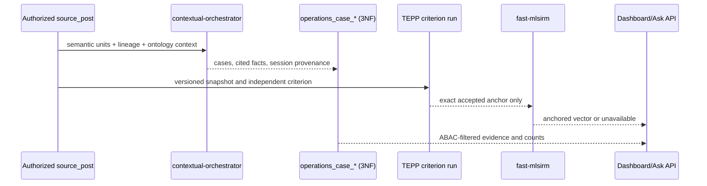

# Product & Technical Gap Baseline

### Exact-head continuation — 2026-10-05 21:45 KST

PR #1159 is open at unchanged head
`b28ade6690cf1e1191d310a4ef2cf3e024513187`, still based on the earlier
`a67c5b0e725f40ac52cc6dcb1f2e5e4cb9d64644`; protected `main` is
`8be55f0306015a1a8deda02fa9131e165254d239`. The parent #1160 is merged with
that exact merge SHA. #1159 has no formal review or inline review comment, no
independent approval, and no auto-merge request. GitHub marks it CONFLICTING
against current `main`. Its current-head frontend regression file passes
**21 tests** locally. The last current-head hosted run had four failures; the
full-suite and frontend jobs ended in three seconds with zero steps, so no
application test execution is evidenced. A read-only merge attempt identified
collisions in shared baseline/story inventory plus files not changed by #1159
(App and Similar VOC panel code/tests, dependency manifest/lock and dependency
floor test). No conflict resolution was committed or pushed for this PR.

ADR 0184's denial behavior remains a candidate implementation in #1159; the
UI/runtime acceptance and protected delivery are **unverified** until the
conflict is safely integrated and fresh exact-head checks and approval exist.
This baseline commit itself advances #1161 and invalidates its earlier Checks.

### Exact-head continuation — 2026-10-05 21:35 KST

This observation follows the ordinary merges of current `main` into PR #1153
and this baseline candidate. Remote `main` was
`8be55f0306015a1a8deda02fa9131e165254d239` at capture.

- PR #1153 was head `727a0366d250770e532189702a6c701886a9f712`, based on that
  `main`, open, non-draft, and GitHub reported `MERGEABLE`. The credential-field
  review finding is present in the test. The focused authentication test passed
  **6 tests** after the main merge. All four application/analysis checks failed
  within seconds with zero job steps; logs were unavailable, so their cause is
  unverified. CodeRabbit was rate-limited, and there is no formal approval.
- PR #1161 was head `e64ed8f0123aa8b26d1be4daea1d23e9e48bc1b9`, based on that
  `main`, open, non-draft, and GitHub reported `MERGEABLE`. Its Full test,
  frontend, and two Analyze jobs also failed with zero steps; CodeRabbit was
  rate-limited. No formal approval exists. This baseline update creates another
  head, so these check results do not apply to the resulting commit.
- Active ruleset **21065108** still exposes only no-force-push protection;
  classic branch protection was unavailable. There is no verified required
  approval/check gate. Auto-merge remains unarmed because its immediate merge
  would not establish the user's independent-approval and passing-check
  requirements.

The additional-Voice authenticated PostgreSQL/API and rendered application
acceptance remains **unverified**. Synthetic local tests, earlier browser
renders, and a mergeable PR state do not satisfy those runtime criteria.

### Exact-head continuation — 2026-10-05 21:24 KST

This overlay is a live-state snapshot, separate from the dated 2026-10-04
candidate evidence below. Canonical remote `ContextualWisdomLab/LineageWeave`
reports `main` at `a67c5b0e725f40ac52cc6dcb1f2e5e4cb9d64644`.

- **PR #1153** is open, non-draft, base `main`, at exact head
  `c06920c41a90048ae16eccf79e5cc9662d651afa`. The current-head review note
  requesting password-grant assertions for `client_id` and `username` was
  verified against the test and fixed in this commit. Focused local validation
  passed: `uv run pytest tests/test_api_acceptance_authentication.py -q`
  (**6 passed**). GitHub reports both Analyze jobs failed before exposing any
  steps; CodeRabbit was still pending at this observation. No independent
  approval is recorded, no auto-merge request exists, and merge state is DIRTY.
  Older full-suite and integration evidence belongs to earlier heads and does
  not transfer to this one.
- **PR #1162** remains Draft at exact head
  `ca7fe1c55d8a92f2c3d4dbf58455b3a6019bb046`. Its current checks show Analyze
  failures, frontend and full-suite jobs skipped, and a CodeRabbit result that
  explicitly skipped the draft. It has no review or auto-merge request.
- **PR #1161**, this baseline candidate, is open, non-draft at exact head
  `8e890e5c23f8911fdb57a17f0f62637035669769`. Its Analyze jobs fail before
  steps; CodeRabbit passed. There is no independent approval and no auto-merge
  request. This overlay will create a new head, so all prior Checks are stale
  for its resulting commit.
- The live repository ruleset read found active rule **21065108**, which blocks
  force pushes and has no bypass actor. The classic branch-protection endpoint
  returned 404. No independent-approval or required-check gate was established
  by those policy reads; consequently, passing local tests or enabling
  auto-merge alone would not prove those user-required protections.

The user's requested authenticated PostgreSQL API and rendered UI acceptance
for Voice exports is still **unverified**. Existing synthetic test and browser
observations are candidate evidence only. No acceptance claim is upgraded by
this overlay, and no real records or credentials are recorded here.

## Exact-head continuation — 2026-10-05 20:08 KST

This observation supersedes the 2026-10-04 inventory below only for the live
heads and counts named here. The canonical remote is
`ContextualWisdomLab/LineageWeave`, default branch `main` at
`a67c5b0e725f40ac52cc6dcb1f2e5e4cb9d64644`. Paginated GitHub reads returned
**186 open PRs** and **42 open issues**, including this baseline PR #1161. These
are repository workflow counts. GitHub identifies `ContextualWisdomLab/RankWeave`,
`ContextualWisdomLab/ThreadWeave`, `ContextualWisdomLab/disksage`, and
`ContextualWisdomLab/TEPP` as the canonical remote spellings checked for this
loop; the current slice adds no change to their contracts.

At the start of this continuation, the live #1161 candidate was head
`e0ee51fcc7621ee94a831e84ffc8d74448c5bc69` on base
`a67c5b0e725f40ac52cc6dcb1f2e5e4cb9d64644`. It has no formal approval or
auto-merge request. On this exact head, Full test suite, Frontend lint/test/build,
Python analysis, and Actions analysis report failure; CodeRabbit reports review
completed but provides no formal approval. This audit could not retrieve the
failed job logs or verify their cause. These hosted failures are not local test
results. Enabling auto-merge was rejected by GitHub because the branch does not
have required protected-branch rules; the organization ruleset endpoint also
returned HTTP 403, so the applicable approval/check policy remains unverified.
No approval, check, or merge is inferred from local work. The documentation
correction in this continuation changes #1161's head and invalidates its prior
Checks; re-fetch the resulting head and statuses before any lifecycle claim.

| PR | Exact head / base | Review and hosted state at observation |
| ---: | --- | --- |
| #1162 | `ca7fe1c55d8a92f2c3d4dbf58455b3a6019bb046` / `a67c5b0e725f40ac52cc6dcb1f2e5e4cb9d64644` | Draft; no formal approval; CodeRabbit succeeded; hosted analysis checks failed. |
| #1161 | `e0ee51fcc7621ee94a831e84ffc8d74448c5bc69` / `a67c5b0e725f40ac52cc6dcb1f2e5e4cb9d64644` | No formal approval; four hosted checks fail, cause unverified; auto-merge unavailable because GitHub reports no required protected-branch rules. |
| #1160 | `a826d42d1d429f54c507dc050aa9c4af40669179` / `a67c5b0e725f40ac52cc6dcb1f2e5e4cb9d64644` | The current code handles 401 with sign-in guidance and suppresses retry with the rejected token; the exact-head CodeRabbit note is addressed. No formal approval; hosted checks failed. |
| #1159 | `b28ade6690cf1e1191d310a4ef2cf3e024513187` / `a67c5b0e725f40ac52cc6dcb1f2e5e4cb9d64644` | No review findings or formal approval; four hosted checks fail, cause unverified; no auto-merge. |
| #1158 | `f92dddb460fd73a20eafa7c26de8f49085821d9a` / `a67c5b0e725f40ac52cc6dcb1f2e5e4cb9d64644` | Current code keeps an unauthenticated continuation unavailable instead of calling it exhausted; the continuation Story mocks the empty page and restores `fetch`. No exact-head approval; four hosted checks fail, cause unverified. |
| #1157 | `2905bae54adb290c104c23210e3c1e098e401e31` / `a67c5b0e725f40ac52cc6dcb1f2e5e4cb9d64644` | No formal approval; hosted checks failed. |
| #1153 | `93b674ed08d338ec72ec7d98737e4aa2a17adee8` / `a67c5b0e725f40ac52cc6dcb1f2e5e4cb9d64644` | The exact-value `after:` wording comment is addressed on this head; no formal approval; hosted checks failed. |

For #1159, the existing candidate is the minimum implementation of the
highest-severity buyer-visible gap: after access is denied, cached nodes,
details, and exports disappear together. Its exact-head synthetic regression
suite passed **29 tests** across the neighborhood and stabilization tests, and
Storybook built successfully. The `Denied Cached Evidence` story was rendered
and inspected at **1440×900** and **390×844**; neither viewport overflowed,
the unavailable next step remained visible, and CSV/JSON-LD exports stayed
disabled. This is candidate UI evidence only. Compose inspection found the
PostgreSQL and backend services exited and a worker restarting; authenticated
PostgreSQL/API behavior, authenticated UI evidence, and authenticated k6
concurrency/latency/error/throughput/saturation results remain **unverified**.
The twelve atomic Voice types and extensible evidence-bearing combinations
remain governed by ADRs 0246/0251/0256; none is narrowed or marked complete by
this candidate.

The adjacent Voice export candidate #1153 was also revalidated at exact head
`93b674ed08d338ec72ec7d98737e4aa2a17adee8` on the same live base. Local
synthetic checks passed: **59** backend neighborhood/ingestion tests, **26**
API/explorer tests, and **31** ontology-layout tests. The layout tests cover
the CSV's distinct carrying/evidence columns and union of properties and Voice
relations when multiple JSON-LD pages describe the same subject. Storybook
built, and `Separate Voice Evidence` was rendered and inspected at **1440×900**
and **390×844**; the source Post and separate evidence Post remain distinct,
and the narrow table scrolls without page overflow. All four hosted checks on
that candidate report failure; their cause was not reverified in this update.
This still does not prove authenticated PostgreSQL/API behavior,
truth/cutoff handling against live authorization, or protected delivery.

For #1158's work-evidence continuation, the exact-head synthetic backend
search tests passed **9 tests**, focused frontend tests passed **8 tests**, and
Storybook built successfully. The `Empty With Continuation` story returned a
mocked empty next page and displayed the exhausted-search next step at
**1440×900** and **390×844**, with no page overflow or request-error message.
Its four hosted checks report failure; their cause was not reverified here;
this does not establish authenticated catalog/API behavior. The review
suggestion to alias PR numbers and commit SHAs was skipped: those are GitHub
workflow identifiers needed for the exact-head audit and are allowed by the
repository artifact rule; no source-post or organization identifier appears.

The only repository ruleset visible to this credential is
`21065108` (active non-fast-forward protection). Classic branch protection
returns 404; the organization ruleset endpoint for `18156473` returns HTTP
403. Required review/check policy therefore cannot be verified from the live
policy surface in this run. No candidate has a qualifying exact-head approval.
Auto-merge stays off because the accessible policy does not prove an approval
gate and could allow an immediate merge; no self-approval or bypass was used.

The #1159 UI repair and #1160 retry repair both touch `OntologyExplorer.tsx`;
#1159 also conflicts with #1157 and the shared baseline. Preserve the
access-denial fix before restacking the retry and scope-reset candidates, then
collect fresh checks and reviews on each new head. PR #1135 remains based on
`83eba56149eb802cd63642c507c324c9976ec78e` while `main` is `a67c5b0e...`; a
read-only merge-tree reports conflicts in the baseline, application screen,
dependency files, Storybook inventory, and focused tests. Its dependency-floor
delta overlaps #1137, so no force-push, blind merge, or stale-head revalidation
was attempted.

This update advances #1161 and invalidates that PR's prior exact-head checks.
It adds no ADR, API, schema, migration ordinal, release number, model policy,
or numeric heuristic. ADRs remain normative; candidate PRs, local tests,
Storybook renders, and workflow inventory are not protected-main delivery.

## Exact-head delivery and product-gap audit — 2026-10-04

Git fetch identifies `origin/main` as `a67c5b0e725f40ac52cc6dcb1f2e5e4cb9d64644`. This is a repository source-state observation; no PR was merged during this audit. The current PRD is `docs/product-requirements.md`; ADRs remain normative. Current Voice authority is ADR 0246 (twelve atomic Voices), ADR 0251 (a separate I/O-psychology taxonomy), and ADR 0256 (open-ended evidence-bearing combinations), with PROV-O derivation and authorization/cutoff governed by their referenced ADR contracts.

| Evidence class | Current observation | Remaining acceptance |
| --- | --- | --- |
| Normative authority and research | The LineageWeave PRD and Voice ADRs were read. DeepWiki reported that the repository is not indexed; its absence did not replace the canonical local PRD/ADR authority. RankWeave has no standalone PRD in its authority register; its current `ARCHITECTURE.md` owns pure ranking calculations. ThreadWeave's `docs/PRD.md`, TEPP's approved v0.4 PRD, and DiskSage's `docs/PRD.md` were read. Repository names were checked against GitHub's canonical casing: `ContextualWisdomLab/LineageWeave`, `RankWeave`, `ThreadWeave`, `disksage`, `TEPP`, `fast-mlsirm`, and `contextual-orchestrator`. ADR 0246's cited literature supports broad stakeholder distinctions, not an empirical derivation of the product's twelve labels. | Preserve owner boundaries and cite only authority that supports the claim; do not infer a fixed Voice-combination set, B2B2C restriction, model, weight, or population result. |
| Protected implementation | Protected-main source state is the SHA above. No code from an open PR is described here as delivered. | Require current-head hosted checks, independent approval, resolved threads, verified live protection, normal merge, and merge SHA. |
| Open-work inventory | GitHub reports **184 open PRs**, of which **168 are drafts**, **67 target `main`**, and **16 are non-draft `main` candidates**. There are **42 open issues**. These are workflow counts, not customer use or a population sample. | Re-fetch before later lifecycle decisions; draft and non-main PRs remain candidate work and must follow their parent/base order. |

This inventory was captured immediately before opening this baseline update as PR #1161; #1161 is intentionally excluded from the counts and 16-head table above.
| Exact-head review and checks | All 16 non-draft `main` PR heads below were re-fetched from the live PR listing and inspected for formal review state and Checks. **None has an APPROVE review on its current head.** Fifteen show at least one failed check; #1131's applicable runs are successful/skipped but it has no exact-head approval and merge-tree reports conflicts in both changed documents. #1130's `APPROVED` rollup refers to commit `383c392bc6713e55bed31b4d4053d93cfd1885d0`, not current head `b25f10eb1021083317a8ecefd479efc29d6c0297`. No selected PR currently has an auto-merge request. | Failed/pending hosted gates and independent review remain external blockers. Keep normal auto-merge only when policy requirements and clean ancestry permit it; do not treat review bots or stale approvals as approvals. |

| PR | Exact head | Current-head observation |
| ---: | --- | --- |
| #1160 | `a826d42d1d429f54c507dc050aa9c4af40669179` | Checks failed; no exact-head approval. Its older retry comment is already handled by the 401 reauthentication state. |
| #1159 | `b28ade6690cf1e1191d310a4ef2cf3e024513187` | Checks failed; no exact-head approval. |
| #1158 | `f92dddb460fd73a20eafa7c26de8f49085821d9a` | Checks failed; available review is on an earlier head. |
| #1157 | `2905bae54adb290c104c23210e3c1e098e401e31` | Checks failed; no exact-head approval. |
| #1156 | `de83d47cdb3b6e0593ab74ed84f4af2c1d4e7b41` | Checks failed; available review is on an earlier head. |
| #1155 | `1a83f31daa881e58ddde181768d35acb77aaa613` | Checks failed; no exact-head approval. |
| #1153 | `93b674ed08d338ec72ec7d98737e4aa2a17adee8` | Checks failed; available review is on an earlier head. |
| #1151 | `ab0c639fd50cb13f764416d99038140af3b86c73` | Checks failed; no exact-head approval. |
| #1141 | `cf6a83efec9d1ccb8ef01eeaac2d0c38e20c32e6` | Checks failed; merge state is dirty; no exact-head approval. |

### Focused candidate rechecks — 2026-10-05 20:08 KST

The exact PR heads above were re-read before these local checks. #1153 remains
at `93b674ed08d338ec72ec7d98737e4aa2a17adee8`; its current review set has no
formal approval and the available CodeRabbit review is on an earlier commit.
Its focused synthetic backend neighborhood, cutoff, ingestion, visibility,
windowing, and authenticated API tests passed (**83 tests**). #1160 remains at
`a826d42d1d429f54c507dc050aa9c4af40669179`; its focused frontend explorer and
layout tests passed (**56 tests**). CodeRabbit's actionable 401 retry comment
was on an earlier commit, and the current implementation maps 401 to sign-in
guidance while the regression test checks the rejected-token retry path. #1159
remains the smallest available repair for the highest-severity buyer-visible
gap: a denied read must clear previously authorized evidence and exports. It
has no formal review or approval. Hosted Checks for all three PRs currently
report failure; failed job causes were not independently retrieved in this
continuation, so no failure is described as a source-code defect or as a
verified billing issue. None has an auto-merge request. Authenticated live
PostgreSQL/API behavior and authenticated browser acceptance remain unverified.

The normal auto-merge request for #1160 was rejected by GitHub with “Pull
request Branch does not have required protected branch rules”. The same
response occurred for #1161. Organization ruleset `18156473` remains
unreadable to this credential (HTTP 403), and classic protection returned no
policy document in the earlier audit. No PR is merged and no merge SHA exists.
| #1137 | `4344d4dcb80fa08971c33f2f7df912d389dc7c61` | Required review/security checks failed; no exact-head approval. |
| #1136 | `55f6992637c53cfb51a74f55987a40b359152bd5` | Required checks failed; no exact-head approval. |
| #1135 | `73ba540789d2f2210a17e7eb5396270dafa66589` | Required checks failed; no exact-head approval. |
| #1133 | `1420a733eb30cea5198dffc2ae08734c9cfe521e` | Required checks failed; no exact-head approval. |
| #1131 | `ee3d8890ce3b7829f668e05732ef55d24e2e688e` | Applicable checks passed/skipped; no exact-head approval; merge-tree conflicts in PRD and baseline. |
| #1130 | `b25f10eb1021083317a8ecefd479efc29d6c0297` | Checks failed; approval rollup is stale relative to this head. |
| #1128 | `91143146623948dbd26bbfc1c69de3cd77d2ae06` | Three CodeQL compatibility checks failed; no exact-head approval. |

The largest evidence-backed Voice visibility gap is an additional Voice carried by a visible Post whose distinct derivation Post remains independently authorized but falls outside the bounded graph traversal. The older projection admitted derivation evidence only when it was also a graph node, hiding a legitimate Voice from exact values and JSON-LD. Candidate #1153 adds the smallest boundary-preserving repair: the PostgreSQL authorization layer separately admits independently visible evidence Post identities, while hidden evidence still removes the Voice and is never replaced by its carrying Post. It preserves all twelve governed atomic Voice values, extensible combinations, PROV-O derivation, truth status, and cutoff.

On exact candidate head #1153, the focused synthetic Python suite passed **77 tests**, the focused frontend suite passed **50 tests**, and the full frontend run passed lint, **564 tests**, and production build. The Storybook `Voice Evidence Outside Traversal` scene was rendered and visually inspected at **1440×900** and **390×844**; [desktop](screenshots/ontology-voice-export-desktop.png) and [mobile](screenshots/ontology-voice-export-mobile.png) screenshots retain synthetic content only. The table keeps carrying Post and derivation evidence as distinct actions, with the narrow layout retaining its horizontal exact-value table. These are candidate and synthetic-render proofs. An authenticated PostgreSQL/API run was attempted against the existing `lineageweave` Compose stack; its test-token setup returned HTTP 400 before any API or database assertions executed. Thus authenticated API acceptance remains **unavailable**, despite the implementation and local tests. No authenticated k6 load ran, so latency, errors, throughput, capacity, saturation, and bottlenecks remain **unavailable**. The failed setup created no throwaway database or container, and no data volume was removed.

The 16-root file-list and pairwise merge-tree audit found no migration file changes. #1153 and #1155 both amend ADR 0256, but their branches merge cleanly at the text level; the evidence-visibility and history/cutoff decisions still need one combined policy review. #1153/#1160, #1153/#1157, #1153/#1159, and #1153/#1141 conflict in the appended baseline; #1153/#1136 also conflicts in the baseline, Storybook inventory, and ontology tests. #1160/#1157 conflicts in the baseline and ontology component/tests; #1160/#1158 conflicts in the baseline and Storybook inventory. #1131/#1141 conflicts in both the PRD and baseline. #1153/#1130 merges cleanly, including their shared API test file.

Dependency and release interactions are bounded but unresolved: #1137/#1135 conflict in `pyproject.toml`, `uv.lock`, and the PyJWT advisory-floor test because the former raises the minimum to 2.15.1 while the latter declares 2.14.0. The stronger floor must survive integration. #1137/#1133 and #1135/#1133 merge cleanly at the file level. #1137 alone changes `CHANGELOG.md` under Unreleased; #1133 pins RankWeave `v0.18.0` to the already-pinned commit, not a LineageWeave release. No LineageWeave release number change or migration ordinal collision is present in these 16 heads. This bounded root-PR audit is not a claim that every draft or stacked delta is conflict-free.

GitHub's REST API returned HTTP 403 rate-limit errors during the live ruleset and job-log reads. The current ruleset therefore remains unverified; an older dated baseline observation is not promoted to current policy. Failed job logs were not available to establish a fresh canonical-owner root cause, so consumer-side CI workarounds were not added. No force push, self-approval, bypass, or merge was used.

## Exact-head authentication recovery and integration audit — 2026-10-04 12:38 KST

This overlay supersedes older live-state wording only at the exact heads named
here. Remote `main` is `a67c5b0e725f40ac52cc6dcb1f2e5e4cb9d64644`.
The paged inventory contains **184 open PRs**, **168 drafts**, **117 non-main
bases**, and **42 open issues**. These are repository inventory observations,
not private-corpus or population estimates. Drafts are not certified by the
ready-PR table.

### Review and implementation candidate

PR #1160's review at `ab71df03313e4e61e62f629f740c3023878f6c75`
correctly identifies that an expired credential offered Retry with the same
credential. The minimal repair at implementation commit
`4f3655c61ad50174a7bb6aaf97b06aafaa624555` clears retained evidence, the
selected drawer, and continuation state on 401; the shared unavailable notice
asks the reader to sign in again. Reset focus cannot restore supplied evidence
with that rejected credential. A renewed credential can load evidence without
the old cursor. Transient errors retain same-request Retry. ADR 0184 records
the boundary before implementation; ADR 0220 supplies the existing notice and
tokens. No new API, schema, migration ordinal, or release is introduced.
This baseline-only follow-up has a later head: hosted evidence below does not
transfer to that later head or to the implementation candidate.

Published repair receipt, before this receipt-only commit: PR #1160 is ready
and Open at `0d7ea382541ce5ed20b9147735a24bfbfd199633`. All four
exact-head CodeQL/test checks are terminal failures; each annotation states
that the job was not started because the account is locked due to a billing
issue. No formal approval exists on this head, Devin Review is a successful
status rather than approval, and CodeRabbit is pending. The addressed 401
review thread is resolved. Auto-merge is unarmed for the enforcement reason
below. This receipt advances the head again, so re-read the resulting head
before lifecycle action; no predecessor evidence is transferred.

Regression verification reproduced both the missing initial/continuation
reauthentication behavior and the supplied-evidence Reset focus bypass before
the repair. Frontend lint, **60 files / 570 tests**, production build, and
Storybook build pass. Relevant backend ontology, SHACL, Voice-ingestion,
route-contract, and documentation tests pass (**67 tests**), with
DeprecationWarning treated as an error. A separate synthetic throwaway
PostgreSQL database passes **8 temporal Voice-history tests**, including
A → B → A and concurrent primary history, and is removed by the fixture.
These are local/candidate results, not hosted or authenticated API acceptance.
The existing production bundle warning remains visible at approximately
551 kB; it was not suppressed or relabeled as fixed.

`SignInRequired` and `SeparateVoiceEvidence` were rendered and visually
inspected at **1440×900** and **390×844**. The sign-in notice fits both viewports
without document overflow; CSV and JSON-LD are disabled and Retry is absent.
The existing exact-value table retains distinct carrying-Post and derivation-
evidence actions; mobile uses its existing keyboard-scrollable region.
Screenshots contain synthetic records only and stay outside git. This is
Storybook acceptance, not authenticated customer UI acceptance.

The remaining #1158 review request to remove public repository names, PR
numbers, and commit SHAs is invalid against ADR 0001 and AGENTS.md: the
prohibition concerns identifiable real source records, and explicitly allows
aggregate counts and PR numbers. Public delivery identifiers are required for
an honest exact-head audit. No fabricated aliases replace observed heads.
Its product implementation is preserved, and the invalid review thread is
resolved without changing source data or transferring Checks.

### Ready-PR exact-head observation before this repair

All check-suite commit identities in this table match the named PR head.
No ready PR has a formal independent APPROVED review on its current head;
#1130's approval belongs to an older commit. No open PR had an auto-merge
request in the inventory. Context totals include external status contexts;
non-failing, skipped, pending, or commented reviews do not imply acceptance.

| PR | Exact observed head | Hosted check/status contexts |
|---|---|---|
| #1160 | `ab71df03313e4e61e62f629f740c3023878f6c75` | 6 contexts; 4 failures; 0 pending |
| #1159 | `b28ade6690cf1e1191d310a4ef2cf3e024513187` | 6 contexts; 4 failures; 0 pending |
| #1158 | `f92dddb460fd73a20eafa7c26de8f49085821d9a` | 6 contexts; 4 failures; 0 pending |
| #1157 | `2905bae54adb290c104c23210e3c1e098e401e31` | 6 contexts; 4 failures; 0 pending |
| #1156 | `de83d47cdb3b6e0593ab74ed84f4af2c1d4e7b41` | 4 contexts; 2 failures; 0 pending |
| #1155 | `1a83f31daa881e58ddde181768d35acb77aaa613` | 6 contexts; 4 failures; 0 pending |
| #1153 | `93b674ed08d338ec72ec7d98737e4aa2a17adee8` | 6 contexts; 4 failures; 0 pending |
| #1151 | `ab0c639fd50cb13f764416d99038140af3b86c73` | 6 contexts; 4 failures; 0 pending |
| #1141 | `cf6a83efec9d1ccb8ef01eeaac2d0c38e20c32e6` | 6 contexts; 4 failures; 0 pending |
| #1137 | `4344d4dcb80fa08971c33f2f7df912d389dc7c61` | 44 contexts; 7 failures; 0 pending |
| #1136 | `55f6992637c53cfb51a74f55987a40b359152bd5` | 47 contexts; 5 failures; 0 pending |
| #1135 | `73ba540789d2f2210a17e7eb5396270dafa66589` | 47 contexts; 7 failures; 0 pending |
| #1133 | `1420a733eb30cea5198dffc2ae08734c9cfe521e` | 57 contexts; 4 failures; 0 pending |
| #1131 | `ee3d8890ce3b7829f668e05732ef55d24e2e688e` | 37 contexts; 0 failures; 0 pending |
| #1130 | `b25f10eb1021083317a8ecefd479efc29d6c0297` | 6 contexts; 4 failures; 0 pending |
| #1128 | `91143146623948dbd26bbfc1c69de3cd77d2ae06` | 44 contexts; 3 failures; 0 pending |

The current-head full-suite annotation on #1130 reports that the job was not
started because the account is locked due to a billing issue; its jobs have
no executed steps. This is a GitHub account/platform condition, not a failing
application test. REST subsequently exhausted its rate allowance; independent
GraphQL reads and Git transport remain available. Re-read each new head's
Checks, reviews, threads, and live protection before any merge action.

Effective branch-rule and inherited-ruleset reads expose only repository
no-force-push rule **21065108**. Classic branch protection returns 404. No
approval or required-check gate is proven enforced for this repository in that
read. Arming auto-merge could therefore immediately merge an unapproved head;
it is left unarmed until enforced gates and eligible independent approval can
be verified. No existing request is disabled. No self-approval, admin bypass,
force push, unsafe merge, child retarget, or stale-run cancellation is used.
The account billing condition is not repaired by weakening workflow contracts.
The active-run inventory became unavailable after the REST limit; no current
main or open-PR run is cancelled on inference.

### Authority and runtime evidence

- Current-main LineageWeave PRD, ADR 0246/0251/0256/0184/0220, TEPP's approved
  v0.4 PRD, fast-mlsirm's PRD, ThreadWeave's PRD, RankWeave's architecture,
  contextual-orchestrator's product planning, DiskSage's current README, and
  Keyverse's PRD were read before this slice. Canonical remote metadata confirms
  `ContextualWisdomLab/LineageWeave`, `RankWeave`, `ThreadWeave`, `TEPP`, and
  lowercase `ContextualWisdomLab/disksage`. The current disksage tree does not
  resolve `docs/PRD.md`; that path in the supporting authority register does
  not establish a present product authority. Its current README/design boundary
  is used instead.
- Remote default heads are RankWeave
  `92323cb8b55baf5d840cb97fa8534a0e75ef234c`, ThreadWeave
  `0fda6e60c2c80ec7b2aa2d58dac6b944dec6a6d0`, disksage
  `05899ffb01ce91a9ea3d782630b28a398de59ddc`, and TEPP
  `a243f18da4a4ca8a8d068c39922537f1f8ed6ad0`. Owner product sources remain
  design/contract evidence, not proof that a downstream runtime accepts them.
- ADR 0246 retains twelve extensible atomic Voices; ADR 0251's I/O-psychology
  taxonomy remains distinct; ADR 0256 governs composition, PROV-O derivation,
  truth, and cutoff. No fixed combination enumeration, B2B2C limitation,
  hidden-evidence substitution, numeric weight, Python numerical kernel, or
  unaccepted inference is added. Same-subject JSON-LD property/multi-Voice unions
  and carrying-versus-evidence CSV regressions remain in the passing suites.
- A read-only diagnostic of the formal `lineageweave` PostgreSQL service found
  **43,189 Posts**, **43,189 primary Voice rows**, **0 additional Voice rows**,
  **0 additional rows with an assertion**, and **0 multi-Voice Posts**. These
  administrative aggregate observations are not authorized reader API proof,
  not a classifier result, and not a population inference. No record title,
  organization, production key, body, or credential was printed or persisted.
- The synthetic authorization-code browser probe did not obtain an access
  token. No owned k6 token file was configured. **Authenticated PostgreSQL/API
  and UI Voice acceptance, synthetic authenticated k6 concurrency, latency,
  error rate, throughput, and PostgreSQL/worker/Valkey/gateway saturation remain
  unavailable.** No unobserved performance bottleneck is changed. Formal
  Compose services/volumes are preserved; this loop creates no containers.

The largest remaining release acceptance gap is still additional-Voice
accepted/persisted evidence in the authenticated product. The repair above
closes a concrete session-expiry recovery failure within that evidence workflow;
it does not certify the larger runtime gate. W3C JSON-LD/PROV-O/SHACL/WCAG and
owner PRDs support the contracts, not a fabricated completed-runtime claim.
Context7 verifies React's cleanup behavior. DeepWiki has no indexed repository;
Sequential Thinking and graph-memory tools are not exposed in this session.

### Cross-PR ADR, schema, API, and release integration

All **184 exact-head deltas** were inspected relative to their declared local
base refs; Git transport verified main and the repaired PR head. This audit
finds **19 filename-ordinal collision groups** across ADR/migration deltas;
inherited stack deltas are included, so these are collision groups rather than
19 independent defects. Examples requiring owner reconciliation before merging:

- Migration 0249: #1047's post-chat authorization scope and #1127's translation
  ownership/similar-VOC files; migration 0248: #929's Customer Master draft and
  #1049's conversation-turn repair; #929 itself has multiple 0247 filenames.
- ADR 0272: leftover-map reconstruction, exact-read SLO, and stateless MCP
  candidates; ADR 0245: #702's scoring/identity owner contract versus the
  occupational taxonomy; ADR 0355: #915 dynamic evaluation versus #920 plot
  origin; ADR 0300/0301/0279 and several 0290–0297/0305 slices also collide.
- Current main has two 0233 migration filenames. #1049 and issue #1048 own the
  forward-ordinal repair. Main has no duplicate ADR filename ordinals, but its
  supporting PRD still has duplicate FR labels and misbound occupational ADR
  references; #997 is the reconciliation candidate. No shipped migration or
  normative decision is silently renamed or deleted here.
- Exact read-only merge-tree checks find only baseline-text conflicts between
  #1160 and #1159/#1157. #1160 versus #1136 also conflicts in Storybook inventory
  and component tests. #1153/#1155 and #1137/#1133 combine textually cleanly.
  This does not prove semantic API compatibility or transfer approval. Preserve
  the independent evidence-denial, scope-reset, and review-history changes when
  their first protected parent is integrated, then collect fresh child evidence.
- Across the 184 heads, package/frontend/module versions produce **74 distinct
  tuples**, with **131 heads** containing a version mismatch. Some are inherited
  stack states, not independent releases. Current main remains package/frontend
  `2.28.0` versus module `2.20.0`; issue #1056 owns release-authority repair.
  This slice changes no version and creates no release claim.

API admission, truth/cutoff, and semantic compatibility of draft stacks remain
unverified beyond the named contract tests and selected merge-tree checks.
Parents must be protected first; no non-main stack delta is retargeted merely
because its textual merge is clean. Keep older dated observations below as
history rather than treating them as current authority.

## Exact-head request-recovery loop — 2026-10-04 11:13 KST

This dated overlay separates source, local candidate, GitHub workflow, and
runtime evidence. It does not certify a release or supersede older observations
outside the heads named here. The implementation candidate is
`ad2d0da703734b5a5db827b44783219d1e7d263a` on remote main
`a67c5b0e725f40ac52cc6dcb1f2e5e4cb9d64644`; the following baseline-only
commit does not change application behavior. The complete paged inventory read
in this loop contained **183 open PRs**, **168 drafts**, **117 non-main bases**,
and **42 open issues**, before opening this recovery candidate. These are
repository workflow counts, not a private-corpus or population estimate.

### Published recovery candidate

Recovery PR **#1160** was opened ready on `main` at exact head
`b57f1fe19b76126647dfa87691b1cb3c083dbe38`. Its four executed-status
Checks are terminal failures with no job steps: the new full-suite annotation
again reports the account billing lock. No formal review exists on that head;
CodeRabbit was pending and Devin Review successful at this observation, neither
being an independent approving review. Applicable main rules were re-read and
still contain only no-force-push ruleset 21065108. Auto-merge remains unarmed
because it cannot safely defer to absent enforced approval/check gates.
This baseline-only follow-up creates a later head; those Checks and review
observations do not transfer to it. Re-read that head before any merge action.

### Review, Checks, and protection

- Ready PR heads were inspected with their current-head check rollups, formal
  review commit identities, and unresolved threads. None had a qualifying
  APPROVED review on its current head. #1130's older approval does not transfer
  to `b25f10eb1021083317a8ecefd479efc29d6c0297`. Draft stacks were inventoried,
  not individually certified. Pending checks are not an independent-work
  blocker; failures and absent approval remain merge requirements.
- #1153's valid review finding was reproduced against its loader: an `after:`
  edge continuation captures a fresh database snapshot, while source-cursor
  continuation restores the retained snapshot. Its ADR now limits the retention
  statement to source-cursor continuation. The non-force review repair moved
  head from `5b1645607e1e8e7986f735fa8bf37dd3bb77ad3e` to
  `93b674ed08d338ec72ec7d98737e4aa2a17adee8`; the review thread is resolved.
  Documentation hygiene passed **5 tests**, with DeprecationWarning as error.
- All four Checks on that new head were re-read through the exact commit's
  check-runs endpoint. CodeQL Python/Actions, full suite, and frontend jobs
  failed before executing any step because the account is locked due to a
  billing issue. This is a GitHub account/platform condition, not a tested
  application failure. No scanner, runner route, gate, or warning was suppressed.
- Current branch-rule and inherited repository-ruleset reads expose only
  no-force-push ruleset **21065108**. Organization GraphQL metadata separately
  declares the active central one-approval/resolved-thread/workflow contract,
  but that declaration is not proof that it is enforced on this repository.
  No eligible independent approval exists. New auto-merge is therefore held:
  arming it without enforced gates could immediately merge an unapproved head.
  Existing auto-merge requests were not removed; no self-approval, bypass,
  force push, parent retarget, or unsafe merge occurred.
- #1154's merge record was verified at
  `a67c5b0e725f40ac52cc6dcb1f2e5e4cb9d64644`. This confirms that merge record,
  not independent review, protected delivery, or authenticated deployment.
  There were no in-progress repository runs in the bounded current run read;
  no closed-PR stale run was cancelled and no manual queue workaround occurred.

### Prioritized product slice and verification

The release-critical gap remains accepted, authorized Voice evidence in the
running product. That acceptance cannot be certified without authentication.
While that gate waits, the actionable local PRD-FR-3/5 gap reproduced here is
request recovery: an initial related-information failure had no retry control,
so the user could not resume the same request without leaving the view.

The minimal candidate reuses ADR 0220's `StatusNotice` and the existing request
attempt state. A failed initial request retries the same focus and cutoff; a
failed continuation retries its same opaque cursor and retains the previous
page. A processing request removes the retry control. Denied evidence has no
retry control. Provider diagnostics are never interpolated into the notice.
No new dependency, provider policy, heuristic, inferred value, API field,
schema, migration, ADR ordinal, or release number is introduced.

Regression tests first failed against the old implementation, then passed for
initial failure/recovery, pending exports, exact request identity, continuation
recovery with prior evidence, and 403/404 denial. The focused ontology/export
suite passed **61 tests**; the full frontend suite passed **60 files / 567
tests**. Frontend lint, production build, and Storybook build passed. Relevant
Python documentation/Voice/projection/SHACL tests passed **64 tests**, treating
DeprecationWarning as error. No warning filter or timeout relaxation was added.
With the official backend extras installed, live PostgreSQL synthetic primary/
additional Voice history tests passed **8 tests**. Those isolated databases
were dropped by their fixtures. The authorized API round-trip test failed at
its genuine OIDC token fixture with **HTTP 400**, before API admission; it is
not a passing or skipped acceptance result.

`Evidence/OntologyExplorerRetry/InitialRequestRetry` rendered and was visually
inspected at **1440×900** and **390×844**. Both browsers operated Retry and
returned to the safe failure notice in the controlled synthetic outage;
neither viewport overflowed and neither exposed the synthetic diagnostic.
The shared token-backed control exceeds the existing 24-pixel minimum in both
renders. Screenshots remain outside git. This is synthetic rendered evidence,
not authenticated customer UI acceptance.

### Authority, Voice, and runtime boundary

- The current-main LineageWeave PRD and ADR 0184/0246/0251/0256/0220/0123 were
  read. ADR 0246's twelve atomic Voices stay extensible; ADR 0251's
  I/O-psychology taxonomy remains a separate authority; ADR 0256 governs
  evidence-bearing combinations and their retained truth/cutoff intervals.
  The retry slice preserves carrying-Post versus derivation-evidence actions,
  same-subject JSON-LD property unions, and multi-Voice relations. Relevant
  export regressions passed; authenticated Voice acceptance stays incomplete.
- Canonical names were verified against GitHub repository metadata, including
  lowercase `ContextualWisdomLab/disksage`. Fresh remote default heads:
  LineageWeave `a67c5b0e725f40ac52cc6dcb1f2e5e4cb9d64644`, RankWeave
  `92323cb8b55baf5d840cb97fa8534a0e75ef234c`, ThreadWeave
  `0fda6e60c2c80ec7b2aa2d58dac6b944dec6a6d0`, disksage
  `05899ffb01ce91a9ea3d782630b28a398de59ddc`, TEPP
  `a243f18da4a4ca8a8d068c39922537f1f8ed6ad0`. RankWeave architecture,
  ThreadWeave PRD, DiskSage current README authority, and TEPP approved PRD
  were retrieved for owner boundaries. No owner computation was reimplemented.
- The cited W3C RDF/JSON-LD/PROV-O/WCAG authorities support projection,
  provenance, and accessible recovery. They supply no weights, Voice
  classification heuristic, provider selection, or population estimator.
  Context7 supplied React's effect-cleanup contract. DeepWiki could not find
  this repository; Sequential-thinking and graph-memory tools are unavailable
  in this session. No missing-tool response is treated as authority.
- A fresh synthetic demo OIDC preflight returned **HTTP 400**, without an
  access token. No owned k6 access-token file was configured. Authenticated
  PostgreSQL/API, authenticated UI, and synthetic authenticated k6 concurrency,
  latency, error rate, throughput, and PostgreSQL/worker/Valkey/gateway
  saturation remain **unavailable in this audit**. No unobserved bottleneck
  was repaired, no real source content was queried, and no sampling result was
  promoted to population inference. Existing formal Compose services and
  volumes remain intact; this slice created no containers.

### Cross-PR integration findings

Read-only merge-tree checks of the recovery implementation with exact heads
#1153 `93b674ed08d338ec72ec7d98737e4aa2a17adee8`, #1157
`2905bae54adb290c104c23210e3c1e098e401e31`, and #1159
`b28ade6690cf1e1191d310a4ef2cf3e024513187` are clean. These other-agent
changes remain independent; their approval and Checks are not transferred.
Later baseline overlays can conflict textually and must preserve both dated
observations after the first PR is protected. #1132, #1138, and #1144 remain
parent-bound; no child was retargeted before its parent was protected.

The existing PRD duplicates PRD-FR-2A/2B/2C identifiers and describes SOC
hierarchy under ADR 0252 and O*NET linkages under ADR 0256, whereas the current
normative files with those ordinals govern primary Voice history and Voice
combinations. These are authority/traceability conflicts, not permission to
invent a new ontology mapping. ADR filenames have no duplicate ordinals.
Migration ordinal 0233 still names two distinct existing files under ADR
0166's sorted-filename replay contract. Open stacks #843 and #844 both claim
v2.62.0 at heads `2a5ab4d735a1240997150578b151c6b6492e2f43` and
`0882cc90a1af545d9d67e0965134c7686a119671`; those release claims require
serialized reconciliation. This candidate allocates none of those identifiers
and does not declare all 183 PRs semantically conflict-free.

## Exact-head export and governance audit — 2026-10-03 21:44 KST

This dated snapshot supersedes earlier queue counts only at its named heads.
Remote `main` was `259be21c4d3e551906c321ad7c911e0fa9695745`; it is a
source-state observation, not a protected-delivery certificate. The paged
inventory contained **179 open PRs**, **168 drafts**, **117 non-main bases**,
and **42 open issues**. Twenty ready or changes-requested PR heads were
inspected for exact-head checks and formal reviews: none had an APPROVED
review attached to its current head. Historical approvals, including #1130's
older Noema approval, are not transferred to later heads.

| Ready PR | Exact head | Observed check-run states | Exact-head approvals |
| --- | --- | --- | --- |
| #1126 | `c0c5204b702d2d4d24928389db7d04ebe5cb9739` | cancelled 8, skipped 9, success 25 | 0 |
| #1128 | `91143146623948dbd26bbfc1c69de3cd77d2ae06` | failure 3, skipped 9, success 30 | 0 |
| #1130 | `b25f10eb1021083317a8ecefd479efc29d6c0297` | failure 4 | 0 |
| #1131 | `ee3d8890ce3b7829f668e05732ef55d24e2e688e` | skipped 11, success 24 | 0 |
| #1133 | `1420a733eb30cea5198dffc2ae08734c9cfe521e` | cancelled 1, failure 4, skipped 14, success 33 | 0 |
| #1135 | `73ba540789d2f2210a17e7eb5396270dafa66589` | failure 7, skipped 6, success 29 | 0 |
| #1136 | `55f6992637c53cfb51a74f55987a40b359152bd5` | cancelled 1, failure 5, skipped 9, success 27 | 0 |
| #1137 | `4344d4dcb80fa08971c33f2f7df912d389dc7c61` | failure 7, skipped 5, success 30 | 0 |
| #1141 | `cf6a83efec9d1ccb8ef01eeaac2d0c38e20c32e6` | failure 4 | 0 |
| #1151 | `ab0c639fd50cb13f764416d99038140af3b86c73` | failure 4 | 0 |
| #1153 | `d207a0eb0de0c9ec35bdf1fe17dc40972afa3524` | failure 4 | 0 |

These are repository workflow aggregates, not customer usage or population
inference. Other draft PRs were inventoried but not individually certified;
all unresolved-thread and stack prerequisites still require live verification
before a merge decision. Check runs alone do not establish required-status
coverage or independent approval.

### Exact-head and owner-boundary refresh — 2026-10-05

This snapshot was captured from GitHub and Git transport against protected
`main` `a67c5b0e725f40ac52cc6dcb1f2e5e4cb9d64644`. GitHub reports **186 open
PRs** (**169 drafts**), **69** PRs targeting `main`, and **17 non-draft `main`
PRs; `gh issue list` reports **42 open issues**. These are workflow counts,
not customer usage or population evidence. The table excludes this baseline
PR #1161 because the update changes its head; its prior head
`4677412dfffdf234a6253a0a1ceb99e13f290f66` had four failed checks, and the new
first refresh head `10d00386ddb80160da60e2f32956c697bda3259a` also had four
failed checks. The second refresh head
`40894360d26a1e6a46cd6ef7c279c6a67c5c7e67` also had four failed checks. This
update's new head must receive its own Checks and review evidence.

All other 16 non-draft PRs targeting `main` were re-fetched with their exact
head and base SHA and checked for terminal check runs and reviews attached to
that exact head. No exact-head APPROVE was found. Candidate PR checks are not
inherited from their parent or an older commit. A failed run without accessible
job logs is recorded as a failure; its cause remains unknown until the owning
workflow provides evidence.

| PR | Exact base SHA | Exact head SHA | Exact-head check runs | Exact-head APPROVE |
| ---: | --- | --- | --- | --- |
| #1160 | `a67c5b0e725f40ac52cc6dcb1f2e5e4cb9d64644` | `a826d42d1d429f54c507dc050aa9c4af40669179` | 4 failed | None |
| #1159 | `a67c5b0e725f40ac52cc6dcb1f2e5e4cb9d64644` | `b28ade6690cf1e1191d310a4ef2cf3e024513187` | 4 failed | None |
| #1158 | `a67c5b0e725f40ac52cc6dcb1f2e5e4cb9d64644` | `f92dddb460fd73a20eafa7c26de8f49085821d9a` | 4 failed | None |
| #1157 | `a67c5b0e725f40ac52cc6dcb1f2e5e4cb9d64644` | `2905bae54adb290c104c23210e3c1e098e401e31` | 4 failed | None |
| #1156 | `259be21c4d3e551906c321ad7c911e0fa9695745` | `de83d47cdb3b6e0593ab74ed84f4af2c1d4e7b41` | 2 failed | None |
| #1155 | `259be21c4d3e551906c321ad7c911e0fa9695745` | `1a83f31daa881e58ddde181768d35acb77aaa613` | 4 failed | None |
| #1153 | `a67c5b0e725f40ac52cc6dcb1f2e5e4cb9d64644` | `93b674ed08d338ec72ec7d98737e4aa2a17adee8` | 4 failed | None |
| #1151 | `70f8f17b4228d571f57b357f1d884341d0131363` | `ab0c639fd50cb13f764416d99038140af3b86c73` | 4 failed | None |
| #1141 | `70f8f17b4228d571f57b357f1d884341d0131363` | `cf6a83efec9d1ccb8ef01eeaac2d0c38e20c32e6` | 4 failed | None |
| #1137 | `83eba56149eb802cd63642c507c324c9976ec78e` | `4344d4dcb80fa08971c33f2f7df912d389dc7c61` | 7 failed, 19 passed, 4 skipped | None |
| #1136 | `83eba56149eb802cd63642c507c324c9976ec78e` | `55f6992637c53cfb51a74f55987a40b359152bd5` | 5 failed, 1 cancelled, 16 passed, 8 skipped | None |
| #1135 | `83eba56149eb802cd63642c507c324c9976ec78e` | `73ba540789d2f2210a17e7eb5396270dafa66589` | 7 failed, 18 passed, 5 skipped | None |
| #1133 | `83eba56149eb802cd63642c507c324c9976ec78e` | `1420a733eb30cea5198dffc2ae08734c9cfe521e` | 3 failed, 1 cancelled, 17 passed, 9 skipped | None |
| #1131 | `83eba56149eb802cd63642c507c324c9976ec78e` | `ee3d8890ce3b7829f668e05732ef55d24e2e688e` | 19 passed, 11 skipped | None |
| #1130 | `70f8f17b4228d571f57b357f1d884341d0131363` | `b25f10eb1021083317a8ecefd479efc29d6c0297` | 4 failed | None |
| #1128 | `83eba56149eb802cd63642c507c324c9976ec78e` | `91143146623948dbd26bbfc1c69de3cd77d2ae06` | 3 failed, 19 passed, 8 skipped | None |

Among these 16 rows, only #1153 and #1157–#1160 currently use the live
`main` SHA as their base.
The remaining candidates target `main` by branch name but use older base
commits. Treat those as stale-base candidates: their head checks do not prove
compatibility with current `main`, and their deltas must be re-evaluated on a
verified live base before merge.

PR #1158's actionable continuation-state findings are already resolved on its
current head `f92dddb460fd73a20eafa7c26de8f49085821d9a` by commit
`2a764340438466348753bc694da47b41707d7273`: a cursor without a reader token
reports unavailable continuation rather than exhausted results, and its
Storybook fetch stub restores the prior global fetch on cleanup. The regression
test passed with **8 tests**; Storybook built, and the continuation button was
exercised at **1440×900** and **390×844** with no horizontal page overflow.
The current hosted checks still show four failures and no exact-head approval.
The separate bot suggestion to alias repository PR numbers and commit SHAs was
not applied: these identifiers are verified Git metadata allowed by the
repository's artifact rules, and the snapshot contains no production post or
organization records.

PR #1160's exact-head 401 review finding is also addressed in its current code:
the component clears prior evidence and continuation state, disables exports,
and shows sign-in guidance without offering Retry with the rejected token.
Focused tests passed (**25 tests**), Storybook built, and the sign-in-required
scene was rendered and inspected at **1440×900** and **390×844**; both views
show the guidance without horizontal page overflow. Its hosted checks still
show four failures and no exact-head approval.

The repository exposes one active repository ruleset, `LineageWeave: no force
pushes` (`21065108`). Classic branch protection returns 404. The organization
ruleset read for `18156473` returns HTTP 403 because the current GitHub plan
does not expose that endpoint. Therefore the current approval-count and
required-workflow rules could not be independently re-read here, and no
candidate is described as merge-ready. No candidate had an auto-merge request
at this snapshot. Do not bypass or infer a missing protection rule.

All **120 pairwise** read-only merge-tree comparisons among these 16 candidate
heads completed. **46** pairs were clean and **74** conflicted; every conflict
pair included `docs/product-technical-gap-baseline.md`, and **45** also had at
least one other conflicting path. The widespread baseline overlap is a dated
evidence-history collision; preserve both observations when constructing a
live-base successor. It does not make these independent PRs a valid stack.

Changed-path intersection found no migration, API-route, schema, or release
file shared by the candidates. The only shared dependency-contract paths were
`pyproject.toml` and `uv.lock`, touched by #1133, #1135, and #1137; #1133+#1137
merge cleanly, while #1135 conflicts with both dependency candidates. Key
non-baseline merge-tree conflicts include:

| Candidates | Conflicting paths | Required handling |
| --- | --- | --- |
| #1160 + #1159 | `frontend/src/components/OntologyExplorer.tsx` | Reconcile retry and denied-evidence states after one change lands; revalidate authorization and stale-response tests. |
| #1160 + #1157; #1160 + #1136 | `OntologyExplorer.tsx`, `OntologyExplorer.test.tsx` | Preserve the reader-scope reset and authentication recovery in parent-first successors. |
| #1158 + #1136; #1157 + #1136 | `OntologyExplorer.test.tsx`; #1158 also conflicts in `docs/storybook-inventory.md` | Rebuild from live `main`, retain each regression and inventory entry. |
| #1135 + #1137; #1135 + #1130 | `pyproject.toml`, `uv.lock`, dependency-floor tests; #1130 also conflicts in `frontend/src/App.tsx` | Resolve dependency and app changes on the current base, then rerun exact-head checks. |
| #1131 + #1160, #1159, #1158, #1157, #1156, #1155, #1153, #1151, #1141, #1137, #1136, #1135, #1130 | `docs/product-requirements.md` and/or `docs/product-technical-gap-baseline.md` | Keep authority and dated evidence from both sides; stale-base heads require fresh checks after any successor is built. |

Other non-baseline conflicts affect shared Storybook inventory and dated
security evidence. These are merge-tree results against the current exact PR
heads, not proof that all candidates should be combined.

The highest-severity buyer-visible gap in this audit is cached ontology
evidence remaining visible or exportable after an access-denied response.
Candidate #1159 masks the supplied and loaded neighborhood while access is
denied, disables CSV/JSON-LD export, and removes selected-node/edge details.
On exact head `b28ade6690cf1e1191d310a4ef2cf3e024513187`, the focused explorer
suite passed (**21 tests**) and Storybook built. Its denied-cached-evidence
scene was rendered and inspected at **1440×900** and **390×844**: the cached
table stays hidden, both exports stay disabled, and the narrow page has no
horizontal overflow. These are candidate and synthetic/rendered-fixture
results; #1159 still has four failed hosted checks and no exact-head approval.

A related Voice-completeness gap is an additional Voice whose separate
derivation Post is independently authorized but outside the bounded graph
traversal. Candidate #1153 contains the narrow API/export projection repair
and regression coverage; its current exact-head Python regression passed
(**1 passed**) and ontology explorer frontend tests passed (**19 passed**).
The Voice evidence scene was rendered and inspected at **1440×900** and
**390×844**; the carrying Post and derivation evidence remain separate
actions, and the narrow exact-value region scrolls horizontally without page
overflow. PR #1153 also contains synthetic authenticated PostgreSQL/API tests
for authorized evidence, hidden evidence denial, and hidden-evidence omission.
They were not executed in this audit: the canonical `lineageweave` Compose
project reported only `backend-ask-worker` in a restarting state. No
authenticated PostgreSQL-to-API run or authenticated application UI result
was established, so Voice acceptance remains **incomplete**.
Keep the twelve atomic classifications extensible; do not enumerate
combinations or narrow their audience. Preserve PROV-O derivation, truth
status, cutoff, and the distinction between the carrying Post and evidence.

No ADR, API, schema, migration ordinal, or release number was added by this
snapshot. RankWeave, ThreadWeave, DiskSage (`ContextualWisdomLab/disksage`),
and TEPP were not changed, so no ecosystem PRD was imported into this change.

### Live governance and owner boundaries

- `rules/branches/main` returned only repository no-force-push ruleset
  **21065108**. The classic protection endpoint returned **404 Branch not
  protected**; organization rulesets returned **403 Upgrade to GitHub Team**.
  Independent approval and terminal-success checks remain explicit delivery
  requirements of this task even though the available remote policy does not
  establish those gates. Enabling auto-merge could immediately merge a PR in
  that state, so this audit neither enables unsafe auto-merge nor bypasses an
  approval. Existing requests are not removed.
- #1153's full-suite annotation says its job **was not started because the
  account is locked due to a billing issue**. The job has no executed steps.
  This is account/platform evidence, not an application test failure. No CI
  gate, check result, runner routing, or scanner policy is weakened to hide it.
- Merge records were independently read for #1147
  (`28f0c51b8341fa40218aab1b6368eeb185558a22`), #1148
  (`479b8c3d6047ccf76a9ced56e6633e948f10c92c`), #1149
  (`0368e96f99933cc94c8817fbd69aee5d5df64559`), #1150
  (`70f8f17b4228d571f57b357f1d884341d0131363`), and #1152
  (`259be21c4d3e551906c321ad7c911e0fa9695745`). These SHAs prove merge
  records; independent current-head approval, required terminal Checks, and
  authenticated deployed acceptance were not certified by this audit.
- GitHub repository metadata confirmed `ContextualWisdomLab/LineageWeave`,
  `RankWeave`, `ThreadWeave`, `disksage`, `TEPP`, and
  `contextual-orchestrator`. DiskSage's canonical repository spelling is
  lowercase `disksage`; the current-main PRD register already uses that spelling.

### Product gap and minimal candidate

PRD-FR-2/3 and normative ADR 0184 require the screen, exact-value table, CSV,
and JSON-LD to show the same selected relationships. The source projector
emits direct property assertions alongside reified statements. Previously,
search dropped the reified statement but retained a direct assertion on a
subject that remained visible for another relationship. A synthetic direct
reproduction on the named main source confirmed this discrepancy.

The candidate filters direct assertions using the already-retained typed
edge identities and predicates. It preserves subject metadata, singleton or
array representation, and the separately governed Voice provenance contract;
it adds no heuristic, score, inference engine, API field, migration, or release
number. Regression cases cover unpaged and accumulated subjects, filtered
relations between still-visible endpoints, multiple target values, metadata,
reified predicates, and unchanged input payloads. The existing page-union and
Voice regression suite remains applicable.

The `FilteredExport` Storybook scene reuses existing ontology/table tokens.
Synthetic renders at **1440×900** and **390×844** were visually inspected;
actual browser downloads in both viewports kept the selected affiliation and
excluded the removed mentions. Mobile retains the existing horizontally
scrollable exact-values table. Screenshots contain synthetic content only and
stay outside git. This is rendered candidate evidence, not authenticated
customer UI or deployed PostgreSQL/API acceptance.

Local verification: the relevant two-file suite passed **49 tests**, and the
layout regressions passed **31 tests** after the final type-check correction.
Frontend lint, production build, Storybook build, and documentation hygiene
(**5 tests**, DeprecationWarning treated as error) passed. The first full
frontend run passed **553/554** tests and timed out in the unchanged
AdminPanel input test; that module then passed all **4** tests in isolation.
The subsequent full rerun passed **58 files / 554 tests**. No timeout or
warning suppression was added to code or test configuration.

### Authority, research, and acceptance limits

- The current LineageWeave PRD was read before editing. RankWeave's current
  architecture, ThreadWeave's PRD, and TEPP's approved v0.4 product authority
  were retrieved for their respective owner boundaries. No owner calculation
  or provider policy is implemented in this export repair.
- ADR 0246 supplies twelve atomic Voices; ADR 0251's I/O-psychology layer
  remains distinct; ADR 0256 governs extensible evidence-bearing combinations.
  The ADR 0084 register and ADR 0184's W3C RDF/JSON-LD/PROV-O references support
  provenance and projection semantics. They do not prove runtime acceptance
  or authorize guessed combinations, weights, or population estimators.
- The synthetic demo OIDC token preflight returned **HTTP 400**, with no token.
  Authenticated API/UI and synthetic authenticated k6 saturation acceptance
  therefore remain **unavailable in this audit**. No latency, error rate,
  throughput, database/worker/Valkey/gateway saturation, or capacity improvement
  is claimed, and no guessed bottleneck is repaired. The formal Compose stack
  and all existing data volumes remain intact; no temporary containers were
  created or other agents' containers removed.
- DeepWiki returned repository-not-indexed errors. Sequential-thinking and
  graph-memory tools were not exposed in this session. These missing tools
  are not replaced with invented authority or observations.

### Cross-PR integration boundaries

The twenty inspected heads overlap on `pyproject.toml` (#929/#911/#1133/
#1135/#1137), ADR 0123 (#983/#1135), the ADR index (#929/#1121), and the
backend API entry point (#929/#974). These are collision candidates, not
proof of a semantic conflict; older branches must not revert current owner
changes. #984 remains stacked on a non-main base and needs its parent merged
before retargeting and fresh exact-head evidence.

Current-main filenames contain no duplicate ADR ordinals. Migration ordinal
**0233** is shared by `0233_source_conversation_turn_evidence.sql` and
`0233_report_leftover_map_unexplained_share.sql`. They are distinct existing
files; this audit does not rename, delete, or claim to replay-validate them.
The replay authority is ADR 0166's sorted-filename contract, not an ordinal
allowlist. New migrations must inspect that existing ownership before choosing
an ordinal. No migration is added by this candidate.

This export slice shares `ontologyLayout.ts` and its tests with #1153's
separate authorized-outside-traversal Voice repair. Preserve both changes and
retest their integration; do not fold in the parent repair or transfer its
Checks. A merge-tree check against #1153 confirmed that production filtering and
layout tests combine cleanly. Both PRs add a dated baseline section, so that
document has a content conflict; preserve both evidence sections when the
first PR is protected and the second is synchronized. The new Storybook
scene is placed separately to avoid colliding with #1153's evidence scene.
This slice introduces no ADR ordinal, migration ordinal, API/schema
contract, or release number. All other draft-stack semantic/version conflicts
remain unverified rather than being reported clean.

## Voice API root-cause retest — 2026-10-03 16:40 KST

Protected `main` remains `479b8c3d6047ccf76a9ced56e6633e948f10c92c`.
GitHub's current inventory is 179 open PRs, 42 open issues, 169 drafts, 117
non-`main` bases, and 10 ready PRs. These are repository workflow counts.
GitHub confirmed the ecosystem spellings `ContextualWisdomLab/LineageWeave`,
`ContextualWisdomLab/RankWeave`, `ContextualWisdomLab/ThreadWeave`,
`ContextualWisdomLab/disksage`, `ContextualWisdomLab/TEPP`,
`ContextualWisdomLab/contextual-orchestrator`, and
`ContextualWisdomLab/fast-mlsirm`.

ADR 0246/0251/0256 and PRD-FR-2 remain authoritative for Voice-of-X: retain
all 12 atomic classifications and open-ended combinations, each with its own
authorized Post evidence, PROV-O derivation, truth state, and cutoff. The
research register supports these boundaries; it does not turn candidate
assertions into accepted facts or authorize inferred combinations.

PR #1149's prior exact head was `c51fde6bcfd5bc4aca9c3c5bdf9a8f6166684938`
on `main`, Draft / `UNSTABLE`, with comments but no formal approval or
auto-merge. `Analyze (actions)` and `Analyze (python)` failed to start; the
full suite and frontend checks were skipped while Draft. Those predecessor
Checks and comments do not certify the local repair below. Its current
successor candidate adds the minimal SQL grouping key and the missing
0238 occupational-construct migration to the synthetic API fixture. In a
separate synthetic Compose project, the authenticated PostgreSQL API round
trip and hidden-evidence rejection tests both passed (**2 tests**); the
ontology neighborhood regression modules passed (**65 tests**). The database
test exercised Voice assignment creation, exact-value carrying/evidence
identities, and JSON-LD derivation/truth fields; a hidden evidence Post was
rejected with the route's existing generic 403 and no Voice row persisted.
Thirteen focused frontend tests passed for distinct carrying/evidence actions,
the separate CSV columns, and page-wise union of multi-Voice JSON-LD values.

The original API GET had failed because the aggregate query selected
`edge.created_at` in `greatest()` without including it in `GROUP BY`. Adding
that grouping key fixed the database path; the fixture now applies migration
0238, which creates the assertion table already read by the neighborhood
projection. This is local synthetic runtime evidence, not protected-main
delivery. The exact-value table has separate carrying Post and derivation
evidence actions, and CSV keeps `carrying_post_id` separate from
`derivation_evidence_post_id`. No authenticated Voice-screen render was
captured in this retest, so the combined Voice acceptance remains **partial**
and must not be marked complete until authenticated API and rendered UI
evidence both exist on protected main.

The successor adds no migration, schema, or API-field change; migration 0238
is applied only inside the existing synthetic API test fixture. No model or
measurement policy, heuristic, or release number changed. Fresh hosted Checks
and independent review are still required after the candidate is pushed.

## Exact-head and integration follow-up — 2026-10-03 12:30 KST

Git transport still identifies protected `main` as
`479b8c3d6047ccf76a9ced56e6633e948f10c92c`. The latest inventory read found
179 open PRs, 168 drafts, and 117 with a non-`main` base. The open-Issue count
was not refreshed because GitHub API calls were rate-limited.

At exact PR #1149 head `975fa82b135f2e96a4b3011d0ba86528cd06ec66`, targeting
that `main`, the PR is Draft / `UNSTABLE`. `Analyze (actions)` and
`Analyze (python)` failed within four seconds; the full suite and frontend
jobs were skipped while Draft, and CodeRabbit skipped review for the same
reason. The formal review decision is blank, there is no qualifying approval,
and auto-merge is off. These are pre-follow-up results; any new commit needs
fresh exact-head Checks and review. The fixture now applies the ontology truth
status migration before the Voice trigger migration, and the JSON-LD assertion
selects the carrying-Post projection by its `hasVoiceAssignment` property. A
throwaway PostgreSQL smoke check applied the six required migrations in order
and confirmed `truth_observed` belongs to the governed status category. The
new authenticated HTTP cases remain unverified locally: Keycloak returned
HTTP 400 while requesting the synthetic test token, before database setup or
the HTTP handlers ran.

### Exact-head recheck — 2026-10-03 14:55 KST

The newer protected `main` head remains
`479b8c3d6047ccf76a9ced56e6633e948f10c92c`. GitHub's refreshed inventory
reports 179 open PRs (169 drafts, 117 with non-`main` bases, 10 ready) and 42
open issues. These are repository counts, not usage or population estimates.
Canonical casing was checked against GitHub and Git transport for LineageWeave,
RankWeave, ThreadWeave, `disksage`, and TEPP.

PR #1149 is at exact head `eac3543906f15b1d6ff569c8d04b0fce98e9aebb`, based
on `main`, Draft, and mergeable. `Analyze (python)` and `Analyze (actions)`
are terminal failures; the full suite and frontend checks are skipped while
Draft. Reviews are comments only, the formal review decision is blank, and
auto-merge is off. The GitHub API rate limit prevented retrieval of job details
and live ruleset requirements; failure causes and the current approval count
remain unavailable. The current source includes the valid JSON-LD selector
repair: it selects the carrying-Post graph item containing `hasVoiceAssignment`.
Local exact-head validation passed API-test-module compilation, documentation
hygiene (5 tests), and ontology-neighborhood tests (36 tests). This does not
prove authenticated PostgreSQL/API behavior.

The largest remaining buyer-visible Voice acceptance gap is an authenticated
runtime demonstration of the authorized assignment/read path and hidden
evidence rejection, followed by rendered authenticated UI evidence showing the
carrying Post separately from derivation evidence. The synthetic API tests are
present but do not pass through the live Keycloak/PostgreSQL boundary here.
Keep these acceptance criteria **unavailable** until both runtime API and UI
evidence exist. Main already includes separate CSV fields for
`carrying_post_id` and `derivation_evidence_post_id`.

Current integration checks show:

- #1141 remains at `e6d3ae2b6b4d6d0bb54e7bd2b500f57812767731`, based on
  `83eba56149eb802cd63642c507c324c9976ec78e`. It is `DIRTY`, has no
  qualifying approval, and retains squash auto-merge. Its baseline change
  conflicts with #1149's baseline delta. Preserve both dated records in a
  live-base successor; predecessor Checks and reviews cannot transfer.
- #1137 (`4344d4dcb80fa08971c33f2f7df912d389dc7c61`) and #1133
  (`1420a733eb30cea5198dffc2ae08734c9cfe521e`) are also based on
  `83eba56149eb802cd63642c507c324c9976ec78e`, with no qualifying approvals
  and squash auto-merge enabled. Their exact-head Checks have failures. A
  `git merge-tree --write-tree` comparison of those two heads is clean. Against
  current `main`, #1137 conflicts in its dependency-security note and the gap
  baseline; #1133 merges cleanly. They can be integrated independently once
  their own exact-head gates pass.
- #1136 remains at `55f6992637c53cfb51a74f55987a40b359152bd5` on the same old
  base, `DIRTY`, without approval, and with auto-merge enabled. Its
  generation guard rejects stale success and error responses; the old review
  finding is addressed on this head. The focused UI suite passed (26 tests),
  as did frontend lint, production build, and Storybook build. Synthetic
  desktop and mobile Storybook renders were visually checked; the screenshots
  remain local at `/tmp/lw-pr1136-desktop.png` and
  `/tmp/lw-pr1136-mobile.png`. The mobile story's own viewport preset is
  320×568 inside a 390×844 browser viewport. Its current-base merge tree
  conflicts in the gap baseline, Storybook inventory, OntologyExplorer story,
  test, and component, so preserve its code delta for a new live-base check.
- #1135 remains at `73ba540789d2f2210a17e7eb5396270dafa66589`, based on the
  same stale SHA, `DIRTY`, without qualifying approval, and with squash
  auto-merge enabled. Its older actionable comments about waiting for the
  occupation option and filling all Calendar translations are reflected in
  this source. Exact-head security/review Checks still fail.
- #1130 remains at `383c392bc6713e55bed31b4d4053d93cfd1885d0`, based on the
  same old SHA, `DIRTY`, and has squash auto-merge enabled. Its CodeRabbit
  localization finding is addressed on this head: the run captions and
  recovery actions use translation keys, and `analysisRunCopy.test.ts` covers
  all five supported locales. Three focused tests, frontend lint, production
  build, and Storybook build passed locally; the synthetic status story was
  visually checked at desktop and mobile sizes. The current-base merge tree
  conflicts only in the gap baseline. Hosted CodeQL and OpenCode Checks still
  fail. The recorded `APPROVED` review is from the Noema integration account;
  qualifying independent approval remains unverified.
- #1129 remains at `24d3b9cb1bc31f951da3879774013c97b415ecdf`, based on the
  same old SHA, `DIRTY`, without qualifying approval, and with squash
  auto-merge enabled. Its older Storybook JSON-LD finding is addressed on this
  head: the story now projects both primary and derived Voice relations and
  gives the derived assignment separate evidence. Exact-head security/review
  Checks still fail; current `main` merge-tree conflicts include the baseline,
  ontology layout, dependency contract, and lock file.

The read-only merge-tree scan against current `main` also finds: #1131 conflicts
in the PRD and gap baseline; #1130 and #1141 in the gap baseline; #1129 in the
gap baseline, ontology layout, PyJWT regression test, dependency contract, and
lock file; #1135 in the baseline, Storybook inventory, PyJWT regression test,
dependency contract, and lock file; and #1136 in the baseline, Storybook
inventory, and an OntologyExplorer regression test. #1133, #1128, and #1126
merge cleanly with current `main`; #1133 and #1137 also merge cleanly with each
other. None of the compared candidates changes a migration file; no competing
runtime API or release-number conflict was found in the inspected file deltas.
These observations are dated evidence, not a claim that all 179 open PRs were
diff-audited. Canonical ecosystem spellings verified by GitHub remain
`ContextualWisdomLab/RankWeave`,
`ContextualWisdomLab/ThreadWeave`, `ContextualWisdomLab/disksage`, and
`ContextualWisdomLab/TEPP`; no ecosystem contract is changed here.

## PR #1149 Voice fixture prerequisite repair — 2026-10-03

PR #1149 was inspected at exact head
`6f871ab27e3baa629a2186319b523187b39cabf8`. Its PostgreSQL fixture applied
the Voice combination migration `0237` without first applying
`0175_ontology_truth_status.sql`. The resulting `source_post` inserts invoke
`synchronize_source_post_primary_voice()`, which writes `truth_observed`, and
the `source_post_voice_type_guard` then rejects that value because the fixture
has not seeded the governed truth-status lookup. The new HTTP regressions
therefore could not reach their asserted API behavior even with a healthy
Keycloak token.

The JSON-LD assertion also selected the first graph item with the carrying
Post `@id`, while `jsonld_document()` emits the base node before a second item
with the same `@id` and `hasVoiceAssignment`. Ordinary child
`20028402f893f6385289e1e4069ba3213f84ab12` now requires that property in the
selector, preventing a false `KeyError` after an otherwise successful API
round trip.

An executable source-order assertion failed on the inspected head because the
`0175` fixture dependency was absent. Ordinary child
`9f76a3229c95b8eda4810ef7811c155f82c56fb9` applies that exact prerequisite
before `0237`; the same assertion, Python compilation, and `git diff --check`
then pass. The full authenticated PostgreSQL API tests remain unproven in this
environment because no PostgreSQL, Keycloak, or Valkey executables are
available. Hosted Tests run `37091588196` also supplies no product-test
evidence: both failed jobs ended before runner steps (`steps=null`). PR #1149
is therefore Draft / Proposed pending a runnable exact-head integration test,
terminal hosted Checks, and qualifying independent approval.

## Post-merge exact-head and policy audit — 2026-10-03 11:42 KST

Git transport confirms `main` at `479b8c3d6047ccf76a9ced56e6633e948f10c92c`.
The current paged PR inventory read found 179 open PRs, 168 drafts, and 117
non-`main` bases. The earlier 42-open-issue count was not refreshed because
GitHub API reads were rate-limited. These are repository inventory counts,
not product-use or population estimates.

PR #1148 merged source head
`0a71d0b44ed95c50b6537b861765707a9a2d7693` as merge SHA
`479b8c3d6047ccf76a9ced56e6633e948f10c92c`; Git confirms that SHA is the
current `main` head. The merge tree is byte-identical to the locally tested
candidate tree. Its additive Voice export change and regressions alter no
database schema, server API, migration ordinal, or release number. The PRD and
ADR 0256 describe the CSV carrying-Post and derivation-evidence columns.

The exact source-head checks did **not** pass: `Analyze (actions)`,
`Analyze (python)`, `Full test suite`, and `Frontend lint, test, build` failed
to start with GitHub's annotation, “The job was not started because your
account is locked due to a billing issue.” CodeRabbit was pending at the
last read; jobs later skipped after the PR closed are not passes. The formal
review list contained no `APPROVED` review on the source head, and GitHub's
review decision was blank. `mergedBy` is `seonghobae`. No `--admin` flag or
self-approval was used, but the merge occurred without the requested
independent approval or terminal-success Checks, so it is not recorded as
ruleset-compliant protected delivery.

The active organization ruleset `CWL Central required workflows` applies to
the default branch. Its GraphQL projection requires one approving review and
resolved review threads, and lists seven required central workflows. The
active `CWL Noema central security scan` ruleset also applies. The repository
ruleset prohibits force pushes; the branch-protection query returned no
rules. The central ruleset exposes an `ALWAYS` bypass actor whose actor value
is null in GraphQL. Its identity and relationship to this merge are
unverified. This discrepancy is an unresolved governance defect; do not
infer approval or bypass behavior from the merge SHA alone.

Focused local verification on the identical candidate tree passed: 551
frontend tests, lint, production build, Storybook build, 62 Voice/ontology
backend tests, and eight synthetic PostgreSQL Voice-history tests. The
`SeparateVoiceEvidence` Storybook story was rendered and visually inspected at
1440×900 and 390×844. This is synthetic presentation and isolated database
evidence; it does not establish an authenticated HTTP request through the
PostgreSQL-backed application. Voice acceptance therefore remains incomplete.

PR #1141 remains open at head
`e6d3ae2b6b4d6d0bb54e7bd2b500f57812767731`, based on
`83eba56149eb802cd63642c507c324c9976ec78e`. It is `DIRTY`, has no qualifying
approval, and retains its squash auto-merge request. Its old exact-head Checks
do not prove mergeability against current `main`. Leave that PR and its
branch-owned documentation delta intact until its current base can be
reconciled without transferring reviews or Checks.

Before this regression-test update, PR #1149 was open at exact head
`2bf6bb1884af2871f149f1ded3931adf2bfe0065`, based on the current `main`
`479b8c3d6047ccf76a9ced56e6633e948f10c92c`. Its latest Checks snapshot marks
`Analyze (actions)`, `Analyze (python)`, `Full test suite`, and
`Frontend lint, test, build` failed; the check-run details could not be read
because GitHub's API rate limit blocked the job-log request. The Devin review
is `COMMENTED`, CodeRabbit's check is not a formal approval, the review
decision is blank, and auto-merge is not enabled. The merge state is
`UNSTABLE`. Do not treat this documentation PR as ready to merge; refresh
these facts on a new exact head after the hosted failure cause is available.

## PR recheck and CSV export contract — 2026-10-03 08:47 KST

The repository still reports 179 open PRs (168 drafts, 117 with a non-`main`
base, 11 ready); the prior 42-issue count was not refreshed in this read.
Protected `main` remains `28f0c51b8341fa40218aab1b6368eeb185558a22`.

PR #1139 is now at exact head
`bda1f9feffad1263924224254f8bd0a03d1721b0`, based on that current `main`.
Its head includes a normal merge from live `main`; no force push was used.
The read showed no formal reviews and a blank review decision; the existing
auto-merge request remains enabled. Exact-head Checks showed `Analyze
(actions)`, `Analyze (python)`, `Frontend lint, test, build`, and `Validate
ontology publication` failed to start; `Full test suite` and `Registry,
inference, coverage, PostgreSQL` were pending. A failure annotation says the
job was not started because the account is locked due to a billing issue.
Local validation on this head passed 39 backend tests, including eight
isolated synthetic PostgreSQL cases, 58 frontend test files / 538 tests,
frontend lint and production build, Storybook build, and `uv lock --check`.
The working branch's product-requirements projection now uses the verified
remote spelling `ContextualWisdomLab/disksage`.

PR #1148 had exact head
`b4ddd09751aa8ecf7ed94ef1a52cbadb1463b940` on base
`28f0c51b8341fa40218aab1b6368eeb185558a22` at the read. Its four test/analysis
checks failed to start for the same billing lock. Devin's review was
`COMMENTED`, not an approval, and identified the additive CSV header as an
undocumented export-contract change. The current in-repository consumers are
the browser download and its tests; no external consumer registry or importer
exists in this repository, so compatibility outside it remains unknown. The
PRD and ADR 0256 now describe the two separate Voice identity columns as part
of the downloadable CSV contract. Adding eight columns changes the file
shape; no server API or database schema changes. This note records pre-update
head `b4ddd…`; changes to PR #1148 create a new head and invalidate those
hosted results and review.

A read-only merge-tree comparison of #1139 with #1148 found one conflict in
`docs/product-technical-gap-baseline.md`; ADR 0256, product requirements, and
`pyproject.toml` auto-merged. The two PRs introduce no overlapping migration,
database-schema change, or package/release-number bump. Their Voice history
and evidence-export changes are separate extensions of ADR 0256. Resolve the
shared baseline against the latest exact-head observations before either
claim is treated as delivered.

## Exact-head continuation — 2026-10-03 08:12 KST

This dated overlay supersedes older present-tense inventory only where stated.
The current `main` head is `28f0c51b8341fa40218aab1b6368eeb185558a22`.
GitHub reports 179 open PRs (168 drafts, 117 with a non-`main` base, 11
ready) and 42 open issues; these repository counts say nothing about source
records or customer populations.

PR #1147 merged head `a36e561f9978a1ed45f42b40aee8945be4d5e645` as merge SHA
`28f0c51b8341fa40218aab1b6368eeb185558a22`. Its four test and analysis
checks failed to start on that exact head with GitHub's annotation “The job
was not started because your account is locked due to a billing issue.” Its
only submitted review was `COMMENTED`; there was no independent formal
approval. The merge used GitHub's normal `gh pr merge --auto --squash` path,
but it did not meet the requested independent-approval gate and is not counted
here as protected delivery. The live repository ruleset read showed only
active no-force-push protection; the branch-protection endpoint returned 404.
No bypass or force push was used. The ADR cross-reference correction is
present on `main`; its required hosted validation remains unproven.

PR #1129 remains open at exact head
`24d3b9cb1bc31f951da3879774013c97b415ecdf`, targeting `main`. Its prior
successful application and PostgreSQL checks do not certify the new main
base. A read-only merge-tree against the current main found conflicts in
`docs/product-technical-gap-baseline.md`, `frontend/src/ontologyLayout.ts`,
`pyproject.toml`, and `uv.lock`; do not transfer its reviews or Checks to a
successor. Its Storybook comment correctly identifies a missing synthetic
export assertion for retaining both primary and derived Voice relations.
The head has no independent formal approval; its failed hosted jobs include
CodeQL compatibility, dependency review, and review-transport gates. The
candidate's exported-neighborhood privacy behavior therefore remains
unverified for protected delivery.

The exact-value Voice table's timestamp truncation is fixed on `main` and the
synthetic desktop/mobile Storybook render is recorded below. The accepted
Voice criteria still lack authenticated PostgreSQL reads/writes, paged
JSON-LD multi-Voice preservation on a live response, exact-value CSV carrying
Post versus derivation-evidence navigation through an authenticated screen,
and authenticated product-screen evidence. Keep Voice acceptance open until
those runtime conditions are demonstrated. A synthetic Storybook render does
not substitute for database/API acceptance.

### Selected Voice evidence-export gap

PRD-FR-2 and ADR 0256 require the carrying Post and derivation evidence to stay
distinct and require filtered, paged JSON-LD to retain only authorized Voice
relations without replacing properties on a shared subject. The current-main
behavior failed synthetic regressions for a hidden singleton Voice relation,
multilingual labels on one subject, and downloading every scalar relation
after paging. Candidate commit `7766134bea1f06622f8f9b40ceec282e65395349`
keeps both singleton and array relations, removes a derived Voice when its
evidence Post is filtered out, accumulates subject values without mutating
input pages, and labels CSV `carrying_post_id` separately from
`derivation_evidence_post_id`. It does not alter the 12-code taxonomy, add a
fixed combination vocabulary, or change API or schema contracts.

On that local code commit, frontend lint passed, all 58 frontend test files
passed (551 tests), the production build and Storybook build passed, the three
synthetic API-boundary tests passed, and `uv lock --check` passed. The
`SeparateVoiceEvidence` Storybook scene was rendered and visually checked at
1440×900 and 390×844; the mobile table stays within its viewport and scrolls
to the distinct evidence column. Screenshots remain local at
`/tmp/lineageweave-voice-successor-desktop.png` and
`/tmp/lineageweave-voice-successor-mobile.png`. No authenticated PostgreSQL
read/write or product-screen session was available, so runtime acceptance is
still unverified. These are synthetic candidate results, not hosted Checks or
protected delivery evidence.

## Exact-head, authority, and acceptance refresh — 2026-10-03 06:42 KST

### Normative authority and evidence

The current product contract is `docs/product-requirements.md`; ADRs remain
normative. Voice-of-X uses ADR 0246 for its twelve atomic classes, ADR 0256
for evidence-bearing combinations, and ADR 0252 for temporal primary history.
ADR 0251 governs the separate FJA/I-O psychology taxonomy. The cited
stakeholder literature supports context-sensitive composition, not a closed
combination list or a classifier, coefficient, or weight. I corrected the
supporting Voice requirements and ADR index, which had incorrectly labeled
ADR 0256 as 0251.

### Current main and exact-head delivery

Git transport and GitHub report `main` at
`0fe1287fac3c0300203daf5add4dcb85c5dea64b`, the merge SHA for PR #1142.
That PR merged head `4ef9a77d7631bd6ffe20606a69be052892e89a6e` after updating
its old base `b8d76303bf4a63cbef97d415ecbe72ef416edaef` with a normal merge
commit. PR #1146 previously merged head
`141a19e19079bf4cb5805898ce3746ee396733a6` as SHA
`b8d76303bf4a63cbef97d415ecbe72ef416edaef`.

| PR | Merged head | Exact-head hosted result observed | Formal approval | Merge SHA |
| ---: | --- | --- | --- | --- |
| #1146 | `141a19e19079bf4cb5805898ce3746ee396733a6` | Four test and CodeQL jobs failed to start; annotations report the account was locked for a billing issue | none | `b8d76303bf4a63cbef97d415ecbe72ef416edaef` |
| #1142 | `4ef9a77d7631bd6ffe20606a69be052892e89a6e` | Test suite, frontend, ontology publication, PROV-O, and CodeQL jobs failed to start; exact-head annotations report the same billing lock | none; last formal Noema review was dismissed on an earlier head | `0fe1287fac3c0300203daf5add4dcb85c5dea64b` |

Both merges occurred through GitHub's normal auto-merge path, without a manual
merge command, admin bypass, self-approval, or force push. The repository
ruleset read exposed only the no-force-push rule; the `main` branch-protection
endpoint returned 404 and the organization-ruleset endpoint returned 403.
The available reads therefore do not establish independent-approval or
required-check enforcement. The SHAs are confirmed merges, not verified
protected delivery. Failed hosted jobs are not passing evidence.

### Product gap and remaining acceptance

The exact-value table previously removed everything after the calendar date
from `valid_from`, `valid_to`, and `recorded_at`. Same-day Voice intervals
therefore looked identical. PR #1142 now renders the supplied timestamp in
full and shows Unknown for missing values. Its synthetic regression checks
fractional seconds, timezone offsets, and missing timestamps. On the merged
head, focused Python checks passed (70 tests); frontend lint passed, all 58
frontend test files passed (538 tests), and production and Storybook builds
completed. The existing bundle-size warnings remain visible.

The `SameDayVoiceInterval` Storybook scene was rendered at 1440×900 and
390×844 using synthetic data. Full timestamps remained legible in the
keyboard-scrollable table; mobile document width stayed at 390 pixels and
the table scrolled within its 317-pixel region. These renders verify the
candidate presentation only. No authenticated Voice write/read through the
running PostgreSQL-backed application, populated authorized JSON-LD response,
or authenticated product-screen evidence was captured in this observation.
Voice acceptance remains incomplete; no real records or credentials were
read or recorded, and no authenticated synthetic k6 result is claimed.

### Aggregate queue and cross-PR contracts

At this observation GitHub returned **179 open PRs** (168 drafts, 117 with a
non-`main` base, 11 ready PRs) and **42 open issues**. These are repository
inventory counts, not customer-data counts or population estimates. PR #1141
remains open at head `e6d3ae2b6b4d6d0bb54e7bd2b500f57812767731` on base
`83eba56149eb802cd63642c507c324c9976ec78e`; its earlier successful checks do
not prove current-base mergeability or independent approval. PR #1137 remains
the dependency-security owner candidate at head
`4344d4dcb80fa08971c33f2f7df912d389dc7c61`.

The exact #1142 tree combined cleanly with RankWeave pin candidate #1133 and
with #1137's `pyproject.toml` and `uv.lock` changes; the pairwise merge-tree
conflict was limited to `docs/product-technical-gap-baseline.md`. #1142 also
carried the same PyJWT and urllib3 floors as #1137, so those dependency edits
now exist on `main` while #1137 retains its remaining owner documentation and
test delta. The RankWeave repository's canonical name is
`ContextualWisdomLab/RankWeave`; its current architecture describes the
downstream release contract as synchronized package metadata, public version,
version tests, wheel assertions, documentation, and changelog. The reviewed
LineageWeave changes introduced no schema, API, migration-ordinal, or release
number conflict. No consumer workaround was added for the GitHub billing
failure.

## Protected-main and exact-head recheck — 2026-10-03 05:00 KST

The remote default `main` now resolves to `8541b7c8a8e0cda4550046c4b39510cee58a9845`. PR #1143 merged at head `6903d05e5a94eea53e242e9bc94e2686d9724a46` with merge SHA `8541b7c8a8e0cda4550046c4b39510cee58a9845`; PR #1145 merged at head `3f8332db3c1166488b5fd7f443fa622a5eb04bf7` with merge SHA `03d4e2f7f1da3acc2aff3563045127ec5c4bd300`. Both SHAs appear in the observed `main` history. The auto-merge request was enabled for each. The retained formal review lists contain no `APPROVED` submissions for either head.

| PR | Exact merged head | Exact-head Checks observed after merge | Formal approval | Merge SHA |
| ---: | --- | --- | --- | --- |
| #1145 | `3f8332db3c1166488b5fd7f443fa622a5eb04bf7` | `Analyze (actions)` and `Analyze (python)` failed; frontend and full-suite checks skipped; CodeRabbit passed with “Review paused” | none | `03d4e2f7f1da3acc2aff3563045127ec5c4bd300` |
| #1143 | `6903d05e5a94eea53e242e9bc94e2686d9724a46` | `Analyze (actions)` and `Analyze (python)` failed; frontend and full-suite checks skipped; CodeRabbit remained pending | none | `8541b7c8a8e0cda4550046c4b39510cee58a9845` |

The merge SHAs are confirmed, but approval and effective ruleset compliance are not. The repository ruleset list exposes only the active no-force-push rule; the `main` branch protection endpoint returned 404, and organization-ruleset reads returned 403 because the feature requires GitHub Team. No manual merge or bypass command was used by this agent; GitHub merged the existing auto-merge requests. Do not describe these merges as verified protected delivery until the effective independent-approval and required-check controls can be read and reconciled with the exact-head failures/skips.

PR #1145's paged JSON-LD label and relation union and PR #1143's omission of additional Voices without visible derivation evidence are present on `main`. Synthetic regressions cover these code paths; 35 focused neighborhood and documentation tests passed locally on #1143 head `6903d05`. Authenticated PostgreSQL/API reads and populated authenticated JSON-LD/UI evidence remain **unverified**. No real records or credentials were read, and no authenticated k6 capacity result is claimed.

A lifecycle read at 2026-10-02 19:53 UTC found **180 open PRs** (168 drafts, 117 with non-`main` bases) and **42 open issues**. Those counts are historical aggregate observations. The earlier exact-head table remains a dated snapshot; only the #1145/#1143 lifecycle rows are superseded here. This successor is based on live `main` `8541b7c8`; its own checks, approval, and merge must be collected independently. This section supersedes the 04:53 KST overlay below where lifecycle statements differ.

## Post-merge exact-head refresh — 2026-10-03 04:53 KST

GitHub reports protected `main` at `03d4e2f7f1da3acc2aff3563045127ec5c4bd300`, the squash merge SHA for PR #1145. Its merged head was `3f8332db3c1166488b5fd7f443fa622a5eb04bf7`. GitHub's timeline records auto-squash enabled before the merged event. The retained review list contains three `COMMENTED` bot reviews and no `APPROVED` review. Current exact-head Checks for `3f8332d` show `Analyze (actions)` and `Analyze (python)` failed, frontend and full-suite jobs skipped, and CodeRabbit passed. The merge SHA is verifiable; the required approval and ruleset path are not. The repository ruleset list exposes only the active no-force-push rule; the main branch protection endpoint returned 404, and organization-ruleset reads returned 403 because the feature requires GitHub Team. Do not treat the merge alone as verified protected acceptance. No manual merge or bypass was invoked in this loop.

PR #1145's product change is on `main`: paged JSON-LD keeps the latest single-valued label and unions repeated relations for the same subject. Synthetic regressions cover repeated scalar/array properties, multi-Voice links, idempotence, immutability, and the download path. This closes the implementation gap on the observed head, but an authenticated PostgreSQL/API read and populated authenticated JSON-LD/UI evidence are still **unverified**. No authorized database records were read, and no authenticated k6 saturation result is claimed.

After #1145 reached `main`, the open Voice evidence filter PR #1143 was updated with a normal merge commit, without force-push, from base `03d4e2f` to exact head `6903d05e5a94eea53e242e9bc94e2686d9724a46`. Local `tests/test_ontology_neighborhood.py` and `tests/test_documentation_hygiene.py` passed (**35 tests**). Its latest exact-head hosted read showed `Analyze (actions)` and `Analyze (python)` failing, frontend and full-suite jobs skipped, and CodeRabbit pending. The exact review decision was empty and the approval list was empty; auto-merge remains enabled. These are pending or failed gates, not approval or release evidence.

The separate Similar VOC retry candidate #1126 was locally checked at head `c0c5204b702d2d4d24928389db7d04ebe5cb9739`: frontend lint passed, all 59 files / 539 tests passed, production build passed, and Storybook built. I rendered both retry states at 1440×900 and 390×844. The mobile notice, action, retained evidence, and card fit without horizontal page overflow; the empty-next-page state makes no retained-evidence claim. These synthetic UI captures do not establish authenticated Voice persistence or API acceptance.

This overlay records checks before the baseline-only successor commit below. That commit changes #1143's head again, so head `6903d05` checks and review evidence do not transfer; fetch the new exact head and require its own terminal checks and independent approval. Preserve the merged `#1145` SHA as history; no ADR, API, schema, migration ordinal, or release number was changed here.

## Exact-head queue refresh — 2026-10-03 04:12 KST

The canonical protected `main` remained `da4e5d45420fdd6b2b9c1dc51eb613a706387da4`. GitHub reported **182 open PRs** (168 drafts, 117 with non-`main` bases) and **42 open issues**. These are repository inventory counts only. This table covers all 14 currently open non-draft PRs; each check rollup was queried by its exact head SHA. Draft PRs do not inherit these results.

| PR | Exact head / base | Checks on exact head | Independent approval | Auto-merge |
| ---: | --- | --- | --- | --- |
| #1145 | `03ce31c3b9775e6fcf0230dff0092c0e60b10e0b` / `da4e5d45420fdd6b2b9c1dc51eb613a706387da4` | 24 success, 7 failure, 4 skipped, 1 in progress | none; 2 review threads resolved | enabled; `REVIEW_REQUIRED` / `BLOCKED` |
| #1143 | `ad7c7a154daad51d0125e81bfcdbd6b2f4498b67` / `83eba56149eb802cd63642c507c324c9976ec78e` | 26 success, 4 failure, 7 skipped, 1 cancelled | none | enabled; base behind current `main` |
| #1142 | `921f2df9629b8fbdef707b04469b45b2a1ed6299` / `83eba56149eb802cd63642c507c324c9976ec78e` | 24 success, 1 failure, 20 skipped | none | enabled; base behind current `main` |
| #1141 | `e6d3ae2b6b4d6d0bb54e7bd2b500f57812767731` / `83eba56149eb802cd63642c507c324c9976ec78e` | 24 success, 11 skipped | none | enabled; base behind current `main` |
| #1139 | `421324c1b29d315d1987f69c3c16ce18a4330924` / `83eba56149eb802cd63642c507c324c9976ec78e` | 31 success, 5 failure, 6 skipped | none | enabled; base behind current `main` |
| #1137 | `4344d4dcb80fa08971c33f2f7df912d389dc7c61` / `83eba56149eb802cd63642c507c324c9976ec78e` | 30 success, 7 failure, 5 skipped | none | enabled; base behind current `main` |
| #1136 | `55f6992637c53cfb51a74f55987a40b359152bd5` / `83eba56149eb802cd63642c507c324c9976ec78e` | 27 success, 5 failure, 9 skipped, 1 cancelled | none | enabled; base behind current `main` |
| #1135 | `73ba540789d2f2210a17e7eb5396270dafa66589` / `83eba56149eb802cd63642c507c324c9976ec78e` | 29 success, 7 failure, 6 skipped | none | enabled; base behind current `main` |
| #1133 | `1420a733eb30cea5198dffc2ae08734c9cfe521e` / `83eba56149eb802cd63642c507c324c9976ec78e` | 33 success, 4 failure, 14 skipped, 1 cancelled | none | enabled; base behind current `main` |
| #1131 | `ee3d8890ce3b7829f668e05732ef55d24e2e688e` / `83eba56149eb802cd63642c507c324c9976ec78e` | 24 success, 11 skipped | none | enabled; base behind current `main` |
| #1130 | `383c392bc6713e55bed31b4d4053d93cfd1885d0` / `83eba56149eb802cd63642c507c324c9976ec78e` | 31 success, 4 failure, 11 skipped | `cwl-noema-review` on this exact head | enabled; base behind current `main` |
| #1129 | `24d3b9cb1bc31f951da3879774013c97b415ecdf` / `83eba56149eb802cd63642c507c324c9976ec78e` | 30 success, 7 failure, 5 skipped | none | enabled; base behind current `main` |
| #1128 | `91143146623948dbd26bbfc1c69de3cd77d2ae06` / `83eba56149eb802cd63642c507c324c9976ec78e` | 30 success, 3 failure, 9 skipped | none | enabled; base behind current `main` |
| #1126 | `c0c5204b702d2d4d24928389db7d04ebe5cb9739` / `83eba56149eb802cd63642c507c324c9976ec78e` | 25 success, 8 cancelled, 9 skipped | none | enabled; base behind current `main` |

The table is the exact-head snapshot immediately before this baseline refresh was pushed. That documentation commit advanced PR #1145 from `03ce31c3b9775e6fcf0230dff0092c0e60b10e0b` to `3f8332db3c1166488b5fd7f443fa622a5eb04bf7`; predecessor Checks and review evidence do not transfer. A direct read of `3f8332d` found four checks queued, no formal approval, and normal auto-merge still enabled (`UNSTABLE`). This refresh records the predecessor inventory evidence; the new exact head must complete its own checks before any lifecycle decision.

At snapshot head `03ce31c`, the review threads concerned JSON-LD label union and baseline heading level. The label followed the latest page while retaining multi-valued relations, and the dated overlay began at H2. Both threads were resolved, but bot comments were not independent approval. Its failures were CodeQL compatibility (3), Noema and its transport continuation, OpenCode, and filesystem Trivy. The exact run-log endpoint returned 404, so Trivy's cause is not attributed here. The full suite and frontend checks passed on the listed head. Keep auto-merge armed pending independent approval and terminal required checks.

The PyJWT-floor documentation comment on #1137 correctly identified the pre-change floor as `>=2.8.0`; exact head `4344d4d` records that repair. The PR remains blocked by seven exact-head failures (CodeQL compatibility, Noema and continuation, Dependency Review, and OpenCode). Its focused dependency tests and Trivy pass do not replace those gates.

## Cross-PR contract check — same observation

The buyer-visible paged JSON-LD value-union repair in #1145 has synthetic regression coverage and a passing full-suite result on its exact head. It keeps the latest label while unioning repeated subject properties, including Voice relations. Related #1129 filters Voice assignments by visible derivation evidence and exports carrying Post and derivation evidence separately. A read-only merge-tree check finds conflicts between these branches in `frontend/src/ontologyLayout.ts`, its test, and the gap baseline. Preserve both behaviors; after a protected parent merge, retarget the child to `main`, reconcile the code and tests together, and collect fresh exact-head evidence. No approval or Check transfers.

Other read-only merge-tree checks find gap-baseline conflicts between #1145 and #1135, #1139, #1142, #1136, and #1131. The checks also find product-requirements conflicts with #1139/#1131 and `OntologyExplorer.test.tsx` conflicts with #1142/#1136. #1143 combines cleanly with #1145. Security owner #1137 and RankWeave pin #1133 both touch `pyproject.toml` and `uv.lock` but combine cleanly in that tree check; neither changes a schema or public API, and their changelog additions combine cleanly. #1137 remains the dependency owner; reconcile consumer #1135/#1139/#1129 lockfile deltas only after the owner is protected.

Voice PRs #1143, #1139, and #1129 all touch ADR 0256. Their read-only pair checks combine #1143 with either PR cleanly, while #1139 and #1129 conflict in ADR 0256, `pyproject.toml`, `uv.lock`, and the gap baseline. #1139 and #1137 conflict only in the gap baseline; their changelog and dependency edits combine. No open non-draft candidate changes a migration or database schema. Release-number updates were not present in these reviewed diffs. #1145 changes no ADR, API, schema, migration, or release contract.

All non-draft bases except #1145 still point at `83eba56149eb802cd63642c507c324c9976ec78e`, behind current `main`. Parent security PR #1137 must protect first before draft consumers #1138/#1144 are retargeted. Active rulesets remain in force. No ruleset, API, schema, or release-number mutation was made; no bypass, self-approval, or force push was used.

## Exact-head continuation — 2026-10-03 01:46 KST

Git transport confirmed canonical protected `main` at
`da4e5d45420fdd6b2b9c1dc51eb613a706387da4`. The canonical repository names
were checked against GitHub: `ContextualWisdomLab/LineageWeave`,
`ContextualWisdomLab/RankWeave`, `ContextualWisdomLab/ThreadWeave`,
`ContextualWisdomLab/disksage`, and `ContextualWisdomLab/TEPP`. Product
authority remains `docs/product-requirements.md`; ADRs are normative. The
current GitHub inventory query returned **182 open PRs** and **42 open
issues**; these are aggregate counts only. Related product authorities read
for this pass were ThreadWeave `docs/PRD.md`, TEPP's approved v0.4 PRDs, and
contextual-orchestrator `docs/architecture.md`. No separate PRD was found for
RankWeave or DiskSage; their current README product descriptions were read as
the available product authority.

This snapshot records exact heads and hosted evidence observed during the
loop; every PR row remains an open candidate unless a later protected merge
SHA is recorded. No earlier Check or review transfers to a new head.

| PR | Exact head / base | Current observed state |
| ---: | --- | --- |
| #1142 | `921f2df9629b8fbdef707b04469b45b2a1ed6299` / `main` `83eba56149eb802cd63642c507c324c9976ec78e` | Normal squash auto-merge enabled; `REVIEW_REQUIRED` / `BLOCKED`; base is behind protected `main` `da4e5d45420fdd6b2b9c1dc51eb613a706387da4`; 24 checks passed, 20 skipped, and Dependency Review failed; its Noema review was dismissed and there is no formal approval. Revalidate after dependency-owner #1137 and current-main update. |
| #1141 | `e6d3ae2b6b4d6d0bb54e7bd2b500f57812767731` / `main` `83eba56149eb802cd63642c507c324c9976ec78e` | Normal squash auto-merge enabled; `REVIEW_REQUIRED` / `BLOCKED`; its base is behind protected `main` `da4e5d45420fdd6b2b9c1dc51eb613a706387da4`; prior check snapshot is on its listed head only. No merge SHA. |
| #1143 | `ad7c7a154daad51d0125e81bfcdbd6b2f4498b67` / `main` `83eba56149eb802cd63642c507c324c9976ec78e` | Normal squash auto-merge enabled; `REVIEW_REQUIRED` / `BLOCKED`; its base is behind protected `main` `da4e5d45420fdd6b2b9c1dc51eb613a706387da4`; CodeQL compatibility ×2, Trivy, and OpenCode failed on its exact head. Formal review list empty. Voice export acceptance remains incomplete without authenticated PostgreSQL/API and cutoff evidence. |
| #1145 | `0619c21efaccffe3e6c0e1aa286c382975db2924` / `main` `da4e5d45420fdd6b2b9c1dc51eb613a706387da4` | Normal squash auto-merge enabled; `REVIEW_REQUIRED` / `BLOCKED`; after the gap-baseline refresh, 13 checks were in progress and two were skipped when re-read; parent-head failures do not transfer. The prior `98df7ce8` snapshot had 24 successes, four skipped, Strix in progress, and seven failures. Three bot review submissions are comments, zero formal approvals, and zero unresolved review threads. No merge SHA. |
| #1144 | `18a8ee76d3edcbd79c92a5e845f51d1ce996f840` / parent #1137 | Draft, no Checks or auto-merge. Parent #1137 remains based on `main`, auto-merge enabled, `REVIEW_REQUIRED` / `BLOCKED`, with CodeQL compatibility ×3, Noema, dependency review, Noema continuation, and OpenCode failures. Process the parent first and recollect child evidence after retargeting. |

PR #1145's one-line heading repair addressed the valid review comment that a
top-level dated overlay began at `###` beneath the document H1. On exact head
`98df7ce8e8ecf4180a79a1c63cfa23e496581d4b`, frontend lint and production
build passed, all 537 frontend tests passed, and the documentation hygiene
tests passed (5). The current-host check rollup had 24 successes, four skipped
jobs, Strix in progress, and seven failures: three CodeQL compatibility jobs,
Noema review and its transport continuation, OpenCode review, and filesystem
Trivy. The review list contains three bot `COMMENTED` submissions, no formal
approval; all review threads are resolved. Normal squash auto-merge remains
enabled, but `REVIEW_REQUIRED` and `BLOCKED` remain. The workflow run endpoints
returned 404, so these failures' log-level causes cannot be verified here and
are not attributed to LineageWeave code. The active central-workflow and
non-fast-forward rulesets remain in force.

The user-facing candidate gap remains preservation of paged JSON-LD values for
one subject: retain its single-valued latest label while unioning distinct
multi-Voice relations and their evidence. PR #1145 contains this minimum change
and synthetic regressions for label replacement, relation retention,
idempotence, input immutability, and the actual download path. It adds no ADR,
API, schema, migration, release, or inference policy. These local synthetic
tests and desktop/mobile Storybook layout captures do not establish
authenticated PostgreSQL/API behavior or a populated authenticated JSON-LD
export; those acceptance conditions remain **unverified**. No authenticated
synthetic k6 run or population inference was performed.

## Protected-loop and exact-time evidence — 2026-10-01 22:25 KST

This dated overlay separates policy, candidate implementation, and runtime
acceptance. Protected `main` was re-read through Git and GraphQL at
`83eba56149eb802cd63642c507c324c9976ec78e`. A complete GraphQL PR inventory
returned **179 open PRs**, **169 drafts**, and **116 non-main bases** before
this candidate; the issue inventory returned **43 open issues**. These are
repository-management counts, not customer-data or population estimates.

**Authority and ownership.** The current LineageWeave PRD and the ecosystem
authorities in its register were read: RankWeave architecture, ThreadWeave
PRD, TEPP approved v0.4 PRD, and DiskSage design specification. GitHub
`nameWithOwner` confirms `ContextualWisdomLab/LineageWeave`, `RankWeave`,
`ThreadWeave`, `TEPP`, `fast-mlsirm`, `contextual-orchestrator`, and lowercase
`ContextualWisdomLab/disksage`. Product branding does not change a machine
repository reference. ADR 0184 governs exact-value parity and temporal
projection; ADR 0246 governs the twelve atomic Voices; ADR 0256 governs
evidence-bearing combinations. ADR 0251's occupational constructs stay
separate. The cited stakeholder research supports contextual composition,
not an exhaustive combination list, classifier, coefficient, or weight.

**Exact-head review and protection.** Both active rulesets were re-read.
The central pull-request rule requires one independent approval, dismisses
stale approvals on push, and requires resolved review threads. Workflow,
deletion, and non-fast-forward rules remain active. Checks below were read
from the last commit and its `oid` matched the recorded PR head.

| PR | Exact head | Observed gate |
|---:|---|---|
| #1040 | `4d74c32a23cdc254cf5f4d4e72804fe54aa0f1af` | Approved; normal auto-merge retained; three CodeQL compatibility failures and OpenCode failure remain |
| #1129 | `afff1ef480a4d4eee5ae55c466ff6364df6e804e` | Independent approval required; normal auto-merge retained; compatibility, Dependency Review, and OpenCode failures; Noema in progress |
| #1130 | `383c392bc6713e55bed31b4d4053d93cfd1885d0` | Exact-head independent Noema approval; both review threads resolved; normal auto-merge retained; compatibility and OpenCode failures remain |
| #1135 | `30392ee9ef7f5ff3a234e30711bef58ccb9e7b11` | Approval required; normal auto-merge retained; eight terminal review/security failures remain |
| #1137 | `db96ff11c977a92180b5480884bc361a4be5cf75` | Approval required; normal auto-merge retained; Dependency Review remains failed |
| #1139 | `421324c1b29d315d1987f69c3c16ce18a4330924` | Approval required; six terminal review/security failures; no auto-merge observed |
| #1141 | `809bb6c86c8fdcf57578c3a4550c04086161bbe4` | No approval or auto-merge observed; an empty failing-check list alone proves no required gate |

Every listed PR remains open with no merge SHA. Dependency Review's existing
central-owner candidate `.github` #1725 remains Draft at
`f27c5cfa4a61679e6ebb109d9e5972bd8a4f650d`, without approval or auto-merge.
Its existence is not protected delivery. No consumer fallback, fabricated
verdict, self-approval, force push, or bypass was used.

Ascending review inspection covered #667, #672, #679, #702, #770, #771,
#772, and #774: all remain Draft without unresolved threads. #667's exact
`0c0f4af572a94e63cc8ea4545e48f5eda32a389c` has nine merge-tree conflicts
against live main, including ADR 0237, App, API tests, architecture, and
release/documentation files. #672/#679/#702 are also dirty. Do not discard
either owned delta to manufacture a merge. Parent protection still precedes
retargeting children and recollecting exact-head evidence.

**Selected user-visible increment.** The exact-value table reduced every
validity and recorded timestamp to ten characters. Same-day Voice changes
therefore displayed identical boundaries and lost fractional seconds and
timezone. The regression first failed on the expected full timestamp versus
the rendered date. Implementation
`5150d5387d718b16be2ec6ff9977530601b757a7` preserves the three supplied
timestamps verbatim and shows Unknown for a missing time. It reuses existing
table, scroll, focus, and color tokens; it adds no policy, API, schema,
migration ordinal, release number, Voice code, estimate, or provider call.
This is a reproduced gap in the selected Voice/evidence review workflow,
not a measured ranking of all customer problems.

Related frontend tests passed **32 tests**; ontology/SHACL/docstring/document
checks passed **55 tests**. Lint, production build, and Storybook build passed.
Earlier frontend attempts failed with test timeouts or test-process startup
timeouts; a subsequent single-worker run passed without changing test limits.
The existing bundle-size warning remains visible and was not suppressed.
`SameDayVoiceInterval` was rendered and visually inspected at **1440×900**
and **390×844**, including a mobile scrolled-table screenshot. All three
timestamps retain six fractional digits and their supplied offsets; document
widths were exactly 1440 and 390 pixels. The mobile table scrolls within its
317-pixel keyboard-focusable region. These are synthetic candidate artifacts.

Merge-tree combines this code increment cleanly with #1129, #1136, and #1139.
The timestamp test was moved away from #1136's reader-scope edits to remove
an observed textual conflict while preserving both tests. Baseline overlays
still require deliberate integration; no predecessor approval or Check is
transferred. Older ADR/migration/release collisions recorded below remain
unresolved inventory items, not superseded by this narrow increment.

**Current runtime and remaining acceptance.** The official `lineageweave`
PostgreSQL container reports unhealthy. A fresh aggregate-only SQL request
failed because the database is in recovery mode; it returned no record or
count. Earlier private-corpus counts remain historical observations. No k6
traffic was sent to that shared private source: a reachable, authenticated,
synthetic-only application boundary was not established. Concurrency, latency,
error rate, throughput, and PostgreSQL/worker/Valkey/gateway saturation remain
unavailable. No product performance repair is justified from this observation.
The formal Compose project, services, and data volumes were left unchanged.

Authenticated PostgreSQL/API evidence, cutoff/truth behavior, PROV-O derivation,
hidden-evidence omission, distinct carrying/evidence navigation, paged JSON-LD
parity, and protected-main delivery remain separate gates. This focused
rendering repair does not complete Voice acceptance or a release.

## Current protected delivery and evidence-preserving export — 2026-10-02 20:39 KST
## Exact-head review repair and current acceptance boundary — 2026-10-02 23:12 KST

This overlay records the latest read before the JSON-LD label repair was pushed.
GraphQL counted **182 open PRs**, **168 drafts**, **117 with non-`main`
bases**, and **42 open issues**. These are repository lifecycle counts, not
product prevalence or population estimates. Protected `main` was
`da4e5d45420fdd6b2b9c1dc51eb613a706387da4`.

PR #1145 was at exact head
`baa6ba2b17571e03f9084dcb9055193955b2578b`, based on that protected `main`,
with normal squash auto-merge enabled. The current-head Check rollup had 25
successes, five failures (the three CodeQL compatibility lanes, filesystem
Trivy, and OpenCode review), four skipped jobs, and two in progress. The
review read found no formal independent approval and one unresolved thread.
The Devin thread on `frontend/src/ontologyLayout.ts` is valid: merging the
single-valued `rdfs:label` with set-valued predicates can export two labels for
one subject when a post title changes between pages. Existing node rendering
already replaces the displayed label with the later page. The minimal repair
keeps that latest label while continuing to union relation properties,
`@type`, Voice assignments, and derivation evidence. A regression covers the
label change, retained relations, repeated-page idempotence, input immutability,
and the actual JSON-LD download path. It adds no ADR, API, schema, release, or
inference decision. New-head GitHub checks and independent approval are
pending; predecessor checks and reviews do not transfer. Existing auto-merge
remains the only merge path.

ADR 0246 remains the extensible twelve-atomic-Voice vocabulary; ADR 0256 owns
evidence-bearing combinations, normalized PROV-O derivation, truth status,
effective-time cutoffs, and the visibility rule that omits an assignment when
its evidence Post is hidden. The current frontend repair preserves property
values only; it cannot establish authorized PostgreSQL persistence, hidden-
evidence omission, or cutoff semantics. The populated Voice Storybook scene
renders UI structure but its static fixture has an empty JSON-LD graph, so it
does not prove a populated product export. The component regression exercises
the real browser download path with synthetic paged payloads. PostgreSQL/API
acceptance and a populated authenticated runtime JSON-LD export remain
**unverified**.

Desktop and mobile screenshots were captured and inspected against the
existing CombinedVoiceEvidence Storybook scene at **1440×900** and **390×844**.
The page stayed within each viewport; the mobile exact-value table remains
keyboard-focusable and scrolls horizontally inside its region. Because the
fixture returns zero JSON-LD graph items, the screenshot is layout evidence
only. The download-content assertion comes from the synthetic component test.

Cross-PR constraints remain material: the current protected base and open PR
heads must be re-read before any stacked retarget or merge; no evidence is
transferred from another head. The latest Voice and auth/security candidates
must compose without weakening visibility, cutoff, or evidence requirements.
No current authenticated synthetic-only deployment was established for this
review, so no k6 concurrency, latency, error-rate, throughput, PostgreSQL,
worker, Valkey, or gateway saturation result is claimed. Existing long-lived
Compose services may contain authorized runtime records; they were not load
tested. No Voice acceptance or release gate is marked complete from screenshots
or local tests.

## Current protected delivery and evidence-preserving export — 2026-10-02 20:39 KST

This dated overlay supersedes conflicting present-tense queue statements below.
REST pagination observed **181 open PRs**, **168 drafts**, **117 non-main
bases**, and **42 open issues**, before creating this export candidate. Queue
counts describe repository lifecycle state, not product acceptance or a
population sample. GraphQL independently re-read the exact heads, formal
reviews, review threads, and head-bound check rollups listed below after REST
rate limiting. No check or approval is transferred between these heads.

Protected `main` advanced from `83eba56149eb802cd63642c507c324c9976ec78e`
to `da4e5d45420fdd6b2b9c1dc51eb613a706387da4`. PR #1040's merged lifecycle,
merge SHA, and Git transport agree. Its current-head independent Noema approval
and resolved threads were verified; the older four failed check observations
have been superseded by the current rollup. The existing normal auto-merge
completed without a self-approval, force push, or administrative bypass in this
session. Post-merge runtime acceptance remains unverified. No open child targets
#1040's branch, so this merge requires no child retarget.

Live main rules require one approval, dismiss stale reviews, resolve review
threads, enforce the extra approval for unattributed changes, and enforce seven
central workflows (OpenCode, scheduler, Security Scan, Strix, Semgrep, Noema,
and CodeQL). Last-push approval is false in this ruleset read; both organization
and repository non-fast-forward protections remain active. The remaining
ready PRs retain normal auto-merge. A missing verdict, cancelled check, skipped
job, or dispatcher success is not substituted for a required passing verdict.

| PR | Exact head | Lifecycle | Head-bound check rollup | Head approvals / unresolved threads | Auto-merge |
|---|---|---|---|---|---|
| #667 | `0c0f4af572a94e63cc8ea4545e48f5eda32a389c` | open / draft | failure 1, skipped 8, success 19 | none / 0 | none |
| #672 | `a3e87a89185fae03c5f18c79e2d97d12c73e8af9` | open / draft | skipped 6, success 19 | none / 0 | none |
| #1040 | `4d74c32a23cdc254cf5f4d4e72804fe54aa0f1af` | merged | skipped 19, success 27 | cwl-noema-review / 0 | enabled |
| #1126 | `c0c5204b702d2d4d24928389db7d04ebe5cb9739` | open | cancelled 8, skipped 9, success 25 | none / 0 | enabled |
| #1128 | `91143146623948dbd26bbfc1c69de3cd77d2ae06` | open | failure 3, skipped 9, success 30 | none / 0 | enabled |
| #1129 | `24d3b9cb1bc31f951da3879774013c97b415ecdf` | open | failure 7, skipped 5, success 30 | none / 0 | enabled |
| #1130 | `383c392bc6713e55bed31b4d4053d93cfd1885d0` | open | failure 4, skipped 11, success 31 | cwl-noema-review / 0 | enabled |
| #1131 | `ee3d8890ce3b7829f668e05732ef55d24e2e688e` | open | skipped 11, success 24 | none / 0 | enabled |
| #1133 | `1420a733eb30cea5198dffc2ae08734c9cfe521e` | open | cancelled 1, failure 4, skipped 14, success 33 | none / 0 | enabled |
| #1135 | `73ba540789d2f2210a17e7eb5396270dafa66589` | open | failure 7, skipped 6, success 29 | none / 0 | enabled |
| #1136 | `55f6992637c53cfb51a74f55987a40b359152bd5` | open | cancelled 1, failure 5, skipped 9, success 27 | none / 0 | enabled |
| #1137 | `4344d4dcb80fa08971c33f2f7df912d389dc7c61` | open | failure 7, skipped 5, success 30 | none / 0 | enabled |
| #1139 | `421324c1b29d315d1987f69c3c16ce18a4330924` | open | failure 5, skipped 6, success 31 | none / 0 | enabled |
| #1141 | `56af953933499813ade0d1466754d7c04c447e14` | open | skipped 11, success 24 | none / 0 | enabled |
| #1142 | `921f2df9629b8fbdef707b04469b45b2a1ed6299` | open | failure 1, skipped 20, success 24 | none / 0 | enabled |
| #1143 | `ad7c7a154daad51d0125e81bfcdbd6b2f4498b67` | open | cancelled 1, failure 4, skipped 7, success 26 | none / 0 | enabled |

The oldest #667 review's repeated-question React-key warning was compared with
its actual head: suggestion and answer rows already use turn IDs with ordinal
fallbacks. The old finding is not a new edit request. #667 and #672 remain
conflicting draft candidates; their previously fixed comments are not copied
as new repairs. Their broad deltas must be preserved and reconciled separately,
not replaced with current-main files. Required-verdict failures on #1040 and
#1130 were traced to central workflow enforcement steps rather than rewritten
in LineageWeave. A bounded failed-job revalidation was requested for #1040;
no active-main or open-PR run was cancelled. The in-progress run inventory was
empty at the read, so there was no verified closed-PR stale run to cancel.

**Authority and cross-PR conflicts.** Current LineageWeave PRD, ADR 0246,
0251, and 0256 were read before implementation. ADR 0246 owns the twelve atomic
Voices, ADR 0256 their extensible, evidence-bearing composition; ADR 0251 is the
separate I/O psychology semantic layer. Research and source catalogs do not
establish runtime Voice acceptance. Ecosystem authority reads include
RankWeave `ARCHITECTURE.md`, ThreadWeave `docs/PRD.md`, TEPP's approved v0.4
PRD, and DiskSage's current `docs/PRD.md`. Remote repository identity reads
confirm `ContextualWisdomLab/LineageWeave`, `RankWeave`, `ThreadWeave`, `TEPP`,
and **`ContextualWisdomLab/disksage`**. The PRD register's uppercase DiskSage
machine reference and older claim of a missing standalone PRD were corrected
to the verified lowercase repository identity and current PRD.

Main has no duplicate four-digit ADR filenames, but the supporting PRD repeats
FR-2A/FR-2B/FR-2C identifiers and contains differing occupational traceability
references. Do not resolve that authority conflict by inventing a taxonomy or
renumbering an accepted ADR. Read-only merge-tree checks of #1143 with #1139,
#1142, and #1137 are textually clean. This limited conflict check does not prove
semantic compatibility of all 181 candidates. Their authorization, cutoff,
timestamp and dependency changes still need combined acceptance. The new export
fix adds no ADR, API, schema, migration ordinal, dependency, or release number.
It changes a different frontend file from #1143's backend evidence filter.
Baseline overlays shared by multiple pending PRs remain an integration concern.

**Selected reproducible product Gap.** Loading another neighborhood page could
silently discard an earlier related record from exported JSON-LD. The backend
emits separate scalar relation objects for the same subject and predicate;
the frontend previously unioned values only when both happened to be arrays.
The graph/CSV could therefore retain a relation that the downloaded JSON-LD
lost. This is the highest-impact directly reproduced evidence-loss gap in this
slice; no customer KPI or prevalence is inferred from the test fixture.

Implementation commit `30adb0eacbe63bbebf65489c4511d40672fdc898` unions scalar,
array and mixed property values while preserving subject identity, node
properties, type values, and duplicate-free repeated paging. The candidate
then normally merged new main at `d9213e64228c59c3aecb9181fa790ba4a491d855`.
This repairs ADR 0256's existing export contract and follows W3C JSON-LD 1.1
node/property semantics (https://www.w3.org/TR/json-ld11/), not a scoring rule.
Regression tests cover repeated scalar server relations, every scalar/array
Voice pairing, evidence relations, type union, input immutability, idempotent
paging, and the actual Load-next-page → Export-JSON-LD download path. Four
cases fail against the prior implementation; all **536 frontend tests** pass
with the fix. Frontend lint, TypeScript/production build, and Storybook build
pass. Existing bundle-size warnings remain visible.

The existing CombinedVoiceEvidence Storybook scene was rendered and downloaded
at 1440×900 and 390×844. Screenshots were visually inspected; the export control
is reachable and body width matches each viewport, with the exact-value table
scroll contained on mobile. These are synthetic rendering/export observations,
not authenticated product acceptance, separate-Post derivation acceptance, or
proof that all pending Voice changes compose correctly.

**Current runtime aggregates and remaining acceptance.** A read-only count on
the canonical `lineageweave` PostgreSQL container returned **43,189 source
posts**. No real record titles, names, keys, record IDs, or runtime credentials
were output or added
to artifacts. The synthetic direct-grant API probe returned HTTP 400 before an
authorized product response, so authenticated PostgreSQL API/Voice acceptance
remains **unverified**. The existing stack cannot be assumed synthetic-only;
k6 load and PostgreSQL/worker/Valkey/gateway saturation measurements remain
**unavailable** until an authenticated synthetic-only scope is established.
No latency, throughput, error-rate, or saturation claim is made, and no
unmeasured performance workaround was implemented. Official data volumes and
other agents' work were preserved; the temporary Storybook server is stopped
after capture. Hidden derivation evidence, truth/cutoff history, and actual
multi-Voice API persistence remain required acceptance gates, not completed
checkboxes. Missing scientific terminal artifacts remain unavailable.

> Exact-head loop overlay: 2026-08-29 13:20 KST. Protected `main` is
> `fc13acaa20adca11968238e398d4aafcf62b6cee` (v2.23.0 leftover-map
> explained leftover share, #775). Open ready PRs still lack independent
> APPROVE. #782 leftover-map coordinates + graphic + axis share + ticks
> (v2.24.0–v2.27.0 / ADR 0267–0270) is on
> `2a203bf8b75b987ba899a0006a312d81259b9124` after #799 squash-merged
> into the unprotected leftover branch. Auto-merge squash remains armed
> on #782/#780/#774/#772/#771/#770. Independent APPROVE is still
> required for protected main. Drafts remain dirty against `main`. #96
> stays closed as a weaker duplicate of #91. GitHub writes through
> `gh`/MCP succeed. Copilot review is not independent APPROVE. Do not
> self-approve. Do not `gh pr merge` stacked leftover PRs onto an
> unprotected leftover base.
>
> Next buyer increment on this cycle: leftover-map distance on
> graphic-display pair segments (ADR 0271 / v2.28.0). Caption each
> closest/farthest segment with persisted leftover-map distance `d` so
> the pair-row badge matches the graphic line. UI-only; no new columns.
> Missing/non-finite `d` omits that segment caption. Do not invent `d`
> from plotted coordinates. Do not invent leftover scores. Stack onto
> leftover branch `feat/leftover-map-coordinates-v2240`; leave the PR
> open for independent review.

> Exact-head loop overlay: 2026-08-29 13:15 KST. Protected `main` is
> `fc13acaa20adca11968238e398d4aafcf62b6cee` (v2.23.0 leftover-map
> explained leftover share, #775). Open ready PRs still lack independent
> APPROVE. #782 leftover-map coordinates + graphic display + axis share
> (v2.24.0 / v2.25.0 / v2.26.0 / ADR 0267 / ADR 0268 / ADR 0269) is on
> `4a0afbf4804d9862bba58869db20ccdfb0a0b37e`; Strix fail-closed and no
> independent APPROVE. Auto-merge squash remains armed on
> #782/#780/#774/#772/#771/#770. Drafts remain dirty against `main`.
> #96 stays closed as a weaker duplicate of #91. GitHub writes through
> `gh`/MCP succeed (comment/create-branch/auto-merge). `git push` HTTPS
> still fails (empty `X-OAuth-Scopes`). Copilot review is not
> independent APPROVE. Do not self-approve.
>
> Next buyer increment on this cycle: leftover-map coordinate ticks
> (ADR 0270 / v2.27.0). Tick leftover-map axes at the origin and at each
> unique finite persisted `ξ` / `ζ` so pair-row `ξ (x, y) ζ (x, y)`
> matches the graphic. UI-only; no new columns. Rank-0 unused axes name
> only `0` and do not invent drawing-scale `−1` / `+1` ticks. Do not
> invent leftover scores. Do not mix into #782; stack onto leftover
> branch `feat/leftover-map-coordinates-v2240`.

> Exact-head loop overlay: 2026-08-28 19:15 KST. Protected `main` is
> `fc13acaa20adca11968238e398d4aafcf62b6cee` (v2.23.0 leftover-map
> explained leftover share, #775). Open ready PRs still lack independent
> APPROVE. #782 leftover-map coordinates + graphic display (v2.24.0 /
> v2.25.0 / ADR 0267 / ADR 0268) is on
> `2f7e9c8df695f12d03964d5caa68fa3355bdd923`; Strix fail-closed and no
> independent APPROVE. Drafts remain dirty against `main`. #96 stays
> closed as a weaker duplicate of #91. GitHub writes through MCP succeed
> (comment/create-branch/git push/auto-merge). Copilot review is not
> independent APPROVE. Do not self-approve.
>
> Next buyer increment on this cycle: leftover-map axis share on the
> graphic display (ADR 0269 / v2.26.0). Caption plot axes with persisted
> ADR 0148 `leftover_map_axes` inertia `σ_k² / Σ_j σ_j²`. UI-only; no
> new columns. Rank-0 zero-share axes still named. Missing/non-finite
> share omits that axis badge and keeps existing leftover-map axis
> text. Do not invent leftover scores. Do not mix into dashboard stacks
> #640/#778/#781.

> Exact-head loop overlay: 2026-08-28 16:05 KST. Protected `main` is
> `fc13acaa20adca11968238e398d4aafcf62b6cee` (v2.23.0 leftover-map
> explained leftover share, #775). Open ready PRs still lack independent
> APPROVE. #782 leftover-map coordinates (v2.24.0 / ADR 0267) is on
> `e2d13019004a5d8c019fecf7a39ceeef4093b8dd`; Strix fail-closed and no
> independent APPROVE. Drafts remain dirty against `main`. #96 stays
> closed as a weaker duplicate of #91. GitHub writes through MCP succeed.
>
> Next buyer increment on this cycle: leftover-map graphic display
> of already-persisted `ξ_{1:2}` / `ζ_{1:2}` (ADR 0268 / v2.25.0).
> UI-only; no new columns. `R̂` and `d` already are inner product and
> length. Do not invent leftover scores. Do not mix into dashboard
> stacks #640/#778/#781.

> Exact-head loop overlay: 2026-08-28 13:00 KST. Protected `main` is
> `fc13acaa20adca11968238e398d4aafcf62b6cee` (v2.23.0 leftover-map
> explained leftover share, #775). Open ready PRs still lack independent
> APPROVE. Drafts remain dirty against `main`. #96 stays closed as a
> weaker duplicate of #91. GitHub writes through `gh` succeed.
>
> Next buyer increment on this cycle: leftover-map coordinates
> `ξ_{1:2}` / `ζ_{1:2}` (ADR 0267 / migration 0245 / v2.24.0) so
> `R̂ = ξ · ζ` and `d = ‖ξ − ζ‖` are buyer-auditable. Do not name
> leftover-map inner product, cosine, or length as separate columns.

> Exact-head loop overlay: 2026-08-28 10:00 KST. Protected `main` was
> `edf22ee39aee2a8481f9bda8fff59801821e79c2` (#773 similar-VOC coverage).
> Open ready PRs: #772 (ask_time_axis coverage), #771 (fixtures/vision
> coverage), #770 (project-history empty-state). Auto-merge squash is
> enabled on all three; none has an independent APPROVE (only bot
> COMMENT). Drafts #702, #679, #672, #667, #640 remain dirty against
> `main`. #96 stays closed as a weaker duplicate of #91. Writes through
> the Grok GitHub App now succeed (comment/close/auto-merge/update-branch)
> despite empty `X-OAuth-Scopes`; git push is the remaining probe this
> cycle. This overlay supersedes every older queue count below.
>
> Next buyer increment on this cycle: leftover-map explained leftover
> share `e = R̂² / R²` (ADR 0266 / migration 0244 / v2.23.0) so
> `e + s + x = 1` is buyer-auditable. Do not persist leftover-map
> coordinates in this slice.

> Exact-head loop overlay: 2026-08-28 KST. Protected `main` was
> `bbb191924e9881a5201f1ecf63c854d92992cc1c`; seven PRs and nine issues were
> open. PR #763 was `b51d3bd8872b` and PR #762 was `e6ca33dba1b5`; both were
> mergeable, normal squash auto-merge was enabled, exact-head Checks were still
> running, and no qualifying independent approval existed. PRs #702
> (`93e7b81d096d`), #679 (`135dfe7c4266`), #672 (`a3e87a89185f`), #667
> (`0c0f4af572a9`), and #640 (`bd73e0a43ae1`) remained draft and dirty against
> `main`. Central ruleset 18156473 and repository no-force-push ruleset
> 21065108 remain active. This overlay supersedes every older queue count below.
> Checks from older heads, stacked bases, or merged PRs are not transferred.
>
> Current-runtime boundary: the official Compose project was healthy at the
> HTTP health route, but its PostgreSQL schema did not yet contain
> `source_post_voice`; therefore no current Voice-history aggregate,
> authenticated project-history API result, or rendered authenticated UI result
> is claimed. Older aggregate observations below remain dated supporting
> evidence, not confirmation of this exact head. The checked repository names
> are `ContextualWisdomLab/LineageWeave`, `RankWeave`, `ThreadWeave`, `TEPP`,
> and lowercase canonical `ContextualWisdomLab/disksage`.

> Voice-of-X delivery snapshot: 2026-08-27 KST. Protected `main` was
> `ff7431bd1851c03e737808d22c6a2d43968582f9`; PR #713 was
> `850494c3861703862a76cfe564381a41243c6c2d`; stacked PR #717 was
> audited at implementation head
> `d5fe4828e9005f0157c308e8ea3c3a590cdf465b`. This candidate and the
> historical evidence below are not protected-main release evidence.
> Loop snapshot: 2026-08-27. Protected `main` advanced through the
> I/O-Psychology job-family and occupational-classification delivery: PRs
> #709 (DOT/FJA worker functions, ADR 0232), #718 (evidence-bound construct
> classes, ADR 0248), +#726 (catalog-bound construct extraction, ADR 0253),
> #733 (construct evidence navigation, ADR 0255), #713 (Voice-of-X ADR 0246),
> #753 (FJA I/O-Psychology semantic layer, ADR 0251), #751 (SOC/O*NET/RIASEC
> taxonomy, ADR 0245), #749 (authorized job-family and job-series snapshot
> import, ADR 0263), #657 (TEPP lifecycle evidence), #704, #720, and #754 are
> now merged. The still-open queue is carried in section 1. No row below is
> release evidence until re-verified on a specific head.

## Voice-of-X product and technical gap

ADR 0246 and PR #713 add Supplier, Employee, Business, Regulator, Investor,
Society, and Process to the original Customer, Customer's Customer,
Competitor, Market, and Partner source-post vocabulary. The migration,
published SKOS concepts, product requirements, changelog, and ontology
round-trip tests agree on the twelve codes. The design is organization-type
neutral: public bodies, nonprofits, communities, and automated processes do
not need to be forced into a B2B2C customer chain.

The phrase "all Voice-of-X combinations" does not have a standards-backed
finite enumeration. ISO's own stakeholder-category guidance says that the
relevant category set varies by committee and subject; ISO 26000 requires
stakeholder identification and engagement across organizational contexts;
AA1000SES requires an inclusive, continuing identification process; and
Mitchell, Agle, and Wood (1997) model stakeholder salience from combinations
of power, legitimacy, and urgency rather than a fixed industry-role list.
Accordingly, ADR 0246 keeps the controlled vocabulary extensible and refuses
keyword inference, defaults, invented weights, or an asserted exhaustive
cross-product.

ADR 0256 and migration 0237 now define the persistence contract for
evidence-bearing composition. A post keeps one source-provided
`voc_type_code`, mirrored as its sole primary association, while every
additional voice requires a normalized PROV-O assertion and explicit truth
status. Half-open assignment intervals preserve a backfilled primary at
historical cutoffs, close a replaced primary without deleting it, and permit a
later return to the same Voice. The #717 candidate therefore addresses #748's
A → B → A storage root cause without adding Cartesian-product codes. Protected
delivery and synthetic PostgreSQL concurrency/cutoff evidence remain required.
The remaining acceptance boundary is:

1. preserve the imported primary voice without reclassification (implemented
   in the candidate migration; migration 0237 replayed twice successfully on
   an isolated PostgreSQL stack on 2026-08-27, including both primary-sync
   triggers; a synthetic real-OIDC PostgreSQL API write also proved that the
   imported primary remains unchanged);
2. record each additional voice with its own source/evidence and truth state
   (schema-enforced and candidate `post_admin` API plus live Post-popup
   authoring implemented; synthetic authenticated PostgreSQL integration
   proved denial before permission, the authorized write, and its normalized
   PROV-O derivation on 2026-08-27);
3. keeps post voice distinct from named-counterparty relationship, actor role,
   topic, channel, lifecycle, and stakeholder-salience attributes;
4. return only authorized associations through API, JSON-LD, CSV, filters,
   and UI (candidate API list/detail, filters, combined post-card labels,
   qualified JSON-LD, exact-value CSV, SHACL, and source-post evidence
   navigation implemented; the board re-filter matches every associated voice
   and all twelve governed atomic labels are localized across English, Korean,
   Chinese, Japanese, and Vietnamese; one bounded query projects assignments
   for every authorized Post even when another node type is the focus; post
   detail lists primary and evidence-connected perspectives separately and
   honors its knowledge cutoff; client-side JSON-LD filtering retains only
   exact canonical repository-case node and Voice-assignment IRIs rather than
   accepting cross-origin suffix matches; the exact-value row exposes distinct
   carrying-Post and authorized derivation-evidence actions, while hidden
   evidence emits neither an identifier nor a fabricated evidence count;
   paged JSON-LD merges properties for one subject and unions its multi-Voice
   relation rather than overwriting an earlier page); and
5. proves zero-, one-, and multi-voice states with synthetic fixtures,
   migration replay, ontology/SHACL, API, accessibility, and Storybook edge
   tests before any release claim. The candidate `CombinedVoiceEvidence` scene
   covers primary-plus-additional assignments; desktop and mobile screenshots
   were inspected on 2026-08-27. At 390 CSS pixels the document did not
   overflow, the named exact-value region remained horizontally scrollable,
   and the source-post evidence action remained visible and labeled. The
   `Post/Recorded perspectives` desktop and 390-pixel scenes were also inspected
   on 2026-08-27; both kept each complete Voice label paired with its imported
   or evidence-connected state without clipping or horizontal overflow. The
   `Post/Connect perspective` ready/success scenes were inspected at 1440 and
   390 CSS pixels on 2026-08-27: labels stay above controls, the mobile form is
   a single column, controls meet the 44-pixel touch target, and no horizontal
   overflow was visible.

At this snapshot the repository had 42 open PRs and 11 open issues. PR #713
head `850494c3` includes the review-driven localization of all twelve governed
Voice labels. Its frontend, ontology publication, static-analysis, dependency,
coverage, full-suite, CodeRabbit, Devin, and OpenCode checks passed. Strix
failed closed before producing a vulnerability report:
the primary NVIDIA NIM model returned HTTP 429, one configured fallback had
reached end of life, and the OpenAI fallback reported exhausted credits. A
same-head retry completed on 2026-08-27 with the explicit
`STRIX_PROVIDER_UNAVAILABLE` annotation and again produced no vulnerability
report. This
is provider/control-plane unavailability, not a vulnerability result or
permission to transfer an older success. Auto-merge remains enabled, while an
independent approval is still required. PR #717 implementation head
`d5fe4828` merges that
parent change without force-pushing and separates the complete governed Voice
catalog used for authoring from usage-derived Board filters, so an authorized
administrator can attach a Voice that no visible Post carries yet. It also
labels Voice exact-value navigation as opening the carrying Post rather than
misrepresenting that Post as the separately recorded derivation evidence. Its
CodeRabbit and hosted Frontend/Storybook checks passed at predecessor head
`ebb4ef1d`; refreshed checks for exact head `d5fe4828` were queued. Focused local
backend tests, frontend type checking/lint, and the new unused-Voice authoring
regression passed, and the exact-value navigation tests, lint, and type check
passed after the label repair. The paged JSON-LD union regression and Voice
evidence navigation suite passed 23 focused frontend tests; 48 focused backend
ontology/docstring tests also passed. The full backend suite at predecessor
head `ebb4ef1d` passed 1,366 tests with 148 environment-dependent skips. The
real-integration fixture now applies
the existing migration 0042 before the expanded taxonomy migrations instead
of seeding an incomplete or duplicate legacy catalog; the exact
`d5fe4828` authenticated post-list integration passed in 91.54 seconds. The
wider local frontend run had 400 passes and eight five-second timeouts under
concurrent backend-suite load; a later App-only run had 94 passes and five
five-second timeouts, while the hosted Frontend/Storybook job passed on
`ebb4ef1d`. Neither local timeout run is promoted to full-suite success. An initial
authenticated integration attempt was unavailable while Keycloak initialized;
a later retry against the shared synthetic stack succeeded in 56.18 seconds
and proved the permission, API, PostgreSQL,
PROV-O, and primary-preservation assertions; no identifying source data was
used or retained. No self-approval, admin bypass, or stale-head check transfer
is permitted.

Stacked PR #717 carries ADR 0256, migration 0237, qualified
ontology terms, persistence/API/UI tests, and the category-validation review
repairs plus a local candidate admin write path that creates its PROV-O
derivation from an authorized evidence Post. Its JSON-LD projection names that
evidence Post only when it is in the authorized visible set and omits the whole
additional assignment otherwise, preserving the SHACL evidence minimum without
substituting the assigned Post. It targets
#713's branch, not protected `main`;
its checks and review are candidate evidence only. After
#713 reaches protected main, #717 must be synchronized, retargeted to `main`,
and revalidated on its then-current head.

Downstream Dashboard repair PR #737 exact head `a837ee5d` is stacked on base
`7c7bb2cf`, which contains migration 0235 through a non-#713 composition but
does not contain #713's twelve-label locale update. Its added Voice labels are
therefore necessary on that exact base, yet overlap #713 and must be reconciled
when the stack is eventually rebuilt on protected `main`; neither branch is a
second taxonomy authority, and pre-parent Checks cannot transfer across that
restack.
The remaining user-visible gap is evidence-bearing composition. A post still
has one source-provided `voc_type_code`; the product cannot yet represent a
single record that intentionally carries multiple independently evidenced
voices, nor expose the combination in filters, exports, or the ontology
neighborhood. Do not solve this by adding every Cartesian-product code. The
acceptance boundary for a later ADR is a normalized, provenance-bearing
multi-voice association that:

1. preserves the imported primary voice without reclassification;
2. records each additional voice with its own source/evidence and truth state;
3. keeps post voice distinct from named-counterparty relationship, actor role,
   topic, channel, lifecycle, and stakeholder-salience attributes;
4. returns only authorized associations through API, JSON-LD, CSV, filters,
   and UI; and
5. proves zero-, one-, and multi-voice states with synthetic fixtures,
   migration replay, ontology/SHACL, API, accessibility, and Storybook edge
   tests before any release claim.

At this snapshot the repository had 23 open PRs and 10 open issues. PR #713
was `MERGEABLE` but policy-blocked: exact-head backend, frontend, CodeQL,
ontology-publication, Semgrep, OSV, Trivy, Scorecard, Noema, Devin, and
CodeRabbit checks were successful; `coverage-source-tree` was queued; Strix
failed closed with `STRIX_PROVIDER_UNAVAILABLE`; and an independent approval
was still required. Auto-merge remains enabled. No self-approval, admin bypass,
or stale-head check transfer is permitted.

References for this gap use the APA 7 entries in ADR 0246. Current supporting
standards pages were rechecked on 2026-08-27: ISO 26000:2010 remains applicable
to all organization types and AA1000SES v3 is under development for a planned
2027 release, so the repository continues to cite the published AA1000SES
(2015) contract rather than treating the draft as adopted policy.

> Current queue overlay: 2026-08-27 KST. Protected `main` was
> `ff7431bd1851c03e737808d22c6a2d43968582f9`; 26 PRs and 10 issues were
> open. This overlay supersedes the older queue count and exact-head table
> below, which remain historical evidence. Re-fetch the head, checks, reviews,
> threads, applicable rulesets, and merge SHA immediately before any lifecycle
> claim. No local branch or stacked-branch result is protected-main evidence.

## Current occupational semantic-layer gap

ADR 0245's candidate branch publishes only a provenance-safe classification
foundation: 23 2018 SOC major groups, four O*NET 31.0 Job Zone categories, six RIASEC interest
types and their published adjacency, six explicitly legacy work-value clusters, seven
revised work-style dimensions, and four ability domains. It asserts no
occupation-to-characteristic instance profile and therefore does **not** yet
satisfy the requested job-family, job-series, and occupation-level coverage of
work cognition, affect, behavior, or their empirical relations. This is an
explicit unavailable state, not a reason to infer mappings from labels.

| Gap | Current evidence | Acceptance requirement |
|---|---|---|
| Classification depth | ADR 0245 and `lineageweave/io_taxonomy.py` expose SOC major groups only; schemes now name versioned PROV source entities and the stable O*NET 31.0 Job Zone JSON digest | Import a versioned authoritative classification release with provenance-preserving major, minor, broad, and detailed occupation identifiers; add ISCO/ESCO crosswalks only where the publishing authority supplies them |
| Construct granularity | The candidate ontology exposes 23 high-level characteristic concepts | Publish source-versioned O*NET abilities, skills, knowledge, work activities, work context, interests, and work styles without collapsing cognition, affect, and behavior into one dimension; preserve removed Work Values only as versioned legacy content |
| Occupation-to-construct relations | ADR 0245 deliberately declares relation properties without instance assertions | Persist released source observations with source version, occupation code, element identifier, scale identifier, value, sample/error metadata when supplied, and provenance; never invent or locally normalize a weight |
| Job-family and job-series semantics | No authoritative employer-specific job architecture is present | Define an organization-neutral import contract that preserves the authorized source hierarchy and distinguishes standard occupation codes from employer job families/series; no label-based binding |
| Temporal and multilevel interpretation | Static vocabulary only; no person-level inference is asserted | Version valid and transaction time, preserve occupation/organization/unit nesting and multiple membership, and require TEPP or the owning Rust psychometric service before any calibrated temporal or multilevel result |
| Product consumption | The read model has no persisted semantic-layer consumer or authenticated UI evidence | Add a provenance-bearing API and accessible ontology exploration flow, then verify synthetic Storybook edge states plus authenticated aggregate runtime evidence without exposing identifying records |

### Current exact-head PR queue

| PR | Exact observed head | Base | Observed gate state |
|---:|---|---|---|
| #719 | `0cea830a` | `feat/fja-worker-function-ontology` | unstable; 1 pending check(s) |
| #718 | `a3fb32bb` | `feat/fja-worker-function-ontology` | clean; no non-passing check observed |
| #717 | `771a8edf` | `feat/voice-of-x-complete-taxonomy` | unstable; 1 pending check(s) |
| #716 | `8b54b2f7` | `fix/structured-workflow-exact-pin` | clean; no non-passing check observed |
| #714 | `aa93318f` | `main` | blocked; no non-passing check observed |
| #713 | `cc3dfc14` | `main` | blocked; review required; 13 pending check(s) |
| #711 | `8902e37f` | `feat/dashboard-case-metrics` | clean; no non-passing check observed |
| #710 | `8df04b68` | `main` | blocked; review required; no non-passing check observed |
| #709 | `8ef4090c` | `main` | blocked; review required; 11 pending check(s) |
| #704 | `027323cf` | `main` | blocked; review required; 2 failed check(s) |
| #702 | `5de66ab9` | `main` | blocked; review required; 2 pending check(s) |
| #701 | `cc3351a9` | `main` | blocked; review required; 1 failed check(s) |
| #700 | `1bc99eca` | `main` | blocked; review required; 1 failed check(s) |
| #680 | `efe864e5` | `main` | blocked; 1 failed check(s) |
| #679 | `13ecf41d` | `main` | blocked; no non-passing check observed |
| #672 | `a3e87a89` | `main` | blocked; review required; 1 failed check(s) |
| #668 | `1194f44d` | `main` | blocked; review required; 1 failed check(s) |
| #667 | `c2d11a8a` | `main` | blocked; review required; 2 pending check(s) |
| #658 | `15d670f0` | `main` | blocked; review required; 1 failed check(s) |
| #657 | `9f71681c` | `main` | blocked; review required; 1 failed check(s) |
| #644 | `f53dd28e` | `main` | blocked; review required; 1 failed check(s) |
| #643 | `8767de1b` | `main` | blocked; review required; 1 failed check(s); 1 pending check(s) |
| #640 | `5594029c` | `main` | blocked; no non-passing check observed |
| #639 | `2f4b1bff` | `main` | blocked; review required; 1 failed check(s) |
| #632 | `24262a99` | `main` | blocked; review required; 1 failed check(s) |
| #629 | `b721b0f2` | `main` | blocked; review required; 1 failed check(s) |

> Dashboard delivery snapshot: 2026-08-26 07:15 KST. Protected `main` was
> `494b54e2245040bcf02b45376f221c37cd437e76`. This local branch is not
> protected-main release evidence.

## Operations Dashboard PRD/TRD traceability

| Requirement | Evidence contract | Delivery state |
|---|---|---|
| Claim cause delay: order, specification change, originating order, sales pool, Event/post counts | ADR 0206; contextual-orchestrator case classification with cited spans; Event Lineage context | Candidate implementation; authenticated runtime acceptance pending |
| Rebid/handover: discussion, counterparties, our owner, decisions, Event/post counts | ADR 0206; normalized case facts plus persisted summary actions/roles | Candidate implementation; corpus backfill pending |
| External information count/rate and sales/project relation | ADR 0206; semantic `external_information` classification inside Dashboard GNB | Candidate implementation; no separate Board by product decision |
| Project-specific journey | Explicit source/semantic project membership plus event-time ordering | Candidate API and ordered journey UI implemented; authenticated runtime acceptance pending |
| Repeat issue to design improvement | `repeat_issue`, `issue_pattern`, and `improvement_action` cited facts | Candidate semantic contract; design-system connector acceptance pending |
| Natural-language Ask with evidence, report, alert, MCP | Persisted semantic-unit embeddings plus versioned delivery/resource contract | Candidate implementation uses whole-question embedding retrieval with no lexical fallback; authenticated runtime acceptance pending |
| Similar VOC, customer cohort, prior action | Persisted repeat-issue candidate semantics plus orchestrator pair adjudication and extractive evidence | Candidate live post endpoint and post-detail UI implemented; authenticated runtime acceptance pending |
| TEPP independent Event Lineage anchor | Accepted, persisted TEPP criterion bound to exact snapshot/cutoff before fast-mlsirm activation | Consumer PR #606 is on protected main; TEPP producer PR #237 remains open, so no end-to-end accepted artifact is release evidence yet |
| Temporal Lineage topics and multilevel important posts | ADR 0210; TEPP posterior topic/plausible-value contract followed by fast-mlsirm observed-information case-deletion influence | Product/technical contract is protected on `main`; neither required Rust CPU/GPU producer envelope is shipped, so the Dashboard surface remains unavailable (ADR 0208: no local Python substitute) |

### Technical contract and flow

```mermaid
sequenceDiagram
  participant Source as Authorized source_post
  participant CO as contextual-orchestrator
  participant Case as operations_case_* (3NF)
  participant TEPP as TEPP criterion run
  participant MLS as fast-mlsirm
  participant API as Dashboard/Ask API
  Source->>CO: semantic units + lineage + ontology context
  CO-->>Case: cases, cited facts, session provenance
  Source->>TEPP: versioned snapshot and independent criterion
  TEPP-->>MLS: exact accepted anchor only
  MLS-->>API: anchored vector or unavailable
  Case-->>API: ABAC-filtered evidence and counts
```

Security/operability: every aggregation applies `post_read` plus row-level
corporate-entity visibility before counting; source-body digests invalidate
stale inference; provider errors persist no positive/negative result; PII
remains authorized at the UI boundary and is excluded from telemetry. The
tables use composite keys and bounded kind-first indexes; production hot-path
acceptance still requires `EXPLAIN (ANALYZE, BUFFERS)` on an anonymized runtime
snapshot.

### Historical UI audit evidence

The `f0b96029` Storybook build was rendered at 1440×1100 and 402×1200 with
synthetic evidence; `416fd19d` changes only post-navigation request isolation.
Desktop inspection showed all four case kinds, five non-conflated metrics,
project-journey ordering, cited facts, and evidence actions without horizontal
card overflow. Narrow inspection showed two-column metrics, readable cards and
44px-class actions; the project journey remains intentionally horizontally
scrollable. No identifying runtime record or screenshot is committed. The
`EvidenceReady`, `NarrowViewport`, `AnalysisPendingAndMissingEvidence`,
`AnalysisFailed`, and `LoadError` scenes cover the ADR 0206 state inventory.
Authenticated authorized-corpus acceptance remains separate and may return
only aggregate, non-identifying evidence to this repository.

### Exact open-PR boundary

At this snapshot there were 11 open PRs and 10 open issues. PRs #660 and #659
merged to protected `main`; PR #666 remains only non-default-branch stack
composition inside #663. Every remaining open head required refreshed hosted
gates and/or independent review after the base changed. These observations are
not merge readiness. Re-fetch exact heads, unresolved threads, checks,
approvals, rulesets, and merge SHA before any lifecycle claim.

> Audit snapshot: 2026-08-26 07:15 KST (refreshed by the autonomous merge
> loop). This repository records synthetic fixtures and aggregate,
> non-identifying runtime evidence only. Open PRs and local checks are not
> protected-default-branch release evidence. Identifying post identifiers,
> organization names, and production record keys must never appear in this
> file.

## 1. Exact-head and governance evidence

The protected default branch was `494b54e2245040bcf02b45376f221c37cd437e76`
when this baseline was refreshed. The live queue contained 11 open PRs and 10
open issues. The exact-head inventory below supersedes older per-PR snapshots
elsewhere in this document; those older rows remain useful historical delivery
context only.

| PR | Exact observed head | Merge/check state at this snapshot |
| ---: | --- | --- |
| #667 | `3bc662d7` | refreshes protected-main and open-queue documentation evidence; base conflict remains to be repaired |
| #663 | `6fd2f701` | combined Project ontology candidate plus #666's non-default-branch removal of sampled region-coverage arithmetic; base conflict remains to be repaired |
| #658 | `f007a5ed` | evidence-honest Global Ask cutoff; hosted checks and independent review required |
| #657 | `2d9b43b7` | TEPP asynchronous lifecycle persistence while unpublished producer work stays unavailable; hosted checks and independent review required |
| #644 | `ed8d97f3` | native frontend surface code splitting; hosted checks and independent review required |
| #643 | `7fb4d18c` | shared token-backed status notice; hosted checks and independent review required |
| #640 | `2d50fa01` | dashboard case metrics and project journeys; base conflict remains to be repaired |
| #639 | `48065ad1` | restores Running action and Compose contracts; hosted checks and independent review required |
| #632 | `29aee18d` | graph-fact provenance, public verification, MCP admission, and k6 evidence; hosted checks and independent review required |
| #631 | `665046dc` (observed parent) | decomposes closed PR #490; this merge refresh advances its head and restarts hosted review evidence |
| #629 | `0138db5f` | provider-work release and bounded landing reads refreshed onto protected `main`; hosted checks and independent review restarted |

No row above is merge evidence. Immediately before any lifecycle action,
re-fetch the head, unresolved threads, formal reviews, rulesets, and same-head
check conclusions. In particular, queued checks are infrastructure state and
do not transfer evidence from an earlier SHA.

PR #607 first merged as `61fd631c7bb3c57113fd19763c2c43161eeb2824`
into #606's non-default branch. PR #606 subsequently passed the protected gate,
so the combined TEPP-consumer and operations-dashboard implementation is now
on `main`; the still-open TEPP producer PR #237 keeps end-to-end anchor
acceptance unavailable.

PR #604 was closed unmerged after its exact OIDC repair was composed into #605;
its green or pending checks are not delivery evidence. PR #482 merged as
protected-main commit `464ff25002044b9d933c8eefd36c8def7ca0ffd8`
with package conflict markers, identifying baseline records, and an OIDC
return-context regression. PR #603 repaired the package/privacy and
analysis-run transaction defects through protected main at `4f53190b`; the
OIDC defect remains delivered until #604 or the composed #605 passes the
protected gate. Protected main is therefore not yet a release candidate.

PR #592 first merged as `3b3af3b4fe9c439354433a43444e05f37ab24ea3`
into #590's non-default stack base at `2f033ba3`. The complete stack then
passed the protected gate and #590 merged to `main` as
`1d1379fc59d9dac6e9c8bfa4812313e3b9e8f3c8`.

PR #521 merged through protected `main` as
`3797f063b1a7396972a749aa81f23745acccbee1`; it is release evidence and no
longer part of the open queue. That merge also left a standalone conflict
marker and duplicated stale tail in `CLAUDE.md`; #594 repaired it through
protected `main` as `241be2dddf657f854cb8be54fe11d4ef48d37976`.

Protected main now contains the ADR 0109 OIDC return restoration from #605,
including fragment preservation and storage fallback. The #606 dashboard
landing must additionally route `?post=` deep links to the Board; that focused
regression is part of the current candidate and is not delivery evidence yet.

Three systemic gates currently dominate the queue:

1. **Strix visibility lookup failure (org control plane).** PR #600 exact head
   `7580bdc9` failed before scanning because the required-workflow token could
   not resolve this public repository after six API retries. The root repair is
   ContextualWisdomLab/.github#1320 at `3b9b2380`: ordinary PR, push, and
   schedule runs use trusted event visibility; cross-repository dispatch keeps
   authoritative public/private/internal visibility; private and internal
   repositories remain on private-capable providers. The exact head also
   composes the executable fallback contract and classifies bounded NVIDIA
   `ServiceUnavailableError` overload evidence as retryable across configured
   distinct models without weakening exhaustion or vulnerability fail-close.
   A hosted fallback then completed with zero vulnerabilities but was rejected
   because the generic warning gate treated Strix's fallback-model banner and
   a Hugging Face unauthenticated-download notice as provider failures. The
   current head removes only those two exact scanner notices before the
   existing general warning and explicit 429/provider failure checks. The
   current head also clears a foreign NVIDIA/OpenRouter endpoint before a
   direct-OpenAI fallback while retaining an explicitly configured
   direct-OpenAI primary endpoint. The prior full quick-gate harness, overload
   path, 12 visibility-contract tests, and the focused cross-provider endpoint
   contract passed; exact-head hosted revalidation remains pending. It is blocked on
   hosted exact-head gates and independent review, so no repaired
   protected-main Strix runtime evidence exists yet.
2. **Strix provider unavailability (org control plane).** The central required
   Strix scan on .github#1320 failed when NVIDIA returned `Service temporarily
   overloaded`; the gate correctly failed closed but did not try its configured
   distinct fallbacks because the service-unavailable classifier excluded the
   NVIDIA provider. Exact head `3b9b2380` composes that execution repair and the
   two exact non-fatal scanner-notice exclusions while keeping
   incomplete exhaustion non-passing. This is still an unmerged control-plane
   proposal, not protected-main or downstream runtime evidence.
3. **Current-head independent approval.** The org merge scheduler requires
   `reviewDecision == APPROVED` plus complete Strix evidence on the exact
   head. Bot review evidence regenerates per push, so any repair push resets
   the review clock by design; this is expected and not a bypass target.

Recent protected-default-branch delivery evidence (squash merges onto
`main`, newest first):

| PR | Merged (UTC) | Delivered |
| ---: | --- | --- |
| #628 | 2026-08-25 12:39 | one-round-trip authorized post filter options without narrowing the complete ABAC-visible set |
| #627 | 2026-08-25 12:35 | preserved valid k6 lifecycle evidence across setup, scenario execution, and teardown |
| #468 | 2026-08-25 08:44 | fast-mlsirm, Keyverse, contextual-orchestrator, and TEPP integration boundaries |
| #493 | 2026-08-25 08:44 | evidence-grounded Event Lineage isolation reasons |
| #600 | 2026-08-25 08:44 | then-current exact-head product/technical baseline |
| #605 | 2026-08-25 08:44 | dialog focus order, evidence readability, and OIDC return-context restoration |
| #608 | 2026-08-25 08:43 | Naruon projection consumed by Workspace Calendar |
| #603 | 2026-08-25 07:24 | short analysis-run transactions, session advisory locking, package-marker/privacy repair, and provider-work lease release |
| #602 | 2026-08-25 07:24 | post-detail modal semantics, Escape close, initial focus, and opener restoration; navigation-refocus edge case continues on #605 |
| #582 | 2026-08-25 07:24 | bounded batched cited-lineage graph fetch |
| #588 | 2026-08-25 07:23 | named two-axis leftover-map reconstruction and raw-residual identity |
| #482 | 2026-08-25 07:03 | corroborated SKOS companion organization chips; regressions subsequently tracked above |
| #601 | 2026-08-25 06:38 | APA 7th PROV-O and PROV-DM references for ADRs 0011 and 0065 |
| #595 | 2026-08-25 04:39 | audited no-draft import door, nullable updated-at fallback, and event-time import |
| #484 | 2026-08-25 04:39 | Allen interval relations with deferred FK validation |
| #383 | 2026-08-25 04:39 | reader-safe OTel diagnostics and service-peer-bounded session metadata |
| #599 | 2026-08-25 04:28 | raw-residual leftover-map cross-share identity aligned without arbitrary weighting |
| #598 | 2026-08-25 03:32 | 5W1H roles/events remain readable across a stale summary contract version |
| #597 | 2026-08-25 03:32 | related posts open Customer Master detail in place without stale graph state |
| #591 | 2026-08-25 03:32 | prior exact-head product-gap baseline snapshot |
| #584 | 2026-08-25 03:32 | TEPP topic-lineage consumption boundary grounded in cited temporal models |
| #581 | 2026-08-25 03:32 | relative-time Ask filtering bound to event time |
| #596 | 2026-08-25 03:27 | hierarchy/name-resolution deep-work timeouts aligned at 600 seconds |
| #585 | 2026-08-25 03:27 | raw Global Ask transport exceptions replaced by bounded client-safe detail |
| #355 | 2026-08-25 02:38 | Naruon calendar projection contract and conformance fixture |
| #562 | 2026-08-24 02:05 | parameter-free classic RRF; deleted the last hand-picked fused score |
| #561 | 2026-08-24 01:47 | knowledge-graph precedence/hierarchy relation classification and layout order |
| #555 | 2026-08-24 01:29 | per-channel score breakdown persisted on `post_lineage_edge.channel_scores` (ADR 0195) |
| #559 | 2026-08-24 01:26 | deleted `DEFAULT_CHANNEL_WEIGHTS` hand-picked fallback |
| #549 | 2026-08-24 00:43 | clamped embedding cosine into `[0, 1]` instead of remapping from `[-1, 1]` (ADR 0190) |
| #548 | 2026-08-24 00:37 | mid-reconstruction provider failure maps to an explicit unavailable state |
| #544 | 2026-08-24 00:27 | fusion weights accepted only via fast-mlsirm estimation |
| #538 | 2026-08-23 23:39 | real embeddings wired into the Event Lineage text channel |

This documentation is owned by protected `main` again: the #426 stack landed,
so hidden-stack merges (#494, #497, #499, #505, #509 into unprotected parent
branches) are historical context only and no longer gate anything.

The current protected-`main` and exact #507 trees are clean of the private
runtime source-table identifier present in the closed #506 head and older
public history. Do not reproduce or hint at its value. Historical remediation
requires the ADR 0001 incident process and security/privacy-owner coordination;
never force-push or delete evidence ad hoc.

The Grok durable hourly loop and the central thin GitHub Actions caller
ContextualWisdomLab/.github#1259 (minute 4, `pr-review-fix-scheduler.yml`)
both target this repository. Do not add a LineageWeave-local duplicate
workflow. ContextualWisdomLab/.github#1258 merged at exact head `897819c4` to
repair the pnpm/coverage-evidence workflow; newly created exact PR heads must
still prove the runtime behavior because merged workflow source alone is not
check evidence.

Figma design-system boundary (ADR 0002): File ID `1Su3lDRmiZdcUs47t1QwIX`.
The sanitized file now contains synthetic Event Lineage desktop (`5:14`) and
mobile (`5:15`) frames with graph direction, event dates, an inference
boundary, and exact fused-score evidence. Do not copy source-organization
content into this repository. Storybook remains the executable scene and
edge-case inventory for repeated web objects; rendered code-to-Figma parity
still requires same-viewport browser comparison on an exact candidate head.

## 2. User-visible capability baseline

Substantially present on protected `main`:

- PostgreSQL-backed import, normalized provenance, cutoff-aware analysis runs,
  source revisions, lineage reconstruction, and explicit unavailable states.
- Authenticated workspace navigation, post detail, localized summaries, 5W1H,
  R&R/Keyman, evidence citations, chat, organization hierarchy, and lineage DAG
  (`frontend/src/LineageDag.tsx` is on `main`; the old “DAG view missing”
  baseline entry is stale).
- Semantic paragraph/list/table/image-region units that preserve the source
  representation and provenance instead of flattening it into one body string.
- FJA→I/O-Psychology semantic layer (ADR 0251): the published DOT/FJA
  Data/People/Things worker functions (ADR 0232) project into disjoint
  cognitive, affective, and behavioral constructs with APA 7th anchors,
  SHACL validation, and a deterministic typed read model
  (`lineageweave/iopsy_taxonomy.py`); no fitted weight or O*NET/ADR 0248
  crosswalk is asserted (ADR 0145).
- Contextual-orchestrator boundaries for adjudication, extraction, summaries,
  chat, embeddings, and VISION; null channels remain unavailable and are
  dropped from score fusion.
- W3C PROV-O projection through normalized provenance tables, with the
  knowledge graph retained as an explicit navigation projection.
- Keyverse/Keycloak OIDC, RankWeave fusion port, TEPP measurement client,
  ThreadWeave tree assembly.

These statements describe source capability, not authenticated production
corpus acceptance or protected release.

## 3. Historical open-PR inventory (superseded by §1)

Heads below are queue evidence captured at snapshot time; recheck SHA,
checks, unresolved threads, and independent approval immediately before any
merge claim. Do not self-approve, force-push, or transfer stale review
evidence across heads. The org merge scheduler merges only when
`reviewDecision == APPROVED` on the exact head and Strix evidence is complete.

### 3.0 Shared systemic gate

| Gate | Evidence | Durable repair |
| --- | --- | --- |
| Strix provider unavailability | `nvidia_nim/nvidia/nemotron-3-super-120b-a12b` and `openai-direct/gpt-5.6-luna` failed authoritatively across unrelated heads | ContextualWisdomLab/.github#1263 at `ab3d7645` proposes executable Azure/cross-provider fallbacks but remains open/conflicting; repair that branch without weakening the required gate |
| ADR 0109 login repair debt | Eight branches cut from the pre-repair base carried the unauthenticated `AdminPanel` + unused-OIDC-helper `tsc -b` failure | Same verified two-line repair applied to #521, #522, #552, #553, #554, #556, #558, #560 during this loop; frontend lint/test/build verified locally |

### 3.1 Workspace root and product surfaces

| PR | Head | Intent | Notes |
| ---: | --- | --- | --- |
| #258 | `f0b5234d` | Workspace evidence board and source-grounded ontology surface (root stack) | Largest surface; historical CHANGES_REQUESTED is stale relative to current head |
| #349 | `bef4a858` | Bounded ontology and provenance explorer (v2.13.0) | Issue #341 |
| #355 | `2f3f308c` | Naruon event projection contract | Issues #336/#338 |
| #387 | `5ef0f2e6` | Persist and explain Event Lineage channel evidence | Issue #274 |
| #405 | `ec62d9f0` | Persisted image-region locations (v2.12.8) | VISION region provenance |
| #484 | `878c4a87` | Allen interval relations on Event Lineage edges (v2.15.0) | Temporal modeling; Allen (1983) |
| #490 | `d0cad030` | Wire remaining ADR 0133–0137 surfaces | Consolidated product stack incl. Knowledge Graph token repair |
| #493 | `499c8b1b` | Name Event Lineage isolation reasons (v2.16.0) | Honest unavailable/failed states |

### 3.2 SKOS organization aliases and leftover-map family (stacked)

| PR | Head | Intent |
| ---: | --- | --- |
| #480 | `f18b421d` | Bind corroborated SKOS org aliases to one catalog row |
| #482 | `c38c08d6` | Corroborated SKOS companion caption on organization chips (v2.14.0) |
| #481 | `32944979` | Persist leftover interaction-map coordinates (v2.12.7) |
| #485 | `dcaa6320` | Leftover pair clicks land on the named Post quality criterion (v2.12.8) |
| #518 | `3117823f` | Name leftover complete-case coverage (v2.12.17) |
| #519 | `31c150c8` | Persist leftover-map axis share on period reports (v2.12.16) |
| #521 | `40677c75` | Leftover pairs on the grouping comparison strip (v2.12.17) |
| #522 | `9be3712e` | Leftover-map distances on two Gabriel axes (v2.12.18) |
| #535 | `1fb5d69a` | Name leftover-map unexplained leftover (v2.12.26) |
| #537 | `9a639554` | Name leftover-map unexplained share (v2.12.27) |
| #539 | `740629d0` | Name leftover-map explained share (v2.12.28) |
| #563 | `740d50f3` | Name leftover-map cross share (v2.12.29) |
| #564 | `ac5de72a` | Name leftover-map reconstruction share (v2.12.30) |

The leftover-map naming series (#518–#564) is a stacked ladder of honest
leftover-pair labeling increments; merge in ascending order once each exact
head clears gates.

### 3.3 Repairs and operability

| PR | Head | Intent |
| ---: | --- | --- |
| #393 | `4ddd3a83` | Detach provider parse error context (honest orchestrator failure) |
| #394 | `cf9505b7` | Preserve source indentation evidence for adjudication |
| #434 | `01d6cca5` | Wire adjudication client into corpus-wide rebuild (issue #289) |
| #541 | `3d93ea9b` | Bootstrap repo-root sys.path in operator scripts |
| #546 | `d210c20c` | Strip Keycloak OIDC callback params from post share links |
| #547 | `fb7fe2db` | Shorten orchestrator healthcheck retry budget |
| #552 | `89000280` | Footer text contrast passes WCAG 1.4.3 AA |
| #553 | `e5152f5c` | `.post-meta` contrast in both themes |
| #554 | `689e42e4` | Event Lineage DAG node marks get a 24×24 px hit target |
| #556 | `21cf9991` | Citation chip grows to a 24px touch target |
| #558 | `91dd1bfc` | Bare loading text exposed as live regions |
| #560 | `59b769e3` | Secondary details/summary toggles sized to `--size-control-min` |

### 3.4 Integration and measurement boundary

| PR | Head | Intent |
| ---: | --- | --- |
| #417 | `cb08377c` | TEPP topic-lineage consumption boundary (TRSL-TM + CHRONOS/TDT) ADR |
| #468 | `228f13dd` | Bind fast-mlsirm, Keyverse, orchestrator, and TEPP integration tests |
| #258-family measurement note | — | GRM/GPCM/CAT/FIPC parameter recovery (#451–#454) landed earlier; true-parameter RMSE remains the acceptance bar |

### 3.5 Documentation

| PR | Intent |
| ---: | --- |
| #565 | Sync AGENTS.md / CLAUDE.md with accepted ADR boundaries |
| this file | Non-identifying gap baseline refresh (ADR 0001) |

Closed as superseded during this loop: #368 (baseline rewrite superseded by
this file per §3.5 of the prior snapshot).

## 4. Open issues (complete live queue; product acceptance remaining on `main`)

| Issue | User-visible gap | Active PR |
| ---: | --- | --- |
| #79 | Milestone 2: port verified direct-PostgreSQL analysis into the protected architecture | analysis-run registry on `main`; remaining runtime bridge |
| #87 | Milestone 2.1 normalized runtime-analysis schema bridge | related analysis-run work |
| #269 | Authenticated Global Ask MCP browser-safe and admission-bounded | Ask stack |
| #271 | Evidence-honest knowledge-cutoff scope on Global Ask | #658; still open and not protected-main evidence |
| #272 | Verify Global Ask KG/ontology/semantic claims with public SearXNG evidence | #632 preserves internal provenance; public verification acceptance remains open |
| #277 | TEPP: persist accepted receipts, poll completed results, keep measurement authority distinct | #657 consumer lifecycle; executable producer route remains unavailable |
| #280 | Full project-lifecycle history and handover intervals | #640 adds case/project journeys and #663 adds evidence-backed Project exploration; authoritative lifecycle reconciliation remains #284 |
| #284 | Authoritative lifecycle ingestion and idempotent reconciliation | No active delivery PR confirmed |
| #338 | Evidence-bounded email/project lineage contract for Naruon consumption | #704 recreates the provider-side contract on current `main` without arbitrary fusion weights; #343 remains only a non-default-stack merge and #355 is a distinct calendar contract |
| #611 | Decompose closed PR #490 ADR 0133–0137 evidence without transferring stale branch state | #631 supplies the current-main inventory only; focused implementation PRs and tests for every unmet criterion are still required |

## 5. Open product and technical gaps

| Gap | Current evidence | Acceptance requirement |
| --- | --- | --- |
| Protected release | 12 open PRs at snapshot, all targeting `main` with normal auto-merge enabled. None has the required independent approval, and running checks on #631/#632/#663 are not treated as blockers for safe work on other PRs. #666's merge into the non-default #663 branch is not protected-main delivery | Terminal exact-head checks, no unresolved threads, two independent approvals including last-push approval, protected squash-merge SHA |
| CI queue release latency | Two Tests runs for already merged PRs occupied the available runner slots while 54 newer runs remained queued. Manual cancellation released the stale work, but the central close workflow was itself queued behind those runs. #634 merged into #631's non-default branch and reuses the repository's existing per-PR concurrency group so a jobless close event can cancel obsolete Tests work before runner allocation; this is not protected-main delivery | Merge #631 through its refreshed protected gate; close a synthetic PR while its Tests run is active and verify the old run becomes cancelled, the close-event jobs remain skipped, and a newer exact-head run starts without manual intervention |
| Evidence-grounded operations workspace | Protected-main #614 delivers governed semantic Ask, live Similar VOC, disjoint pending/failed analysis metrics, full Storybook state inventory, and current desktop/mobile screenshot evidence. Authorized-corpus backfill acceptance remains unavailable | Perform authenticated authorized-corpus acceptance with aggregate evidence and retain fail-closed no-match behavior |
| Shared frontend gate | The ADR 0109 login repair is on protected `main`; eight older branches carried the defect and received the same verified repair this loop (#521–#560) | Keep every future branch cut from post-repair bases; re-verify with frontend lint/test/build before push |
| Identifying baseline regression | `main` gap file listed real post identifiers; separately, closed #506 and pre-existing public history contain a private runtime source-table identifier, while current `main` and #507 trees are clean | Land this non-identifying rewrite, then coordinate ADR 0001 history remediation with security/privacy owners; do not reproduce the value, force-push, or delete evidence ad hoc |
| Authorized-corpus runtime | Repository tests use synthetic fixtures; private records remain outside git | Authenticated runtime validation returning only aggregate, non-identifying evidence |
| Concurrent web responsiveness | ADR 0204 releases pooled transactions during provider work, and the synthetic Compose boundary has an authenticated k6 E2E harness for Ask enqueue, concurrent reads, and job polling. PR #633's measured landing-query and event-loop work merged into open parent #629 rather than protected `main`; its aggregate observation improved 25-VU throughput but did not establish a latency SLO. The current exact #629 also persists each completed relation verification before propagating a later provider failure | Land #629 through its refreshed protected gate, rebuild that exact-head application image, and repeat `make load-http` with declared environment concurrency/window and retained raw distributions/resource configuration; set no SLO until representative capacity evidence is approved |
| Image understanding | Region, OCR, and description work exists across active heads (#405, #419), but current runtime acceptance has not yet proved table-image structure, complete region coverage, or summary/image readiness together | Orchestrator-backed rendered workflow, original/derived asset provenance, region-before-OCR processing, and honest unsupported states; reconcile ADR 0052's image-bearing summary readiness with ADR 0098 before changing sequencing |
| Semantic source rendering | Paragraph, table, list, formula, and indentation work exists across stacks (#394, #427, #448–#450); #515 adds synthetic backend/frontend parity for deterministic rows/cells, footnote boundaries, and encoded scripts | Land the #427 → #515 stack, then gather authenticated browser evidence that list nesting, continuation alignment, and formula units render without authoring-layout artifacts |
| Event and project semantics | #663 is the largest current user-visible gap slice: evidence-backed Project nodes, bounded traversal, cutoff/snapshot fencing, exact-value table parity, and localized graph labels. Focus visibility, label-bound, and temporal test-double regressions are repaired. #666's heuristic removal is composed into this parent but is not separately protected-main evidence. #640 separately adds project journeys without claiming authoritative lifecycle status | Combined #663 must pass exact-head checks and independent approval before protected merge. Aggregate authenticated evidence must still prove distinct projects/events and handover intervals without promoting co-occurrence |
| Voice primary history | Protected `main` `bbb19192` includes ADR 0252 / #761 (migration 0243, GiST primary-period exclusion, `clock_timestamp()` after the source-row lock, API/ontology half-open cutoff SQL). v2.22.1 adds synthetic PostgreSQL integration tests for A → B → A at before/between/after cutoffs, concurrent primary updates, additional-assignment close, and 0237→0243 trigger replay. This is not yet protected-main evidence | Land the live-test slice through the protected gate with independent exact-head APPROVE; close #748 only after that protected delivery |
| Knowledge Graph readability | #659 recreates the token-backed node-type repair on current `main`, including regression coverage; it is open and therefore not protected-main evidence | Merge #659 normally, then verify light/dark contrast, keyboard graph navigation, full labels, and evidence tables in the authenticated rendered surface |
| Source-code lookup UX | Source state/detail codes remain evidence-bearing machine values and current detail presentation is dense | Catalog-backed display labels with raw-code provenance, compact 5W1H/source-detail hierarchy, keyboard access, and no unsupported customer/project binding |
| Calendar / Naruon | #355 delivered the projection contract; v2.17.0 wires operator consumption without forwarding the end-user token. Naruon producer, provider/consumer fixtures, and protected merge remain open (#336) | Verify observed events against the published schema without invented events; keep commitments available when the channel is unwired |
| SKOS organization aliases | Catalog binding and chip caption live on #480 / #482 | One catalog row per corroborated org; companion caption is hint-only until bound |
| Event Lineage evidence | Channel evidence and Allen relations live on #387 / #484 | Persist channel scores, explain them in the popup, never invent a fused score |
| Scientific measurement | Durable accepted TEPP receipts and LineageWeave #614's exact accepted snapshot/cutoff/run/pair-count consumer are protected; TEPP #237 remains open, so no registered producer artifact exists yet. #387 removes inferred/default persistence weights, but several older reconstruction tests still pass hand-authored numeric dictionaries that are not estimator evidence | Land TEPP #237 through its protected gate, then replace remaining reconstruction-test constants with provenance-bearing fast-mlsirm estimates over synthetic fixtures. Retain true-parameter RMSE recovery as the acceptance bar |
| Asynchronous authorization | Protected `main` rebuilds Global Ask worker scope after the bearer token leaves the request; #468 now persists exact Keyverse organization/process-unit scope in 3NF child tables and intersects it with current affiliations | Land #468 through the protected gate; prove a second affiliation and a revoked process unit cannot widen delayed-job evidence |
| Planned-facility intent | Planned-facility relationship intent remains only on closed, unmerged #490; earlier stack-only merges were not protected delivery | Recreate the evidence-backed slice on a current base and land through protected `main` before a release claim |
| Accessibility and responsive UX | #602 delivered base post-detail modal semantics; #605 adds selected-post refocus, collapsed/hidden/inert/CSS-invisible focus exclusion across both modal types, readable evidence separators, focused tests, and desktop/mobile Storybook screenshots | Land #605 through the protected gate, then complete screen-reader and authenticated Playwright acceptance on the exact release head |
| Design tokens and repeated objects | Token extraction started; sanitized Figma Event Lineage desktop/mobile frames exist, while other repeated product surfaces remain incomplete | Tokens in CSS + Storybook stories for board, popup, DAG, Ask, calendar, forms, charts; same-viewport Figma/runtime visual comparison before release |
| Frontend delivery performance | #644 implements a native dynamic-import boundary for conditional workspace surfaces and retains accessible loading/error states; exact-head checks passed but the PR is not protected-main evidence | Merge #644 normally, rebuild the protected-main production bundle, and retain the measured chunk inventory rather than raising the warning limit |
| External integrations | Search, Zotero, calendar, Keyverse, orchestrator, RankWeave, ThreadWeave, TEPP, DiskSage, wardnet | Provider conformance, failure/reconciliation behavior, and provenance-bearing integration evidence |
| Naruon email/project lineage | #704 provides a strict store-agnostic v1 contract, opaque evidence references, observed/inferred truth separation, knowledge-cutoff admission, and explicit unavailable states. Inferred edges require an injected provenance-bearing fast-mlsirm estimate; no local default weight exists | Merge #704 through protected `main`, publish an immutable attested artifact, then enable the Naruon consumer only against that released version and its contract fixtures |
| MSA / modular reuse | LineageWeave must run standalone and as a consumer of org packages | Do not reimplement RankWeave/TEPP/orchestrator/ThreadWeave/Keyverse; fix upstream and PR there |
| Accelerator runtime ownership | ADR 0076/0208 already prohibit local model and mathematical ownership; ADR 0237 now defines MLX as a native orchestrator-side service and TEPP/fast-mlsirm CUDA/OpenCL/CPU profiles as scientific-compute-owner deployments, so LineageWeave Compose remains device-neutral. RankWeave remains the dependency-free Python retrieval-fusion/evaluation owner behind its published contract | TEPP and fast-mlsirm must publish deterministic CPU recovery plus conformance evidence for every advertised CUDA/OpenCL profile; contextual-orchestrator must prove native MLX availability through its provider-neutral health/contract boundary. LineageWeave accepts only versioned, provenance-bearing envelopes and fails closed when the owner is unavailable |
| Product contract authority | The current LineageWeave PRD records exact-case ecosystem authorities. TEPP, fast-mlsirm, keyverse, ThreadWeave, and RankWeave PR #41 have standalone PRDs; RankWeave's remains unmerged. contextual-orchestrator, disksage, and wardnet still rely on product/architecture documents, and naruon has only a scoped Topic Intelligence PRD | Keep ADRs normative, preserve canonical repository case in machine references, land the pending PRDs, and add standalone PRDs in each remaining owning repository before cross-product release claims exceed its documented boundary |
| Release quality | PR #660 is now on protected `main`; its pre-merge full Python suite passed 1,352 tests with 17 skips, but release-wide frontend, Storybook, security, browser, and runtime acceptance remain unproven on one exact protected head | Repository-wide coverage, docstrings, Storybook, security, browser, and release evidence on one exact head |
| PII | Masking would paralyze the product; ADR 0001 forbids identifying artifacts in git | ABAC + authorized runtime; synthetic fixtures in git; no mask-in-place that drops names the operator must read |
| Database | PostgreSQL, 3NF, snake_case ≥ two words, hot-partition and lock policy | No file DBs; read/write split if lock management fails; whitelist every migration |

### 5.1 Closed PR #490 decomposition (issue #611)

Protected `main` at `04e6b610` and the three open PRs present during the initial
decomposition were rechecked; the later audit snapshot above includes #631
itself as the fourth open PR. Protected `main` contains none of PR #490. That PR remains
closed, unmerged branch evidence; its ADR 0133–0137 files are not normative and
its 321-file tree must not be replayed. Current-main code and schema searches
give this delivery matrix:

| Closed-branch decision | Current-main classification | Smallest remaining delivery |
| --- | --- | --- |
| ADR 0133 source-reference research | Partial foundation: protected `main` has the self-hosted SearXNG relation-verification client and fail-closed configuration, but it verifies an already extracted relation. It has no source-unit/image-region lead, cited-resource retrieval, claim judgment, or normalized research citation workflow | One post-scoped lead-to-citation slice that reuses the self-hosted SearXNG search boundary, adds public-target SSRF/redirect rejection for result retrieval, and judges through contextual-orchestrator with explicit unavailable outcomes |
| ADR 0134 token-backed exception messages | Partial: sanitized next-action failures exist, but no shared token-backed exception component or complete Storybook error inventory exists | Migrate one existing unavailable flow to one shared accessible alert and verify its success, unavailable, and retry states |
| ADR 0135 kind/status-exact analysis actions | Partial: protected `main` has kind-aware start/retry controls plus normative analysis-run, TEPP, cutoff-body, and channel-evidence contracts; it does not contain the closed branch's unified guidance component or its full kind × status interaction inventory | Test the current run-kind/status matrix first, then add only a proven missing state/control pair rather than copying the closed-branch function |
| ADR 0136 per-post Ask history | Partial: `post_chat_result` / `post_chat_citation`, the authorized post Chat API, and its linear exchange history are on protected `main`. Account-and-post-scoped sessions, ordered turns, list/select/new controls, and batched citation reauthorization are not | Define the 3NF account/post session boundary, bounded batch reauthorization, and one authorized list/load/write path before adding the conversation picker |
| ADR 0137 cross-post customer identity | Partial foundation: protected `main` preserves source customer hints and has corporate-catalog unique/miss/tie safeguards, but it has no normalized cross-post customer-identity judgment, supporting-post binding, or corporate-name-history workflow | Add only after external corroboration, orchestrator judgment, TEPP ordering, and unique-catalog fail-close can be verified together; never promote a one-post hint |

This matrix satisfies only #611's current-main inventory step. Issue #611
remains open: every unmet criterion above still needs a focused regression test
and exact-head current-main implementation PR before its acceptance criteria
are satisfied. No stale check, review, or implementation is transferred from
#490.

## 6. UI-UX acceptance inventory (must be defined, reviewed, applied, audited)

Each item needs a Storybook scene, an edge-case story, and an automated check
before a commercial release claim. Figma File ID `1Su3lDRmiZdcUs47t1QwIX`.

| Dimension | Current | Gap |
| --- | --- | --- |
| Accessibility | Partial labels/roles on board, popup, login | WCAG 2.2 AA on login, board, popup, Ask, calendar, admin; focus order; live regions |
| Touch & Interaction | Click-first popup and lists | 44px targets, swipe/escape to dismiss popup, no hover-only actions |
| Performance | Board caps and hint render limits exist | Interaction-to-next-paint on board search, DAG, Ask; no N+1 (#358) |
| Style Selection | Korean UI standards merged (#347) | Tokenized light/dark; Anti-Slop-UI density; no decorative noise |
| Layout & Responsive | Desktop popup shell | 402px-class phone layout; stacked GNB; readable DAG |
| Typography & Color | Badge tokens extracted | Contrast on badges, links, error/status; no raw hex in components |
| Animation | Minimal | Reduced-motion; no blocking animation on evidence open |
| Forms & Feedback | Login, Ask, tickets, admin brand | Inline validation, next-action copy, unavailable vs failed distinction |
| Navigation Patterns | Board / customers / calendar / Ask / admin | Deep-link post + OIDC return URL (#426); bookmarkable Ask |
| Charts & Data | Period reports, leftover pairs, Rankings, DAG | Honest empty/unavailable; no invented theta; Storybook chart states |

## 7. Ecosystem leverage order

Reuse before rebuild. Consume these ContextualWisdomLab packages in this order
of leverage; open connector PRs there when the defect is upstream:

1. **contextual-orchestrator** — every LLM/VISION/embedding call (Fugu / Conductor / TRINITY routing). Never a raw provider SDK.
2. **Keyverse** — OIDC issuer, JWKS, tenant principals.
3. **RankWeave** — fused scores and rankings; never invent a fused score or theta.
4. **TEPP** — calibrated measurement; persist receipts; no local reimplementation.
5. **fast-mlsirm** — GRM/GPCM/CAT/FIPC recovery tests (#451–#454) must stay true-parameter RMSE.
6. **ThreadWeave** — tree assembly.
7. **Naruon** — calendar and email/project lineage projection (#336, #338, #355).
8. **DiskSage / wardnet** — storage and network policy as needed.
9. **ContextualWisdomLab/.github** — required review workflows (OpenCode, Strix, Noema) and the LineageWeave hourly caller (#1259). If stacked PRs miss central review or coverage-evidence fails on pnpm 9 (`--trust-lockfile` is pnpm 11.3) or a missing Vitest coverage provider, fix the org workflow (#1258), not a local bypass.

## 8. Public ontology publication boundary

- PR #426 publishes fragment-addressable HTML, byte-identical Turtle,
  isomorphic JSON-LD and N-Triples, the PROV-O support profile, and a
  source-digest manifest from the authoritative ontology.
- Pull requests validate only. Only protected `main` may publish, and the
  generated-directory marker, linked-IRI, duplicate-fragment, symlink, and
  source-overlap checks fail closed.
- The lowercase knowledge-graph namespace and repository-case support-profile
  namespace remain distinct until issue #372 delivers a versioned migration
  and compatibility decision; this publication PR rewrites neither identity.
- Until the protected deployment and exact URL checks succeed, the public
  ontology endpoint remains unavailable and must not be represented as live.

## 9. Evidence boundaries

- Never add a real record, title, name, identifier, screenshot, log, benchmark
  artifact, or documentation example to this repository.
- Attendance or co-occurrence is not responsibility, project, customer, or
  affiliation evidence. Preserve uncertainty and provenance.
- Missing transport, model capability, accepted envelope, or persistence is
  unavailable or failed evidence, never a placeholder result.
- Local green tests, bot statuses, auto-merge, and warning-only checks do not
  prove a protected merge.
- Re-fetch base/head SHAs, checks, review threads, approvals, rulesets, and the
  merge SHA immediately before any lifecycle claim.
- Do not self-approve. Independent OpenCode / Strix / Noema review is required.
- Do not force-push. Do not treat GitHub Checks duration as a blocker; repair
  the failing check instead.
- `COPILOT_GITHUB_TOKEN` is not used.

## 10. Next acceptance loop (autonomous merge order)

Process every open PR in ascending number order, considering leverage; for
each: check reviews → repair → re-verify Checks → merge → continue. Checks and
review latency are never blockers — keep working while they settle.

1. Revalidate Strix after merged ContextualWisdomLab/.github#1320, reconcile
   open .github#1263, and land the atomic hourly LineageWeave caller in open
   .github#1288 only through their protected gates.
2. Process main-targeted PRs #629, #631, #632, #639, #640, #643, #644, #657,
   #658, #659, #660, and #663 only after each exact head shows terminal green
   required checks plus current-head independent approval. Treat #666's
   non-default-branch merge only as part of #663's combined candidate and
   collect all protected evidence on #663's exact head.
3. While hosted checks or independent reviews wait, resume user-visible gaps
   from §5 in leverage order:
   external semantic verification (#272), Naruon calendar (#355/#336), and
   authenticated operations/ontology publication acceptance. Event Lineage
   evidence shipped in merged PR #387 and closed issue #274 is not an open gap.
4. Rename remaining `[Buyer Gap]` issue titles to neutral product-object
   naming per repository convention (no "Buyer" for internal objects).
5. Keep psychometric tests as true-parameter recovery (RMSE); never fixture
   tautologies, invented theta, or hand-authored numeric weights. Remove
   weights from tests that do not exercise fusion; fusion tests must consume
   provenance-bearing fast-mlsirm estimates over synthetic fixtures.
6. Run frontend lint/test/build/Storybook, backend tests, and authenticated
   browser/accessibility checks on the exact candidate release head.
7. Fix only evidence-backed failures and repeat the protected merge gate.
8. Refresh this file each loop with the exact queue state.

## 11. Spec pointers (derive, do not fork)

- Product/architecture: `ARCHITECTURE.md`, `AGENTS.md`, `CLAUDE.md`
- Research grounding: ADR 0084, `docs/lineage-bi-research-notes.md`
- Demo identity: ADR 0001
- Figma boundary: ADR 0002 (File ID `1Su3lDRmiZdcUs47t1QwIX`)
- Orchestrator / paper-grounded models: ADR 0015, ADR 0076 (Fugu, TRINITY, Conductor)
- Ontology / PROV-O / SKOS: ADR 0004, ADR 0011, issue #372
- Analysis runs / TEPP: ADR 0013–0023, issue #79 / #277
- Calendar / Naruon: issues #336 / #338, PR #355, operator consumption v2.17.0
- Ask Agent: issues #269–#272, #358–#363

Citations in doctoring and ADRs use APA 7th. Do not invent a heuristic where
the papers leave the decision undecided.

## 12. Delivery snapshot (2026-08-27)

Fresh merges on protected `main`, verified from PR lifecycle state and
post-merge reruns (not transferable evidence for later heads):

| PR | Delivery | Governing ADR / reference |
| ---: | --- | --- |
| #643 | Shared StatusNotice (ADR 0220): success/unavailable/retry states, WorkspaceCalendar auth-unavailable copy, 5-locale i18n; CI Full suite 22m54s green | ADR 0220 |
| #644 | Native workspace surface split: 9 conditionally rendered components as lazy() dynamic imports behind a SurfaceBoundary error boundary; build emits 9 chunks (1.5-37 kB), main bundle 543 kB; 470 frontend tests, tsc, Storybook green | — |
| #762 | Evidence-bound project history (ADR 0243): /api/projects/{key}/history endpoint, project_history.py projection, fetchProjectHistory client, standalone ProjectHistoryTimeline component; supersedes #668 (3-way merge kept only the additive +2279/-0, dropping the branch's 8k shared-file reverts; popup UI hookup deferred as a scoped follow-up) | ADR 0243 |
| #763 | Live-PostgreSQL A→B→A Voice history validation (ADR 0252) proving effective_from/effective_to interval replacement across repeated primary-Voice imports | ADR 0252 |
| #764 | Test-only coverage lift: observability 78%→96%, post_summary 77%→89%, claim_verification 86%→99%; package line coverage 93.5%→95% (484→371 missing); 1651 Python tests green | — |
| #761 | Temporal imported-primary Voice history (ADR 0252): migration 0243 (`effective_to` + GiST primary-period exclusion + synchronize trigger), refined 0237 `least()` effective_from backfill, `effective_from/effective_to` dataclass/export + `coalesce($2,$3)` cutoff predicate. Completes the half-shipped main layer that queried `voice.effective_to` against a missing column. CI Full suite 19m13s green | ADR 0252 |
| #629 | Provider work released before embedding pool bound; landing reads bounded (k6-verified concurrency); merged with strix-only infra timeout (Full suite + all other gates green) | — |
| #750 | Leftover-map unexplained leftover share persisted (`report_leftover_map_unexplained_share`, share `s = U² / R²`) | ADR 0233 |
| #749 | Authorized job-family/job-series import snapshots (`0223_authorized_job_architecture`) | ADR 0263 |
| #759 | ***Promoted** the ONET rating-store stack to `main`: migrations 0222/0223, authenticated rating/rating-sources/rating-occupations endpoints, `OccupationRatingProfile` UI + stories, rating client functions, import scripts, ADR 0252–0263 references. Semgrep SQLi nullified by PL/pgSQL `format(%I/%L)` DDL + documented `nosemgrep`; 1583 Python + 447 frontend tests green | ADR 0257–0263 |
| #747 | Current product and MCP manuals (`docs/manuals/*`, contract tests) | ADR 0118-family |
| #754 | Customer-actionable copy and ADR 0237 accelerator runtime boundary; share/bookmark/verification call sites reworded and ko/zh/ja/vi translations completed after review | ADR 0237 |
| #700 | Source conversation-turn evidence ingestion (`0233_source_conversation_turn_evidence`, choke/adjacency resilience) | ADR 0238 |
| #658 | Optional Global Ask knowledge cutoff honoring `source_post_revision` cover | ADR 0216 |
| #632 | Graph-fact source provenance preserved through MCP streaming + verified psql-parity migration fixture | ADR 0166 |
| #742 | Evidence-bound product-operations relations (stack base) | ADR 0235 |
| #743 | Imported occupation-rating source catalog (stack base) | ADR 0260 |
| #745 | Occupation catalog title filter (stack base) | ADR 0262 |
| #746 | Rating-source occupation selector (stack base) | ADR 0261 |
| #740 | Occupation rating evidence view (stack base) | ADR 0259 |
| #720 | Cancel stale test runs on PR close | — |
| #716 | Prioritized evidence-bound operations backfill | — |
| #711 | Pinned validated structured-workflow runtime | — |
| #704 | Current-main external lineage contract publication | — |

The ONET rows stacked into base branches (#743/#745/#746/#740/#732) reached
`main` together through the #759 promotion; their per-base merge records are
historical evidence only. The job-architecture artifact ship originally via
#749 is now re-verified on `main` from the promotion.

### Voice export boundary audit — 2026-10-01 14:50 UTC

This is a candidate audit against protected `main`
`83eba56149eb802cd63642c507c324c9976ec78e`, not a protected delivery or a
current authenticated runtime acceptance claim. Older dated queue counts
below remain historical. The complete current PR/Issue inventory, formal
reviews, exact-head Checks and live rulesets are **unavailable** in this audit:
REST returned HTTP 403 rate-limit responses and GraphQL returned HTTP 504.
The browser connector also could not authenticate. No check or approval is
transferred from a previous head, and no lifecycle mutation is inferred.

- Product authority: read current `docs/product-requirements.md` before changes;
  ADR 0184 governs the authorized neighborhood, ADR 0246 governs twelve open
  atomic Voice categories, ADR 0251 governs the separate I/O-Psychology layer,
  and ADR 0256 governs extensible evidence-bearing Voice composition. The
  cited stakeholder literature supports contextual categories, not a closed
  combination classifier or inferred score.
- Remote GitHub repository metadata confirmed canonical names
  `ContextualWisdomLab/LineageWeave`, `RankWeave`, `ThreadWeave`, `TEPP`, and
  `ContextualWisdomLab/disksage` (the requested `DiskSage` spelling is not
  canonical). Read current RankWeave `ARCHITECTURE.md`, ThreadWeave
  `docs/PRD.md`, TEPP `docs/product/prd-v0.4-approved.md`, and disksage
  `README.md` product boundaries. This slice changes no ecosystem contract
  and introduces no mathematical or model implementation.
- Prioritized actionable evidence-integrity gap: a direct neighborhood
  export could emit an additional Voice with absent or out-of-neighborhood
  derivation evidence, even though SHACL requires evidence. CSV exposed that
  Voice with zero evidence; JSON-LD still emitted its qualified assignment.
  The candidate applies the same visible-Post membership predicate to both
  exports, omits the entire unsupported assignment and relation, and rejects
  an absent carrying Post. It keeps the imported primary and preserves
  distinct carrying/evidence Posts, truth state and exact temporal bounds.
  This is a deterministic authorization contract, not an inference heuristic.
- Regression scope: missing evidence, hidden evidence, an identifier admitted
  only as a Person rather than Post, imported primary preservation, separate
  visible evidence, truth/validity preservation, and missing carrying Post.
  The focused ontology, loader, SHACL, public-docstring and documentation
  checks passed **82 tests** with the project-local `uv` dev/backend extras.
  On implementation commit `70b931b248622ec270b37db733685c55bcc06f0d`,
  the same new regression selection fails **5 tests** on unpatched main and
  passes on the candidate. The final focused suite again passed **82 tests**.
  GitHub and protected-main evidence remain separate. An initial collection
  attempt without backend extras lacked `asyncpg`; enabling the existing
  project extra resolved the environment without changing dependencies.
- The canonical Compose inventory still names `lineageweave` services;
  PostgreSQL reports unhealthy. No identifying data was queried, no Compose
  credentials were rendered, and no data volume or other agent's container
  was changed. Authenticated PostgreSQL/API, rendered desktop/mobile UI,
  and synthetic authenticated k6 saturation measurements remain **unverified**.
  No performance bottleneck or population inference is asserted.

Git transport and public PR pages were checked independently of the failed
API. The pages identify these candidates; exact SHA evidence comes from Git,
not from the page's relative check summaries:

| PR | Exact head observed | Ownership / integration boundary |
| ---: | --- | --- |
| #1129 | `afff1ef480a4d4eee5ae55c466ff6364df6e804e` | Existing frontend filter, paged JSON-LD union and synthetic stories; preserve its author's changes. This export-boundary slice changes neither those files nor its SQL admission. |
| #1131 | `ee3d8890ce3b7829f668e05732ef55d24e2e688e` | Existing authority/baseline candidate; documentation must be reconciled without dropping either audit. |
| #1138 | `94f17ae5d0e3e69057cca605591e4d2941c3248f` | Existing derivation admission and security dependency candidate; preserve that owner's SQL predicate and dependency changes. |
| #1139 | `421324c1b29d315d1987f69c3c16ce18a4330924` | Existing cutoff reassertion/history candidate; temporal persistence is not reimplemented in this export slice. |
| #1141 | `809bb6c86c8fdcf57578c3a4550c04086161bbe4` | Existing baseline-only refresh; reconcile documentation after protected order. |
| #1142 | `5c83031cc2366f487cf75c585f15464148999ea9` | Existing exact timestamp presentation candidate; no frontend overlap. |

This slice adds no ADR number, route, migration ordinal, schema or release
version. Baseline edits overlap other audits and must preserve all evidence
when merged. Parent-first protected merge and fresh child evidence remain
mandatory; no stale run was cancelled without current PR/head verification.

### Protected queue re-read — 2026-10-02 00:08 KST (2026-10-01 15:08 UTC)

This later GraphQL read supersedes the API-unavailable portions of the prior
Voice export audit. REST remains rate-limited; bounded GraphQL pagination and
single-PR reads recovered. The two queue pages returned **181 open PRs**,
**169 drafts**, **116 non-main bases**, **9 auto-merge requests** at observation,
and **43 open issues**. No private source records were read. These counts are
repository workflow metadata, not runtime or population evidence.

- #1129 at `afff1ef480a4d4eee5ae55c466ff6364df6e804e` has no review threads,
  no current-head formal approval, five failed Checks and one in progress;
  squash auto-merge is armed. Its only formal comment belongs to an older head.
  #1131 at `ee3d8890ce3b7829f668e05732ef55d24e2e688e` has 24 successful
  Checks, 11 skipped Checks and two successful status contexts, no formal
  review and squash auto-merge armed. Skipped workflows are not counted as
  passing application acceptance.
- #1040 (`4d74c32a23cdc254cf5f4d4e72804fe54aa0f1af`), #1130
  (`383c392bc6713e55bed31b4d4053d93cfd1885d0`) and #1142
  (`5c83031cc2366f487cf75c585f15464148999ea9`) each have a current-head
  Noema approval, but four, four and six failed Checks respectively; #1130
  also has three failed status contexts. They remain open with auto-merge,
  without a protected merge SHA. CodeQL compatibility/OpenCode failures do
  not justify a local gate bypass or manufactured review verdict; logs and
  owned service evidence must establish the root cause before an owner repair.
- The oldest open candidate, #667, is Draft / REVIEW_REQUIRED at
  `0c0f4af572a94e63cc8ea4545e48f5eda32a389c`. Its historical review comments
  belong to other commits and do not establish current-head approval. No
  draft authoring work or stacked child was retargeted or deleted.
- GraphQL freshly confirmed active rulesets **18156473** (central required
  workflows, pull-request review, deletion and non-fast-forward protection)
  and **21065108** (LineageWeave non-fast-forward protection). Both target
  `~DEFAULT_BRANCH` with no excluded ref; no classic branch-protection rule
  was returned. The active central pull-request contract requires one
  approval, resolved review threads and dismissal of stale approvals;
  `requireLastPushApproval` is false. Seven central workflows are required:
  OpenCode, review/merge scheduler, security scan, Strix, Semgrep, Noema and
  CodeQL. These are live policy observations, not a policy mutation. The final
  merge decision still needs exact required workflow success and qualifying
  independent approval, not merely a green rollup.
- New #1143 at pre-documentation-update head
  `3dd2077229663586e40a9d8055cfd66d4fd145c5` is Ready / REVIEW_REQUIRED.
  Squash auto-merge was enabled and re-read as armed. That observed head has
  five failed Checks, four in progress and a pending status; it is not merged.
  This baseline update creates a new head and invalidates those Check counts.
  Local implementation evidence remains the 82-test pass and five failures
  against unpatched code recorded above; the final head must gather new
  GitHub evidence.
- Read-only merge-tree checks of the export implementation against #1129,
  #1138, #1139 and #1142 became clean after relocating the ADR clarification
  away from the other owner's paragraph. No competing ADR/API/schema or
  release number was introduced; the baseline was appended to preserve the
  existing audits. Authentication, PostgreSQL acceptance, screenshot audit,
  and k6 saturation evidence remain unverified.

### Exact-head delivery refresh — 2026-10-03 13:45 KST

The canonical GitHub repository is `ContextualWisdomLab/LineageWeave`; its
remote default branch is `main` at `479b8c3d6047ccf76a9ced56e6633e948f10c92c`.
This overlay records the exact GitHub state observed before this documentation
commit. It does not promote candidate or local evidence to protected delivery.

- PR #1149, `docs/gap-baseline-post-merge-audit-20261003`, was Draft at head
  `a9a89d282e7dc6f49afde615da555a80c89f2839`, based on that current `main`.
  CodeRabbit's current actionable JSON-LD selector finding is fixed at this
  head: the test selects the carrying Post that contains `hasVoiceAssignment`.
  Its CodeQL Python and Actions jobs failed; full-suite and frontend jobs were
  skipped because the PR is Draft. No independent approval or auto-merge was
  present. GitHub's Actions API returned HTTP 403 rate-limit responses when
  retrieving failure logs. The PR description reports local synthetic checks,
  and remains **unverified**. Re-running its focused API tests in this refresh
  reached the local OIDC endpoint but received HTTP 400 before database setup;
  the aggregate-documentation hygiene test passed. This PR changes only tests and supporting docs;
  production API/schema behavior is not established by it.
- PR #1141, `codex/gap-baseline-exact-head-20261001`, was open at
  `e6d3ae2b6b4d6d0bb54e7bd2b500f57812767731`, with base `main` recorded as
  `83eba56149eb802cd63642c507c324c9976ec78e`. GitHub reported `DIRTY` and no
  review decision; auto-merge was enabled. Its observed successful Checks
  belong only to that exact head and old base. It is not merge-ready until the
  live base/conflict is reconciled and fresh exact-head evidence is collected.
- PR #1135's live branch ref was `73ba540789d2f2210a17e7eb5396270dafa66589`;
  the checked-out workspace branch was at that same commit. Its broad earlier
  exact-head check/review snapshots in this document are historical and must
  not be carried forward. No merge claim is made here.
- The open-PR listing was capped at 100 results, and subsequent GitHub REST
  requests hit the authenticated API rate limit. A complete current open
  PR/Issue inventory and live ruleset detail therefore remain unavailable in
  this refresh; older inventory counts below are dated snapshots only.

The material product acceptance gap remains the same as PRD-FR-2: authorized
PostgreSQL/API evidence must keep the carrying Post distinct from the
PROV-O-derived evidence Post, preserve truth status/cutoff, exclude hidden
proof, and retain multi-Voice properties across paged JSON-LD. Synthetic API
fixtures and a rendered Storybook scene do not satisfy the authenticated
PostgreSQL/API or authenticated rendered-UI acceptance conditions. No
population, customer, or runtime conclusion is inferred from current evidence.

## Historical unique evidence preserved from predecessor PR #1141

These dated audit sections were present in its exact head but not protected `main` at the 2026-10-04 snapshot. They are retained as historical material only; the dated overlay above owns current status.

## Exact-head development audit — 2026-10-03

The canonical remote is ContextualWisdomLab/LineageWeave. Git transport
confirmed protected main at
da4e5d45420fdd6b2b9c1dc51eb613a706387da4. The product authority read for
this loop is docs/product-requirements.md; ADRs remain normative. Applicable
Voice contracts are ADR 0246 (twelve extensible atomic classes), ADR 0251
(distinct occupational construct taxonomy), and ADR 0256 (evidence-bearing
combinations), with ADR 0207 governing canonical ontology IRIs and ADR 0084
governing research grounding.

Canonical ecosystem authorities were checked against the current remote
repositories before work: ContextualWisdomLab/RankWeave at
92323cb8b55baf5d840cb97fa8534a0e75ef234c (ARCHITECTURE.md);
ContextualWisdomLab/ThreadWeave at
0fda6e60c2c80ec7b2aa2d58dac6b944dec6a6d0 (docs/PRD.md);
ContextualWisdomLab/disksage at
05899ffb01ce91a9ea3d782630b28a398de59ddc (README.md, its available product
authority); and ContextualWisdomLab/TEPP at
a243f18da4a4ca8a8d068c39922537f1f8ed6ad0
(docs/product/prd-v0.4-approved.md). DiskSage's canonical remote spelling is
lowercase.

GitHub REST pagination returned 182 open PRs (168 drafts, 117 with a non-main
base) and 31 open issues. These are repository inventory counts only. The 14
ready PRs were checked using each current head's own Check-Runs endpoint; a
green run from another SHA was not counted. All target main; current exact
heads and outstanding failed or pending checks are:

| PR | Exact head | Exact-head blockers |
| ---: | --- | --- |
| #1126 | c0c5204b702d2d4d24928389db7d04ebe5cb9739 | Noema, Strix, OpenCode, CodeQL ×3, coverage-source-tree, coverage-evidence |
| #1128 | 91143146623948dbd26bbfc1c69de3cd77d2ae06 | CodeQL ×3 |
| #1129 | 24d3b9cb1bc31f951da3879774013c97b415ecdf | Noema, Noema transport continuation, dependency review, OpenCode, CodeQL ×3 |
| #1130 | 383c392bc6713e55bed31b4d4053d93cfd1885d0 | OpenCode, CodeQL ×3; GitHub review decision reports Approved |
| #1131 | ee3d8890ce3b7829f668e05732ef55d24e2e688e | No failed or pending exact-head checks; independent approval still required |
| #1133 | 1420a733eb30cea5198dffc2ae08734c9cfe521e | OpenCode, dependency review, Noema, CodeQL ×2 |
| #1135 | 73ba540789d2f2210a17e7eb5396270dafa66589 | OpenCode, Noema, Strix, dependency review, CodeQL ×3 |
| #1136 | 55f6992637c53cfb51a74f55987a40b359152bd5 | OpenCode, Noema, Strix, Trivy, CodeQL ×2 |
| #1137 | 4344d4dcb80fa08971c33f2f7df912d389dc7c61 | OpenCode, Noema, Noema transport continuation, dependency review, CodeQL ×3 |
| #1139 | 421324c1b29d315d1987f69c3c16ce18a4330924 | OpenCode, Noema, dependency review, CodeQL ×2 |
| #1141 | 56af953933499813ade0d1466754d7c04c447e14 | No failed or pending exact-head checks; independent approval still required |
| #1142 | 921f2df9629b8fbdef707b04469b45b2a1ed6299 | Dependency review |
| #1143 | ad7c7a154daad51d0125e81bfcdbd6b2f4498b67 | OpenCode, Noema, Trivy, CodeQL ×2 |
| #1145 | 40fd7ab14faef8494bcc344226e7c9400790cad7 | Full suite, Noema, Strix pending; OpenCode, Trivy, CodeQL ×3 failed |

Normal squash auto-merge is enabled for these ready PRs; #1145's auto-merge
was re-enabled after the review-fix push. No independent approval was present
on the current heads except the GitHub review-decision signal on #1130; no PR
was merged in this audit. Ruleset 18156473 requires one approval and resolved
review threads, and repository ruleset 21065108 forbids non-fast-forward
updates. No self-approval, bypass, or force push was used.

The largest evidence-backed customer-facing integrity gap remains Voice
relations whose derivation Post is hidden or absent. PR #1143 carries a
minimal fail-closed export change and regression cases: both CSV and JSON-LD
require an authorized carrying Post and omit an additional Voice unless its
distinct derivation evidence is visible; they retain truth state and
provenance and do not substitute the carrying Post for hidden evidence.
Focused synthetic backend verification at its exact head passed 36 tests.
This is candidate evidence only. Authenticated PostgreSQL/API behavior,
cutoff/truth behavior against the authorized runtime, and rendered desktop and
mobile UI acceptance remain unavailable; Voice acceptance is therefore not
complete.

The PR cross-diff audit found no competing migration ordinals or explicit
schema/API version changes among these 14 ready candidates. PR #1130 changes
analysis-run start behavior and PR #1143 changes ontology projection
semantics; their reviewed API behavior remains covered by their own tests.
PR #1137, #1139, and #1135 touch
the shared Python dependency floor/lock contract; process the dependency-floor
owner first and revalidate the current #1139/#1135 ancestry before restacking.
Changelog edits in #1137 and #1139 both remain under Unreleased; no release
number is allocated by this audit. PR #1143 updates normative ADR 0256 and the
supporting baseline; later Voice-history work must preserve that contract.
Older base/head evidence below remains a dated snapshot and does not replace
the exact heads recorded here.

## Exact-head development audit — 2026-10-02 18:55 KST

This dated snapshot supersedes earlier present-tense claims for the named
heads. GraphQL pagination covered all **181 open PRs** before this loop's
new candidate: **167 drafts**, **116 non-main bases**, and **46 PRs with at
least one unresolved review thread**. File lists were complete for all 181;
review lists were bounded metadata, not a full code review of every draft.
The open-issue inventory contained **43 issues**. Creating #1144 adds one
draft and one non-main base; a fresh inventory is required before using those
counts as current. Protected `main` was independently checked through Git
and GraphQL at `83eba56149eb802cd63642c507c324c9976ec78e`.

All 14 ready PRs remained BLOCKED with normal squash auto-merge armed. The
following rollups include check runs and legacy status contexts; every check
run's commit matched its PR head, and each context list was complete. No
pending context was visible in this read. Skips and cancellations are not
passes; dispatcher status contexts do not replace required review verdicts.

| PR | Audited exact head | Hosted contexts | Review / delivery |
| ---: | --- | --- | --- |
| #1143 | `ad7c7a154daad51d0125e81bfcdbd6b2f4498b67` | 28 success; 7 failure; 1 cancelled; 7 skipped | REVIEW_REQUIRED; BLOCKED; auto-merge armed |
| #1142 | `921f2df9629b8fbdef707b04469b45b2a1ed6299` | 26 success; 1 failure; 0 cancelled; 20 skipped | REVIEW_REQUIRED; BLOCKED; auto-merge armed |
| #1141 (pre-update) | `6fded5035e473121f63862507c0825fb89bdc88a` | 25 success; 0 failure; 0 cancelled; 11 skipped | unverified; BLOCKED; auto-merge armed |
| #1139 | `421324c1b29d315d1987f69c3c16ce18a4330924` | 33 success; 8 failure; 0 cancelled; 6 skipped | REVIEW_REQUIRED; BLOCKED; auto-merge armed |
| #1137 | `4344d4dcb80fa08971c33f2f7df912d389dc7c61` | 32 success; 7 failure; 0 cancelled; 5 skipped | REVIEW_REQUIRED; BLOCKED; auto-merge armed |
| #1136 | `55f6992637c53cfb51a74f55987a40b359152bd5` | 30 success; 7 failure; 1 cancelled; 9 skipped | REVIEW_REQUIRED; BLOCKED; auto-merge armed |
| #1135 | `73ba540789d2f2210a17e7eb5396270dafa66589` | 31 success; 7 failure; 0 cancelled; 6 skipped | REVIEW_REQUIRED; BLOCKED; auto-merge armed |
| #1133 | `1420a733eb30cea5198dffc2ae08734c9cfe521e` | 36 success; 6 failure; 1 cancelled; 14 skipped | REVIEW_REQUIRED; BLOCKED; auto-merge armed |
| #1131 | `ee3d8890ce3b7829f668e05732ef55d24e2e688e` | 26 success; 0 failure; 0 cancelled; 11 skipped | REVIEW_REQUIRED; BLOCKED; auto-merge armed |
| #1130 | `383c392bc6713e55bed31b4d4053d93cfd1885d0` | 33 success; 7 failure; 0 cancelled; 11 skipped | APPROVED; BLOCKED; auto-merge armed |
| #1129 | `24d3b9cb1bc31f951da3879774013c97b415ecdf` | 32 success; 7 failure; 0 cancelled; 5 skipped | REVIEW_REQUIRED; BLOCKED; auto-merge armed |
| #1128 | `91143146623948dbd26bbfc1c69de3cd77d2ae06` | 32 success; 3 failure; 0 cancelled; 9 skipped | REVIEW_REQUIRED; BLOCKED; auto-merge armed |
| #1126 | `c0c5204b702d2d4d24928389db7d04ebe5cb9739` | 28 success; 2 failure; 8 cancelled; 9 skipped | REVIEW_REQUIRED; BLOCKED; auto-merge armed |
| #1040 | `4d74c32a23cdc254cf5f4d4e72804fe54aa0f1af` | 31 success; 4 failure; 0 cancelled; 13 skipped | APPROVED; BLOCKED; auto-merge armed |

GitHub reports APPROVED on #1130 and #1040, whose exact-head approvals came
from the independent review bot; both remain blocked by other gates. #1131
has no failed context but still reports REVIEW_REQUIRED. No protected merge
SHA was observed. The live central ruleset read requires one approval,
resolved threads, and seven central workflows. The classic branch-protection
endpoint returned 404; that does not remove the active ruleset. Its final
re-read and the repository no-force ruleset detail became unavailable through
REST rate limiting, so no merge decision relies on an inferred policy change.

The #1141 row is explicitly the **pre-update** head. This documentation repair
changes its head; its old Checks and review evidence do not transfer. The
remaining valid review asks for ordinary text beginning `PR #1139`, rather
than a malformed heading beginning `#1139`; the current occurrences are fixed
in this update. The #1136 generation-fencing review and #1135 source/import
reviews were already addressed in their fetched code, so no duplicate repair
was applied. Draft changes-requested reviews were examined separately from
current-head verdicts; an administrative coverage verdict without a concrete
source finding was not treated as an application defect.

### Selected customer gap and candidate proof

PR #1144, exact implementation head
`18a8ee76d3edcbd79c92a5e845f51d1ce996f840`, verified against its remote
branch, repairs
work-evidence search results that could be replaced by an earlier success,
denial, or continuation. It also clears earlier evidence when the reader or
knowledge cutoff changes. This gap was selected because a result from the
wrong search or reader can mislead the evidence-review job in PRD-FR-2/5;
no numeric prioritization weight or population claim was constructed.

Eleven new behavioral regressions fail on the preceding implementation;
all **16 component tests** pass with the repair. The full frontend suite
passes **541 tests in 58 files**. Lint, production build, and Storybook build
pass; the existing >500 kB application chunk warning remains visible, with
issue #994 owning the broader bundle gap. Related search, ontology, SHACL,
and documentation checks pass **61 tests**. Six synthetic PostgreSQL tests
prove primary-Voice A → B → A cutoff and concurrent history behavior; they
are not authenticated additional-Voice API acceptance.

The existing Storybook and tokens were reused. The superseded-search story
completed the earlier search last at **1440×900** and **390×844**. Both rendered
only the later result, with no horizontal overflow or page error. Visual
inspection initially found compressed, colliding mobile evidence text; the
candidate now separates the label, family, next action, and verbatim evidence
into wrapping lines with existing spacing and touch-target tokens. The final
desktop and phone screenshots were visually inspected. These are synthetic
candidate renderings, not a deployed authenticated customer screen.

The child stays Draft on #1137's patched dependency-floor branch. Protect and
merge #1137 first, retarget #1144 to `main`, then collect fresh exact-head
checks and review. The new candidate changes no API payload, database schema,
migration ordinal, package version, mathematical kernel, or provider route.

### Authority and cross-PR reconciliation

The LineageWeave PRD was read before the loop. Current ecosystem authorities
were retrieved from the remote: RankWeave `ARCHITECTURE.md`, ThreadWeave
`docs/PRD.md`, TEPP's approved v0.4 PRD, fast-mlsirm `docs/PRD.md`,
contextual-orchestrator `docs/product_planning.md`, and DiskSage's approved
design specification. These documents describe owned product boundaries;
open PRs and local tests do not promote design or research into delivery.
GitHub confirmed canonical names `ContextualWisdomLab/LineageWeave`,
`RankWeave`, `ThreadWeave`, `TEPP`, `fast-mlsirm`, `contextual-orchestrator`, and
lowercase `disksage`. The candidate corrects the latter in the PRD register.

ADR 0246's twelve atomic Voices and extensible combinations remain separate
from ADR 0251's I/O-Psychology constructs. ADR 0256 governs additional-Voice
PROV-O derivation, truth, and evidence; ADR 0265 actually governs occupational
construct search. The PRD's older ADR-number references remain a known
reconciliation task (#807), not replacement authority. No fixed combination
code, B2B2C restriction, inferred weighting, local numerical model, or hidden
Post substitution was introduced. The AA1000/ISO/stakeholder and W3C sources
remain normative/supporting evidence only within their cited contracts.

Complete PR file inventories exposed **16 ADR ordinal/name reuse candidates**
and **three forward-migration ordinal/name reuse groups**, excluding rollback
files. Examples requiring substantive reconciliation before integration:

- ADR 0272 differs across #1009, #888, and #850/#802; ADR 0300 differs across
  #899 and #857/#837; ADR 0301 differs across #902 and #838.
- Migration 0248 differs between #1049 and #929. Migration 0249 differs
  between #1127 and #1047. #929 also proposes several 0247 files.
- Protected `main` already ships two forward 0233 files. Preserve shipped
  history and follow issue #1048's successor/ledger boundary; do not rename
  deployed files or discard either feature during a merge.
- Eight release-fragment version reuse groups include 2.28.1 (#1079/#1009)
  and 2.29.0 (#899/#897/#802). Shared fragment versions alone are not proof
  of incompatible release identity; inspect package/runtime versions and
  each release contract before deciding. No release number was allocated
  by this candidate.

The ready-head integration overlaps remain #1133/#1137 dependency files,
#1129/#1143 Voice export/ADR 0256, and multiple gap-baseline writers.
#1139 contains #1137 in its ancestry; #1138 remains its explicit child.
#1132 remains on #1131. Parents must land through protection before children
are retargeted; no predecessor approval or Check transfers. Other agents'
owned deltas and all existing features were preserved.

### Non-identifying runtime and load evidence

A read-only aggregate query of the official `lineageweave` PostgreSQL runtime
returned **43,189 source rows**, **43,189 Voice rows**, and **zero additional
Voice rows**. These are local diagnostic counts, not a probability sample,
customer-wide inference, or proof of multi-Voice delivery. No source title,
organization name, production key, or credential was returned or persisted.

The existing authenticated API fixture reaches PostgreSQL, Keycloak, and
Valkey but its password-grant token request fails with **HTTP 400** before
five selected API tests can run. The five-VU, 30-second k6 configuration fails
at the same authentication setup; it completes **zero workload iterations**
and enqueues no Ask job. Its single failed login duration is not application
latency, concurrency, error-rate, throughput, or capacity evidence. Issue
#1119 owns migration to the supported authorization-code flow; no local token,
identity-policy weakening, or model/provider fallback was introduced.

An idle resource snapshot saw no demonstrated bottleneck and provided no
worker saturation measurement; it is not an end-to-end load result. No
PostgreSQL, worker, Valkey, or gateway tuning was made without such a result.
Authenticated additional-Voice persistence/API, cutoff/truth authorization,
carrying-Post versus derivation-evidence UI/CSV, and paged JSON-LD multi-Voice
acceptance remain **unverified**. Earlier synthetic export tests do not satisfy
that runtime gate. No Voice acceptance criterion is marked complete.

REST rate limiting and a transient GraphQL 502 were handled with bounded
GraphQL reads and independent local work. No stale-run cancellation was made
without an exact PR/head/run comparison. No temporary container was created;
the exited database-migration container belongs to the official project and
was retained. No formal data volume was removed. Sequential Thinking and
Memory MCP tools were not exposed; Context7 transport and DeepWiki indexing
were unavailable, so they supplied no additional authority or validation.

## Exact-head continuation — 2026-10-02 16:58 KST (2026-10-02 07:58 UTC)

This snapshot supersedes earlier present-tense queue claims for the exact
heads in its table. A paginated read returned **181 open PRs**, **167 Drafts**,
**116 targeting a branch other than `main`**, and **43 open issues**. These
are GitHub workflow counts, not product-use or population evidence. `main` was
`83eba56149eb802cd63642c507c324c9976ec78e`. Each PR check summary below was
read from the check-runs for that exact head; skipped jobs are not successful
evidence. All 14 ready PRs targeting `main` had squash auto-merge armed after
the latest lifecycle read. Every one remained `BLOCKED`; no protected merge
SHA was observed.

| PR | Exact head on `main` | Exact-head checks | Review and merge state |
| ---: | --- | --- | --- |
| #1143 | `ad7c7a154daad51d0125e81bfcdbd6b2f4498b67` | 25 passed; 5 failed; 1 cancelled; 7 skipped | No head approval; blocked, auto-merge armed |
| #1142 | `921f2df9629b8fbdef707b04469b45b2a1ed6299` | 24 passed; Dependency Review failed; 20 skipped | No head approval; blocked, auto-merge armed |
| #1141 | `03bae18852a8426f5bab42a8af6d7cefae8b31bf` | 24 passed; 11 skipped; no pending or failed check | No independent approval; blocked, auto-merge armed |
| #1139 | `421324c1b29d315d1987f69c3c16ce18a4330924` | 30 passed; 6 failed; 6 skipped | No head approval; blocked, auto-merge armed |
| #1137 | `4344d4dcb80fa08971c33f2f7df912d389dc7c61` | 30 passed; 7 failed; 5 skipped | No head approval; blocked, auto-merge armed |
| #1136 | `55f6992637c53cfb51a74f55987a40b359152bd5` | 27 passed; 5 failed; 1 cancelled; 9 skipped | No head approval; blocked, auto-merge armed |
| #1135 | `73ba540789d2f2210a17e7eb5396270dafa66589` | 29 passed; 7 failed; 6 skipped | No head approval; blocked, auto-merge armed |
| #1133 | `1420a733eb30cea5198dffc2ae08734c9cfe521e` | 33 passed; 4 failed; 1 cancelled; 14 skipped | No head approval; blocked, auto-merge armed |
| #1131 | `ee3d8890ce3b7829f668e05732ef55d24e2e688e` | 24 passed; 11 skipped; no pending or failed check | No independent approval; blocked, auto-merge armed |
| #1130 | `383c392bc6713e55bed31b4d4053d93cfd1885d0` | 31 passed; 4 failed; 11 skipped | `cwl-noema-review[bot]` approved this head; independent human approval is unverified; blocked, auto-merge armed |
| #1129 | `24d3b9cb1bc31f951da3879774013c97b415ecdf` | 30 passed; 6 failed; Full test, Noema, and Strix were in progress; 6 skipped | No qualifying approval on the new head; `REVIEW_REQUIRED` / `BLOCKED`, auto-merge re-enabled |
| #1128 | `91143146623948dbd26bbfc1c69de3cd77d2ae06` | 30 passed; 3 CodeQL compatibility jobs failed; 5 skipped | No head approval; blocked, auto-merge armed |
| #1126 | `c0c5204b702d2d4d24928389db7d04ebe5cb9739` | 25 passed; 8 cancelled; 9 skipped | No head approval; blocked, auto-merge armed |
| #1040 | `4d74c32a23cdc254cf5f4d4e72804fe54aa0f1af` | 29 passed; 4 failed; 13 skipped | `cwl-noema-review[bot]` approved this head; independent human approval is unverified; blocked, auto-merge armed |

The queue's main shared failures remain the three CodeQL compatibility jobs,
OpenCode/Noema/Strix review workflows, and Dependency Review. These are not
application pass evidence. PR #1131 is the clearest green-check candidate, but
its independent approval remains unmet; its ordinary auto-merge stays armed.
The organization ruleset requires one approval, resolved review threads, and
seven central workflows. The separate repository ruleset prohibits
non-fast-forward updates. REST rate limiting began during the final refresh,
and the review-thread query did not cover these 14 PRs. Do not infer their
thread-resolution state or subsequent lifecycle changes from this snapshot.

### Voice export defect fixed on PR #1129

PR #1129's exact-value CSV already separated a Voice-carrying Post from its
derivation evidence. A focused regression test exposed that the two
Voice-specific columns were also populated for ordinary ontology relations,
where a Person or Organization endpoint could be mislabeled as the Post that
carries a Voice. Commit `24d3b9cb1bc31f951da3879774013c97b415ecdf` now fills
those fields only for a typed `hasVoiceAssignment` row; malformed typed rows
and all unrelated relations leave both fields blank. ADR 0256 records the
contract. The target worktree passed all 22 `ontologyLayout` tests, the full
frontend suite (543 tests across 58 files), frontend lint, production build,
and `git diff --check`. Existing bundle-size output still warns that one
production chunk exceeds 500 kB; issue #994 tracks that broader gap. These are
candidate-local checks, not protected-main evidence.

Hosted checks on the new #1129 head had six failures: the three CodeQL
compatibility jobs, OpenCode review, Noema review, and Dependency Review. Full
tests, Noema, and Strix were still running at the last exact-head read. Normal
squash auto-merge was explicitly re-enabled and re-read on this head. GitHub
then returned HTTP 403 rate limits, so later terminal check, review-thread,
independent-approval, and merge-state transitions remain unverified. The PR
remains blocked; its preceding head's evidence does not transfer.

### Authority, research, and cross-PR boundaries

The current LineageWeave PRD remains the supporting product contract and ADRs
remain normative. ADR 0246 preserves twelve atomic Voice classifications and
an open composition contract. ADR 0251's I/O-Psychology taxonomy remains a
separate domain; its references do not establish a finite Voice cross-product,
name classifier, person trait, or weight. ADR 0256's AA1000SES, ISO 26000,
ISO stakeholder guidance, and Mitchell, Agle, and Wood sources support
evidence-bearing, context-sensitive combinations, not a fixed exhaustive
enumeration. No such heuristic was added.

Canonical remote names were checked against GitHub: `ContextualWisdomLab/LineageWeave`,
`ContextualWisdomLab/RankWeave`, `ContextualWisdomLab/ThreadWeave`,
`ContextualWisdomLab/TEPP`, and lowercase `ContextualWisdomLab/disksage`;
the related owner repositories default to `main`. For #1133's RankWeave
release change, its current `ARCHITECTURE.md` and `README.md` were read because
RankWeave has no standalone PRD. The product-authority register also points
to ThreadWeave `docs/PRD.md`, TEPP's approved v0.4 PRD, and
contextual-orchestrator's product-planning and architecture documents.

The ready PRs are all based on `main`, but dependency ownership still matters
when their deltas combine. #1133 and #1137 overlap in `pyproject.toml` and
`uv.lock`; #1129 also changes those paths. Keep published dependency floors at
PR #1137, then restack consumers on protected owner delivery. PR #1139 contains
PR #1137's commit ancestry and must follow its parent. PR #1138 stays Draft on
PR #1137, and PR #1132 stays Draft on PR #1131. The #1129/#1143 Voice-code overlap in
ADR 0256 merges cleanly from the recorded `main` snapshot; the #1129 follow-up
adds no API payload, schema, migration ordinal, or package version. Merge-tree
comparisons report content conflicts in the shared gap baseline for #1129/#1141
and #1131/#1141. Reconcile both dated snapshots after either branch advances;
these are not parent relationships or merge authorization. No release-number
collision was found in the selected open heads. Recheck merge-tree results
after any parent lands or any head changes.

### Runtime and performance evidence

The official Compose project remains `lineageweave`. During this loop,
PostgreSQL first rejected connections while its container was `unhealthy`,
then `pg_isready` accepted connections and the container reported `healthy`
without a restart. We did not run manual database queries or remove any volume
or container. This does not establish Voice persistence, cutoff behavior, or
authenticated PostgreSQL/API acceptance.

The current HTTP k6 harness obtains credentials through the password-grant
flow, enqueues an Ask job, then reads Posts, Lineage, and job status. The
configured five-VU, 30-second attempt exited during setup without usable
latency, error, throughput, or service-saturation summaries. No load result
is claimed. Open issue #1119 tracks the move to the supported Authorization
Code path. This run used neither an admin bypass nor a locally minted token.
No bottleneck was measured, so PostgreSQL, the worker, Valkey, and the gateway
were not tuned. A signed-in UI and matching desktop/mobile
screenshots were not collected for this exact head. Voice acceptance remains
**incomplete**.

This baseline commit updates PR #1141 and consequently creates a new PR #1141
head. Its former exact-head Checks will not transfer; re-fetch the new head,
required checks, approval, review threads, and auto-merge state from GitHub.
This entry is evidence, not a protected-main delivery claim.

## Historical exact-head follow-up — 2026-10-02 08:55 KST

## Exact-head follow-up — 2026-10-02 08:55 KST

PR #1141's current exact head before this documentation fix is
`f03f45621050ebe9d6682aecb1753dedbc0359aa`, based on protected `main`
`83eba56149eb802cd63642c507c324c9976ec78e`. It has 24 successful checks, 11
skipped checks, and two successful status contexts (CodeRabbit and Devin); no
check failed or remained pending. GitHub reports `REVIEW_REQUIRED` and
`BLOCKED`, with auto-merge currently off and no qualifying independent
approval or merge SHA. The outdated 05f715 row below and the earlier 2cc369
pre-revert observation are now historical; this table names the current
pre-edit head. The heading-level comment was already fixed by commit
`05f715a23`. This update changes the PR head and invalidates f03's checks; read
the new exact-head status after pushing, and keep auto-merge enabled while
approval or checks remain outstanding.

## Exact-head loop refresh — 2026-10-02 06:25 KST (2026-10-01 21:25 UTC)

This is a dated snapshot. The paginated inventory and check evidence below were
read before the API rate limit began at 21:25:53 UTC. After a targeted retry,
PR #1141 auto-merge was re-enabled at 21:28:32 UTC; later lifecycle claims remain
unavailable until the API recovers. Protected `main` was
`83eba56149eb802cd63642c507c324c9976ec78e`. The product contract is
[`product-requirements.md`](product-requirements.md), with ADRs normative.

**Authority and research.** ADR 0246 retains twelve atomic Voice categories
and an extensible vocabulary; ADR 0256 governs evidence-bearing combinations,
truth state, validity, recorded time, cutoff, and PROV-O derivation. ADR 0251
is a separate occupational-psychology taxonomy. Its sources do not establish
fixed Voice combinations, labels inferred from names, weights, or person
traits. Current ecosystem authorities read for this work were ThreadWeave's
`docs/PRD.md`, TEPP's approved `docs/product/prd-v0.4-approved.md`, RankWeave's
`ARCHITECTURE.md` (no standalone PRD), and contextual-orchestrator's
`docs/product_planning.md` / `docs/architecture.md` (no standalone PRD). Remote
canonical names and default branches were confirmed as
`ContextualWisdomLab/LineageWeave`, `RankWeave`, `ThreadWeave`, `TEPP`,
`contextual-orchestrator`, and lowercase `disksage`; all use `main`.

**Current implementation and remaining user gap.** PR #1129 implements
visibility-bound Voice search and exports, separates carrying Post from
derivation evidence in exact-value/CSV output, and unions same-subject JSON-LD
properties and multi-Voice relations across pages. Its current Storybook scene
already contains explicit primary and derived Voice relations; the earlier
comment asking to populate that graph is stale relative to the current tree.
This loop added a route-boundary regression file with three synthetic cases:
authorized target plus evidence, hidden evidence rejection before persistence,
and denial without `post_admin`. Focused backend tests passed (**6 total**,
including the existing persistence tests); Ruff passed. These tests call the
route with synthetic dependencies. The repository PostgreSQL container is
currently `unhealthy`, so authenticated PostgreSQL/API behavior, JWT-to-Postgres
authorization, cutoff reads, and persisted PROV-O behavior remain
**unverified**. No authenticated runtime or desktop/mobile screenshot was
claimed. Voice acceptance remains incomplete.

The verified product gap addressed in this loop is the missing regression
coverage at the additional-Voice write route boundary. The route already checks
both target and evidence visibility before persistence; the new tests protect
that contract. The work does not change an API, schema, ADR, migration ordinal,
release number, or customer copy.

**Aggregate repository inventory.** A complete paginated read found **181
open PRs**, **169 Drafts**, **116 PRs not targeting `main`**, and **43 open
issues**. These workflow counts are not product-usage or population evidence.
The twelve open non-Draft PRs below all targeted `main`. All had a normal
squash auto-merge request at the time of the final targeted read, including
#1141 and #1129; auto-merge is waiting for required gates. No merge SHA was
observed. The organization ruleset `18156473` requires one approving review,
resolved review threads, and its seven central workflows; repository ruleset
`21065108` enforces non-fast-forward protection. No bypass, self-approval, or
force push was used.

| PR | Exact head | Exact-head checks at snapshot | Review and delivery state |
| --- | --- | --- | --- |
| #1143 | `ad7c7a154daad51d0125e81bfcdbd6b2f4498b67` | 25 success; 5 failed; 1 cancelled; 7 skipped | No exact-head approval; auto-merge waiting |
| #1142 | `921f2df9629b8fbdef707b04469b45b2a1ed6299` | 24 success; Dependency Review failed; 20 skipped | Only review was dismissed on older head `5c83031…`; auto-merge waiting |
| #1141 | `f03f45621050ebe9d6682aecb1753dedbc0359aa` | 24 success; 11 skipped; 2 successful status contexts; no failure or pending check | `REVIEW_REQUIRED` / `BLOCKED`; no independent approval or merge SHA; auto-merge must remain enabled |
| #1139 | `421324c1b29d315d1987f69c3c16ce18a4330924` | 30 success; 6 failed; 6 skipped | No exact-head approval; auto-merge waiting |
| #1137 | `db96ff11c977a92180b5480884bc361a4be5cf75` | 27 success; Dependency Review failed; Full test suite cancelled; 26 skipped | No exact-head approval; auto-merge waiting |
| #1136 | `55f6992637c53cfb51a74f55987a40b359152bd5` | 26 success; 6 failed; 1 cancelled; 9 skipped | No exact-head approval; auto-merge waiting |
| #1135 | `73ba540789d2f2210a17e7eb5396270dafa66589` | 29 success; 7 failed; 6 skipped | Prior actionable frontend comments are present in the current tree; no exact-head approval; auto-merge waiting |
| #1133 | `1420a733eb30cea5198dffc2ae08734c9cfe521e` | 33 success; 4 failed; 1 cancelled; 14 skipped | No exact-head approval; auto-merge waiting |
| #1131 | `ee3d8890ce3b7829f668e05732ef55d24e2e688e` | 24 success; 11 skipped; no failure | No exact-head approval; auto-merge waiting |
| #1130 | `383c392bc6713e55bed31b4d4053d93cfd1885d0` | 31 success; 4 failed; 11 skipped | Exact-head approval by `cwl-noema-review[bot]`; CodeQL compatibility and OpenCode failures keep auto-merge waiting |
| #1129 | `a8be137b427e872d5c2ab9ca272a6239e5477856` | Security/ontology/frontend checks passed; Dependency Review failed; Full test, Noema, and Strix remained active; workflow/review jobs queued | No exact-head approval; auto-merge waiting |
| #1040 | `4d74c32a23cdc254cf5f4d4e72804fe54aa0f1af` | 29 success; 4 failed; 13 skipped | Exact-head approval by `cwl-noema-review[bot]`; CodeQL compatibility and OpenCode failures keep auto-merge waiting |

The recurring CodeQL compatibility, OpenCode/Noema/Strix, and Dependency Review
failures are not application-green evidence; their owner-bound hosted results
remain gates. #1131 had terminal successful observed checks, but its independent
approval is still missing. The exact-head check for #1141 was collected before
this baseline edit; this edit necessarily creates a new PR head and requires
fresh hosted Checks. PR #1129's new backend test commit likewise created the
head recorded above, and its active hosted checks must finish on that exact SHA.

**Cross-PR integration.** Read-only `git merge-tree` comparisons of current
non-Draft heads covered the shared ADR 0256, product-gap baseline, Storybook
inventory, ontology UI, `pyproject.toml`, and `uv.lock` paths. Each compared
pair merged without a content conflict, including #1129/#1143's Voice contract
and #1133/#1137's dependency metadata. These overlaps still need rechecking
when either PR changes or one is protected; they are not merge authorization.
PR #1139 contains #1137 in its commit ancestry, so keep #1137 parent-first and
collect new exact-head evidence for #1139 after the protected parent lands.
PR #1138 remains Draft on #1137's branch. PR #1132 remains Draft on #1131.
No API payload, schema, migration ordinal, or release-number collision was
found in the inspected changes. Do not retarget stacked PRs or transfer
predecessor checks/reviews before parent merge.

GitHub REST subsequently returned HTTP 403 rate-limit responses. Until access
recovers, do not infer updated review-thread resolution, approvals, check
conclusions, ruleset state, mergeability, or merge SHAs from the snapshot above.

## Exact-head continuation — 2026-10-02 04:45 KST (2026-10-01 19:45 UTC)

This overlay supersedes earlier present-tense PR/queue statements only for the
exact heads below. GitHub reported 181 open PRs (169 drafts, 116 not targeting
`main`) and 43 open issues. These are repository workflow counts, not product
usage or population evidence. LineageWeave `main` remains
`83eba56149eb802cd63642c507c324c9976ec78e`. The current product authority is
[`docs/product-requirements.md`](product-requirements.md); ADRs remain
normative.

**Authority and research.** ADR 0246 keeps the twelve atomic Voice classes
extensible; ADR 0256 governs separately evidenced Voice composition and
cutoff; ADR 0251 is a distinct I/O-Psychology taxonomy. The cited stakeholder
literature does not ground a finite Voice-combination list, classifier, or
score. RankWeave has no `docs/PRD.md` at protected `main`; its current
`ARCHITECTURE.md` is the product authority. Remote tag `v0.18.0` resolves to
the previously locked RankWeave commit
`61c49c50d3b4a24fc9bd7c6d3a7f2f4ba19d7be6`. Contextual-orchestrator has no
published PRD at its current main; its README is the current owner authority.
The current owner has no Git tag in the remote tag listing, so LineageWeave
still lacks an immutable client/schema release. The exact owner-boundary
parent PR #899 remains Draft / `CHANGES_REQUESTED`; children #1118, #1120,
#1117, and #1124 must remain stacked behind it. The remote's canonical names
are `ContextualWisdomLab/LineageWeave`, `RankWeave`, `ThreadWeave`, `TEPP`,
`contextual-orchestrator`, and lowercase `disksage`.

| PR | Exact head / base observed | Current gate snapshot |
| ---: | --- | --- |
| #1143 | `ad7c7a154daad51d0125e81bfcdbd6b2f4498b67` / `main` | Auto-merge armed; review required. Full suite and frontend passed. CodeQL compatibility ×3, OpenCode, and Trivy failed; Noema was pending. Focused synthetic export tests passed 82. |
| #1142 | `921f2df9629b8fbdef707b04469b45b2a1ed6299` / `main` | Auto-merge is off; review required. Full suite, frontend, registry, and publication passed; Dependency Review failed. The earlier Noema approval was dismissed after the push. Its date-time story and no-wrap repair were rendered at 1440×900 and 390×844. |
| #1141 | `7295304a17b22bc1908a290d78356adb3a5985a1` / `main` | Squash auto-merge armed; independent approval is still required. Full suite, frontend, CodeQL compatibility, Noema, OpenCode, and Semgrep passed on this exact head. This documentation update creates a new head and invalidates those checks; re-fetch the new head before claiming delivery. |
| #1139 | `421324c1b29d315d1987f69c3c16ce18a4330924` / `main` | Review required; auto-merge off. Six checks failed (CodeQL compatibility ×3, Dependency Review, Noema, OpenCode). Its history contains #1137's dependency commit, so #1137 must reach protected `main` before #1139 is restacked or merged. |
| #1137 | `db96ff11c977a92180b5480884bc361a4be5cf75` / `main` | Review required; auto-merge armed. Dependency Review failed; full suite, frontend, Noema, and the observed security checks passed. Dependency floors belong here, not in consumer workarounds. |
| #1136 | `55f6992637c53cfb51a74f55987a40b359152bd5` / `main` | Review required; auto-merge armed. Full suite, frontend, and Semgrep passed; CodeQL compatibility ×3, Noema, OpenCode, and Strix failed. Preserve its owner-authored source absent a verified defect. |
| #1135 | `73ba540789d2f2210a17e7eb5396270dafa66589` / `main` | Review required; squash auto-merge armed. Full suite, frontend, registry/inference, and ontology publication passed. CodeQL compatibility ×3, Dependency Review, Noema, OpenCode, and Strix failed. Local focused tests passed 136, lint/build/Storybook passed, and the safe-URL regression rejects user-info. This remains candidate behavior, not protected delivery. |
| #1133 | `1420a733eb30cea5198dffc2ae08734c9cfe521e` / `main` | Review required; auto-merge armed. Local dependency-pin tests passed (2) and `uv lock --check` passed. CodeQL compatibility (JavaScript/TypeScript, Python), Dependency Review, OpenCode, and Noema failed. |
| #1131 | `ee3d8890ce3b7829f668e05732ef55d24e2e688e` / `main` | Review required; auto-merge armed. Its full-suite, frontend, CodeQL compatibility, Noema, OpenCode, and Semgrep checks passed. A separate exact-head worktree contains an uncommitted baseline edit; preserve it with PR #1131. |
| #1132 | `8bb057866abb7706a54f2801aafd6d6b56e8e243` / `codex/gap-authority-20260927` | Draft child of #1131. Recorded base `8c3063e9f1aa9d3321da8d8ab4cc0e48c9c101cd` is an ancestor of, but differs from, live parent head `ee3d8890ce3b7829f668e05732ef55d24e2e688e`; the child does not contain that current parent. Preserve its delta and wait for parent protection. |
| #1130 | `383c392bc6713e55bed31b4d4053d93cfd1885d0` / `main` | Auto-merge armed; CodeQL compatibility ×3 and OpenCode failed. No human independent approval is present; the recorded approval is from Noema. Full suite/frontend passed, and failed/pending-run Storybook states were visually checked at desktop and mobile. |
| #1129 | `afff1ef480a4d4eee5ae55c466ff6364df6e804e` / `main` | Auto-merge armed; review required. Full suite, frontend, registry/PostgreSQL suite, and ontology publication passed. CodeQL compatibility ×3, Dependency Review, OpenCode, and Strix failed; Noema was pending. Local focused tests passed 51 backend and 32 frontend. The mobile exact-value area scrolls horizontally without document overflow. Authenticated Voice API acceptance is unavailable. |
| #1126 | `c0c5204b702d2d4d24928389db7d04ebe5cb9739` / `main` | Draft; no auto-merge. CodeQL dispatch reports unsuppressed Medium+ findings in JavaScript/TypeScript and Python. The exact report could not be retrieved under GitHub API rate limiting and unavailable browser authentication; no guessed fix or suppression was added. Focused local tests passed 114 frontend tests and 2 authorization-scope contract tests. |
| #1125 | `f08c225a16915a3234914bda70ef0e4adb8e1f5f` / `main` | Draft; no auto-merge or independent approval. Six exact-head Code Quality threads were fixed with explicit pytest exceptions and resolved. Local queue/service tests passed 24; 20 PostgreSQL tests collected. The exact Trivy-fs check failed; new hosted tests were pending or skipped while Draft. |
| #1123 | `2394a148c92ace63c69de1cae5484324ede7e5fd` / `main` | Draft; review required; no auto-merge. CodeQL dispatch reports unsuppressed Medium+ findings; additional old jobs failed at their execution-time limit. |
| #899 | `c10b6545520afb342e68d01ea4bcfce75a6e5bab` / `main` | Draft; `CHANGES_REQUESTED`; no auto-merge. The parent removes the embedded orchestrator runtime and provider credentials but cannot finish the consumer boundary without an immutable upstream client/schema release. No local protocol clone or mutable-main dependency is acceptable. |

**Cross-PR integration and product acceptance.** Read-only merge-tree checks
show #1125 conflicts with #1131 in `docs/product-requirements.md`; #1142
conflicts with #1135 in the baseline, Storybook inventory, `pyproject.toml`,
and `uv.lock`; #1135 and #1137 also conflict in dependency floors and locks.
#1142/#1137 merge cleanly, but #1137 remains the canonical dependency owner.
PR #1139 contains #1137 in its history and stays parent-first. #1125's new
migration 0251 is unique in this selected set. No API-schema or release-number
collision was found beyond the listed dependency and PRD conflicts.

The largest remaining Voice acceptance gate is an authenticated PostgreSQL/API
run plus signed-in rendered evidence that preserves carrying Post, derivation
Post, truth, cutoff, and paged JSON-LD subject properties. No private or real
source data was queried. An isolated PostgreSQL test container for #1125 failed
at `initdb` with Docker-storage `No space left on device`; its exact test
container and volume were removed. Existing `lineageweave` containers use
multiple worktree Compose files, so none was restarted or queried. The current
k6 HTTP harness requests a password grant, and the authorization-code parent
stack #899→#1118→#1120 remains Draft; no authenticated k6 run or performance
claim is valid yet. No capacity threshold, throughput, latency, error-rate,
saturation, population estimate, or bottleneck repair is asserted. No real
credential or record was read, printed, or committed.

### Exact-head continuation — 2026-10-02 02:51 KST (2026-10-01 17:51 UTC)

This overlay supersedes earlier present-tense queue and PR statements only for
the exact heads named below. ADRs are normative; the current LineageWeave
product contract is [`docs/product-requirements.md`](product-requirements.md).
ADR 0246 keeps the twelve atomic Voice categories extensible, ADR 0256 governs
evidence-bearing combinations, and ADR 0251 remains a separate I/O-Psychology
taxonomy. The cited stakeholder sources do not establish a closed combination
list, classifier, or score. No heuristic, weight, or new inference was added.

**Non-identifying repository snapshot.** GitHub reported 181 open PRs (169
drafts, 116 not targeting `main`) and 43 open issues during this read. These
are repository workflow counts, not product usage or population evidence.
Protected `main` still resolves over Git transport to
`83eba56149eb802cd63642c507c324c9976ec78e`. The last successful exact ruleset
read in this loop found central ruleset `18156473` requiring one review and
resolved threads, and repository ruleset `21065108` prohibiting non-fast-
forward updates. A later REST re-read returned HTTP 403, so no policy change
or current approval is inferred from that failed request.

| PR | Exact head / base observed | Review, merge, and exact-head Checks |
| ---: | --- | --- |
| #1143 | `ad7c7a154daad51d0125e81bfcdbd6b2f4498b67` / `main` | Ready; blocked; squash auto-merge armed; review required. Five checks failed (three CodeQL compatibility shards, OpenCode, and Trivy) and Noema was in progress. CodeQL/OpenCode failures report that their exact-head verdict dispatch is pending; Trivy's terminal failure is not relabeled as a pass. Focused local ontology/export suite passed 82 tests. |
| #1142 | `5a64d093d02c1bbd478b02d1b6b52b5080374170` / `main` | Ready; blocked; squash auto-merge remains armed; exact-head review required. The previous `cwl-noema-review` approval was dismissed after the new push. New-hosted checks were still pending at the last read. Local `OntologyExplorer` tests passed (17), Storybook built, and synthetic desktop/mobile screenshots were inspected. |
| #1141 | `809bb6c86c8fdcf57578c3a4550c04086161bbe4` / `main` before this overlay commit | Full suite, frontend, CodeQL compatibility, Noema, OpenCode, and Semgrep passed on that head; scoped security jobs were skipped. No qualifying review or auto-merge was present. This documentation update creates a new head and invalidates those results; re-fetch its exact-head Checks before any merge claim. |
| #1139 | `421324c1b29d315d1987f69c3c16ce18a4330924` / `main` | Blocked; six failed checks (three CodeQL compatibility shards, Dependency Review, Noema, OpenCode); full suite and frontend passed; no qualifying approval or auto-merge. Though the PR base label is `main`, its history contains #1137's exact dependency commit `db96ff11c977a92180b5480884bc361a4be5cf75`. Keep the parent-first gate: #1137 must reach protected `main` before this delta is considered for merge/restack. |
| #1137 | `db96ff11c977a92180b5480884bc361a4be5cf75` / `main` | Blocked; Dependency Review failed; full suite, frontend, Noema, and remaining observed security checks passed. Review is required; squash auto-merge is armed. The dependency-graph support failure belongs to its workflow owner. |
| #1135 | `30392ee9ef7f5ff3a234e30711bef58ccb9e7b11` / `main` | Blocked; full suite, frontend, registry/inference, and ontology publication passed. Three CodeQL compatibility jobs, Dependency Review, Noema and its continuation, OpenCode, and Strix failed. Review is required; squash auto-merge is armed. Do not work around these shared workflow/provider boundaries in product code. |
| #1131 | `ee3d8890ce3b7829f668e05732ef55d24e2e688e` / `main` | Full suite, frontend, CodeQL compatibility, Noema, OpenCode, and Semgrep passed; no qualifying approval. Squash auto-merge is armed, and the parent remains blocked on review. |
| #1132 | `8bb057866abb7706a54f2801aafd6d6b56e8e243` / `codex/gap-authority-20260927` | Draft child for denied-user next-step guidance. GitHub reported base SHA `8c3063e9f1aa9d3321da8d8ab4cc0e48c9c101cd`, while that live base branch now resolves to #1131 head `ee3d8890ce3b7829f668e05732ef55d24e2e688e`; preserve the child delta and do not retarget before the parent is protected. |

**Candidate behavior and rendered review.** #1143 adds one shared export
qualification rule: an additional Voice without an admitted derivation Post
is omitted as a whole from CSV and JSON-LD, while an absent carrying Post
fails closed. It does not replace hidden evidence with the assigned Post.
The 82 focused local tests use synthetic records only. #1142 fixes date-only
Voice validity display. Its first screenshot exposed timestamps wrapping at
punctuation on desktop, so the review added `white-space: nowrap` to the three
temporal value columns. On the final 1440×900 render the full fractional-second
timestamps remain on one line. At 390×844 the exact-values region scrolls
horizontally (317-pixel viewport, 1,168-pixel table) while the document stays
390 pixels wide. These are Storybook fixtures, not authenticated product
evidence.

**Cross-PR integration.** Read-only merge-tree checks are clean for #1143 with
#1142, #1141, #1139, and #1135. `docs/product-technical-gap-baseline.md`
conflicts between #1142 and #1141, #1141 and #1139, #1141 and #1135, and
#1141 and #1131; preserve each audit delta when resolving. #1135 and #1137
conflict in `pyproject.toml`, `uv.lock`, and the PyJWT advisory-floor test.
PR #1139 descends from #1137 and merges cleanly with its parent. The selected
changes introduce no competing route, API schema, migration ordinal, or
release number. No stale run was cancelled, and no bypass or force push was
used.

**Remaining product acceptance.** The authorized evidence and cutoff contract
is implemented in candidate PRs, but there is no authenticated PostgreSQL/API
proof for these exact heads. Do not mark Voice acceptance complete without
that proof plus the existing truth/cutoff, hidden-evidence, CSV, paged
JSON-LD, and rendered-UI acceptance. The review screenshots use synthetic
fixtures only. No runtime source data or credential was read or committed.

### Exact-head protected-loop refresh — 2026-10-01 20:33 KST

This is a bounded refresh from live Git refs and individual GitHub PR/Checks
pages. The complete paged PR/Issue inventory and ruleset bodies remain
unavailable because GitHub REST requests return HTTP 403 rate limits. The last
complete aggregate remains a dated snapshot (178 open PRs, 32 open Issues); it
is not a current count. Protected `main` is still
`83eba56149eb802cd63642c507c324c9976ec78e`.

- Canonical remotes were rechecked over Git transport: `LineageWeave`
  `83eba56149eb802cd63642c507c324c9976ec78e`, `RankWeave`
  `92323cb8b55baf5d840cb97fa8534a0e75ef234c`, `ThreadWeave`
  `0fda6e60c2c80ec7b2aa2d58dac6b944dec6a6d0`, lowercase `disksage`
  `05899ffb01ce91a9ea3d782630b28a398de59ddc`, and `TEPP`
  `a243f18da4a4ca8a8d068c39922537f1f8ed6ad0`. Naruon's canonical repository
  uses default branch `develop` at `042b0c70531b229af3acbd0421a2f23098d848b3`;
  its current calendar product authority is
  [`docs/architecture/naruon-product-spec.md`](https://github.com/ContextualWisdomLab/Naruon/blob/develop/docs/architecture/naruon-product-spec.md),
  which keeps customer calendars source-owned.
- Selected PR heads and hosted Checks were re-read individually at this
  snapshot. The #1141 row below is a pre-revert observation; its post-revert
  head and Checks were not yet verified here:
  #1129 `afff1ef480a4d4eee5ae55c466ff6364df6e804e` (24 succeeded, 5 skipped,
  5 failed, 1 in progress, 1 cancelled, 5 passed); #1135
  `30392ee9ef7f5ff3a234e30711bef58ccb9e7b11` (24 succeeded, 8 failed,
  5 skipped, 5 passed); #1137
  `db96ff11c977a92180b5480884bc361a4be5cf75` (22 succeeded, 1 failed,
  26 skipped, 1 cancelled, 5 passed); #1139
  `421324c1b29d315d1987f69c3c16ce18a4330924` (25 succeeded, 6 failed,
  6 skipped, 5 passed); and #1141 pre-revert SHA
  `2cc36993a5de15085d5b91646aaf1bdc1c2f57d0` (20 succeeded, 7 failed,
  7 skipped, 4 passed). These are check-page observations for those exact
  SHAs, not protected delivery. No merge SHA was found. The failing names are
  owner-bound CodeQL compatibility shards and required review/security
  workflows; no consumer fallback or status substitution is justified.
- #1137 has the single failing `dependency-review` check. #1139 contains
  #1137's dependency change and merge-tree combines those two heads cleanly;
  however, #1137 has not reached protected `main`. Do not merge or retarget
  #1139 ahead of its parent. After the parent is protected, preserve the Voice
  delta on a non-force successor from live `main` and collect fresh checks and
  review evidence. #1139's exact current page has no formal reviewer approval.
- Cross-PR merge-tree checks found content conflicts in
  `docs/product-technical-gap-baseline.md` across #1129, #1135, #1139, and
  #1141. #1135/#1137 and #1129/#1137 also conflict in `pyproject.toml`,
  `uv.lock`, and the add/add `tests/test_pyjwt_advisory_floor.py`; #1139 has
  the same dependency-file collisions with #1135/#1129. Keep the owned deltas
  separate until #1137's protected merge, then construct verified successors.
  The Voice branches' ADR 0256 edits merge cleanly. No migration ordinal, API
  schema, or release-number collision was found in these selected changes.
- PR #1139's additional-Voice history candidate preserves immutable prior
  truth/evidence intervals, returns repeated identical assignments
  idempotently, and uses the database clock after the carrying-Post lock. Its
  focused exact-head backend run passed **78 tests**, including its
  synthetic PostgreSQL history tests against a disposable database. Its six
  current hosted failures are `noema-review`, `opencode-review`, the three
  CodeQL compatibility shards, and `dependency-review`; there is no
  independent approval or protected merge SHA. Authenticated HTTP/API
  behavior remains unproven.
- The Voice candidate #1129 covers hidden-evidence filtering, exact-value CSV
  identities, and singleton/array JSON-LD page unions. Its focused backend
  run passed **68 tests**, its frontend layout regression passed **16 tests**,
  and its Storybook built. Synthetic desktop 1440×900 and mobile 390×844
  renders showed carrying Posts separate from derivation evidence. This is
  rendered fixture evidence only. The canonical Compose project's PostgreSQL
  reported unhealthy and its containers point at multiple temporary worktree
  configurations; I left that shared stack untouched. Authenticated
  PostgreSQL/API, runtime truth/cutoff, exact CSV/JSON-LD download, and
  authenticated capacity acceptance remain **unverified**.
- PR #1140 (`d3672e508ffba053eb8c94a054e0de5a1db50b02`) is closed unmerged.
  Its extra Calendar action duplicated the authorized `naruon_next_action`.
  Although the baseline on #1141 said no code from #1140 remained, #1141's
  exact `2cc3699` tree still carried that commit. I verified the duplicate in
  the desktop/mobile render and added a normal revert (`4d6a39ab1`), removing
  the extra sentence and its fixture assertions/translations. On the reverted
  tree, focused Calendar/i18n tests passed (**102 tests**), lint, production
  build, and Storybook build passed; 1440×900 and 390×844 renders show one
  commitment action and the existing open-Post control. Those screenshots
  are local synthetic audits, not authenticated product evidence. The revert
  changes #1141's head and invalidates its prior hosted Checks; that new head
  must be re-fetched after the branch update before any PR status claim.

No PR was approved, merged, or given bypass. Do not mark Voice acceptance
complete without authenticated PostgreSQL/API evidence plus the existing
cutoff, provenance, exact-value, paged JSON-LD, and rendered acceptance gates.

### Exact-head loop refresh — 2026-10-01 18:31 KST

The product authority remains [`docs/product-requirements.md`](product-requirements.md);
ADRs remain normative. Voice acceptance is governed by ADRs 0246, 0251, 0252,
and 0256. The 12 atomic Voice codes and open, evidence-bearing composition
contract remain unchanged; no combination code, weight, heuristic, schema,
migration, or release was introduced by this loop.

- Canonical remote spelling was confirmed as `ContextualWisdomLab/LineageWeave`;
  `RankWeave` and `ThreadWeave` retain their canonical case, while DiskSage's
  repository is lowercase `ContextualWisdomLab/disksage`. Current `main` from
  Git transport is `83eba56149eb802cd63642c507c324c9976ec78e`.
- PR #1139 exact head `421324c1b29d315d1987f69c3c16ce18a4330924` remains open,
  based on `main`, review-required and blocked. No independent review is
  present; auto-merge is disabled until dependency owner #1137 reaches
  protected `main`, preserving parent-first sequencing. Full tests, frontend
  checks, PROV-O and ontology publication passed on this head; Dependency Review failed
  on an exact dependency-graph HTTP 403; CodeQL compatibility shards and
  OpenCode failed closed without current-head verdicts. Noema failed after the
  orchestrator gateway returned HTTP 400. These are hosted evidence and
  central/provider owner blockers, not evidence of a code defect or grounds
  for a consumer workaround. The PR diff had no review-thread findings.
- PR #1137 at `db96ff11c977a92180b5480884bc361a4be5cf75` and PR #1129 at
  `afff1ef480a4d4eee5ae55c466ff6364df6e804e` remain blocked with normal
  auto-merge armed; neither has independent approval. #1137 has the
  dependency-review support failure; #1129 has three CodeQL compatibility
  failures, dependency-review support failure, and OpenCode verdict failure.
  No PR was merged or check transferred.
- The last complete inventory recorded 178 open PRs and 32 open Issues. This
  loop confirmed at least nine non-draft PRs targeting `main`; a fresh paged
  inventory then hit GitHub API HTTP 403 rate limiting. These counts remain
  dated observations, not a claim of the complete live queue. Current ruleset
  bodies and complete paged inventory remain unavailable after API rate
  limiting; selected PR check states were re-read individually.
- A Calendar copy candidate (#1140, head
  `d3672e508ffba053eb8c94a054e0de5a1db50b02`) was closed after desktop
  Storybook inspection showed the authorized `naruon_next_action` already
  instructed the user to open a commitment below and review its source Post.
  The proposed extra sentence duplicated that live behavior, so it was not a
  valid product gap. Its focused frontend checks passed, but no code from the
  candidate is retained or treated as a shipped change. This audit prevented
  an unnecessary customer-facing copy change.
- The largest verified outstanding Voice gap remains authenticated runtime
  acceptance of ADR 0256 combinations at truth/evidence revisions and cutoff
  reads. PR #1139 implements interval-preserving replacement with synthetic
  PostgreSQL regressions; this loop reran its Voice ingestion/history tests
  (**13 passed**). The PR's exact hosted head still lacks an independent
  approval and is blocked by owner-bound workflow/provider failures.
  Authenticated customer PostgreSQL/API proof, authorized hidden-evidence
  exclusion, rendered exact-value/CSV behavior, paged JSON-LD union, and
  synthetic authenticated k6 capacity evidence remain unavailable. Do not
  mark the Voice acceptance complete until those proof points exist.
- Exact-head integration checks found #1139 includes dependency-owner #1137 as
  an ordinary parent; #1137 must reach protected `main` before #1139 can be
  restacked, rechecked, and considered for merge. #1133/#1137 merge cleanly.
  #1131/#1135 conflict in `docs/product-technical-gap-baseline.md`, as do
  #1131/#1141. #1129/#1139 conflict in the baseline, `pyproject.toml`,
  `tests/test_pyjwt_advisory_floor.py` (add/add), and `uv.lock`. Preserve both
  deltas; resolve only after their required parents are protected, then
  collect fresh exact-head checks and reviews. No API, schema, migration
  ordinal, or release-number collision was introduced by the temporary #1140
  candidate.
- PR #1141 exact head `9ca5cbf3a5d5ba1613cddb55f762637cba855ea4` is open against
  `main` `83eba56149eb802cd63642c507c324c9976ec78e`, review-required and
  blocked with normal squash auto-merge armed. On this exact head, CodeQL
  compatibility Python and Actions, OpenCode review, and Trivy remain queued
  or in progress; no independent approval or merge SHA exists. Its baseline
  edit conflicts with #1131 and must retain both evidence deltas.

No protected merge SHA is established in this refresh. The temporary #1140
candidate was closed as duplicate guidance. PR #1141 and the existing normal
auto-merge requests remain blocked until exact-head hosted gates, independent
approvals, thread resolution, and applicable rulesets are verifiable. Do not
mark Voice acceptance complete without authenticated PostgreSQL/API and
runtime truth/cutoff proof.
### Post-refresh exact-head check — 2026-10-02 09:37 KST

After the 09:13 queue refresh, PR #1129 advanced to
`84a6fc7a79fa7640d8b770c1bb1411f63e6715e`, based on protected `main`
`83eba56149eb802cd63642c507c324c9976ec78e`. Its detail view reports
`REVIEW_REQUIRED` / `BLOCKED`, auto-merge enabled, Dependency Review failed,
and CodeQL, full-suite, frontend, Noema, Strix, coverage, and OpenCode work
pending. No independent approval or protected merge SHA exists. PR #1141 is at
`24cc4137158152d6544f85a43871a2ed45d9f7d9`; its full test suite is the only
pending check and auto-merge is enabled, but `REVIEW_REQUIRED` remains. This
baseline update creates another #1129 head; hosted results for `84a6fc7a` do
not transfer and must be refreshed after the push.

### Exact queue refresh — 2026-10-02 09:13 KST

The paginated GitHub CLI reads returned **181 open PRs** and **43 open issues**.
The non-draft `main` listing contained the 12 PRs summarized below; the larger
inventory also contains drafts and stacked branches. No protected merge SHA
was observed, and no candidate is described here as delivered.

| PR | Current exact head and live status | Review / local evidence |
| --- | --- | --- |
| #1143 | `ad7c7a154daad51d0125e81bfcdbd6b2f4498b67`; five failures (CodeQL compatibility ×3, Trivy, OpenCode); `BLOCKED` | No exact-head approval; auto-merge on. CodeRabbit found no actionable comment. 56 focused backend ontology, SHACL, and public-docstring tests passed locally. Authenticated PostgreSQL/API, buyer UI, and k6 acceptance remain unverified. |
| #1142 | `921f2df9629b8fbdef707b04469b45b2a1ed6299`; Dependency Review failed; `BLOCKED` | Auto-merge on; review required. CodeRabbit found no actionable comment; prior Noema approval was dismissed on an older head. |
| #1141 | `24cc4137158152d6544f85a43871a2ed45d9f7d9`; 24 checks succeeded, 11 skipped, 2 status contexts succeeded; full test suite pending | Review required; auto-merge on. The old SHA and heading findings are fixed; this exact head has no independent approval. |
| #1139 | `421324c1b29d315d1987f69c3c16ce18a4330924`; six failures (CodeQL compatibility ×3, Noema, Dependency Review, OpenCode); `BLOCKED` | Auto-merge on, no exact-head approval. The branch includes #1137's `db96ff11` dependency-owner commit; wait for #1137 to reach protected `main` before treating this dependent history as merge-ready. Focused Voice ingestion/history tests passed (13) with `DeprecationWarning` treated as errors. |
| #1137 | `4344d4dcb80fa08971c33f2f7df912d389dc7c61`; seven failures (CodeQL compatibility ×3, Noema, Dependency Review, Noema continuation, OpenCode); `BLOCKED` | Canonical dependency owner, auto-merge on, independent approval required. The valid old-floor documentation finding is fixed; local PyJWT advisory tests passed (4). |
| #1136 | `55f6992637c53cfb51a74f55987a40b359152bd5`; five failures (CodeQL compatibility ×2, Noema, Trivy, OpenCode); `BLOCKED` | Auto-merge on. The stale-response finding is already fixed by `63f920485`; focused ontology explorer tests passed (34). |
| #1135 | `73ba540789d2f2210a17e7eb5396270dafa66589`; seven failures (CodeQL compatibility ×3, Noema, Dependency Review, Strix, OpenCode); `BLOCKED` | Auto-merge on. Both current-tree CodeRabbit suggestions are satisfied; frontend lint and 565 tests passed locally. |
| #1133 | `1420a733eb30cea5198dffc2ae08734c9cfe521e`; CodeQL compatibility ×2, Dependency Review, OpenCode failed; `BLOCKED` | Auto-merge on, approval required. CodeRabbit found no actionable comment. RankWeave `ARCHITECTURE.md` is the release authority; no API/schema or version conflict was found in the candidate. |
| #1131 | `ee3d8890ce3b7829f668e05732ef55d24e2e688e`; 37 checks, no failure or pending check; `BLOCKED` | Auto-merge on, approval required; no review submitted. |
| #1130 | `383c392bc6713e55bed31b4d4053d93cfd1885d0`; four failures (CodeQL compatibility ×3, OpenCode); `BLOCKED` | `cwl-noema-review` approval is present; auto-merge on. Earlier translation and test comments are resolved. Local frontend tests passed (207), backend tests passed (40), and rendered Storybook screenshots were inspected at 1440×900 and 390×844. |
| #1129 | `eb4c7bc169e2909298f7c3f1781c80285b71e5b0`; five failures (CodeQL compatibility ×3, Dependency Review, OpenCode); Noema and Strix pending | Auto-merge on, approval required. The carrying/evidence CSV columns have a focused regression test; 16 frontend tests, lint, build, and three Voice route tests passed on the candidate. |
| #1040 | `4d74c32a23cdc254cf5f4d4e72804fe54aa0f1af`; CodeQL compatibility ×3 and OpenCode failed; `BLOCKED` | `cwl-noema-review` approval is present; auto-merge on. No actionable source review finding remains. |

Draft #1132 remains stacked on #1131's older branch head; draft #1138 remains
stacked on dependency owner #1137. Do not retarget either before its parent is
protected. Targeted merge-tree checks found no conflict markers for #1143 with
#1129, #1139, or #1142. Earlier comparisons still show #1129/#1135 conflicts
in the baseline and Storybook inventory, #1129/#1136 conflicts in those paths
plus `OntologyExplorer.stories.tsx`, and dependency-file conflicts with
#1133/#1137; preserve the canonical #1137 dependency owner. These branches add
no conflicting API payload, schema migration, or release number. This baseline
write creates a new #1129 head and invalidates its checks; re-enable auto-merge
and read the replacement exact-head state after pushing.

### Cross-PR exact-head audit — 2026-10-02 08:26 KST

The targeted PR detail reads covered these exact heads; they do not establish
the unpaged organization-wide inventory. Every ready PR below still lacks the
required independent approval, and no protected merge SHA was observed.

- #1129 `f6eb6d909a4dc54932774264a4a23aa6aebc6a61` → `main`
  `83eba56149eb802cd63642c507c324c9976ec78e`: seven failed checks and Strix
  pending; `REVIEW_REQUIRED` / `BLOCKED`. Its old Storybook JSON-LD review
  finding is fixed by `0eea5f5fe`; the carrying/evidence CSV labels now have a
  regression test. Auto-merge was re-enabled after the status read.
- #1131 `ee3d8890ce3b7829f668e05732ef55d24e2e688e` → the same `main`: 37
  checks, no failure or pending result; `REVIEW_REQUIRED` / `BLOCKED`,
  auto-merge on, no review submitted.
- #1132 `8bb057866abb7706a54f2801aafd6d6b56e8e243` targets parent #1131 at
  base `8c3063e9f1aa9d3321da8d8ab4cc0e48c9c101cd`, which is three commits
  behind #1131's current head. It is Draft, has no checks/reviews/auto-merge,
  and must remain on its stack until #1131 is protected; only then retarget and
  recollect exact-head evidence.
- #1133 `1420a733eb30cea5198dffc2ae08734c9cfe521e` → `main`: CodeQL
  compatibility (JavaScript/TypeScript and Python), Dependency Review, and
  OpenCode review failed; `REVIEW_REQUIRED` / `BLOCKED`, auto-merge on. Its
  current CodeRabbit review had no actionable comment. RankWeave has no PRD;
  current `ARCHITECTURE.md` is its authority and its public-release policy
  requires synchronized package metadata, version tests, docs, and changelog.
- #1135 `73ba540789d2f2210a17e7eb5396270dafa66589` → `main`: three CodeQL
  compatibility jobs, Noema, Dependency Review, Strix, and OpenCode failed;
  `REVIEW_REQUIRED` / `BLOCKED`, auto-merge on. The two actionable CodeRabbit
  comments are already satisfied at that head.
- #1136 `55f6992637c53cfb51a74f55987a40b359152bd5` → `main`: CodeQL
  compatibility (JavaScript/TypeScript and Python), Noema, Trivy, and OpenCode
  failed; `REVIEW_REQUIRED` / `BLOCKED`, auto-merge on. Its stale-response
  finding was fixed at `63f920485` with both success/error generation guards;
  the focused ontology explorer suites passed 34 tests on this head. Keep its
  dependency scan at the owning dependency PR boundary.
- #1137 `4344d4dcb80fa08971c33f2f7df912d389dc7c61` → `main`: CodeQL
  compatibility (three jobs), Dependency Review, and OpenCode failed; the full
  suite and Noema review were still running. Its valid CodeRabbit documentation
  finding is corrected in `4344d4dcb`; local PyJWT advisory tests passed (4).
  Auto-merge was re-enabled after the status read; approval remains required.

Merge-tree comparisons against this `main` found these competing deltas:
#1129/#1135 conflict in the baseline and Storybook inventory; #1129/#1136
conflict in those two files plus `OntologyExplorer.stories.tsx`; #1129/#1133
conflict in `pyproject.toml` and `uv.lock`; #1129/#1137, #1133/#1137, and
#1135/#1137 conflict in those dependency files (the latter two also conflict
in the baseline); #1136/#1137 conflict in the baseline. #1129/#1131 and
#1131/#1135 also overlap in the baseline. Resolve documentation conflicts by
preserving both dated evidence entries. #1137 is the dependency-floor owner;
the other branches must consume its protected ordinary-merge lineage rather
than keep competing floors. No conflicting path in these comparisons changes
an API payload, database schema/migration, or package release number. The
baseline update itself changes #1129's head, so refresh its Checks and approval
state after pushing this entry.

### Exact-head follow-up — 2026-10-02 08:03 KST

The CSV clarification and its contract/test update were pushed non-force to
#1129 as `b02d3d13cd0d04800da9fe94d2d662787118d921`; Git transport and the PR
detail view agreed on that exact head and protected `main`
`83eba56149eb802cd63642c507c324c9976ec78e`. Local verification passed: 16
focused `ontologyLayout` tests, frontend lint, production build, three Voice
route-boundary tests, and the synthetic desktop/mobile Storybook render
recorded below. At this head, Dependency Review had failed; Python analysis,
Semgrep, the full test suite, frontend lint/test/build, and Noema review were
running. Three CodeQL compatibility, two coverage, and OpenCode jobs were
queued. `REVIEW_REQUIRED` and `BLOCKED`
remained; auto-merge was re-enabled after the push. No independent approval or
protected merge SHA was present. The ruleset detail read still returned HTTP
403, so the actual rule document remains unavailable. This baseline update
will itself create a new PR head and invalidate the `b02d3d13` hosted results;
its replacement checks and merge state must be read from that new exact head.

### Exact-head loop refresh — 2026-10-02 07:52 KST

Protected `main` is `83eba56149eb802cd63642c507c324c9976ec78e`. GitHub PR
detail views returned exact state for the two slices reviewed in this loop:

- #1129 `codex/voice-filter-evidence-20260927` was at
  `a8be137b427e872d5c2ab9ca272a6239e5477856`, based on that `main`, with
  auto-merge enabled, `REVIEW_REQUIRED`, and `BLOCKED`. Exact-head checks had
  three CodeQL compatibility failures, `noema-review`, `dependency-review`,
  `continue-noema-transport`, and `opencode-review` failed; Strix was still
  running. The CodeRabbit Storybook JSON-LD finding from an older review head
  is covered by commit `0eea5f5fe` and its visible Voice-relationship fixture.
  The newly added Voice route-boundary test passes locally (3 tests); it does
  not establish authenticated PostgreSQL API behavior or rendered customer
  runtime acceptance. A local CSV follow-up adds explicit carrying-Post and
  derivation-evidence columns; its focused frontend test (16 tests), lint,
  production build, and route-boundary test passed, but those results are for
  the unpushed candidate and do not replace checks on a GitHub head. Storybook
  built and `SeparateVoiceEvidence` rendered at 1440×900 and 390×844; the
  mobile table scrolls horizontally to the labeled Evidence action. Synthetic
  screenshots are `/tmp/lineageweave-pr1129-desktop-20261002.png` and
  `/tmp/lineageweave-pr1129-mobile-evidence-20261002.png`.
- #1135 `fix/buyer-error-boundary-safe-links-20260928` was at
  `73ba540789d2f2210a17e7eb5396270dafa66589`, also based on protected `main`,
  with auto-merge enabled, `REVIEW_REQUIRED`, and `BLOCKED`. Seven exact-head
  checks failed: three CodeQL compatibility jobs, Noema review, Dependency
  Review, Strix, and OpenCode review. The two actionable CodeRabbit comments
  checked against this head are resolved: the Storybook interaction waits for
  the occupation option, and the Calendar error is translated in Korean,
  Chinese, Japanese, and Vietnamese. Frontend lint and all 565 tests passed
  locally on this head. No independent approval or protected merge SHA was
  present.
- The PR list query returned GraphQL HTTP 502 and REST list/ruleset calls were
  rate-limited (HTTP 403). Open PR/Issue counts and exact state for uninspected
  PRs could not be refreshed; earlier inventory figures below are dated
  snapshots only. Both reviewed PR detail views report blocked state and
  required approval. Do not infer ruleset contents or merge eligibility from
  the unavailable ruleset endpoint.
- Git transport reconfirmed canonical remotes and default heads: LineageWeave
  `83eba56149eb802cd63642c507c324c9976ec78e`, RankWeave
  `92323cb8b55baf5d840cb97fa8534a0e75ef234c`, ThreadWeave
  `0fda6e60c2c80ec7b2aa2d58dac6b944dec6a6d0`, DiskSage (canonical repo
  `disksage`) `05899ffb01ce91a9ea3d782630b28a398de59ddc`, TEPP
  `a243f18da4a4ca8a8d068c39922537f1f8ed6ad0`, and
  contextual-orchestrator `8e1f1a8bf3e96e56dc8fcc90ec777883a1d56ce6`.
  The CSV clarification changes no API, database schema, migration, or release
  number. #1129 and #1135 both edit this baseline and the Storybook inventory;
  reconcile those documentation paths when their branches are integrated.

## Git-transport refresh — 2026-10-01 07:13 KST

This entry supersedes the lifecycle, inventory, and exact-head statements in
the 05:45 KST overlay below wherever they differ. Protected `main` remains
`83eba56149eb802cd63642c507c324c9976ec78e`. Git transport fetched these pull
refs: #1129 `0181f49993832fcc3ff0578e40abe7cb4b7e0864`, #1131
`ee3d8890ce3b7829f668e05732ef55d24e2e688e`, #1132
`8bb057866abb7706a54f2801aafd6d6b56e8e243`, #1133
`1420a733eb30cea5198dffc2ae08734c9cfe521e`, #1135
`30392ee9ef7f5ff3a234e30711bef58ccb9e7b11`, #1136
`55f6992637c53cfb51a74f55987a40b359152bd5`, and #1137
`abb9de9ff17ee343a37a353cefa199b127d65630`. A pull ref can outlive its PR;
these hashes do not prove that any PR remains open. GitHub REST returned a
rate-limit HTTP 403 and GraphQL returned HTTP 502. Current PR/Issue inventory,
base metadata, formal reviews, approvals, unresolved threads, required-check
results, rulesets, and auto-merge state are therefore **unavailable**. Keep
all earlier counts and lifecycle statements as dated history only.

The #1129 pull-ref head is the exact tree reviewed locally in this refresh.
Frontend lint passed, all **58 files / 537 tests** passed, and Storybook built.
Chromium rendered `SeparateVoiceEvidence` at **1440×900** and **390×844**;
the desktop full-page table shows separate carrying-Post and derivation-evidence
actions, and the narrow view preserves access to the Evidence column by
horizontal scrolling. The screenshots are synthetic Storybook evidence saved
outside the repository at `/tmp/lineageweave-voice-desktop-full.png` and
`/tmp/lineageweave-voice-mobile-full.png`. Authenticated PostgreSQL/API and
truth/cutoff runtime acceptance remain **unverified**; the route that writes an
additional Voice still lacks direct API-test coverage. Voice acceptance is
incomplete.

Merge-tree comparison across the fetched refs found only documentation
conflicts: #1129 with #1131, #1135, and #1136 conflicts in this baseline;
#1129 with #1136 also conflicts in `docs/storybook-inventory.md`; #1131 with
#1135 conflicts in this baseline. #1131 with #1132, #1129 with #1137, and
#1133 with #1137 merge cleanly. The compared file sets contain no migration or
database-schema changes, no API payload-shape changes, and no package-release
number changes. Overlapping `pyproject.toml` / `uv.lock` edits among #1129,
#1133, #1135, and #1137 preserve the RankWeave tag pin and distinct
PyJWT/urllib3 security floors. RankWeave has no PRD in its current checkout;
its current `ARCHITECTURE.md` is the product/release authority, and the canonical
`v0.18.0` tag resolves to `61c49c50d3b4a24fc9bd7c6d3a7f2f4ba19d7be6`, the
commit named by the lock. No stack was retargeted or merged while current
GitHub protection state was unavailable.

### Hosted state refresh — 2026-10-01 07:16 KST

A later targeted REST read succeeded and confirmed **176 open PRs**, **169
drafts**, **115 non-main bases**, and **43 open issues**. PR #1129 is open,
ready for review, based on `main` at `83eba56149eb802cd63642c507c324c9976ec78e`,
and at exact head `0181f49993832fcc3ff0578e40abe7cb4b7e0864`. It is blocked,
has no current-head approval or review comments, has no unresolved review
threads, and had no auto-merge request when read. Its exact-head check runs
were **29 success, 7 failure, 3 skipped, 1 in progress** (40 total). The
failures are the three CodeQL compatibility verdict gates, OpenCode review,
Noema review, Noema transport continuation, and Dependency Review support;
none is evidence of an application test failure. The local baseline refresh
commit is a fast-forward candidate based on this head, so these results do not
transfer to it.

The active `CWL Central required workflows` ruleset requires one approving
review, resolved review threads, and seven central workflows (`opencode-review`,
`pr-review-merge-scheduler`, `security-scan`, `strix`, `sast-semgrep`,
`noema-review`, and `codeql-pr`). The separate active `LineageWeave: no force
pushes` rule remains in force. Because exact-head required checks had failures
and one was still running, protected merge was not eligible at this snapshot.
The baseline candidate must collect fresh Checks after its fast-forward.

## Current exact-head loop — 2026-10-01 05:45 KST

This section supersedes older present-tense queue and acceptance statements.
The paged remote inventory is **176 open PRs**, **169 drafts**, **115 stacked
or other non-main bases**, and **43 open issues**. Protected `main` remains
`83eba56149eb802cd63642c507c324c9976ec78e`; no protected merge was observed.

### Authority and ownership

The current LineageWeave PRD was read before mutation, together with
ThreadWeave `docs/PRD.md`, RankWeave `ARCHITECTURE.md`, TEPP
`docs/product/prd-v0.4-approved.md`, disksage `docs/PRD.md`, and
contextual-orchestrator `docs/product_planning.md` / `docs/architecture.md`.
These checkout authorities define boundaries; they do not prove deployed
behavior. GitHub REST confirmed canonical names `ContextualWisdomLab/LineageWeave`,
`RankWeave`, `ThreadWeave`, `TEPP`, `contextual-orchestrator`, `fast-mlsirm`,
and lowercase `disksage` under the same organization.

ADR 0246 defines the twelve atomic Voice classifications; ADR 0256 governs
evidence-bearing, extensible combinations; ADR 0252 governs primary-Voice
history. The current ADR 0251 is the FJA cognitive/affective/behavioral
ontology, a separate taxonomy. Older references assigning Voice history to
0251 do not override these current files. Their cited ISO/AA1000 stakeholder
guidance and W3C PROV-O/JSON-LD standards ground semantics, not calibrated
weights, a fixed combination list, customer outcomes, or population inference.

No measurement, matrix/vector arithmetic, token estimation, provider routing,
or model-selection policy changed. TEPP/fast-mlsirm retain measurement
ownership; contextual-orchestrator remains the sole inference boundary.
Context7 returned quota exhaustion and DeepWiki reported an unindexed
repository. Sequential Thinking and Memory MCP tools were not exposed in this
session. No missing tool response is treated as research or implementation
evidence, and no user memory was persisted.

### Selected customer gap and candidate proof

The selected gap is loss or disclosure of Voice evidence in exact exports:
loading another page could overwrite a singleton relation, searching could
retain a singleton reference to omitted evidence, and CSV omitted the
carrying identity and recorded validity bounds. This is a reproduced
evidence-integrity gap, not a numerical ranking of customer impact.

PR #1129 implementation head
`f8e8101c26e16c2267d9b95d8c8cbf2b9b1557c8` repairs these cases. The existing
singleton/property union implementation from owner candidate #968 at
`25abd361581fd5be450bc64cc44a441608486c3e` was reused in #1129's newer
evidence-filter contract; #968/#934 histories and valid deltas were preserved.
Filtering accepts singleton or array representations and omits hidden
assignment references. CSV appends stored source/target identities and
validity bounds while keeping `evidence_post_id` separate. ADR 0256 was
clarified before implementation. No atomic Voice, schema, migration ordinal,
API response, release number, or inferred evidence was added.

Five regressions failed before repair. The focused final layout suite passed
16 tests; ontology/SHACL/Voice/cutoff/ingestion suites passed 86 tests.
Frontend lint, production build, and Storybook build passed. The final full
frontend suite passed **58 files / 537 tests**; documentation hygiene and
public-docstring gates passed **7 tests**.
The inherited PyJWT scan failure on the documentation head was then repaired
by reusing owner PR #1137's complete dependency-floor/lock/regression commit,
without a suppression. #1129 source head is now
`ec183bde2610d7b47a43cfcaa1feadca7b611d09`; the same owner delta was applied
to #1135 at `ee32a0e477b863ce06f778e76ca4368569f5acfe`. Each candidate passed
18 dependency-floor/JWKS tests and `uv lock --check`. The Voice/frontend source
is unchanged from its tested implementation head. Both new heads require
fresh hosted security evidence and independent approval; #1137 remains open
and its earlier Checks are not transferred to either candidate.
The pre-existing production chunk warning remains visible and was not
suppressed or labeled a measured bottleneck.

Fresh security Checks on documentation head
`188c9a84fa012b47807ef63e80dabe905537ca15` then found urllib3 2.7.0 in the
inherited lock: CVE-2026-97687, CVE-2026-97689, and CVE-2026-97688.
Upstream's released 2.8.0 security notes identify the proxy TLS, unbounded
chunk-line buffering, and deflate-loop repairs (GHSA-8988-9cw3-xx77,
GHSA-vxq7-64xx-v4gw, GHSA-gh4c-6fx4-qh6g). The existing dependency was
updated through its released package, with a lock-floor regression, rather
than reimplementing HTTP or suppressing the scan. #1129 source repair
`de4a67261` and #1135 repair `30392ee9e` passed 39 lock/JWKS/HTTP-client
tests each and a lock check. These use the existing local test environment;
they prove application/lock contracts, not upstream's full test suite or a
new deployed dependency. This final documentation push requires a new
exact-head scan; the previous PyJWT/urllib3 findings remain historical until
that scan terminates successfully.

Actual Chromium renders of the existing `SeparateVoiceEvidence` scene were
inspected at 1440×1000 and 390×844. Both exported the primary and derived
Voice, then retained only the primary after the evidence Post was filtered
out. Downloaded CSV retained separate identities and intervals. The mobile
table's horizontal scroll exposed the distinct derivation-evidence action;
neither viewport had document overflow. These are synthetic Storybook and
download observations, not authenticated application acceptance.

### Protection and next PRs

| PR | Exact observed head | Current protection evidence |
| ---: | --- | --- |
| #1040 | `4d74c32a23cdc254cf5f4d4e72804fe54aa0f1af` | Independent current-head approval; no unresolved thread; ready, normal squash auto-merge retained. Failed owner Checks still gate delivery; no merge SHA. |
| #1130 | `383c392bc6713e55bed31b4d4053d93cfd1885d0` | Independent current-head approval; both threads resolved; ready with normal auto-merge. Fresh Tests running; no merge SHA. |
| #1131 | `ee3d8890ce3b7829f668e05732ef55d24e2e688e` | Existing normal auto-merge retained; independent approval remains required. |
| #1135 | `30392ee9e` (Git commit prefix) | Existing findings resolved; PyJWT owner delta and upstream urllib3 repair retained. New exact-head Checks and independent approval remain required; normal auto-merge restored after push. |
| #1136 | `55f6992637c53cfb51a74f55987a40b359152bd5` | Generation-fencing finding already fixed and thread resolved; other agent's implementation was preserved. Ready with normal auto-merge; independent approval remains required. |
| #1137 | `abb9de9ff17ee343a37a353cefa199b127d65630` | Patched dependency floor/JWKS checks: 18 local passes and lock check passed. Ready with normal auto-merge; independent approval and failed/pending owner Checks remain. |
| #1129 | `de4a67261` (source commit prefix; this documentation adds a new head) | Voice export repair plus released PyJWT/urllib3 repairs; every push invalidates predecessor Checks/approval. Ready; normal auto-merge is restored after the final documentation push, with fresh hosted evidence still required. |

The live main rules require one independent approval, dismissal of stale
approvals after a push, resolved threads, and seven central required workflows;
organization/repository non-force-push rules remain active. No self-approval,
admin bypass, force push, or skipped-check promotion was used. The exact-head
Dependency Review log on #1137 reports HTTP 403 from GitHub's dependency-graph
compare endpoint; central owner `.github` #1725 remains an unmerged draft at
`f27c5cfa4a61679e6ebb109d9e5972bd8a4f650d`. No consumer bypass was added.

#1132 stays based on #1131 until its parent merges through protection. The
175 locally available PR deltas were compared with their remote bases;
#1042's delta was unavailable locally. Overlap includes 61 ADR paths,
`CHANGELOG.d/2.56.0-leftover-map-compare-axis-singular.md` in #830/#980,
and the 0247 rollback migration in #929/#1127. Protected main still contains
two distinct 0233 migration files (issue #1048 / candidate #1049); this change
does not rename shipped history. Issue #1056 remains the release-authority
gate. #1129's ADR 0256 clarification must preserve the deltas in
#780/#934/#936/#937 when integrated; file overlap alone is not policy conflict.
Only runs linked to open current PRs, or lacking a proven closed-PR mapping,
were observed active. None was cancelled.

### Current runtime observations and unavailable acceptance

Authenticated API integration could not establish acceptance: the configured
synthetic OIDC test login returned HTTP 400. Six isolated PostgreSQL Voice
history tests then failed before fixture creation with `DiskFull`, not with a
Voice assertion failure. The official PostgreSQL container subsequently
rejected connections in recovery mode. Its backing filesystem reported 100%
use and zero available blocks. No fresh record count or population inference
is claimed from this failed read window.

The four exact temporary containers `cwl945-actions-python-probe-20260928`,
`cwl945-native-probe-complete-20260928`, `naruon-pr1365-signal-check`, and
`rankweave-foundation-20260905-3sqsw6` were verified exited, not running,
without mounts or an official Compose project, then removed by exact name
without force or volume deletion. Their reported writable bytes totaled
953,470,976; afterward the backing filesystem still reported zero available
blocks and PostgreSQL still rejected connections. Logical removed bytes are
not physical reclaim or recovery proof. Official services and data volumes
were retained.

Synthetic-only authenticated k6 end-to-end acceptance remains unavailable
while authentication/storage admission cannot be established. No load was
sent to the private corpus. Concurrency, latency, error rate, throughput,
PostgreSQL/worker/Valkey/gateway saturation, and bottleneck remediation are
therefore unverified. Voice acceptance stays incomplete until authenticated
PostgreSQL/API behavior and rendered application evidence agree at one
protected head. This documentation commit creates a new PR head; re-fetch
its Checks and approvals before a lifecycle claim.

> Current authority overlay, 2026-09-27 KST. Remote protected `main` is
> `83eba56149eb802cd63642c507c324c9976ec78e` (verified with
> `git ls-remote`). REST pagination returned 169 open PRs and 28 open issues.
> #1129 was reviewed at exact head
> `4bcbc9195c81e68fcf15173ffe6975b872b974a4`. It is Ready with normal
> squash auto-merge enabled; current-head checks remain queued and no
> independent APPROVE exists. Its Storybook fixture now carries primary and
> derived Voice relationships plus separate evidence identity. The exact head
> of this document update must be re-fetched from the PR before a merge
> decision; this observation names the reviewed parent commit. #1128 is at
> `91143146623948dbd26bbfc1c69de3cd77d2ae06`, #1126 at
> `c0c5204b702d2d4d24928389db7d04ebe5cb9739`, and #1123 at
> `fb3dba7e6b8145603389d211a19dbe70280bdea6`. #1128 and #1126 are
> Ready with squash auto-merge enabled; #1123 remains Draft. None has a
> current-head independent APPROVE. A successful bot review or an older
> head's checks do not close
> either gate. Parent PRs must reach protected `main` before stacked children
> are retargeted and rechecked. Older overlays below are dated history.
>
> Authority and gap selected for this slice: the current PRD requires
> authorized evidence for every additional Voice and parity across the graph,
> exact-value CSV, and JSON-LD. ADR 0246 governs the twelve extensible atomic
> Voices; ADR 0256 governs evidence-bearing composition and forbids replacing
> missing evidence with the carrying Post. Current `main` filters graph nodes
> during in-page search but retained a derived Voice's CSV row and JSON-LD
> relationship when that search removed its separate evidence Post. This
> candidate removes that assignment from the searched view and export and
> preserves it when the evidence Post remains visible. The synthetic frontend
> regression is local candidate evidence only. A second regression found that
> a matching graph edge could retain an evidence Post identifier absent from
> the authorized node set; the searched view now drops that dangling edge
> before deriving Voice visibility or exports. The `SeparateVoiceEvidence`
> fixture now includes exportable JSON-LD for the primary and derived Voice
> relationships and binds the derived relation to its distinct evidence Post.
> A local Storybook build at this head rendered the separate-evidence scene at
> 1440×900 and 390×844; screenshots were visually checked in the isolated
> worktree. No authenticated browser interaction, Firefox/WebKit,
> assistive-technology, or eight-locale result is bound to this exact head.
> Authenticated PostgreSQL API and protected-main acceptance remain unverified.
> This slice changes no ADR, API, schema, migration ordinal, or release number.
> Its baseline path overlaps draft #1123, and its Storybook inventory path
> overlaps draft #1126; reconcile those exact paths before either later merge.
> Draft #1121 changes the Voice-history ADR and documentation tests, while
> #997 changes the occupational ADR and PRD. Their policy/requirement changes
> are not inherited by this frontend candidate or treated as protected-main
> authority. Each stack still needs a fresh conflict and exact-head audit.

## 12. Delivery snapshot (2026-08-27)

Fresh merges on protected `main`, verified from PR lifecycle state and
post-merge reruns (not transferable evidence for later heads):

| PR | Delivery | Governing ADR / reference |
| ---: | --- | --- |
| #643 | Shared StatusNotice (ADR 0220): success/unavailable/retry states, WorkspaceCalendar auth-unavailable copy, 5-locale i18n; CI Full suite 22m54s green | ADR 0220 |
| #644 | Native workspace surface split: 9 conditionally rendered components as lazy() dynamic imports behind a SurfaceBoundary error boundary; build emits 9 chunks (1.5-37 kB), main bundle 543 kB; 470 frontend tests, tsc, Storybook green | — |
| #762 | Evidence-bound project history (ADR 0243): /api/projects/{key}/history endpoint, project_history.py projection, fetchProjectHistory client, standalone ProjectHistoryTimeline component; supersedes #668 (3-way merge kept only the additive +2279/-0, dropping the branch's 8k shared-file reverts; popup UI hookup deferred as a scoped follow-up) | ADR 0243 |
| #763 | Live-PostgreSQL A→B→A Voice history validation (ADR 0252) proving effective_from/effective_to interval replacement across repeated primary-Voice imports | ADR 0252 |
| #764 | Test-only coverage lift: observability 78%→96%, post_summary 77%→89%, claim_verification 86%→99%; package line coverage 93.5%→95% (484→371 missing); 1651 Python tests green | — |
| #761 | Temporal imported-primary Voice history (ADR 0252): migration 0243 (`effective_to` + GiST primary-period exclusion + synchronize trigger), refined 0237 `least()` effective_from backfill, `effective_from/effective_to` dataclass/export + `coalesce($2,$3)` cutoff predicate. Completes the half-shipped main layer that queried `voice.effective_to` against a missing column. CI Full suite 19m13s green | ADR 0252 |
| #629 | Provider work released before embedding pool bound; landing reads bounded (k6-verified concurrency); merged with strix-only infra timeout (Full suite + all other gates green) | — |
| #750 | Leftover-map unexplained leftover share persisted (`report_leftover_map_unexplained_share`, share `s = U² / R²`) | ADR 0233 |
| #749 | Authorized job-family/job-series import snapshots (`0223_authorized_job_architecture`) | ADR 0263 |
| #759 | ***Promoted** the ONET rating-store stack to `main`: migrations 0222/0223, authenticated rating/rating-sources/rating-occupations endpoints, `OccupationRatingProfile` UI + stories, rating client functions, import scripts, ADR 0252–0263 references. Semgrep SQLi nullified by PL/pgSQL `format(%I/%L)` DDL + documented `nosemgrep`; 1583 Python + 447 frontend tests green | ADR 0257–0263 |
| #747 | Current product and MCP manuals (`docs/manuals/*`, contract tests) | ADR 0118-family |
| #754 | Customer-actionable copy and ADR 0237 accelerator runtime boundary; share/bookmark/verification call sites reworded and ko/zh/ja/vi translations completed after review | ADR 0237 |
| #700 | Source conversation-turn evidence ingestion (`0233_source_conversation_turn_evidence`, choke/adjacency resilience) | ADR 0238 |
| #658 | Optional Global Ask knowledge cutoff honoring `source_post_revision` cover | ADR 0216 |
| #632 | Graph-fact source provenance preserved through MCP streaming + verified psql-parity migration fixture | ADR 0166 |
| #742 | Evidence-bound product-operations relations (stack base) | ADR 0235 |
| #743 | Imported occupation-rating source catalog (stack base) | ADR 0260 |
| #745 | Occupation catalog title filter (stack base) | ADR 0262 |
| #746 | Rating-source occupation selector (stack base) | ADR 0261 |
| #740 | Occupation rating evidence view (stack base) | ADR 0259 |
| #720 | Cancel stale test runs on PR close | — |
| #716 | Prioritized evidence-bound operations backfill | — |
| #711 | Pinned validated structured-workflow runtime | — |
| #704 | Current-main external lineage contract publication | — |

The ONET rows stacked into base branches (#743/#745/#746/#740/#732) reached
`main` together through the #759 promotion; their per-base merge records are
historical evidence only. The job-architecture artifact ship originally via
#749 is now re-verified on `main` from the promotion.

### Exact-head PR and product-gap audit — 2026-10-02 11:09 KST

This dated overlay separates normative authority, protected implementation,
open candidates, and currently observed delivery evidence. It supersedes prior
present-tense queue and PR state statements only where it names a newer exact
head. No real records or credentials were queried or recorded.

- **Authority:** `docs/product-requirements.md` was read for this loop; it
  remains a supporting contract and ADRs remain normative. PRD-FR-2 requires
  twelve extensible atomic Voice classes, PROV-O derivation, truth and time,
  authorized evidence, and separate carrying-Post/evidence actions in exports.
  ADR 0246, ADR 0251, and ADR 0256 govern the Voice code set, distinct I/O-
  Psychology taxonomy, and evidence-bearing combinations respectively. No
  fixed combination enumeration, B2B2C assumption, or unsupported score is
  introduced.
- **Ecosystem authority and canonical remotes:** GitHub returned the names
  `ContextualWisdomLab/LineageWeave`, `ContextualWisdomLab/RankWeave`,
  `ContextualWisdomLab/ThreadWeave`, `ContextualWisdomLab/disksage`, and
  `ContextualWisdomLab/TEPP`. Current default-branch source heads observed
  were LineageWeave `83eba56149eb802cd63642c507c324c9976ec78e`, RankWeave
  `92323cb8b55baf5d840cb97fa8534a0e75ef234c`, ThreadWeave
  `0fda6e60c2c80ec7b2aa2d58dac6b944dec6a6d0`, DiskSage
  `05899ffb01ce91a9ea3d782630b28a398de59ddc`, and TEPP
  `a243f18da4a4ca8a8d068c39922537f1f8ed6ad0`. RankWeave `ARCHITECTURE.md`,
  ThreadWeave `docs/PRD.md`, DiskSage `README.md` (its current product
  authority), and TEPP `docs/product/prd-v0.4-approved.md` were read. The
  audit did not propose or implement changes in those owner repositories.
- **Baseline PR #1141 before this update:** exact head
  `24cc4137158152d6544f85a43871a2ed45d9f7d9`, based on `main`, with normal
  auto-merge enabled and `REVIEW_REQUIRED`; no independent approval or
  merge SHA. Its Full suite, frontend, CodeQL compatibility, Noema,
  OpenCode, Strix, and Semgrep checks were terminal-success on that head.
  CodeRabbit reported rate limiting and Devin skipped full review; these
  are not approvals. This baseline commit changes the head and requires
  fresh hosted evidence while preserving normal auto-merge.
- **Current aggregate queue:** the GitHub CLI returned 181 open PRs and 43
  open issues. Only counts and PR numbers are retained. Protected `main` was
  independently re-read with Git transport at
  `83eba56149eb802cd63642c507c324c9976ec78e`.
- **Open candidate #1143:** exact head
  `ad7c7a154daad51d0125e81bfcdbd6b2f4498b67`, base `main`, ready for review,
  with normal squash auto-merge enabled. Formal review list is empty and
  `reviewDecision` is `REVIEW_REQUIRED`; automated review comments are not
  independent approval. The candidate changes ADR 0256, the reusable ontology
  CSV/JSON-LD projection, and synthetic regression tests. It filters an
  additional Voice unless its distinct evidence Post is in the authorized
  neighborhood, fails closed on a missing carrying Post, and preserves truth,
  time, and multi-Voice projection. Its exact-head checks include failures in
  the three CodeQL compatibility jobs, OpenCode review, Noema review, and
  filesystem Trivy scan. The full test suite, frontend checks, Strix,
  Semgrep, and coverage checks are reported passing; skipped checks are not
  counted as passes. No merge SHA exists. Keep normal auto-merge armed while
  independent safe work continues; no self-approval or bypass was used.
- **Highest evidenced user-facing gap:** an authorized Voice export could
  otherwise expose an additional Voice whose derivation Post is absent from
  the visible neighborhood. The smallest implementation and synthetic
  regression coverage are already present in #1143, so this loop did not
  duplicate or overwrite its owner work. This is still an open candidate, not
  protected-main behavior. Authenticated PostgreSQL/API acceptance, cutoff
  behavior against the authorized runtime, and desktop/mobile rendered UI
  evidence remain **unavailable**; Voice acceptance is not complete. #1143
  changes no frontend, so no new UI screenshot claim is made.
- **Cross-PR constraints:** #1142 is independently based on `main` at exact
  head `921f2df9629b8fbdef707b04469b45b2a1ed6299`; it has no current approval
  (`REVIEW_REQUIRED`) and normal auto-merge remains enabled. Its timestamp-preservation change and #1143's evidence filter both touch
  the ontology neighborhood. Read-only merge-tree checks were clean for
  #1142 + #1143, #1139 + #1143, and #1141 + #1143 at the recorded heads;
  rerun after either head changes. This baseline refresh changes no ADR, API,
  database schema, migration ordinal, or release number. Other PR state and
  check results are not inferred from earlier snapshots.
- **Runtime and performance:** no authenticated PostgreSQL API, rendered
  customer UI, or synthetic authenticated k6 saturation run was performed in
  this documentation audit. Concurrency, latency, errors, throughput, and
  PostgreSQL/worker/Valkey/gateway saturation therefore remain **unavailable**.
  No population inference or runtime completion is claimed.

### Follow-up exact-head integration audit — 2026-10-02 11:40 KST

- Baseline PR #1141 advanced from the previously recorded `24cc4137` to
  `4152ada0096beea1dab38e821c1bdc7fea4bf869`. On `4152ada0`, the active
  Full suite, frontend, CodeQL compatibility and analysis, Semgrep, admission,
  coverage, Noema, and OpenCode checks completed successfully. GitHub still
  reports `mergeStateStatus: BLOCKED`; normal squash auto-merge is enabled.
  The formal review list contains comments, not an independent approval, and
  no merge SHA exists. This follow-up baseline edit advances the head again;
  collect fresh checks and preserve auto-merge before deciding delivery.
- PR #1142 remains at `921f2df9629b8fbdef707b04469b45b2a1ed6299` on `main`,
  auto-merge enabled, `REVIEW_REQUIRED`, with no merge SHA. Its active
  dependency-review check failed; applicable Full suite, frontend, registry /
  PostgreSQL, CodeQL, Trivy, Semgrep, ontology-publication validation, and
  Noema checks passed. Skipped checks are not passes. The dismissed Noema
  review, rate-limited CodeRabbit check, and skipped Devin run do not provide
  independent approval. This candidate combines exact timestamp presentation
  with the PyJWT 2.15.1 and urllib3 2.8.0 dependency floors.
- The matching security-floor PR #1137 is at
  `4344d4dcb80fa08971c33f2f7df912d389dc7c61`, also based on `main`, with
  normal auto-merge enabled and `REVIEW_REQUIRED`. Its active failures are
  the three CodeQL compatibility jobs, Dependency Review, Noema review and
  transport continuation, and OpenCode review. Full suite, frontend, registry /
  PostgreSQL, Trivy, OSV, Semgrep, and Strix passed. No independent approval
  or merge SHA exists. The GitHub Actions workflow-log lookup returned 404, so
  these failures remain unattributed and no consumer-side workaround was made.
- A read-only merge-tree check of #1137 with #1142 found the baseline document
  as the only content conflict; `pyproject.toml` and `uv.lock` merge cleanly.
  #1142 + #1143 and #1139 + #1143 merged cleanly at their recorded heads.
  After this baseline addition, the candidate #1141 + #1143 merge conflicts
  only in `docs/product-technical-gap-baseline.md`. Keep #1141 as the parent,
  pass its protected gate first, then retarget #1143 to `main` and recollect
  every exact-head check and approval. No new ADR, API, schema, migration
  ordinal, or release number is introduced here.
- Exact-head local UI verification on #1142 passed the focused
  `OntologyExplorer.test.tsx` (**17 tests**) and `pnpm run build-storybook`.
  The `Same Day Voice Interval` synthetic story was visually inspected at
  desktop **2636×2211** and Storybook **414×896** mobile. At mobile width, the
  exact-values table stays inside its scroll region; horizontal scrolling
  reaches the validity and recorded timestamps without altering fractional
  seconds or timezone offsets. The table retains the carrying-Post and
  evidence columns. These synthetic screenshots do not establish authenticated
  API or PostgreSQL behavior. No authenticated k6 load was run; latency,
  throughput, errors, concurrency, and service saturation remain unavailable.

### Security-owner RCA and current merge gates — 2026-10-02 12:18 KST

This snapshot distinguishes protected behavior from open candidates, hosted
workflow evidence, and external GitHub entitlement. Only synthetic test counts,
PR numbers, and commit SHAs are recorded; no source records or credentials are
included.

- **Protected base and active rulesets:** LineageWeave `main` is still
  `83eba56149eb802cd63642c507c324c9976ec78e`; the current open queue remains
  181 PRs and 43 issues. Active ruleset `18156473` requires one approving
  review, resolved threads, and seven central workflows. It allows merge and
  squash. Its `OrganizationAdmin` bypass actor is unused. Ruleset `21065108`
  forbids non-fast-forward updates and has no bypass actors. The branch
  protection REST endpoint returns 404 because rulesets govern this branch.
  No self-approval, admin bypass, forced update, or ruleset change occurred.
- **Baseline PR #1141 before this note:** exact head
  `0df64b301009f81145789f5570ccd6d81ff4f270`; normal squash auto-merge is on
  and the merge state is `BLOCKED`. Full suite, frontend, CodeQL and all three
  CodeQL compatibility shards, Semgrep, Noema, OpenCode, coverage and current-
  head admission passed. The formal review list contains comments only; there
  is no independent approval or merge SHA. This note advances the head again,
  so its hosted evidence must be refreshed while auto-merge stays enabled.
- **Voice export candidate #1143:** exact head
  `ad7c7a154daad51d0125e81bfcdbd6b2f4498b67`, based on `main`; formal review
  list empty, `REVIEW_REQUIRED`, and auto-merge on. Exact-head failures remain
  the three CodeQL compatibility jobs, OpenCode, Noema, and `trivy-fs`; its
  full suite, frontend, Strix, Semgrep and coverage pass. Its reusable export
  filter and synthetic regression tests are the smallest known fix for an
  additional Voice whose derivation Post is outside the visible neighborhood.
  Local `tests/test_ontology_neighborhood.py` passed (**36 tests**). Keep this
  PR behind #1141 because their baseline edits now conflict; after #1141's
  protected merge, retarget #1143 to `main` and recollect all exact-head
  evidence. Authenticated PostgreSQL/API and cutoff acceptance remain
  **unverified**.
- **Timestamp UI candidate #1142:** exact head
  `921f2df9629b8fbdef707b04469b45b2a1ed6299`, based on `main`, auto-merge on,
  `REVIEW_REQUIRED`, with no current approval. Hosted `dependency-review`
  failed; applicable full suite, frontend, CodeQL, Trivy, Semgrep, Registry /
  PostgreSQL and ontology publication checks passed. Local exact-head tests
  passed (**17 tests**) and Storybook built. The synthetic interval story was
  rendered at **2636×2211** desktop and **414×896** mobile; the contained table
  scrolls horizontally to show full fractional timestamps and timezone
  offsets. Authenticated UI/API behavior is still unavailable.
- **Voice cutoff candidate #1139:** exact head
  `421324c1b29d315d1987f69c3c16ce18a4330924`, base `main`, auto-merge on,
  `REVIEW_REQUIRED`, with no formal reviews. Its synthetic Voice history and
  ingestion tests passed locally (**13 tests**); the hosted full suite,
  frontend, registry/PostgreSQL, Trivy, OSV, Semgrep, Strix and ontology
  publication checks passed. The three CodeQL compatibility shards,
  dependency-review, Noema and OpenCode failed. Its merge commit includes an
  older #1137 dependency commit (`db96ff11`); current #1137 head
  `4344d4dcb80fa08971c33f2f7df912d389dc7c61` is not an ancestor. Resolve the
  dependency-parent order through normal protection and refresh #1139's
  exact-head evidence before delivery.
- **Dependency-floor owner candidate #1137:** exact head
  `4344d4dcb80fa08971c33f2f7df912d389dc7c61`, base `main`, auto-merge on,
  `REVIEW_REQUIRED`. Its active CodeQL compatibility, dependency-review,
  Noema, Noema transport and OpenCode checks failed; full suite, frontend,
  Trivy, OSV and Semgrep passed. #1137, #1139, and #1142 carry overlapping
  PyJWT/urllib3 floor and lockfile changes. Read-only merge-tree checks showed
  their source/lock changes combine; the shared gap-baseline document is the
  only reported conflict. #1139 also changes a changelog fragment, but no
  release number, API contract, or database schema changed in this review.
- **Dependency Review root cause and owner:** central
  `ContextualWisdomLab/.github` is at
  `37b10243cec3d160ecc9c1be75c71428b160a703`. Its required `security-scan.yml`
  calls the exact base/head `dependency-graph/compare` API and fails closed
  unless transport succeeds with HTTP 200. The failed LineageWeave check is
  that support probe. An authenticated comparison from the repository-admin
  session against #1139's exact base/head also returned HTTP 403; no token was
  printed. The endpoint's settings state was not exposed by the read API.
  Central issue #810 remains open and owner PR #1725 is Draft / BEHIND at
  `f27c5cfa4a61679e6ebb109d9e5972bd8a4f650d`, without auto-merge. Keep the
  gate fail-closed; no consumer skip or fabricated pass was added. Central
  CodeQL owner PR #2555 is also Draft and its own scans are blocked, so its
  history fix is not yet delivered. These external owner conditions prevent
  ordinary protected merges on #1137, #1139, #1142, and #1143.
- **Voice acceptance boundary:** ADRs 0246, 0251, 0252 and 0256 remain
  normative: twelve atomic Voice classes stay extensible; additional
  assignments retain authorized Post evidence, PROV-O derivation, truth and
  cutoff; carrying Post and derivation evidence remain separate. No
  combination-code enumeration or B2B2C restriction is introduced. No
  authenticated PostgreSQL/API test, real-rendered authenticated UI, or
  authenticated k6 run was performed. These product acceptance gates remain
  unavailable, and no release or customer runtime completion is claimed.

### Analysis-run customer-copy exact-head audit — 2026-10-02 12:34 KST

- PR #1130 is at exact head
  `383c392bc6713e55bed31b4d4053d93cfd1885d0`, base `main`, with
  `reviewDecision: APPROVED`, `mergeStateStatus: BLOCKED`, and normal squash
  auto-merge on. The current-head Noema review is `APPROVED`. Two CodeRabbit
  comments on predecessor commits are resolved in the current source: analysis
  copy uses translation lookups for every supported locale, dynamic values use
  substitutions, and the backend/outbox tests expect the current report action.
  No self-approval was used. A merge SHA is not present.
- On that exact tree, the full suite, frontend lint/test/build, Noema, Strix,
  SAST and coverage checks pass. The three CodeQL compatibility shards and
  OpenCode review fail closed without a settled current-head verdict. Keep
  auto-merge armed; these are central owner gates. Recollect after every head
  change.
- `analysisRunCopy.test.ts` passed locally (**3 tests**), and the exact-head
  Storybook build passed. `FailedMeasurement` was visually inspected at desktop
  **2636×2211** and mobile **414×896**. Both show the task, current status, and
  a customer action; no internal service, transport, model, or worker names
  appear. Dynamic locale coverage and pending/running/succeeded/failed/cancelled
  copy are covered by the focused test. No screenshot or real data was added
  to repository artifacts. Authenticated customer-runtime behavior remains
  **unverified**.
- This snapshot adds no API, schema, migration, ADR, or release-number change.
  The current #1141 baseline head before this append is
  `c112918ca5a0a362404ea9124d86baf2885ec254`; its new hosted suite was pending
  at capture time. This append advances #1141 again, so its checks must be
  refreshed while preserving auto-merge.

### Voice export and current owner-head audit — 2026-10-02 12:57 KST

- Baseline PR #1141 had exact head
  `6c303b009901476bba5938a735409beaa1ca6391`, normal squash auto-merge on,
  and `mergeStateStatus: BLOCKED`. Its active Full suite, frontend,
  CodeQL-compatible and analysis, Semgrep, coverage, Noema, and OpenCode checks
  passed on that head. The formal review list still has no approval, and no
  merge SHA exists. This additional baseline commit advances the head again;
  retain auto-merge and refresh its checks.
- **PR #1129 exact head** is
  `950a6b78c9b9d78e1aa7d520e9999f9dfa544a03` on `main`, ready, with normal
  auto-merge enabled and `REVIEW_REQUIRED`. The only formal review is an older
  CodeRabbit comment asking for JSON-LD fixtures. It is addressed on this head:
  `SeparateVoiceEvidence` carries primary and derived Voice relations in the
  fixture, and the exact-value CSV names `carrying_post_id` separately from
  `derivation_evidence_post_id`. Hosted Full suite, frontend, Registry /
  PostgreSQL, SAST, ontology publication, Strix, and vulnerability scans pass;
  the three CodeQL compatibility jobs, dependency-review, Noema, and OpenCode
  fail. No independent approval or merge SHA exists.
- Exact-head local checks on #1129 passed: `ontologyLayout.test.ts` plus
  `OntologyExplorer.test.tsx` (**32 tests**), synthetic Voice assignment API
  authorization tests (**3 tests**), and Storybook build. `Separate Voice
  Evidence` was inspected at **2636×2211** desktop and **414×896** mobile.
  CSV/UI distinguish the carrying Post and evidence Post; mobile retains the
  horizontal scroll region and exposes the separate Evidence column. Synthetic
  JSON-LD pagination tests cover singleton/array relations and same-subject
  property union. No authenticated PostgreSQL/API evidence is claimed.
- Cross-PR source boundaries remain intact: #1143 adds a reusable export
  admission guard; #1129 filters the visible neighborhood and unions paged
  JSON-LD; #1139 preserves additional-assignment history at cutoffs; #1142
  preserves timestamp precision in the UI. A read-only merge-tree of #1129
  with #1143 is clean. Pairing #1129 with dependency-floor candidates #1137,
  #1139, or #1142 conflicts in shared baseline/dependency files. #1137 is at
  `4344d4dcb80fa08971c33f2f7df912d389dc7c61` and is not an ancestor of
  #1129/#1139's current heads. Preserve each feature delta; after the
  dependency owner passes ordinary protection, restack affected descendants
  and recollect all current-head checks and approvals.
- The central `.github` dependency support probe remains the canonical owner
  boundary. Its exact compare step accepts only HTTP 200. An authenticated
  read-only compare for #1139's exact base/head returned 403, and the same
  support step failed closed in hosted Checks. `.github#810` is open and its
  owner repair #1725 remains Draft / BEHIND; `.github#2555` remains Draft with
  CodeQL/SARIF checks blocked. No skip, status synthesis, permission bypass,
  or consumer-side workaround was added. Dependency-review and CodeQL remain
  unavailable on affected candidates until their owner gates produce fresh
  terminal evidence.
- No new Voice code, closed combination catalogue, B2B2C restriction,
  API/schema migration, or release number was added by this audit. ADRs 0246,
  0251, 0252, and 0256 continue to govern the twelve extensible atomic Voices,
  the separate I/O-Psychology taxonomy, source history, and evidence-bearing
  combinations. Authenticated PostgreSQL/API, customer-runtime UI, and k6
  saturation evidence remain **unavailable**; no release acceptance is claimed.

### Ready-PR exact-head refresh — 2026-10-02 13:52 KST

- PR #1126 moved from Draft to ready at exact head
  `c0c5204b702d2d4d24928389db7d04ebe5cb9739`; normal auto-merge is enabled,
  `REVIEW_REQUIRED`, and blocked. Focused Similar VOC tests, Storybook tests,
  frontend lint and Storybook build passed locally (12 focused tests). The
  `RetainedEvidenceRetry` and `EmptyNextPageRetry` stories were rendered at
  desktop **2636×2211** and mobile **414×896**. The retained-page state keeps
  displayed evidence and retries only the next page; the empty-page state
  does not claim that evidence was retained. The exact-head CodeQL dispatch
  status reports unsuppressed Medium+ findings, and Full suite/frontend checks
  started after ready and are pending. No suppression or synthetic green was
  added. No independent approval or merge SHA exists.
- PR #1128 moved from Draft to ready at exact head
  `91143146623948dbd26bbfc1c69de3cd77d2ae06`; normal auto-merge is enabled,
  `REVIEW_REQUIRED`, and blocked. The corrected fixture matches the fetched
  row's `post_id` to the requested post before chat-store access. The focused
  route test passed locally (**4 tests**); current-head Full suite and frontend
  checks are pending. CodeQL compatibility checks fail on this head. The
  current review list has comments but no approval; no merge SHA exists.
- Immediately before this refresh, baseline PR #1141 remained at
  `cde145ea63315271457dad961bf7e19406188e53`, with normal auto-merge enabled,
  `BLOCKED`, all active hosted checks successful, and no independent approval.
  This update advances #1141; revalidate its new exact head and preserve
  auto-merge. Current aggregate count remains 181 open PRs and 43 open issues;
  protected `main` is `83eba56149eb802cd63642c507c324c9976ec78e`.

### Voice export boundary audit — 2026-10-01 14:50 UTC

This is a candidate audit against protected `main`
`83eba56149eb802cd63642c507c324c9976ec78e`, not a protected delivery or a
current authenticated runtime acceptance claim. Older dated queue counts
below remain historical. The complete current PR/Issue inventory, formal
reviews, exact-head Checks and live rulesets are **unavailable** in this audit:
REST returned HTTP 403 rate-limit responses and GraphQL returned HTTP 504.
The browser connector also could not authenticate. No check or approval is
transferred from a previous head, and no lifecycle mutation is inferred.

- Product authority: read current `docs/product-requirements.md` before changes;
  ADR 0184 governs the authorized neighborhood, ADR 0246 governs twelve open
  atomic Voice categories, ADR 0251 governs the separate I/O-Psychology layer,
  and ADR 0256 governs extensible evidence-bearing Voice composition. The
  cited stakeholder literature supports contextual categories, not a closed
  combination classifier or inferred score.
- Remote GitHub repository metadata confirmed canonical names
  `ContextualWisdomLab/LineageWeave`, `RankWeave`, `ThreadWeave`, `TEPP`, and
  `ContextualWisdomLab/disksage` (the requested `DiskSage` spelling is not
  canonical). Read current RankWeave `ARCHITECTURE.md`, ThreadWeave
  `docs/PRD.md`, TEPP `docs/product/prd-v0.4-approved.md`, and disksage
  `README.md` product boundaries. This slice changes no ecosystem contract
  and introduces no mathematical or model implementation.
- Prioritized actionable evidence-integrity gap: a direct neighborhood
  export could emit an additional Voice with absent or out-of-neighborhood
  derivation evidence, even though SHACL requires evidence. CSV exposed that
  Voice with zero evidence; JSON-LD still emitted its qualified assignment.
  The candidate applies the same visible-Post membership predicate to both
  exports, omits the entire unsupported assignment and relation, and rejects
  an absent carrying Post. It keeps the imported primary and preserves
  distinct carrying/evidence Posts, truth state and exact temporal bounds.
  This is a deterministic authorization contract, not an inference heuristic.
- Regression scope: missing evidence, hidden evidence, an identifier admitted
  only as a Person rather than Post, imported primary preservation, separate
  visible evidence, truth/validity preservation, and missing carrying Post.
  The focused ontology, loader, SHACL, public-docstring and documentation
  checks passed **82 tests** with the project-local `uv` dev/backend extras.
  On implementation commit `70b931b248622ec270b37db733685c55bcc06f0d`,
  the same new regression selection fails **5 tests** on unpatched main and
  passes on the candidate. The final focused suite again passed **82 tests**.
  GitHub and protected-main evidence remain separate. An initial collection
  attempt without backend extras lacked `asyncpg`; enabling the existing
  project extra resolved the environment without changing dependencies.
- The canonical Compose inventory still names `lineageweave` services;
  PostgreSQL reports unhealthy. No identifying data was queried, no Compose
  credentials were rendered, and no data volume or other agent's container
  was changed. Authenticated PostgreSQL/API, rendered desktop/mobile UI,
  and synthetic authenticated k6 saturation measurements remain **unverified**.
  No performance bottleneck or population inference is asserted.

Git transport and public PR pages were checked independently of the failed
API. The pages identify these candidates; exact SHA evidence comes from Git,
not from the page's relative check summaries:

| PR | Exact head observed | Ownership / integration boundary |
| ---: | --- | --- |
| #1129 | `afff1ef480a4d4eee5ae55c466ff6364df6e804e` | Existing frontend filter, paged JSON-LD union and synthetic stories; preserve its author's changes. This export-boundary slice changes neither those files nor its SQL admission. |
| #1131 | `ee3d8890ce3b7829f668e05732ef55d24e2e688e` | Existing authority/baseline candidate; documentation must be reconciled without dropping either audit. |
| #1138 | `94f17ae5d0e3e69057cca605591e4d2941c3248f` | Existing derivation admission and security dependency candidate; preserve that owner's SQL predicate and dependency changes. |
| #1139 | `421324c1b29d315d1987f69c3c16ce18a4330924` | Existing cutoff reassertion/history candidate; temporal persistence is not reimplemented in this export slice. |
| #1141 | `809bb6c86c8fdcf57578c3a4550c04086161bbe4` | Existing baseline-only refresh; reconcile documentation after protected order. |
| #1142 | `5c83031cc2366f487cf75c585f15464148999ea9` | Existing exact timestamp presentation candidate; no frontend overlap. |

This slice adds no ADR number, route, migration ordinal, schema or release
version. Baseline edits overlap other audits and must preserve all evidence
when merged. Parent-first protected merge and fresh child evidence remain
mandatory; no stale run was cancelled without current PR/head verification.

### Protected queue re-read — 2026-10-02 00:08 KST (2026-10-01 15:08 UTC)

This later GraphQL read supersedes the API-unavailable portions of the prior
Voice export audit. REST remains rate-limited; bounded GraphQL pagination and
single-PR reads recovered. The two queue pages returned **181 open PRs**,
**169 drafts**, **116 non-main bases**, **9 auto-merge requests** at observation,
and **43 open issues**. No private source records were read. These counts are
repository workflow metadata, not runtime or population evidence.

- #1129 at `afff1ef480a4d4eee5ae55c466ff6364df6e804e` has no review threads,
  no current-head formal approval, five failed Checks and one in progress;
  squash auto-merge is armed. Its only formal comment belongs to an older head.
  #1131 at `ee3d8890ce3b7829f668e05732ef55d24e2e688e` has 24 successful
  Checks, 11 skipped Checks and two successful status contexts, no formal
  review and squash auto-merge armed. Skipped workflows are not counted as
  passing application acceptance.
- #1040 (`4d74c32a23cdc254cf5f4d4e72804fe54aa0f1af`), #1130
  (`383c392bc6713e55bed31b4d4053d93cfd1885d0`) and #1142
  (`5c83031cc2366f487cf75c585f15464148999ea9`) each have a current-head
  Noema approval, but four, four and six failed Checks respectively; #1130
  also has three failed status contexts. They remain open with auto-merge,
  without a protected merge SHA. CodeQL compatibility/OpenCode failures do
  not justify a local gate bypass or manufactured review verdict; logs and
  owned service evidence must establish the root cause before an owner repair.
- The oldest open candidate, #667, is Draft / REVIEW_REQUIRED at
  `0c0f4af572a94e63cc8ea4545e48f5eda32a389c`. Its historical review comments
  belong to other commits and do not establish current-head approval. No
  draft authoring work or stacked child was retargeted or deleted.
- GraphQL freshly confirmed active rulesets **18156473** (central required
  workflows, pull-request review, deletion and non-fast-forward protection)
  and **21065108** (LineageWeave non-fast-forward protection). Both target
  `~DEFAULT_BRANCH` with no excluded ref; no classic branch-protection rule
  was returned. The active central pull-request contract requires one
  approval, resolved review threads and dismissal of stale approvals;
  `requireLastPushApproval` is false. Seven central workflows are required:
  OpenCode, review/merge scheduler, security scan, Strix, Semgrep, Noema and
  CodeQL. These are live policy observations, not a policy mutation. The final
  merge decision still needs exact required workflow success and qualifying
  independent approval, not merely a green rollup.
- New #1143 at pre-documentation-update head
  `3dd2077229663586e40a9d8055cfd66d4fd145c5` is Ready / REVIEW_REQUIRED.
  Squash auto-merge was enabled and re-read as armed. That observed head has
  five failed Checks, four in progress and a pending status; it is not merged.
  This baseline update creates a new head and invalidates those Check counts.
  Local implementation evidence remains the 82-test pass and five failures
  against unpatched code recorded above; the final head must gather new
  GitHub evidence.
- Read-only merge-tree checks of the export implementation against #1129,
  #1138, #1139 and #1142 became clean after relocating the ADR clarification
  away from the other owner's paragraph. No competing ADR/API/schema or
  release number was introduced; the baseline was appended to preserve the
  existing audits. Authentication, PostgreSQL acceptance, screenshot audit,
  and k6 saturation evidence remain unverified.

### Exact-head delivery refresh — 2026-10-03 13:45 KST

The canonical GitHub repository is `ContextualWisdomLab/LineageWeave`; its
remote default branch is `main` at `479b8c3d6047ccf76a9ced56e6633e948f10c92c`.
This overlay records the exact GitHub state observed before this documentation
commit. It does not promote candidate or local evidence to protected delivery.

- PR #1149, `docs/gap-baseline-post-merge-audit-20261003`, was Draft at head
  `a9a89d282e7dc6f49afde615da555a80c89f2839`, based on that current `main`.
  CodeRabbit's current actionable JSON-LD selector finding is fixed at this
  head: the test selects the carrying Post that contains `hasVoiceAssignment`.
  Its CodeQL Python and Actions jobs failed; full-suite and frontend jobs were
  skipped because the PR is Draft. No independent approval or auto-merge was
  present. GitHub's Actions API returned HTTP 403 rate-limit responses when
  retrieving failure logs. The PR description reports local synthetic checks,
  and remains **unverified**. Re-running its focused API tests in this refresh
  reached the local OIDC endpoint but received HTTP 400 before database setup;
  the aggregate-documentation hygiene test passed. This PR changes only tests and supporting docs;
  production API/schema behavior is not established by it.
- PR #1141, `codex/gap-baseline-exact-head-20261001`, was open at
  `e6d3ae2b6b4d6d0bb54e7bd2b500f57812767731`, with base `main` recorded as
  `83eba56149eb802cd63642c507c324c9976ec78e`. GitHub reported `DIRTY` and no
  review decision; auto-merge was enabled. Its observed successful Checks
  belong only to that exact head and old base. It is not merge-ready until the
  live base/conflict is reconciled and fresh exact-head evidence is collected.
- PR #1135's live branch ref was `73ba540789d2f2210a17e7eb5396270dafa66589`;
  the checked-out workspace branch was at that same commit. Its broad earlier
  exact-head check/review snapshots in this document are historical and must
  not be carried forward. No merge claim is made here.
- The open-PR listing was capped at 100 results, and subsequent GitHub REST
  requests hit the authenticated API rate limit. A complete current open
  PR/Issue inventory and live ruleset detail therefore remain unavailable in
  this refresh; older inventory counts below are dated snapshots only.

The material product acceptance gap remains the same as PRD-FR-2: authorized
PostgreSQL/API evidence must keep the carrying Post distinct from the
PROV-O-derived evidence Post, preserve truth status/cutoff, exclude hidden
proof, and retain multi-Voice properties across paged JSON-LD. Synthetic API
fixtures and a rendered Storybook scene do not satisfy the authenticated
PostgreSQL/API or authenticated rendered-UI acceptance conditions. No
population, customer, or runtime conclusion is inferred from current evidence.
