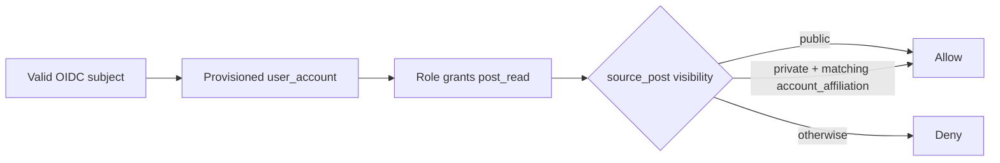

# LineageWeave DB-grounded product UX design

**Status:** Accepted implementation contract  
**Date:** 2026-08-14  
**Figma:** `https://www.figma.com/design/UpjgFQEu4u2Kr2hmyorAqe`  
**Canonical Figma page:** `DB-grounded UX`  
**Superseded concepts:** `Archive — superseded drafts`

## Goal

Turn LineageWeave's existing developer-oriented data surfaces into a
buyer-usable product without claiming states, relationships, histories, or
authorization semantics that the persistence and API layers cannot support.

The approved product has two clearly separated surfaces:

1. an evidence-linked workspace for records, reconstructed lineage,
   analytical identities, commitments, and calibrated reports; and
2. an administrative control surface for provisioned accounts, affiliations,
   account-global roles, effective permissions, and the currently implemented
   read-only access rule.

The design does not make the relational schema visible merely for debugging.
It uses the schema to determine which nouns, actions, cardinalities, and
explanations are truthful.

## Primary invariant: DB cardinality is the interaction contract

The interface must preserve the following independent relationships.

```mermaid
erDiagram
    user_account ||--o{ account_affiliation : has
    corporate_entity ||--o{ account_affiliation : scopes
    process_unit |o--o{ account_affiliation : narrows

    user_account ||--o{ account_role_assignment : receives
    access_role ||--o{ account_role_assignment : assigned
    access_role ||--o{ role_permission : grants

    source_post ||--o| post_summary_result : summarized
    post_summary_result ||--o{ post_summary_event : orders
    post_summary_result ||--o{ post_summary_role : derives
    source_post ||--o{ issue_ticket : owns
    source_post ||--o{ post_lineage_edge : parent
    source_post ||--o{ post_lineage_edge : child

    cataloged_person ||--o{ person_affiliation : has
    source_post ||--o{ post_person_mention : mentions
    cataloged_person ||--o{ post_person_mention : identified
    source_post ||--o{ post_team_mention : mentions
    cataloged_team ||--o{ post_team_mention : identified
    source_post ||--o{ post_organization_mention : mentions
    corporate_entity ||--o{ post_organization_mention : identified

    provenance_resource ||--o{ provenance_assertion : subject
    provenance_relation_definition ||--o{ provenance_assertion : predicate
```



Consequences:

- An account's affiliations and roles are edited in separate sections.
- A role assignment applies to the whole account because
  `account_role_assignment` has no affiliation key.
- Effective permissions are derived through `role_permission`; they are not
  editable account attributes.
- A `process_unit` is optional within an affiliation.
- A `source_post` remains the immutable evidence anchor for every derived
  summary, actor, ticket, chat answer, report member, and lineage view.
- Direct lineage and Knowledge Graph navigation are distinct relation types.
- Standards-complete PROV-O data remains separate from the compact product
  navigation graph.

## Data and identity boundary

The public product stack ships functional infrastructure with synthetic
identities and synthetic content, consistent with ADR 0001. The Figma file and
all committed screenshots use only synthetic names and values.

The analytical entity catalog is not an access-assignment list:

- `corporate_entity` contains the internal hierarchy used by affiliations;
- it can also contain externally discovered and corroborated customers,
  partners, competitors, suppliers, and plants;
- automatically generated analytical rows use the `AUTO-` code namespace;
- the current schema has no normalized `identity_assignable_flag` or
  `entity_origin_code`.

Until that schema gap is closed, an affiliation picker must use a fail-closed
assignability rule that excludes analytical `AUTO-*` entities. The UI must
explain this boundary instead of silently exposing every corporate entity as an
access scope.

## Product information architecture

```text
Workspace
├── Records
├── Lineage
├── Calendar
├── Reports
└── Entities

Administration
├── Accounts
├── Roles & permissions
└── System policy
```

There is no generic dashboard whose metrics depend on unmodeled lineage
history, assignment workflow, or account lifecycle state.

## Screen 1 — Records and direct lineage

### Buyer task

Find a visible source record, understand which records form the most plausible
thread, and open the evidence behind a node.

### Persisted sources

- `source_post`
- `post_lineage_edge`
- `common_lookup_value`
- current account permissions and affiliations

### Required behavior

- List only rows that pass `post_read` and the row-level visibility rule.
- Search and filter by fields actually exposed by the API.
- Show VOC type and visibility labels resolved from lookup codes.
- Group direct-lineage nodes by the persisted reconstruction grouping.
- Label the graph as a **plausible parent-child reconstruction**.
- Show `fused_score` as a score, not as causal certainty.
- Keep indirect Knowledge Graph links visually and semantically separate.
- Show the rebuild action only to an account with `post_admin`.

### Prohibited claims

- cause, outcome, decision, or business-stage semantics not stored on an edge;
- "recently changed" without graph version and change-history persistence;
- automatic risk or priority labels without a persisted derivation contract.

## Screen 2 — Record detail and cited evidence

### Buyer task

Read the source first, then inspect derived meaning and navigate to every
supporting record.

### Persisted sources

- `source_post`
- `post_summary_result`
- `post_summary_event`
- `post_summary_role`
- person, team, and organization mention tables
- `post_counterparty_entity`
- `issue_ticket`
- direct lineage plus indirect Knowledge Graph links
- `post_chat_result` and `post_chat_citation`
- the post activity stream

### Required hierarchy

1. source record and metadata;
2. summary and ordered key events;
3. roles and responsibilities with Person, Team, and Organization badges;
4. direct and indirect lineage neighborhood;
5. people, teams, organizations, affiliations, and corroboration status;
6. tickets and commitments;
7. activity;
8. lineage question and cited-source evidence.

The source body is not replaced by a summary. A chat answer must expose its
cited `source_post` records and provide a next action to open evidence.

### Unsupported surface

A PROV-O explorer becomes product-visible only after the exact current runtime
persists product assertions and exposes an ABAC-protected API. Schema
availability alone is not sufficient product wiring.

## Screen 3 — Analytical entity catalog

### Buyer task

See which stable people, teams, and organizations have been found across
records, understand their hierarchy and affiliations, and open every mentioned
record.

### Persisted sources

- `cataloged_person`
- `cataloged_team`
- `corporate_entity`
- `person_affiliation`
- post mention tables
- `organization_name_resolution`
- `post_counterparty_entity`
- `knowledge_graph_edge`

### Required behavior

- Distinguish People, Teams, and Organizations.
- Display the `corporate_entity.parent_entity_id` hierarchy.
- Preserve unresolved free-text affiliation names.
- Show canonical-name resolution separately from relationship corroboration.
- Display `AUTO-*` codes as analytical provenance, never as an access grant.
- Navigate from an identity to only records the current account may see.

## Screen 4 — Calendar and reports

### Buyer task

Act on dated commitments and inspect comparable period outputs without losing
the member records that support a score.

### Persisted sources

- `issue_ticket`
- `report_period_score`
- `report_member_score`
- `report_item_parameter`
- `report_item_information`

### Required behavior

- Calendar includes open dated tickets ordered by `due_date`.
- A commitment shows the owning record and current ticket status.
- Reports expose grouping kind, grouping key, period, model, convergence,
  mean theta, uncertainty, link method, anchor period, and member records.
- Report rebuild is available only with `post_admin`.
- The interface must not treat latent scores as source evidence; member records
  remain available for drill-down.

## Screen 5 — Accounts and access

### Buyer task

Provision an OIDC subject, assign internal affiliations, assign account-global
roles, and understand the resulting permissions.

### Persisted sources

- `user_account`
- `account_affiliation`
- `corporate_entity`
- `process_unit`
- `account_role_assignment`
- `access_role`
- `role_permission`

### Required behavior

The account detail page has four separate sections:

1. identity: display name, email, external subject, and creation time;
2. affiliations: corporate entity plus optional process unit;
3. assigned roles: account-global role memberships;
4. effective permissions: the union derived from assigned roles.

The UI explicitly warns that an account cannot be Viewer in one affiliation
and Admin in another under the current schema.

### Not modeled

Do not show or edit:

- invitation state;
- active, suspended, or locked status;
- access-audit history;
- role assignment scoped to an affiliation.

Those capabilities require normalized lifecycle, audit, or scoped-assignment
persistence and corresponding API contracts before entering the product.

## Screen 6 — Roles and read-only system policy

### Buyer task

Understand the coarse role-permission matrix and the exact row-level rule that
the running service enforces.

### Current vocabulary

```text
viewer → post_read
admin  → post_read + post_admin
```

The seeded vocabulary may grow, but the interface must render rows actually
stored in `access_role` and `role_permission`, not a fabricated Analyst role.

### Runtime authorization sequence



`abac_policy.condition_expression` is reserved for a future DSL. The current
backend evaluates the rule above directly. Therefore the policy surface is
read-only until a versioned evaluator, validation, simulation, rollback, and
audit contract exists.

## Copy contract

Every explanatory sentence helps the customer decide or take the next action.

Good:

- "Open the source record to inspect the evidence."
- "Add an internal affiliation to permit matching private records."
- "Assign a role to change the effective permission set."
- "Rebuild lineage to recompute direct parent-child candidates."

Avoid:

- implementation trivia without an action;
- raw UUIDs where a stable business label is available;
- reassuring claims that are not tied to persisted evidence.

## Accessibility and interaction

The implementation target is WCAG 2.2 Level AA and WAI-ARIA 1.2 semantics.

- Every action is reachable and operable by keyboard.
- Focus order follows the visual and evidence hierarchy.
- Dialogs and evidence drawers manage focus and have accessible names.
- Status is conveyed by text, not color alone.
- Text and interactive controls meet applicable contrast requirements.
- Tables use headers and accessible row actions.
- Graph nodes have a non-visual list or tree representation with the same
  navigation targets.
- Error and empty states identify the next available action.
- Reduced-motion preferences are respected.

## Security, privacy, and auditability

The design follows zero-trust principles: authentication does not imply record
access, and every record-scoped endpoint re-evaluates authorization.

PII is not made unusable through indiscriminate masking. Instead:

- access is least-privilege and row-scoped;
- the source record remains the evidence authority;
- derived identities retain provenance and visibility filtering;
- public fixtures are synthetic;
- production deployment requires retention, purpose, access review, export,
  correction, and deletion controls appropriate to its jurisdiction;
- administrative writes require immutable audit persistence before an "access
  audit" interface is claimed.

## Delivery order

When no PR owns the queue, implement the earliest incomplete coherent vertical
slice:

1. application shell and Records/direct Lineage;
2. Record Detail and cited evidence;
3. analytical Entity Catalog;
4. Calendar and Reports;
5. Accounts and Access;
6. Roles and read-only System Policy;
7. only then add lifecycle, audit, scoped-role, graph-version, or provenance
   explorer capabilities with their persistence and API contracts.

Each slice includes:

- production code;
- realistic synthetic regression tests;
- keyboard and accessibility assertions for UI work;
- migration plus fresh-install parity for schema changes;
- RBAC/ABAC integration tests for protected endpoints;
- architecture and user-action documentation;
- a changelog fragment;
- exact-head GitHub checks and an independent current-head approval.

## Ecosystem boundaries

- `mhtml-etl-gateway` owns governed ingestion of source artifacts.
- `contextual-orchestrator` owns LLM routing and multi-agent orchestration.
- `RankWeave` owns deterministic rank fusion.
- `ThreadWeave` owns thread assembly.
- `fast-mlsirm` and TEPP own calibrated measurement layers.
- `naruon` may import LineageWeave as a module, but LineageWeave remains usable
  as a standalone service.
- Central `.github` owns review, repair, merge, and security governance.

LineageWeave does not reimplement these capabilities. Integrations use explicit
wire contracts and unavailable-channel behavior rather than silent fallbacks.

## References

The authoritative APA 7 bibliography and implementation traceability are in
[`docs/doctoring/PRODUCT_UX_REFERENCES.md`](../../doctoring/PRODUCT_UX_REFERENCES.md).
