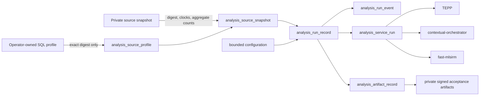

# Milestone 2 normalized analysis-run contract design

## Goal

Establish the smallest protected vertical slice that lets LineageWeave record an
actual private-PostgreSQL analysis as one auditable derivation without copying
private source identity or raw data into public source control, product APIs, or
routine logs.

## Product gap

The protected product already reconstructs direct and indirect lineage, exposes
React and FastAPI surfaces, persists summaries, Keymen, relationship evidence,
issues, reports, and PROV-O. The retained Milestone 2 experiment also proves
that direct private-source analysis can run. The missing bridge is a normalized,
source-redacting contract that can attach that execution evidence to the
protected product instead of replacing it with a parallel application.

## Selected approach



The SQL profile and credentials stay outside the product database. A deployment
may use a secret file, secret manager, or protected operator configuration. The
runtime database stores only an opaque key, revision, and exact digest.

## Temporal contract

The snapshot stores the latest evidence-availability time represented in the
run. The database and Python contract both require:

```text
maximum_available_time <= knowledge_cutoff
```

This aggregate constraint does not replace TEPP's per-document event,
assertion, document, system, available, and cutoff clocks. It is a product
acceptance guard proving that a run did not knowingly include evidence that was
unavailable at its stated historical cutoff.

## Data contract

Core data is normalized instead of stored in JSON:

- a profile revision determines one source kind and query digest;
- a snapshot determines one profile, source digest, cutoff, availability bound,
  and aggregate counts;
- a run determines one snapshot, actor, lifecycle, idempotency key, request
  digest, and timestamps;
- a configuration determines bounded execution choices for one run;
- events, service calls, and artifacts depend on their parent run.

Service- and artifact-specific payloads stay in versioned external artifacts and
are linked by digest and URI. This preserves extensibility without turning a
JSON blob into an ungoverned second database.

## API-safe projection

The first slice exposes a Python read projection used by the subsequent admin UI
and API slice. It contains:

- run ID and status;
- opaque profile key and revision;
- request and source digests;
- cutoff and maximum availability time;
- row, document, and thread counts;
- bounded configuration;
- start and completion timestamps.

It excludes SQL, DSN, source table, raw content, image bytes, provider secrets,
artifact bytes, and private source identifiers.

## Test-first sequence

1. Add failing unit contracts for exact hashing, canonical request hashing,
   temporal leakage, aggregate-count order, configuration bounds, lifecycle,
   and source-safe serialization.
2. Add failing repository tests for transactional registration, immutable
   profile/snapshot/idempotency conflicts, terminal status, and read
   serialization.
3. Add failing real-PostgreSQL tests for the `0018` schema and constraints.
4. Implement the pure evidence contracts.
5. Implement the transaction repository.
6. Add the normalized migration and Docker fresh-install wiring.
7. Run focused branch coverage and require 100% for both new production modules.
8. Run the complete Python, PostgreSQL, frontend, build, security, and exact-head
   review gates after the stack reaches protected `main`.

## Deferred slices

- authenticated `GET /api/analysis-runs` and the read-only System Policy UI;
- source-profile secret-manager adapter;
- bounded direct-source execution and ingestion worker;
- TEPP semantic-span import/REST adapter after TEPP ADR 0017 implementation;
- contextual-orchestrator workflow adapter after canonical API and multimodal
  message PRs merge;
- private actual-data execution, browser E2E, and signed aggregate acceptance
  manifest;
- reconciliation of retained experimental run evidence into this schema.
