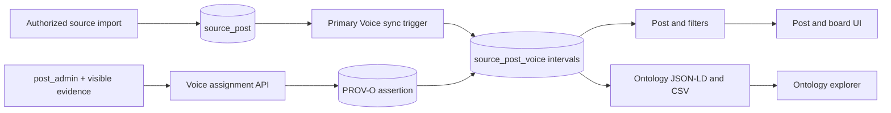

# Voice-of-X Combination Technical Requirements

This supporting TRD projects ADR 0246, ADR 0256, and ADR 0252. Those ADRs are
normative when this document and an implementation differ.

## Scope

LineageWeave represents a Post's explicitly supplied stakeholder perspectives
without assuming a company, B2B2C chain, or exhaustive industry taxonomy. One
imported primary Voice and zero or more evidence-bearing additional Voices are
atomic assignments; combinations are sets of rows, never compound codes.

## Requirements

| ID | Requirement | Verification |
|---|---|---|
| VOC-TR-1 | `source_post.voc_type_code` owns the imported primary; additional assignments cannot demote it | Database trigger and API conflict tests |
| VOC-TR-2 | Every additional Voice references a normalized PROV-O derivation and governed truth status | Foreign keys, category trigger, authenticated write test |
| VOC-TR-3 | Primary assignments use non-overlapping half-open effective intervals and allow A → B → A under serialized concurrent source updates | GiST exclusion constraint and PostgreSQL integration tests |
| VOC-TR-4 | Live reads select current rows; cutoff reads select the containing interval; ontology continuation uses its frozen snapshot when no cutoff exists | Backend SQL-contract tests and authenticated cutoff API test |
| VOC-TR-5 | Post, filter, ontology JSON-LD, exact-value CSV, and UI apply the same RBAC/ABAC and source-eligibility boundary | API, SHACL, frontend interaction, and accessibility tests |
| VOC-TR-6 | Voice stays separate from counterparty relationship, role, topic, channel, lifecycle, and stakeholder salience | ADR/schema review and ontology round-trip tests |
| VOC-TR-7 | Migration replay preserves existing starts and never reconstructs deleted pre-migration history | Migration replay test and non-identifying runtime evidence |

## Read contract

```text
reference_time = knowledge_cutoff ?? ontology_snapshot ?? live
live            = effective_to IS NULL
historical      = effective_from <= reference_time < effective_to
open historical = effective_from <= reference_time AND effective_to IS NULL
```

The interval is lower-inclusive and upper-exclusive. The exact primary-change
instant belongs to the new primary, so a read cannot return two primary rows.

ADR 0256's evidence authorization also applies after an assignment is recorded.
Post detail, list labels, filter options, and filtered totals must reauthorize
the actual derivation evidence on each read. Making that evidence private,
draft, or deleted omits the additional assignment in both live and cutoff
views, without changing its persisted truth, interval, or provenance. A cutoff
cannot admit an evidence Post created after that instant. Restoring access
allows the same persisted assignment to be read again. The carrying Post is
never substituted for hidden evidence.

## Component flow



## Failure behavior

- Missing or hidden evidence rejects or omits the additional assignment; it is
  never replaced with a placeholder.
- Unknown Voice/truth categories fail with a database check error.
- Overlapping imported-primary intervals fail at the database boundary.
- Cutoffs before retained history return an explicit unavailable state rather
  than the current value.
